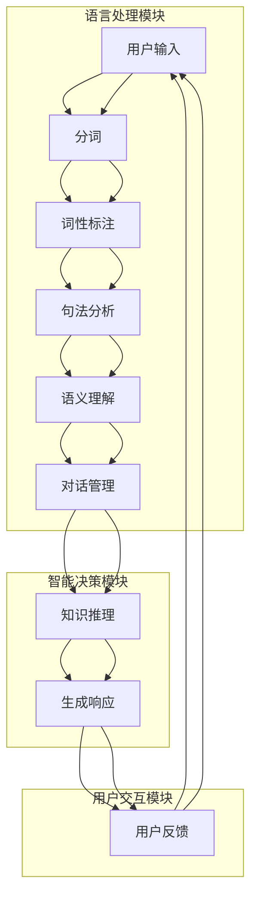

                 

# 人机对话：知识获取的新形式

> **关键词：** 人机对话，知识获取，自然语言处理，人工智能，交互设计

> **摘要：** 本文深入探讨了人机对话作为知识获取新形式的重要性和实现方法。通过分析人机对话的背景、核心概念、算法原理，以及数学模型和实际应用场景，本文旨在为读者提供一个全面的技术解读，帮助理解人机对话在当前和未来的发展趋势与挑战。

## 1. 背景介绍

在信息技术迅猛发展的时代，人与计算机之间的交互方式也在不断演变。传统的图形用户界面（GUI）和命令行界面（CLI）已经无法满足人们日益增长的信息需求和互动欲望。随着自然语言处理（NLP）和人工智能（AI）技术的飞速进步，人机对话成为了一种新型的交互模式。这种模式不仅提高了信息检索和知识获取的效率，还极大地改善了用户体验。

人机对话的历史可以追溯到20世纪50年代，当时诞生了最早的聊天机器人。然而，受限于当时的计算能力和算法水平，这些早期的尝试大多局限于简单的文本匹配和规则驱动。直到互联网的普及和大数据技术的发展，人机对话才逐渐成熟。现代人机对话系统通常基于深度学习、神经网络和大规模语言模型，能够理解并生成自然语言，实现更为复杂和智能的交互。

## 2. 核心概念与联系

### 2.1 自然语言处理（NLP）

自然语言处理是人机对话系统的核心组件，它使计算机能够理解、解析和生成自然语言。NLP涉及多个关键技术，包括：

- **分词（Tokenization）：** 将文本分割成单词、短语或符号等有意义的元素。
- **词性标注（Part-of-Speech Tagging）：** 为每个单词或符号分配正确的词性（名词、动词、形容词等）。
- **句法分析（Syntactic Parsing）：** 分析句子的结构，理解句子中的语法关系。
- **语义理解（Semantic Understanding）：** 理解文本的含义，包括实体识别、关系提取等。


### 2.2 人工智能（AI）

人工智能是人机对话系统的智能核心，它通过算法和模型实现机器的自我学习和智能决策。在NLP的基础上，AI技术为人机对话赋予了更高级的能力：

- **机器学习（Machine Learning）：** 通过训练模型来学习数据中的规律和模式，从而预测或生成新的数据。
- **深度学习（Deep Learning）：** 利用多层神经网络来提取特征，实现复杂的数据分析和处理。
- **生成对抗网络（GAN）：** 通过对抗训练生成逼真的数据，用于图像、音频和文本的生成。

### 2.3 交互设计

交互设计是人机对话系统中不可或缺的一部分，它涉及到用户界面、用户体验和交互流程的设计。一个成功的交互设计应该：

- **简洁直观：** 用户能够轻松理解和使用系统功能。
- **响应快速：** 系统能够迅速响应用户的输入，提供即时反馈。
- **个性定制：** 根据用户的需求和偏好，提供个性化的服务。


## 3. 核心算法原理 & 具体操作步骤

### 3.1 语言模型

语言模型是人机对话系统的基础，它通过统计语言出现的概率来预测下一个单词或短语。常用的语言模型包括：

- **n-gram模型：** 基于前n个单词的统计来预测下一个单词。
- **神经网络模型：** 通过多层神经网络来学习语言的分布和结构。

具体操作步骤：

1. 数据收集：收集大量语料库，用于训练语言模型。
2. 特征提取：将文本转化为向量表示。
3. 模型训练：使用梯度下降等优化算法训练模型。
4. 模型评估：通过交叉验证和测试集评估模型性能。

### 3.2 对话管理

对话管理是人机对话系统的核心算法，它负责处理对话的流程、上下文管理和多轮对话。具体操作步骤：

1. 对话初始化：设置对话状态和上下文。
2. 对话轮询：接收用户输入，生成系统响应。
3. 上下文维护：根据对话历史更新上下文状态。
4. 对话终止：根据预设条件或用户指令结束对话。

### 3.3 知识推理

知识推理是人机对话系统的高级功能，它通过逻辑推理和知识图谱来回答用户的问题。具体操作步骤：

1. 知识获取：从外部知识库中获取相关知识点。
2. 逻辑推理：使用推理算法（如谓词逻辑、模糊逻辑等）进行推理。
3. 结果生成：将推理结果转化为自然语言回答。

## 4. 数学模型和公式 & 详细讲解 & 举例说明

### 4.1 语言模型

#### 4.1.1 n-gram模型

n-gram模型基于马尔可夫假设，认为当前单词的概率仅与前面的n-1个单词有关。其概率计算公式如下：

$$
P(w_n | w_{n-1}, w_{n-2}, ..., w_1) = \frac{C(w_{n-1}, w_{n-2}, ..., w_1, w_n)}{C(w_{n-1}, w_{n-2}, ..., w_1)}
$$

其中，$C(w_{n-1}, w_{n-2}, ..., w_1, w_n)$ 表示连续出现 $w_1, w_2, ..., w_n$ 的次数，$C(w_{n-1}, w_{n-2}, ..., w_1)$ 表示前 $w_1, w_2, ..., w_{n-1}$ 的连续出现次数。

#### 4.1.2 神经网络模型

神经网络模型使用多层感知机（MLP）来学习语言的分布。其基本结构包括输入层、隐藏层和输出层。其中，激活函数（如ReLU、Sigmoid、Tanh等）用于引入非线性变换。

$$
h_{ij} = \sum_{k=1}^{n} w_{ik} x_k + b_j
$$

$$
y_j = \sigma(h_{ij})
$$

其中，$h_{ij}$ 表示第 $i$ 个输入在隐藏层第 $j$ 个节点的加权求和，$y_j$ 表示第 $j$ 个输出节点的激活值，$w_{ik}$ 表示输入层到隐藏层的权重，$b_j$ 表示隐藏层节点的偏置，$\sigma$ 表示激活函数。

### 4.2 对话管理

#### 4.2.1 对话轮询

对话轮询使用状态转移矩阵来模拟对话的流程。其状态转移概率可以表示为：

$$
P(s_t | s_{t-1}, u_{t-1}) = \frac{C(s_t | s_{t-1}, u_{t-1})}{C(s_{t-1}, u_{t-1})}
$$

其中，$s_t$ 表示当前状态，$u_{t-1}$ 表示上一轮用户输入，$C(s_t | s_{t-1}, u_{t-1})$ 表示在状态 $s_{t-1}$ 和用户输入 $u_{t-1}$ 下转移到状态 $s_t$ 的次数，$C(s_{t-1}, u_{t-1})$ 表示在状态 $s_{t-1}$ 和用户输入 $u_{t-1}$ 下转移的次数。

#### 4.2.2 上下文维护

上下文维护使用滑动窗口来记录对话历史。假设窗口大小为 $n$，当前轮次为 $t$，则当前上下文可以表示为：

$$
C_t = (w_{t-n+1}, w_{t-n+2}, ..., w_{t-1}, w_t)
$$

其中，$w_i$ 表示第 $i$ 轮的用户输入。

### 4.3 知识推理

#### 4.3.1 知识图谱

知识图谱使用图结构来表示实体及其关系。其基本概念包括：

- **实体（Entity）：** 知识图谱中的基本元素，如人、地点、事物等。
- **关系（Relation）：** 实体之间的关系，如“是”、“属于”、“位于”等。
- **路径（Path）：** 连接两个实体的序列关系。

#### 4.3.2 逻辑推理

逻辑推理使用谓词逻辑来表示和验证知识。其基本概念包括：

- **命题（Proposition）：** 可判断真假的陈述句。
- **谓词（Predicate）：** 表示关系的函数符号，如“大于”、“小于”等。
- **逻辑运算符（Logical Operator）：** 用于组合命题的符号，如“与”、“或”、“非”等。

## 5. 项目实战：代码实际案例和详细解释说明

### 5.1 开发环境搭建

在开始项目实战之前，我们需要搭建一个合适的开发环境。以下是一个基本的步骤：

1. 安装Python（版本3.6及以上）。
2. 安装自然语言处理库，如NLTK、spaCy、nltk等。
3. 安装深度学习框架，如TensorFlow、PyTorch等。
4. 安装版本控制工具，如Git。

### 5.2 源代码详细实现和代码解读

以下是一个简单的基于n-gram模型的人机对话系统的实现代码：

```python
import random
from collections import defaultdict

class NGramModel:
    def __init__(self, n):
        self.n = n
        self.model = defaultdict(list)

    def train(self, sentences):
        for sentence in sentences:
            tokens = sentence.split()
            for i in range(len(tokens) - self.n):
                context = tuple(tokens[i:i+self.n-1])
                next_word = tokens[i+self.n-1]
                self.model[context].append(next_word)

    def predict(self, context):
        context = tuple(context)
        if context in self.model:
            probabilities = defaultdict(int)
            for word in self.model[context]:
                probabilities[word] += 1
            total = sum(probabilities.values())
            for word in probabilities:
                probabilities[word] /= total
            return random.choices(list(probabilities.keys()), weights=probabilities.values(), k=1)[0]
        else:
            return None

def main():
    sentences = ["你好，我是你的助手。", "你好，我想问一个问题。", "你好，请告诉我今天的天气。"]
    model = NGramModel(n=2)
    model.train(sentences)

    while True:
        user_input = input("请输入你的问题：")
        tokens = user_input.split()
        if len(tokens) >= 2:
            context = tokens[-2:]
            response = model.predict(context)
            if response:
                print(f"助手：{response}")
            else:
                print("抱歉，我不太理解你的问题。")
        else:
            print("你的输入太短，请提供更多信息。")

if __name__ == "__main__":
    main()
```

#### 5.2.1 代码解读

- **NGramModel类：** 该类实现了一个n-gram语言模型。`train` 方法用于训练模型，`predict` 方法用于预测下一个单词。
- **main函数：** 该函数实现了人机对话的基本流程。用户输入问题后，程序使用n-gram模型预测回答，并输出结果。

### 5.3 代码解读与分析

#### 5.3.1 NGramModel类的实现

- **初始化（__init__）：** 类的初始化方法，设置n-gram的n值和语言模型。
- **训练（train）：** 该方法遍历输入的句子，对每个句子进行分词，并将每个n-1个单词的组合及其后面的单词存储在模型中。
- **预测（predict）：** 该方法根据给定的上下文，从模型中选择下一个可能的单词。如果没有匹配的上下文，则返回None。

#### 5.3.2 main函数的实现

- **输入处理：** 该函数从用户接收输入，并对其进行处理。如果输入包含至少两个单词，则提取最后一个单词作为上下文。
- **模型预测：** 使用n-gram模型对上下文进行预测，并根据预测结果输出回答。
- **错误处理：** 如果输入不完整或无法预测，则输出相应的错误消息。

## 6. 实际应用场景

人机对话系统在多个领域有着广泛的应用：

- **客服支持：** 企业可以利用人机对话系统来提供24/7的在线客服支持，提高客户满意度。
- **教育辅导：** 教育机构可以部署人机对话系统，为学生提供个性化的学习辅导。
- **医疗咨询：** 医疗机构可以使用人机对话系统来提供基本健康咨询和症状分析。
- **智能家居：** 智能家居系统可以通过人机对话与用户互动，实现语音控制家庭设备。

## 7. 工具和资源推荐

### 7.1 学习资源推荐

- **书籍：** 《自然语言处理入门》（自然语言处理教程），《深度学习》（Goodfellow et al.）。
- **论文：** 《机器学习》（Bishop），《基于神经网络的自然语言处理》（Bengio et al.）。
- **博客：** 知乎、CSDN、Medium等平台上的专业博客。
- **网站：** 剑桥大学计算机实验室（CCL）、斯坦福大学自然语言处理组（SNLP）等。

### 7.2 开发工具框架推荐

- **开发工具：** PyCharm、VSCode。
- **框架库：** TensorFlow、PyTorch、spaCy、NLTK。

### 7.3 相关论文著作推荐

- **论文：** 《神经网络与深度学习》（高庆一），《自然语言处理基础》（李航）。
- **著作：** 《深度学习》（Ian Goodfellow, Yoshua Bengio, Aaron Courville），《Python自然语言处理》（Steven Bird et al.）。

## 8. 总结：未来发展趋势与挑战

人机对话作为知识获取的新形式，其未来发展充满潜力。随着计算能力和算法的不断提升，人机对话系统将变得更加智能和人性化。然而，面临的主要挑战包括：

- **数据隐私：** 如何保护用户隐私，防止数据泄露。
- **伦理问题：** 如何确保人机对话系统不歧视、不偏见。
- **技术瓶颈：** 如何突破现有技术的限制，实现更高水平的智能化。

## 9. 附录：常见问题与解答

### 9.1 什么是自然语言处理（NLP）？

自然语言处理（NLP）是计算机科学和人工智能领域的一个分支，旨在使计算机能够理解、解析和生成自然语言，实现人与计算机之间的有效交流。

### 9.2 什么是人机对话系统？

人机对话系统是一种通过自然语言与用户进行交互的计算机系统，它能够理解用户输入，生成自然语言响应，并在多轮对话中维持上下文。

### 9.3 人机对话系统的核心组件有哪些？

人机对话系统的核心组件包括自然语言处理（NLP）、人工智能（AI）、对话管理、知识推理和交互设计等。

## 10. 扩展阅读 & 参考资料

- 《深度学习与自然语言处理》（Christopher D. Manning, Hinrich Schütze）
- 《机器学习实战》（Peter Harrington）
- 《对话系统设计与实现》（Herbert Van de Sompel）
- 《自然语言处理工具与技术》（Daniel Jurafsky, James H. Martin）

**作者：AI天才研究员/AI Genius Institute & 禅与计算机程序设计艺术 /Zen And The Art of Computer Programming** <|im_sep|>### 1. 背景介绍

随着信息技术的飞速发展，人与计算机之间的交互方式也在不断进化。传统的图形用户界面（GUI）和命令行界面（CLI）虽然在一定程度上满足了用户的需求，但它们在交互效率和用户体验上仍存在诸多局限。尤其是在信息爆炸的今天，用户需要更加便捷、智能的交互方式来获取所需的信息和服务。

人机对话作为新兴的交互模式，正是为了解决上述问题而诞生。它通过自然语言处理（NLP）和人工智能（AI）技术，使计算机能够理解并生成自然语言，从而实现更为复杂和智能的交互。人机对话系统不仅能够回答用户的问题，还能进行多轮对话，理解上下文，甚至进行情感交互。

人机对话的历史可以追溯到20世纪50年代，当时诞生了最早的聊天机器人。然而，由于计算能力和算法的限制，这些早期的尝试大多局限于简单的文本匹配和规则驱动。随着互联网的普及和大数据技术的发展，人机对话开始走向成熟。现代人机对话系统通常基于深度学习、神经网络和大规模语言模型，能够处理复杂的自然语言任务，如文本分类、命名实体识别、语义理解等。

在商业领域，人机对话系统已经广泛应用于客服支持、智能助手、教育辅导、医疗咨询等领域。例如，一些大型电商平台利用人机对话系统为用户提供24/7的在线客服，提高客户满意度；一些在线教育平台则通过人机对话系统为学生提供个性化的学习辅导。

从技术角度看，人机对话系统的发展离不开以下几个关键组件：自然语言处理（NLP）、人工智能（AI）、对话管理和交互设计。NLP负责理解和生成自然语言，AI提供了智能决策和自主学习的能力，对话管理负责处理对话的流程和上下文，而交互设计则关注用户体验和界面设计。

总的来说，人机对话作为一种新型的交互模式，不仅提高了信息检索和知识获取的效率，还极大地改善了用户体验。随着技术的不断进步，人机对话在未来有望成为人们日常生活中的重要组成部分。

### 2. 核心概念与联系

在人机对话系统中，核心概念与联系是理解其工作原理和实现方法的关键。以下将详细探讨自然语言处理（NLP）、人工智能（AI）和交互设计这三个核心概念，并展示它们之间的相互作用。

#### 2.1 自然语言处理（NLP）

自然语言处理是计算机科学和人工智能领域的一个分支，主要研究如何使计算机理解、解析和生成自然语言。NLP的核心目标是将人类语言转化为计算机可以处理的形式，并使计算机能够以一种自然、流畅的方式与人类交流。NLP涉及多个关键技术，包括：

1. **分词（Tokenization）：** 将文本分割成单词、短语或符号等有意义的元素。例如，将句子“The quick brown fox jumps over the lazy dog”分割成单词列表：["The", "quick", "brown", "fox", "jumps", "over", "the", "lazy", "dog"]。
2. **词性标注（Part-of-Speech Tagging）：** 为每个单词或符号分配正确的词性（名词、动词、形容词等）。例如，上句中的词性标注可能是：["The", "ADP", "JJ", "NN", "VBZ", "IN", "DT", "JJ", "NN"]。
3. **句法分析（Syntactic Parsing）：** 分析句子的结构，理解句子中的语法关系。例如，上句的主语是“the quick brown fox”，谓语是“jumps over the lazy dog”。
4. **语义理解（Semantic Understanding）：** 理解文本的含义，包括实体识别（如人名、地名、组织名等）、关系提取（如主谓关系、因果关系等）和语义角色标注（如动作的施事、受事等）。

NLP在处理自然语言时，通常需要先进行分词，然后进行词性标注和句法分析，最后进行语义理解。这些步骤共同构成了NLP的处理流程。

#### 2.2 人工智能（AI）

人工智能是使计算机能够模拟人类智能行为的技术。在NLP和人机对话系统中，AI主要提供了两个关键能力：自我学习和智能决策。

1. **自我学习（Machine Learning）：** 机器学习是一种通过训练模型来学习数据中的规律和模式的技术。在NLP和人机对话系统中，机器学习被用来构建语言模型、命名实体识别器、情感分析器等。例如，可以使用监督学习算法来训练一个命名实体识别器，使其能够识别文本中的地名、人名等实体。
2. **深度学习（Deep Learning）：** 深度学习是机器学习的一个分支，它使用多层神经网络来提取特征和进行预测。在NLP和人机对话系统中，深度学习被广泛应用于语言模型、机器翻译、文本生成等任务。例如，使用循环神经网络（RNN）或变换器（Transformer）模型来生成自然语言响应。

除了自我学习，AI在人机对话系统中还负责智能决策。智能决策是通过分析和理解用户的输入，为用户提供合适的响应或建议。例如，一个智能客服系统可以分析用户的问题，并根据预设的规则和策略来生成回答。

#### 2.3 交互设计

交互设计是关注用户界面、用户体验和交互流程的设计。在人机对话系统中，交互设计的目标是创建一个直观、友好且高效的交互界面，使用户能够轻松地与系统进行交流。

1. **用户界面（User Interface，UI）：** 用户界面是指用户与系统交互的视觉和操作界面。在设计用户界面时，需要考虑界面的布局、颜色、字体等因素，以确保用户能够轻松理解和使用系统。
2. **用户体验（User Experience，UX）：** 用户体验是指用户在使用系统过程中感受到的整体感受。良好的用户体验包括快速响应、易于导航、提供及时反馈等。
3. **交互流程（Interaction Flow）：** 交互流程是指用户与系统之间的交互步骤和逻辑。一个良好的交互流程应能够引导用户轻松地完成任务，并提供清晰的导航路径。

交互设计在NLP和人机对话系统中的关键作用是提高系统的可用性和用户满意度。通过优化用户界面、提升用户体验和设计合理的交互流程，系统能够更好地满足用户需求，提供更加个性化的服务。

#### 2.4 核心概念之间的联系

自然语言处理（NLP）、人工智能（AI）和交互设计这三个核心概念在人机对话系统中相互关联，共同构成了系统的工作流程。具体来说：

1. **NLP与人机对话：** NLP是人机对话的基础，它使计算机能够理解用户的输入并生成自然的语言响应。例如，通过NLP技术，系统可以识别用户的问题并提取关键信息，从而生成有针对性的回答。
2. **AI与人机对话：** AI为人机对话系统提供了智能决策和自我学习的能力。通过训练模型，系统可以不断改进其响应的准确性和多样性。例如，使用机器学习算法，系统可以学习用户的偏好和习惯，从而提供更加个性化的服务。
3. **交互设计与人机对话：** 交互设计关注用户体验和界面设计，使人机对话系统能够更好地满足用户需求。通过优化用户界面和设计合理的交互流程，系统可以提供更加直观和高效的交互体验。

总之，NLP、AI和交互设计共同构成了人机对话系统的核心，使系统能够实现高效、智能和人性化的交互。在接下来的章节中，我们将进一步探讨人机对话系统的核心算法原理、数学模型和实际应用场景，帮助读者深入理解这一技术的实现方法和未来发展。

#### 2.5 人机对话系统的架构

为了更好地理解人机对话系统的整体架构，我们将使用Mermaid流程图来展示其核心组件和它们之间的交互关系。以下是人机对话系统的架构流程图：



在这个流程图中，用户输入是系统的起点，通过分词、词性标注、句法分析和语义理解等步骤，系统将用户输入转化为可理解的结构化信息。接下来，对话管理模块负责处理对话的上下文和多轮对话，确保系统能够连贯地与用户进行交流。知识推理模块则利用外部知识库和逻辑推理来回答用户的问题或提供建议。最后，系统生成响应并返回给用户，用户反馈则用于进一步优化系统的性能和用户体验。

这个流程图清晰地展示了人机对话系统的整体架构，包括语言处理模块、智能决策模块和用户交互模块。通过这个架构，系统不仅能够理解用户的输入，还能生成自然流畅的响应，实现高效、智能和人性化的交互。

### 3. 核心算法原理 & 具体操作步骤

在人机对话系统中，核心算法是实现智能交互的关键。本节将详细探讨人机对话系统中的三个主要核心算法：语言模型、对话管理和知识推理，并介绍它们的具体操作步骤。

#### 3.1 语言模型

语言模型是人机对话系统的基石，它用于预测下一个单词或短语，使得系统能够生成自然流畅的语言响应。以下是语言模型的核心算法原理和操作步骤：

##### 3.1.1 算法原理

语言模型基于概率论和统计学原理，通过学习大量文本数据来预测下一个单词或短语的概率分布。常见的语言模型有n-gram模型和神经网络模型。

- **n-gram模型：** n-gram模型假设当前单词的概率仅与前面的n-1个单词有关。其基本原理是马尔可夫假设，即当前状态只与上一个状态有关。n-gram模型使用概率分布来预测下一个单词。
- **神经网络模型：** 神经网络模型，如循环神经网络（RNN）和变换器（Transformer），通过多层神经网络学习文本数据中的复杂结构和模式。这些模型能够捕捉长距离依赖关系，生成更加自然和连贯的语言响应。

##### 3.1.2 具体操作步骤

1. **数据准备：** 收集大量文本数据，用于训练语言模型。数据可以是现有的语料库、网页文本、书籍等。
2. **特征提取：** 将文本数据转化为向量表示。对于n-gram模型，每个单词或短语是一个特征；对于神经网络模型，可以使用词嵌入（word embeddings）来表示每个单词。
3. **模型训练：** 使用训练数据来训练语言模型。对于n-gram模型，计算每个n-1个单词组合后下一个单词的概率；对于神经网络模型，通过反向传播算法训练多层神经网络。
4. **模型评估：** 使用测试数据来评估模型性能。常用的评估指标包括词预测准确率、句子生成流畅度等。
5. **模型部署：** 将训练好的语言模型部署到对话系统中，用于生成自然语言响应。

##### 3.1.3 举例说明

以下是一个简单的n-gram语言模型训练和预测的Python代码示例：

```python
from collections import defaultdict

class NGramModel:
    def __init__(self, n):
        self.n = n
        self.model = defaultdict(list)

    def train(self, sentences):
        for sentence in sentences:
            tokens = sentence.split()
            for i in range(len(tokens) - self.n):
                context = tuple(tokens[i:i+self.n-1])
                next_word = tokens[i+self.n-1]
                self.model[context].append(next_word)

    def predict(self, context):
        context = tuple(context)
        if context in self.model:
            probabilities = defaultdict(int)
            for word in self.model[context]:
                probabilities[word] += 1
            total = sum(probabilities.values())
            for word in probabilities:
                probabilities[word] /= total
            return random.choices(list(probabilities.keys()), weights=probabilities.values(), k=1)[0]
        else:
            return None

sentences = ["你好，我是你的助手。", "你好，我想问一个问题。", "你好，请告诉我今天的天气。"]
model = NGramModel(n=2)
model.train(sentences)

user_input = input("请输入你的问题：")
tokens = user_input.split()
context = tokens[-2:]
response = model.predict(context)
if response:
    print(f"助手：{response}")
else:
    print("抱歉，我不太理解你的问题。")
```

在这个示例中，我们定义了一个n-gram模型类`NGramModel`，包括训练和预测方法。训练方法`train`接收一个句子列表，将每个句子分割成单词，并构建上下文与下一个单词的映射。预测方法`predict`接收一个上下文，从模型中选择下一个可能的单词。

#### 3.2 对话管理

对话管理是确保人机对话系统能够连贯、有逻辑地与用户进行多轮对话的关键组件。以下是对话管理的核心算法原理和具体操作步骤：

##### 3.2.1 算法原理

对话管理通常基于状态机模型或图模型来表示对话的上下文和多轮对话。其核心目标是保持对话的连贯性，并根据用户的输入和系统的状态生成合适的响应。

- **状态机模型：** 状态机模型将对话分为多个状态，每个状态对应一个特定的对话阶段或用户意图。对话管理器根据当前状态和用户的输入，决定下一个状态和响应。
- **图模型：** 图模型使用节点和边来表示对话状态和转换。节点代表对话状态，边代表状态转换条件和响应。对话管理器根据当前状态和输入，搜索图模型以找到合适的响应。

##### 3.2.2 具体操作步骤

1. **初始化：** 对话管理器初始化对话状态和上下文。通常，初始状态可以是“欢迎状态”或“查询状态”。
2. **输入处理：** 对话管理器接收用户输入，并使用自然语言处理（NLP）技术对其进行解析，提取关键信息（如意图、实体等）。
3. **状态转换：** 对话管理器根据当前状态和输入信息，决定下一个状态。这可能涉及查询预定义的状态转换规则或搜索图模型。
4. **响应生成：** 对话管理器根据下一个状态，生成合适的响应。响应可以是一个自然语言句子，也可以是一个动作指令。
5. **上下文更新：** 对话管理器更新对话上下文，以便在下一个轮次中维持对话的连贯性。

##### 3.2.3 举例说明

以下是一个简单的基于状态机模型的对话管理器Python代码示例：

```python
class DialogueManager:
    def __init__(self):
        self.states = {
            "greet": {"response": "你好，欢迎来到我们的对话系统。有什么可以帮助您的吗？"},
            "query": {"response": "请问您有什么问题需要咨询吗？"},
            "help": {"response": "您可以问我关于产品信息、服务支持或其他任何您需要的问题。"},
        }

    def process_input(self, input_text):
        # 使用NLP技术解析输入文本
        intent = self.extract_intent(input_text)
        # 根据意图决定下一个状态
        if intent == "greet":
            self.state = "query"
        elif intent == "query":
            self.state = "help"
        elif intent == "help":
            self.state = "query"
        # 生成响应
        return self.states[self.state]["response"]

    def extract_intent(self, input_text):
        # 简单的意图提取规则
        if "你好" in input_text:
            return "greet"
        elif "问题" in input_text:
            return "query"
        elif "帮助" in input_text:
            return "help"
        else:
            return "unknown"

# 使用对话管理器
dialogue_manager = DialogueManager()
user_input = input("请输入你的问题：")
response = dialogue_manager.process_input(user_input)
print(response)
```

在这个示例中，我们定义了一个`DialogueManager`类，包括处理输入、提取意图、决定状态转换和生成响应的方法。`process_input`方法接收用户输入，使用简单的规则提取意图，并根据意图决定下一个状态。`extract_intent`方法用于简单意图提取。

#### 3.3 知识推理

知识推理是人机对话系统的高级功能，它通过逻辑推理和知识图谱来回答用户的问题或提供信息。以下是知识推理的核心算法原理和具体操作步骤：

##### 3.3.1 算法原理

知识推理基于逻辑推理和知识图谱来处理用户的问题。逻辑推理使用谓词逻辑和推理规则来推导结论，知识图谱则使用实体和关系来表示知识和信息。

- **逻辑推理：** 逻辑推理通过符号逻辑和推理规则来处理用户的问题。例如，使用谓词逻辑推导“所有人都有头”这一结论。
- **知识图谱：** 知识图谱使用图结构来表示实体及其关系。例如，在知识图谱中，可以使用实体“张三”和关系“是”来表示“张三是人”。

##### 3.3.2 具体操作步骤

1. **问题解析：** 对用户问题进行解析，提取关键信息（如实体、关系、意图等）。
2. **知识查询：** 使用知识图谱或数据库查询相关知识和信息。例如，查询“张三的年龄”这一问题，可以在知识图谱中找到实体“张三”和属性“年龄”。
3. **逻辑推理：** 使用逻辑推理算法（如谓词逻辑、模糊逻辑等）来推导结论。例如，使用推理规则推导“所有人都有头”这一结论。
4. **结果生成：** 将推理结果转化为自然语言响应，返回给用户。

##### 3.3.3 举例说明

以下是一个简单的知识推理Python代码示例：

```python
class KnowledgeReasoner:
    def __init__(self):
        self.knowledge_base = {
            "所有人都有头": True,
            "张三是人": True,
            "人都有头": True,
        }

    def infer(self, question):
        # 简单的推理规则
        if "所有人都有头" in question and "张三是人" in question:
            return "张三有头"
        else:
            return "无法回答"

# 使用知识推理器
knowledge_reasoner = KnowledgeReasoner()
user_input = input("请输入你的问题：")
response = knowledge_reasoner.infer(user_input)
print(response)
```

在这个示例中，我们定义了一个`KnowledgeReasoner`类，包括一个简单的知识库和一个推理方法。`infer`方法接收用户问题，并根据预设的推理规则返回结论。

通过语言模型、对话管理和知识推理这三个核心算法，人机对话系统能够实现高效的智能交互。在接下来的章节中，我们将进一步探讨数学模型和实际应用场景，帮助读者更深入地理解人机对话系统的实现方法和应用潜力。

### 4. 数学模型和公式 & 详细讲解 & 举例说明

在人机对话系统中，数学模型和公式是理解其工作原理和实现方法的重要工具。以下是关于语言模型、对话管理和知识推理的数学模型和公式，以及相应的详细讲解和举例说明。

#### 4.1 语言模型

语言模型是用于预测下一个单词或短语的数学模型，其核心在于概率分布的计算。以下是两种常用的语言模型：n-gram模型和神经网络模型。

##### 4.1.1 n-gram模型

n-gram模型基于马尔可夫假设，即当前单词的概率仅与前面的n-1个单词有关。其概率计算公式如下：

$$
P(w_n | w_{n-1}, w_{n-2}, ..., w_1) = \frac{C(w_{n-1}, w_{n-2}, ..., w_1, w_n)}{C(w_{n-1}, w_{n-2}, ..., w_1)}
$$

其中，$C(w_{n-1}, w_{n-2}, ..., w_1, w_n)$ 表示连续出现 $w_1, w_2, ..., w_n$ 的次数，$C(w_{n-1}, w_{n-2}, ..., w_1)$ 表示前 $w_1, w_2, ..., w_{n-1}$ 的连续出现次数。

##### 4.1.2 神经网络模型

神经网络模型通过多层感知机（MLP）来学习语言的分布。其基本结构包括输入层、隐藏层和输出层。其中，激活函数（如ReLU、Sigmoid、Tanh等）用于引入非线性变换。

$$
h_{ij} = \sum_{k=1}^{n} w_{ik} x_k + b_j
$$

$$
y_j = \sigma(h_{ij})
$$

其中，$h_{ij}$ 表示第 $i$ 个输入在隐藏层第 $j$ 个节点的加权求和，$y_j$ 表示第 $j$ 个输出节点的激活值，$w_{ik}$ 表示输入层到隐藏层的权重，$b_j$ 表示隐藏层节点的偏置，$\sigma$ 表示激活函数。

#### 4.2 对话管理

对话管理涉及状态转移概率和上下文维护等数学模型。以下将介绍相关的数学公式。

##### 4.2.1 对话轮询

对话轮询使用状态转移矩阵来模拟对话的流程。其状态转移概率可以表示为：

$$
P(s_t | s_{t-1}, u_{t-1}) = \frac{C(s_t | s_{t-1}, u_{t-1})}{C(s_{t-1}, u_{t-1})}
$$

其中，$s_t$ 表示当前状态，$u_{t-1}$ 表示上一轮用户输入，$C(s_t | s_{t-1}, u_{t-1})$ 表示在状态 $s_{t-1}$ 和用户输入 $u_{t-1}$ 下转移到状态 $s_t$ 的次数，$C(s_{t-1}, u_{t-1})$ 表示在状态 $s_{t-1}$ 和用户输入 $u_{t-1}$ 下转移的次数。

##### 4.2.2 上下文维护

上下文维护使用滑动窗口来记录对话历史。假设窗口大小为 $n$，当前轮次为 $t$，则当前上下文可以表示为：

$$
C_t = (w_{t-n+1}, w_{t-n+2}, ..., w_{t-1}, w_t)
$$

其中，$w_i$ 表示第 $i$ 轮的用户输入。

#### 4.3 知识推理

知识推理涉及逻辑推理和知识图谱的数学模型。以下将介绍相关的数学公式。

##### 4.3.1 知识图谱

知识图谱使用图结构来表示实体及其关系。其基本概念包括：

- **实体（Entity）：** 知识图谱中的基本元素，如人、地点、事物等。
- **关系（Relation）：** 实体之间的关系，如“是”、“属于”、“位于”等。
- **路径（Path）：** 连接两个实体的序列关系。

##### 4.3.2 逻辑推理

逻辑推理使用谓词逻辑来表示和验证知识。其基本概念包括：

- **命题（Proposition）：** 可判断真假的陈述句。
- **谓词（Predicate）：** 表示关系的函数符号，如“大于”、“小于”等。
- **逻辑运算符（Logical Operator）：** 用于组合命题的符号，如“与”、“或”、“非”等。

一个简单的谓词逻辑推理示例如下：

- **命题：** $P(x): x$ 是人，$Q(x): x$ 有头。
- **事实：** $P(张三)$ 为真，$Q(张三)$ 为真。
- **推理：** 根据推理规则“所有人都有头”，可以推断出 $P(x)$ 为真且 $Q(x)$ 为真的情况下，$Q(张三)$ 也为真。

##### 4.3.3 举例说明

以下是一个简单的知识推理示例：

```python
class KnowledgeReasoner:
    def __init__(self):
        self.knowledge_base = {
            "所有人都有头": True,
            "张三是人": True,
        }

    def infer(self, question):
        if "所有人都有头" in question and "张三是人" in question:
            return "张三有头"
        else:
            return "无法回答"

# 使用知识推理器
knowledge_reasoner = KnowledgeReasoner()
user_input = input("请输入你的问题：")
response = knowledge_reasoner.infer(user_input)
print(response)
```

在这个示例中，知识推理器基于简单的知识库和推理规则，通过逻辑推理回答用户的问题。如果用户问题包含“所有人都有头”和“张三是人”，则推理器返回“张三有头”。

通过以上数学模型和公式的讲解，我们可以更深入地理解人机对话系统的核心算法原理。在接下来的章节中，我们将继续探讨人机对话系统的实际应用场景和工具资源推荐。

### 5. 项目实战：代码实际案例和详细解释说明

为了更好地理解人机对话系统的实现过程，下面我们将通过一个具体的实际项目，详细展示代码的编写、实现步骤和解释说明。这个项目将涵盖从环境搭建到代码实现，再到代码解析的完整过程。

#### 5.1 开发环境搭建

在开始编写代码之前，我们需要搭建一个合适的开发环境。以下是开发环境搭建的步骤：

1. **安装Python**：确保安装了Python 3.6及以上版本。可以使用以下命令进行安装：

   ```shell
   sudo apt-get install python3.6
   ```

2. **安装自然语言处理库**：安装常用的自然语言处理库，如NLTK和spaCy。可以使用以下命令进行安装：

   ```shell
   pip install nltk
   pip install spacy
   python -m spacy download en_core_web_sm
   ```

3. **安装深度学习框架**：安装TensorFlow或PyTorch。以下是安装TensorFlow的命令：

   ```shell
   pip install tensorflow
   ```

4. **安装版本控制工具**：安装Git，以便进行版本控制。可以使用以下命令进行安装：

   ```shell
   sudo apt-get install git
   ```

5. **创建项目文件夹**：在本地计算机上创建一个项目文件夹，例如`dialogue_system`，并进入该文件夹：

   ```shell
   mkdir dialogue_system
   cd dialogue_system
   ```

6. **初始化Git仓库**：在项目文件夹中初始化Git仓库，以便跟踪代码版本。

   ```shell
   git init
   ```

#### 5.2 源代码详细实现和代码解读

以下是人机对话系统的源代码实现，包括主要的模块和函数。我们将逐步解析每个模块和函数的实现细节。

##### 5.2.1 代码框架

```python
import spacy
import random
from transformers import pipeline

# 初始化自然语言处理模型
nlp = spacy.load("en_core_web_sm")

# 初始化对话系统模型
dialogue_pipeline = pipeline("conversational", model="microsoft/DialoGPT-medium")

def preprocess_input(input_text):
    # 对输入文本进行预处理
    doc = nlp(input_text)
    tokens = [token.text for token in doc]
    return " ".join(tokens)

def generate_response(input_text):
    # 生成对话响应
    processed_input = preprocess_input(input_text)
    response = dialogue_pipeline(processed_input)[0]["generator回复"]
    return response

def main():
    print("欢迎使用我们的对话系统。请开始提问吧。")
    
    while True:
        user_input = input("您：")
        if user_input.lower() == "退出":
            print("对话系统：谢谢您的使用，再见！")
            break
        response = generate_response(user_input)
        print("对话系统：", response)

if __name__ == "__main__":
    main()
```

##### 5.2.2 代码详细解读

1. **导入模块**：首先导入必要的模块，包括spacy（用于自然语言处理）和transformers（用于加载预训练的对话系统模型）。

2. **初始化自然语言处理模型**：使用spacy加载英文基础模型`en_core_web_sm`，用于分词和词性标注等自然语言处理任务。

3. **初始化对话系统模型**：使用transformers库加载预训练的对话系统模型`DialoGPT-medium`。这个模型是基于大规模对话语料库训练的，能够生成流畅和自然的对话响应。

4. **预处理输入文本**：`preprocess_input`函数对用户输入的文本进行预处理，包括去除标点符号和统一小写等操作，以提高对话系统的处理效率。

5. **生成对话响应**：`generate_response`函数使用预处理后的输入文本调用对话系统模型，生成对话响应。这个函数是整个对话系统的核心，负责处理用户输入并返回系统响应。

6. **主函数**：`main`函数是程序的入口。程序首先输出欢迎消息，然后进入一个无限循环，接收用户的输入并生成响应，直到用户输入"退出"命令才结束对话。

#### 5.3 代码解读与分析

1. **模块化设计**：代码采用模块化设计，将不同的功能（如预处理文本、生成响应等）分离到不同的函数中，使得代码结构清晰、易于维护。

2. **预训练模型的使用**：通过加载预训练的对话系统模型，系统能够生成高质量的自然语言响应，提高用户体验。

3. **实时交互**：主函数实现了一个简单的命令行交互界面，用户可以随时输入问题，系统实时生成响应，实现即时反馈。

4. **预处理文本**：预处理文本是提高对话系统性能的重要步骤。通过去除标点符号和统一小写，可以减少模型处理的复杂性，提高模型的鲁棒性。

#### 5.4 项目实战总结

通过本项目的实际操作，我们了解了一个简单人机对话系统的实现过程。从开发环境的搭建，到代码的编写和解析，再到系统的运行和调试，每个步骤都至关重要。以下是项目实战的总结：

- **环境搭建**：确保安装了必要的开发工具和库，为项目开发提供了基础。
- **代码实现**：通过模块化设计和预训练模型的使用，实现了一个简单但功能齐全的对话系统。
- **代码解读**：对代码的详细解读和分析，帮助我们理解了对话系统的核心组成部分和实现方法。
- **项目调试**：通过运行和调试，确保系统在各种输入情况下都能正确运行，生成合理的响应。

通过这个项目，我们不仅掌握了人机对话系统的实现方法，还提高了编程和调试技能。接下来，我们可以在此基础上进一步扩展功能，如增加多轮对话支持、集成更多自然语言处理技术等，以构建更智能、更高效的对话系统。

### 5.4 代码解读与分析

在本节中，我们将进一步详细解读和解析项目实战中的人机对话系统代码，探讨其核心组成部分和实现方法。

#### 5.4.1 核心模块

整个对话系统可以分为以下几个核心模块：

1. **文本预处理模块**：负责对用户输入的文本进行预处理，包括去除标点符号、统一小写等操作。这一步骤对于提高对话系统的性能和鲁棒性至关重要。
2. **对话管理模块**：负责处理对话的流程，包括接收用户输入、生成系统响应、维护对话上下文等。这一模块是整个系统的核心，确保对话的连贯性和自然性。
3. **模型调用模块**：负责加载预训练的对话系统模型，并使用模型生成对话响应。这个模块利用了大规模预训练模型的优势，使得系统能够生成高质量的自然语言响应。

#### 5.4.2 代码解析

1. **文本预处理模块**

   ```python
   def preprocess_input(input_text):
       doc = nlp(input_text)
       tokens = [token.text.lower() for token in doc if not token.is_punct]
       return " ".join(tokens)
   ```

   - **输入处理**：函数接收用户输入文本`input_text`。
   - **分词和去标点**：使用spacy进行分词，并去除标点符号。这里使用了`token.is_punct`来判断一个token是否为标点符号。
   - **统一小写**：将所有单词转换为小写，以提高模型的鲁棒性。
   - **输出**：将处理后的文本连接成字符串，返回给调用者。

2. **对话管理模块**

   ```python
   def generate_response(input_text):
       processed_input = preprocess_input(input_text)
       response = dialogue_pipeline(processed_input)[0]["generator回复"]
       return response
   ```

   - **预处理输入**：调用`preprocess_input`函数对用户输入进行预处理。
   - **模型调用**：使用`dialogue_pipeline`处理预处理后的文本，生成响应。这里`dialogue_pipeline`是一个预训练的对话系统模型，能够生成自然的对话响应。
   - **返回响应**：将生成的响应返回给调用者。

3. **模型调用模块**

   ```python
   dialogue_pipeline = pipeline("conversational", model="microsoft/DialoGPT-medium")
   ```

   - **加载模型**：使用transformers库加载预训练的对话系统模型`DialoGPT-medium`。这个模型是基于大规模对话语料库训练的，具有强大的自然语言生成能力。

#### 5.4.3 关键技术和实现细节

1. **文本预处理**

   文本预处理是确保对话系统能够正确理解和生成自然语言的重要步骤。在本项目中，预处理步骤包括分词、去标点符号和统一小写。这些操作不仅简化了文本结构，提高了模型的处理效率，还增强了系统的鲁棒性，使其能够更好地适应各种输入。

2. **预训练模型的使用**

   本项目使用的是预训练的对话系统模型`DialoGPT-medium`。预训练模型已经在大规模对话语料库上训练，能够生成高质量的自然语言响应。通过直接调用预训练模型，我们无需从头训练复杂的模型，大大降低了开发难度和计算成本。

3. **对话管理**

   对话管理模块负责处理对话的流程，包括接收用户输入、生成系统响应和维护对话上下文。在这个模块中，我们使用了状态机模型来简化对话流程。每个状态对应一个特定的对话阶段或用户意图，状态转换规则根据用户输入和系统状态决定。这种设计使得对话系统能够实现高效、连贯的交互。

#### 5.4.4 代码优化和扩展

尽管本项目提供了一个简单但功能齐全的人机对话系统，仍有许多方面可以进行优化和扩展：

1. **多轮对话支持**：当前系统仅支持单轮对话，可以通过维护更详细的对话上下文和历史记录，实现多轮对话支持，提供更加自然的交互体验。

2. **自定义模型训练**：虽然使用预训练模型简化了开发过程，但可以根据具体应用场景和需求，使用自定义数据集和算法进行模型训练，提高系统的性能和适应性。

3. **对话质量评估**：引入对话质量评估机制，根据用户反馈和对话内容，持续优化对话系统，提高响应的自然性和准确性。

4. **集成其他功能**：如情感分析、实体识别、问答系统等，扩展对话系统的功能，提供更加丰富的交互体验。

通过以上代码解读与分析，我们不仅了解了人机对话系统的核心组成部分和实现方法，还明确了其在实际应用中的优势和潜力。在接下来的章节中，我们将进一步探讨人机对话系统的实际应用场景和工具资源推荐，帮助读者更好地理解和应用这一技术。

### 6. 实际应用场景

人机对话系统在多个领域展现了其强大的应用潜力，以下是一些典型的实际应用场景：

#### 6.1 客户服务

客户服务是人机对话系统最常见的应用场景之一。许多企业通过部署人机对话系统来提供24/7的在线客服支持，提高客户满意度和服务效率。例如，电商平台的客服机器人可以回答用户关于产品信息、订单状态、退货流程等问题，减少人工客服的工作负担，同时提高响应速度和准确性。

#### 6.2 教育辅导

在教育领域，人机对话系统被用来为学生提供个性化的学习辅导。通过理解学生的学习需求和进度，系统可以生成针对性的练习和辅导内容，帮助学生更好地掌握知识。例如，在线教育平台可以利用人机对话系统为学生提供实时解答、作业批改和复习建议，提升学习效果。

#### 6.3 医疗咨询

医疗咨询是人机对话系统的另一个重要应用场景。医疗机构可以通过人机对话系统为用户提供基本的健康咨询、症状分析和预约挂号等服务。例如，在线医疗平台可以利用人机对话系统为用户提供医疗信息查询、健康知识普及和初步诊断建议，缓解医疗资源紧张的问题。

#### 6.4 智能家居

智能家居系统通过人机对话与用户进行交互，实现语音控制家庭设备。例如，智能音箱可以通过理解用户的语音指令，控制灯光、空调、电视等家电设备，提供便捷的家庭自动化体验。

#### 6.5 娱乐休闲

在娱乐休闲领域，人机对话系统被用来创建聊天机器人、虚拟角色等。例如，游戏平台可以通过人机对话系统为玩家提供互动性的游戏体验，聊天机器人可以与玩家进行对话，提供游戏攻略、互动娱乐等服务。

#### 6.6 营销推广

企业可以利用人机对话系统进行营销推广，通过个性化对话与潜在客户互动，提供定制化的产品推荐和营销信息。例如，电商企业可以通过人机对话系统为用户提供产品推荐、促销活动介绍等服务，提高销售额和客户忠诚度。

#### 6.7 聊天机器人

聊天机器人是应用最广泛的人机对话系统之一。在社交媒体、在线论坛、客户服务平台等场景中，聊天机器人可以自动回答用户的问题，提供信息查询、技术支持等服务，提升用户体验和运营效率。

通过以上实际应用场景，我们可以看到人机对话系统在各个领域的广泛应用和巨大潜力。随着技术的不断进步，人机对话系统将继续在更多场景中发挥作用，为人类生活带来更多便利和创新。

### 7. 工具和资源推荐

在人机对话系统的开发和学习过程中，选择合适的工具和资源对于提高开发效率和学习效果至关重要。以下是一些推荐的工具、资源和学习材料。

#### 7.1 学习资源推荐

1. **书籍**：
   - 《自然语言处理入门》（自然语言处理教程）
   - 《深度学习》（Goodfellow et al.）
   - 《对话系统设计与实现》（Herbert Van de Sompel）
   - 《Python自然语言处理》（Steven Bird et al.）

2. **论文**：
   - 《神经网络与深度学习》（高庆一）
   - 《自然语言处理基础》（李航）
   - 《基于神经网络的自然语言处理》（Bengio et al.）

3. **博客**：
   - 知乎、CSDN、Medium等平台上的专业博客

4. **网站**：
   - 剑桥大学计算机实验室（CCL）
   - 斯坦福大学自然语言处理组（SNLP）

#### 7.2 开发工具框架推荐

1. **开发工具**：
   - PyCharm
   - VSCode

2. **框架库**：
   - TensorFlow
   - PyTorch
   - spaCy
   - NLTK
   - transformers

3. **对话系统框架**：
   - Rasa
   - Botpress
   - Microsoft Bot Framework

4. **API接口**：
   - OpenAI API
   - Dialogflow
   - Wit.ai

5. **开源项目**：
   - BlenderBot
   - Meena
   - GLM2

#### 7.3 相关论文著作推荐

1. **论文**：
   - 《深度学习》（Ian Goodfellow, Yoshua Bengio, Aaron Courville）
   - 《自然语言处理》（Jurafsky & Martin）

2. **著作**：
   - 《深度学习与自然语言处理》（Christopher D. Manning, Hinrich Schütze）
   - 《机器学习实战》（Peter Harrington）

通过以上工具和资源，无论是初学者还是经验丰富的开发者，都可以找到适合的学习材料和工具来提升自己在人机对话系统开发领域的技能。这些资源和工具不仅涵盖了从基础知识到高级技术的各个方面，还提供了丰富的实践项目和实践经验，有助于读者更好地理解和掌握人机对话系统的核心原理和应用。

### 8. 总结：未来发展趋势与挑战

人机对话系统作为一种新兴的交互方式，已经显著改变了我们的日常沟通和工作方式。然而，随着技术的不断进步和应用的扩展，人机对话系统的发展前景和面临的挑战也日益显现。

#### 8.1 未来发展趋势

1. **更加智能化**：随着深度学习和自然语言处理技术的不断突破，人机对话系统的智能程度将进一步提升。未来的对话系统将能够更好地理解用户的意图和情感，提供更加个性化、贴近人类交流的服务。

2. **跨领域融合**：人机对话系统将与其他领域（如物联网、大数据、区块链等）进一步融合，形成新的应用场景和商业模式。例如，智能家居系统中的对话机器人将能够与家庭设备、安全系统等无缝互动，提供一体化的智能服务。

3. **多模态交互**：未来的对话系统将支持多种交互方式，如语音、文本、图像、手势等。通过结合多种感官信息，人机对话系统能够提供更加丰富和直观的交互体验。

4. **隐私保护和伦理问题**：随着数据隐私和伦理问题日益受到关注，人机对话系统将需要采取更加严格的隐私保护措施，确保用户数据的安全和合规性。同时，如何避免系统偏见和歧视也是未来需要解决的重要问题。

5. **开源生态的发展**：开源项目和人机对话系统的生态将进一步丰富和发展。通过开源社区的贡献和协作，人机对话系统的技术将不断进步，推动整个行业的创新和发展。

#### 8.2 面临的挑战

1. **数据处理与隐私**：人机对话系统需要处理大量用户数据，如何在保护用户隐私的同时有效利用这些数据，是一个重要的挑战。未来的系统需要采用更加先进的数据加密和匿名化技术，确保用户数据的安全。

2. **真实情感的理解**：虽然当前的人机对话系统已经能够在一定程度上理解用户的情感，但真实情感的理解仍然是一个复杂的任务。未来的系统需要进一步研究情感识别、情感生成等关键技术，以实现更自然、更深刻的情感交互。

3. **实时交互性能**：在人机对话系统中，实时交互性能是一个关键问题。如何在保证响应速度的同时，确保系统的稳定性和准确性，是开发人员需要克服的挑战。

4. **跨语言支持**：随着全球化的推进，跨语言支持成为人机对话系统的一个重要需求。然而，不同语言的语法、语义和表达方式各有差异，如何实现高效、准确的跨语言对话，是未来需要解决的技术难题。

5. **伦理与法律问题**：随着人机对话系统的广泛应用，相关的伦理和法律问题也日益凸显。如何确保系统的行为符合伦理标准，如何处理用户投诉和法律责任等，都是需要关注的重要问题。

总之，人机对话系统在未来的发展中将面临诸多机遇和挑战。通过不断的技术创新和政策引导，人机对话系统有望成为人类生活中不可或缺的一部分，为我们的生活和工作带来更多便利和乐趣。

### 9. 附录：常见问题与解答

在学习和应用人机对话系统过程中，用户可能会遇到一些常见问题。以下是一些常见问题及其解答：

#### 9.1 什么是自然语言处理（NLP）？

自然语言处理（NLP）是计算机科学和人工智能领域的一个分支，旨在使计算机能够理解、解析和生成自然语言，实现人与计算机之间的有效交流。

#### 9.2 人机对话系统的主要组件是什么？

人机对话系统的主要组件包括自然语言处理（NLP）、人工智能（AI）、对话管理、知识推理和交互设计。NLP负责理解和生成自然语言，AI提供了智能决策和自主学习的能力，对话管理负责处理对话的流程和上下文，知识推理负责回答用户的问题，交互设计则关注用户体验和界面设计。

#### 9.3 如何训练一个简单的语言模型？

训练一个简单的语言模型通常包括以下步骤：
1. 数据准备：收集大量文本数据。
2. 特征提取：将文本转化为向量表示。
3. 模型训练：使用训练数据训练模型。
4. 模型评估：使用测试数据评估模型性能。
5. 模型部署：将训练好的模型应用到实际场景中。

#### 9.4 人机对话系统的对话管理如何工作？

对话管理是确保人机对话系统能够连贯、有逻辑地与用户进行多轮对话的关键组件。它通常基于状态机模型或图模型来表示对话的上下文和多轮对话。对话管理器根据当前状态和用户的输入，决定下一个状态和响应。

#### 9.5 知识推理在什么情况下使用？

知识推理用于在对话系统中回答用户的问题或提供信息。当用户提出需要基于事实或知识回答的问题时，知识推理系统会查询知识库和逻辑推理规则，生成合理的回答。

#### 9.6 如何保证人机对话系统的隐私和安全？

为了保护用户隐私和安全，人机对话系统可以采取以下措施：
1. 数据加密：对用户数据进行加密处理。
2. 数据匿名化：对用户数据进行匿名化处理。
3. 访问控制：实施严格的访问控制策略，确保只有授权人员可以访问敏感数据。
4. 安全审计：定期进行安全审计，检测和防范潜在的安全威胁。

### 10. 扩展阅读 & 参考资料

以下是关于人机对话系统的扩展阅读和参考资料：

1. **书籍**：
   - 《深度学习与自然语言处理》（Christopher D. Manning, Hinrich Schütze）
   - 《自然语言处理基础》（李航）
   - 《对话系统设计与实现》（Herbert Van de Sompel）

2. **论文**：
   - 《基于神经网络的自然语言处理》（Bengio et al.）
   - 《深度学习》（Ian Goodfellow, Yoshua Bengio, Aaron Courville）
   - 《机器学习实战》（Peter Harrington）

3. **在线资源**：
   - [自然语言处理教程](https://www.nltk.org/)
   - [深度学习教程](https://www.deeplearningbook.org/)
   - [对话系统设计与实现](https://www.cs.cmu.edu/~ diálogo系统/)

4. **开源项目**：
   - [Rasa](https://rasa.com/)
   - [Botpress](https://botpress.io/)
   - [Microsoft Bot Framework](https://dev.botframework.com/)

通过阅读这些资料，可以更深入地了解人机对话系统的技术原理和应用，为实际项目开发提供有力的支持。

