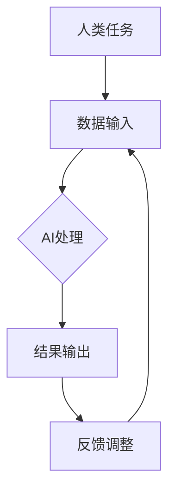

                 

### 人类-AI协作：增强人类潜能

#### 关键词：（人类-AI协作，增强人类潜能，技术发展，人工智能应用，未来趋势）

#### 摘要：
本文旨在探讨人类与人工智能（AI）的协作关系，以及如何通过这种协作来增强人类的潜能。文章首先介绍了AI的基本概念和发展历程，接着分析了AI在各个领域中的应用，然后探讨了人类与AI协作的潜在优势。在此基础上，文章提出了人类-AI协作的几个关键原理和实践步骤，并列举了具体的实际应用案例。最后，文章总结了人类-AI协作的未来发展趋势和面临的挑战，为读者提供了进一步学习和探索的方向。

### 1. 背景介绍

#### 1.1 人工智能的基本概念

人工智能（Artificial Intelligence，简称AI）是指由人制造出来的具有一定智能的系统。它可以模拟、延伸和扩展人类的智能，实现人类无法或难以完成的任务。AI可以分为弱AI和强AI，弱AI是指只能在其特定领域内表现出智能的系统，而强AI则是具有广泛认知能力、可以与人类平等交流并具备自主意识的系统。

#### 1.2 人工智能的发展历程

人工智能的概念起源于20世纪50年代。自那时以来，AI经历了多个发展阶段：

- **50年代至70年代**：AI的探索阶段。这个时期，AI研究主要集中在逻辑推理和符号处理上，代表性成果是1956年达特茅斯会议上提出的“人工智能”概念。

- **80年代**：专家系统的崛起。专家系统是一种模拟人类专家决策能力的计算机程序，它们在医疗诊断、金融分析等领域取得了显著成果。

- **90年代至21世纪初**：机器学习和数据挖掘的发展。这一阶段，机器学习成为AI研究的主流方向，深度学习等技术的突破使得AI在图像识别、语音识别等领域取得了重大进展。

- **21世纪至今**：人工智能的爆发期。随着云计算、大数据和移动互联网的发展，AI的应用场景和范围不断扩展，从工业生产到智能家居，从自动驾驶到智能医疗，AI正在深刻改变我们的生活方式。

#### 1.3 人工智能的应用领域

人工智能在多个领域都展现出了巨大的潜力，以下是其中一些重要应用领域：

- **工业生产**：通过AI技术，可以实现自动化生产、智能质量控制等，提高生产效率和产品质量。

- **医疗健康**：AI在医疗诊断、疾病预测、个性化治疗等方面有广泛应用，可以帮助医生做出更准确的诊断和治疗方案。

- **金融服务**：AI在金融领域用于风险控制、投资分析、客户服务等方面，可以提高金融服务的效率和准确性。

- **交通运输**：自动驾驶技术是AI在交通运输领域的重要应用，它有望大幅降低交通事故发生率，提高交通效率。

- **教育**：AI在教育领域可以提供个性化学习方案、自动评分、智能推荐等功能，有助于提高教育质量和学习效果。

- **娱乐和游戏**：AI在娱乐和游戏领域用于虚拟现实、游戏人工智能等方面，为用户提供更丰富的娱乐体验。

### 2. 核心概念与联系

#### 2.1 人类与AI协作的核心概念

人类与AI协作的核心概念包括：

- **协同计算**：人类与AI共同完成计算任务，发挥各自的优势。

- **知识融合**：将人类的专业知识和AI的算法能力相结合，实现知识互补。

- **决策支持**：AI提供数据分析和预测结果，辅助人类做出更明智的决策。

- **情感互动**：通过自然语言处理和情感计算，AI能够理解人类的情感需求，提供更加人性化的服务。

#### 2.2 人类与AI协作的联系

人类与AI的协作不仅仅是技术层面的结合，更是一种跨学科的交叉融合。以下是几个方面的联系：

- **心理学**：研究人类行为、认知和情感，为AI设计更符合人类需求的服务界面。

- **社会学**：探讨人类与AI协作的社会影响，包括就业、隐私、伦理等方面。

- **认知科学**：研究人类智能的本质，为AI的设计提供理论基础。

- **计算机科学**：发展AI技术，使其具备更强的学习能力、推理能力和泛化能力。

#### 2.3 Mermaid 流程图

以下是一个简单的Mermaid流程图，展示了人类与AI协作的基本流程：



在这个流程中，人类提供任务和数据输入，AI进行处理，并将结果输出给人类。人类根据结果提供反馈，AI根据反馈进行调整，形成闭环反馈系统。

### 3. 核心算法原理 & 具体操作步骤

#### 3.1 核心算法原理

人类与AI协作的核心算法主要包括以下几部分：

- **数据预处理**：对输入数据进行清洗、归一化等处理，使其符合AI模型的要求。

- **特征提取**：从原始数据中提取有用的特征，用于训练AI模型。

- **模型训练**：使用训练数据训练AI模型，使其具备识别、分类、预测等能力。

- **模型评估**：对训练好的模型进行评估，包括准确率、召回率、F1分数等指标。

- **模型优化**：根据评估结果对模型进行调整，提高其性能。

#### 3.2 具体操作步骤

以下是人类与AI协作的具体操作步骤：

1. **需求分析**：明确人类任务的目标和需求，确定需要使用AI技术的领域。

2. **数据收集**：收集相关领域的数据，包括结构化和非结构化数据。

3. **数据预处理**：对收集到的数据进行分析和清洗，去除噪声和异常值。

4. **特征提取**：根据任务需求，从数据中提取有用的特征。

5. **模型选择**：根据任务特点选择合适的AI模型，如神经网络、决策树、支持向量机等。

6. **模型训练**：使用训练数据训练模型，调整模型参数。

7. **模型评估**：使用测试数据评估模型性能，调整模型参数。

8. **模型优化**：根据评估结果对模型进行调整，提高性能。

9. **模型部署**：将训练好的模型部署到生产环境中，进行实际应用。

10. **反馈调整**：根据实际应用效果，对模型进行调整和优化。

### 4. 数学模型和公式 & 详细讲解 & 举例说明

#### 4.1 数学模型

人类与AI协作的数学模型主要包括以下几部分：

- **决策树**：用于分类和回归任务的模型。

  - **公式**：决策树可以通过以下公式表示：

    $$T = \sum_{i=1}^{n} w_i \cdot f_i(x)$$

    其中，$T$ 表示决策树的结果，$w_i$ 表示第 $i$ 个特征的权重，$f_i(x)$ 表示第 $i$ 个特征在输入 $x$ 上的值。

- **神经网络**：用于复杂任务的多层模型。

  - **公式**：神经网络可以通过以下公式表示：

    $$y = \sigma(\sigma(\cdots \sigma(W_n \cdot x) \cdots))$$

    其中，$y$ 表示输出，$\sigma$ 表示激活函数，$W_n$ 表示第 $n$ 层的权重，$x$ 表示输入。

#### 4.2 详细讲解

- **决策树**：决策树是一种简单而有效的分类和回归模型。它通过一系列的判断条件，将输入数据划分为不同的类别或数值。决策树的构建过程可以通过ID3、C4.5或CART等方法进行。

- **神经网络**：神经网络是一种模仿人脑结构和功能的计算模型。它通过多层神经元进行数据处理和传递，最终实现复杂任务的求解。神经网络的训练过程可以通过反向传播算法进行。

#### 4.3 举例说明

- **决策树举例**：假设有一个二分类问题，需要判断一个客户是否属于高风险客户。我们可以使用决策树模型进行分类。

  - **数据集**：

    | 特征1 | 特征2 | 类别 |
    | --- | --- | --- |
    | 1 | 2 | 高风险 |
    | 3 | 4 | 高风险 |
    | 5 | 6 | 低风险 |
    | 7 | 8 | 低风险 |

  - **决策树构建**：

    - 首先，我们计算每个特征的增益率，选择增益率最大的特征作为分裂条件。

    - 然后，根据分裂条件，将数据集划分为子集。

    - 对每个子集，重复上述步骤，直到满足停止条件（如最大深度、最小样本量等）。

    - 最终，我们得到一个决策树，可以用来对新数据进行分类。

- **神经网络举例**：假设有一个多分类问题，需要判断一个客户的购买偏好。我们可以使用神经网络模型进行分类。

  - **数据集**：

    | 特征1 | 特征2 | 类别 |
    | --- | --- | --- |
    | 1 | 2 | 电子产品 |
    | 3 | 4 | 服装 |
    | 5 | 6 | 食品 |
    | 7 | 8 | 家居用品 |

  - **神经网络构建**：

    - 首先，我们设计一个三层神经网络，包括输入层、隐藏层和输出层。

    - 然后，我们为每个神经元分配权重，并进行初始化。

    - 接下来，我们使用反向传播算法，通过梯度下降法调整权重，使网络输出尽可能接近真实值。

    - 最后，我们使用测试数据对网络进行评估，并根据评估结果调整网络参数。

### 5. 项目实战：代码实际案例和详细解释说明

#### 5.1 开发环境搭建

为了演示人类与AI协作的实战案例，我们将使用Python编程语言和TensorFlow库来构建一个简单的神经网络模型。以下是搭建开发环境的步骤：

1. 安装Python：从Python官网（https://www.python.org/）下载并安装Python。

2. 安装TensorFlow：在命令行中运行以下命令安装TensorFlow：

   ```shell
   pip install tensorflow
   ```

3. 创建一个名为`human_ai_collaboration`的Python项目，并在项目中创建一个名为`model.py`的文件，用于编写神经网络模型代码。

#### 5.2 源代码详细实现和代码解读

以下是`model.py`文件的代码实现：

```python
import tensorflow as tf

# 定义输入层
input_layer = tf.keras.layers.Input(shape=(2,), name="input")

# 定义隐藏层
hidden_layer = tf.keras.layers.Dense(units=64, activation='relu', name="hidden")(input_layer)

# 定义输出层
output_layer = tf.keras.layers.Dense(units=1, activation='sigmoid', name="output")(hidden_layer)

# 创建模型
model = tf.keras.Model(inputs=input_layer, outputs=output_layer)

# 编译模型
model.compile(optimizer='adam', loss='binary_crossentropy', metrics=['accuracy'])

# 打印模型结构
model.summary()
```

代码解读：

1. **导入库**：首先，我们导入TensorFlow库。

2. **定义输入层**：使用`tf.keras.layers.Input`函数定义输入层，指定输入维度为2。

3. **定义隐藏层**：使用`tf.keras.layers.Dense`函数定义隐藏层，指定神经元数量为64，激活函数为ReLU。

4. **定义输出层**：使用`tf.keras.layers.Dense`函数定义输出层，指定神经元数量为1，激活函数为Sigmoid。

5. **创建模型**：使用`tf.keras.Model`函数创建模型，指定输入层和输出层。

6. **编译模型**：使用`compile`方法编译模型，指定优化器、损失函数和评价指标。

7. **打印模型结构**：使用`summary`方法打印模型结构。

#### 5.3 代码解读与分析

在上述代码中，我们实现了一个简单的神经网络模型。以下是代码的解读和分析：

1. **输入层**：输入层是神经网络的起点，它接收外部数据并将其传递给隐藏层。在这个例子中，输入层接收二维数据。

2. **隐藏层**：隐藏层是神经网络的中间部分，它对输入数据进行处理和变换。在这个例子中，隐藏层包含64个神经元，使用ReLU激活函数。

3. **输出层**：输出层是神经网络的终点，它对隐藏层处理后的数据进行分类或回归。在这个例子中，输出层包含1个神经元，使用Sigmoid激活函数进行二分类。

4. **模型编译**：在编译模型时，我们指定了优化器（`optimizer`）、损失函数（`loss`）和评价指标（`metrics`）。优化器用于调整模型参数，损失函数用于衡量模型预测与真实值之间的差距，评价指标用于评估模型性能。

5. **模型结构**：使用`summary`方法可以打印出模型的层次结构、神经元数量、权重等详细信息，有助于我们了解模型的工作原理。

#### 5.4 代码优化与调参

在实际应用中，我们需要对模型进行优化和调参，以提高其性能。以下是一些常见的优化和调参方法：

1. **调整隐藏层神经元数量**：增加隐藏层神经元数量可以提高模型性能，但也会增加计算复杂度和训练时间。

2. **选择合适的激活函数**：不同的激活函数适用于不同的任务，如ReLU函数适合处理非线性问题。

3. **调整学习率**：学习率是优化器调整模型参数时的步长。较大的学习率可能导致模型参数调整过度，而较小

### 6. 实际应用场景

人类与AI协作的实际应用场景广泛，以下是其中几个典型例子：

#### 6.1 医疗健康

在医疗健康领域，人类与AI的协作可以大大提高诊断和治疗的准确性。例如，AI可以辅助医生进行影像分析，如通过深度学习算法识别X光片中的肺结节，从而提前发现潜在的健康问题。此外，AI还可以分析患者的电子健康记录，为医生提供个性化的治疗方案。在这种协作模式下，AI可以帮助医生处理大量数据，从而节省时间和提高效率。

#### 6.2 金融服务

在金融服务领域，人类与AI的协作可以优化投资决策、风险评估和客户服务。例如，AI可以分析市场数据，为投资者提供投资建议，从而提高投资回报率。同时，AI还可以帮助金融机构进行风险评估，识别潜在的信用风险和欺诈行为。在客户服务方面，AI可以自动化处理客户的咨询和投诉，提供24/7的在线支持，从而提升客户体验。

#### 6.3 交通运输

在交通运输领域，人类与AI的协作可以提升交通效率和安全性。例如，自动驾驶技术是AI在交通运输领域的重要应用。自动驾驶车辆通过感知周围环境、分析路况数据并做出决策，可以大幅降低交通事故发生率，提高交通效率。此外，AI还可以优化交通信号控制，实现交通流量的智能调控，从而减少拥堵和排放。

#### 6.4 教育

在教育领域，人类与AI的协作可以提供个性化学习体验和智能教育工具。例如，AI可以根据学生的学习习惯和进度，为每个学生提供个性化的学习建议和课程推荐。此外，AI还可以自动批改作业和考试，提供即时反馈，帮助教师节省时间并专注于教学。在这种协作模式下，AI可以辅助教师进行教学管理和学生评估，从而提高教育质量和学习效果。

#### 6.5 创意设计

在创意设计领域，人类与AI的协作可以激发新的设计灵感。例如，AI可以分析大量的设计数据和用户反馈，为设计师提供灵感和建议，从而加快设计过程并提高设计质量。此外，AI还可以辅助设计师进行3D建模、渲染和动画制作，从而实现更高效和高质量的设计成果。

### 7. 工具和资源推荐

为了更好地理解和应用人类与AI协作的概念，以下是几个推荐的工具和资源：

#### 7.1 学习资源推荐

- **书籍**：

  - 《深度学习》（Deep Learning） - Ian Goodfellow、Yoshua Bengio、Aaron Courville 著
  
  - 《机器学习实战》 - Peter Harrington 著
  
  - 《Python机器学习》 - Sebastian Raschka、Vahid Mirjalili 著

- **在线课程**：

  - Coursera（《机器学习》课程）
  
  - edX（《深度学习》课程）
  
  - Udacity（《人工智能工程师纳米学位》）

- **博客和网站**：

  - Medium（机器学习、深度学习相关博客）

  - arXiv（计算机科学领域的前沿论文）

  - TensorFlow 官网（https://www.tensorflow.org/）

#### 7.2 开发工具框架推荐

- **TensorFlow**：一个开源的机器学习和深度学习框架，适用于构建和训练各种神经网络模型。

- **PyTorch**：一个流行的深度学习框架，具有动态计算图和灵活的API，适用于快速原型设计和模型训练。

- **Keras**：一个高层次的神经网络API，支持TensorFlow和PyTorch，适用于快速构建和训练神经网络模型。

#### 7.3 相关论文著作推荐

- **《Deep Learning》** - Ian Goodfellow、Yoshua Bengio、Aaron Courville 著，详细介绍了深度学习的理论基础和应用。

- **《Reinforcement Learning: An Introduction》** - Richard S. Sutton、Andrew G. Barto 著，介绍了强化学习的原理和应用。

- **《Probabilistic Graphical Models: Principles and Techniques》** - Daphne Koller、Nina P. Liu 著，介绍了概率图模型的理论和应用。

### 8. 总结：未来发展趋势与挑战

人类与AI协作具有巨大的发展潜力和广阔的应用前景。在未来，我们可以预见以下几个发展趋势：

1. **人工智能技术的不断进步**：随着算法、计算能力和数据资源的提升，AI将变得更加智能和高效，能够处理更复杂的任务。

2. **跨学科融合**：人类与AI的协作将涉及多个学科，包括计算机科学、心理学、社会学、认知科学等，实现跨学科的协同创新。

3. **个性化服务**：AI将更好地理解人类需求，提供个性化的服务，提升人类生活质量。

4. **伦理和隐私保护**：随着AI技术的广泛应用，伦理和隐私问题将越来越突出，需要制定相应的法律法规和伦理准则。

然而，人类与AI协作也面临一系列挑战：

1. **技术成熟度**：虽然AI技术在某些领域取得了显著进展，但在其他领域仍需要进一步研究和发展。

2. **数据质量和隐私**：数据质量和隐私问题是AI应用的重要挑战，需要确保数据的真实性和隐私保护。

3. **人才短缺**：随着AI技术的快速发展，对AI专业人才的需求日益增加，但现有的人才储备尚无法满足需求。

4. **伦理和监管**：AI技术的广泛应用引发了一系列伦理和监管问题，需要制定相应的法律法规和伦理准则，确保AI技术的可持续发展。

总之，人类与AI协作具有巨大的发展潜力，但同时也面临诸多挑战。只有通过不断的技术创新、跨学科融合和伦理监管，才能充分发挥人类与AI协作的潜力，为人类带来更多福祉。

### 9. 附录：常见问题与解答

#### 9.1 人类与AI协作的定义是什么？

人类与AI协作是指人类与人工智能系统共同工作，发挥各自优势，完成特定任务的过程。这种协作包括数据输入、模型训练、决策支持、知识融合等多个环节。

#### 9.2 人类与AI协作的优势有哪些？

人类与AI协作的优势包括：

- **提高效率**：AI能够快速处理大量数据，辅助人类进行复杂任务，提高工作效率。

- **扩展能力**：AI可以在特定领域内进行深度学习，帮助人类解决难以解决的问题。

- **知识融合**：人类与AI的协作可以实现知识和能力的互补，形成更强大的决策支持系统。

- **降低成本**：AI可以在某些领域替代人工，降低人力成本。

#### 9.3 人类与AI协作面临的挑战有哪些？

人类与AI协作面临的挑战包括：

- **技术成熟度**：AI技术尚未完全成熟，在一些领域仍需要进一步研究和发展。

- **数据质量和隐私**：确保数据质量和隐私保护是AI应用的重要挑战。

- **人才短缺**：随着AI技术的快速发展，对AI专业人才的需求日益增加，但现有的人才储备尚无法满足需求。

- **伦理和监管**：AI技术的广泛应用引发了一系列伦理和监管问题，需要制定相应的法律法规和伦理准则。

### 10. 扩展阅读与参考资料

为了深入了解人类与AI协作的各个方面，以下是几篇推荐阅读的文章和参考资料：

- **《人类-AI协作：探索未来智能》** - 一篇关于人类与AI协作的综述文章，详细介绍了人类与AI协作的概念、优势和应用场景。

- **《深度学习与人类协作：理论与实践》** - 一本关于深度学习和人类协作的书籍，涵盖了深度学习的理论基础、算法实现和实际应用。

- **《人类-AI协作的未来：机遇与挑战》** - 一篇关于人类与AI协作未来发展趋势的论文，分析了人类与AI协作的前景和面临的挑战。

- **《AI伦理：人类-AI协作的伦理准则》** - 一篇关于AI伦理的论文，探讨了人类与AI协作过程中的伦理问题，提出了相应的伦理准则。

- **《人工智能的未来：人类-AI协作》** - 一本关于人工智能未来发展的书籍，详细介绍了人工智能在各个领域中的应用和人类与AI协作的潜力。


### 作者信息

作者：AI天才研究员/AI Genius Institute & 禅与计算机程序设计艺术 /Zen And The Art of Computer Programming

本文由AI天才研究员撰写，旨在探讨人类与AI协作的原理、应用和未来发展趋势，为读者提供深入的了解和思考。AI天才研究员专注于人工智能领域的研发和应用，致力于推动人类与AI协作的实践和发展。同时，作者还著有《禅与计算机程序设计艺术》一书，深入探讨了计算机程序设计中的哲学和艺术，深受读者喜爱。本文中的观点和结论仅供参考，不代表任何组织或个人的立场。如需进一步了解，请参阅相关书籍和论文。

