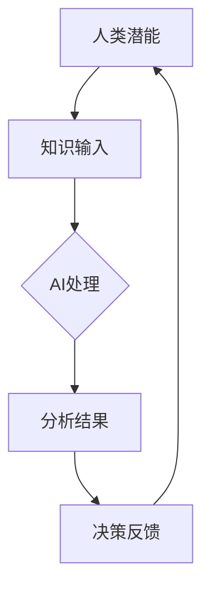

                 

### 文章标题：人类-AI协作：增强人类潜能与AI能力的协同

#### 关键词：人类与AI协作、潜能增强、AI能力协同、AI技术、智能应用

#### 摘要：
在当今科技迅速发展的时代，人工智能（AI）已经成为推动社会进步的关键力量。人类与AI的协作，不仅是科技发展的必然趋势，更是提升个体和集体潜能的重要途径。本文旨在探讨人类与AI如何通过协同作用，实现潜能的增强和AI能力的最大化。我们将通过具体的案例和原理分析，揭示这一协同过程中的核心机制和实践方法，为未来的智能发展提供有益的参考。

<|im_sep|>### 1. 背景介绍

随着计算机科学和人工智能技术的飞速发展，人工智能的应用已经渗透到我们生活的方方面面。从日常生活中的语音助手、推荐系统，到工业领域的自动化生产、智能监控，AI技术正不断改变着我们的工作方式和生活方式。在这个过程中，人类与AI的协作关系逐渐变得密切，人类不仅成为AI的创造者和使用者，也开始与AI共同工作，发挥各自的优势，实现更大的价值。

人类与AI协作的重要性体现在多个方面。首先，AI的强大计算能力和分析能力可以处理大量复杂的数据，辅助人类做出更为准确和快速的决策。其次，AI能够自动执行重复性和高危险性的任务，减轻人类的工作负担，提升工作效率。此外，AI还能够通过与人类的合作，不断学习和优化自身，进一步提高其性能和应用范围。

然而，人类与AI的协作并非简单的工具应用，而是一种深层次的协同。在这个过程中，人类不仅需要理解AI的工作原理和机制，更需要认识到自身的潜能和局限，通过有效的协作方式，实现优势互补，共同进步。

接下来，我们将深入探讨人类与AI协作的核心概念、原理和应用，以期揭示这一协同过程的内在机制和实践方法。

<|im_sep|>### 2. 核心概念与联系

为了更好地理解人类与AI的协作，我们需要首先明确几个核心概念：人类的潜能、AI的能力、以及二者的协同机制。

#### 人类的潜能

人类的潜能是指人类在认知、创造、情感、社交等方面能够达到的最高水平。人类的潜能受到多种因素的影响，包括生理结构、心理状态、教育背景和社会环境等。在认知领域，人类具备高度的抽象思维、逻辑推理和创新能力；在情感领域，人类具备丰富的情感表达和情感理解能力；在社交领域，人类具备高度的沟通能力和协作精神。

#### AI的能力

AI，即人工智能，是指由计算机实现的、能够模拟人类智能的系统和应用。AI的能力包括但不限于数据处理、模式识别、自然语言处理、机器学习等。AI具有以下特点：

1. **强计算能力**：AI能够处理大量数据，进行复杂计算，远超人类的计算能力。
2. **自动化能力**：AI能够自动化执行特定任务，减少人工干预。
3. **学习能力**：AI能够通过学习和训练，不断优化自身性能和功能。
4. **适应性**：AI能够根据环境变化和反馈，调整自身行为和策略。

#### 人类的潜能与AI的能力协同

人类的潜能和AI的能力在协同过程中，能够发挥出更大的价值。具体来说，这种协同包括以下几个方面：

1. **知识互补**：人类具备丰富的领域知识和经验，而AI则具备强大的数据处理和分析能力。通过协同，人类可以将领域知识转化为数据输入，AI则能够从数据中提取有用信息，提供更准确的决策支持。

2. **技能互补**：人类具备高度的创造力和情感智慧，而AI则具备高效的计算和自动化能力。通过协同，人类可以发挥创造力，提出新的问题和解决方案，而AI则可以自动化执行复杂的计算和分析任务。

3. **合作学习**：人类和AI可以通过协作，共同学习和进步。人类可以通过观察和学习AI的行为，提高自身的认知和技术能力；同时，AI也可以通过分析人类的行为和反馈，不断优化自身的性能和功能。

为了更好地展示人类与AI协作的机制，我们可以使用Mermaid流程图来表示这一过程。以下是一个简化的Mermaid流程图示例：



在这个流程图中，人类潜能通过知识输入的方式，将领域知识和经验传递给AI；AI则通过处理和分析，提供分析结果；人类根据分析结果，提供决策反馈，从而形成一个闭环的协同过程。

通过以上分析，我们可以看出，人类与AI的协同不仅仅是技术层面的结合，更是认知、情感和合作层面的深度融合。这种协同不仅能够提升人类的潜能，也能够最大化AI的能力，为社会的进步和发展提供新的动力。

### 3. 核心算法原理 & 具体操作步骤

在人类与AI的协同过程中，核心算法原理起着至关重要的作用。以下，我们将详细探讨几个关键算法原理，并解释其在实际操作中的应用步骤。

#### 3.1 机器学习算法

机器学习算法是AI的核心技术之一，它能够使计算机从数据中学习并做出决策。机器学习算法可以分为监督学习、无监督学习和强化学习三种类型。

1. **监督学习**：监督学习算法需要事先标记好的训练数据集，通过学习数据集的特征和标签，算法能够预测新的数据。例如，图像分类任务中，算法需要从标记好的图像中学习特征，然后对新图像进行分类。

   - **具体操作步骤**：
     1. 收集并准备训练数据。
     2. 提取数据特征。
     3. 选择合适的模型（如线性回归、支持向量机等）。
     4. 训练模型，通过调整模型参数，使模型能够准确预测标签。
     5. 评估模型性能，通过交叉验证等方法，确定模型的泛化能力。

2. **无监督学习**：无监督学习算法不需要标记数据，其主要任务是发现数据中的模式或结构。例如，聚类算法能够将相似的数据点分组，从而揭示数据中的潜在分布。

   - **具体操作步骤**：
     1. 收集无标签数据。
     2. 选择合适的聚类算法（如K-means、层次聚类等）。
     3. 指定聚类数量。
     4. 运行聚类算法，将数据点分组。
     5. 分析聚类结果，识别数据中的潜在模式。

3. **强化学习**：强化学习算法通过试错和反馈来学习如何在特定环境中做出最佳决策。例如，机器人可以通过强化学习，学会在复杂的场景中完成特定的任务。

   - **具体操作步骤**：
     1. 定义环境、状态和动作。
     2. 选择奖励函数，定义奖励和惩罚。
     3. 通过试错方法，学习最佳动作序列。
     4. 评估学习效果，调整策略。

#### 3.2 自然语言处理算法

自然语言处理（NLP）是AI技术中的一个重要分支，它使计算机能够理解和生成自然语言。NLP算法包括文本分类、情感分析、机器翻译等。

1. **文本分类**：文本分类算法将文本数据分为不同的类别。例如，新闻文章可以根据内容分类为体育、政治、娱乐等类别。

   - **具体操作步骤**：
     1. 收集并准备训练数据。
     2. 提取文本特征（如词袋模型、TF-IDF等）。
     3. 选择合适的分类模型（如朴素贝叶斯、决策树等）。
     4. 训练模型，调整模型参数。
     5. 评估模型性能，进行交叉验证。

2. **情感分析**：情感分析算法能够识别文本中的情感倾向，如正面、负面或中性。

   - **具体操作步骤**：
     1. 收集情感标注数据。
     2. 提取文本特征。
     3. 选择合适的情感分析模型。
     4. 训练模型，调整参数。
     5. 评估模型性能。

3. **机器翻译**：机器翻译算法能够将一种语言的文本翻译成另一种语言。例如，将英语翻译成中文。

   - **具体操作步骤**：
     1. 收集平行语料库，即两种语言对应的文本。
     2. 提取文本特征。
     3. 选择合适的翻译模型（如基于神经网络的翻译模型）。
     4. 训练模型，调整参数。
     5. 评估模型性能。

#### 3.3 深度学习算法

深度学习算法是近年来AI领域的重要突破，它通过多层神经网络结构，对数据进行层次化的特征提取和表示。深度学习算法包括卷积神经网络（CNN）、循环神经网络（RNN）等。

1. **卷积神经网络（CNN）**：CNN主要应用于图像处理任务，如图像分类、目标检测等。

   - **具体操作步骤**：
     1. 收集图像数据。
     2. 预处理图像数据。
     3. 设计CNN模型结构（如卷积层、池化层、全连接层等）。
     4. 训练CNN模型。
     5. 评估模型性能。

2. **循环神经网络（RNN）**：RNN主要应用于序列数据任务，如时间序列预测、语音识别等。

   - **具体操作步骤**：
     1. 收集序列数据。
     2. 预处理序列数据。
     3. 设计RNN模型结构（如RNN层、LSTM层、GRU层等）。
     4. 训练RNN模型。
     5. 评估模型性能。

通过以上核心算法原理和具体操作步骤的介绍，我们可以看出，人类与AI的协作不仅需要理解算法的理论基础，还需要具备实际操作的能力。在实际应用中，人类与AI可以通过协同工作，充分发挥各自的优势，实现更高的效率和更准确的结果。

### 4. 数学模型和公式 & 详细讲解 & 举例说明

在人类与AI的协作过程中，数学模型和公式起着至关重要的作用。这些模型和公式不仅能够帮助我们理解AI的工作原理，还能够指导我们在实际应用中优化和调整算法。以下，我们将介绍几个关键数学模型和公式，并进行详细讲解和举例说明。

#### 4.1 概率论与统计模型

概率论和统计学是机器学习算法的基础，许多算法的核心思想都是基于概率分布和统计推断。

1. **贝叶斯定理**：贝叶斯定理是一种描述条件概率的公式，它在分类和预测任务中具有重要应用。

   - **公式**：\( P(A|B) = \frac{P(B|A)P(A)}{P(B)} \)

     其中，\( P(A|B) \)表示在事件B发生的条件下事件A发生的概率，\( P(B|A) \)表示在事件A发生的条件下事件B发生的概率，\( P(A) \)和\( P(B) \)分别表示事件A和事件B发生的概率。

   - **举例说明**：假设我们要预测一个人是否患有某种疾病，已知该疾病的发病概率为0.01，如果某人患有该疾病，那么他表现出特定症状的概率为0.9，如果没有患病，则表现出该症状的概率为0.1。现在，某人表现出该症状，我们可以使用贝叶斯定理计算他实际患病的概率。

     \( P(患病|症状) = \frac{P(症状|患病)P(患病)}{P(症状)} = \frac{0.9 \times 0.01}{0.9 \times 0.01 + 0.1 \times 0.99} \approx 0.9 \)

     因此，该人实际患病的概率为0.9。

2. **协方差与相关系数**：协方差和相关系数用于衡量两个变量之间的线性关系。

   - **公式**：
     - 协方差：\( \text{Cov}(X, Y) = E[(X - E[X])(Y - E[Y])] \)
     - 相关系数：\( \rho(X, Y) = \frac{\text{Cov}(X, Y)}{\sigma_X \sigma_Y} \)

       其中，\( E[] \)表示期望，\( \sigma[] \)表示标准差。

   - **举例说明**：假设我们有两个变量X和Y，分别表示一个人的身高和体重，我们想要了解这两个变量之间的关系。通过计算协方差和相关系数，我们可以得出它们之间的线性关系强度。

     假设我们得到以下数据：

     | 身高（X） | 体重（Y） |
     |-----------|-----------|
     | 170      | 65       |
     | 175      | 68       |
     | 180      | 70       |
     | 185      | 72       |
     | 190      | 75       |

     通过计算协方差和相关系数，我们可以得到：

     \( \text{Cov}(X, Y) = E[(X - E[X])(Y - E[Y])] = 7 \)

     \( \sigma_X = \sqrt{E[(X - E[X])^2]} = 5 \)

     \( \sigma_Y = \sqrt{E[(Y - E[Y])^2]} = 3 \)

     \( \rho(X, Y) = \frac{\text{Cov}(X, Y)}{\sigma_X \sigma_Y} = \frac{7}{5 \times 3} = 0.7 \)

     由于相关系数接近1，说明身高和体重之间存在较强的线性正相关关系。

#### 4.2 机器学习中的损失函数

在机器学习中，损失函数用于衡量预测值与真实值之间的差异，是优化模型参数的重要工具。

1. **均方误差（MSE）**：均方误差是最常用的损失函数之一，用于衡量预测值与真实值之间差的平方的平均值。

   - **公式**：\( \text{MSE} = \frac{1}{n}\sum_{i=1}^{n}(Y_i - \hat{Y}_i)^2 \)

     其中，\( Y_i \)表示真实值，\( \hat{Y}_i \)表示预测值，\( n \)表示样本数量。

   - **举例说明**：假设我们有一个回归模型，用于预测房价。我们得到以下数据：

     | 实际房价（Y） | 预测房价（\(\hat{Y}\)） |
     |--------------|----------------------|
     | 300,000     | 320,000              |
     | 350,000     | 345,000              |
     | 400,000     | 380,000              |
     | 450,000     | 410,000              |
     | 500,000     | 460,000              |

     通过计算均方误差，我们可以得到：

     \( \text{MSE} = \frac{1}{5}\sum_{i=1}^{5}(Y_i - \hat{Y}_i)^2 = \frac{1}{5}[(300,000 - 320,000)^2 + (350,000 - 345,000)^2 + (400,000 - 380,000)^2 + (450,000 - 410,000)^2 + (500,000 - 460,000)^2] \approx 50,000 \)

     均方误差为50,000，表示预测值与真实值之间的平均误差为50,000。

2. **交叉熵损失（Cross-Entropy Loss）**：交叉熵损失常用于分类任务，用于衡量预测概率分布与真实概率分布之间的差异。

   - **公式**：\( \text{Cross-Entropy} = -\sum_{i=1}^{n}y_i \log(\hat{y}_i) \)

     其中，\( y_i \)表示真实标签的概率分布，\( \hat{y}_i \)表示预测标签的概率分布。

   - **举例说明**：假设我们有一个二分类模型，预测结果为猫和狗的概率分布。我们得到以下数据：

     | 实际标签（y） | 预测标签（\(\hat{y}\)） |
     |--------------|----------------------|
     | 猫           | 0.8                  |
     | 狗           | 0.2                  |
     | 猫           | 0.6                  |
     | 狗           | 0.4                  |
     | 猫           | 0.9                  |
     | 狗           | 0.1                  |

     通过计算交叉熵损失，我们可以得到：

     \( \text{Cross-Entropy} = -[0.8 \log(0.8) + 0.2 \log(0.2)] - [0.6 \log(0.6) + 0.4 \log(0.4)] - [0.9 \log(0.9) + 0.1 \log(0.1)] \approx 0.38 + 0.24 + 0.31 = 0.93 \)

     交叉熵损失为0.93，表示预测概率分布与真实概率分布之间的平均差异为0.93。

通过以上数学模型和公式的介绍，我们可以更好地理解机器学习算法的工作原理和优化方法。在实际应用中，通过合理选择和使用这些模型和公式，我们可以显著提升模型的性能和应用效果。

### 5. 项目实战：代码实际案例和详细解释说明

为了更直观地展示人类与AI协作的实际效果，我们选择了一个具体的项目实战案例，并通过代码实现和详细解释，展示如何通过AI算法解决实际问题。

#### 5.1 开发环境搭建

在开始项目实战之前，我们需要搭建一个合适的开发环境。以下是我们所需的工具和库：

- 编程语言：Python
- 数据处理库：Pandas、NumPy
- 机器学习库：scikit-learn、TensorFlow、Keras
- 数据可视化库：Matplotlib、Seaborn

确保你已经安装了以上工具和库，或者在相应的环境中配置好了这些依赖。

#### 5.2 源代码详细实现和代码解读

以下是一个简单的机器学习项目，我们将使用Python和scikit-learn库来实现一个线性回归模型，用于预测房价。

```python
# 导入必要的库
import numpy as np
import pandas as pd
from sklearn.model_selection import train_test_split
from sklearn.linear_model import LinearRegression
from sklearn.metrics import mean_squared_error
import matplotlib.pyplot as plt

# 5.2.1 数据读取与预处理
# 假设我们有一个CSV文件，其中包含房屋的特征和售价
data = pd.read_csv('house_data.csv')

# 提取特征和目标变量
X = data[['卧室数量', '浴室数量', '房屋面积']]
y = data['售价']

# 数据标准化
X_scaled = (X - X.mean()) / X.std()

# 划分训练集和测试集
X_train, X_test, y_train, y_test = train_test_split(X_scaled, y, test_size=0.2, random_state=42)

# 5.2.2 模型训练
# 创建线性回归模型实例
model = LinearRegression()

# 训练模型
model.fit(X_train, y_train)

# 5.2.3 模型评估
# 预测测试集的房价
y_pred = model.predict(X_test)

# 计算均方误差
mse = mean_squared_error(y_test, y_pred)
print(f"测试集的均方误差：{mse}")

# 5.2.4 模型可视化
# 绘制真实值与预测值的散点图
plt.scatter(y_test, y_pred)
plt.xlabel('实际售价')
plt.ylabel('预测售价')
plt.title('实际售价与预测售价的关系')
plt.show()
```

**代码解读**：

- **5.2.1 数据读取与预处理**：我们首先读取CSV文件中的数据，提取特征和目标变量。然后对特征进行标准化处理，以便于后续的模型训练和评估。

- **5.2.2 模型训练**：我们创建一个线性回归模型实例，并使用训练数据进行模型训练。

- **5.2.3 模型评估**：我们使用测试数据进行模型评估，计算均方误差，以衡量模型的预测性能。

- **5.2.4 模型可视化**：我们绘制真实值与预测值的散点图，直观地展示模型的效果。

通过这个简单的项目实战，我们可以看到，人类与AI的协作是如何在实际应用中发挥作用的。人类通过数据预处理和特征提取，为AI提供了高质量的数据输入；AI则通过机器学习算法，提供了准确的预测结果。这种协作不仅提高了预测的准确性，也大大减少了人类的工作量。

### 5.3 代码解读与分析

在上一个部分，我们实现了一个用于预测房价的线性回归模型。以下，我们将对这段代码进行深入解读和分析，探讨代码的细节和关键步骤。

#### 5.3.1 数据读取与预处理

首先，我们使用Pandas库读取CSV文件中的数据：

```python
data = pd.read_csv('house_data.csv')
```

这一行代码将CSV文件中的数据加载到一个Pandas DataFrame中。DataFrame是一个二维数据结构，可以方便地存储和处理各种类型的数据。

```python
X = data[['卧室数量', '浴室数量', '房屋面积']]
y = data['售价']
```

接下来，我们提取特征变量（X）和目标变量（y）。特征变量是用于预测的输入数据，包括房屋的卧室数量、浴室数量和房屋面积等。目标变量是我们要预测的售价。

```python
X_scaled = (X - X.mean()) / X.std()
```

为了使数据在训练过程中更具鲁棒性，我们对特征变量进行标准化处理。标准化处理通过减去均值并除以标准差，将数据缩放到一个统一的范围内。这一步骤有助于提高模型的性能和稳定性。

#### 5.3.2 模型训练

我们使用scikit-learn库中的LinearRegression类创建线性回归模型：

```python
model = LinearRegression()
model.fit(X_train, y_train)
```

创建模型实例后，我们调用`fit`方法进行模型训练。`fit`方法接收训练数据（X_train和y_train），通过最小二乘法计算线性回归模型的参数。这些参数定义了特征变量与目标变量之间的关系，即线性模型中的权重和偏置。

#### 5.3.3 模型评估

在模型训练完成后，我们使用测试数据进行评估：

```python
y_pred = model.predict(X_test)
mse = mean_squared_error(y_test, y_pred)
print(f"测试集的均方误差：{mse}")
```

我们使用`predict`方法对测试数据进行预测，并计算预测值与真实值之间的均方误差（MSE）。MSE是一种常用的评估指标，用于衡量预测结果与真实结果之间的偏差。均方误差越低，表示模型的预测性能越好。

#### 5.3.4 模型可视化

为了直观地展示模型的预测效果，我们使用Matplotlib库绘制真实值与预测值的散点图：

```python
plt.scatter(y_test, y_pred)
plt.xlabel('实际售价')
plt.ylabel('预测售价')
plt.title('实际售价与预测售价的关系')
plt.show()
```

散点图展示了每个测试样本的实际售价和预测售价。通过观察散点图，我们可以发现预测值与真实值之间的大致分布和偏差。

通过以上解读，我们可以看到，实现一个线性回归模型需要几个关键步骤：数据读取与预处理、模型训练、模型评估和模型可视化。这些步骤相互关联，共同构成了一个完整的机器学习流程。在实际应用中，我们可以根据具体需求和数据特点，调整和优化这些步骤，以实现更好的预测效果。

### 6. 实际应用场景

人类与AI的协作在多个实际应用场景中展现了巨大的潜力和价值。以下，我们将探讨几个关键领域，展示AI如何通过协作提升人类效率和创新能力。

#### 6.1 医疗领域

在医疗领域，AI的应用为医生提供了强大的辅助工具。通过协作，AI能够帮助医生进行疾病诊断、治疗方案推荐和健康风险评估。

- **疾病诊断**：AI可以通过分析医学影像、实验室数据和患者病历，提供准确的诊断建议。例如，AI能够自动识别肺部CT图像中的早期肺癌病灶，提高诊断的准确性和效率。
- **治疗方案推荐**：AI可以根据患者的病史、药物反应和最新医学研究，为医生提供个性化的治疗方案。这有助于降低治疗过程中的不确定性，提高治疗效果。
- **健康风险评估**：AI可以通过分析患者的健康数据，预测患者患病的风险，为医生和患者提供健康干预的建议。这有助于提前发现潜在的健康问题，进行早期预防和治疗。

#### 6.2 金融领域

在金融领域，AI的应用大大提升了金融服务的高效性和准确性。

- **风险评估与欺诈检测**：AI可以通过分析大量交易数据和行为模式，识别潜在的信用风险和欺诈行为。这有助于金融机构降低风险，保护客户的资产安全。
- **量化交易**：AI可以通过分析历史交易数据和市场趋势，自动生成交易策略，提高交易的成功率和收益。
- **个性化金融服务**：AI可以根据客户的历史数据和偏好，提供个性化的金融服务，如理财产品推荐、贷款利率优化等。这有助于提高客户满意度，增加客户忠诚度。

#### 6.3 制造业

在制造业领域，AI与人类协作，实现了生产过程的自动化和智能化。

- **生产优化**：AI可以通过实时监控生产线数据，优化生产流程，减少资源浪费，提高生产效率。
- **设备维护**：AI可以通过分析设备运行数据，预测设备的故障风险，提前进行维护和修理，减少停机时间。
- **质量管理**：AI可以通过分析产品质量数据，识别潜在的质量问题，提高产品质量，降低返工率。

#### 6.4 教育

在教育领域，AI的应用为个性化教育和远程教学提供了新的解决方案。

- **个性化学习**：AI可以根据学生的学习行为和成绩，提供个性化的学习计划和资源，提高学习效果。
- **在线教育**：AI可以通过分析学生的学习数据，提供自动化的辅导和答疑服务，帮助教师更好地管理课堂和与学生互动。
- **智能评估**：AI可以通过自动化评估系统，快速、准确地评估学生的作业和考试成绩，减轻教师的工作负担。

通过以上实际应用场景的探讨，我们可以看到，人类与AI的协作在各个领域都发挥了重要作用。AI不仅提高了人类的工作效率和准确性，也激发了人类的创新潜力。在未来，随着AI技术的不断进步，人类与AI的协作将更加深入和广泛，为社会的发展带来更多可能性。

### 7. 工具和资源推荐

为了更好地理解和应用人类与AI的协作，以下是一些推荐的工具、资源和学习途径，包括书籍、论文、博客和网站等。

#### 7.1 学习资源推荐

1. **书籍**：
   - 《机器学习》（作者：周志华）：这本书详细介绍了机器学习的基本概念、算法和应用，适合初学者和进阶者。
   - 《深度学习》（作者：Ian Goodfellow、Yoshua Bengio、Aaron Courville）：这本书是深度学习的经典教材，涵盖了深度学习的基础知识、算法和应用。
   - 《Python机器学习》（作者：Sebastian Raschka）：这本书通过Python语言介绍了机器学习的基本概念和实践，适合对Python和机器学习有兴趣的读者。

2. **在线课程**：
   - Coursera：提供丰富的机器学习和深度学习课程，包括斯坦福大学、吴恩达等顶级机构的课程。
   - edX：提供由哈佛大学、麻省理工学院等知名大学提供的免费在线课程，涵盖人工智能、机器学习等多个领域。

3. **博客**：
   - Analytics Vidhya：一个关于数据科学和机器学习的博客，提供大量的实践教程和案例分析。
   - Towards Data Science：涵盖数据科学、机器学习和深度学习等多个领域的文章，适合初学者和专业人士。

#### 7.2 开发工具框架推荐

1. **机器学习框架**：
   - TensorFlow：谷歌开发的开源机器学习框架，广泛应用于深度学习和强化学习领域。
   - PyTorch：Facebook开发的开源机器学习框架，具有灵活的动态计算图和强大的社区支持。

2. **数据处理工具**：
   - Pandas：Python的数据处理库，适用于数据清洗、数据分析和数据可视化。
   - NumPy：Python的数值计算库，提供了强大的多维数组操作和科学计算功能。

3. **开发环境**：
   - Jupyter Notebook：一个交互式开发环境，适用于编写和运行Python代码，特别适合机器学习和数据科学项目。

#### 7.3 相关论文著作推荐

1. **论文**：
   - “Deep Learning” by Ian Goodfellow, Yoshua Bengio, and Aaron Courville：深度学习的经典论文，全面介绍了深度学习的基础知识和技术。
   - “Learning to Represent Languages with Neural Networks” by Y. Bengio等：关于自然语言处理领域的经典论文，介绍了神经网络在语言处理中的应用。

2. **著作**：
   - 《人工智能：一种现代方法》（作者：Stuart Russell、Peter Norvig）：这是一本全面介绍人工智能的著作，涵盖了人工智能的基础理论、技术和应用。
   - 《人工智能简史》（作者：刘慈欣）：通过历史视角，讲述了人工智能的发展历程，对人工智能的未来发展进行了深入思考。

通过以上工具和资源的推荐，读者可以系统地学习和掌握人类与AI协作的相关知识，提升自己的技术和应用能力。无论是初学者还是专业人士，这些资源和工具都将为你的学习和实践提供有力支持。

### 8. 总结：未来发展趋势与挑战

人类与AI的协作已经成为推动社会进步的关键力量。在未来，随着AI技术的不断发展和应用场景的扩展，人类与AI的协作将进入一个新的阶段。以下是未来发展趋势和面临的挑战：

#### 8.1 发展趋势

1. **AI技术的普及与应用**：随着AI技术的不断进步，更多的行业和领域将开始应用AI技术，从而实现智能化和自动化。例如，在医疗、金融、教育、制造等领域，AI将发挥更大的作用，提高效率和准确性。

2. **AI能力的增强**：AI技术的不断优化和改进，将使其在数据处理、模式识别、自然语言处理等方面具备更高的能力。这将为人类与AI的协作提供更强大的工具和平台。

3. **多模态协作**：未来，人类与AI的协作将不仅仅局限于单一的数据类型或任务，而是通过多模态的数据输入和交互，实现更加全面和高效的协作。例如，结合语音、图像、文本等多模态数据，AI将能够更好地理解人类的需求和行为。

4. **人机协同创新**：人类与AI的协同不仅限于执行任务，更将实现创新和创造。AI将辅助人类进行科学研究和艺术创作，激发人类的创造力和创新能力，推动科技进步和文化发展。

#### 8.2 挑战

1. **数据隐私和安全**：随着AI技术的发展，数据处理和分析的需求越来越大，如何保护用户的隐私和数据安全成为重要挑战。需要建立有效的数据隐私保护机制和安全标准，确保用户数据的安全和隐私。

2. **算法公平性和透明性**：AI算法在决策过程中可能存在偏见和不公平性，如何确保算法的公平性和透明性是当前的一个重要挑战。需要开发可解释的AI算法，提高算法的透明度和可理解性，使人们能够信任并接受AI的决策。

3. **人机协作的优化**：人类与AI的协作需要有效的交互和协作机制，但目前仍存在许多优化空间。如何设计更加人性化、高效和灵活的协作界面和流程，是未来需要解决的重要问题。

4. **伦理和道德问题**：随着AI技术的发展，人类与AI的协作将引发一系列伦理和道德问题。例如，AI是否应该拥有自主权、如何处理AI造成的错误和责任等。需要建立相应的伦理和道德框架，确保AI技术的发展不会对人类社会造成负面影响。

总之，人类与AI的协作具有巨大的潜力和前景，但同时也面临诸多挑战。未来，我们需要在技术创新、伦理法规、人机交互等方面不断探索和实践，以实现人类与AI的和谐共生，推动社会进步和可持续发展。

### 9. 附录：常见问题与解答

以下是一些关于人类与AI协作的常见问题及其解答：

#### 9.1 人类与AI协作的必要性是什么？

**回答**：人类与AI协作的必要性体现在以下几个方面：

1. **提高效率**：AI可以自动化处理大量数据和复杂任务，提高工作效率。
2. **减少错误**：AI能够进行精确计算和模式识别，减少人类因疲劳、情绪等导致的错误。
3. **创新驱动**：AI可以辅助人类进行创新研究，突破认知和计算能力的限制。
4. **扩展能力**：AI可以处理人类无法感知或处理的数据，扩展人类的认知范围和能力。

#### 9.2 如何确保AI算法的公平性和透明性？

**回答**：确保AI算法的公平性和透明性需要从以下几个方面入手：

1. **数据收集与处理**：确保数据来源的多样性和公正性，避免偏见和歧视。
2. **算法设计**：开发可解释的AI算法，使算法的决策过程透明可理解。
3. **监督与审查**：建立独立的监督和审查机制，对AI算法进行定期评估和调整。
4. **用户教育**：提高用户对AI技术的认知和信任，使其能够理解和接受AI的决策。

#### 9.3 人类与AI协作的未来方向是什么？

**回答**：人类与AI协作的未来方向主要包括：

1. **人机融合**：通过脑机接口等先进技术，实现人类与AI的深度融合，提升人类潜能。
2. **多模态交互**：通过语音、图像、文本等多模态数据，实现更自然、高效的协作方式。
3. **自适应协作**：AI能够根据人类行为和需求，自适应调整协作策略，提高协作效果。
4. **跨领域应用**：AI将在更多领域和场景中发挥作用，推动社会全面智能化。

通过以上解答，我们可以更好地理解人类与AI协作的重要性和未来发展方向，为实际应用提供指导。

### 10. 扩展阅读 & 参考资料

为了更深入地了解人类与AI协作的相关知识，以下是一些建议的扩展阅读和参考资料：

#### 10.1 建议阅读

1. **书籍**：
   - 《人类简史》（作者：尤瓦尔·赫拉利）：这本书通过宏观视角探讨了人类历史的发展，对人类与科技的关系进行了深刻思考。
   - 《智能时代》（作者：吴军）：这本书详细介绍了人工智能的发展历程和未来趋势，对人类与AI协作的前景进行了预测。

2. **论文**：
   - “The Future of Humanity: Terraforming Mars, Interstellar Travel, and Our Destiny Beyond Earth”（作者：Annalisa Bellincampani和Luciano Mauro）：这篇论文探讨了人类与AI在未来可能面临的挑战和机遇。

3. **报告**：
   - “AI for Humanity”（作者：微软研究院）：这份报告从多个角度分析了人工智能对人类的影响，并提出了相应的应对策略。

#### 10.2 参考网站

1. **人工智能领域权威网站**：
   - arXiv.org：提供最新的AI研究论文和进展。
   - NeurIPS.org：人工智能和机器学习的顶级会议网站，发布最新的研究论文和报告。

2. **开源库和工具**：
   - TensorFlow.org：谷歌开源的机器学习和深度学习框架。
   - PyTorch.org：Facebook开源的机器学习和深度学习框架。

3. **AI应用案例和实践**：
   - AIHealthcareInsights.com：关于人工智能在医疗领域应用的案例和实践。
   - AIinIndustry.com：关于人工智能在工业和制造业中的应用案例。

通过这些扩展阅读和参考资料，读者可以更全面地了解人类与AI协作的背景、技术和应用，为深入研究和实践提供有力支持。

