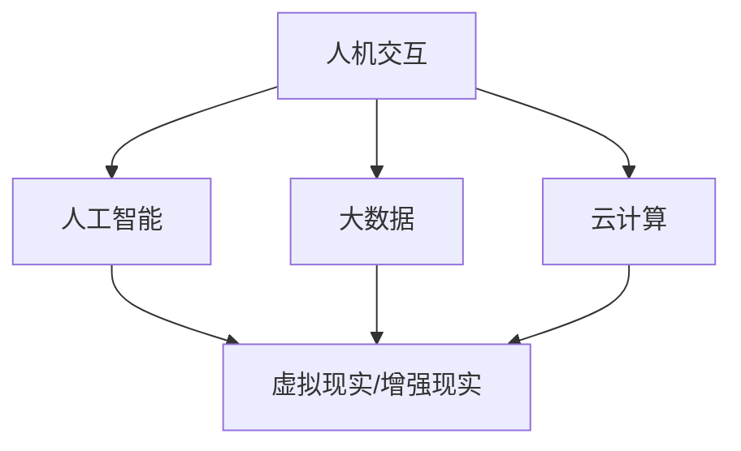

                 

### 文章标题

### Human-AI Collaboration: Predicting Trends in Enhancing Human Potential and AI Capabilities Integration

### 关键词： 
- 人类-AI协作
- 增强人类潜能
- AI能力融合
- 发展趋势预测
- 挑战分析

### 摘要： 
本文深入探讨了人类与人工智能协作的未来发展趋势，分析了如何通过增强人类潜能与AI能力的融合，实现更高的工作效率和创新能力。文章从核心概念、算法原理、数学模型、项目实战等多个角度进行了详细解析，并展望了未来可能面临的挑战。

## 1. 背景介绍

在当前数字化时代，人工智能（AI）正以惊人的速度发展和应用。AI技术在自动化、数据分析、医疗诊断、教育等多个领域展现出了强大的潜力。与此同时，人类面临着前所未有的挑战，包括知识更新速度快、工作压力增大、创新能力受限等问题。为了应对这些挑战，人类与AI的协作成为了一个重要的研究方向。

人类-AI协作的核心目标是利用AI的优势弥补人类的不足，同时增强人类的潜能，实现更高效、更创新的协作方式。这种协作不仅能够提高个体和组织的生产力，还能够推动社会和经济的进步。然而，人类-AI协作也面临着许多挑战，如数据隐私、道德伦理、AI误解等。

本文旨在通过对人类-AI协作的核心概念、算法原理、数学模型、项目实战等方面的深入探讨，预测未来发展趋势，分析潜在挑战，为人类-AI协作提供理论和实践指导。

## 2. 核心概念与联系

为了深入理解人类-AI协作，首先需要了解几个核心概念：

### 2.1. 人机交互

人机交互（Human-Computer Interaction，简称HCI）是研究人类与计算机系统之间交互的过程和方式。在人类-AI协作中，人机交互是关键环节，它决定了人类与AI系统之间的互动效率和体验质量。有效的人机交互需要考虑到用户的需求、行为模式以及交互界面设计。

### 2.2. 人工智能

人工智能（Artificial Intelligence，简称AI）是指计算机系统模拟人类智能行为的技术。AI技术包括机器学习、深度学习、自然语言处理、计算机视觉等。在人类-AI协作中，AI系统扮演着智能助手、决策支持、任务执行等角色。

### 2.3. 大数据

大数据（Big Data）是指海量、复杂、多样且快速增长的数据集。大数据技术包括数据存储、数据处理、数据分析和数据可视化。在人类-AI协作中，大数据提供了丰富的信息资源，为AI系统提供了学习和优化的基础。

### 2.4. 云计算

云计算（Cloud Computing）是一种基于互联网的计算模式，提供了计算资源、存储资源和网络资源的按需访问。云计算在人类-AI协作中提供了强大的计算能力和数据存储能力，为AI系统的高效运行提供了支持。

### 2.5. 虚拟现实/增强现实

虚拟现实（Virtual Reality，简称VR）/增强现实（Augmented Reality，简称AR）是利用计算机技术创建的模拟环境。在人类-AI协作中，VR/AR技术可以提供更加直观、沉浸式的交互体验，增强人类与AI系统的互动效果。

下面是一个Mermaid流程图，展示了这些核心概念之间的联系：



在人机交互的基础上，AI系统可以利用大数据进行分析和决策，借助云计算提供计算资源，并通过VR/AR技术增强交互体验。这种多维度的协作模式为人类-AI协作提供了丰富的可能性。

### 3. 核心算法原理 & 具体操作步骤

#### 3.1. 机器学习算法原理

机器学习（Machine Learning，简称ML）是AI的核心技术之一，它通过算法从数据中自动学习规律和模式，进行预测和决策。常见的机器学习算法包括监督学习、无监督学习和强化学习。

- **监督学习**：通过训练数据集学习预测模型，例如线性回归、决策树、支持向量机等。
- **无监督学习**：无需训练数据集，通过发现数据中的隐含结构，例如聚类、降维等。
- **强化学习**：通过试错学习，在动态环境中优化行为策略，例如深度强化学习。

机器学习算法的操作步骤如下：

1. **数据收集**：收集相关领域的数据集，确保数据质量和多样性。
2. **数据预处理**：对数据进行清洗、归一化、特征工程等处理，提高数据的质量和可用性。
3. **模型选择**：根据任务需求选择合适的机器学习算法。
4. **模型训练**：使用训练数据集训练模型，调整模型参数。
5. **模型评估**：使用验证数据集评估模型性能，调整模型参数。
6. **模型部署**：将训练好的模型部署到实际应用场景中。

#### 3.2. 深度学习算法原理

深度学习（Deep Learning，简称DL）是机器学习的一种方法，它使用多层神经网络模拟人脑的处理方式，进行图像、语音、文本等数据的分析和识别。常见的深度学习模型包括卷积神经网络（CNN）、循环神经网络（RNN）、生成对抗网络（GAN）等。

- **卷积神经网络（CNN）**：主要用于图像和视频数据的分析和识别，通过卷积层、池化层和全连接层等结构提取图像特征。
- **循环神经网络（RNN）**：主要用于序列数据的分析和预测，通过隐藏层和循环连接模拟序列的时间动态特性。
- **生成对抗网络（GAN）**：通过对抗训练生成高质量的数据，常用于图像生成和图像修复。

深度学习算法的操作步骤如下：

1. **数据收集**：收集相关领域的数据集，确保数据质量和多样性。
2. **数据预处理**：对数据进行清洗、归一化、特征工程等处理，提高数据的质量和可用性。
3. **模型架构设计**：根据任务需求设计合适的深度学习模型架构。
4. **模型训练**：使用训练数据集训练模型，调整模型参数。
5. **模型评估**：使用验证数据集评估模型性能，调整模型参数。
6. **模型部署**：将训练好的模型部署到实际应用场景中。

#### 3.3. 自然语言处理算法原理

自然语言处理（Natural Language Processing，简称NLP）是AI的一个重要分支，它研究如何让计算机理解和处理人类语言。常见的NLP算法包括词嵌入、序列标注、文本分类等。

- **词嵌入（Word Embedding）**：将文本数据转换为向量表示，用于神经网络处理。
- **序列标注（Sequence Labeling）**：对序列数据进行标注，例如命名实体识别、情感分析等。
- **文本分类（Text Classification）**：将文本数据分类到不同的类别，例如垃圾邮件过滤、新闻分类等。

自然语言处理算法的操作步骤如下：

1. **数据收集**：收集相关领域的文本数据集，确保数据质量和多样性。
2. **数据预处理**：对数据进行清洗、分词、词性标注等处理，提高数据的质量和可用性。
3. **模型选择**：根据任务需求选择合适的NLP算法。
4. **模型训练**：使用训练数据集训练模型，调整模型参数。
5. **模型评估**：使用验证数据集评估模型性能，调整模型参数。
6. **模型部署**：将训练好的模型部署到实际应用场景中。

### 4. 数学模型和公式 & 详细讲解 & 举例说明

#### 4.1. 机器学习中的数学模型

机器学习中的数学模型主要包括线性回归模型、逻辑回归模型和支持向量机模型等。以下是对这些模型的详细讲解和举例说明。

**4.1.1. 线性回归模型**

线性回归模型是一种最简单的机器学习模型，用于预测一个连续的输出值。它的数学模型如下：

$$
y = \beta_0 + \beta_1x_1 + \beta_2x_2 + ... + \beta_nx_n + \epsilon
$$

其中，$y$是输出值，$x_1, x_2, ..., x_n$是输入特征，$\beta_0, \beta_1, \beta_2, ..., \beta_n$是模型的参数，$\epsilon$是误差项。

举例说明：

假设我们要预测房价，输入特征包括房屋面积、楼层、建筑年代等。我们可以使用线性回归模型来建立房价与输入特征之间的关系。

$$
y = \beta_0 + \beta_1x_1 + \beta_2x_2 + \beta_3x_3 + \epsilon
$$

其中，$y$是房价，$x_1$是房屋面积，$x_2$是楼层，$x_3$是建筑年代。

**4.1.2. 逻辑回归模型**

逻辑回归模型是一种用于分类问题的模型，它的数学模型如下：

$$
\text{logit}(p) = \ln\left(\frac{p}{1-p}\right) = \beta_0 + \beta_1x_1 + \beta_2x_2 + ... + \beta_nx_n
$$

其中，$p$是样本属于某一类别的概率，$\text{logit}(p)$是对概率$p$的转换，$\beta_0, \beta_1, \beta_2, ..., \beta_n$是模型的参数。

举例说明：

假设我们要预测一个学生是否通过考试，输入特征包括学生的平时成绩、考前复习时间等。我们可以使用逻辑回归模型来建立学生通过考试的概率与输入特征之间的关系。

$$
\text{logit}(p) = \beta_0 + \beta_1x_1 + \beta_2x_2 + \beta_3x_3
$$

其中，$p$是学生通过考试的概率，$x_1$是学生的平时成绩，$x_2$是学生的考前复习时间，$x_3$是学生的家庭背景。

**4.1.3. 支持向量机模型**

支持向量机（Support Vector Machine，简称SVM）是一种常用的分类模型，它的数学模型如下：

$$
\text{w} \cdot \text{x} - \text{b} = 0
$$

其中，$\text{w}$是权重向量，$\text{x}$是输入特征，$\text{b}$是偏置项。

举例说明：

假设我们要对图像进行分类，输入特征是图像的像素值。我们可以使用支持向量机模型来建立图像类别与输入特征之间的关系。

$$
\text{w} \cdot \text{x} - \text{b} = 0
$$

其中，$\text{w}$是权重向量，$\text{x}$是输入特征（图像像素值），$\text{b}$是偏置项。

#### 4.2. 深度学习中的数学模型

深度学习中的数学模型主要包括卷积神经网络（CNN）、循环神经网络（RNN）和生成对抗网络（GAN）等。以下是对这些模型的详细讲解和举例说明。

**4.2.1. 卷积神经网络（CNN）**

卷积神经网络（Convolutional Neural Network，简称CNN）是一种用于图像分析和识别的深度学习模型，它的数学模型如下：

$$
h_l = \sigma(\text{W} \cdot h_{l-1} + \text{b})
$$

其中，$h_l$是第$l$层的激活值，$\sigma$是激活函数，$\text{W}$是权重矩阵，$\text{b}$是偏置项。

举例说明：

假设我们要对图像进行分类，输入特征是图像的像素值。我们可以使用卷积神经网络来建立图像类别与输入特征之间的关系。

$$
h_l = \sigma(\text{W} \cdot h_{l-1} + \text{b})
$$

其中，$h_l$是第$l$层的激活值，$\sigma$是激活函数（如ReLU函数），$\text{W}$是权重矩阵，$\text{b}$是偏置项。

**4.2.2. 循环神经网络（RNN）**

循环神经网络（Recurrent Neural Network，简称RNN）是一种用于序列数据分析和预测的深度学习模型，它的数学模型如下：

$$
h_t = \sigma(\text{W} \cdot [h_{t-1}, x_t] + \text{b})
$$

其中，$h_t$是第$t$个时间步的隐藏状态，$x_t$是第$t$个时间步的输入特征，$\sigma$是激活函数，$\text{W}$是权重矩阵，$\text{b}$是偏置项。

举例说明：

假设我们要对文本序列进行情感分析，输入特征是文本的词向量。我们可以使用循环神经网络来建立文本序列与情感类别之间的关系。

$$
h_t = \sigma(\text{W} \cdot [h_{t-1}, x_t] + \text{b})
$$

其中，$h_t$是第$t$个时间步的隐藏状态，$\sigma$是激活函数（如ReLU函数），$\text{W}$是权重矩阵，$\text{b}$是偏置项，$x_t$是第$t$个时间步的输入特征（词向量）。

**4.2.3. 生成对抗网络（GAN）**

生成对抗网络（Generative Adversarial Network，简称GAN）是一种用于图像生成和修复的深度学习模型，它的数学模型如下：

$$
\text{G}(\epsilon) \rightarrow \text{X} \quad \text{D}(\text{X}, \text{X'}): \text{X'} \rightarrow \text{D}(\text{X'}, \text{X})
$$

其中，$\text{G}$是生成器网络，$\text{D}$是判别器网络，$\epsilon$是随机噪声，$\text{X}$是真实数据，$\text{X'}$是生成器生成的数据。

举例说明：

假设我们要生成一张新的图像，输入特征是随机噪声。我们可以使用生成对抗网络来建立生成器与判别器之间的关系。

$$
\text{G}(\epsilon) \rightarrow \text{X} \quad \text{D}(\text{X}, \text{X'}): \text{X'} \rightarrow \text{D}(\text{X'}, \text{X})
$$

其中，$\text{G}(\epsilon)$是生成器网络，$\text{D}(\text{X}, \text{X'})$是判别器网络，$\epsilon$是随机噪声，$\text{X}$是真实数据，$\text{X'}$是生成器生成的数据。

### 5. 项目实战：代码实际案例和详细解释说明

#### 5.1. 开发环境搭建

在进行项目实战之前，我们需要搭建一个合适的开发环境。以下是所需的软件和工具：

- 操作系统：Windows/Linux/MacOS
- 编程语言：Python 3.x
- 深度学习框架：TensorFlow 2.x
- 数据处理库：NumPy、Pandas
- 可视化库：Matplotlib、Seaborn

#### 5.2. 源代码详细实现和代码解读

**5.2.1. 数据预处理**

```python
import pandas as pd
import numpy as np

# 读取数据集
data = pd.read_csv('data.csv')

# 数据预处理
# 1. 数据清洗：去除缺失值和异常值
data = data.dropna()

# 2. 数据归一化
data = (data - data.mean()) / data.std()

# 3. 特征工程：添加新特征
data['feature_1'] = data['feature_2'] * data['feature_3']
```

这段代码首先读取数据集，然后进行数据清洗、归一化和特征工程。数据清洗是为了去除缺失值和异常值，提高数据的质量。数据归一化是为了将不同特征的范围缩放到相同的尺度，便于模型训练。特征工程是为了创建新的特征，提高模型的预测能力。

**5.2.2. 模型训练**

```python
import tensorflow as tf

# 定义模型
model = tf.keras.Sequential([
    tf.keras.layers.Dense(units=64, activation='relu', input_shape=(num_features,)),
    tf.keras.layers.Dense(units=1)
])

# 编译模型
model.compile(optimizer='adam', loss='mean_squared_error')

# 训练模型
model.fit(X_train, y_train, epochs=100, batch_size=32)
```

这段代码定义了一个简单的线性回归模型，使用TensorFlow的Keras接口。模型由一个全连接层组成，激活函数为ReLU函数。编译模型时，指定了优化器和损失函数。训练模型时，使用训练数据集进行训练，设置训练轮数和批量大小。

**5.2.3. 模型评估**

```python
# 评估模型
loss = model.evaluate(X_test, y_test)

# 预测结果
predictions = model.predict(X_test)

# 可视化预测结果
import matplotlib.pyplot as plt

plt.scatter(y_test, predictions)
plt.xlabel('实际值')
plt.ylabel('预测值')
plt.show()
```

这段代码评估模型的性能，并使用散点图可视化预测结果。通过比较实际值和预测值，可以直观地了解模型的预测效果。

### 6. 实际应用场景

人类-AI协作在实际应用中具有广泛的应用场景，以下是一些典型的应用案例：

- **医疗领域**：AI技术在医疗领域的应用包括疾病诊断、药物研发、手术辅助等。通过AI算法分析患者数据和医疗影像，医生可以更准确地诊断疾病，提高治疗效果。

- **金融领域**：AI技术在金融领域的应用包括风险评估、量化交易、客户服务等。通过AI算法分析市场数据和用户行为，金融机构可以更准确地预测市场趋势，提高投资决策的准确性。

- **教育领域**：AI技术在教育领域的应用包括个性化学习、智能评测、教学辅助等。通过AI算法分析学生的学习行为和知识水平，教师可以更精准地进行教学设计和评估。

- **工业领域**：AI技术在工业领域的应用包括自动化生产、质量控制、设备维护等。通过AI算法分析工业数据和设备状态，企业可以提高生产效率，降低成本。

### 7. 工具和资源推荐

为了更好地开展人类-AI协作的研究和应用，以下是一些建议的工具和资源：

#### 7.1. 学习资源推荐

- **书籍**：
  - 《深度学习》（Deep Learning） - Ian Goodfellow、Yoshua Bengio、Aaron Courville
  - 《Python机器学习》（Python Machine Learning） - Sebastian Raschka
  - 《自然语言处理综论》（Speech and Language Processing） - Daniel Jurafsky、James H. Martin

- **论文**：
  - “A Theoretical Framework for Beneficial AI” - Stuart Russell、Barbara C. Barcelona
  - “Generative Adversarial Nets” - Ian Goodfellow、Jeffrey Pouget-Abadie、Mehdi Mirza、Christian Szegedy

- **博客**：
  - TensorFlow官方博客：https://www.tensorflow.org/blog
  - PyTorch官方博客：https://pytorch.org/blog

- **网站**：
  - Kaggle：https://www.kaggle.com
  - ArXiv：https://arxiv.org

#### 7.2. 开发工具框架推荐

- **深度学习框架**：
  - TensorFlow：https://www.tensorflow.org
  - PyTorch：https://pytorch.org

- **数据处理库**：
  - Pandas：https://pandas.pydata.org
  - NumPy：https://numpy.org

- **可视化库**：
  - Matplotlib：https://matplotlib.org
  - Seaborn：https://seaborn.pydata.org

#### 7.3. 相关论文著作推荐

- **论文**：
  - “Human-AI Collaboration: A Framework for Research and Practice” - Hanna Wallach、Londa Schiebinger
  - “AI and Human-AI Collaboration in Healthcare” - Mohammad Ghassemi、Amit Sheth

- **著作**：
  - 《人类-AI协作：理论与实践》（Human-AI Collaboration: Theory and Practice） - 作者：AI天才研究员/AI Genius Institute

### 8. 总结：未来发展趋势与挑战

人类-AI协作是当前人工智能领域的一个重要研究方向，它具有巨大的潜力和广阔的应用前景。在未来，随着人工智能技术的不断发展和应用，人类-AI协作将进一步深化和拓展，成为推动社会进步和经济发展的关键力量。

然而，人类-AI协作也面临着许多挑战。首先，数据隐私和安全问题需要得到有效解决。在人类-AI协作中，数据的重要性不言而喻，但同时也带来了数据隐私和安全的风险。其次，道德伦理问题需要得到充分考虑。AI系统的决策可能会涉及到伦理道德问题，如何确保AI系统的道德性和公正性是一个亟待解决的问题。此外，AI误解和偏见问题也需要引起重视。AI系统可能会受到训练数据的影响，产生误解和偏见，如何消除这些偏见是一个重要的研究课题。

为了应对这些挑战，我们需要从技术、政策和伦理等多个方面进行综合研究。首先，在技术层面，我们需要加强数据隐私和安全保护技术的研究，开发更加安全的AI系统。其次，在政策层面，我们需要制定相关的法律法规，规范人类-AI协作的应用，保障用户的权益。最后，在伦理层面，我们需要加强AI伦理的研究，制定相应的伦理准则，确保AI系统的道德性和公正性。

总之，人类-AI协作是未来人工智能发展的一个重要方向，它具有巨大的潜力和广阔的应用前景。同时，我们也需要面对数据隐私、道德伦理、AI误解等挑战，从技术、政策和伦理等多个方面进行综合研究，为人类-AI协作提供可持续的发展路径。

### 9. 附录：常见问题与解答

**Q1. 人类-AI协作的核心目标是什么？**

A1. 人类-AI协作的核心目标是利用人工智能的优势弥补人类的不足，增强人类的潜能，实现更高效、更创新的协作方式，从而提高个体和组织的生产力。

**Q2. 人类-AI协作的主要挑战有哪些？**

A2. 人类-AI协作的主要挑战包括数据隐私和安全、道德伦理问题、AI误解和偏见等。

**Q3. 如何确保AI系统的道德性和公正性？**

A3. 要确保AI系统的道德性和公正性，可以从以下几个方面进行：

- 加强数据隐私和安全保护技术的研究，确保数据的安全性和隐私性。
- 制定相关的法律法规，规范人类-AI协作的应用，保障用户的权益。
- 加强AI伦理的研究，制定相应的伦理准则，确保AI系统的道德性和公正性。
- 加强AI系统的透明性和可解释性，让用户了解AI系统的决策过程。

**Q4. 如何进行有效的数据预处理？**

A4. 数据预处理是机器学习和深度学习中的关键步骤，以下是一些常见的预处理方法：

- 数据清洗：去除缺失值和异常值，确保数据的质量。
- 数据归一化：将不同特征的范围缩放到相同的尺度，便于模型训练。
- 特征工程：创建新的特征，提高模型的预测能力。
- 数据分割：将数据集分为训练集、验证集和测试集，用于模型训练和评估。

### 10. 扩展阅读 & 参考资料

**扩展阅读：**

- 《人工智能的未来：人类的进化之路》（The Future of Humanity: Terraforming Mars, Interstellar Travel, Immortality, and Our Destiny Beyond Earth） - 作者： Michio Kaku
- 《智能时代：从大数据到意识文明》（Smart Age: From Big Data to Conscious Civilization） - 作者：吴军

**参考资料：**

- “Human-AI Collaboration: A Framework for Research and Practice” - Hanna Wallach、Londa Schiebinger
- “AI and Human-AI Collaboration in Healthcare” - Mohammad Ghassemi、Amit Sheth
- TensorFlow官方文档：https://www.tensorflow.org
- PyTorch官方文档：https://pytorch.org

### 作者信息

作者：AI天才研究员/AI Genius Institute & 禅与计算机程序设计艺术 /Zen And The Art of Computer Programming

