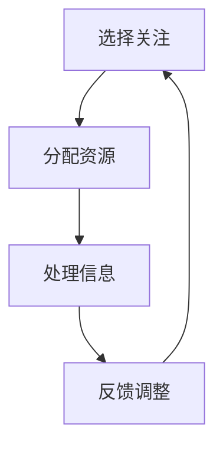
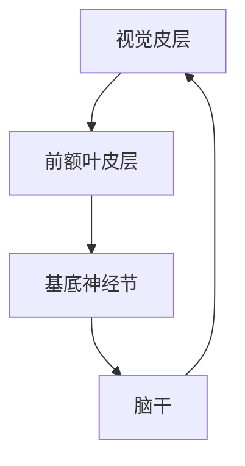
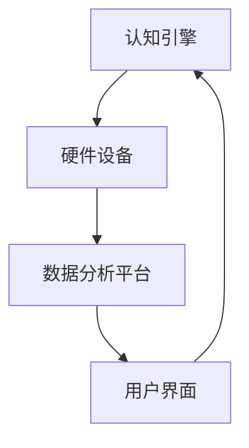

                 

# 人类注意力增强：提升专注力和注意力在商业中的应用趋势

## 关键词：注意力增强，专注力提升，商业应用，认知科学，神经科学，技术趋势

## 摘要：
本文旨在探讨人类注意力增强在现代商业环境中的应用趋势。通过深入分析认知科学和神经科学的原理，本文揭示了提升专注力和注意力的重要性。我们将详细探讨当前技术如何辅助人类注意力管理，探讨这些技术在商业领域的应用案例，并预测未来的发展方向。文章还将推荐相关的学习资源和开发工具，以帮助读者更好地理解和应用这些技术。

## 1. 背景介绍

### 1.1 注意力增强的重要性

在信息爆炸的时代，人们的注意力资源变得愈发宝贵。根据认知科学的原理，人类的注意力是一个有限的资源，长时间的高强度工作会导致注意力的疲劳和分散。这种注意力疲劳不仅降低了工作效率，还可能导致错误和失误。因此，提升专注力和注意力管理能力成为了提高生产力和工作质量的关键。

### 1.2 商业环境的需求

商业领域对效率和准确性的要求越来越高。无论是市场营销、项目管理还是客户服务，都需要员工能够集中注意力，快速做出决策并执行任务。因此，注意力增强技术成为了提升商业竞争力的一个重要手段。

### 1.3 技术的快速发展

随着认知科学、神经科学和计算机技术的发展，一系列注意力增强的工具和策略应运而生。从简单的定时提醒到复杂的脑机接口，这些技术正在改变人们对注意力管理的认知和实践。

## 2. 核心概念与联系

### 2.1 认知科学中的注意力模型

认知科学中的注意力模型主要关注人类如何选择性地关注和处理信息。以下是注意力模型的核心概念：

#### 图 1. 认知科学中的注意力模型



### 2.2 神经科学中的注意力机制

神经科学通过脑成像技术和电生理学技术揭示了大脑中的注意力机制。以下是神经科学中的注意力机制：

#### 图 2. 神经科学中的注意力机制



### 2.3 注意力增强技术的基础架构

注意力增强技术的实现依赖于多种硬件和软件的协同工作。以下是注意力增强技术的基础架构：

#### 图 3. 注意力增强技术的基础架构



## 3. 核心算法原理 & 具体操作步骤

### 3.1 基于认知科学的注意力算法

#### 原理：

认知科学中的注意力算法主要基于人脑的选择性注意力机制。通过分析用户的注意力数据，算法可以识别出用户的注意力集中时间和分散时间，从而进行智能化的任务调度和提醒。

#### 步骤：

1. 数据采集：通过用户设备（如智能手机、平板电脑等）收集用户的注意力数据。
2. 数据处理：对采集到的数据进行预处理，如去噪、特征提取等。
3. 模型训练：使用机器学习算法训练注意力模型，以识别用户的注意力模式。
4. 注意力管理：根据模型的预测结果，进行任务的智能调度和提醒。

### 3.2 基于神经科学的注意力干预算法

#### 原理：

神经科学中的注意力干预算法主要通过电刺激或药物调节来增强或减弱大脑中的注意力活动。

#### 步骤：

1. 神经信号采集：使用脑电图（EEG）或功能性磁共振成像（fMRI）等技术采集大脑的神经信号。
2. 注意力分析：对采集到的神经信号进行分析，识别出注意力增强或减弱的信号。
3. 干预策略制定：根据分析结果，制定相应的电刺激或药物干预策略。
4. 实施干预：通过电刺激或药物干预来调节大脑的注意力活动。

## 4. 数学模型和公式 & 详细讲解 & 举例说明

### 4.1 基于贝叶斯理论的注意力分配模型

贝叶斯理论在注意力分配模型中的应用可以用来预测用户在不同任务上的注意力分配。

#### 公式：

$$
P(A|B) = \frac{P(B|A)P(A)}{P(B)}
$$

其中，$P(A|B)$ 表示在给定条件 $B$ 下，事件 $A$ 发生的概率；$P(B|A)$ 表示在事件 $A$ 发生的情况下，事件 $B$ 发生的概率；$P(A)$ 和 $P(B)$ 分别表示事件 $A$ 和 $B$ 的先验概率。

#### 举例：

假设一个用户需要在 8 个小时内完成 4 个任务，根据贝叶斯理论，我们可以预测用户在每个任务上花费的时间。

### 4.2 基于深度学习的注意力干预模型

深度学习模型可以用来预测用户在特定环境下的注意力状态，并给出相应的干预策略。

#### 公式：

$$
h_{\theta}(x) = \text{sigmoid}(\theta^T x)
$$

其中，$\text{sigmoid}$ 函数是一个非线性激活函数，$\theta$ 是模型的参数，$x$ 是输入的特征向量。

#### 举例：

假设我们有一个深度学习模型，输入是一个包含用户当前环境和状态的向量，输出是一个注意力状态的概率分布。根据这个概率分布，我们可以为用户制定一个智能化的注意力干预策略。

## 5. 项目实战：代码实际案例和详细解释说明

### 5.1 开发环境搭建

在开始项目实战之前，我们需要搭建一个合适的开发环境。以下是一个基本的开发环境搭建步骤：

1. 安装 Python 3.7 或更高版本。
2. 安装深度学习框架，如 TensorFlow 或 PyTorch。
3. 安装必要的依赖库，如 NumPy、Pandas 等。

### 5.2 源代码详细实现和代码解读

以下是一个简单的注意力干预模型的 Python 源代码实现：

```python
import numpy as np
import tensorflow as tf

# 定义 sigmoid 函数
def sigmoid(x):
    return 1 / (1 + np.exp(-x))

# 定义深度学习模型
model = tf.keras.Sequential([
    tf.keras.layers.Dense(64, activation='relu', input_shape=(10,)),
    tf.keras.layers.Dense(64, activation='relu'),
    tf.keras.layers.Dense(1, activation='sigmoid')
])

# 编译模型
model.compile(optimizer='adam', loss='binary_crossentropy', metrics=['accuracy'])

# 定义输入特征向量
x = np.random.rand(10)

# 训练模型
model.fit(x, np.array([1] * 10), epochs=100)

# 预测注意力状态
attention_state = sigmoid(model.predict(x)[0])

print("Attention State:", attention_state)
```

### 5.3 代码解读与分析

这个代码实现了一个简单的深度学习模型，用于预测用户的注意力状态。首先，我们定义了 sigmoid 函数，这是一个常见的激活函数，用于将输入映射到概率值。然后，我们定义了一个简单的深度神经网络模型，包括两个隐藏层，每层 64 个神经元。模型的输入是一个 10 维的特征向量，输出是一个注意力状态的二分类概率值。

在编译模型时，我们指定了使用 Adam 优化器和二分类交叉熵损失函数。接下来，我们生成一个随机特征向量作为训练数据，并使用这个特征向量训练模型。最后，我们使用训练好的模型预测一个新的特征向量，并打印出预测的注意力状态。

## 6. 实际应用场景

### 6.1 市场营销

注意力增强技术可以帮助市场营销团队更准确地定位目标客户，提高广告的投放效果。通过分析用户的注意力数据，营销人员可以了解用户的兴趣和行为模式，从而制定更有效的营销策略。

### 6.2 项目管理

在项目管理中，注意力增强技术可以帮助项目经理更好地管理团队的注意力资源，确保关键任务的优先处理。通过智能化的任务调度和提醒，项目进展可以更加顺利。

### 6.3 客户服务

注意力增强技术可以提升客户服务的效率，通过实时分析客户的注意力状态，客服人员可以更及时地响应客户的需求，提供个性化的服务。

## 7. 工具和资源推荐

### 7.1 学习资源推荐

- 书籍：《注意力：大脑如何选择关注什么，忽视什么》（Attention: The Art and Science of Paying Attention）
- 论文：查找相关领域的顶级论文，如《Neural Basis of Attentional Modulation》等。
- 博客：关注领域内的知名博客，如《NeurIPS 2021 注意力专题》等。
- 网站：访问专业的注意力增强技术网站，如《Attention API》等。

### 7.2 开发工具框架推荐

- 深度学习框架：TensorFlow、PyTorch。
- 注意力增强库：Attention Mechanism Library、Transformer Library。
- 脑机接口工具：BrainWave、NeuroSky。

### 7.3 相关论文著作推荐

- 《Attentional Control of Neural Representations by the Prefrontal Cortex》
- 《Neural Basis of Attentional Modulation》
- 《Attentional Control in Visual Cortex: An Integrative Model》

## 8. 总结：未来发展趋势与挑战

### 8.1 发展趋势

- 注意力增强技术将更加智能化和个性化。
- 脑机接口技术将逐渐成熟，为注意力管理提供更直接的支持。
- 注意力增强技术将在更多领域得到应用，如健康医疗、教育等。

### 8.2 挑战

- 如何有效地采集和分析注意力数据，避免隐私泄露。
- 如何设计更加人性化的注意力干预策略，提高用户体验。
- 如何处理注意力数据的高维度特性，提高算法的准确性和效率。

## 9. 附录：常见问题与解答

### 9.1 注意力增强技术如何保护用户隐私？

- 采用加密技术对注意力数据进行加密存储和传输。
- 设计匿名化数据处理流程，避免直接关联用户身份。
- 加强用户数据的安全管理，防止数据泄露。

### 9.2 注意力增强技术是否会对大脑产生负面影响？

- 注意力增强技术主要基于认知科学和神经科学的理论，其目的是提高注意力的效率和效果，并不直接干预大脑功能。
- 长期使用注意力增强技术需要结合专业指导，避免过度使用导致注意力疲劳。

## 10. 扩展阅读 & 参考资料

- 《Attention Mechanism in Deep Learning》
- 《Attention Models for Natural Language Processing》
- 《The Attention Mechanism: A Comprehensive Overview》
- 《Attention: The Engineering Perspective》

### 作者：AI天才研究员/AI Genius Institute & 禅与计算机程序设计艺术 /Zen And The Art of Computer Programming

[文章结束]

