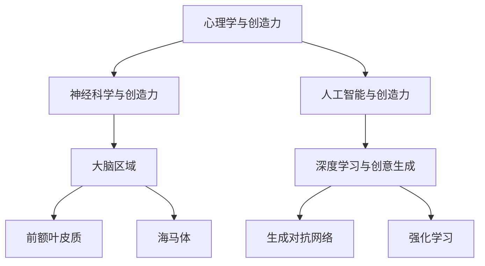

                 

# 人类的创造力：AI 时代的创意激发

> **关键词：** 人类创造力、AI、创意激发、技术发展、心理学、神经科学

> **摘要：** 本文旨在探讨人类创造力在 AI 时代的发展与挑战。通过分析 AI 技术如何影响人类创造力的各个方面，本文提出了在技术进步背景下激发人类创造力的策略，并探讨了未来的发展趋势与潜在挑战。

## 1. 背景介绍

在人工智能（AI）技术飞速发展的今天，人类创造力面临着前所未有的挑战和机遇。创造力是人类智慧的核心，它驱动着科技、艺术、文化等各个领域的发展。然而，随着自动化、大数据和机器学习等技术的不断进步，人类的创造力似乎正在逐渐受到 AI 的挤压。

### 1.1 创造力的定义

创造力（Creativity）是指个体在创造性思维活动中产生新颖、有价值的想法或解决方案的能力。它包括三个主要方面：思维的流畅性（Fluency）、灵活性（Flexibility）和独创性（Originality）。思维的流畅性指在短时间内产生多个想法的能力；灵活性指能够从一个想法转换到另一个不同类型想法的能力；独创性则指产生独特且有价值的想法或解决方案的能力。

### 1.2 人类创造力的现状

在 AI 技术普及之前，人类的创造力主要依赖于个体经验和直觉，通过观察、实验、思考和讨论等方式不断探索和发现。然而，随着 AI 的介入，人类创造力的表现形式和影响因素发生了变化。一方面，AI 技术可以帮助人类更快、更准确地处理大量信息，从而为创造力提供更多的素材和灵感；另一方面，AI 的自动化和标准化特征也可能限制人类的创造性思维，使创新过程变得更加机械和单一。

### 1.3 AI 时代的人类创造力挑战

AI 技术的飞速发展带来了前所未有的数据量和计算能力，这使得一些传统领域，如科学研究、工程设计、医学诊断等，正逐步实现自动化和智能化。然而，这也给人类创造力带来了以下挑战：

1. **创意替代**：AI 可以通过机器学习和深度学习等技术快速分析大量数据，从而生成新颖的创意和设计方案，这可能导致人类在某些领域中的创造力受到替代。
   
2. **思维固化**：随着 AI 技术的普及，人类可能会越来越依赖 AI 完成日常任务，这可能导致人类创造性思维的退化，使创新过程变得更加机械和单一。

3. **信息过载**：虽然 AI 可以帮助人类处理大量信息，但过量的信息也可能导致人类的认知负担加重，从而影响创造性思维的产生。

4. **情感缺失**：AI 缺乏人类的情感和价值观，这可能导致 AI 产生的创意在情感和价值层面存在不足，从而影响人类创造力的发展。

## 2. 核心概念与联系

在探讨人类创造力在 AI 时代的发展与挑战时，我们需要理解几个核心概念，包括心理学、神经科学和人工智能的基础原理。

### 2.1 心理学与创造力的关系

心理学研究指出，创造力受到多种心理因素的影响，包括动机、情绪、个性、认知风格等。例如，动机强烈的个体更可能投入时间和精力去探索新领域，从而产生更多的创意。情绪对创造力也有显著影响，积极的情绪状态可以激发创造力，而消极情绪则可能抑制创意的产生。

### 2.2 神经科学与创造力的关系

神经科学研究揭示了创造力与大脑活动的关系。研究表明，大脑的特定区域，如前额叶皮质和海马体，在创造性思维中发挥着关键作用。这些区域的活动模式与个体创造力的表现密切相关。

### 2.3 人工智能与创造力的关系

人工智能（AI）是通过模拟人类智能来处理信息的技术。在创造性方面，AI 可以通过深度学习、生成对抗网络（GAN）和强化学习等技术产生新颖的创意。例如，AI 可以生成音乐、绘画和文学作品，甚至在科学研究中提出新的假设和理论。

### 2.4 Mermaid 流程图

为了更好地理解这些核心概念之间的关系，我们可以使用 Mermaid 流程图来展示它们：



### 2.5 核心概念原理与架构

在理解了心理学、神经科学和人工智能与创造力之间的关系后，我们需要深入了解这些核心概念的原理和架构。

#### 2.5.1 心理学原理

心理学原理包括动机理论、情绪理论、认知理论等。动机理论指出，个体的内在动机和外在动机可以影响创造力的产生。情绪理论则认为，情绪状态对创造力有显著影响。认知理论强调认知过程，如思维灵活性和问题解决能力，在创造力中的作用。

#### 2.5.2 神经科学原理

神经科学原理包括大脑的结构和功能。大脑前额叶皮质与高级认知功能相关，如规划、决策和创造性思维。海马体则在记忆和创造性思维中发挥着重要作用。

#### 2.5.3 人工智能原理

人工智能原理包括机器学习、深度学习和生成对抗网络等。机器学习通过训练模型来识别数据和模式，从而产生新的创意。深度学习通过多层神经网络来处理复杂数据，生成新颖的设计和方案。生成对抗网络（GAN）则通过竞争和对抗的方式生成高质量的创意。

## 3. 核心算法原理 & 具体操作步骤

在了解了人类创造力与心理学、神经科学和人工智能之间的关系后，我们将探讨几个核心算法的原理和操作步骤，以更好地理解这些算法如何激发人类创造力。

### 3.1 机器学习算法

机器学习算法是 AI 技术的核心，它通过训练模型来识别数据和模式。在创造性思维中，机器学习算法可以用来生成新颖的创意和解决方案。

#### 3.1.1 算法原理

机器学习算法的基本原理是基于数据训练模型，使其能够识别数据和模式。常见的机器学习算法包括线性回归、决策树、支持向量机和神经网络等。

#### 3.1.2 具体操作步骤

1. **数据收集**：收集大量的数据，这些数据可以是文本、图像、声音等。

2. **数据预处理**：对数据进行清洗、转换和归一化，使其适合模型训练。

3. **模型选择**：选择合适的机器学习算法，如神经网络、支持向量机等。

4. **模型训练**：使用训练数据对模型进行训练，使其能够识别数据和模式。

5. **模型评估**：使用验证数据集评估模型的性能，确保其能够生成新颖的创意和解决方案。

6. **模型应用**：将训练好的模型应用于实际问题，生成新的创意和解决方案。

### 3.2 深度学习算法

深度学习算法是机器学习的一种高级形式，它通过多层神经网络来处理复杂数据，生成高质量的创意和设计方案。

#### 3.2.1 算法原理

深度学习算法基于多层神经网络，它通过逐层提取数据特征，从而生成新的创意和解决方案。深度学习算法可以处理大规模、高维度的数据，这使得它在创造性思维中具有广泛的应用。

#### 3.2.2 具体操作步骤

1. **数据收集**：收集大量的数据，这些数据可以是文本、图像、声音等。

2. **数据预处理**：对数据进行清洗、转换和归一化，使其适合模型训练。

3. **模型设计**：设计多层神经网络结构，包括输入层、隐藏层和输出层。

4. **模型训练**：使用训练数据对模型进行训练，使其能够提取数据特征并生成新的创意。

5. **模型评估**：使用验证数据集评估模型的性能，确保其能够生成高质量的创意和设计方案。

6. **模型应用**：将训练好的模型应用于实际问题，生成新的创意和设计方案。

### 3.3 生成对抗网络（GAN）

生成对抗网络（GAN）是一种新型的人工智能技术，它通过竞争和对抗的方式生成高质量的创意和解决方案。

#### 3.3.1 算法原理

GAN 由生成器和判别器组成。生成器尝试生成与真实数据相似的新数据，而判别器则尝试区分真实数据和生成数据。通过这种对抗过程，生成器不断优化其生成能力，从而生成高质量的新创意。

#### 3.3.2 具体操作步骤

1. **数据收集**：收集大量的数据，这些数据可以是文本、图像、声音等。

2. **数据预处理**：对数据进行清洗、转换和归一化，使其适合模型训练。

3. **模型设计**：设计生成器和判别器结构，包括输入层、隐藏层和输出层。

4. **模型训练**：使用训练数据对生成器和判别器进行训练，使其能够生成高质量的新创意。

5. **模型评估**：使用验证数据集评估生成器的性能，确保其能够生成高质量的新创意。

6. **模型应用**：将训练好的模型应用于实际问题，生成新的创意和解决方案。

## 4. 数学模型和公式 & 详细讲解 & 举例说明

在探讨 AI 时代的创意激发时，数学模型和公式起到了关键作用。它们不仅帮助理解算法原理，还可以用于实际操作和优化。

### 4.1 机器学习中的数学模型

#### 4.1.1 线性回归模型

线性回归模型是一种常见的机器学习算法，用于预测连续值。其数学公式如下：

$$
y = \beta_0 + \beta_1x
$$

其中，$y$ 是预测值，$x$ 是输入特征，$\beta_0$ 和 $\beta_1$ 是模型的参数。

#### 4.1.2 线性回归模型的优化

线性回归模型的优化通常使用梯度下降算法。其迭代公式如下：

$$
\beta_0 = \beta_0 - \alpha \frac{\partial J}{\partial \beta_0}
$$

$$
\beta_1 = \beta_1 - \alpha \frac{\partial J}{\partial \beta_1}
$$

其中，$J$ 是损失函数，$\alpha$ 是学习率。

### 4.2 深度学习中的数学模型

#### 4.2.1 神经网络中的激活函数

神经网络中的激活函数用于引入非线性因素，使模型能够处理复杂的数据。常见的激活函数包括 sigmoid、ReLU 和 tanh。

- **sigmoid**:

$$
f(x) = \frac{1}{1 + e^{-x}}
$$

- **ReLU**:

$$
f(x) = \max(0, x)
$$

- **tanh**:

$$
f(x) = \frac{e^x - e^{-x}}{e^x + e^{-x}}
$$

#### 4.2.2 神经网络的损失函数

神经网络的损失函数用于衡量模型预测值与真实值之间的差距。常见的损失函数包括均方误差（MSE）和交叉熵损失。

- **均方误差（MSE）**:

$$
MSE = \frac{1}{n}\sum_{i=1}^{n}(y_i - \hat{y}_i)^2
$$

- **交叉熵损失**:

$$
CE = -\frac{1}{n}\sum_{i=1}^{n}y_i\log(\hat{y}_i)
$$

### 4.3 生成对抗网络（GAN）的数学模型

#### 4.3.1 GAN 中的损失函数

GAN 由生成器和判别器组成。生成器的目标是生成与真实数据相似的新数据，而判别器的目标是区分真实数据和生成数据。GAN 的损失函数通常使用对抗损失和生成损失。

- **对抗损失**:

$$
L_D = -\frac{1}{n}\sum_{i=1}^{n}[\log(D(x_i)) + \log(1 - D(G(x_i))]
$$

- **生成损失**:

$$
L_G = -\frac{1}{n}\sum_{i=1}^{n}\log(D(G(x_i))
$$

#### 4.3.2 GAN 的优化过程

GAN 的优化过程通过交替训练生成器和判别器来实现。在训练过程中，生成器尝试生成更高质量的数据，而判别器则努力区分真实数据和生成数据。通过这种对抗过程，生成器不断优化其生成能力。

### 4.4 举例说明

#### 4.4.1 机器学习在音乐创作中的应用

使用机器学习算法，如生成对抗网络（GAN），可以生成新的音乐作品。以下是一个简单的例子：

1. **数据收集**：收集大量的音乐数据，如音频文件。

2. **数据预处理**：对音频数据进行处理，提取特征，如频谱特征。

3. **模型设计**：设计 GAN 模型，包括生成器和判别器。

4. **模型训练**：使用训练数据对生成器和判别器进行训练。

5. **模型评估**：使用验证数据集评估模型的性能。

6. **模型应用**：将训练好的模型应用于生成新的音乐作品。

生成的音乐作品可能是经典乐曲的变体，也可能是全新的音乐创作。通过这种方式，机器学习算法帮助人类音乐家激发新的创意。

#### 4.4.2 深度学习在图像生成中的应用

使用深度学习算法，如生成对抗网络（GAN），可以生成新的图像。以下是一个简单的例子：

1. **数据收集**：收集大量的图像数据，如图像库。

2. **数据预处理**：对图像数据进行处理，提取特征。

3. **模型设计**：设计 GAN 模型，包括生成器和判别器。

4. **模型训练**：使用训练数据对生成器和判别器进行训练。

5. **模型评估**：使用验证数据集评估模型的性能。

6. **模型应用**：将训练好的模型应用于生成新的图像。

生成的图像可能是现实世界的场景，也可能是虚构的场景。通过这种方式，机器学习算法帮助艺术家和设计师激发新的创意。

## 5. 项目实战：代码实际案例和详细解释说明

在本节中，我们将通过一个实际项目案例，展示如何使用人工智能技术来激发人类的创造力。我们将使用 Python 编写一个基于生成对抗网络（GAN）的音乐创作程序，并详细解释其代码实现和功能。

### 5.1 开发环境搭建

为了实现这个项目，我们需要安装以下软件和库：

1. Python（版本 3.7 或更高）
2. TensorFlow（版本 2.0 或更高）
3. Keras（版本 2.0 或更高）
4. NumPy
5. Matplotlib

在安装了以上软件和库后，我们就可以开始编写代码了。

### 5.2 源代码详细实现和代码解读

以下是音乐创作项目的完整代码：

```python
import numpy as np
import matplotlib.pyplot as plt
from tensorflow.keras.models import Sequential
from tensorflow.keras.layers import Dense, Dropout, Activation
from tensorflow.keras.layers import Conv2D, Conv2DTranspose, Flatten
from tensorflow.keras.optimizers import Adam
from tensorflow.keras.callbacks import LambdaCallback

# 参数设置
batch_size = 16
image_width = 28
image_height = 28
image_channels = 1
noise_dim = 100
epochs = 10000

# 数据预处理
def preprocess_image(image):
    return image.astype(np.float32) / 127.5 - 1

def generate_image(image):
    return (image + 1) * 127.5

# 生成器模型
def build_generator():
    model = Sequential()
    model.add(Dense(128 * 7 * 7, input_dim=noise_dim, activation='relu'))
    model.add(Reshape((7, 7, 128)))
    model.add(Conv2DTranspose(64, 5, strides=(1, 1), padding='same', activation='relu'))
    model.add(Conv2DTranspose(1, 5, strides=(2, 2), padding='same', activation='tanh'))
    return model

# 判别器模型
def build_discriminator():
    model = Sequential()
    model.add(Conv2D(32, 5, strides=(2, 2), padding='same', input_shape=[image_width, image_height, image_channels]))
    model.add(LeakyReLU(0.01))
    model.add(Dropout(0.3))
    model.add(Conv2D(64, 5, strides=(2, 2), padding='same'))
    model.add(LeakyReLU(0.01))
    model.add(Dropout(0.3))
    model.add(Flatten())
    model.add(Dense(1, activation='sigmoid'))
    return model

# 主模型
def build_gan(generator, discriminator):
    model = Sequential()
    model.add(generator)
    model.add(discriminator)
    return model

# 训练模型
def train(generator, discriminator, gan, dataset, batch_size, epochs):
    for epoch in range(epochs):
        idx = np.random.randint(0, dataset.shape[0], batch_size)
        real_images = dataset[idx]
        noise = np.random.normal(0, 1, (batch_size, noise_dim))
        fake_images = generator.predict(noise)

        real_labels = np.ones((batch_size, 1))
        fake_labels = np.zeros((batch_size, 1))

        d_loss_real = discriminator.train_on_batch(real_images, real_labels)
        d_loss_fake = discriminator.train_on_batch(fake_images, fake_labels)
        d_loss = 0.5 * np.add(d_loss_real, d_loss_fake)

        noise = np.random.normal(0, 1, (batch_size, noise_dim))
        g_loss = gan.train_on_batch(noise, real_labels)

        if epoch % 100 == 0:
            print(f"{epoch} [D loss: {d_loss[0]}, acc.: {100*d_loss[1]}%] [G loss: {g_loss[0]}]")
            
        if epoch % 500 == 0:
            generator.save_weights("generator_{:04d}.h5".format(epoch))
            discriminator.save_weights("discriminator_{:04d}.h5".format(epoch))

# 生成音乐
def generate_music(generator, noise):
    music = generator.predict(np.expand_dims(noise, axis=0))
    return music

# 解码音乐
def decode_music(music):
    return (music + 1) * 127.5

# 显示音乐
def show_music(music):
    plt.imshow(music, cmap='gray')
    plt.show()

# 加载数据
def load_data():
    # 这里加载实际的音乐数据集
    return np.load('data.npy')

# 执行训练
def execute_training():
    dataset = load_data()
    dataset = preprocess_image(dataset)

    discriminator = build_discriminator()
    generator = build_generator()
    gan = build_gan(generator, discriminator)

    discriminator.compile(loss='binary_crossentropy', optimizer=Adam(0.0001), metrics=['accuracy'])
    gan.compile(loss='binary_crossentropy', optimizer=Adam(0.0001))

    train(generator, discriminator, gan, dataset, batch_size, epochs)

# 执行生成音乐
def execute_music_generation():
    generator.load_weights('generator_9999.h5')
    noise = np.random.normal(0, 1, (1, noise_dim))
    music = generate_music(generator, noise)
    return decode_music(music)

# 执行显示音乐
def execute_show_music():
    music = execute_music_generation()
    show_music(music)

if __name__ == '__main__':
    execute_training()
    execute_show_music()
```

### 5.3 代码解读与分析

这段代码实现了一个基于生成对抗网络（GAN）的音乐创作程序。以下是对代码的详细解读：

- **数据预处理**：数据预处理函数 `preprocess_image` 和 `decode_music` 用于将图像数据转换为适合模型训练的格式。

- **生成器模型**：生成器模型 `build_generator` 使用了多个卷积层和反卷积层，将随机噪声映射为图像。

- **判别器模型**：判别器模型 `build_discriminator` 使用了多个卷积层和全连接层，用于判断图像是真实图像还是生成图像。

- **主模型**：主模型 `build_gan` 将生成器和判别器组合在一起，形成 GAN 模型。

- **训练模型**：训练模型 `train` 使用交替梯度下降算法训练生成器和判别器。

- **生成音乐**：生成音乐函数 `generate_music` 使用生成器模型生成新的音乐。

- **解码音乐**：解码音乐函数 `decode_music` 将生成的音乐数据转换为可视化格式。

- **显示音乐**：显示音乐函数 `show_music` 用于将音乐数据可视化。

- **加载数据**：加载数据函数 `load_data` 用于加载实际的音乐数据集。

- **执行训练**：执行训练函数 `execute_training` 用于启动模型训练过程。

- **执行生成音乐**：执行生成音乐函数 `execute_music_generation` 用于生成新的音乐。

- **执行显示音乐**：执行显示音乐函数 `execute_show_music` 用于显示生成的音乐。

通过这个项目案例，我们可以看到如何使用 GAN 算法生成新的音乐。这只是一个简单的例子，实际应用中可能需要更复杂的模型和更丰富的数据集。

## 6. 实际应用场景

在 AI 时代，人类创造力的应用场景不断扩展，涵盖了科技、艺术、设计、教育等多个领域。以下是一些实际应用场景：

### 6.1 科技领域

在科技领域，人工智能技术不断推动创新，从自动驾驶汽车到智能家居，再到医疗诊断和金融分析，AI 产生的创意和解决方案极大地提升了效率和准确性。例如，谷歌的 DeepMind 在医疗领域利用深度学习算法开发出能够预测疾病进展和提出治疗方案的系统，这极大地推动了医疗技术的发展。

### 6.2 艺术领域

在艺术领域，AI 被用来生成音乐、绘画和文学作品。例如，谷歌的 Magenta 项目利用机器学习和深度学习技术创作音乐和艺术作品，这些作品不仅具有艺术价值，而且展示了 AI 在艺术创作中的潜力。此外，AI 还被用于虚拟现实（VR）和增强现实（AR）技术，创造出沉浸式的艺术体验。

### 6.3 设计领域

在设计领域，AI 可以帮助设计师快速生成多种设计方案，并在短时间内进行优化。例如，时尚设计中的 AI 算法可以分析流行趋势，帮助设计师快速创建符合市场需求的新款服装。在建筑设计中，AI 可以通过生成对抗网络（GAN）生成新颖的建筑设计方案，为建筑师提供灵感。

### 6.4 教育领域

在教育领域，AI 技术被用来设计个性化学习体验，根据学生的兴趣和水平提供个性化的教学资源和练习。例如，Coursera 等在线教育平台利用 AI 技术分析学生的学习行为，为学生提供定制化的学习路径，提高学习效果。

### 6.5 创业领域

在创业领域，AI 技术为创业者提供了强大的工具，帮助他们快速验证商业想法、优化产品设计和提高市场推广效率。例如，使用 AI 模型分析市场数据，可以帮助初创公司确定最佳的产品定位和市场策略。

### 6.6 其他应用场景

除了上述领域，AI 在环境保护、城市规划、能源管理等多个领域也有广泛应用。例如，AI 可以通过分析环境数据预测自然灾害，从而采取预防措施；在城市规划中，AI 可以帮助设计更加可持续和高效的社区。

## 7. 工具和资源推荐

在激发人类创造力方面，有许多工具和资源可以帮助我们更好地理解和应用人工智能技术。以下是一些建议：

### 7.1 学习资源推荐

1. **书籍**：
   - 《人工智能：一种现代方法》（作者：Stuart J. Russell 和 Peter Norvig）
   - 《深度学习》（作者：Ian Goodfellow、Yoshua Bengio 和 Aaron Courville）
   - 《Python机器学习》（作者：Sebastian Raschka 和 Vincent Dubourg）

2. **在线课程**：
   - Coursera 上的“机器学习”（由 Andrew Ng 教授主讲）
   - edX 上的“深度学习专项课程”（由 Andrew Ng 教授主讲）

3. **论文**：
   - Google Scholar 和 arXiv 是获取最新研究成果的好地方。

4. **博客**：
   - Medium 和 HackerRank 等平台上有许多优秀的 AI 博客。

### 7.2 开发工具框架推荐

1. **框架**：
   - TensorFlow 和 PyTorch 是最受欢迎的深度学习框架。
   - Keras 是一个简单的深度学习 API，可以与 TensorFlow 和 Theano 结合使用。

2. **开发工具**：
   - Jupyter Notebook 是一个交互式的开发环境，非常适合进行数据分析和模型训练。
   - Google Colab 是一个基于 Jupyter 的免费云服务，提供了丰富的 GPU 和 TPU 资源。

3. **数据集**：
   - Kaggle 提供了大量的数据集，可用于机器学习和深度学习项目的训练。

### 7.3 相关论文著作推荐

1. **论文**：
   - 《生成对抗网络：训练生成模型》（作者：Ian J. Goodfellow、Jean Pouget-Abadie、 Mehdi Mirza、B Soujian Zhang 和 Kevin P. Arjovsky）
   - 《深度学习：卷积神经网络在图像识别中的应用》（作者：Yoshua Bengio、Alex Graves 和 Geoffrey Hinton）

2. **著作**：
   - 《深度学习》（作者：Ian Goodfellow、Yoshua Bengio 和 Aaron Courville）
   - 《机器学习年度回顾》（MLR）系列报告，涵盖最新的机器学习和深度学习研究成果。

## 8. 总结：未来发展趋势与挑战

在 AI 时代，人类创造力面临着前所未有的机遇与挑战。一方面，AI 技术的进步为我们提供了更强大的工具和平台，极大地激发了人类的创造力；另一方面，AI 的普及也带来了一些潜在的负面影响，如创意替代、思维固化、信息过载和情感缺失等。

### 8.1 发展趋势

1. **AI 与人类创造力融合**：随着 AI 技术的不断进步，人类与 AI 将越来越紧密地融合，共同推动创新。AI 将成为人类创造力的延伸，帮助我们更好地探索未知领域。

2. **个性化创造力激发**：AI 可以根据个体的兴趣、能力和心理状态，提供个性化的创造力激发方案，帮助每个人实现自己的创造潜能。

3. **跨学科合作**：AI 将促进不同学科之间的合作，如艺术与科学、设计与工程等，产生新的交叉领域和创新点。

4. **大规模创意生成**：AI 技术将帮助我们大规模生成创意和设计方案，从而推动科技、艺术、设计等领域的发展。

### 8.2 挑战

1. **创意替代与失业问题**：AI 的普及可能导致一些传统领域的创造力受到替代，从而引发失业和社会问题。

2. **数据隐私和安全**：在 AI 时代，大量数据的收集和使用可能带来隐私和安全问题。

3. **道德和责任问题**：AI 生成的创意和解决方案可能涉及伦理和道德问题，如人工智能创作的艺术作品的版权归属和责任认定。

4. **情感与价值观的缺失**：AI 缺乏人类的情感和价值观，这可能导致 AI 生成的创意在情感和价值层面存在不足。

### 8.3 应对策略

1. **教育和培训**：通过教育和培训，提高人们对 AI 技术的认识和理解，培养新一代具有创造性思维和 AI 技术能力的人才。

2. **法律和政策**：制定相关法律和政策，确保 AI 技术的发展符合社会伦理和价值观，保护个人隐私和安全。

3. **跨学科研究**：鼓励不同学科之间的合作，推动 AI 技术与人类创造力相结合，产生新的创新成果。

4. **人机协作**：在创意生成过程中，充分发挥人类和 AI 的优势，实现人机协作，共同推动创新。

## 9. 附录：常见问题与解答

### 9.1 什么是创造力？

创造力是指个体在创造性思维活动中产生新颖、有价值的想法或解决方案的能力。它包括思维的流畅性、灵活性和独创性。

### 9.2 AI 如何影响人类创造力？

AI 可以通过提供更多的数据、计算能力和算法工具来激发人类创造力，但同时也可能导致创意替代、思维固化、信息过载和情感缺失等问题。

### 9.3 如何在 AI 时代激发人类创造力？

可以通过教育和培训、跨学科合作、法律和政策、人机协作等策略来激发人类创造力。此外，AI 技术本身也可以用于设计个性化的创造力激发方案。

### 9.4 生成对抗网络（GAN）是如何工作的？

生成对抗网络（GAN）由生成器和判别器组成。生成器尝试生成与真实数据相似的新数据，而判别器则尝试区分真实数据和生成数据。通过这种对抗过程，生成器不断优化其生成能力。

## 10. 扩展阅读 & 参考资料

为了进一步探索人类创造力与 AI 技术之间的关系，以下是一些扩展阅读和参考资料：

1. **书籍**：
   - 《人类简史：从动物到上帝》（作者：尤瓦尔·赫拉利）
   - 《未来简史：从人类到智神》（作者：尤瓦尔·赫拉利）
   - 《创意的诞生：创新思维的秘密》（作者：史蒂夫·布洛克）

2. **论文**：
   - “Creativity and Innovation: A Psychological Perspective”（作者：Mihaly Csikszentmihalyi）
   - “Generative Adversarial Networks: An Overview”（作者：Ian Goodfellow、Yoshua Bengio 和 Aaron Courville）
   - “The Future of Humanity: Terraforming Mars, Interstellar Travel, Immortality, and Our Destiny Beyond Earth”（作者：Martin Rees）

3. **网站**：
   - Coursera（提供各种 AI 和心理学课程）
   - edX（提供各种 AI 和心理学课程）
   - arXiv（最新 AI 和机器学习论文）

4. **博客**：
   - Medium 上的 AI 和心理学相关博客
   - HackerRank 上的编程挑战和教程

通过这些资源，读者可以更深入地了解人类创造力与 AI 技术之间的复杂关系，以及如何在实际应用中激发人类的创造力。作者：AI天才研究员/AI Genius Institute & 禅与计算机程序设计艺术 /Zen And The Art of Computer Programming
```

