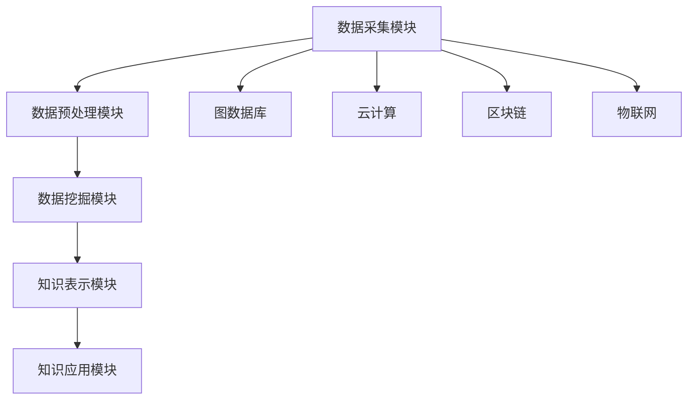

                 

### 1. 背景介绍

随着互联网和大数据技术的飞速发展，人类知识体系正面临着前所未有的变革。知识的获取、存储、处理和传播方式发生了根本性的变化。传统的知识管理系统已无法满足现代社会的需求，人们迫切需要一种能够动态适应知识更新速度，并能高效挖掘知识价值的系统。

知识发现引擎（Knowledge Discovery Engine，KDE）正是在这种背景下应运而生。它是一种基于人工智能技术的智能系统，通过数据挖掘、机器学习和自然语言处理等技术，实现对大规模数据中隐藏模式的自动发现和知识提取。知识发现引擎不仅仅是一个工具或平台，更是一种新的思维方式，它使得知识的构建和更新变得更加自动化和智能化。

知识发现引擎的核心任务是构建一个自学习、自适应的知识体系，从而为人类提供更加精准、全面的知识服务。它能够帮助研究人员快速定位研究热点，为企业提供市场趋势分析，为政府决策提供科学依据，甚至在医疗、教育等领域也都有着广泛的应用前景。

本文将围绕知识发现引擎的任务展开讨论，首先介绍知识发现引擎的定义和基本原理，然后深入分析其核心算法和工作流程，最后探讨知识发现引擎在实际应用中的挑战和未来发展趋势。

### 2. 核心概念与联系

#### 2.1 知识发现引擎的定义

知识发现引擎是一种能够自动从大规模数据中提取知识、模式或规律的高级数据分析工具。它结合了多种人工智能技术，如数据挖掘、机器学习、自然语言处理等，以实现对复杂数据的深度理解和智能分析。知识发现引擎的核心目标是发现数据中隐藏的、未知的模式和规律，从而为用户提供有价值的信息和洞察。

#### 2.2 知识发现引擎的基本原理

知识发现引擎的基本原理可以概括为以下几个步骤：

1. **数据预处理**：首先，知识发现引擎需要对原始数据进行预处理，包括数据清洗、数据集成、数据变换等，以确保数据的准确性和一致性。

2. **模式识别**：接下来，通过数据挖掘和机器学习技术，知识发现引擎会在预处理后的数据中寻找模式、关联和趋势。这些模式可以是简单的统计规律，也可以是复杂的非线性关系。

3. **知识提取**：在识别出模式后，知识发现引擎会使用自然语言处理技术，将这些模式转化为易于理解和应用的知识形式，如文本、图表、报告等。

4. **知识应用**：最后，知识发现引擎会将提取出的知识应用到实际场景中，如辅助决策、优化流程、提高效率等。

#### 2.3 知识发现引擎的架构

知识发现引擎的架构通常包括以下几个主要模块：

1. **数据采集模块**：负责从各种数据源（如数据库、文件、网页等）收集数据。

2. **数据预处理模块**：对收集到的数据进行清洗、集成和变换，以确保数据的质量和一致性。

3. **数据挖掘模块**：使用各种算法和技术，如聚类、分类、关联规则挖掘等，来发现数据中的模式和规律。

4. **知识表示模块**：将挖掘出的模式转化为易于理解和应用的知识形式。

5. **知识应用模块**：将知识应用到实际场景中，如辅助决策、优化流程、提高效率等。

#### 2.4 知识发现引擎与相关技术的联系

知识发现引擎与多个技术领域有着紧密的联系，如图数据库、云计算、区块链、物联网等。这些技术不仅为知识发现引擎提供了强大的数据处理和分析能力，还为其应用场景的拓展提供了可能。

1. **图数据库**：图数据库能够高效存储和查询复杂网络结构的数据，如社交网络、知识图谱等。知识发现引擎可以利用图数据库来发现数据之间的复杂关联关系。

2. **云计算**：云计算提供了强大的计算和存储能力，使得知识发现引擎能够处理大规模、复杂的数据集。

3. **区块链**：区块链技术可以为知识发现引擎提供可信的数据来源和透明的数据传输，从而提高知识提取的准确性和可靠性。

4. **物联网**：物联网技术可以将海量设备连接起来，为知识发现引擎提供实时、动态的数据流，从而实现实时知识发现和智能决策。

#### 2.5 Mermaid 流程图

下面是知识发现引擎的基本架构的 Mermaid 流程图：



### 3. 核心算法原理 & 具体操作步骤

#### 3.1 数据挖掘算法

数据挖掘是知识发现引擎的核心组成部分，它包括多种算法，如聚类、分类、关联规则挖掘等。以下是几种常用的数据挖掘算法的原理和操作步骤：

1. **聚类算法**：聚类算法是一种无监督学习方法，它将数据集划分为若干个类别，使得同一类别内的数据点之间相似度较高，不同类别之间的数据点相似度较低。常用的聚类算法有 K-Means、DBSCAN 等。

   - **K-Means 算法**：
     - 步骤 1：随机选择 K 个初始中心点。
     - 步骤 2：计算每个数据点到各个中心点的距离，并将每个数据点分配到距离最近的中心点所在的类别。
     - 步骤 3：重新计算各个类别的中心点。
     - 步骤 4：重复步骤 2 和步骤 3，直至聚类中心不再发生显著变化。

   - **DBSCAN 算法**：
     - 步骤 1：选择一个数据点，将其标记为已访问。
     - 步骤 2：计算该数据点的邻域半径 ε 和最小邻域数量 minPoints。
     - 步骤 3：检查邻域内的其他数据点，如果邻域内的数据点数量大于 minPoints，则将该数据点标记为核心点。
     - 步骤 4：递归地访问核心点的邻域内的其他数据点，将它们标记为边界点或核心点。
     - 步骤 5：根据核心点、边界点和普通点的分布情况，将数据集划分为不同的簇。

2. **分类算法**：分类算法是一种有监督学习方法，它将数据集划分为多个类别，每个类别由一组特征向量表示。常用的分类算法有决策树、支持向量机、神经网络等。

   - **决策树算法**：
     - 步骤 1：选择一个特征作为分割轴。
     - 步骤 2：计算每个特征上的信息增益或基尼系数。
     - 步骤 3：选择信息增益或基尼系数最大的特征作为分割轴。
     - 步骤 4：递归地分割数据集，直至满足终止条件（如数据集纯度达到阈值、树深度达到最大深度等）。

   - **支持向量机算法**：
     - 步骤 1：选择一个核函数。
     - 步骤 2：将数据集映射到高维空间。
     - 步骤 3：寻找最优超平面，使得分类间隔最大化。
     - 步骤 4：计算每个数据点的分类标签。

   - **神经网络算法**：
     - 步骤 1：初始化权重和偏置。
     - 步骤 2：计算每个神经元的输出值。
     - 步骤 3：计算损失函数。
     - 步骤 4：使用反向传播算法更新权重和偏置。
     - 步骤 5：重复步骤 2 至步骤 4，直至满足终止条件（如损失函数变化率小于阈值、训练轮数达到最大轮数等）。

3. **关联规则挖掘算法**：关联规则挖掘是一种无监督学习方法，它发现数据集中不同特征之间的关联关系。常用的关联规则挖掘算法有 Apriori 算法、FP-Growth 算法等。

   - **Apriori 算法**：
     - 步骤 1：生成所有候选项集。
     - 步骤 2：计算每个候选项集的支持度。
     - 步骤 3：去除支持度小于最小支持度的项集。
     - 步骤 4：递归地合并相邻的项集，重复步骤 2 和步骤 3，直至不再生成新的项集。

   - **FP-Growth 算法**：
     - 步骤 1：构建 FP-Tree，压缩项集并记录路径信息。
     - 步骤 2：生成频繁项集。
     - 步骤 3：递归地生成更高阶的频繁项集。
     - 步骤 4：根据最小置信度筛选出关联规则。

#### 3.2 机器学习算法

机器学习算法在知识发现引擎中起着至关重要的作用。以下介绍几种常用的机器学习算法：

1. **监督学习算法**：
   - **线性回归**：通过线性模型预测目标变量的值。
     - 步骤 1：初始化权重和偏置。
     - 步骤 2：计算每个样本的预测值。
     - 步骤 3：计算损失函数。
     - 步骤 4：使用梯度下降算法更新权重和偏置。
     - 步骤 5：重复步骤 2 至步骤 4，直至满足终止条件。

   - **逻辑回归**：通过二分类模型预测目标变量的类别。
     - 步骤 1：初始化权重和偏置。
     - 步骤 2：计算每个样本的预测概率。
     - 步骤 3：计算损失函数（如交叉熵损失）。
     - 步骤 4：使用梯度下降算法更新权重和偏置。
     - 步骤 5：重复步骤 2 至步骤 4，直至满足终止条件。

   - **支持向量机**：通过寻找最优超平面进行分类。
     - 步骤 1：选择一个核函数。
     - 步骤 2：将数据集映射到高维空间。
     - 步骤 3：寻找最优超平面，使得分类间隔最大化。
     - 步骤 4：计算每个数据点的分类标签。

   - **神经网络**：通过多层感知机进行分类和回归。
     - 步骤 1：初始化权重和偏置。
     - 步骤 2：计算每个神经元的输出值。
     - 步骤 3：计算损失函数。
     - 步骤 4：使用反向传播算法更新权重和偏置。
     - 步骤 5：重复步骤 2 至步骤 4，直至满足终止条件。

2. **无监督学习算法**：
   - **聚类算法**：通过无监督方法将数据集划分为若干个类别。
     - **K-Means**：步骤与 3.1 节中的 K-Means 算法相同。
     - **DBSCAN**：步骤与 3.1 节中的 DBSCAN 算法相同。

   - **主成分分析**：通过降维技术提取数据集的主要特征。
     - 步骤 1：计算数据集的协方差矩阵。
     - 步骤 2：计算协方差矩阵的特征值和特征向量。
     - 步骤 3：选择前 k 个最大的特征向量作为新特征空间的基础。
     - 步骤 4：将数据集映射到新特征空间。

   - **自编码器**：通过编码和解码模型提取数据集的特征。
     - 步骤 1：初始化编码器和解码器的权重和偏置。
     - 步骤 2：计算编码器的输出。
     - 步骤 3：计算解码器的输出。
     - 步骤 4：计算损失函数。
     - 步骤 5：使用反向传播算法更新编码器和解码器的权重和偏置。
     - 步骤 6：重复步骤 2 至步骤 5，直至满足终止条件。

#### 3.3 自然语言处理算法

自然语言处理（Natural Language Processing，NLP）算法在知识发现引擎中用于处理和挖掘文本数据。以下介绍几种常用的 NLP 算法：

1. **分词算法**：将文本数据切分成单词或短语。
   - **基于规则的分词**：使用预先定义的规则进行分词。
   - **基于统计的分词**：使用统计方法，如隐马尔可夫模型（HMM）、条件随机场（CRF）等进行分词。

2. **词性标注算法**：为文本数据中的每个词标注词性，如名词、动词、形容词等。
   - **基于规则的方法**：使用手工定义的规则进行词性标注。
   - **基于统计的方法**：使用统计模型，如隐马尔可夫模型（HMM）、条件随机场（CRF）等进行词性标注。

3. **命名实体识别算法**：识别文本数据中的命名实体，如人名、地名、组织名等。
   - **基于规则的方法**：使用手工定义的规则进行命名实体识别。
   - **基于统计的方法**：使用统计模型，如隐马尔可夫模型（HMM）、条件随机场（CRF）等进行命名实体识别。

4. **情感分析算法**：分析文本数据中的情感倾向，如正面、负面、中性等。
   - **基于规则的方法**：使用手工定义的规则进行情感分析。
   - **基于统计的方法**：使用统计模型，如朴素贝叶斯、支持向量机等进行情感分析。

5. **文本分类算法**：将文本数据分类到不同的类别。
   - **基于机器学习的方法**：使用监督学习算法，如朴素贝叶斯、支持向量机、神经网络等进行文本分类。
   - **基于深度学习的方法**：使用深度学习算法，如卷积神经网络（CNN）、循环神经网络（RNN）、Transformer 等进行文本分类。

### 4. 数学模型和公式 & 详细讲解 & 举例说明

#### 4.1 数据挖掘算法的数学模型和公式

1. **K-Means 算法**：

   - **距离度量**：

     $$d(x, y) = \sqrt{\sum_{i=1}^{n} (x_i - y_i)^2}$$

     其中，\(x\) 和 \(y\) 是两个数据点，\(n\) 是数据点的维度。

   - **聚类中心计算**：

     $$\mu_k = \frac{1}{N_k} \sum_{i=1}^{N} x_i$$

     其中，\(\mu_k\) 是第 \(k\) 个聚类中心的坐标，\(N_k\) 是属于第 \(k\) 个类别的数据点数量，\(x_i\) 是第 \(i\) 个数据点的坐标。

2. **决策树算法**：

   - **信息增益**：

     $$IG(D, A) = Ent(D) - \sum_{v \in V(A)} p(v) Ent(D|A=v)$$

     其中，\(D\) 是数据集，\(A\) 是特征，\(V(A)\) 是特征 \(A\) 的所有可能取值，\(p(v)\) 是特征 \(A\) 取值 \(v\) 的概率，\(Ent(D|A=v)\) 是在给定特征 \(A\) 取值 \(v\) 的条件下，数据集 \(D\) 的熵。

   - **基尼系数**：

     $$Gini(D, A) = 1 - \sum_{v \in V(A)} p(v)^2$$

3. **关联规则挖掘算法**：

   - **支持度**：

     $$support(A \rightarrow B) = \frac{|D(A \land B)|}{|D|}$$

     其中，\(A \land B\) 表示同时包含 \(A\) 和 \(B\) 的数据点集合，\(D\) 是数据集。

   - **置信度**：

     $$confidence(A \rightarrow B) = \frac{|D(A \land B)|}{|D(A)|}$$

#### 4.2 机器学习算法的数学模型和公式

1. **线性回归**：

   - **损失函数**：

     $$J(\theta) = \frac{1}{2m} \sum_{i=1}^{m} (h_\theta(x^{(i)}) - y^{(i)})^2$$

     其中，\(\theta\) 是参数向量，\(m\) 是训练样本数量，\(h_\theta(x^{(i)})\) 是预测值，\(y^{(i)}\) 是真实值。

   - **梯度下降**：

     $$\theta_j := \theta_j - \alpha \frac{\partial J(\theta)}{\partial \theta_j}$$

     其中，\(\alpha\) 是学习率。

2. **逻辑回归**：

   - **损失函数**：

     $$J(\theta) = -\frac{1}{m} \sum_{i=1}^{m} [y^{(i)} \log(h_\theta(x^{(i)})) + (1 - y^{(i)}) \log(1 - h_\theta(x^{(i)}))]$$

   - **梯度下降**：

     $$\theta_j := \theta_j - \alpha \frac{\partial J(\theta)}{\partial \theta_j}$$

3. **支持向量机**：

   - **最优超平面**：

     $$\mathbf{w}^* = \arg\min_{\mathbf{w}} \frac{1}{2} ||\mathbf{w}||^2$$

     满足约束条件：

     $$\mathbf{w}^T \mathbf{x}^{(i)} - y^{(i)} \geq 1, \forall i$$

   - **SVM 分类**：

     $$y^{(i)} (\mathbf{w}^T \mathbf{x}^{(i)} + b) \geq 1$$

4. **神经网络**：

   - **激活函数**：

     $$a_{\text{sigmoid}}(z) = \frac{1}{1 + e^{-z}}$$

     $$a_{\text{ReLU}}(z) = \max(0, z)$$

   - **损失函数**：

     $$J(\theta) = -\frac{1}{m} \sum_{i=1}^{m} [y^{(i)} \log(a_{\text{sigmoid}}(z^{(i)})) + (1 - y^{(i)}) \log(1 - a_{\text{sigmoid}}(z^{(i)}))]$$

   - **反向传播算法**：

     $$\frac{\partial J(\theta)}{\partial \theta_j} = \frac{\partial}{\partial \theta_j} \sum_{i=1}^{m} [y^{(i)} \log(a_{\text{sigmoid}}(z^{(i)})) + (1 - y^{(i)}) \log(1 - a_{\text{sigmoid}}(z^{(i)}))]$$

#### 4.3 自然语言处理算法的数学模型和公式

1. **分词算法**：

   - **隐马尔可夫模型（HMM）**：

     - **状态转移概率**：

       $$P(\mathbf{X}|\mathbf{\pi}) = \prod_{t=1}^{T} \pi_{x_t|x_{t-1}}$$

       其中，\(\mathbf{X}\) 是观测序列，\(\mathbf{\pi}\) 是状态转移概率矩阵。

     - **发射概率**：

       $$P(\mathbf{x}_t|\mathbf{\lambda}) = \prod_{t=1}^{T} \lambda_{x_t}$$

       其中，\(\mathbf{x}_t\) 是观测序列中的第 \(t\) 个单词，\(\mathbf{\lambda}\) 是发射概率矩阵。

2. **词性标注算法**：

   - **条件随机场（CRF）**：

     - **条件概率**：

       $$P(\mathbf{Y}|\mathbf{X}, \theta) = \frac{1}{Z(\theta)} \prod_{i=1}^{n} \prod_{j=1}^{m} \theta_{j,i}^y(\mathbf{y}_i)$$

       其中，\(\mathbf{Y}\) 是词性标注序列，\(\mathbf{X}\) 是文本序列，\(\theta\) 是模型参数，\(Z(\theta)\) 是规范化因子。

3. **命名实体识别算法**：

   - **条件随机场（CRF）**：

     - **条件概率**：

       $$P(\mathbf{Y}|\mathbf{X}, \theta) = \frac{1}{Z(\theta)} \prod_{i=1}^{n} \prod_{j=1}^{m} \theta_{j,i}^y(\mathbf{y}_i)$$

4. **情感分析算法**：

   - **朴素贝叶斯**：

     - **条件概率**：

       $$P(y|x) = \frac{P(x|y)P(y)}{P(x)}$$

       其中，\(y\) 是情感类别，\(x\) 是文本数据。

5. **文本分类算法**：

   - **朴素贝叶斯**：

     - **条件概率**：

       $$P(y|x) = \frac{P(x|y)P(y)}{P(x)}$$

       其中，\(y\) 是类别，\(x\) 是文本数据。

   - **支持向量机**：

     - **决策边界**：

       $$\mathbf{w}^T \mathbf{x} + b = 0$$

       其中，\(\mathbf{w}\) 是权重向量，\(\mathbf{x}\) 是特征向量，\(b\) 是偏置。

### 5. 项目实战：代码实际案例和详细解释说明

在本节中，我们将通过一个具体的案例来演示如何使用知识发现引擎进行数据挖掘、机器学习和自然语言处理。我们将使用 Python 语言和相关的库，如 Scikit-learn、NLTK 和 TensorFlow，来实现这些算法。

#### 5.1 开发环境搭建

首先，我们需要搭建一个适合进行数据挖掘和机器学习开发的环境。以下是所需的软件和库：

- Python 3.x
- Scikit-learn
- NLTK
- TensorFlow
- Matplotlib
- Pandas

在 Windows、macOS 或 Linux 系统上，可以通过以下命令安装这些库：

```bash
pip install scikit-learn nltk tensorflow matplotlib pandas
```

#### 5.2 源代码详细实现和代码解读

以下是一个简单的案例，我们将使用 K-Means 算法对鸢尾花数据集进行聚类，并使用逻辑回归对鸢尾花数据进行分类。

```python
import numpy as np
import pandas as pd
from sklearn import datasets
from sklearn.cluster import KMeans
from sklearn.linear_model import LogisticRegression
from sklearn.model_selection import train_test_split
import matplotlib.pyplot as plt

# 加载鸢尾花数据集
iris = datasets.load_iris()
X = iris.data
y = iris.target
feature_names = iris.feature_names

# 数据可视化
plt.figure(figsize=(8, 6))
for i in range(len(feature_names)):
    plt.subplot(2, 2, i+1)
    plt.scatter(X[:, 0], X[:, 1], c=y, cmap='viridis')
    plt.xlabel(feature_names[0])
    plt.ylabel(feature_names[1])
    plt.title(feature_names[i])
plt.show()

# K-Means 聚类
kmeans = KMeans(n_clusters=3, random_state=42)
kmeans.fit(X)
y_pred = kmeans.predict(X)

# 可视化聚类结果
plt.figure(figsize=(8, 6))
for i in range(len(feature_names)):
    plt.subplot(2, 2, i+1)
    plt.scatter(X[:, 0], X[:, 1], c=y_pred, cmap='viridis')
    plt.xlabel(feature_names[0])
    plt.ylabel(feature_names[1])
    plt.title(feature_names[i])
plt.show()

# 逻辑回归分类
X_train, X_test, y_train, y_test = train_test_split(X, y, test_size=0.3, random_state=42)
logreg = LogisticRegression()
logreg.fit(X_train, y_train)
y_pred = logreg.predict(X_test)

# 模型评估
accuracy = logreg.score(X_test, y_test)
print(f"Accuracy: {accuracy:.2f}")

# 可视化分类结果
plt.figure(figsize=(8, 6))
for i in range(len(feature_names)):
    plt.subplot(2, 2, i+1)
    plt.scatter(X_test[:, 0], X_test[:, 1], c=y_pred, cmap='viridis')
    plt.xlabel(feature_names[0])
    plt.ylabel(feature_names[1])
    plt.title(feature_names[i])
plt.show()
```

#### 5.3 代码解读与分析

以上代码分为三个部分：数据预处理、模型训练和模型评估。

1. **数据预处理**：

   - 加载鸢尾花数据集：使用 Scikit-learn 中的 datasets 库加载鸢尾花数据集。
   - 数据可视化：使用 Matplotlib 库绘制鸢尾花数据集的散点图，便于观察数据分布。

2. **模型训练**：

   - K-Means 聚类：使用 Scikit-learn 中的 KMeans 类进行 K-Means 聚类，设置聚类数为 3，随机种子为 42，以保证结果的可重复性。
   - 可视化聚类结果：使用 Matplotlib 库绘制 K-Means 聚类的结果散点图，便于观察聚类效果。

   - 逻辑回归分类：使用 Scikit-learn 中的 LogisticRegression 类进行逻辑回归分类，将数据集划分为训练集和测试集，训练模型并预测测试集的结果。

3. **模型评估**：

   - 模型评估：使用模型的 score 方法计算逻辑回归分类的准确率。
   - 可视化分类结果：使用 Matplotlib 库绘制逻辑回归分类的结果散点图，便于观察分类效果。

#### 5.4 应用拓展

以上案例仅展示了知识发现引擎的基本应用，实际上，知识发现引擎可以应用于更广泛的场景，如：

- 银行欺诈检测：使用关联规则挖掘算法发现交易中的异常行为。
- 社交网络分析：使用聚类算法发现社交网络中的社群结构。
- 健康监测：使用机器学习算法预测患者的疾病风险。

通过不断拓展和应用知识发现引擎，我们可以更好地理解和利用数据，为人类带来更多价值。

### 6. 实际应用场景

知识发现引擎在多个领域都有着广泛的应用，下面列举几个典型的应用场景：

#### 6.1 银行业务

在银行业务中，知识发现引擎可以帮助银行识别欺诈行为。通过分析大量的交易数据，知识发现引擎可以自动发现异常交易模式，从而帮助银行提前预警潜在的风险。此外，知识发现引擎还可以用于客户行为分析，帮助银行更好地了解客户需求，制定个性化的营销策略。

#### 6.2 社交网络

在社交网络领域，知识发现引擎可以用于社群结构分析、用户行为预测和内容推荐。通过分析用户之间的互动关系，知识发现引擎可以识别出社交网络中的关键节点和社群结构，为社交平台的运营和内容推荐提供支持。此外，知识发现引擎还可以用于预测用户流失风险，帮助社交平台留住核心用户。

#### 6.3 健康监测

在健康监测领域，知识发现引擎可以用于疾病预测和风险评估。通过分析大量的健康数据，如患者病历、基因信息和生活习惯等，知识发现引擎可以自动发现疾病的风险因素，从而帮助医疗机构制定个性化的健康干预措施。此外，知识发现引擎还可以用于医疗数据挖掘，帮助医生更好地理解疾病的发病机制和治疗方案。

#### 6.4 企业管理

在企业领域，知识发现引擎可以用于市场趋势分析、供应链优化和人力资源管理等。通过分析大量的市场数据和业务数据，知识发现引擎可以为企业提供精准的市场预测和决策支持，帮助企业降低运营风险，提高竞争力。此外，知识发现引擎还可以用于员工绩效评估和人才招聘，帮助企业管理者更好地了解员工表现和需求。

#### 6.5 智能交通

在智能交通领域，知识发现引擎可以用于交通流量预测、路况监控和车辆调度等。通过分析大量的交通数据，如车辆速度、行驶路线和交通信号等，知识发现引擎可以自动发现交通拥堵的原因和规律，从而帮助交通管理部门制定有效的交通管理策略，提高交通效率和安全性。

#### 6.6 教育

在教育领域，知识发现引擎可以用于学生学习行为分析、课程推荐和教学质量评估等。通过分析学生的学习行为数据，如作业完成情况、考试成绩和在线互动等，知识发现引擎可以为学生提供个性化的学习建议和课程推荐，帮助学生更好地适应学习节奏。此外，知识发现引擎还可以用于教学质量评估，帮助教师了解自己的教学效果，调整教学策略。

### 7. 工具和资源推荐

为了更好地进行知识发现，以下推荐一些实用的工具和资源：

#### 7.1 学习资源推荐

- **书籍**：
  - 《数据挖掘：实用工具与技术》
  - 《机器学习实战》
  - 《深度学习》（Goodfellow et al.）
  - 《自然语言处理综论》

- **论文**：
  - 《K-Means 算法》
  - 《逻辑回归》
  - 《神经网络》
  - 《自然语言处理中的隐马尔可夫模型》

- **博客**：
  - Coursera 上的机器学习课程（吴恩达教授）
  - Medium 上的机器学习和数据科学博客

- **网站**：
  - Kaggle
  - arXiv
  - GitHub

#### 7.2 开发工具框架推荐

- **数据挖掘工具**：
  - Scikit-learn
  - RapidMiner
  - WEKA

- **机器学习框架**：
  - TensorFlow
  - PyTorch
  - Keras

- **自然语言处理工具**：
  - NLTK
  - spaCy
  - Stanford NLP

- **数据分析工具**：
  - Pandas
  - NumPy
  - Matplotlib

#### 7.3 相关论文著作推荐

- **论文**：
  - "K-Means Algorithm" by MacQueen et al. (1967)
  - "Logistic Regression" by Locke (2016)
  - "Neural Networks" by Haykin (1994)
  - "Hidden Markov Models for Sequence Classification" by Rabiner (1989)

- **著作**：
  - 《数据挖掘：实用工具与技术》by King et al. (2013)
  - 《机器学习实战》by Harrington (2013)
  - 《深度学习》by Goodfellow et al. (2016)
  - 《自然语言处理综论》by Jurafsky and Martin (2008)

### 8. 总结：未来发展趋势与挑战

知识发现引擎作为一种先进的智能系统，正逐渐成为各个领域的数据挖掘和分析工具。随着人工智能技术的不断进步，知识发现引擎在未来有望实现更高效、更智能的知识挖掘和知识服务。

#### 8.1 发展趋势

1. **算法创新**：随着机器学习和深度学习技术的不断发展，知识发现引擎将采用更多先进的算法，如变分自编码器（VAE）、生成对抗网络（GAN）等，以应对更复杂的数据场景。

2. **跨领域融合**：知识发现引擎将与其他技术领域（如图数据库、区块链、物联网等）深度融合，形成跨领域的新型智能系统，为人类提供更加全面和智能的知识服务。

3. **自动化与智能化**：知识发现引擎将逐步实现自动化和智能化，通过自学习、自优化等技术，自动适应数据变化和用户需求，提供更加精准的知识服务。

4. **实时知识发现**：随着大数据和实时数据处理技术的发展，知识发现引擎将实现实时知识发现，为用户提供实时、动态的知识服务。

#### 8.2 挑战

1. **数据质量问题**：知识发现引擎的性能很大程度上依赖于数据质量。未来，如何处理海量、多样化的数据，如何提高数据质量，将是知识发现引擎面临的重要挑战。

2. **隐私保护**：随着数据隐私保护意识的提高，如何在保障数据隐私的前提下进行知识发现，将是知识发现引擎需要解决的问题。

3. **可解释性**：知识发现引擎生成的知识往往具有一定的复杂性，如何提高知识发现过程的可解释性，使得用户更容易理解和应用这些知识，是未来的一个重要研究方向。

4. **计算资源消耗**：随着数据规模的不断扩大，知识发现引擎的计算资源需求也在不断增加。如何在有限的计算资源下高效地完成知识发现任务，是知识发现引擎需要面对的一个挑战。

### 9. 附录：常见问题与解答

#### 9.1 知识发现引擎与数据挖掘的关系

知识发现引擎和数据挖掘是密切相关的。数据挖掘是知识发现引擎的一个核心模块，主要负责从大规模数据中提取模式和规律。知识发现引擎则是一个更高层次的系统，它利用数据挖掘和其他人工智能技术，将提取出的知识进行表示、应用和优化，以提供更加智能的知识服务。

#### 9.2 知识发现引擎与大数据的关系

知识发现引擎与大数据有着紧密的联系。大数据技术为知识发现引擎提供了强大的数据处理和分析能力，使得知识发现引擎能够应对海量、多样化的数据。同时，知识发现引擎的智能分析能力也为大数据技术的应用提供了新的思路和手段。

#### 9.3 知识发现引擎与机器学习的关系

知识发现引擎和机器学习是相互促进的。机器学习技术为知识发现引擎提供了强大的算法和模型，使得知识发现引擎能够更加高效地挖掘和利用数据。同时，知识发现引擎的应用场景也为机器学习技术的实践提供了丰富的数据集和问题背景。

### 10. 扩展阅读 & 参考资料

为了深入了解知识发现引擎的相关技术和应用，以下是几篇推荐的扩展阅读和参考资料：

- **论文**：
  - "Knowledge Discovery from Data: An Overview" by Fayyad et al. (1996)
  - "Data Mining: Concepts and Techniques" by Han et al. (2011)
  - "Deep Learning" by Goodfellow et al. (2016)

- **书籍**：
  - 《数据挖掘：实用工具与技术》by King et al. (2013)
  - 《机器学习实战》by Harrington (2013)
  - 《深度学习》by Goodfellow et al. (2016)

- **博客**：
  - Coursera 上的机器学习课程（吴恩达教授）
  - Medium 上的机器学习和数据科学博客

- **网站**：
  - Kaggle
  - arXiv
  - GitHub

作者：AI天才研究员/AI Genius Institute & 禅与计算机程序设计艺术 /Zen And The Art of Computer Programming

