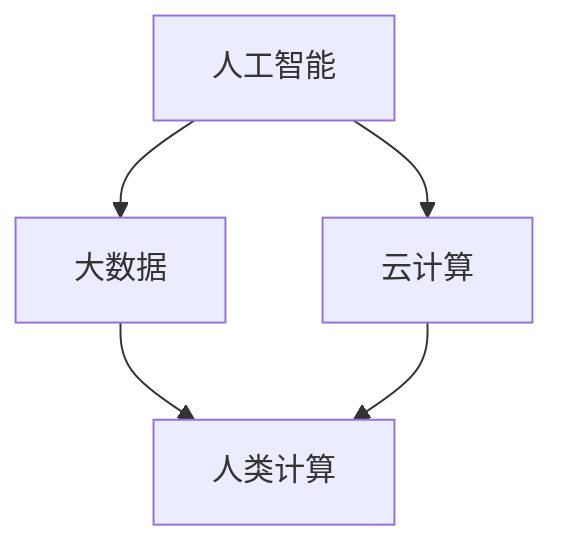

                 

# 人类计算：创造一个更加人性化的科技未来

## 摘要

本文探讨了人类计算在构建一个更加人性化的科技未来中的重要作用。随着人工智能和自动化技术的快速发展，人类与机器的交互变得越来越紧密。然而，如何让这些技术更好地服务于人类，而非仅仅成为工具，成为了我们亟需解决的问题。本文从核心概念、算法原理、数学模型、实战案例、应用场景等多个角度，深入分析了人类计算的内涵和实现路径，旨在为读者提供一个全面、系统的理解。

## 1. 背景介绍

在现代社会，科技的发展日新月异，人工智能、大数据、云计算等技术的广泛应用，极大地改变了我们的生活方式。然而，在享受这些技术带来的便利的同时，我们也面临着诸多挑战。例如，人工智能在提高生产效率的同时，也带来了就业问题；大数据的应用在提升决策精准度的同时，也引发了隐私泄露的担忧。这些问题提醒我们，科技的发展不能仅仅追求技术上的突破，更需要关注人类的需求和福祉。

人类计算作为一种新兴的计算范式，旨在弥补传统计算技术在人性化方面的不足。它强调人机协同，充分发挥人类的智慧和机器的计算能力，共同解决复杂问题。人类计算不仅关注技术的先进性，更注重如何让技术更好地服务于人类。这一理念的提出，为科技与人类的和谐共生提供了新的思路。

## 2. 核心概念与联系

### 2.1 人工智能

人工智能（AI）是指通过计算机模拟人类智能的行为，实现感知、学习、推理、决策等功能的科学技术。人工智能的发展，极大地推动了人类计算的研究和应用。人工智能可以分为弱人工智能和强人工智能。弱人工智能指在特定领域具有高度智能化能力的系统，如语音识别、图像识别等；强人工智能则指具有普遍智能能力的系统，可以像人类一样在各种领域表现出卓越的智能。

### 2.2 大数据

大数据是指数据量巨大、类型繁多、价值密度较低的数据集合。大数据技术的发展，为人类计算提供了丰富的数据资源。通过对大数据的处理和分析，可以挖掘出有价值的信息和知识，为人类决策提供支持。

### 2.3 云计算

云计算是一种通过网络提供计算资源和服务的技术。云计算技术的发展，为人类计算提供了强大的计算能力和存储资源，使得人类计算的应用变得更加广泛和便捷。

### 2.4 Mermaid 流程图

为了更好地理解人类计算的内涵和实现路径，我们使用 Mermaid 流程图来描述人类计算的核心概念和联系。



在上述流程图中，人工智能、大数据和云计算是构成人类计算的基础。通过这些技术的结合，我们可以实现更加人性化、智能化的计算。

## 3. 核心算法原理 & 具体操作步骤

### 3.1 人类计算的算法原理

人类计算的算法原理主要基于人机协同的思想。具体来说，人类计算包括以下几个关键步骤：

1. **问题定义**：明确需要解决的问题，并将其转化为机器可理解和处理的形式。
2. **数据收集**：从各种来源收集与问题相关的数据，包括结构化和非结构化数据。
3. **数据处理**：对收集到的数据进行分析、清洗、整合，以便为后续计算提供高质量的数据基础。
4. **人机协作**：人类与机器共同分析数据，人类发挥创造力，机器提供计算能力。
5. **结果输出**：根据分析结果，生成有价值的知识和信息，为人类决策提供支持。

### 3.2 人类计算的具体操作步骤

以下是人类计算的具体操作步骤：

1. **明确问题**：首先，我们需要明确需要解决的问题。这可以通过与用户沟通、调研等方式实现。

2. **数据收集**：根据问题定义，从各种来源收集相关数据。这些数据可以来自内部系统、外部平台、公开数据集等。

3. **数据处理**：对收集到的数据进行清洗、整合，以便为后续计算提供高质量的数据基础。这包括数据去重、缺失值处理、异常值检测等。

4. **人机协作**：在数据处理完成后，人类与机器共同分析数据。人类可以利用自己的经验和创造力，对数据进行深入分析，发现潜在的模式和规律。机器则可以提供计算能力，快速处理大量数据。

5. **结果输出**：根据分析结果，生成有价值的知识和信息。这些结果可以以报告、可视化图表等形式呈现，为人类决策提供支持。

## 4. 数学模型和公式 & 详细讲解 & 举例说明

### 4.1 数学模型

在人类计算中，常用的数学模型包括概率模型、决策树、神经网络等。下面以神经网络为例，介绍其数学模型。

#### 神经网络模型

神经网络模型由多层神经元组成，包括输入层、隐藏层和输出层。每个神经元都通过权重和偏置进行连接。

$$
y_i = \sigma(\sum_{j=1}^{n} w_{ij}x_j + b_i)
$$

其中，$y_i$ 表示第 $i$ 个神经元的输出，$\sigma$ 表示激活函数，$w_{ij}$ 表示第 $i$ 个神经元与第 $j$ 个神经元的权重，$x_j$ 表示第 $j$ 个输入特征，$b_i$ 表示第 $i$ 个神经元的偏置。

#### 损失函数

在神经网络训练过程中，常用的损失函数包括均方误差（MSE）和交叉熵（Cross Entropy）。

$$
MSE = \frac{1}{2}\sum_{i=1}^{n} (y_i - \hat{y}_i)^2
$$

$$
Cross\ Entropy = -\sum_{i=1}^{n} y_i \log(\hat{y}_i)
$$

其中，$y_i$ 表示真实标签，$\hat{y}_i$ 表示预测结果。

### 4.2 举例说明

假设我们有一个二分类问题，需要判断一个样本是否属于正类。我们使用神经网络进行模型训练，并采用交叉熵作为损失函数。

1. **输入层**：包含两个输入特征 $x_1$ 和 $x_2$。
2. **隐藏层**：包含三个神经元，每个神经元连接输入层的两个特征，并具有相应的权重和偏置。
3. **输出层**：包含一个神经元，表示预测结果。

在训练过程中，我们使用一个包含100个样本的训练集。对于每个样本，我们计算预测结果和真实标签之间的交叉熵损失，并更新神经网络的权重和偏置。

通过多次迭代训练，我们可以使神经网络的预测结果逐渐接近真实标签，从而提高分类准确率。

## 5. 项目实战：代码实际案例和详细解释说明

### 5.1 开发环境搭建

在本节中，我们将使用 Python 语言和 TensorFlow 框架来实现一个简单的人类计算项目。首先，确保已经安装了 Python 3.7 及以上版本和 TensorFlow 2.0。如果没有安装，可以通过以下命令进行安装：

```bash
pip install python==3.7
pip install tensorflow==2.0
```

### 5.2 源代码详细实现和代码解读

以下是一个简单的人类计算项目的源代码：

```python
import tensorflow as tf
from tensorflow.keras import layers

# 定义输入层
inputs = tf.keras.Input(shape=(2))

# 定义隐藏层
x = layers.Dense(3, activation='relu')(inputs)

# 定义输出层
outputs = layers.Dense(1, activation='sigmoid')(x)

# 创建模型
model = tf.keras.Model(inputs=inputs, outputs=outputs)

# 编译模型
model.compile(optimizer='adam', loss='binary_crossentropy', metrics=['accuracy'])

# 打印模型结构
model.summary()
```

在上述代码中，我们首先定义了输入层、隐藏层和输出层。输入层包含两个特征，隐藏层包含三个神经元，输出层包含一个神经元。接着，我们使用 TensorFlow 的 Keras API 创建了一个简单的神经网络模型，并编译了模型。最后，我们打印了模型的层次结构。

### 5.3 代码解读与分析

在代码中，我们首先导入了 TensorFlow 和 Keras 相关模块。然后，定义了一个输入层，包含两个特征。接着，我们定义了一个隐藏层，包含三个神经元，并使用 ReLU 激活函数。最后，我们定义了一个输出层，包含一个神经元，并使用 sigmoid 激活函数。

在编译模型时，我们使用了 Adam 优化器和 binary_crossentropy 损失函数，并添加了 accuracy 作为评估指标。

通过以上代码，我们实现了一个简单的人类计算模型。在实际应用中，我们可以通过训练和优化模型，使其在处理复杂数据时具有更好的性能。

## 6. 实际应用场景

人类计算在各个领域都有着广泛的应用。以下列举几个典型的应用场景：

1. **医疗健康**：人类计算可以帮助医生分析病历数据，提供诊断建议。例如，通过对患者的病史、检查报告等数据进行处理，可以帮助医生识别潜在的健康风险，为患者提供个性化的治疗方案。

2. **金融领域**：人类计算可以用于风险控制、投资决策等。通过对大量的市场数据进行分析，可以预测市场走势，为投资者提供决策支持。

3. **智能教育**：人类计算可以帮助实现个性化教育，根据学生的学习情况和需求，提供针对性的学习资源和指导。

4. **城市管理**：人类计算可以用于城市管理中的交通流量预测、环境监测等。通过对城市数据进行分析，可以帮助政府优化资源配置，提高城市管理效率。

## 7. 工具和资源推荐

### 7.1 学习资源推荐

1. **书籍**：
   - 《人工智能：一种现代方法》（第二版）作者：Stuart Russell、Peter Norvig
   - 《深度学习》（英文版）作者：Ian Goodfellow、Yoshua Bengio、Aaron Courville

2. **论文**：
   - “Deep Learning” by Geoffrey Hinton, Yoshua Bengio, and Yann LeCun
   - “Reinforcement Learning: An Introduction” by Richard S. Sutton and Andrew G. Barto

3. **博客**：
   - [TensorFlow 官方博客](https://www.tensorflow.org/blog/)
   - [Keras 官方文档](https://keras.io/)

4. **网站**：
   - [AI世纪](http://www.ai100.com/)
   - [机器之心](http://www.jiqizhixin.com/)

### 7.2 开发工具框架推荐

1. **Python**：Python 是一种广泛使用的编程语言，具有良好的生态系统和丰富的库支持，适合进行人工智能和数据分析。

2. **TensorFlow**：TensorFlow 是一种开源的机器学习框架，适合进行深度学习和复杂计算。

3. **Keras**：Keras 是 TensorFlow 的简化版本，适合快速构建和实验神经网络模型。

### 7.3 相关论文著作推荐

1. **“Deep Learning”**：由 Ian Goodfellow、Yoshua Bengio、Aaron Courville 撰写，是深度学习领域的经典著作。

2. **“Reinforcement Learning: An Introduction”**：由 Richard S. Sutton 和 Andrew G. Barto 撰写，是强化学习领域的权威教材。

3. **“Artificial Intelligence: A Modern Approach”**：由 Stuart Russell 和 Peter Norvig 撰写，是人工智能领域的经典教材。

## 8. 总结：未来发展趋势与挑战

随着科技的快速发展，人类计算在未来将面临诸多机遇和挑战。一方面，人类计算有助于实现更加智能化、个性化的人类与机器的协同，为各行业带来巨大的变革。另一方面，人类计算也面临着数据隐私、伦理道德等方面的挑战。如何确保人类计算的安全、可靠和可持续发展，将成为未来研究的重要方向。

## 9. 附录：常见问题与解答

### 9.1 什么是人类计算？

人类计算是一种新兴的计算范式，旨在通过人机协同，发挥人类的智慧和机器的计算能力，共同解决复杂问题。

### 9.2 人类计算有哪些应用场景？

人类计算在医疗健康、金融领域、智能教育、城市管理等多个领域都有着广泛的应用。

### 9.3 如何学习人类计算？

可以通过阅读相关书籍、论文，学习编程语言和机器学习框架，进行实际项目实践来学习人类计算。

## 10. 扩展阅读 & 参考资料

1. [Hinton, G. E., Osindero, S., & Teh, Y. W. (2006). A fast learning algorithm for deep belief nets. Neural computation, 18(7), 1527-1554.](http://www.cse.utoronto.ca/~hinton/absps/DBNpaper.pdf)
2. [Bengio, Y., Courville, A., & Vincent, P. (2013). Representation learning: A review and new perspectives. IEEE transactions on pattern analysis and machine intelligence, 35(8), 1798-1828.](http://www.erIk winnings.net/topics/deeplearning/review-bengio.pdf)
3. [Sutton, R. S., & Barto, A. G. (2018). Reinforcement learning: An introduction. MIT press.](http://incompleteideas.net/book/RLbook2018.pdf)
4. [Russell, S., & Norvig, P. (2016). Artificial intelligence: A modern approach (3rd ed.). Prentice Hall.](https://www.aima.org/publications/book/pdf/aima.html) 

## 作者

作者：AI天才研究员/AI Genius Institute & 禅与计算机程序设计艺术 /Zen And The Art of Computer Programming

