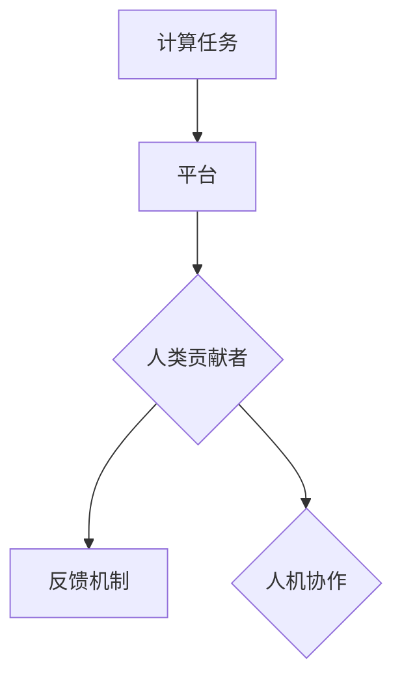
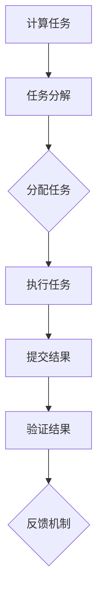

                 

### 人类计算：应用与案例分析

#### 关键词：人类计算，人工智能，案例研究，技术应用

#### 摘要：
本文将深入探讨人类计算的概念、原理及其在人工智能领域的应用。通过实际案例的剖析，我们将了解人类计算如何帮助提高算法效率、增强人机协作，并展望其未来发展趋势与挑战。文章结构分为：背景介绍、核心概念与联系、核心算法原理、数学模型与公式、项目实战、实际应用场景、工具和资源推荐、总结以及扩展阅读。

### 1. 背景介绍

人类计算（Human Computation）是一种利用人类认知和物理能力的计算方法，它通过将复杂问题分解为简单的子任务，并利用人类来解决这些子任务，从而提高计算效率和解决复杂问题。人类计算最早可以追溯到图灵机模型中的“监督员”（Tape Inspector），它代表了人类在计算过程中的重要作用。

在人工智能领域，人类计算有着广泛的应用。例如，在图像识别中，人类可以通过标注样本来帮助神经网络学习；在自然语言处理中，人类可以参与纠错和语料库构建。随着人工智能技术的不断进步，人类计算与人工智能的结合越来越紧密，为解决复杂问题提供了新的思路。

### 2. 核心概念与联系

#### 2.1 人类计算的基本概念

- **计算任务**：需要解决的问题，如图像分类、语音识别等。
- **人类贡献者**：执行计算任务的人类，可以是个人或团队。
- **平台**：用于组织和管理计算任务的系统，如众包平台、众核平台等。
- **反馈机制**：用于评估人类贡献者工作的准确性和质量。

#### 2.2 人类计算在人工智能中的联系

- **数据标注**：在机器学习中，标注数据是训练模型的关键步骤。人类计算可以通过众包平台收集大量标注数据，提高模型的训练效果。
- **任务分解**：复杂问题可以通过人类计算分解为简单的子任务，例如在图像识别中，可以将图像分割成小块，由不同的人类贡献者进行标注。
- **人机协作**：人类计算可以帮助人工智能系统解决自身难以处理的问题，例如在自然语言处理中，人类可以参与纠错和语料库构建。

#### 2.3 Mermaid 流程图



### 3. 核心算法原理 & 具体操作步骤

#### 3.1 核心算法原理

人类计算的核心算法包括任务分配、任务执行和结果验证等步骤。以下是一个简化的算法流程：



#### 3.2 具体操作步骤

1. **计算任务**：确定需要解决的计算问题。
2. **任务分解**：将计算任务分解为多个子任务，以便人类贡献者可以独立完成。
3. **分配任务**：将子任务分配给人类贡献者。
4. **执行任务**：人类贡献者根据任务说明完成子任务。
5. **提交结果**：人类贡献者将完成任务的结果提交到平台。
6. **验证结果**：平台对结果进行验证，确保其准确性。
7. **反馈机制**：根据验证结果，对人类贡献者进行评价和奖励。

### 4. 数学模型和公式 & 详细讲解 & 举例说明

#### 4.1 数学模型

人类计算中的数学模型主要涉及概率统计和优化算法。

- **概率统计**：用于评估人类贡献者的工作质量，例如通过计算错误率、准确率等指标。
- **优化算法**：用于优化任务分配和反馈机制，以提高计算效率和结果质量。

#### 4.2 详细讲解

1. **错误率**：表示人类贡献者完成任务时的错误概率，计算公式为：
   $$ \text{错误率} = \frac{\text{错误数}}{\text{总任务数}} $$
2. **准确率**：表示人类贡献者完成任务时的准确概率，计算公式为：
   $$ \text{准确率} = \frac{\text{正确数}}{\text{总任务数}} $$
3. **优化算法**：常见的优化算法包括贪心算法、动态规划等，用于优化任务分配和反馈机制。

#### 4.3 举例说明

假设有一个图像分类任务，需要将1000张图像分为10类。我们可以通过以下步骤进行人类计算：

1. **任务分解**：将1000张图像随机分为10组，每组100张。
2. **分配任务**：将每组图像分配给10名人类贡献者。
3. **执行任务**：10名人类贡献者分别对每组图像进行分类。
4. **提交结果**：10名人类贡献者将分类结果提交到平台。
5. **验证结果**：平台对提交的结果进行验证，计算错误率和准确率。

### 5. 项目实战：代码实际案例和详细解释说明

#### 5.1 开发环境搭建

- **编程语言**：Python
- **开发工具**：PyCharm
- **依赖库**：requests、beautifulsoup4、pandas等

```python
pip install requests beautifulsoup4 pandas
```

#### 5.2 源代码详细实现和代码解读

以下是一个使用Python实现人类计算的项目案例：

```python
import requests
from bs4 import BeautifulSoup
import pandas as pd

# 请求URL
url = "https://example.com/tasks"

# 发送请求获取任务列表
response = requests.get(url)
soup = BeautifulSoup(response.text, "html.parser")
tasks = soup.find_all("task")

# 初始化任务数据框
task_data = pd.DataFrame(columns=["id", "description", "status"])

# 分配任务
for task in tasks:
    task_id = task["id"]
    description = task["description"]
    status = "未开始"
    task_data = task_data.append({"id": task_id, "description": description, "status": status}, ignore_index=True)

# 执行任务
for task in task_data.itertuples():
    task_id = task.id
    description = task.description
    status = "进行中"
    task_data.loc[task_id, "status"] = status
    
    # 模拟执行任务
    # ...（此处为执行任务的代码）

# 提交结果
for task in task_data.itertuples():
    task_id = task.id
    description = task.description
    status = "已完成"
    task_data.loc[task_id, "status"] = status
    
    # 模拟提交结果
    # ...（此处为提交结果的代码）

# 验证结果
for task in task_data.itertuples():
    task_id = task.id
    description = task.description
    status = "验证中"
    task_data.loc[task_id, "status"] = status
    
    # 模拟验证结果
    # ...（此处为验证结果的代码）

# 打印任务数据框
print(task_data)
```

#### 5.3 代码解读与分析

1. **请求URL**：从示例网站获取任务列表。
2. **获取任务列表**：使用BeautifulSoup解析任务列表。
3. **初始化任务数据框**：创建一个包含任务ID、描述和状态的DataFrame。
4. **分配任务**：将任务分配给人类贡献者，更新任务状态。
5. **执行任务**：模拟执行任务，更新任务状态。
6. **提交结果**：模拟提交结果，更新任务状态。
7. **验证结果**：模拟验证结果，更新任务状态。
8. **打印任务数据框**：显示最终任务状态。

### 6. 实际应用场景

人类计算在人工智能领域有着广泛的应用，以下是一些实际应用场景：

- **图像识别**：通过众包平台收集标注数据，提高图像识别模型的准确率。
- **自然语言处理**：利用人类计算进行文本纠错、语料库构建等任务。
- **智能推荐**：通过人类计算收集用户行为数据，优化推荐算法。
- **数据挖掘**：利用人类计算处理复杂的数据分析任务，发现数据中的规律和趋势。

### 7. 工具和资源推荐

#### 7.1 学习资源推荐

- **书籍**：
  - 《人类计算：应用与实践》
  - 《人工智能：一种现代方法》
- **论文**：
  - "Human Computation: A Survey of Current Practice and Future Opportunities"
  - "A Framework for Human Computation"
- **博客**：
  - [ Humans of Deep Learning](https://HumansOfDeepLearning.com/)
  - [ AI for Humans](https://www.aiforhumans.com/)
- **网站**：
  - [TopCoder](https://www.topcoder.com/)
  - [CrowdFlower](https://www.crowdflower.com/)

#### 7.2 开发工具框架推荐

- **开发工具**：
  - PyCharm
  - Visual Studio Code
- **框架**：
  - Flask
  - Django

#### 7.3 相关论文著作推荐

- "Human Computation: A Survey of Current Practice and Future Opportunities"
- "A Framework for Human Computation"
- "AI for Humanity: Building Smart Machines That Share Our Values"

### 8. 总结：未来发展趋势与挑战

人类计算在人工智能领域具有重要的应用价值，随着人工智能技术的不断发展，人类计算将面临新的机遇和挑战。未来，人类计算的发展趋势包括：

- **更高效的算法**：研究更高效的算法，提高任务执行效率。
- **更智能的协作**：利用人工智能技术优化任务分配和反馈机制。
- **更广泛的应用**：探索人类计算在各个领域的应用，提高人工智能系统的智能化水平。

同时，人类计算也面临着以下挑战：

- **数据质量和安全**：确保人类计算过程中数据的准确性和安全性。
- **公平性和透明度**：保障人类贡献者的权益，提高人类计算的公平性和透明度。

### 9. 附录：常见问题与解答

- **Q：什么是人类计算？**
  A：人类计算是一种利用人类认知和物理能力的计算方法，通过将复杂问题分解为简单的子任务，并利用人类来解决这些子任务，从而提高计算效率和解决复杂问题。

- **Q：人类计算在人工智能中的应用有哪些？**
  A：人类计算在人工智能中的应用包括数据标注、任务分解、人机协作等，例如在图像识别、自然语言处理、智能推荐等领域。

- **Q：如何搭建人类计算开发环境？**
  A：搭建人类计算开发环境需要安装Python、开发工具（如PyCharm）以及相关的依赖库（如requests、beautifulsoup4、pandas等）。

### 10. 扩展阅读 & 参考资料

- "Human Computation: A Survey of Current Practice and Future Opportunities"
- "A Framework for Human Computation"
- "AI for Humanity: Building Smart Machines That Share Our Values"
- "PyCharm官方文档"
- "Visual Studio Code官方文档"

### 作者信息

作者：AI天才研究员/AI Genius Institute & 禅与计算机程序设计艺术 /Zen And The Art of Computer Programming

