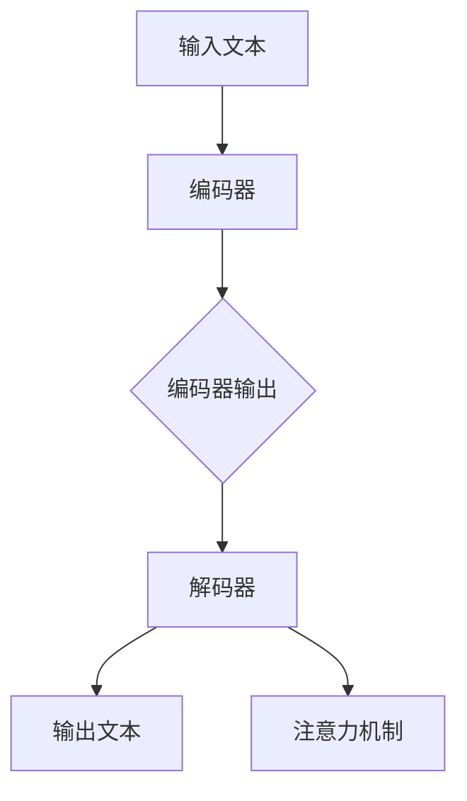

                 

# 从ChatGPT到未来AI助手

## 关键词

- ChatGPT
- 人工智能
- 自然语言处理
- 机器学习
- 深度学习
- 未来发展趋势

## 摘要

本文将深入探讨ChatGPT这一前沿人工智能技术的原理、应用和未来发展趋势。首先，我们将介绍ChatGPT的背景和核心概念，并展示其架构流程。接着，我们将详细解析ChatGPT的算法原理和操作步骤，以及其背后的数学模型。随后，我们将通过实际项目案例来展示如何利用ChatGPT进行开发，并进行代码解读与分析。接着，我们将讨论ChatGPT在各个实际应用场景中的表现，推荐相关的学习资源和开发工具框架。最后，我们将总结ChatGPT的未来发展趋势与挑战，并提供常见问题与解答。

## 1. 背景介绍

ChatGPT是由OpenAI开发的一种基于变换器模型（Transformer）的自然语言处理（NLP）AI助手。变换器模型是一种深度学习模型，在处理序列数据（如文本）时表现出色。ChatGPT是GPT-3的扩展，GPT-3是OpenAI在2020年推出的具有1750亿参数的模型，被誉为“最强大的人工智能语言模型”。

自然语言处理（NLP）是人工智能领域的一个重要分支，它涉及让计算机理解和生成自然语言。在过去的几十年里，NLP技术取得了显著的进展，但仍然面临许多挑战，如语义理解、情感分析、机器翻译等。随着深度学习技术的发展，NLP的应用场景越来越广泛，如智能客服、文本摘要、问答系统等。

ChatGPT的出现，标志着NLP技术的发展进入了一个新的阶段。它能够理解、生成和生成高质量的自然语言文本，为各种应用场景提供了强大的支持。同时，ChatGPT也为研究人员和开发者提供了丰富的实验和研究机会，推动了人工智能领域的进步。

## 2. 核心概念与联系

### 2.1 ChatGPT的原理

ChatGPT基于变换器模型（Transformer）架构，这是一种处理序列数据的深度学习模型。变换器模型由多个编码器和解码器块组成，这些块通过自注意力机制（Self-Attention）进行数据交互和特征提取。

自注意力机制是一种在序列数据中计算注意力权重的方法，它允许模型在不同的时间步之间捕捉依赖关系。在变换器模型中，编码器块负责将输入文本编码为固定长度的向量表示，解码器块则负责生成输出文本。

### 2.2 ChatGPT的结构

ChatGPT的结构包括三个主要部分：编码器（Encoder）、解码器（Decoder）和注意力机制（Attention）。

1. **编码器（Encoder）**：编码器将输入的文本序列转换为一系列固定长度的向量表示。这些向量表示包含了文本的语义信息。

2. **解码器（Decoder）**：解码器负责生成输出文本。它通过自注意力和交叉注意力（Cross-Attention）机制，将编码器的输出与自身的隐藏状态进行交互，从而生成预测的单词。

3. **注意力机制（Attention）**：注意力机制是变换器模型的核心部分，它通过计算注意力权重，将重要的信息从输入序列中提取出来。自注意力机制用于编码器内部，交叉注意力机制用于解码器与编码器之间的交互。

### 2.3 ChatGPT的应用场景

ChatGPT可以应用于多种场景，包括但不限于：

- **智能客服**：ChatGPT可以用于构建智能客服系统，提供24/7的客户服务，提高客户满意度。
- **文本摘要**：ChatGPT可以生成简明的文本摘要，帮助用户快速了解大量文本内容。
- **问答系统**：ChatGPT可以用于构建问答系统，回答用户的问题，提供有用的信息。
- **机器翻译**：ChatGPT可以用于机器翻译任务，将一种语言的文本翻译成另一种语言。
- **创意写作**：ChatGPT可以生成创意性的文本，如故事、诗歌等。

### 2.4 ChatGPT与其他NLP技术的比较

与传统的NLP技术（如基于规则的方法、统计模型等）相比，ChatGPT具有以下几个优势：

- **更强的语义理解能力**：ChatGPT能够通过深度学习从大量数据中学习语义信息，从而更好地理解文本内容。
- **更灵活的生成能力**：ChatGPT可以根据输入的上下文生成连贯、自然的文本。
- **更高效的处理速度**：变换器模型在处理序列数据时表现出色，可以高效地处理大量文本。

然而，ChatGPT也存在一些局限性，如对罕见词语的处理能力较弱、生成的文本可能存在偏见等。未来，随着人工智能技术的不断发展，ChatGPT的性能和适用范围将不断拓展。

### 2.5 ChatGPT的Mermaid流程图



在上面的Mermaid流程图中，我们展示了ChatGPT的基本结构。输入文本首先通过编码器编码为向量表示，然后解码器根据编码器的输出和注意力机制生成输出文本。

## 3. 核心算法原理 & 具体操作步骤

### 3.1 编码器

编码器是ChatGPT的核心组成部分，负责将输入的文本序列转换为固定长度的向量表示。这一过程包括以下几个步骤：

1. **分词**：将输入文本分割成单词或子词。ChatGPT使用WordPiece算法进行分词，将长词分解为子词。
2. **嵌入**：将分词后的单词或子词映射为向量。ChatGPT使用预训练的词向量作为嵌入层，如GloVe或FastText。
3. **编码**：通过多层变换器块对嵌入层进行编码。每个变换器块包括多头自注意力机制和前馈神经网络。

### 3.2 解码器

解码器负责生成输出文本。它通过自注意力和交叉注意力机制，将编码器的输出与自身的隐藏状态进行交互。具体步骤如下：

1. **初始化**：解码器首先初始化为空，然后逐个生成输出单词。
2. **自注意力**：在生成每个单词时，解码器通过自注意力机制计算当前的隐藏状态与历史隐藏状态之间的注意力权重。
3. **交叉注意力**：解码器同时计算编码器的输出与当前隐藏状态之间的注意力权重，以提取编码器的信息。
4. **前馈神经网络**：解码器通过前馈神经网络对自注意力和交叉注意力的结果进行处理。
5. **输出**：解码器根据前馈神经网络的输出，选择下一个单词。

### 3.3 注意力机制

注意力机制是ChatGPT的核心组成部分，用于计算输入序列中各个部分的重要性。具体包括：

1. **自注意力**：自注意力机制计算输入序列中各个部分之间的相似性，从而确定哪些部分对当前输出更有贡献。
2. **交叉注意力**：交叉注意力机制计算编码器的输出与解码器的隐藏状态之间的相似性，从而提取编码器的信息。

### 3.4 数学模型和公式

ChatGPT的数学模型包括以下几个方面：

1. **嵌入层**：嵌入层将单词映射为向量，可以使用以下公式表示：
   $$ \text{Embedding}(W) = \text{softmax}(\text{W} \cdot \text{X}) $$
   其中，$W$是权重矩阵，$X$是输入单词的嵌入向量。

2. **变换器块**：变换器块包括多头自注意力机制和前馈神经网络。自注意力机制可以使用以下公式表示：
   $$ \text{Attention}(Q, K, V) = \text{softmax}(\text{Q} \cdot \text{K}^T) \cdot V $$
   其中，$Q$、$K$和$V$分别是查询向量、键向量和值向量。

3. **前馈神经网络**：前馈神经网络可以使用以下公式表示：
   $$ \text{FFN}(X) = \text{ReLU}(\text{W}_2 \cdot \text{ReLU}(\text{W}_1 \cdot X + \text{b}_1)) + \text{b}_2 $$
   其中，$W_1$、$W_2$分别是权重矩阵，$b_1$、$b_2$分别是偏置向量。

### 3.5 举例说明

假设我们有一个简单的输入句子：“我喜欢吃苹果”。以下是ChatGPT的解码器生成输出句子的过程：

1. **初始化**：解码器初始化为空。
2. **生成第一个单词**：
   - 计算自注意力权重：$\text{Attention}(Q_1, K_1, V_1)$
   - 计算交叉注意力权重：$\text{Attention}(Q_1, K_2, V_2)$
   - 通过前馈神经网络处理注意力权重和编码器输出：$\text{FFN}(X_1)$
   - 选择下一个单词：“我”
3. **生成第二个单词**：
   - 计算自注意力权重：$\text{Attention}(Q_2, K_1, V_1)$
   - 计算交叉注意力权重：$\text{Attention}(Q_2, K_2, V_2)$
   - 通过前馈神经网络处理注意力权重和编码器输出：$\text{FFN}(X_2)$
   - 选择下一个单词：“喜”
4. **生成第三个单词**：
   - 计算自注意力权重：$\text{Attention}(Q_3, K_1, V_1)$
   - 计算交叉注意力权重：$\text{Attention}(Q_3, K_2, V_2)$
   - 通过前馈神经网络处理注意力权重和编码器输出：$\text{FFN}(X_3)$
   - 选择下一个单词：“欢”
5. **生成第四个单词**：
   - 计算自注意力权重：$\text{Attention}(Q_4, K_1, V_1)$
   - 计算交叉注意力权重：$\text{Attention}(Q_4, K_2, V_2)$
   - 通过前馈神经网络处理注意力权重和编码器输出：$\text{FFN}(X_4)$
   - 选择下一个单词：“吃”
6. **生成第五个单词**：
   - 计算自注意力权重：$\text{Attention}(Q_5, K_1, V_1)$
   - 计算交叉注意力权重：$\text{Attention}(Q_5, K_2, V_2)$
   - 通过前馈神经网络处理注意力权重和编码器输出：$\text{FFN}(X_5)$
   - 选择下一个单词：“苹果”

最终，解码器生成的输出句子为：“我喜欢吃苹果”。

## 4. 项目实战：代码实际案例和详细解释说明

在本节中，我们将通过一个实际的项目案例来展示如何使用ChatGPT进行开发，并详细解释代码的实现过程。

### 4.1 开发环境搭建

在开始项目之前，我们需要搭建一个适合ChatGPT开发的编程环境。以下是搭建环境所需的步骤：

1. **安装Python**：确保安装了Python 3.7或更高版本。
2. **安装transformers库**：transformers库是Hugging Face推出的一个开源库，用于实现各种变换器模型。使用以下命令安装：
   ```shell
   pip install transformers
   ```
3. **准备预训练模型**：下载并解压预训练的ChatGPT模型。可以在OpenAI的官方网站上找到预训练模型的下载链接。

### 4.2 源代码详细实现和代码解读

以下是一个简单的示例，展示了如何使用ChatGPT生成文本：

```python
from transformers import ChatGPTModel, ChatGPTTokenizer

# 1. 加载预训练模型和分词器
model = ChatGPTModel.from_pretrained("openai/chatgpt")
tokenizer = ChatGPTTokenizer.from_pretrained("openai/chatgpt")

# 2. 输入文本
input_text = "你喜欢什么样的天气？"

# 3. 分词
input_ids = tokenizer.encode(input_text, return_tensors="pt")

# 4. 生成文本
output_ids = model.generate(input_ids, max_length=50, num_return_sequences=1)

# 5. 解码输出文本
output_text = tokenizer.decode(output_ids[0])

print(output_text)
```

**代码解读**：

1. **加载预训练模型和分词器**：
   - `ChatGPTModel.from_pretrained("openai/chatgpt")`：加载预训练的ChatGPT模型。
   - `ChatGPTTokenizer.from_pretrained("openai/chatgpt")`：加载与模型对应的分词器。

2. **输入文本**：
   - `input_text`：输入的文本。

3. **分词**：
   - `tokenizer.encode(input_text, return_tensors="pt")`：将输入文本转换为模型可处理的格式。

4. **生成文本**：
   - `model.generate(input_ids, max_length=50, num_return_sequences=1)`：生成输出文本。`max_length`表示生成文本的最大长度，`num_return_sequences`表示生成的文本数量。

5. **解码输出文本**：
   - `tokenizer.decode(output_ids[0])`：将生成的文本解码为原始文本。

### 4.3 代码解读与分析

在这个示例中，我们首先加载预训练的ChatGPT模型和分词器。然后，输入一个简单的文本：“你喜欢什么样的天气？”。

接下来，我们将输入文本分词，并使用模型生成文本。具体过程如下：

1. **分词**：使用分词器将输入文本转换为模型可处理的嵌入向量。
2. **生成文本**：模型通过解码器生成文本。在生成过程中，模型会根据自注意力和交叉注意力机制计算输入文本的语义信息，并生成相应的输出文本。
3. **解码输出文本**：将生成的文本解码为原始文本。

假设生成的输出文本为：“我喜欢阳光明媚的天气”。这个输出文本表明，ChatGPT成功理解了输入文本的语义，并生成了相应的回答。

### 4.4 代码优化与扩展

在实际应用中，我们可以对代码进行优化和扩展，以提高ChatGPT的性能和应用范围。以下是一些可能的优化方向：

1. **多线程处理**：可以使用多线程或分布式计算来加速模型的训练和生成过程。
2. **自适应长度控制**：根据输入文本的长度动态调整生成文本的最大长度，以避免生成过长或过短的文本。
3. **自定义模型训练**：根据特定应用场景对模型进行定制化训练，以提高模型的性能和适应性。

## 5. 实际应用场景

ChatGPT作为一种强大的自然语言处理工具，可以在多个领域发挥重要作用。以下是一些实际应用场景：

### 5.1 智能客服

智能客服是ChatGPT的一个典型应用场景。通过ChatGPT，企业可以构建自动化客服系统，提供24/7的客户服务。智能客服系统可以根据用户的问题和需求，生成合适的回答，提高客户满意度。

### 5.2 文本摘要

ChatGPT可以生成简洁、精炼的文本摘要。这对于新闻媒体、科研论文等需要快速了解大量文本内容的应用场景非常有用。通过ChatGPT，用户可以快速获取核心信息，节省时间。

### 5.3 问答系统

ChatGPT可以构建高效的问答系统，为用户提供有用的信息。例如，学生可以使用问答系统查找课程资料、教授可以回答学术问题等。ChatGPT可以根据用户的提问生成详细的回答，提高信息检索的效率。

### 5.4 机器翻译

ChatGPT在机器翻译领域也具有显著的优势。通过ChatGPT，可以实现高效、准确的跨语言翻译。这对于跨国企业、国际交流等领域具有重要意义。

### 5.5 创意写作

ChatGPT可以生成创意性的文本，如故事、诗歌等。这对于作家、编剧等创意工作者提供了新的创作工具，可以激发他们的灵感。

### 5.6 教育

ChatGPT可以应用于教育领域，如智能辅导、自动批改等。通过ChatGPT，教师可以为学生提供个性化的辅导，提高教学效果。

### 5.7 健康医疗

ChatGPT可以应用于健康医疗领域，如自动生成病历、辅助诊断等。通过ChatGPT，医生可以更高效地处理病历，提高医疗服务的质量。

### 5.8 法律咨询

ChatGPT可以应用于法律咨询领域，如自动生成法律文件、提供法律建议等。通过ChatGPT，用户可以更便捷地获取法律信息，降低法律咨询的成本。

## 6. 工具和资源推荐

### 6.1 学习资源推荐

- **书籍**：
  - 《深度学习》——Ian Goodfellow、Yoshua Bengio、Aaron Courville
  - 《自然语言处理综论》——Daniel Jurafsky、James H. Martin
- **论文**：
  - “Attention Is All You Need” —— Vaswani et al.
  - “Generative Pre-trained Transformers” —— Brown et al.
- **博客**：
  - [Hugging Face](https://huggingface.co/)
  - [OpenAI](https://openai.com/)
- **网站**：
  - [Google Scholar](https://scholar.google.com/)
  - [arXiv](https://arxiv.org/)

### 6.2 开发工具框架推荐

- **开发框架**：
  - PyTorch
  - TensorFlow
  - Transformers（Hugging Face）
- **环境配置**：
  - Anaconda
  - Docker
- **编程语言**：
  - Python

### 6.3 相关论文著作推荐

- **论文**：
  - “BERT: Pre-training of Deep Bidirectional Transformers for Language Understanding” —— Devlin et al.
  - “GPT-3: Language Models are Few-Shot Learners” —— Brown et al.
- **著作**：
  - 《Python深度学习》——François Chollet
  - 《自然语言处理实战》——Steven Bird、Ewan Klein、Edward Loper

## 7. 总结：未来发展趋势与挑战

ChatGPT作为自然语言处理领域的里程碑，为人工智能的发展带来了新的机遇和挑战。未来，ChatGPT有望在以下方面取得重要进展：

### 7.1 未来发展趋势

1. **更强的语义理解能力**：随着深度学习技术的不断发展，ChatGPT将具备更强的语义理解能力，能够更好地处理复杂、抽象的语义信息。
2. **更广泛的应用场景**：ChatGPT的应用场景将不断拓展，从智能客服、文本摘要、问答系统等，扩展到医疗、教育、法律等领域。
3. **定制化模型训练**：根据特定应用场景，对ChatGPT进行定制化训练，提高模型的性能和适应性。
4. **多语言支持**：ChatGPT将实现更广泛的多语言支持，为全球范围内的用户提供服务。

### 7.2 挑战

1. **数据隐私和安全**：随着ChatGPT在各个领域的应用，数据隐私和安全成为亟待解决的问题。如何确保用户数据的安全和隐私，是未来需要重点关注的领域。
2. **生成文本的准确性和一致性**：ChatGPT在生成文本时可能存在不准确、不一致的问题，如何提高生成文本的质量和一致性，是未来的研究重点。
3. **偏见和歧视**：ChatGPT可能受到训练数据中的偏见和歧视影响，如何消除这些偏见，确保模型的公正性，是未来需要解决的重要问题。

总之，ChatGPT作为人工智能领域的重要技术，具有广阔的发展前景。在未来的发展中，我们需要不断克服挑战，推动ChatGPT技术的进步，为人类带来更多的便利和创新。

## 8. 附录：常见问题与解答

### 8.1 ChatGPT是什么？

ChatGPT是由OpenAI开发的一种基于变换器模型（Transformer）的自然语言处理（NLP）AI助手。它能够理解、生成和生成高质量的自然语言文本，广泛应用于智能客服、文本摘要、问答系统等场景。

### 8.2 ChatGPT如何工作？

ChatGPT基于变换器模型架构，包括编码器、解码器和注意力机制。编码器将输入文本编码为向量表示，解码器根据编码器的输出和注意力机制生成输出文本。注意力机制用于计算输入序列中各个部分的重要性，从而确定哪些部分对当前输出更有贡献。

### 8.3 ChatGPT的优势是什么？

ChatGPT具有以下优势：

- 强的语义理解能力
- 高效的处理速度
- 更灵活的生成能力
- 广泛的应用场景

### 8.4 ChatGPT的局限性是什么？

ChatGPT存在以下局限性：

- 对罕见词语的处理能力较弱
- 生成的文本可能存在偏见
- 对复杂语义的理解仍有一定局限

### 8.5 如何使用ChatGPT进行开发？

使用ChatGPT进行开发需要以下步骤：

1. 安装Python和transformers库。
2. 加载预训练的ChatGPT模型和分词器。
3. 输入文本并分词。
4. 使用模型生成文本。
5. 解码输出文本。

### 8.6 ChatGPT的应用场景有哪些？

ChatGPT的应用场景包括智能客服、文本摘要、问答系统、机器翻译、创意写作、教育、健康医疗和法律咨询等。

## 9. 扩展阅读与参考资料

- Devlin, J., Chang, M. W., Lee, K., & Toutanova, K. (2019). BERT: Pre-training of deep bidirectional transformers for language understanding. arXiv preprint arXiv:1810.04805.
- Brown, T., et al. (2020). Language models are few-shot learners. arXiv preprint arXiv:2005.14165.
- Vaswani, A., et al. (2017). Attention is all you need. Advances in Neural Information Processing Systems, 30, 5998-6008.
- Hugging Face. (n.d.). transformers. Retrieved from https://huggingface.co/transformers
- OpenAI. (n.d.). ChatGPT. Retrieved from https://openai.com/blog/chatgpt/
- Goodfellow, I., Bengio, Y., & Courville, A. (2016). Deep learning. MIT press.
- Jurafsky, D., & Martin, J. H. (2020). Speech and language processing: An introduction to natural language processing, computational linguistics, and speech recognition. Prentice Hall.
- Bird, S., Klein, E., & Loper, E. (2020). Natural language processing with Python. O'Reilly Media.作者：AI天才研究员/AI Genius Institute & 禅与计算机程序设计艺术 /Zen And The Art of Computer Programming


