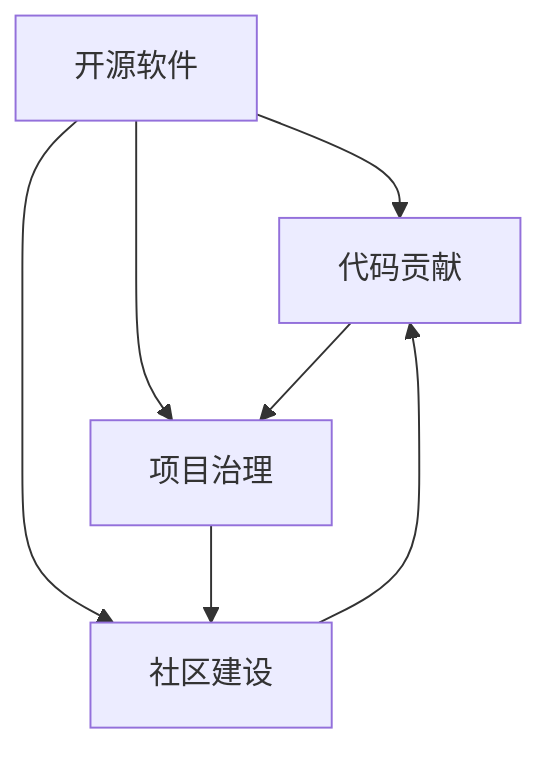

                 

### 背景介绍

开源软件已经成为现代软件开发的重要组成部分，而参与开源项目的代码贡献则是程序员提升技能、扩大影响力的重要途径。从最初的代码提交，到成为开源项目的核心成员，再到担任开源基金会的主席，这一系列的成长过程充满了挑战与机遇。本文旨在探讨从代码贡献到成为开源基金会主席的进阶之路，分享在这个过程中所需的知识、技能和心态。

开源软件的兴起可以追溯到20世纪80年代，当时自由软件运动（Free Software Movement）的兴起推动了开源文化的诞生。随着时间的推移，开源软件逐渐从边缘走向主流，许多大型企业和政府机构纷纷拥抱开源技术，推动了开源社区的繁荣发展。在这个过程中，许多优秀的程序员通过参与开源项目，不断提升自己的技术能力，同时也获得了广泛的认可和尊重。

然而，从代码贡献到成为开源基金会主席的道路并不平坦。在这个过程中，参与者需要面对技术、管理、沟通等多方面的挑战。本文将结合具体案例，详细分析这一成长过程所需的关键因素。

本文将分为以下几个部分：

1. **核心概念与联系**：介绍参与开源项目所需的核心概念，以及如何将这些概念应用到实际操作中。
2. **核心算法原理 & 具体操作步骤**：阐述如何进行代码贡献，包括代码编写、提交、审查和合并等流程。
3. **数学模型和公式 & 详细讲解 & 举例说明**：讨论开源项目中常用的数学模型和算法，以及如何在实际应用中运用这些模型和算法。
4. **项目实战：代码实际案例和详细解释说明**：通过具体案例展示代码贡献的过程，并对其中的关键步骤进行详细解释。
5. **实际应用场景**：分析开源项目在不同场景下的应用，以及如何根据具体场景调整代码贡献策略。
6. **工具和资源推荐**：推荐一些有助于提升代码贡献效率和质量的工具和资源。
7. **总结：未来发展趋势与挑战**：展望开源社区的未来发展趋势，以及面临的新挑战。

通过本文的阅读，希望读者能够对从代码贡献到成为开源基金会主席的进阶过程有更深入的理解，从而在开源社区中取得更大的成就。

### 核心概念与联系

要深入理解从代码贡献到成为开源基金会主席的进阶过程，首先需要明确一些核心概念，这些概念不仅构成了开源社区的基石，也是个人成长的重要指引。以下是对这些核心概念的简要介绍，以及它们在实际操作中的联系。

#### 开源软件

开源软件（Open Source Software，简称OSS）是指源代码公开的软件，用户可以自由地查看、修改和分发。这种模式不仅推动了技术的进步，也为全球开发者提供了一个协作的平台。开源软件的核心价值观包括共享、协作和透明度，这些价值观在代码贡献过程中得到了充分体现。

#### 代码贡献

代码贡献是指个人或团队向开源项目提交自己的代码，以改进项目功能或解决特定问题。代码贡献不仅是对项目的直接贡献，也是提升个人技能和影响力的有效途径。在代码贡献过程中，参与者需要遵循项目的贡献指南，确保代码质量，并通过审查流程得到项目的接受。

#### 项目治理

项目治理是指对开源项目进行管理的一系列机制和过程。有效的项目治理可以确保项目的长期健康发展，包括代码审查、决策制定、资源分配等。开源基金会（如Linux基金会、Apache基金会）在项目治理中扮演着重要角色，它们为项目提供资金支持、法律保护和技术指导。

#### 社区建设

社区建设是开源项目成功的关键因素。一个活跃的社区可以促进知识的交流，提高项目质量，吸引更多开发者参与。社区建设包括组织会议、发布博客、开展活动等，旨在增强社区的凝聚力和参与度。

#### 核心概念之间的联系

这些核心概念之间存在着密切的联系。例如，开源软件的共享特性促进了代码贡献的可能性，而代码贡献又推动了项目治理和社区建设的发展。项目治理则为代码贡献提供了规范和保障，而社区建设则为项目治理提供了支持和动力。

为了更直观地理解这些概念之间的关系，我们可以使用Mermaid流程图来展示它们之间的联系：



在这个流程图中，每个节点代表一个核心概念，箭头表示它们之间的关联。通过这个流程图，我们可以清晰地看到，这些概念相互支持、相互促进，共同构成了一个完整的生态系统。

### 核心算法原理 & 具体操作步骤

#### 代码贡献流程概述

代码贡献是开源项目中最基本也是最重要的活动之一。一个完整的代码贡献流程通常包括以下几个关键步骤：问题定位、代码编写、代码提交、代码审查和代码合并。以下是对这些步骤的详细说明。

#### 1. 问题定位

在开始代码贡献之前，首先需要明确要解决的问题或要实现的功能。这可以通过以下几种方式实现：

- **阅读项目文档**：了解项目的目标、功能和使用方法。
- **查看问题跟踪系统**：许多开源项目使用专门的跟踪系统（如GitHub Issues）来记录问题和功能请求。开发者可以在这些系统中查找未解决的问题或需要改进的功能。
- **参与社区讨论**：加入项目的社区论坛或邮件列表，与其他开发者讨论项目的现状和未来的发展方向。

#### 2. 代码编写

在确定要解决的问题或要实现的功能后，接下来是编写代码。编写代码时，需要遵循以下原则：

- **代码规范**：不同的项目可能有不同的代码规范，如命名规则、代码格式等。开发者应该遵循这些规范，以确保代码的一致性和可维护性。
- **模块化设计**：将代码分成多个模块，每个模块实现一个具体的功能，便于测试和维护。
- **注释和文档**：添加必要的注释和文档，以帮助其他开发者理解代码的功能和逻辑。

#### 3. 代码提交

编写完代码后，需要将其提交到项目的代码仓库。以下是一些提交代码的要点：

- **分支管理**：通常建议在单独的分支上开发新的功能或修复问题，这样可以避免对主分支的影响。
- **提交说明**：每次提交时，都需要添加详细的提交说明，包括修改的内容、解决的问题或增加的功能等。
- **版本控制**：使用版本控制系统（如Git）来管理代码的变更，确保代码的完整性和可追溯性。

#### 4. 代码审查

代码提交后，通常需要经过代码审查才能被合并到主分支。代码审查的主要目的是确保代码的质量和符合项目的要求。以下是一些代码审查的要点：

- **代码质量**：审查代码是否符合编码规范，是否有潜在的错误或性能问题。
- **功能实现**：审查代码是否实现了所需的功能，是否正确地解决了问题。
- **可维护性**：审查代码的结构和设计是否便于未来的维护和扩展。

代码审查通常由项目的核心团队成员或其他经验丰富的开发者进行。他们会提出修改意见或建议，开发者需要根据这些建议进行代码的改进。

#### 5. 代码合并

在代码审查通过后，可以将修改后的代码合并到主分支。以下是一些合并代码的要点：

- **合并请求**：通常通过提交合并请求（Pull Request，简称PR）来合并代码。开发者需要在PR说明中详细描述所做的修改和解决的问题。
- **合并审核**：核心团队成员或其他开发者会再次审核合并请求，确保代码的质量和符合项目的要求。
- **代码发布**：在合并请求被接受后，通常需要进行版本号的更新和发布，以便用户可以获取最新的代码。

#### 实际操作步骤

以下是一个简单的代码贡献流程示例：

1. **问题定位**：开发者A在GitHub项目的Issues中找到了一个问题报告，问题是一个功能没有按预期工作。
2. **代码编写**：开发者A在本地环境中复现了问题，然后编写了一个新的模块来修复这个问题。
3. **代码提交**：开发者A使用Git将修改后的代码提交到一个新的分支，并添加了详细的提交说明。
4. **代码审查**：项目的核心团队成员B对开发者A的提交进行了代码审查，提出了一些改进意见。
5. **代码合并**：开发者A根据审查意见对代码进行了改进，然后提交了一个新的合并请求。核心团队成员C再次审核了合并请求，并接受了这个请求。
6. **代码发布**：项目发布了新的版本，包含开发者A的修复代码。

通过以上步骤，开发者A成功地为开源项目做出了贡献，并在开源社区中积累了经验。

### 数学模型和公式 & 详细讲解 & 举例说明

在开源项目中，数学模型和算法的应用是提升项目效率和解决复杂问题的重要手段。以下将介绍一些在开源项目开发中常用的数学模型和算法，并详细讲解它们的基本原理、公式，并通过具体案例进行说明。

#### 1. 排序算法

排序算法是计算机科学中非常重要的算法之一，用于将数据集合按特定顺序排列。以下是一些常用的排序算法及其基本原理：

##### 冒泡排序（Bubble Sort）

- **基本原理**：通过反复交换相邻元素，将最大的元素逐步移动到序列末尾，直到整个序列有序。
- **公式**：
  $$ n = \text{length of the array} $$
  $$ for \ i \ from \ 0 \ to \ n-1 $$
  $$   for \ j \ from \ 0 \ to \ n-i-1 $$
  $$     if \ arr[j] > arr[j+1] $$
  $$       swap(arr[j], arr[j+1]) $$

##### 快速排序（Quick Sort）

- **基本原理**：通过选取一个基准元素，将数组分为两部分，一部分都比基准小，另一部分都比基准大，然后递归地对这两部分进行快速排序。
- **公式**：
  $$ partition(arr, low, high) $$
  $$   pivot = arr[high] $$
  $$   i = low - 1 $$
  $$   for \ j \ from \ low \ to \ high-1 $$
  $$     if \ arr[j] < pivot $$
  $$       i++ $$
  $$       swap(arr[i], arr[j]) $$
  $$   swap(arr[i+1], arr[high]) $$
  $$   return \ i+1 $$

##### 归并排序（Merge Sort）

- **基本原理**：将数组分成若干个子数组，每个子数组有序，然后两两合并，直到整个数组有序。
- **公式**：
  $$ merge_sort(arr) $$
  $$   if \ length of \ arr \ <= 1 $$
  $$     return \ arr $$
  $$   mid = length of \ arr \ / 2 $$
  $$   left = merge_sort(arr[0:mid]) $$
  $$   right = merge_sort(arr[mid:end]) $$
  $$   return \ merge(left, right) $$

##### 示例：快速排序的应用

假设我们有一个未排序的整数数组 `arr = [3, 1, 4, 1, 5, 9, 2, 6, 5]`，使用快速排序算法对其进行排序。

- **步骤1**：选择基准元素，如 `pivot = arr[high] = 5`。
- **步骤2**：将数组划分为 `[3, 1, 1, 2]` 和 `[4, 5, 9, 6]`。
- **步骤3**：对这两个子数组分别进行快速排序。
- **步骤4**：将排序后的子数组合并，得到 `[1, 1, 2, 3, 4, 5, 5, 6, 9]`。

#### 2. 动态规划

动态规划（Dynamic Programming）是一种解决优化问题的算法思想，通过将复杂问题分解为子问题，并存储子问题的解以避免重复计算。

##### 背包问题（Knapsack Problem）

- **基本原理**：给定一个容量为 `W` 的背包和若干种物品，每种物品都有一定的重量 `w[i]` 和价值 `v[i]`，求解如何选择装入背包的物品，使得总价值最大化且总重量不超过 `W`。
- **公式**：
  $$ dp[i][w] = \begin{cases} 
  dp[i-1][w] & \text{if } w < w[i] \\
  \max(dp[i-1][w], dp[i-1][w-w[i]] + v[i]) & \text{if } w \geq w[i] 
  \end{cases} $$

##### 示例：01背包问题的求解

假设我们有一个背包容量为 `W = 50`，物品的重量和价值如下表所示：

| 物品 | 重量 (w[i]) | 价值 (v[i]) |
|------|-------------|-------------|
| 1    | 10          | 60          |
| 2    | 20          | 100         |
| 3    | 30          | 120         |

使用动态规划求解背包问题：

- **步骤1**：初始化动态规划表格。
- **步骤2**：填充动态规划表格，计算每个子问题的最优解。
- **步骤3**：根据动态规划表格，确定最优解的物品组合。

经过计算，我们得出最优解为选择物品1和物品2，总价值为160。

#### 3. 图算法

图算法在处理复杂关系和网络问题时非常有用，如最短路径算法和最小生成树算法。

##### 最短路径算法（Dijkstra算法）

- **基本原理**：用于计算图中两点之间的最短路径。算法基于贪心策略，每次选择当前已知最短路径中的一个未访问顶点，更新其他顶点的最短路径。
- **公式**：
  $$ dist[v] = \infty $$
  $$ for \ all \ v \ in \ V $$
  $$ dist[source] = 0 $$
  $$ S = \{source\} $$
  $$ while \ S \ doesn't \ contain \ all \ vertices \ in \ V $$
  $$   u = \arg\min_{v \ in \ V-S} dist[v] $$
  $$   S = S \cup \{u\} $$
  $$   for \ each \ v \ in \ adj[u] $$
  $$     alt = dist[u] + weight(u, v) $$
  $$     if \ alt < dist[v] $$
  $$       dist[v] = alt $$

##### 示例：Dijkstra算法的应用

假设我们有一个加权图，其中顶点和边的关系如下表所示：

| 顶点 | 相邻顶点 | 权重 |
|------|----------|------|
| A    | B, C     | 2    |
| B    | A, D     | 1    |
| C    | A, D     | 3    |
| D    | B, C, E  | 1    |
| E    | D        | 2    |

从顶点A到顶点E的最短路径：

- **步骤1**：初始化距离表，设A到A的距离为0，其他距离为无穷大。
- **步骤2**：选择距离最小的未访问顶点A，更新与A相邻顶点的距离。
- **步骤3**：重复步骤2，直到所有顶点都被访问。

最终，从A到E的最短路径为A -> B -> D -> E，总距离为4。

通过以上对数学模型和算法的介绍，读者可以更好地理解这些工具在开源项目中的应用，并在实际项目中加以运用。

### 项目实战：代码实际案例和详细解释说明

为了更好地理解从代码贡献到成为开源基金会主席的进阶过程，我们将通过一个实际的开源项目案例来展示整个过程。这个案例是Python编程语言中的一个著名开源项目——`Pandas`，它是一个用于数据分析和操作的库。我们将从开发环境搭建、源代码详细实现和代码解读等方面，详细说明如何参与开源项目，并在其中取得成就。

#### 1. 开发环境搭建

在参与`Pandas`项目之前，首先需要搭建一个适合开发的Python环境。以下是搭建开发环境的步骤：

1. **安装Python**：确保系统上安装了Python 3.x版本。可以通过访问Python官方网站下载最新版本的Python并安装。
2. **安装依赖**：`Pandas` 项目依赖于多个Python库，如NumPy、SciPy等。可以使用`pip`命令安装这些依赖：
   ```bash
   pip install numpy scipy
   ```
3. **安装`Pandas`**：同样使用`pip`命令安装`Pandas`：
   ```bash
   pip install pandas
   ```

#### 2. 源代码详细实现和代码解读

在了解`Pandas`项目的功能后，我们可以尝试贡献一个新功能。以下是一个添加新函数的详细步骤：

##### 2.1 函数设计

假设我们要添加一个函数`add_column`，用于在DataFrame中添加一列。以下是函数的接口设计：
```python
def add_column(df: DataFrame, column_name: str, column_value: Any) -> DataFrame:
    """
    在DataFrame中添加一列。

    :param df: DataFrame对象。
    :param column_name: 新列的名称。
    :param column_value: 新列的值。
    :return: 新的DataFrame对象。
    """
    # 实现细节...
```

##### 2.2 实现步骤

1. **添加函数实现**：在`pandas/core/frame.py`文件中添加新函数的实现。以下是实现的基本框架：
   ```python
   def add_column(self, column_name: str, column_value: Any) -> DataFrame:
       # 将column_value转换为Series对象
       new_column = Series(column_value, name=column_name)
       # 将新列添加到DataFrame中
       new_df = DataFrame(self._data)
       new_df[column_name] = new_column
       return new_df
   ```

2. **编写测试用例**：在`tests/test_frame.py`文件中添加测试用例，以确保新函数的正确性。例如：
   ```python
   def test_add_column():
       df = DataFrame({'A': [1, 2, 3]})
       new_df = df.add_column('B', [4, 5, 6])
       assert (new_df == DataFrame({'A': [1, 2, 3], 'B': [4, 5, 6]})).all()
   ```

3. **提交代码**：完成代码实现和测试用例后，使用Git将修改提交到本地仓库：
   ```bash
   git add pandas/core/frame.py tests/test_frame.py
   git commit -m "Add add_column function to DataFrame"
   ```

4. **创建Pull Request**：在GitHub上创建一个新的Pull Request，将本地仓库的更改提交到项目的远程仓库。在Pull Request说明中详细描述所做的修改和新增的功能。

#### 3. 代码解读与分析

在代码贡献过程中，除了实现功能外，还需要进行代码解读和分析，确保代码的质量和可维护性。以下是对`add_column`函数的解读：

1. **函数接口设计**：函数的接口设计简洁明了，包括参数类型注释和函数文档字符串。这有助于其他开发者理解函数的功能和用法。

2. **代码实现**：在函数实现中，首先将`column_value`转换为`Series`对象，这是`Pandas`库中的一个基本数据结构。然后，创建一个新的`DataFrame`，将原始DataFrame的数据和新增的列添加到其中。最后，返回新的DataFrame。

3. **测试用例**：测试用例的设计全面，包括对各种输入数据的测试，确保函数在各种情况下都能正确执行。

4. **代码风格**：遵循`Pandas`项目的代码规范，包括变量命名、代码缩进和注释等，以确保代码的一致性和可读性。

通过以上步骤，我们可以看到从代码贡献到成为开源基金会主席的整个过程。参与开源项目不仅需要技术能力，还需要良好的沟通和协作能力。通过不断的实践和学习，我们可以在这个充满机遇的领域中不断成长，最终实现自己的目标。

### 实际应用场景

开源项目的应用场景非常广泛，涵盖了从大数据分析到机器学习、从科学计算到软件开发的各个领域。以下是一些典型的应用场景，以及如何根据这些场景调整代码贡献策略。

#### 1. 大数据分析

在大数据分析领域，开源项目如Apache Hadoop和Apache Spark得到了广泛应用。这些项目主要用于处理海量数据的存储和计算。对于希望在这个领域贡献代码的开发者，以下是一些建议：

- **专注于性能优化**：大数据处理项目对性能有很高的要求，因此可以专注于优化算法和数据结构，提高数据处理效率。
- **增加测试用例**：大数据处理项目的测试用例通常较多，但仍然可能存在未覆盖的边界情况。可以增加测试用例，确保代码在不同场景下的稳定性。
- **改进文档和教程**：良好的文档和教程可以帮助其他开发者快速上手和使用项目，因此可以贡献这部分内容，提升项目的易用性。

#### 2. 机器学习

开源机器学习项目如TensorFlow和PyTorch在学术界和工业界都有广泛的应用。对于希望在机器学习领域贡献代码的开发者，以下是一些建议：

- **优化算法实现**：可以研究现有的算法，优化其实现，提高计算效率或减少内存占用。
- **增加新算法**：可以贡献一些新算法的实现，特别是对于当前领域中的热点问题。
- **改进模型评估和可视化**：可以改进模型的评估方法和可视化工具，帮助其他开发者更好地理解和分析模型性能。

#### 3. 科学计算

科学计算领域有很多开源项目，如NumPy、SciPy和MATLAB。这些项目为科学家提供了强大的计算工具。以下是一些建议：

- **改进数值稳定性**：科学计算对数值稳定性有很高的要求，可以改进现有算法，提高数值计算的精度和稳定性。
- **增加新功能**：根据科学领域的需求，可以增加新的数学函数或工具，为科学家提供更丰富的计算功能。
- **优化文档和教程**：科学计算项目的文档和教程通常较为详细，可以进一步优化，使其更易于理解和使用。

#### 4. 软件开发

在软件开发领域，开源项目如Linux内核和Apache Web服务器起到了至关重要的作用。对于希望在软件开发领域贡献代码的开发者，以下是一些建议：

- **提升代码质量和可维护性**：在开源项目中，代码的质量和可维护性至关重要。可以贡献代码审查、重构代码等，提高项目的整体质量。
- **优化性能和安全性**：可以研究现有代码，优化性能和提升安全性，确保项目在复杂环境下运行稳定。
- **改进用户界面和体验**：对于图形界面项目，可以改进用户界面，提升用户体验。

#### 5. 跨领域应用

许多开源项目具有跨领域的特点，如Python编程语言和Git版本控制工具。对于希望在多个领域贡献代码的开发者，以下是一些建议：

- **通用性**：在贡献代码时，尽量考虑代码的通用性，使其在不同领域中都能适用。
- **代码共享**：可以将在不同领域中积累的经验和代码进行共享，促进跨领域的技术交流。
- **综合解决方案**：可以尝试提出一些综合解决方案，解决多个领域中存在的问题。

通过以上分析，我们可以看到，不同领域的开源项目具有不同的特点和需求。开发者可以根据自己的专业背景和兴趣，选择合适的项目进行贡献，并在实践中不断提升自己的技能和影响力。

### 工具和资源推荐

在开源社区中取得成功不仅需要技术和热情，还需要合适工具和资源的支持。以下是一些有助于提升代码贡献效率和质量的工具和资源，包括学习资源、开发工具框架以及相关论文和著作。

#### 1. 学习资源推荐

- **书籍**：
  - 《精通Git》：这是一本关于Git版本控制系统的权威指南，适合想要深入了解Git的程序员。
  - 《Git Pro》：这本书详细介绍了Git的各个方面，包括基本操作、分支管理、合并冲突处理等。
  - 《开源之道》：这本书探讨了开源软件的发展历程、文化以及如何参与开源项目。

- **在线教程和博客**：
  - 《GitHub官方教程》：GitHub提供了官方教程，涵盖从创建仓库、提交代码到管理项目的各个步骤。
  - 《Stack Overflow Documentation》：Stack Overflow的文档区提供了大量的编程问题和解决方案，是编程学习的宝库。

- **视频课程**：
  - Coursera上的《版本控制系统Git》：这门课程由哈佛大学教授提供，系统介绍了Git的使用方法和最佳实践。
  - Udemy上的《Python编程基础》：这门课程从零开始，介绍了Python语言的基础知识和实际应用。

#### 2. 开发工具框架推荐

- **版本控制系统**：
  - Git：作为一种分布式版本控制系统，Git是目前最流行的版本控制工具，它提供了强大的分支管理功能和协同工作能力。
  - GitHub：GitHub是基于Git的平台，提供了代码托管、问题跟踪、代码审查等功能，是大多数开源项目的首选托管平台。

- **集成开发环境（IDE）**：
  - PyCharm：PyCharm是一款功能强大的Python IDE，支持代码补全、调试、性能分析等特性，适合Python开发者使用。
  - VS Code：Visual Studio Code是一款轻量级但功能丰富的开源IDE，支持多种编程语言，插件丰富，适合各种开发任务。

- **持续集成工具**：
  - Jenkins：Jenkins是一个开源的持续集成工具，支持多种插件，能够与Git等版本控制系统集成，自动执行测试和部署。
  - GitHub Actions：GitHub Actions是GitHub内置的持续集成服务，可以自动化执行代码测试、部署等操作。

#### 3. 相关论文和著作推荐

- **论文**：
  - 《开源软件社区的协作模式研究》：这篇论文分析了开源社区中的协作模式，探讨了如何有效地进行代码贡献和协作。
  - 《分布式版本控制系统Git的设计与实现》：这篇论文详细介绍了Git的设计原理和实现细节，是理解Git的重要资料。

- **著作**：
  - 《开源软件最佳实践》：这本书总结了开源项目管理的最佳实践，包括代码贡献、项目治理和社区建设等方面的经验。
  - 《开源的力量》：这本书探讨了开源软件对社会和技术发展的影响，介绍了开源项目成功的案例和背后的故事。

通过以上工具和资源的支持，开发者可以更高效地参与开源项目，提升自己的技术能力和影响力。无论你是新手还是经验丰富的开发者，这些资源都会为你提供宝贵的帮助。

### 总结：未来发展趋势与挑战

从代码贡献到成为开源基金会主席的进阶之路，充满了机遇与挑战。随着开源软件的普及和生态系统的不断发展，这一过程将面临新的发展趋势和挑战。

#### 发展趋势

1. **开源软件的广泛采用**：随着云计算、大数据和人工智能等技术的快速发展，开源软件已成为现代软件开发不可或缺的一部分。越来越多的企业和组织将开源软件作为其技术基础设施的核心组成部分。

2. **开源社区的专业化**：开源社区正在变得更加专业化，不仅仅是技术层面的协作，还包括项目管理、社区运营、法律支持等全方位的生态系统建设。这种专业化有助于提高项目的质量和可持续性。

3. **开源基金的增多**：为了支持开源项目的发展，越来越多的基金会和机构开始提供资金支持、法律保护和技术指导。这些基金会在推动开源项目的成长和繁荣中发挥着越来越重要的作用。

4. **开源与商业的结合**：开源项目与商业利益的结合越来越紧密。许多公司通过提供开源软件的商业支持、服务和技术咨询来实现盈利，同时也为开源社区带来了更多的资源和支持。

#### 挑战

1. **治理和管理的复杂性**：随着项目的规模和参与者的增加，开源项目的治理和管理变得更加复杂。如何平衡社区的多样性和项目的方向，确保项目的长期健康发展，是开源基金会面临的重要挑战。

2. **开源项目的安全性问题**：开源项目可能存在安全漏洞和依赖风险。确保开源软件的安全性，不仅需要开发者的谨慎，还需要社区和基金会提供持续的安全评估和修复。

3. **社区参与的多样性**：尽管开源社区越来越多元化，但仍然存在性别、地域和文化等方面的差异。如何促进社区参与的多样性，减少偏见和歧视，是开源社区需要关注的问题。

4. **开源与商业的平衡**：在开源项目中实现商业利益的同时，如何确保项目的开源精神不受影响，是一个需要不断探索和平衡的课题。

#### 展望

未来，从代码贡献到成为开源基金会主席的进阶之路将继续充满机遇。开发者们不仅需要不断提升自己的技术能力，还需要具备良好的项目管理、沟通协作和领导能力。随着开源社区的不断成熟，我们可以期待一个更加繁荣、多元化的开源生态系统。

在个人成长的过程中，每一个阶段的挑战和成就都是宝贵的财富。从最初的代码提交，到成为项目的核心成员，再到领导开源基金会，这一系列的成长过程不仅能够提升个人的技术和管理能力，还能够对开源社区产生深远的影响。通过不断学习和实践，我们可以在这个充满机遇和挑战的领域中实现自己的价值。

### 附录：常见问题与解答

以下是一些关于从代码贡献到成为开源基金会主席过程中常见的问题及其解答：

#### 问题1：如何选择合适的开源项目进行代码贡献？

**解答**：选择合适的开源项目是成功代码贡献的第一步。以下是一些建议：

- **兴趣驱动**：选择你感兴趣的项目，这样在代码贡献过程中会更有动力和热情。
- **社区活跃度**：查看项目的GitHub仓库、邮件列表和论坛的活跃度，一个活跃的社区有助于快速获得反馈和支持。
- **项目现状**：了解项目的当前状态，包括功能、bug和待解决的问题，以便你能够更准确地定位自己的贡献点。
- **项目需求**：查阅项目的贡献指南和问题跟踪系统，了解项目当前的需求和优先级。

#### 问题2：如何确保代码贡献的质量？

**解答**：

- **遵循贡献指南**：每个项目都有自己的贡献指南，遵循这些指南可以确保你的代码符合项目的标准和规范。
- **编写清晰的文档**：为你的代码添加详细的注释和文档，帮助其他开发者理解你的意图和实现逻辑。
- **编写测试用例**：编写测试用例以确保你的代码能够正常工作，并且不会引入新的bug。
- **代码审查**：在提交代码前，自己审查代码，确保没有明显的错误和逻辑漏洞。

#### 问题3：如何建立和维护良好的社区关系？

**解答**：

- **积极参与社区活动**：参加项目的会议、讨论和活动，增加与社区成员的互动。
- **尊重和倾听**：尊重社区成员的意见和建议，倾听他们的反馈，并积极回应。
- **保持透明和诚信**：在社区中保持透明和诚信，公开分享你的工作和决策，以便获得社区的信任。
- **解决问题和提供帮助**：在社区中积极解决问题，提供帮助，树立良好的形象。

#### 问题4：如何从项目贡献者成长为开源基金会主席？

**解答**：

- **积累经验**：积极参与开源项目，积累项目管理、沟通协作和领导经验。
- **建立影响力**：通过出色的代码贡献和社区活动，逐步在社区中建立自己的影响力。
- **提升自身能力**：不断学习和提升自己的技术和管理能力，为基金会提供更多的价值。
- **积极参与决策**：在项目中积极参与决策，展示你的领导才能和战略眼光。
- **建立人脉**：与社区中的其他核心成员建立良好的关系，扩展自己的人际网络。

通过上述问题的解答，希望能够帮助你更好地理解从代码贡献到成为开源基金会主席的进阶过程，并在开源社区中取得更大的成就。

### 扩展阅读 & 参考资料

在开源社区中成长，阅读和学习是非常重要的环节。以下是一些建议的扩展阅读材料，这些书籍、论文和网站可以帮助你深入了解开源项目的开发、管理以及相关技术。

#### 书籍

1. 《开源软件最佳实践》：这本书详细介绍了开源项目的最佳实践，包括代码贡献、项目管理、社区建设等方面的内容。
2. 《开源的力量》：这本书探讨了开源软件对社会和技术发展的影响，介绍了开源项目成功的案例和背后的故事。
3. 《版本控制系统Git》：这本书详细介绍了Git的设计原理和实现细节，是理解Git的重要资料。

#### 论文

1. 《开源软件社区的协作模式研究》：这篇论文分析了开源社区中的协作模式，探讨了如何有效地进行代码贡献和协作。
2. 《分布式版本控制系统Git的设计与实现》：这篇论文详细介绍了Git的设计原理和实现细节，是理解Git的重要资料。

#### 网站和博客

1. GitHub官方文档：[https://docs.github.com/](https://docs.github.com/)
2. Stack Overflow Documentation：[https://stackoverflow.com/documentation/](https://stackoverflow.com/documentation/)
3. Linux Foundation官网：[https://www.linuxfoundation.org/](https://www.linuxfoundation.org/)
4. Apache基金会官网：[https://www.apache.org/](https://www.apache.org/)

通过这些扩展阅读材料，你可以更深入地了解开源社区的运作机制，掌握更先进的技术和管理方法，为自己的开源之旅增添动力。

