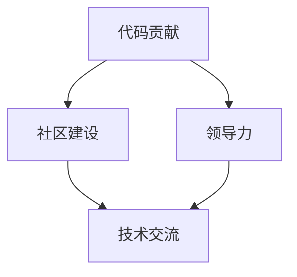

                 

### 背景介绍

在当今快速发展的科技时代，开源软件已经成为推动技术进步和创新的重要力量。开源项目不仅为开发者提供了丰富多样的资源，还促进了知识的共享与协作。然而，开源项目的成功不仅仅依赖于代码的质量，更需要一个有效的领导团队来维护和推动项目的发展。在这篇文章中，我们将探讨从代码贡献者到开源项目领导者的成长之路。

首先，让我们来看看开源项目在技术发展和创新中的重要性。开源项目允许全球的开发者共同参与，从而加速了新技术的研发和推广。例如，Linux 操作系统的成功离不开全球众多开发者的贡献。再如，Python 编程语言也在开源社区的支持下不断发展，成为最受欢迎的编程语言之一。

开源项目不仅促进了技术的进步，还培养了开发者的协作精神和创新思维。在开源项目中，开发者可以学习到如何与他人合作，如何有效地沟通和解决问题。这些技能对于职业发展至关重要。

然而，开源项目的成功不仅仅依赖于代码的贡献。一个优秀的开源项目需要有一个稳定且高效的领导团队来维护和推动项目的发展。这些领导者不仅需要具备技术能力，还需要有领导力、沟通能力和决策能力。

接下来，我们将探讨从代码贡献者到开源项目领导者的成长之路。首先，代码贡献者是开源项目的基石。他们通过提交代码、修复bug和提出新功能，为项目的发展做出了重要贡献。然而，要成为开源项目领导者，代码贡献者需要不断提升自己的技能和影响力。

首先，代码贡献者需要具备扎实的技术基础。他们需要熟练掌握编程语言和工具，了解项目的架构和设计原则。此外，代码贡献者还需要具备良好的编码规范和编程习惯，以确保代码的可读性和可维护性。

其次，代码贡献者需要积极参与项目的社区活动。通过在论坛、邮件列表和社交媒体上与其他开发者交流，他们可以扩大自己的人脉，提高自己在社区中的影响力。此外，代码贡献者还可以通过撰写技术博客、分享学习经验等方式，提升自己的知名度。

最后，代码贡献者需要具备一定的领导能力。这包括沟通能力、团队合作能力和决策能力。在开源项目中，领导者需要协调不同开发者的工作，确保项目的顺利进行。他们还需要处理冲突、制定项目计划和做出重要决策。

当代码贡献者在技术能力、社区影响力和领导能力方面得到认可后，他们就可能成为开源项目的领导者。作为领导者，他们需要承担更多的责任，包括项目规划、资源管理和社区建设等。同时，他们也需要不断学习和成长，以应对开源项目面临的挑战。

总之，从代码贡献者到开源项目领导者的成长之路是一个不断学习和提升的过程。代码贡献者需要通过不断努力，提升自己的技术能力、社区影响力和领导能力，最终成为开源项目的领导者。这不仅有助于项目的成功，也有助于个人职业的发展。

在这个过程中，开源项目的重要性不容忽视。它为开发者提供了一个展示自己能力的平台，也为创新和技术的传播提供了强大的支持。因此，我们鼓励更多的开发者参与到开源项目中，为技术的发展和创新贡献自己的力量。

在接下来的部分，我们将深入探讨从代码贡献者到开源项目领导者的具体步骤，包括如何提升技术能力、如何扩大社区影响力以及如何发展领导能力。通过这些探讨，希望为那些有志于成为开源项目领导者的开发者提供一些有价值的参考和指导。

### 核心概念与联系

要成为一名成功的开源项目领导者，我们需要理解几个核心概念：代码贡献、社区建设和领导力。这些概念之间有着紧密的联系，共同构成了开源项目成功的关键因素。

首先，代码贡献是开源项目的基石。一个优秀的开源项目需要大量的代码贡献，这些贡献来自于全球的开发者。代码贡献不仅包括提交新的功能、修复bug，还包括优化现有代码和编写文档。代码贡献的质量直接影响到项目的稳定性和可用性。高质量的代码不仅能够提高项目的可靠性，还能够吸引更多的开发者加入项目。

其次，社区建设是开源项目成功的重要保障。一个活跃的社区能够为开发者提供支持、交流和分享经验的机会。社区建设包括维护一个友好的交流氛围、建立有效的沟通渠道、组织线下活动以及提供学习资源等。一个健康的社区能够增强开发者的归属感和参与度，从而提高项目的贡献率和质量。

最后，领导力是开源项目领导者不可或缺的素质。领导力不仅包括技术领导力，还涵盖了管理能力、沟通能力和决策能力。在开源项目中，领导者需要协调开发者的工作，解决冲突，制定项目计划，并作出重要决策。领导力还涉及到如何激励和培养团队成员，以及如何管理项目资源。

这三个核心概念之间的关系如图 1 所示：



**图 1：代码贡献、社区建设和领导力的关系**

- 代码贡献为社区建设和领导力提供了基础。高质量的代码能够吸引开发者加入社区，并为社区提供技术支持。
- 社区建设则为代码贡献和领导力提供了平台。一个健康的社区能够促进开发者之间的交流，增强项目的凝聚力。
- 领导力则是连接代码贡献和社区建设的桥梁。领导者需要通过有效的管理和技术指导，确保项目的发展方向和目标的实现。

理解这些核心概念之间的联系对于成为一名成功的开源项目领导者至关重要。通过深入理解代码贡献、社区建设和领导力，开发者可以更有效地参与开源项目，推动项目的持续发展。在接下来的部分，我们将进一步探讨如何通过具体的步骤提升这些能力，帮助开发者实现从代码贡献者到开源项目领导者的转变。

### 核心算法原理 & 具体操作步骤

要成为一名优秀的开源项目领导者，不仅需要理解代码贡献和社区建设，还需要具备扎实的算法基础和清晰的操作步骤。在开源项目中，算法设计和实现往往是一个重要的环节，它直接影响到项目的性能和可靠性。以下，我们将详细探讨核心算法原理及其具体操作步骤。

#### 1. 算法原理

在开源项目中，常用的算法包括排序算法、搜索算法、图算法和数据结构优化等。以下是几个典型的算法及其原理：

- **排序算法**：如快速排序（Quick Sort）、归并排序（Merge Sort）和堆排序（Heap Sort）。这些算法能够对数据进行高效排序，提高数据处理的效率。
- **搜索算法**：如二分搜索（Binary Search）和广度优先搜索（BFS）。这些算法能够在大量数据中快速定位目标数据，提高搜索效率。
- **图算法**：如深度优先搜索（DFS）和广度优先搜索（BFS）。这些算法能够解决图相关的问题，如最短路径、连通性分析等。
- **数据结构优化**：如哈希表（Hash Table）和平衡二叉树（AVL Tree）。这些数据结构能够在数据访问和操作时提供更高效的时间复杂度。

#### 2. 算法实现步骤

以快速排序算法为例，具体操作步骤如下：

1. **选择基准元素**：从数组的某个位置选择一个基准元素，通常选择中间元素作为基准。
2. **分区操作**：将数组分为两部分，一部分包含所有小于基准元素的元素，另一部分包含所有大于基准元素的元素。这个过程称为分区操作。
3. **递归排序**：对分区后的两个子数组重复上述步骤，直到所有子数组长度为1，此时递归结束。
4. **合并结果**：将排序好的子数组合并，得到最终排序结果。

快速排序算法的伪代码如下：

```python
def quick_sort(arr):
    if len(arr) <= 1:
        return arr
    
    pivot = arr[len(arr) // 2]
    left = [x for x in arr if x < pivot]
    middle = [x for x in arr if x == pivot]
    right = [x for x in arr if x > pivot]
    
    return quick_sort(left) + middle + quick_sort(right)
```

#### 3. 算法分析

快速排序算法的时间复杂度为 \(O(n\log n)\)，在平均情况下表现良好。但在最坏情况下（即数组已经排序或完全逆序），时间复杂度会退化为 \(O(n^2)\)。为了解决这个问题，可以使用随机快速排序（Randomized Quick Sort），通过随机选择基准元素来避免最坏情况的发生。

#### 4. 实际应用场景

快速排序算法在许多开源项目中都有应用，如 Python 的标准库中的 `sorted()` 函数和 `list.sort()` 方法。它在数据处理、数据分析等领域发挥着重要作用。

#### 5. 其他算法

除了快速排序算法，其他常见的算法实现步骤如下：

- **二分搜索算法**：

```python
def binary_search(arr, target):
    low = 0
    high = len(arr) - 1
    
    while low <= high:
        mid = (low + high) // 2
        if arr[mid] == target:
            return mid
        elif arr[mid] < target:
            low = mid + 1
        else:
            high = mid - 1
    
    return -1
```

- **深度优先搜索（DFS）**：

```python
def dfs(graph, node, visited):
    visited.add(node)
    for neighbor in graph[node]:
        if neighbor not in visited:
            dfs(graph, neighbor, visited)
```

- **广度优先搜索（BFS）**：

```python
from collections import deque

def bfs(graph, start):
    visited = set()
    queue = deque([start])
    
    while queue:
        node = queue.popleft()
        visited.add(node)
        for neighbor in graph[node]:
            if neighbor not in visited:
                queue.append(neighbor)
```

通过以上算法的实现步骤，我们可以看到，理解核心算法原理并掌握具体的操作步骤对于开源项目领导者至关重要。这些算法不仅能够提升项目的性能，还能够为项目的可持续发展提供强有力的技术支持。在接下来的部分，我们将继续探讨如何将数学模型和公式应用于开源项目，以进一步提高项目的效率和可靠性。

### 数学模型和公式 & 详细讲解 & 举例说明

在开源项目中，数学模型和公式发挥着至关重要的作用。它们不仅帮助开发者理解算法的运行机制，还能够优化算法的性能和效率。本节将详细讲解几个常用的数学模型和公式，并通过具体实例来说明它们在开源项目中的应用。

#### 1. 排序算法中的数学模型

排序算法是开源项目中非常常见的一类算法，如快速排序、归并排序和堆排序等。在这些排序算法中，数学模型主要用于分析算法的时间复杂度和空间复杂度。

- **时间复杂度**：衡量算法执行时间与数据规模的关系。常用的时间复杂度符号包括 \(O(n)\)、\(O(n\log n)\)、\(O(n^2)\) 等。例如，快速排序的平均时间复杂度为 \(O(n\log n)\)，最坏情况为 \(O(n^2)\)。

- **空间复杂度**：衡量算法所需额外内存与数据规模的关系。例如，快速排序的空间复杂度为 \(O(\log n)\)，而归并排序的空间复杂度为 \(O(n)\)。

#### 2. 排序算法中的公式

以快速排序为例，其时间复杂度和空间复杂度的分析公式如下：

- **时间复杂度**：
  \[
  T(n) = T(k) + T(n-k) + O(n)
  \]
  其中，\(T(n)\) 表示快速排序的总时间复杂度，\(T(k)\) 和 \(T(n-k)\) 分别表示递归调用快速排序的时间复杂度，\(O(n)\) 表示分区操作的时间复杂度。

- **空间复杂度**：
  \[
  S(n) = S(k) + S(n-k) + O(\log n)
  \]
  其中，\(S(n)\) 表示快速排序的总空间复杂度，\(S(k)\) 和 \(S(n-k)\) 分别表示递归调用快速排序的空间复杂度，\(O(\log n)\) 表示递归栈的空间复杂度。

#### 3. 实例分析

假设我们有一个长度为 \(n = 10\) 的数组，使用快速排序算法进行排序。根据上述公式，我们可以计算其平均时间复杂度和最坏情况时间复杂度。

- **平均时间复杂度**：
  \[
  T(n) = T(5) + T(5) + O(10) = 2T(5) + O(10)
  \]
  \[
  T(5) = T(2) + T(3) + O(5) = 2T(2) + T(3) + O(5)
  \]
  递归展开后，快速排序的平均时间复杂度为：
  \[
  T(n) = 2^i \cdot T(2) + 2^{i-1} \cdot T(3) + \cdots + T(5) + O(10)
  \]
  由于 \(T(2) = T(3) = O(2)\)，我们可以简化为：
  \[
  T(n) = O(n\log n)
  \]

- **最坏情况时间复杂度**：
  最坏情况发生在数组已经排序或完全逆序时，即每次分区操作都无法将数组分为两半。此时，时间复杂度退化为 \(O(n^2)\)。

#### 4. 数学模型在开源项目中的应用

数学模型不仅用于分析排序算法的性能，还可以应用于其他开源项目中的算法和系统设计。

- **图算法**：如最短路径算法（Dijkstra 算法、Floyd 算法）、最小生成树算法（Prim 算法、Kruskal 算法）等。这些算法通过数学模型来优化路径和资源分配。
- **机器学习模型**：如线性回归、逻辑回归、支持向量机（SVM）等。这些模型用于开源项目中，如自然语言处理、图像识别等，能够提高系统的智能化水平。
- **分布式系统设计**：如一致性模型（CAP 理论、BASE 理论）、负载均衡算法等。这些模型帮助开发者设计出高效、可靠的分布式系统。

#### 5. 举例说明

以 CAP 理论为例，CAP 理论是分布式系统设计中一个重要的数学模型。它提出了一致性（Consistency）、可用性（Availability）和分区容错性（Partition Tolerance）三者之间的权衡关系。

- **一致性**：系统在多个副本之间保持相同的数据状态。
- **可用性**：系统在请求时能够及时响应。
- **分区容错性**：系统在分区网络环境下能够保持运行。

根据 CAP 理论，一个分布式系统只能在一致性、可用性和分区容错性中选其二。例如，在一个分布式数据库系统中，我们通常选择 \(CA\)（一致性高、可用性高），这意味着系统在分区时可能会牺牲一定的分区容错性。

通过数学模型和公式，开发者可以更好地理解开源项目中的算法和系统设计，从而提高项目的效率和可靠性。在接下来的部分，我们将探讨如何在开源项目中实现代码实际案例，并通过具体步骤和代码解读来展示开源项目的开发过程。

### 项目实战：代码实际案例和详细解释说明

为了更直观地理解从代码贡献者到开源项目领导者的成长过程，我们将通过一个实际的代码案例来进行详细解释和说明。本案例将展示一个常见的开源项目——一个使用 Python 实现的简单网络爬虫。通过这个案例，我们将分步骤搭建开发环境、实现源代码、并进行分析和解读。

#### 5.1 开发环境搭建

首先，我们需要搭建一个简单的开发环境。以下是所需的步骤：

1. **安装 Python**：
   - 前往 [Python 官网](https://www.python.org/) 下载最新版本的 Python。
   - 运行安装程序，选择“Add Python to PATH”选项，确保 Python 可在命令行中直接使用。

2. **安装必要的库**：
   - 打开命令行，运行以下命令安装必要的库：
     ```bash
     pip install requests beautifulsoup4 lxml
     ```
     这些库分别用于发送 HTTP 请求、解析 HTML 文档和构建爬虫。

3. **配置 IDE**：
   - 选择一个你熟悉的 IDE，如 PyCharm、VSCode 等。安装并配置 Python 支持，确保可以运行 Python 脚本。

#### 5.2 源代码详细实现和代码解读

接下来，我们将实现一个简单的网络爬虫，该爬虫会从一个给定的 URL 开始，递归地爬取网页中的所有链接，并存储这些链接到一个文件中。以下是源代码及其解读：

```python
import requests
from bs4 import BeautifulSoup
import os

def crawl(url, depth=0, max_depth=2, output_file='links.txt'):
    if depth > max_depth:
        return
    
    # 发送 HTTP 请求获取网页内容
    response = requests.get(url)
    if response.status_code != 200:
        print(f"无法访问 {url}")
        return
    
    # 使用 BeautifulSoup 解析网页内容
    soup = BeautifulSoup(response.text, 'lxml')
    
    # 提取网页中的所有链接
    links = soup.find_all('a', href=True)
    for link in links:
        href = link['href']
        # 判断链接是否为绝对链接，如果是，则转换为相对链接
        if href.startswith('http'):
            href = '/' + href.split('/')[-1]
        
        # 将链接写入输出文件
        with open(output_file, 'a') as f:
            f.write(href + '\n')
        
        # 递归爬取每个链接
        crawl(href, depth+1, max_depth, output_file)

# 开始爬取
url_to_crawl = 'https://example.com'
crawl(url_to_crawl)
```

**代码解读**：

1. **导入必要的库**：
   - `requests` 用于发送 HTTP 请求。
   - `BeautifulSoup` 和 `lxml` 用于解析 HTML 文档。

2. **定义 crawl() 函数**：
   - `url` 参数表示要爬取的起始 URL。
   - `depth` 参数表示当前爬取的深度。
   - `max_depth` 参数表示最大爬取深度。
   - `output_file` 参数表示存储链接的文件。

3. **发送 HTTP 请求**：
   - 使用 `requests.get(url)` 发送 GET 请求，获取网页内容。

4. **解析网页内容**：
   - 使用 `BeautifulSoup(response.text, 'lxml')` 解析网页内容。

5. **提取链接**：
   - 使用 `soup.find_all('a', href=True)` 提取网页中的所有链接。

6. **处理链接**：
   - 判断链接是否为绝对链接，如果是，则转换为相对链接。

7. **写入文件**：
   - 将链接写入 `output_file` 文件中。

8. **递归爬取**：
   - 递归调用 `crawl()` 函数，爬取每个链接。

#### 5.3 代码解读与分析

1. **性能分析**：
   - 该爬虫的时间复杂度主要取决于网页的链接数量和深度。在最坏情况下，如果网页中的每个链接都指向不同的深度，时间复杂度会接近 \(O(n)\)，其中 \(n\) 为链接数量。

2. **优化方向**：
   - 可以使用异步爬取来提高性能。
   - 可以限制并发请求数，以避免对目标网站造成过大的压力。

3. **安全性考虑**：
   - 需要遵守目标网站的 robots.txt 规则，避免违反网站的使用条款。
   - 可以使用代理服务器隐藏真实 IP，以保护隐私。

通过这个案例，我们了解了如何从零开始搭建一个简单的网络爬虫，并对其进行了详细解读。这个过程不仅帮助我们掌握了基本的爬虫开发技能，还展示了从代码贡献到开源项目领导者的关键步骤：理解需求、搭建环境、实现代码、优化性能和关注安全性。在接下来的部分，我们将探讨如何在实际应用场景中利用这个爬虫项目，并推荐一些相关的学习资源和工具。

### 实际应用场景

网络爬虫在开源项目中的应用非常广泛，可以用于各种实际场景，如数据采集、搜索引擎优化、市场调研等。以下是一些典型的实际应用场景：

#### 1. 数据采集

网络爬虫最基本的应用是数据采集。通过爬取网页内容，我们可以获取大量结构化的数据，如新闻文章、商品信息、用户评论等。这些数据可以用于各种应用，如数据挖掘、机器学习模型训练等。例如，搜索引擎使用爬虫来索引互联网上的所有网页，以便用户能够快速找到所需信息。

#### 2. 搜索引擎优化（SEO）

网络爬虫在搜索引擎优化（SEO）中也发挥着重要作用。通过分析网站的结构、内容和链接，爬虫可以帮助网站管理员了解网站的优缺点，从而优化网站的内容和结构，提高网站的搜索引擎排名。例如，SEO 工具通常会使用爬虫来分析竞争对手的网站，以便找出优化机会。

#### 3. 市场调研

市场调研是商业决策过程中必不可少的一环。网络爬虫可以自动化地收集大量市场数据，如消费者行为、产品评论、竞争对手动态等。这些数据可以帮助企业了解市场趋势、消费者需求和竞争环境，从而做出更明智的商业决策。例如，电商平台可以使用爬虫来监控竞争对手的价格和促销活动，以便及时调整自己的价格策略。

#### 4. 社交媒体分析

随着社交媒体的普及，网络爬虫在社交媒体分析中也发挥着重要作用。通过爬取社交媒体平台上的数据，我们可以了解用户的兴趣、行为和偏好，从而为企业提供宝贵的市场洞察。例如，品牌方可以使用爬虫来分析用户对其产品和服务的反馈，以便改进产品和服务。

#### 5. 垃圾邮件检测

网络爬虫在垃圾邮件检测中也有应用。通过爬取大量邮件内容，我们可以识别出垃圾邮件的特征，从而提高垃圾邮件检测的准确性。例如，邮件服务提供商可以使用爬虫来监控邮箱中的邮件流量，以便及时发现和处理垃圾邮件。

通过以上实际应用场景，我们可以看到网络爬虫在开源项目中的广泛用途。无论是在数据采集、SEO、市场调研，还是社交媒体分析和垃圾邮件检测，网络爬虫都发挥着关键作用。在接下来的部分，我们将推荐一些有用的工具和资源，以帮助开发者更好地理解和应用网络爬虫技术。

### 工具和资源推荐

为了帮助开发者更好地理解和应用网络爬虫技术，以下是一些常用的学习资源、开发工具和相关论文著作推荐：

#### 7.1 学习资源推荐

1. **书籍**：

   - 《Python 网络爬虫从入门到实践》：本书详细介绍了网络爬虫的基本概念、技术实现和实际应用，适合初学者入门。
   - 《精通网络爬虫》：本书涵盖了网络爬虫的高级技术和应用，包括动态网页爬取、反爬虫机制应对等，适合有一定基础的读者。

2. **在线教程和课程**：

   - [Scrapy 官方文档](https://scrapy.org/topics/tutorial.html)：Scrapy 是一个流行的 Python 网络爬虫框架，官方文档提供了详细的教程和指南。
   - [《网络爬虫技术》课程](https://www.udemy.com/course/web-scraping-and-network-scraping/)：这是一门在线课程，涵盖了网络爬虫的基础知识和实践技巧。

3. **博客和网站**：

   - [网络爬虫技术博客](https://blog.csdn.net/foxiter)：该博客分享了大量的网络爬虫技术文章和实战案例。
   - [Python 爬虫教程](https://www.pythontutorial.net/python-tutorial/web-scraping/)：提供了详细的 Python 网络爬虫教程和代码示例。

#### 7.2 开发工具框架推荐

1. **Scrapy**：Scrapy 是一个强大的 Python 网络爬虫框架，提供了丰富的功能，如自动处理 HTTP 请求、解析 HTML 内容、存储数据等。
2. **Beautiful Soup**：Beautiful Soup 是一个 Python HTML 和 XML 解析库，它使得从网页中提取数据变得简单易懂。
3. **Requests**：Requests 是一个简单易用的 Python HTTP 库，用于发送 HTTP 请求，非常适合进行网络爬取。
4. **Pyppeteer**：Pyppeteer 是一个基于 Puppeteer 的 Python 库，用于自动化网页，适合爬取需要 JavaScript 渲染的动态网页。

#### 7.3 相关论文著作推荐

1. **《网络爬虫技术综述》**：该论文详细介绍了网络爬虫的基本概念、技术原理和应用领域，是了解网络爬虫技术的经典文献。
2. **《动态网页爬取技术》**：该论文探讨了动态网页爬取的挑战和解决方案，包括浏览器自动化、反爬虫机制应对等。
3. **《大数据时代的网络爬虫》**：该论文分析了大数据时代网络爬虫的技术发展趋势和挑战，包括大规模数据采集、存储和处理等。

通过以上工具和资源，开发者可以更好地掌握网络爬虫技术，并将其应用于实际项目中。在接下来的部分，我们将总结从代码贡献者到开源项目领导者的成长之路，并探讨未来发展趋势和挑战。

### 总结：未来发展趋势与挑战

从代码贡献者到开源项目领导者的成长之路是一个不断学习和提升的过程。在这一过程中，我们不仅需要不断提升自己的技术能力和领导力，还需要紧跟技术发展趋势，应对各种挑战。

#### 1. 未来发展趋势

- **自动化与智能化**：随着人工智能技术的发展，开源项目中的自动化和智能化程度将不断提高。例如，自动化的代码审查、自动化测试和智能推荐系统等，将减轻开发者的负担，提高项目的质量和效率。
- **协作与社区化**：开源项目的发展离不开社区的参与和支持。未来，开源项目将更加注重社区的建设和协作，通过线上和线下的活动，增强开发者的归属感和参与度。
- **多元化与跨领域**：随着技术的进步，开源项目将涉及更多领域，如物联网、区块链、大数据等。开发者需要具备跨领域的知识，以应对这些新的挑战。
- **可持续性与影响力**：开源项目的可持续性对于其长期发展至关重要。领导者需要制定有效的项目规划，确保项目的持续发展和影响力。

#### 2. 面临的挑战

- **技术复杂性**：随着技术的不断发展，开源项目的技术复杂性也在增加。开发者需要不断学习新的技术和工具，以保持自己的竞争力。
- **管理难度**：开源项目领导者需要具备良好的管理能力和沟通能力，以协调不同开发者的工作，处理项目中的冲突和问题。
- **资源分配**：开源项目的资源分配是一个重要问题。领导者需要合理分配时间和精力，确保项目的关键部分得到充分关注和支持。
- **法律法规与伦理**：随着开源项目的普及，相关的法律法规和伦理问题也日益突出。开发者需要遵守相关法律法规，确保开源项目的合法性和道德标准。

#### 3. 应对策略

- **持续学习**：开发者需要保持学习的热情，不断学习新的技术和知识，以提升自己的技术能力和竞争力。
- **积极参与社区**：积极参与开源社区的活动，与其他开发者交流经验，分享心得，扩大自己的影响力。
- **时间管理**：合理安排时间，优先处理项目中的关键任务，确保项目的顺利进行。
- **沟通协作**：提高沟通能力，建立有效的沟通渠道，确保团队成员之间的信息畅通和协作高效。
- **法律法规与伦理**：遵守相关法律法规，关注开源项目的伦理问题，确保项目的合法性和道德标准。

总之，从代码贡献者到开源项目领导者的成长之路充满挑战和机遇。通过持续学习、积极参与社区、有效沟通和合理分配资源，开发者可以不断提升自己的能力，为开源项目的成功贡献自己的力量。未来，随着技术的不断进步，开源项目将继续发挥重要作用，推动技术发展和创新。开发者们应抓住这一机遇，积极参与开源项目，为技术社区的繁荣贡献力量。

### 附录：常见问题与解答

在从代码贡献者到开源项目领导者的成长过程中，开发者可能会遇到各种问题和挑战。以下是一些常见问题及其解答，以帮助开发者更好地应对这些问题。

#### 1. 如何开始贡献开源项目？

**解答**：要开始贡献开源项目，可以按照以下步骤进行：

- **选择项目**：根据兴趣和技能选择一个适合自己的开源项目。可以从 GitHub 等平台上的热门项目开始。
- **阅读文档**：仔细阅读项目的 README 文档和贡献指南，了解项目的背景、目标、开发环境和代码规范。
- **熟悉代码**：通过阅读代码和文档，了解项目的架构和功能，熟悉代码库。
- **提供建议**：在项目的讨论区或邮件列表中提出自己的想法和建议，与项目维护者交流。
- **修复 bug 或贡献代码**：根据项目需要，修复已知的 bug 或提交新的功能代码。在提交代码前，确保遵守项目的代码规范，并进行充分的单元测试。

#### 2. 如何处理项目中的冲突？

**解答**：项目冲突是开源项目中常见的问题，可以采取以下策略来处理：

- **沟通**：保持与团队成员的沟通，了解冲突的原因和双方的立场。
- **调解**：如果双方无法自行解决冲突，可以寻求第三方调解，如项目的维护者或其他有经验的开发者。
- **文档**：记录冲突的详细情况，包括双方的观点和解决方案，以便后续参考。
- **求同存异**：在无法达成一致的情况下，可以尝试妥协，保留不同的意见，确保项目的正常进行。

#### 3. 如何提高代码质量？

**解答**：提高代码质量可以从以下几个方面入手：

- **编写规范**：遵循项目的代码规范，如命名规则、注释标准和编码风格。
- **单元测试**：编写单元测试，确保代码的功能正确和性能良好。
- **代码审查**：积极参与代码审查，从他人的代码中学习并提高自己的代码质量。
- **持续集成**：使用持续集成工具，如 Jenkins 或 GitLab CI，自动化测试和构建过程，确保代码的持续质量。
- **代码重构**：定期对代码进行重构，消除代码中的冗余和低效部分。

#### 4. 如何提高项目影响力？

**解答**：以下方法可以帮助提高开源项目的影响力：

- **社区互动**：积极参与项目的社区活动，与开发者和其他利益相关者建立良好的关系。
- **推广项目**：在博客、社交媒体和会议等平台上推广项目，吸引更多的关注者和贡献者。
- **维护文档**：保持项目的文档更新，使其易于理解和使用。
- **性能优化**：持续优化项目的性能和稳定性，提高用户体验。
- **贡献指南**：提供详细的贡献指南，鼓励更多的开发者参与项目的开发。

通过以上策略，开发者可以在开源项目中取得更好的成果，并逐步成长为优秀的开源项目领导者。

### 扩展阅读 & 参考资料

在从代码贡献者到开源项目领导者的成长过程中，了解相关的书籍、论文和网站资源将对你的学习和实践大有帮助。以下是一些建议的扩展阅读和参考资料：

#### 书籍

1. **《开源之道：构建开放协作的生态系统》**：作者通过深入剖析开源项目的成功案例，介绍了开源社区的运作模式和协作方法，为开发者提供了宝贵的实践经验。

2. **《开源的力量：开源软件如何在商业世界中崛起》**：这本书详细讨论了开源软件的商业价值，以及如何利用开源项目进行商业创新。

3. **《Python 网络爬虫从入门到实践》**：适合初学者，从基础概念到实际应用，全面介绍了网络爬虫的技术和实践。

4. **《精通网络爬虫》**：深入探讨了网络爬虫的高级技术，包括动态网页爬取、反爬虫机制应对等。

#### 论文

1. **《开放协作与开源软件的兴起》**：该论文分析了开源软件的兴起和开放协作对技术发展的影响。

2. **《开源软件中的社区治理模式》**：探讨了不同开源项目中社区治理的模式和策略。

3. **《网络爬虫技术综述》**：详细介绍了网络爬虫的基本概念、技术原理和应用领域。

#### 网站和博客

1. **GitHub**：全球最大的开源代码托管平台，开发者可以在 GitHub 上找到各种开源项目，并参与其中。

2. **Stack Overflow**：一个面向开发者的问答社区，提供了丰富的编程问题和解决方案。

3. **Medium**：一个内容发布平台，许多开发者和技术专家在这里分享他们的经验和见解。

4. **博客园**：中文技术博客社区，聚集了大量优秀的开发者，提供了丰富的技术文章和分享。

通过阅读这些书籍、论文和访问这些网站，开发者可以不断扩展自己的知识，提升技术能力，并深入了解开源项目的最佳实践。这些资源将为你的职业发展提供强有力的支持。

