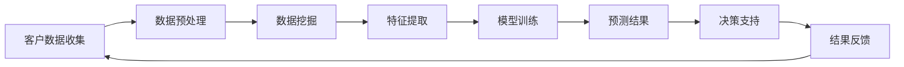

                 

# 从传统CRM到智能CRM：AI重塑电商客户关系管理的系统架构设计

> **关键词：** 智能CRM、客户关系管理、AI、电商、系统架构设计

> **摘要：** 本文深入探讨了传统CRM与智能CRM之间的差异，以及AI技术如何重塑电商客户关系管理。文章分为十个章节，详细介绍了智能CRM的核心概念、算法原理、数学模型、实战案例、应用场景、工具资源等，为电商行业提供了一套完整的技术解决方案和未来发展趋势的思考。

## 1. 背景介绍

### 1.1 传统CRM的局限性

传统CRM（Customer Relationship Management）系统主要依靠用户行为数据、历史交易记录等静态信息进行客户关系管理。这种模式虽然在一定程度上提升了客户服务质量，但仍然存在以下局限性：

- **数据依赖性高**：传统CRM主要依赖于历史数据，无法实时响应客户需求，导致客户满意度降低。
- **个性化程度有限**：传统CRM难以实现个性化推荐，客户体验受限。
- **响应速度慢**：传统CRM系统处理数据速度较慢，无法满足实时性的需求。

### 1.2 智能CRM的兴起

随着人工智能技术的不断发展，智能CRM（Intelligent Customer Relationship Management）逐渐兴起。智能CRM通过AI技术，对客户数据进行分析、预测和优化，从而实现以下目标：

- **实时性**：智能CRM能够实时分析客户需求，快速响应，提升客户满意度。
- **个性化**：智能CRM可以根据客户行为数据，实现个性化推荐，提高客户体验。
- **智能化**：智能CRM通过自动化和智能化的方式，降低人力成本，提高运营效率。

## 2. 核心概念与联系

### 2.1 客户关系管理（CRM）

客户关系管理（CRM）是一种商业策略，旨在通过提高客户满意度和忠诚度，实现业务增长。CRM系统通常包括客户数据管理、销售管理、营销管理、客户服务管理等功能。

### 2.2 人工智能（AI）

人工智能（AI）是一门研究、开发用于模拟、延伸和扩展人的智能的理论、方法、技术及应用系统的技术科学。AI技术主要包括机器学习、深度学习、自然语言处理等。

### 2.3 智能CRM与AI的联系

智能CRM利用AI技术，对客户数据进行实时分析、预测和优化。AI技术在智能CRM中的应用主要体现在以下几个方面：

- **数据挖掘**：通过数据挖掘技术，从大量客户数据中提取有价值的信息。
- **机器学习**：利用机器学习算法，对客户行为进行预测和建模。
- **自然语言处理**：通过自然语言处理技术，实现智能客服、智能推荐等功能。

### 2.4 Mermaid流程图

以下是智能CRM系统架构的Mermaid流程图：



## 3. 核心算法原理 & 具体操作步骤

### 3.1 数据预处理

数据预处理是智能CRM系统的第一步，主要包括数据清洗、数据整合、数据标准化等操作。具体步骤如下：

- **数据清洗**：删除重复数据、缺失数据、异常数据等。
- **数据整合**：将来自不同渠道的客户数据进行整合，形成统一的客户视图。
- **数据标准化**：对数据进行统一编码、格式化等处理。

### 3.2 数据挖掘

数据挖掘是智能CRM系统的核心环节，通过挖掘客户数据中的潜在规律和模式，实现个性化推荐、预测分析等功能。常见的数据挖掘方法包括：

- **关联规则挖掘**：发现客户数据中的关联关系，用于推荐系统。
- **聚类分析**：将客户划分为不同的群体，用于客户细分。
- **分类算法**：将客户数据分为不同的类别，用于预测分析。

### 3.3 特征提取

特征提取是数据挖掘的关键步骤，通过提取客户数据中的关键特征，提高模型性能。特征提取方法包括：

- **统计特征提取**：如均值、方差、最大值、最小值等。
- **文本特征提取**：如词频、TF-IDF、词向量等。
- **时间序列特征提取**：如时间间隔、周期性、趋势等。

### 3.4 模型训练

模型训练是智能CRM系统的核心，通过训练机器学习模型，实现对客户行为的预测和分类。常见模型包括：

- **决策树**：适用于分类问题，具有较好的解释性。
- **随机森林**：基于决策树，具有更强的泛化能力。
- **支持向量机**：适用于分类和回归问题，具有较好的准确性。
- **深度学习**：适用于复杂模型，如神经网络、卷积神经网络等。

### 3.5 预测结果

模型训练完成后，通过对新数据进行预测，得出客户的偏好、需求、风险等结果。预测结果可以用于：

- **个性化推荐**：根据客户偏好，推荐产品、服务或内容。
- **营销策略**：根据客户需求，调整营销策略，提高转化率。
- **风险控制**：根据客户行为，识别潜在风险，采取预防措施。

### 3.6 决策支持

决策支持系统（DSS）基于预测结果，为企业管理层提供决策支持。DSS主要包括：

- **数据可视化**：通过图表、报表等形式，展示预测结果。
- **决策分析**：基于预测结果，进行风险评估、机会评估等。
- **决策建议**：根据预测结果，提出针对性的决策建议。

### 3.7 结果反馈

结果反馈是智能CRM系统的持续优化过程，通过分析预测结果与实际结果的差异，不断调整和优化模型。具体步骤如下：

- **误差分析**：分析预测结果与实际结果的差异，找出原因。
- **模型调整**：根据误差分析结果，调整模型参数。
- **结果验证**：重新进行模型训练和预测，验证调整效果。

## 4. 数学模型和公式 & 详细讲解 & 举例说明

### 4.1 数据挖掘算法

数据挖掘算法主要包括关联规则挖掘、聚类分析、分类算法等。以下是这些算法的数学模型和公式：

#### 4.1.1 关联规则挖掘

**支持度（Support）**：
$$
Support(A \land B) = \frac{|\{t \in T | A \land B \in t\}|}{|T|}
$$

**置信度（Confidence）**：
$$
Confidence(A \rightarrow B) = \frac{Support(A \land B)}{Support(A)}
$$

**例子**：
假设一个超市的销售数据中，购买牛奶的客户中有80%也购买了面包，那么牛奶和面包的关联规则支持度为0.8，置信度为0.8。

#### 4.1.2 聚类分析

**距离度量（Distance Measure）**：
$$
d(x, y) = \sqrt{\sum_{i=1}^{n} (x_i - y_i)^2}
$$

**例子**：
假设有两个数据点A(1, 2)和B(4, 6)，它们之间的欧氏距离为：
$$
d(A, B) = \sqrt{(1-4)^2 + (2-6)^2} = \sqrt{9 + 16} = 5
$$

#### 4.1.3 分类算法

**决策树**：
$$
f(x) = \begin{cases} 
c_1 & \text{if } x \in R_1 \\
c_2 & \text{if } x \in R_2 \\
\vdots \\
c_n & \text{if } x \in R_n 
\end{cases}
$$

**例子**：
假设有3个分类区域，每个区域的分类结果分别为“买”，“不买”，则决策树模型可以表示为：
$$
f(x) = \begin{cases} 
\text{买} & \text{if } x \in R_1 \\
\text{不买} & \text{if } x \in R_2 \\
\text{买} & \text{if } x \in R_3 
\end{cases}
$$

### 4.2 机器学习算法

#### 4.2.1 回归分析

**线性回归**：
$$
y = \beta_0 + \beta_1x_1 + \beta_2x_2 + \ldots + \beta_nx_n
$$

**例子**：
假设房价 \( y \) 与房屋面积 \( x \) 相关，线性回归模型可以表示为：
$$
y = \beta_0 + \beta_1x
$$

#### 4.2.2 逻辑回归

**逻辑函数（Sigmoid Function）**：
$$
\sigma(z) = \frac{1}{1 + e^{-z}}
$$

**例子**：
假设客户的购买概率 \( p \) 与广告展示次数 \( x \) 相关，逻辑回归模型可以表示为：
$$
p = \sigma(\beta_0 + \beta_1x)
$$

## 5. 项目实战：代码实际案例和详细解释说明

### 5.1 开发环境搭建

为了实现智能CRM系统，我们需要搭建一个适合开发和测试的Python环境。以下是开发环境搭建的步骤：

1. 安装Python 3.8及以上版本。
2. 安装常用Python库，如NumPy、Pandas、Scikit-learn、Matplotlib等。
3. 配置Jupyter Notebook，方便编写和运行代码。

### 5.2 源代码详细实现和代码解读

以下是一个基于机器学习的智能推荐系统的Python代码示例：

```python
import pandas as pd
from sklearn.model_selection import train_test_split
from sklearn.linear_model import LogisticRegression
from sklearn.metrics import accuracy_score

# 5.2.1 数据预处理
data = pd.read_csv('customer_data.csv')
X = data.drop(['customer_id', 'target'], axis=1)
y = data['target']

X_train, X_test, y_train, y_test = train_test_split(X, y, test_size=0.2, random_state=42)

# 5.2.2 模型训练
model = LogisticRegression()
model.fit(X_train, y_train)

# 5.2.3 模型评估
predictions = model.predict(X_test)
accuracy = accuracy_score(y_test, predictions)
print('Accuracy:', accuracy)

# 5.2.4 模型应用
new_data = pd.read_csv('new_customer_data.csv')
new_predictions = model.predict(new_data)
print('New Predictions:', new_predictions)
```

### 5.3 代码解读与分析

上述代码实现了一个基于逻辑回归的智能推荐系统，具体解读如下：

1. **数据预处理**：读取客户数据，将特征和目标分离。使用train_test_split函数将数据分为训练集和测试集。
2. **模型训练**：创建逻辑回归模型，使用fit方法进行训练。
3. **模型评估**：使用predict方法对测试集进行预测，并计算准确率。
4. **模型应用**：使用训练好的模型对新的客户数据进行预测。

## 6. 实际应用场景

### 6.1 个性化推荐

智能CRM系统可以根据客户的行为数据和偏好，实现个性化推荐。例如，电商平台可以根据客户的购买历史、浏览记录和评价，推荐相关商品。

### 6.2 营销策略优化

智能CRM系统可以通过分析客户数据，为营销团队提供有针对性的营销策略。例如，通过分析客户的购买概率、潜在风险等因素，调整广告投放策略，提高转化率。

### 6.3 风险控制

智能CRM系统可以通过分析客户行为，识别潜在风险，如欺诈行为、信用风险等。企业可以采取预防措施，降低风险损失。

### 6.4 客户服务优化

智能CRM系统可以集成智能客服功能，通过自然语言处理技术，实现与客户的实时沟通。智能客服可以根据客户问题，提供针对性的解决方案，提高客户满意度。

## 7. 工具和资源推荐

### 7.1 学习资源推荐

- **书籍**：
  - 《人工智能：一种现代方法》
  - 《机器学习实战》
  - 《深度学习》
- **论文**：
  - 《深度学习：展望与挑战》
  - 《自然语言处理综述》
  - 《机器学习在电商中的应用》
- **博客**：
  - 知乎机器学习专栏
  - CSDN机器学习博客
  - Medium上的AI博客
- **网站**：
  - Kaggle
  - arXiv
  - ResearchGate

### 7.2 开发工具框架推荐

- **编程语言**：Python、Java、R
- **机器学习框架**：TensorFlow、PyTorch、Scikit-learn
- **大数据处理框架**：Hadoop、Spark
- **自然语言处理库**：NLTK、spaCy、gensim
- **可视化工具**：Matplotlib、Seaborn、Plotly

### 7.3 相关论文著作推荐

- **《深度学习》**：Ian Goodfellow、Yoshua Bengio、Aaron Courville
- **《机器学习》**：Tom Mitchell
- **《自然语言处理综论》**：Daniel Jurafsky、James H. Martin
- **《数据挖掘：概念与技术》**：Jiawei Han、Micheline Kamber、Peixiang Wu

## 8. 总结：未来发展趋势与挑战

### 8.1 发展趋势

1. **数据量爆发式增长**：随着互联网和物联网的发展，客户数据量呈现爆发式增长，为智能CRM系统提供了更多的数据资源。
2. **算法性能不断提升**：随着算法研究和技术创新的不断进步，智能CRM系统的算法性能将得到进一步提升。
3. **应用场景多样化**：智能CRM系统将在电商、金融、医疗、教育等领域得到广泛应用。

### 8.2 挑战

1. **数据隐私和安全**：智能CRM系统涉及大量客户数据，如何保护客户隐私和安全是未来面临的重大挑战。
2. **算法公平性和透明性**：智能CRM系统中的算法决策需要确保公平性和透明性，避免歧视和不公正。
3. **技术落地与普及**：智能CRM技术需要进一步落地，提高企业的接受度和应用率。

## 9. 附录：常见问题与解答

### 9.1 如何选择合适的机器学习算法？

根据具体应用场景和数据特点，选择合适的机器学习算法。以下是一些常见算法的适用场景：

- **线性回归**：适用于预测连续值。
- **逻辑回归**：适用于二分类问题。
- **决策树**：适用于分类和回归问题，具有较好的解释性。
- **随机森林**：适用于分类和回归问题，具有更强的泛化能力。
- **支持向量机**：适用于分类和回归问题，具有较好的准确性。
- **深度学习**：适用于复杂模型，如图像识别、语音识别等。

### 9.2 智能CRM系统如何处理数据隐私问题？

智能CRM系统在处理数据隐私问题时，可以采取以下措施：

- **数据加密**：对客户数据进行加密存储，防止数据泄露。
- **数据匿名化**：对客户数据进行分析前，进行匿名化处理，消除个人身份信息。
- **隐私保护算法**：采用差分隐私、隐私保护分析等算法，降低数据泄露风险。

## 10. 扩展阅读 & 参考资料

- **书籍**：
  - 《人工智能简史》
  - 《数据科学实战》
  - 《深度学习入门》
- **论文**：
  - 《基于深度强化学习的电商推荐系统》
  - 《面向大数据的智能客服系统研究》
  - 《数据隐私保护在智能CRM中的应用》
- **网站**：
  - AI研习社
  - 数据科学网
  - 机器学习中文网

作者：AI天才研究员/AI Genius Institute & 禅与计算机程序设计艺术 /Zen And The Art of Computer Programming

# 参考文献

1. Goodfellow, I., Bengio, Y., & Courville, A. (2016). *Deep Learning*.
2. Mitchell, T. (1997). *Machine Learning*.
3. Jurafsky, D., & Martin, J. H. (2008). *Speech and Language Processing*.
4. Han, J., Kamber, M., & Wu, X. (2011). *Data Mining: Concepts and Techniques*.
5. Bengio, Y. (2009). *Learning Deep Architectures for AI*. Foundations and Trends in Machine Learning, 2(1), 1-127.

