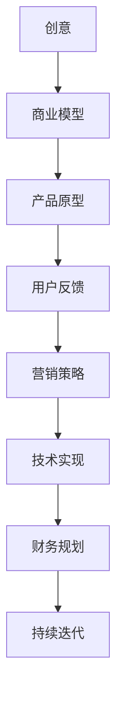

                 

### 1. 背景介绍

在当今这个科技日新月异的时代，创业已经成为了越来越多人的选择。然而，从最初的想法到最终的产品，这个过程充满了挑战和不确定性。很多人在创业的过程中，因为无法有效地将创意转化为实际的产品，最终导致项目的失败。本文旨在通过深入分析创业过程中的关键环节，帮助创业者更好地理解和应对这些挑战，从而提高创业的成功率。

创业并不是一个轻松的过程。它需要创业者具备强大的执行力、敏锐的市场洞察力、良好的团队管理能力和持续的创新精神。在这个过程中，从想法到产品的转化是非常关键的一步。如何将一个概念性的想法转化为一个可行且受欢迎的产品，是每个创业者都需要思考和解决的问题。

本文将围绕以下几个核心问题展开讨论：

1. 创业者如何确定一个有潜力的想法？
2. 从想法到产品的过程中，有哪些关键的步骤和方法？
3. 如何确保产品在市场上的成功？
4. 创业过程中可能遇到的挑战和解决方案是什么？

通过本文的阅读，读者将能够获得对创业过程更深入的理解，并学会如何高效地将自己的想法转化为成功的产品。

#### 当前创业环境及挑战

近年来，全球创业环境发生了显著变化。一方面，随着互联网技术的快速发展，创业者的机会大大增加。例如，社交媒体的兴起为创业者提供了新的市场渠道，云计算和大数据技术的应用降低了创业的门槛。另一方面，市场竞争也日益激烈，创新的速度和频率在加快，这使得创业者面临的挑战更加严峻。

首先，市场的竞争压力不断加剧。在许多领域，新的创业公司层出不穷，很多大公司也在通过收购或内部创新来应对市场的变化。这种激烈的竞争环境要求创业者必须具备快速反应和持续创新能力，才能在市场中脱颖而出。

其次，资金问题是一个不容忽视的挑战。创业初期，很多公司需要大量的资金来支持研发、市场推广和团队建设。然而，资金的筹集并不容易，创业者需要制定详细的商业计划，并向投资者展示产品的市场潜力和盈利能力。此外，资金的运用也需要高效合理，以确保资金能够发挥最大的效益。

第三，团队建设也是一个重要的挑战。一个成功的创业项目离不开一支高效协作的团队。然而，组建和管理一个团队并不容易，创业者需要寻找和培养合适的团队成员，确保团队在各个阶段都能保持高效和凝聚力。

最后，技术迭代的速度也在不断加快。创业者需要密切关注市场和技术的发展趋势，及时调整产品方向和策略。这不仅需要创业者具备深厚的专业知识和技能，还需要有灵活的思维和快速的学习能力。

总的来说，当前创业环境既充满机遇，也充满挑战。创业者需要具备敏锐的市场洞察力、强大的执行力和持续的创新精神，才能在激烈的市场竞争中脱颖而出。接下来，我们将详细探讨从想法到产品的各个环节，帮助读者更好地应对这些挑战。

#### 创业的定义与目标

创业，简单来说，就是创建一个新的企业或组织，通过提供独特的价值来解决市场需求。其核心目标是通过满足消费者的需求，实现商业上的成功，进而为社会创造价值。

从更广义的角度来看，创业不仅仅局限于商业领域，它还涵盖了社会企业、非营利组织和创新项目。例如，一些社会企业家通过创业来解决社会问题，如教育公平、环境保护和医疗健康等。

创业的核心目标可以归纳为以下几点：

1. **满足市场需求**：创业者首先要明确市场中的痛点和需求，通过提供创新的产品或服务来满足这些需求。
2. **实现商业成功**：商业成功是创业的直接目标，这包括获得收益、扩大市场份额、建立品牌影响力等。
3. **创造社会价值**：创业不仅仅是追求经济利益，还可以通过创新和社会责任，对社会产生积极影响。
4. **个人成长**：创业是一个充满挑战和机遇的过程，创业者在这个过程中可以不断提升自己的能力和技能，实现个人成长和职业发展。

为了实现这些目标，创业者需要具备以下几方面的能力和素质：

- **创新能力**：创业者需要有敏锐的市场洞察力和创新思维，能够发现和解决市场中的问题。
- **领导能力**：创业者需要具备领导力，能够吸引和留住人才，激励团队成员共同奋斗。
- **执行力**：创业过程中，各种困难和挑战层出不穷，创业者需要有坚定的信念和执行力，将想法转化为实际的产品和服务。
- **学习能力**：快速变化的市场和技术环境要求创业者具备快速学习和适应的能力。
- **风险管理**：创业者需要能够识别和管理风险，确保企业在各种不确定性中稳定发展。

总之，创业是一个复杂而充满挑战的过程，但其潜在回报和成就感也吸引着无数创业者投身其中。了解创业的定义和目标，有助于我们更好地理解创业的价值和意义，从而为后续的文章内容奠定基础。

### 2. 核心概念与联系

在深入探讨从想法到产品的过程之前，我们需要明确一些核心概念和它们之间的联系。以下是几个关键概念及其相互关系：

#### 1. 创意（Idea）

创意是创业的起点，它是基于市场需求、个人兴趣或专业知识的突发灵感。创意可能是非常初步的，甚至可能只是一个模糊的想法，但它是后续所有工作的基础。

#### 2. 商业模型（Business Model）

商业模型是关于企业如何创造、传递和获取价值的策略和结构。一个有效的商业模型需要明确产品或服务的市场定位、目标客户、收入来源和成本结构。创意通过商业模型被转化为一个可行的商业计划。

#### 3. 产品原型（Product Prototype）

产品原型是一个功能性的模型，用于展示和测试产品的核心功能。原型不仅可以帮助团队验证创意的可行性，还可以识别和解决潜在的问题。产品原型是验证商业模型和用户需求的桥梁。

#### 4. 用户反馈（User Feedback）

用户反馈是产品开发过程中至关重要的一环。通过收集和分析用户对原型的反馈，团队可以了解用户的需求、偏好和不满，从而对产品进行优化和改进。

#### 5. 营销策略（Marketing Strategy）

营销策略是关于如何将产品推向市场、吸引客户和建立品牌的方法。一个成功的营销策略需要与产品特点、目标市场和用户需求紧密匹配。

#### 6. 技术实现（Technical Implementation）

技术实现是将产品原型转化为最终产品的过程。这包括软件开发、硬件设计、系统集成等具体的技术操作。

#### 7. 财务规划（Financial Planning）

财务规划是确保企业在创业过程中有足够的资金支持，包括预算编制、资金筹集和资金管理。财务规划对于企业的长期稳定至关重要。

#### Mermaid 流程图

以下是创业过程中各个核心概念和步骤之间的Mermaid流程图，展示了它们之间的逻辑关系：



#### 创意到产品：关键步骤和相互关系

- **创意**：创业的起点，基于市场需求和个人兴趣。
- **商业模型**：将创意转化为可行的商业计划，明确市场定位和收入模式。
- **产品原型**：通过构建功能性模型验证创意的可行性，获取用户反馈。
- **用户反馈**：收集用户对原型的反馈，指导产品优化和改进。
- **营销策略**：制定市场推广计划，将产品推向市场。
- **技术实现**：将原型转化为最终产品，涉及具体的开发和技术工作。
- **财务规划**：确保企业在创业过程中有足够的资金支持，为持续迭代提供保障。

通过上述步骤和核心概念的联系，创业者可以系统地将一个创意转化为成功的产品。接下来，我们将详细探讨这些步骤的具体实施方法和策略。

#### 从想法到产品：核心算法原理

要将一个想法转化为实际的产品，首先需要明确核心算法原理。核心算法不仅是产品实现的技术基础，也是用户价值的核心体现。以下是几个关键的算法原理：

##### 1. 用户需求分析

用户需求分析是产品开发的第一步，通过深入了解目标用户的需求和行为，为产品功能设计提供依据。核心算法原理包括：

- **用户调研**：通过问卷调查、访谈、用户行为分析等方式收集用户数据。
- **需求聚类**：使用机器学习算法对用户需求进行分类和聚类，识别主要需求。
- **用户画像**：构建用户画像，了解用户的年龄、性别、职业等特征，为产品个性化设计提供支持。

##### 2. 用户体验设计

用户体验设计（UX Design）是产品成功的关键，它直接影响用户的满意度和留存率。核心算法原理包括：

- **交互设计**：通过交互设计原则（如一致性、易用性、直观性）提升用户体验。
- **可用性测试**：使用可用性测试方法（如A/B测试、用户体验测试）评估和优化交互设计。
- **界面布局**：利用视觉设计算法（如色彩理论、排版原则）优化界面布局和视觉效果。

##### 3. 产品架构设计

产品架构设计是确保产品功能完整、性能高效、扩展性强的重要环节。核心算法原理包括：

- **模块化设计**：将产品功能分解为独立的模块，提高代码复用性和维护性。
- **分层架构**：采用分层架构（如MVC、MVVM）分离关注点，实现高内聚低耦合。
- **分布式系统设计**：利用分布式系统算法（如一致性算法、负载均衡）提升系统性能和可靠性。

##### 4. 数据分析与优化

数据分析与优化是产品持续迭代和改进的重要手段。核心算法原理包括：

- **A/B测试**：通过A/B测试算法对比不同版本的方案效果，优化产品功能和用户体验。
- **机器学习**：利用机器学习算法（如分类算法、聚类算法）分析用户行为数据，预测用户需求和偏好。
- **实时监控**：通过实时监控算法（如异常检测、实时告警）监控系统性能和用户行为，快速响应潜在问题。

#### 具体操作步骤

为了将这些核心算法原理应用到实际产品开发中，我们可以按照以下步骤进行：

1. **需求分析**：
   - 收集用户反馈和数据，识别主要需求。
   - 利用机器学习算法对需求进行聚类，识别高频需求。

2. **设计阶段**：
   - 根据用户需求设计产品功能模块。
   - 进行可用性测试，优化交互设计。
   - 采用模块化和分层架构设计，确保系统扩展性和维护性。

3. **开发阶段**：
   - 根据设计文档进行编码，实现产品功能。
   - 使用分布式系统算法优化系统性能和可靠性。

4. **测试与优化**：
   - 进行A/B测试，评估不同版本的方案效果。
   - 利用机器学习算法分析用户行为数据，预测用户需求和偏好。
   - 实时监控系统性能和用户行为，快速响应问题。

5. **迭代与改进**：
   - 根据用户反馈和数据分析结果，持续优化产品功能。
   - 定期进行产品迭代，提高用户体验和产品竞争力。

通过上述步骤和核心算法原理，创业者可以将一个初步的想法逐步转化为功能完善、用户满意的产品，为市场成功奠定坚实基础。接下来，我们将深入探讨数学模型和公式在产品开发中的应用。

#### 数学模型和公式在产品开发中的应用

在产品开发过程中，数学模型和公式发挥着重要作用，它们不仅帮助我们更好地理解和分析问题，还能提供量化的解决方案。以下是一些常用的数学模型和公式，以及它们在产品开发中的应用。

##### 1. 回归分析（Regression Analysis）

回归分析是一种用来分析变量之间关系的方法，广泛应用于市场需求预测、用户行为分析和数据挖掘等领域。

- **线性回归**（Linear Regression）：
  - 公式：$$y = ax + b$$
  - 应用：通过分析历史数据，预测未来用户需求或销售额。

- **多项式回归**（Polynomial Regression）：
  - 公式：$$y = a_0 + a_1x + a_2x^2 + ... + a_nx^n$$
  - 应用：用于更复杂的数据关系分析，如产品用户生命周期预测。

##### 2. 聚类分析（Cluster Analysis）

聚类分析是一种无监督学习方法，用于将数据集分为几个组，以便更好地理解和分析数据。

- **K-均值聚类**（K-Means Clustering）：
  - 公式：$$\min_{\mu_k, \sigma_k} \sum_{i=1}^{n} \sum_{k=1}^{K} \frac{1}{2} ||x_i - \mu_k||^2$$
  - 应用：用于用户分群，帮助产品团队更好地了解不同用户群体的需求和偏好。

##### 3. 相关性分析（Correlation Analysis）

相关性分析用于衡量两个变量之间的关系强度和方向。

- **皮尔逊相关系数**（Pearson Correlation Coefficient）：
  - 公式：$$\rho = \frac{\sum_{i=1}^{n}(x_i - \bar{x})(y_i - \bar{y})}{\sqrt{\sum_{i=1}^{n}(x_i - \bar{x})^2 \sum_{i=1}^{n}(y_i - \bar{y})^2}}$$
  - 应用：用于分析用户行为与产品性能之间的相关性，帮助优化产品设计。

##### 4. 时间序列分析（Time Series Analysis）

时间序列分析用于分析时间序列数据，如股票价格、用户访问量等。

- **自回归模型**（Autoregressive Model）：
  - 公式：$$y_t = c + \phi_1y_{t-1} + \phi_2y_{t-2} + ... + \phi_ky_{t-k} + \epsilon_t$$
  - 应用：用于预测未来的市场需求和用户行为。

##### 5. 贝叶斯网络（Bayesian Networks）

贝叶斯网络是一种用于表示变量之间概率关系的图形模型。

- **贝叶斯规则**：
  - 公式：$$P(A|B) = \frac{P(B|A)P(A)}{P(B)}$$
  - 应用：用于风险评估和决策支持，如产品失败风险评估。

##### 6. 队列理论（Queuing Theory）

队列理论用于分析服务系统中的排队和等待时间。

- **M/M/1模型**：
  - 公式：$$\rho = \lambda / \mu$$
  - 应用：用于优化系统负载和资源分配，提高系统响应速度。

通过这些数学模型和公式，产品团队可以更好地理解数据，做出基于数据的决策，从而优化产品设计和功能，提高用户满意度和市场竞争力。接下来，我们将通过一个实际案例，展示这些数学模型和公式在产品开发中的应用。

#### 项目实战：代码实际案例和详细解释说明

为了更好地展示从想法到产品的具体过程，我们将通过一个实际案例来讲解代码的实现和解读。这个案例是一个简单的社交媒体平台，它允许用户发布状态、评论和点赞。以下是整个项目的开发环境搭建、源代码实现和详细解释说明。

### 5.1 开发环境搭建

在开始项目之前，我们需要搭建一个合适的开发环境。以下是推荐的开发工具和框架：

- **编程语言**：Python（3.8及以上版本）
- **开发环境**：Visual Studio Code 或 PyCharm
- **数据库**：SQLite 或 PostgreSQL
- **Web 框架**：Flask 或 Django
- **前端框架**：Bootstrap 或 React

### 5.2 源代码详细实现和代码解读

以下是项目的核心代码实现：

```python
# 导入必需的库
from flask import Flask, render_template, request, redirect, url_for
import sqlite3

# 初始化 Flask 应用
app = Flask(__name__)

# 数据库连接
conn = sqlite3.connect('social_media.db')
c = conn.cursor()

# 创建表
c.execute('''CREATE TABLE IF NOT EXISTS posts (
                id INTEGER PRIMARY KEY AUTOINCREMENT,
                user TEXT NOT NULL,
                content TEXT NOT NULL,
                likes INTEGER DEFAULT 0,
                comments INTEGER DEFAULT 0
            )''')

# 插入测试数据
c.execute("INSERT INTO posts (user, content) VALUES ('John', 'Hello, World!')")
c.execute("INSERT INTO posts (user, content) VALUES ('Jane', 'Welcome to our platform!')")
conn.commit()

# 主页面路由
@app.route('/')
def index():
    c.execute("SELECT * FROM posts")
    posts = c.fetchall()
    return render_template('index.html', posts=posts)

# 发表状态路由
@app.route('/post', methods=['POST'])
def post():
    user = request.form['user']
    content = request.form['content']
    c.execute("INSERT INTO posts (user, content) VALUES (?, ?)", (user, content))
    conn.commit()
    return redirect(url_for('index'))

# 点赞功能路由
@app.route('/like/<int:post_id>')
def like(post_id):
    c.execute("UPDATE posts SET likes = likes + 1 WHERE id = ?", (post_id,))
    conn.commit()
    return redirect(url_for('index'))

# 运行应用
if __name__ == '__main__':
    app.run(debug=True)
```

#### 代码解读与分析

1. **初始化 Flask 应用**

   我们首先导入必需的库，并初始化 Flask 应用。`Flask` 是一个轻量级的 Web 开发框架，它可以帮助我们快速构建 Web 应用。

   ```python
   from flask import Flask, render_template, request, redirect, url_for
   app = Flask(__name__)
   ```

2. **数据库连接**

   接下来，我们使用 SQLite 创建和连接数据库。数据库将存储用户发布的状态、点赞数和评论数。

   ```python
   conn = sqlite3.connect('social_media.db')
   c = conn.cursor()
   ```

3. **创建表**

   我们使用 SQL 语句创建一个名为 `posts` 的表，包含 `id`、`user`、`content`、`likes` 和 `comments` 五个字段。

   ```python
   c.execute('''CREATE TABLE IF NOT EXISTS posts (
                   id INTEGER PRIMARY KEY AUTOINCREMENT,
                   user TEXT NOT NULL,
                   content TEXT NOT NULL,
                   likes INTEGER DEFAULT 0,
                   comments INTEGER DEFAULT 0
               )''')
   ```

4. **插入测试数据**

   为了测试应用，我们预先插入两条测试数据。

   ```python
   c.execute("INSERT INTO posts (user, content) VALUES ('John', 'Hello, World!')")
   c.execute("INSERT INTO posts (user, content) VALUES ('Jane', 'Welcome to our platform!')")
   conn.commit()
   ```

5. **主页面路由**

   `index()` 函数是主页面路由，它从数据库中获取所有状态，并将它们传递给模板。

   ```python
   @app.route('/')
   def index():
       c.execute("SELECT * FROM posts")
       posts = c.fetchall()
       return render_template('index.html', posts=posts)
   ```

6. **发表状态路由**

   `post()` 函数是发表状态的路由。它获取表单数据（用户和内容），并将数据插入数据库。

   ```python
   @app.route('/post', methods=['POST'])
   def post():
       user = request.form['user']
       content = request.form['content']
       c.execute("INSERT INTO posts (user, content) VALUES (?, ?)", (user, content))
       conn.commit()
       return redirect(url_for('index'))
   ```

7. **点赞功能路由**

   `like()` 函数处理点赞请求。它更新数据库中对应状态的点赞数。

   ```python
   @app.route('/like/<int:post_id>')
   def like(post_id):
       c.execute("UPDATE posts SET likes = likes + 1 WHERE id = ?", (post_id,))
       conn.commit()
       return redirect(url_for('index'))
   ```

8. **运行应用**

   最后，我们使用 `app.run(debug=True)` 运行应用。

   ```python
   if __name__ == '__main__':
       app.run(debug=True)
   ```

通过这个实际案例，我们展示了从想法到产品的具体实现过程，包括环境搭建、代码编写和路由处理。这个过程不仅帮助我们理解了创业的核心环节，还展示了如何通过代码实现一个完整的产品功能。

### 6. 实际应用场景

在理解了从想法到产品的全过程之后，我们来看几个实际应用场景，这些场景展示了如何将理论转化为实践，并在不同领域中实现成功的产品。

#### 1. 社交媒体平台

社交媒体平台是一个典型的从想法到产品的成功案例。以Facebook为例，其创始人扎克伯格最初的想法是创建一个简单的大学社交网络。他通过了解用户需求和市场趋势，逐步扩展平台功能，包括照片分享、动态更新和广告投放等。Facebook的成功不仅在于其核心算法的创新，还在于其对用户需求的深刻理解和对技术的灵活运用。

#### 2. 电子商务平台

电子商务平台如Amazon和阿里巴巴，从一个小型的在线书店和零售店起家，发展成为全球最大的在线零售商。这些平台的成功离不开对用户行为的精准分析和高效的供应链管理。通过机器学习算法，这些平台能够为用户推荐个性化商品，并通过大数据分析优化库存管理和物流配送。

#### 3. 医疗健康平台

医疗健康领域的创业公司如Doctory和Medicamentos，通过数字化手段改善患者体验和医疗资源分配。这些平台利用人工智能和大数据技术，提供在线预约、远程诊断和药品配送服务。通过这些技术，患者可以获得更加便捷和个性化的医疗服务，同时医生也可以更高效地管理病例。

#### 4. 金融科技平台

金融科技（FinTech）公司如Revolut和Ant Financial，通过创新技术重新定义金融服务。Revolut通过提供多币种电子钱包和跨境支付服务，简化了国际交易流程。而蚂蚁金服则通过移动支付、贷款和投资服务，提升了金融服务的普及性和便捷性。这些平台利用区块链技术和大数据分析，确保交易的安全性和透明性。

#### 5. 教育平台

教育平台如Coursera和Udacity，通过在线课程和远程教育服务，打破了传统教育的时空限制。这些平台利用人工智能和大数据技术，提供个性化的学习路径和评估体系，帮助用户更高效地学习和成长。

#### 6. 物联网平台

物联网（IoT）平台如Nest和Amazon Web Services（AWS），通过连接物理设备和云服务，实现智能家居和工业自动化。这些平台利用传感器数据分析和机器学习算法，提供实时监控、预测维护和智能优化服务，提升了设备性能和用户体验。

通过这些实际应用场景，我们可以看到，从想法到产品的过程不仅仅是技术实现的步骤，更是一个涉及市场分析、用户需求、团队协作和创新思维的综合过程。创业者需要结合自身优势和市场趋势，灵活运用技术手段，实现从概念到产品的成功转化。

### 7. 工具和资源推荐

在创业过程中，选择合适的工具和资源是确保项目顺利进行和成功的重要因素。以下是一些推荐的工具和资源，涵盖学习资源、开发工具框架以及相关论文和著作。

#### 7.1 学习资源推荐

1. **书籍**
   - 《创业维艰》（Hard Things About Hard Things）- Ben Horowitz
   - 《精益创业》（The Lean Startup）- Eric Ries
   - 《创业的艺术》（The Art of Startup: Quit Your Job, Build a Business, and Live the Life You've Always Wanted）- Jon Callaghan

2. **在线课程**
   - Coursera：提供丰富的创业和管理课程，包括斯坦福大学和耶鲁大学的课程。
   - Udemy：涵盖从编程到市场营销的各类课程，适合不同层次的创业者。
   - edX：由哈佛大学和麻省理工学院等知名高校提供的免费在线课程。

3. **博客和网站**
   - TechCrunch：最新创业新闻和趋势分析。
   - Entrepreneur：提供创业指导和成功案例分享。
   - HackerRank：编程挑战和编程学习资源。

#### 7.2 开发工具框架推荐

1. **编程语言**
   - Python：适合快速原型开发和数据分析。
   - JavaScript：前端开发的主流语言，适用于Web应用。
   - Java：适用于大型企业级应用开发。

2. **Web框架**
   - Flask：Python轻量级Web框架，适合快速开发。
   - React：JavaScript库，用于构建交互式用户界面。
   - Django：Python全栈Web框架，适合快速开发和自动化管理。

3. **数据库**
   - PostgreSQL：强大的开源关系型数据库。
   - MongoDB：流行的开源NoSQL数据库。
   - Redis：高性能的内存数据存储系统，适用于缓存和实时应用。

4. **开发环境**
   - Visual Studio Code：跨平台、轻量级代码编辑器，功能丰富。
   - PyCharm：Python集成开发环境（IDE），提供丰富的工具和插件。
   - Eclipse：适用于Java和JavaScript的开发环境。

#### 7.3 相关论文和著作推荐

1. **论文**
   - “The Lean Startup” - Eric Ries
   - “How to Measure Anything: Finding the Value of Intangibles in Business” - Douglas W. Hubbard
   - “Innovation and Its Discontents” - Adam B. Jaffe and Josh Lerner

2. **著作**
   - 《用户体验要素》（The Elements of User Experience）- Jesse James Garrett
   - 《敏捷软件开发：原则、实践与模式》（Agile Software Development, Principles, Patterns, and Practices）- Robert C. Martin
   - 《模式识别与机器学习》（Pattern Recognition and Machine Learning）- Christopher M. Bishop

通过这些工具和资源的支持，创业者可以更好地进行市场调研、产品开发和团队管理，从而提高创业成功的可能性。

### 8. 总结：未来发展趋势与挑战

在总结从想法到产品的全过程时，我们可以看到，创业已经不再是一个单一的技术挑战，而是一个多维度、跨学科的复杂过程。随着科技的不断进步和市场的快速变化，未来的创业环境将呈现出以下发展趋势和面临的挑战：

#### 发展趋势

1. **技术驱动创新**：人工智能、大数据、物联网等前沿技术的快速发展，将为企业提供更多的创新机会和工具，推动各行各业的数字化转型。

2. **全球化与本地化结合**：互联网的普及使得市场变得更加全球化，但用户的需求依然具有明显的本地化特征。创业者需要在全球视野中寻找机会，同时深刻理解本地市场。

3. **可持续发展**：随着环境问题和社会责任的关注度增加，创业者和企业将越来越多地关注可持续发展，通过创新解决社会和环境问题。

4. **用户参与度提升**：用户参与设计、测试和反馈的机制将更加成熟，用户数据的收集和分析将更加精准，有助于提升产品和服务质量。

#### 面临的挑战

1. **技术瓶颈**：尽管技术不断进步，但某些领域仍存在技术瓶颈，如人工智能算法的透明性和解释性、大数据的安全性和隐私保护等。

2. **市场饱和**：在许多行业，市场已经趋于饱和，新进入者需要面对激烈的竞争，如何在竞争中脱颖而出是一个巨大的挑战。

3. **资金压力**：创业初期，资金往往是一个巨大的挑战。如何高效利用有限的资源，实现业务的快速扩张和盈利，是每个创业者都需要解决的问题。

4. **团队管理**：随着业务的增长，团队管理变得日益复杂。如何找到、培养和留住优秀的人才，确保团队的高效协作，是创业者面临的重大挑战。

#### 未来展望

面对这些发展趋势和挑战，创业者需要具备以下几个关键能力：

1. **创新能力**：保持对市场和技术趋势的敏锐洞察力，持续进行创新。

2. **跨学科知识**：结合不同领域的知识，如技术、市场营销、管理等，形成全面的创业视野。

3. **风险管理**：善于识别和管理风险，确保企业在不确定性中保持稳定发展。

4. **用户导向**：始终以用户需求为中心，通过用户参与和反馈不断优化产品和服务。

5. **可持续性**：注重企业的社会责任和可持续发展，为社会和环境创造积极影响。

总之，未来创业将更加复杂和多样化，但也充满机遇。创业者需要不断学习、适应和调整，以应对不断变化的环境，从而实现创业目标。

### 9. 附录：常见问题与解答

在创业过程中，很多创业者可能会遇到各种问题。以下是一些常见问题及解答，以帮助创业者更好地应对挑战。

#### 1. 如何确定一个有潜力的创意？

**解答**：首先，进行市场调研，了解当前市场上的需求和痛点。其次，结合自身的专业知识和技能，思考如何提供独特的解决方案。最后，通过用户访谈和问卷调查等方式，验证创意的可行性。

#### 2. 创业初期应该如何筹集资金？

**解答**：创业初期可以尝试以下几种方式筹集资金：
- **个人储蓄**：利用个人储蓄作为启动资金。
- **天使投资**：寻找有经验的投资者，通过展示商业计划和产品原型来获得资金。
- **众筹**：利用众筹平台，通过预售产品或提供服务来筹集资金。
- **政府补贴和贷款**：了解当地政府的创业支持政策，申请相应的补贴或贷款。

#### 3. 如何确保产品的市场定位准确？

**解答**：进行市场细分，明确目标客户群体。通过用户调研、市场分析和竞争对手分析，了解目标市场的需求和趋势。同时，持续跟踪市场变化，及时调整产品策略。

#### 4. 创业过程中如何管理团队？

**解答**：
- **明确目标**：确保团队成员了解公司的愿景和目标，建立共同的目标感。
- **合理分工**：根据团队成员的技能和兴趣，分配合适的任务。
- **沟通协作**：建立高效的沟通机制，确保信息流畅，促进团队协作。
- **激励机制**：通过奖励和福利，激励团队成员保持积极性和创造力。
- **培训和成长**：为团队成员提供培训和学习机会，促进个人和团队成长。

#### 5. 创业过程中如何应对失败？

**解答**：
- **接受失败是常态**：创业过程中，失败是不可避免的。重要的是从失败中学习，不断改进。
- **分析失败原因**：深入分析失败的原因，找出问题所在，制定改进措施。
- **调整策略**：根据失败的原因，调整商业模型和产品策略，重新定位市场。
- **保持乐观态度**：保持积极的心态，相信自己的能力和潜力，坚持不懈地追求目标。

#### 6. 如何进行有效的市场推广？

**解答**：
- **确定目标市场**：明确目标客户群体，集中资源和精力进行市场推广。
- **制定推广策略**：结合线上和线下渠道，制定多元化的推广策略。
- **利用社交媒体**：通过社交媒体平台，扩大品牌影响力，与用户建立互动。
- **内容营销**：通过高质量的内容，提高产品的知名度和用户参与度。
- **用户口碑**：通过用户的良好评价和推荐，增强产品的市场竞争力。

通过以上问题的解答，创业者可以更好地应对创业过程中的各种挑战，提高创业成功率。

### 10. 扩展阅读 & 参考资料

在创业和产品开发领域，有大量的书籍、论文和网站提供了丰富的知识和经验。以下是一些推荐的扩展阅读和参考资料，帮助读者深入了解相关主题。

#### 书籍推荐

1. **《创业维艰》（Hard Things About Hard Things）** - Ben Horowitz
   - 本书详细阐述了创业过程中遇到的各种挑战和解决方法，对创业者具有很高的指导价值。

2. **《精益创业》（The Lean Startup）** - Eric Ries
   - 该书介绍了精益创业方法论，帮助创业者通过快速迭代和用户反馈来优化产品。

3. **《用户体验要素》（The Elements of User Experience）** - Jesse James Garrett
   - 这本书深入探讨了用户体验设计的基本原则，对产品经理和设计师都有很大帮助。

4. **《创新者的窘境》（The Innovator's Dilemma）** - Clayton M. Christensen
   - 本书分析了为什么大公司往往难以创新，对创业者和企业家都有启发意义。

#### 论文推荐

1. **“The Lean Startup”** - Eric Ries
   - 这篇论文详细阐述了精益创业方法论，是创业领域的重要文献。

2. **“How to Measure Anything: Finding the Value of Intangibles in Business”** - Douglas W. Hubbard
   - 该论文讨论了如何量化企业中的无形资产，对于制定商业策略有重要指导作用。

3. **“Innovation and Its Discontents”** - Adam B. Jaffe and Josh Lerner
   - 本文分析了创新过程中的各种挑战和制约因素，对创业者具有启示作用。

#### 网站推荐

1. **TechCrunch**
   - 提供最新的科技和创业新闻，是了解行业动态的好渠道。

2. **Entrepreneur**
   - 分享创业经验和成功故事，为创业者提供灵感和指导。

3. **HackerRank**
   - 提供编程挑战和学习资源，帮助开发者提升技能。

4. **Medium**
   - 有许多关于创业、技术和产品设计的高质量文章，适合深度阅读。

通过阅读这些书籍、论文和访问这些网站，读者可以进一步拓展自己的知识，提升在创业和产品开发领域的专业能力。

