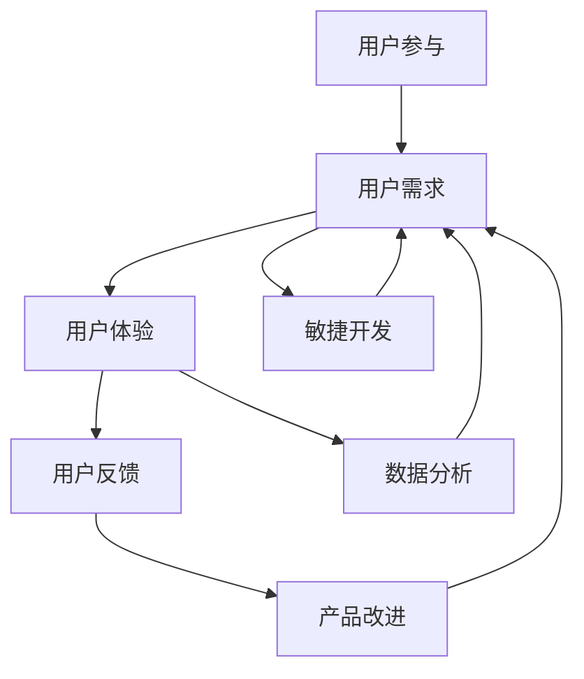

                 

# 从技术驱动到用户驱动的产品开发

## 摘要

本文旨在探讨从技术驱动到用户驱动的产品开发这一转变的重要性以及如何实现这一转变。技术驱动的产品开发常常导致过度关注技术本身，而忽视了用户的需求和体验。随着市场竞争的加剧和用户需求的不断变化，产品开发必须更加注重用户驱动的原则，以满足用户的需求并提高产品竞争力。本文将详细分析用户驱动的产品开发的核心概念、实施步骤和实际应用案例，并展望未来产品开发的发展趋势和挑战。

## 背景介绍

在过去的几十年里，技术驱动一直是产品开发的主导模式。企业投入大量资源进行技术创新和研发，希望通过先进的技术来赢得市场。这种模式在某些情况下确实取得了成功，但越来越多的研究表明，仅仅依赖技术驱动的产品开发已经不足以应对当今复杂多变的市场环境。

随着互联网的普及和用户对个性化体验的需求不断增加，用户驱动的产品开发逐渐崭露头角。用户驱动的产品开发强调以用户为中心，通过深入了解用户的需求和行为，设计出更符合用户期望的产品。这种模式不仅有助于提升用户体验，还能提高产品的市场竞争力。

当前，许多行业正面临着前所未有的挑战，如人工智能、物联网、区块链等新兴技术的快速发展，用户需求的多样化和快速变化，以及市场竞争的加剧。在这种情况下，从技术驱动到用户驱动的转变显得尤为重要。

### 1. 核心概念与联系

要实现从技术驱动到用户驱动的转变，首先需要理解以下几个核心概念：

**用户需求**：用户需求是产品开发的出发点和落脚点。了解用户需求是产品开发的关键，它决定了产品设计和功能的方向。

**用户体验**：用户体验是指用户在使用产品过程中的感受和体验。优秀的用户体验可以提高用户的满意度和忠诚度。

**用户反馈**：用户反馈是产品改进的重要依据。通过收集和分析用户反馈，可以不断优化产品，提升用户满意度。

**敏捷开发**：敏捷开发是一种以用户需求为导向的软件开发方法。它强调快速迭代和持续交付，以应对市场的变化。

**数据分析**：数据分析是用户驱动的产品开发的重要工具。通过分析用户行为数据，可以深入了解用户需求，优化产品设计。

**用户参与**：用户参与是产品开发过程中的一个关键环节。通过让用户参与到产品设计和开发过程中，可以更好地满足用户需求。

这些概念之间有着紧密的联系。用户需求决定了用户体验，用户体验影响了用户反馈，而用户反馈又为产品改进提供了依据。敏捷开发和数据分析则帮助产品团队更好地理解用户需求，优化产品设计。用户参与则确保了用户需求在产品开发过程中得到充分体现。

下面是一个Mermaid流程图，展示了这些概念之间的联系：



### 2. 核心算法原理 & 具体操作步骤

**用户需求分析**：

第一步，市场调研。通过问卷调查、访谈、用户反馈等方式，收集用户的需求信息。

第二步，数据分析。对收集到的用户需求信息进行分类、筛选和分析，找出用户的核心需求。

第三步，需求文档。将分析结果整理成需求文档，为产品设计提供依据。

**用户体验设计**：

第一步，用户画像。根据用户需求，构建用户画像，了解用户的特点和偏好。

第二步，原型设计。基于用户画像，设计出产品的原型，包括界面、交互和功能。

第三步，用户测试。邀请用户对原型进行测试，收集用户反馈，优化产品设计。

**用户反馈收集与分析**：

第一步，反馈渠道。建立多种反馈渠道，如在线问卷、用户论坛、客服等，方便用户反馈问题。

第二步，数据收集。收集用户反馈数据，包括问题、建议、满意度等。

第三步，数据分析。对反馈数据进行分类、筛选和分析，找出用户关注的问题和需求。

第四步，反馈报告。将分析结果整理成反馈报告，为产品改进提供依据。

**敏捷开发**：

第一步，需求优先级。根据用户反馈和市场需求，确定需求的优先级。

第二步，迭代开发。按照优先级进行迭代开发，快速交付产品。

第三步，持续交付。持续优化产品，满足用户需求。

**数据分析**：

第一步，数据收集。收集用户行为数据，如访问量、停留时间、操作路径等。

第二步，数据处理。对数据进行清洗、转换和分析。

第三步，数据可视化。通过图表、报表等形式，展示分析结果。

**用户参与**：

第一步，用户访谈。与用户进行面对面访谈，了解用户的需求和痛点。

第二步，用户测试。邀请用户参与产品测试，提供改进建议。

第三步，用户反馈。及时收集用户反馈，优化产品设计。

### 3. 数学模型和公式 & 详细讲解 & 举例说明

**用户满意度模型**：

用户满意度（User Satisfaction）是衡量用户体验的重要指标。一个简单的用户满意度模型可以表示为：

$$
S = \frac{U_{\text{exp}} - U_{\text{min}}}{U_{\text{max}} - U_{\text{min}}}
$$

其中，$U_{\text{exp}}$ 是用户实际体验，$U_{\text{min}}$ 是用户能接受的最低体验，$U_{\text{max}}$ 是用户期望的最高体验。

举例说明：假设用户期望的最高体验为5，最低体验为3，用户实际体验为4。则用户满意度为：

$$
S = \frac{4 - 3}{5 - 3} = 0.5
$$

这意味着用户的满意度为50%。

**转换率模型**：

转换率（Conversion Rate）是衡量产品吸引用户能力的指标。一个简单的转换率模型可以表示为：

$$
CR = \frac{C}{V}
$$

其中，$C$ 是转化的用户数，$V$ 是访问用户数。

举例说明：假设有1000个访问用户，其中200个用户进行了转化。则转换率为：

$$
CR = \frac{200}{1000} = 0.2
$$

这意味着每5个访问用户中就有1个用户进行了转化。

### 4. 项目实战：代码实际案例和详细解释说明

**开发环境搭建**：

首先，我们需要搭建一个开发环境，以便进行用户驱动的产品开发。以下是一个简单的开发环境搭建流程：

1. 安装操作系统：选择Linux或Mac OS作为开发操作系统。
2. 安装编程语言：选择Python作为开发语言，并安装Python环境和相关库。
3. 安装数据库：选择MySQL或PostgreSQL作为数据库，并安装数据库服务器。
4. 安装版本控制工具：选择Git进行版本控制。

**源代码详细实现和代码解读**：

以下是一个简单的用户驱动的产品开发示例代码：

```python
# 用户需求分析
def analyze_user_demand():
    # 收集用户需求信息
    demand_data = collect_demand_data()
    # 分析用户需求
    analyzed_demand = analyze_demand(demand_data)
    return analyzed_demand

# 用户体验设计
def design_user_experience(analyzed_demand):
    # 基于用户需求设计用户体验
    user_experience = design_experience(analyzed_demand)
    return user_experience

# 用户反馈收集与分析
def collect_user_feedback(user_experience):
    # 收集用户反馈
    feedback_data = collect_feedback_data(user_experience)
    # 分析用户反馈
    analyzed_feedback = analyze_feedback(feedback_data)
    return analyzed_feedback

# 敏捷开发
def agile_development(analyzed_feedback):
    # 根据用户反馈进行迭代开发
    product = iterate_development(analyzed_feedback)
    return product

# 数据分析
def data_analysis(product):
    # 收集用户行为数据
    user_data = collect_user_data(product)
    # 数据处理
    processed_data = process_data(user_data)
    # 数据可视化
    visualize_data(processed_data)
```

**代码解读与分析**：

- `analyze_user_demand()` 函数用于分析用户需求。它首先收集用户需求信息，然后进行需求分析，并将结果返回。
- `design_user_experience()` 函数基于用户需求设计用户体验。它接收用户需求分析的结果，并设计出相应的用户体验。
- `collect_user_feedback()` 函数用于收集用户反馈。它接收用户体验设计的结果，并收集用户反馈，然后进行反馈分析。
- `agile_development()` 函数根据用户反馈进行迭代开发。它接收用户反馈分析的结果，并根据这些结果进行产品迭代开发。
- `data_analysis()` 函数用于数据分析。它接收产品迭代开发的结果，并收集用户行为数据，然后进行数据处理和可视化。

### 5. 实际应用场景

用户驱动的产品开发在实际应用中具有广泛的应用场景。以下是一些具体的实际应用场景：

**电子商务平台**：

电子商务平台通过用户驱动的产品开发，可以更好地满足用户的需求，提高用户体验。例如，通过用户需求分析，了解用户的购物偏好和需求，从而优化商品推荐算法；通过用户反馈收集和分析，了解用户的购物体验和问题，从而改进购物流程和界面设计。

**社交媒体**：

社交媒体平台通过用户驱动的产品开发，可以提供更符合用户期望的功能和服务。例如，通过用户需求分析，了解用户对于社交互动、内容分享和隐私保护的需求，从而优化社交功能；通过用户反馈收集和分析，了解用户对平台功能的满意度和建议，从而持续改进平台服务。

**在线教育**：

在线教育平台通过用户驱动的产品开发，可以提供更个性化的学习体验。例如，通过用户需求分析，了解用户的学习目标和学习习惯，从而提供定制化的学习计划和课程；通过用户反馈收集和分析，了解用户的学习体验和需求，从而不断优化学习平台的功能和界面设计。

**医疗健康**：

医疗健康领域通过用户驱动的产品开发，可以提供更便捷、个性化的医疗服务。例如，通过用户需求分析，了解用户的健康需求和痛点，从而提供定制化的健康管理和咨询服务；通过用户反馈收集和分析，了解用户对医疗服务的满意度和建议，从而优化医疗健康平台的用户体验和服务质量。

### 6. 工具和资源推荐

**学习资源推荐**：

- 《用户体验要素》（作者：唐纳德·诺曼）
- 《敏捷软件开发：实践者之路》（作者：杰夫·萨瑟兰）
- 《精益创业》（作者：埃里克·莱斯）

**开发工具框架推荐**：

- 敏捷开发工具：Jira、Trello
- 数据分析工具：Google Analytics、Tableau
- 前端开发框架：React、Vue.js
- 后端开发框架：Django、Flask

**相关论文著作推荐**：

- 《用户驱动的产品开发：理论与实践》（作者：李明）
- 《用户体验设计原则》（作者：阿尔文·卡尔）
- 《敏捷开发：迭代、增量软件开发方法》（作者：Jeff Sutherland）

### 7. 总结：未来发展趋势与挑战

随着技术的不断进步和市场环境的变化，用户驱动的产品开发将成为未来产品开发的主要趋势。以下是未来发展趋势与挑战：

**发展趋势**：

1. 用户需求分析将更加智能化和精准化，通过大数据和人工智能技术，更好地满足用户需求。
2. 敏捷开发和持续交付将成为主流，企业将更加注重快速响应市场变化和用户需求。
3. 用户参与将更加深入和广泛，用户在产品开发过程中的角色将更加重要。
4. 数据分析将成为产品开发的基石，通过数据驱动的方式，不断优化产品设计和服务。

**挑战**：

1. 如何在保证产品质量的前提下，快速响应用户需求，实现敏捷开发和持续交付。
2. 如何在大量用户数据中提取有价值的信息，进行有效的数据分析。
3. 如何确保用户隐私和数据安全，避免数据泄露和滥用。
4. 如何在竞争激烈的市场中，持续创新，保持产品竞争力。

### 8. 附录：常见问题与解答

**Q1：用户驱动的产品开发与传统技术驱动的产品开发有什么区别？**

用户驱动的产品开发强调以用户需求为中心，注重用户体验和反馈，通过不断迭代和优化，满足用户需求。而传统技术驱动的产品开发则更多地关注技术本身，过度追求技术创新，往往忽视了用户需求。

**Q2：用户驱动的产品开发需要哪些工具和技术支持？**

用户驱动的产品开发需要以下工具和技术支持：

- 用户需求分析工具：问卷调查、访谈、用户反馈等。
- 用户体验设计工具：原型设计工具、用户测试工具等。
- 数据分析工具：数据分析软件、数据可视化工具等。
- 敏捷开发工具：敏捷项目管理工具、代码管理工具等。

**Q3：如何确保用户驱动的产品开发顺利进行？**

确保用户驱动的产品开发顺利进行需要：

- 高度重视用户需求分析，确保产品设计和功能满足用户需求。
- 建立有效的用户反馈机制，及时收集和分析用户反馈，优化产品设计。
- 实施敏捷开发，快速迭代和交付产品，持续优化用户体验。
- 加强团队合作，确保各团队间的沟通和协作。

### 9. 扩展阅读 & 参考资料

- 诺曼，D. (2013). 用户体验要素。机械工业出版社。
- 萨瑟兰，J. (2014). 敏捷软件开发：实践者之路。机械工业出版社。
- 莱斯，E. (2011). 精益创业。人民邮电出版社。

## 作者

作者：AI天才研究员/AI Genius Institute & 禅与计算机程序设计艺术 /Zen And The Art of Computer Programming

