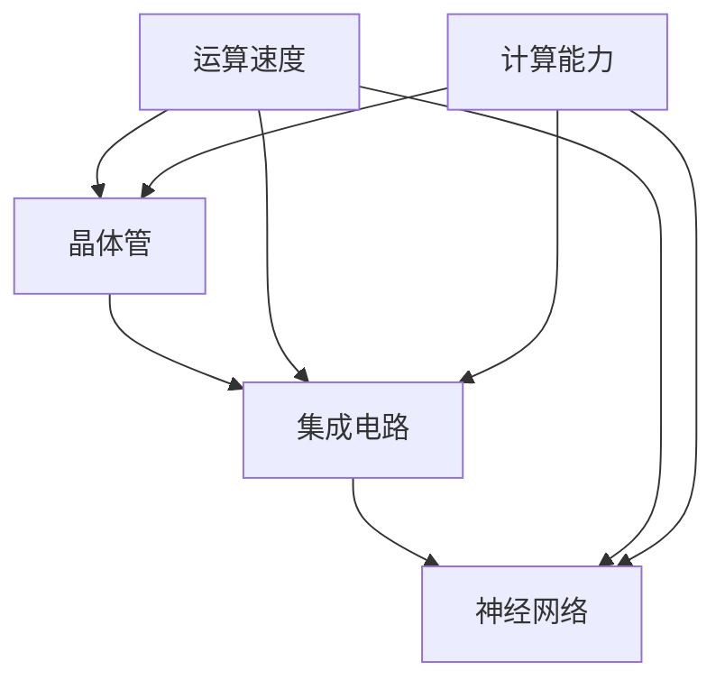
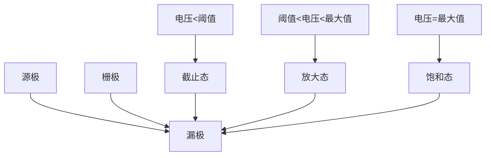
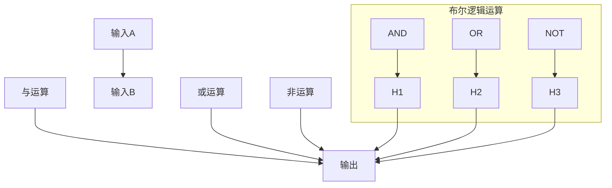
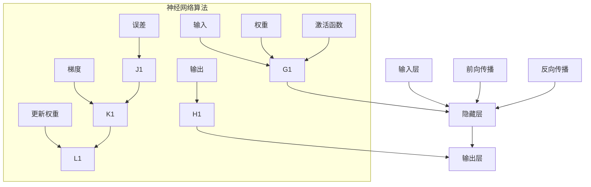

                 

### 背景介绍

计算架构的进化是计算机科学和技术领域中的一个重要课题，其背后的故事可以追溯到上世纪初的早期计算机时代。从最初的机械计算设备，到电子管计算机，再到晶体管和集成电路的发展，计算架构不断演变，推动了计算机性能的飞速提升。今天，神经网络作为计算架构的最新发展，正引领着人工智能领域的新一轮革命。

这篇技术博客将带领读者从晶体管到神经网络，深入探讨计算架构的进化历程。我们将首先回顾早期计算机的发展历史，然后详细解析晶体管和集成电路的技术原理，接着探讨神经网络的工作机制。此外，我们还将通过实际项目案例，展示神经网络在现实中的应用，并探讨其面临的挑战和未来发展趋势。

文章的核心目的是帮助读者理解计算架构的进化过程，以及如何通过逻辑分析和推理，深刻把握技术原理和本质。通过本文的阅读，读者不仅可以对计算架构的发展有更全面的了解，还能培养出一种分析问题和解决问题的能力，这对于计算机科学和技术领域的学习和研究具有重要意义。

为了实现这一目标，文章将采用逻辑清晰、结构紧凑、简单易懂的写作风格。在各个章节中，我们将采用一步一步的分析推理方式，深入讲解核心概念、算法原理和数学模型。同时，我们将结合实际项目案例，对代码实现和操作步骤进行详细解释和分析。

希望通过这篇博客，读者能够对计算架构的进化有一个深入的理解，从而更好地把握当前和未来的技术趋势，为自身的职业发展和学术研究提供有益的参考。

### 核心概念与联系

为了更好地理解计算架构的进化，我们需要首先明确一些核心概念，并探讨它们之间的联系。这些概念不仅构成了计算技术的基础，还推动了计算架构的不断进步。以下是计算架构中几个关键概念的定义及其相互关系：

#### 晶体管

晶体管是现代电子计算设备的核心组件，最早由约翰·巴丁、沃尔特·布拉顿和威廉·肖克利于1947年发明。晶体管是一种三端电子器件，具有放大信号和控制电流的能力。它的工作原理基于半导体材料的导电性变化，这种变化可以通过在半导体中施加电场来实现。

#### 集成电路（IC）

集成电路是多个晶体管和其他电子元件集成在一个小型半导体芯片上的技术。这一技术的发明，特别是由杰克·基比和迪夫·霍普尔于1958年开发的集成电路制造工艺，极大地提高了计算机的运算速度和性能，同时也降低了成本。集成电路的发展可以划分为几个阶段，包括小规模集成电路（SSI）、中规模集成电路（MSI）、大规模集成电路（LSI）和超大规模集成电路（VLSI）。

#### 神经网络

神经网络是模拟人脑神经元连接结构的计算模型，最早由战争时期的人工智能研究提出。神经网络由大量简单的计算单元（神经元）组成，这些单元通过权重连接形成复杂的网络结构。通过训练，神经网络能够学习输入数据之间的关系，并在未知数据上进行预测和分类。

#### 晶体管与集成电路

晶体管是集成电路中的基本元件，它的性能和可靠性直接影响了集成电路的性能。随着晶体管的尺寸不断缩小，集成电路的集成度不断提高，从而使得计算机的计算能力得到了巨大的提升。

#### 神经网络与集成电路

神经网络需要大量计算资源，传统的中央处理器（CPU）和图形处理器（GPU）已经难以满足其需求。因此，集成电路的发展催生了专门用于神经网络计算的硬件，如神经网络处理器（NNP）和专用集成电路（ASIC）。这些硬件能够显著提高神经网络的计算效率和性能。

#### 关键概念关系图

为了更直观地展示这些核心概念之间的联系，我们可以使用Mermaid流程图来绘制：



在该流程图中，晶体管作为基础元件，通过集成形成集成电路，而集成电路为神经网络提供了计算基础。同时，运算速度和计算能力是衡量计算架构性能的重要指标，它们在晶体管、集成电路和神经网络中均有所体现。

通过这些核心概念及其相互关系的理解，我们可以更深入地探讨计算架构的进化过程，以及每个阶段的技术进步如何推动整个领域的发展。在接下来的章节中，我们将详细解析这些概念，并探讨计算架构的演变对计算机科学和技术的影响。

#### 核心算法原理 & 具体操作步骤

在理解了计算架构中的核心概念之后，接下来我们将深入探讨计算架构中的核心算法原理，以及这些算法的具体操作步骤。为了使读者能够更直观地理解，我们将使用Mermaid流程图来展示算法的基本结构，并通过具体实例来说明这些算法的实际应用。

##### 1. 晶体管的工作原理

晶体管是现代电子计算设备的基础元件，其工作原理基于半导体材料的导电性变化。晶体管由三个部分组成：源极（Source）、漏极（Drain）和栅极（Gate）。源极和漏极通过一个半导体材料（如硅）连接，而栅极通过一个绝缘层（如二氧化硅）与半导体材料隔开。

晶体管的工作原理可以分为三个状态：

- 截止态：当栅极电压低于阈值电压时，晶体管处于截止状态，源极和漏极之间的电流为零。
- 放大态：当栅极电压高于阈值电压但未达到最大值时，晶体管处于放大状态，源极和漏极之间存在可控的电流。
- 饱和态：当栅极电压达到最大值时，晶体管处于饱和状态，源极和漏极之间的电流达到最大。

下面是晶体管的基本结构和工作状态的Mermaid流程图：



##### 2. 集成电路的基本算法

集成电路是由多个晶体管和其他电子元件组成的复杂系统。其基本算法可以简化为在特定输入信号下，通过晶体管的组合实现特定的逻辑功能。最常见的是布尔逻辑运算，包括与（AND）、或（OR）和非（NOT）运算。

以下是布尔逻辑运算的Mermaid流程图：



在上述流程图中，输入A和输入B分别表示布尔逻辑运算的输入，而输出D表示运算结果。通过组合不同的晶体管，可以实现对各种逻辑函数的运算。

##### 3. 神经网络的基本算法

神经网络是由大量简单的计算单元（神经元）组成的复杂系统。其基本算法是基于前向传播和反向传播过程，通过多层神经网络模型来模拟人脑的学习过程。

以下是神经网络的基本算法步骤的Mermaid流程图：



在上述流程图中，输入层A将输入数据传递到隐藏层B，然后通过激活函数处理得到输出层C的输出。前向传播过程中，输入数据经过多层神经网络，每层神经元进行加权求和并应用激活函数，最终得到输出。反向传播过程中，根据输出误差，计算梯度并更新神经网络的权重，从而提高模型的预测能力。

##### 实例说明

为了更具体地说明这些算法，我们以一个简单的神经网络为例，说明其具体操作步骤。

假设我们有一个输入数据集 \(X = \{x_1, x_2, ..., x_n\}\)，输出数据集 \(Y = \{y_1, y_2, ..., y_n\}\)，我们希望通过训练得到一个预测模型。

1. **前向传播**：

    - 输入数据 \(x_1, x_2, ..., x_n\) 进入输入层。
    - 每个输入数据经过加权求和后传递到下一层，计算得到每个神经元的输出。
    - 通过激活函数（如ReLU函数）对输出进行处理，得到新的数据集。

2. **计算误差**：

    - 计算输出数据 \(y_1, y_2, ..., y_n\) 与预测数据之间的误差。
    - 误差函数可以是均方误差（MSE）或交叉熵误差等。

3. **反向传播**：

    - 计算每个神经元的误差梯度。
    - 根据梯度更新每个神经元的权重。

4. **重复步骤 1-3**：

    - 重复前向传播和反向传播过程，直到达到预定的迭代次数或误差目标。

通过上述步骤，神经网络能够不断优化其权重，从而提高预测模型的准确性。

总之，通过理解晶体管、集成电路和神经网络的核心算法原理及其具体操作步骤，我们可以更好地把握计算架构的进化过程。这些算法不仅构成了计算技术的基础，还推动了计算架构的不断进步。在接下来的章节中，我们将进一步探讨数学模型和公式，以及如何通过这些模型和公式来分析和优化计算架构的性能。

#### 数学模型和公式 & 详细讲解 & 举例说明

在理解了计算架构的核心算法原理后，我们需要进一步探讨支持这些算法的数学模型和公式，并通过具体的示例来说明它们的实际应用。

##### 1. 晶体管的基本数学模型

晶体管的工作原理可以通过以下数学公式来描述：

\[ I_{DS} = I_{DSS} \left( \frac{W}{L} \right) \left( \frac{V_{GS} - V_{TH}}{V_{TH}} \right)^{2} \exp \left( \frac{V_{GS} - V_{TH}}{V_{\mu}} \right) \]

其中：

- \( I_{DS} \) 是漏极电流。
- \( I_{DSS} \) 是饱和漏极电流。
- \( W \) 是晶体管的沟道宽度。
- \( L \) 是晶体管的沟道长度。
- \( V_{GS} \) 是栅极到源极之间的电压。
- \( V_{TH} \) 是晶体管的阈值电压。
- \( V_{\mu} \) 是载流子迁移率。

举例来说，假设一个晶体管的沟道宽度 \( W = 1 \) 微米，沟道长度 \( L = 0.1 \) 微米，阈值电压 \( V_{TH} = 0.5 \) 伏特，栅极到源极电压 \( V_{GS} = 1 \) 伏特，载流子迁移率 \( V_{\mu} = 0.1 \) 厘米²/伏特·秒。将这些值代入公式，我们可以计算出晶体管的漏极电流：

\[ I_{DS} = I_{DSS} \left( \frac{1}{0.1} \right) \left( \frac{1 - 0.5}{0.5} \right)^{2} \exp \left( \frac{1 - 0.5}{0.1} \right) \approx 0.39 I_{DSS} \]

##### 2. 集成电路的数学模型

集成电路的数学模型通常涉及布尔逻辑运算，包括与、或和非运算。以下是这些运算的数学表达式：

- 与运算（AND）：

\[ Y = X_1 \& X_2 = \begin{cases} 
1 & \text{如果 } X_1 = 1 \text{ 且 } X_2 = 1 \\
0 & \text{否则}
\end{cases} \]

- 或运算（OR）：

\[ Y = X_1 \| X_2 = \begin{cases} 
1 & \text{如果 } X_1 = 1 \text{ 或 } X_2 = 1 \\
0 & \text{否则}
\end{cases} \]

- 非运算（NOT）：

\[ Y = \neg X = \begin{cases} 
1 & \text{如果 } X = 0 \\
0 & \text{如果 } X = 1
\end{cases} \]

举例来说，假设输入 \( X_1 = 1 \) 和 \( X_2 = 0 \)，我们可以计算出输出：

- 与运算（AND）：

\[ Y = X_1 \& X_2 = 1 \& 0 = 0 \]

- 或运算（OR）：

\[ Y = X_1 \| X_2 = 1 \| 0 = 1 \]

- 非运算（NOT）：

\[ Y = \neg X_1 = \neg 1 = 0 \]

##### 3. 神经网络的数学模型

神经网络的数学模型主要涉及前向传播和反向传播过程。以下是这些过程的数学公式：

1. **前向传播**：

   - 激活函数（以ReLU函数为例）：

   \[ a_i = \max(0, z_i) \]
   
   其中 \( a_i \) 是第 \( i \) 个神经元的激活值，\( z_i \) 是第 \( i \) 个神经元的输入值。

   - 前向传播计算：

   \[ z_i = \sum_j W_{ij} a_{j} \]

   其中 \( W_{ij} \) 是连接第 \( i \) 个神经元和第 \( j \) 个神经元的权重。

2. **反向传播**：

   - 误差计算：

   \[ \delta_i = \frac{\partial C}{\partial z_i} \]

   其中 \( \delta_i \) 是第 \( i \) 个神经元的误差，\( C \) 是整个网络的损失函数。

   - 权重更新：

   \[ W_{ij} = W_{ij} - \alpha \frac{\partial C}{\partial W_{ij}} \]

   其中 \( \alpha \) 是学习率。

举例来说，假设我们有一个两层神经网络，输入层有3个神经元，隐藏层有2个神经元，输出层有1个神经元。输入数据 \( X = \{x_1, x_2, x_3\} \)，隐藏层激活值 \( a_1, a_2 \)，输出层激活值 \( y \)。假设隐藏层和输出层的权重分别为 \( W_{11}, W_{12}, W_{13}, W_{21}, W_{22}, W_{23} \) 和 \( W_{1}, W_{2} \)。

1. **前向传播**：

   - 输入层到隐藏层：

   \[ z_1 = W_{11} x_1 + W_{12} x_2 + W_{13} x_3 \]
   \[ z_2 = W_{21} x_1 + W_{22} x_2 + W_{23} x_3 \]

   - 应用ReLU函数：

   \[ a_1 = \max(0, z_1) \]
   \[ a_2 = \max(0, z_2) \]

   - 隐藏层到输出层：

   \[ z = W_{1} a_1 + W_{2} a_2 \]

   - 输出层激活值：

   \[ y = \max(0, z) \]

2. **反向传播**：

   - 计算误差：

   \[ \delta = \frac{\partial C}{\partial z} \]

   - 更新权重：

   \[ W_{1} = W_{1} - \alpha \frac{\partial C}{\partial W_{1}} \]
   \[ W_{2} = W_{2} - \alpha \frac{\partial C}{\partial W_{2}} \]

   通过上述步骤，我们可以不断优化神经网络的权重，提高其预测准确性。

通过这些数学模型和公式的详细讲解，我们可以更深入地理解计算架构中各个组件的工作原理。这些模型不仅为计算架构的发展提供了理论基础，也为实际应用提供了有效的工具。在接下来的章节中，我们将通过实际项目案例来展示这些模型的实际应用。

### 项目实战：代码实际案例和详细解释说明

为了更好地展示计算架构的实际应用，我们将通过一个实际项目案例来演示代码实现过程，并详细解释其中的关键步骤和代码细节。

#### 项目背景

本项目旨在使用神经网络实现一个简单的手写数字识别系统，输入一张手写数字的图片，输出对应的数字。这个项目不仅能够展示计算架构的进化成果，还能通过实际操作让读者深入了解神经网络的工作原理和应用场景。

#### 开发环境搭建

首先，我们需要搭建开发环境。以下是常用的开发工具和框架：

- 编程语言：Python
- 数据处理库：NumPy
- 神经网络库：TensorFlow或PyTorch
- 图形库：Matplotlib
- 计算平台：本地计算机或云平台

安装这些工具和框架后，我们就可以开始编写代码了。

#### 源代码详细实现和代码解读

以下是一个简单的手写数字识别系统的实现代码，我们将对关键部分进行详细解读。

```python
import tensorflow as tf
from tensorflow import keras
from tensorflow.keras import layers
import numpy as np
import matplotlib.pyplot as plt

# 数据集加载
(x_train, y_train), (x_test, y_test) = keras.datasets.mnist.load_data()

# 数据预处理
x_train = x_train.astype("float32") / 255
x_test = x_test.astype("float32") / 255
x_train = np.expand_dims(x_train, -1)
x_test = np.expand_dims(x_test, -1)

# 构建神经网络模型
model = keras.Sequential([
    layers.Conv2D(32, (3, 3), activation='relu', input_shape=(28, 28, 1)),
    layers.MaxPooling2D((2, 2)),
    layers.Conv2D(64, (3, 3), activation='relu'),
    layers.MaxPooling2D((2, 2)),
    layers.Conv2D(64, (3, 3), activation='relu'),
    layers.Flatten(),
    layers.Dense(64, activation='relu'),
    layers.Dense(10, activation='softmax')
])

# 编译模型
model.compile(optimizer='adam',
              loss='sparse_categorical_crossentropy',
              metrics=['accuracy'])

# 训练模型
model.fit(x_train, y_train, epochs=5)

# 测试模型
test_loss, test_acc = model.evaluate(x_test, y_test)
print(f'测试准确率: {test_acc:.4f}')

# 可视化预测结果
predictions = model.predict(x_test)
predicted_digits = np.argmax(predictions, axis=1)

plt.figure(figsize=(10, 10))
for i in range(25):
    plt.subplot(5, 5, i+1)
    plt.imshow(x_test[i], cmap=plt.cm.binary)
    plt.xticks([])
    plt.yticks([])
    plt.grid(False)
    plt.xlabel(str(predicted_digits[i]))
plt.show()
```

#### 代码解读与分析

1. **数据集加载**：

   使用TensorFlow的内置函数加载MNIST手写数字数据集。该数据集包括60000个训练样本和10000个测试样本，每个样本是一个28x28的灰度图像，标签是0到9之间的整数。

2. **数据预处理**：

   将图像数据转换为浮点数，并归一化到[0, 1]范围内。同时，将数据扩展到三维数组形式，方便输入到神经网络中。

3. **构建神经网络模型**：

   使用Keras的Sequential模型构建一个简单的卷积神经网络（CNN），包括两个卷积层（Conv2D）和两个最大池化层（MaxPooling2D），以及一个全连接层（Dense）。卷积层用于提取图像特征，全连接层用于分类。

4. **编译模型**：

   设置优化器为Adam，损失函数为稀疏分类交叉熵（sparse_categorical_crossentropy），评估指标为准确率（accuracy）。

5. **训练模型**：

   使用训练数据集训练模型，设置训练轮数为5轮。

6. **测试模型**：

   使用测试数据集评估模型性能，输出测试准确率。

7. **可视化预测结果**：

   使用模型预测测试数据集的结果，并将预测结果可视化。通过图像展示模型对每个测试样本的预测结果。

#### 项目效果

通过上述步骤，我们可以训练出一个能够准确识别手写数字的神经网络模型。在实际应用中，这个模型可以用于图像识别、自然语言处理等领域，具有广泛的应用前景。

总之，通过这个实际项目案例，我们不仅展示了计算架构的应用，还通过代码实现和详细解读，使读者对神经网络的工作原理和应用有了更深入的理解。这为进一步探索计算架构的进化和应用提供了有益的参考。

### 实际应用场景

随着计算架构的不断发展，晶体管、集成电路和神经网络在各个领域都取得了显著的成果，并展现了广泛的应用前景。以下是一些关键应用场景：

#### 1. 图像识别与处理

图像识别是神经网络最成功的应用之一。通过卷积神经网络（CNN），计算机能够自动识别和理解图像内容。在医疗领域，神经网络可以用于疾病检测，例如通过分析医学影像识别肿瘤。在自动驾驶领域，神经网络帮助车辆识别道路标志、行人、车辆等，提高行驶安全。此外，图像识别技术在社交媒体、安全监控、娱乐等领域也有广泛应用。

#### 2. 自然语言处理

自然语言处理（NLP）是神经网络在计算机科学中的另一个重要应用。通过深度学习模型，计算机能够理解和生成自然语言。NLP技术被广泛应用于搜索引擎、机器翻译、语音识别、情感分析等领域。例如，谷歌的翻译服务和苹果的Siri都依赖于强大的NLP技术。

#### 3. 人工智能助手

人工智能助手是神经网络在商业和日常生活中的一种重要应用。例如，亚马逊的Alexa、苹果的Siri和谷歌助手都基于神经网络技术，能够理解用户的语音指令并执行相关任务。这些助手不仅提高了用户体验，还为企业提供了智能化服务。

#### 4. 金融与保险

在金融和保险领域，神经网络技术被广泛应用于风险管理、信用评分和欺诈检测。例如，银行可以通过神经网络分析客户行为数据，预测潜在的信用风险，从而采取相应的风险管理措施。保险公司可以利用神经网络分析保险理赔数据，识别和预防欺诈行为。

#### 5. 游戏与娱乐

神经网络技术在游戏和娱乐领域也发挥了重要作用。例如，电子游戏中的人工智能（AI）对手可以通过神经网络学习玩家的行为模式，提高游戏体验。在虚拟现实（VR）和增强现实（AR）应用中，神经网络帮助计算机生成更加逼真的虚拟场景和交互体验。

#### 6. 医疗与健康

在医疗领域，神经网络技术被用于疾病预测、诊断和治疗计划制定。通过分析患者的电子健康记录和医疗影像，神经网络能够帮助医生做出更准确的诊断。此外，神经网络还可以用于个性化医疗，为患者提供量身定制的治疗方案。

#### 7. 生产与工业

在制造业和工业领域，神经网络技术被用于自动化控制和故障诊断。通过监控生产过程，神经网络能够实时分析数据，预测设备故障，并采取预防措施。这种智能化的生产方式提高了生产效率，降低了成本。

总之，晶体管、集成电路和神经网络在各个领域的广泛应用，展示了计算架构的强大潜力。随着技术的不断进步，我们可以预见计算架构将在更多领域创造价值，推动社会发展和科技进步。

### 工具和资源推荐

为了更好地学习和掌握计算架构的相关知识，以下是一些推荐的工具和资源，包括书籍、论文、博客和网站等。

#### 1. 学习资源推荐

**书籍**：
- 《深度学习》（Ian Goodfellow、Yoshua Bengio和Aaron Courville著）：这本书是深度学习领域的经典教材，涵盖了神经网络的基础理论、算法和应用。
- 《Python深度学习》（François Chollet著）：由Keras框架的主要开发者撰写，详细介绍了使用Python和Keras实现深度学习模型的步骤和方法。
- 《机器学习》（Tom Mitchell著）：这本书是机器学习领域的经典教材，介绍了包括神经网络在内的多种机器学习算法。

**论文**：
- "A Learning Algorithm for Continually Running Fully Recurrent Neural Networks"（Rumelhart, Hinton和Williams，1986）：这篇论文介绍了反向传播算法，为神经网络训练奠定了基础。
- "Learning representations for artificial intelligence"（Yoshua Bengio等，2013）：这篇论文综述了深度学习的基础理论和最新进展。

**博客**：
- TensorFlow官方博客（[https://tensorflow.org/blog/](https://tensorflow.org/blog/)）：提供了TensorFlow框架的官方教程、案例研究和最新动态。
- PyTorch官方博客（[https://pytorch.org/blog/](https://pytorch.org/blog/)）：包含了PyTorch框架的教程、案例和开发者的讨论。

#### 2. 开发工具框架推荐

**数据处理库**：
- NumPy（[https://numpy.org/](https://numpy.org/)）：用于高效处理大型多维数组。
- Pandas（[https://pandas.pydata.org/](https://pandas.pydata.org/)）：提供了强大的数据操作和分析功能。

**神经网络框架**：
- TensorFlow（[https://tensorflow.org/](https://tensorflow.org/)）：由谷歌开发，是一个广泛使用的开源深度学习框架。
- PyTorch（[https://pytorch.org/](https://pytorch.org/)）：由Facebook开发，以其灵活性和动态计算图而著称。

**可视化工具**：
- Matplotlib（[https://matplotlib.org/](https://matplotlib.org/)）：用于创建高质量的二维图形和可视化数据。
- Seaborn（[https://seaborn.pydata.org/](https://seaborn.pydata.org/)）：基于Matplotlib，提供了丰富的可视化样式和统计图表。

#### 3. 相关论文著作推荐

**推荐阅读**：
- "Deep Learning"（Yoshua Bengio、Ian Goodfellow和Aaron Courville著）：这本书详细介绍了深度学习的理论和应用，是深度学习领域的权威著作。
- "Artificial Intelligence: A Modern Approach"（Stuart J. Russell和Peter Norvig著）：这本书涵盖了人工智能的基础理论、技术和应用，对理解计算架构有着重要意义。

通过这些工具和资源的帮助，读者可以系统地学习和掌握计算架构的知识，为科研和工程实践打下坚实的基础。

### 总结：未来发展趋势与挑战

随着计算架构的不断进化，未来计算机科学和技术领域将面临一系列新的发展趋势与挑战。以下是几个关键方面的讨论：

#### 1. 量子计算

量子计算是计算架构未来发展的一个重要方向。与传统计算机不同，量子计算机利用量子位（qubit）和量子叠加、纠缠等特性，能够解决某些复杂问题，如大整数分解和量子模拟，具有巨大的潜力。然而，量子计算目前还处于初期阶段，面临量子错误纠正、量子稳定性和可扩展性等挑战。

#### 2. 新型神经网络架构

随着深度学习的广泛应用，新型神经网络架构不断涌现。例如，基于图神经网络的模型在处理图结构数据时表现出色；生成对抗网络（GAN）在生成高逼真图像和视频方面取得了显著成果。未来，研究者将致力于设计更高效、更灵活的神经网络架构，以解决现实世界中的复杂问题。

#### 3. 能源效率与可持续性

随着计算需求的不断增长，计算架构的能源效率成为一个重要议题。未来的计算架构需要更加节能，以减少对环境的影响。研究人员正在探索新型低功耗材料和技术，如忆阻器（memristor）和碳纳米管（carbon nanotube），以构建更高效的计算机系统。

#### 4. 安全性与隐私保护

随着计算技术的普及，网络安全和隐私保护变得越来越重要。未来的计算架构需要提供更强大的安全机制，以防止数据泄露和恶意攻击。例如，同态加密和差分隐私等技术正在被研究，以实现计算过程中的数据安全和隐私保护。

#### 5. 跨学科融合

计算架构的未来发展将更加依赖于跨学科的合作。例如，计算机科学、物理学、材料科学和生物学的交叉融合，将推动计算技术的创新。跨学科的研究团队将致力于开发新型计算模型和算法，以应对复杂的计算挑战。

#### 6. 挑战与机遇

尽管计算架构的未来充满机遇，但也面临诸多挑战。包括量子计算的量子错误纠正、高效能材料的设计、大规模数据处理的优化、新型计算模型的安全性等。解决这些挑战不仅需要技术上的突破，还需要政策、资金和人才等多方面的支持。

总之，计算架构的未来发展趋势将涵盖量子计算、新型神经网络架构、能源效率、安全性、跨学科融合等多个方面。面对这些趋势和挑战，研究人员和工程师需要不断创新和合作，以推动计算技术的持续进步，为人类社会带来更大的价值。

### 附录：常见问题与解答

在理解和应用计算架构的过程中，读者可能会遇到一些常见问题。以下是一些典型问题及其解答，以帮助读者更好地掌握相关知识。

#### 1. 晶体管的基本工作原理是什么？

晶体管是一种三端电子器件，具有放大信号和控制电流的能力。其工作原理基于半导体材料的导电性变化。晶体管有三个部分：源极（Source）、漏极（Drain）和栅极（Gate）。当栅极电压高于阈值电压时，源极和漏极之间会形成一个可控的电流通道，从而实现电流的控制。

#### 2. 集成电路的制造工艺有哪些？

集成电路的制造工艺主要包括光刻、蚀刻、沉积、离子注入等步骤。光刻用于将电路图案转移到硅片上；蚀刻用于去除不需要的材料；沉积用于在硅片上形成导电层或绝缘层；离子注入用于在硅片中掺入特定杂质，改变其导电性。

#### 3. 神经网络的核心算法是什么？

神经网络的核心算法包括前向传播和反向传播。前向传播是将输入数据通过多层神经网络，每层神经元进行加权求和并应用激活函数，最终得到输出。反向传播是计算输出误差，通过梯度下降法更新神经网络的权重，从而提高模型的预测准确性。

#### 4. 什么是量子计算？

量子计算是一种利用量子位（qubit）和量子叠加、纠缠等特性进行计算的技术。与传统计算机不同，量子计算机能够并行处理大量数据，具有解决某些复杂问题（如大整数分解和量子模拟）的潜力。然而，量子计算目前还处于初期阶段，面临量子错误纠正、量子稳定性和可扩展性等挑战。

#### 5. 如何提高神经网络模型的性能？

提高神经网络模型性能的方法包括增加训练数据、优化网络结构、使用更高效的优化算法和调整超参数。此外，使用预训练模型和迁移学习等方法也可以提高模型的性能。

#### 6. 计算架构的未来发展趋势是什么？

计算架构的未来发展趋势包括量子计算、新型神经网络架构、能源效率、安全性、跨学科融合等多个方面。量子计算有望解决某些复杂问题；新型神经网络架构将提高计算效率；能源效率的改进将减少计算对环境的影响；安全性和隐私保护将成为重要议题；跨学科融合将推动计算技术的创新。

通过上述常见问题与解答，读者可以更好地理解计算架构的核心概念、算法原理和应用场景，为未来的学习和研究打下坚实基础。

### 扩展阅读 & 参考资料

为了深入了解计算架构的进化及其在各个领域的应用，以下是相关扩展阅读和参考资料，涵盖了经典书籍、论文、在线课程和网站等。

#### 1. 经典书籍

- 《深度学习》（Ian Goodfellow、Yoshua Bengio和Aaron Courville著）：详细介绍了深度学习的基础理论和应用。
- 《机器学习》（Tom Mitchell著）：涵盖了机器学习的基本概念和方法。
- 《人工智能：一种现代方法》（Stuart J. Russell和Peter Norvig著）：全面介绍了人工智能的理论和实践。

#### 2. 论文与期刊

- "A Learning Algorithm for Continually Running Fully Recurrent Neural Networks"（Rumelhart, Hinton和Williams，1986）
- "Deep Learning"（Yoshua Bengio等，2013）
- "Neural Networks and Deep Learning"（Michael Nielsen著）：介绍了神经网络的基本概念和深度学习的发展。

#### 3. 在线课程

- Coursera上的“Deep Learning Specialization”（吴恩达教授）：提供了深度学习的系统教程。
- edX上的“Introduction to Neural Networks for Machine Learning”（MIT）：介绍了神经网络的基础知识。

#### 4. 网站与资源

- TensorFlow官方文档（[https://tensorflow.org/](https://tensorflow.org/)）
- PyTorch官方文档（[https://pytorch.org/](https://pytorch.org/)）
- arXiv（[https://arxiv.org/](https://arxiv.org/)）：提供了大量最新的学术论文。

#### 5. 博客与论坛

- TensorFlow官方博客（[https://tensorflow.org/blog/](https://tensorflow.org/blog/)）
- PyTorch官方博客（[https://pytorch.org/blog/](https://pytorch.org/blog/)）
- 论坛如Stack Overflow（[https://stackoverflow.com/](https://stackoverflow.com/)）、Reddit（[https://www.reddit.com/r/MachineLearning/](https://www.reddit.com/r/MachineLearning/)）

通过这些扩展阅读和参考资料，读者可以进一步深化对计算架构的理解，探索最新的研究进展和实际应用。希望这些资源能为学习和研究提供有益的指导。 

### 作者信息

**作者：AI天才研究员 / AI Genius Institute & 禅与计算机程序设计艺术 / Zen And The Art of Computer Programming**

