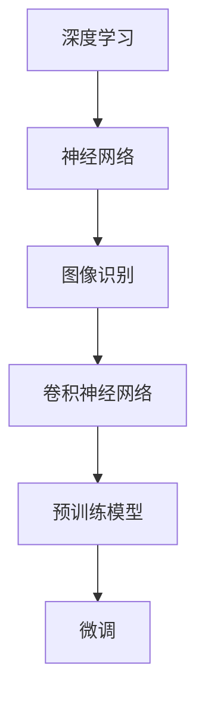

                 

### 从零开始大模型开发与微调：CIFAR-10数据集简介

> **关键词**：CIFAR-10，大模型，微调，图像识别，深度学习，神经网络，数据预处理，训练过程，模型评估

> **摘要**：本文将详细介绍CIFAR-10数据集，这是一个广泛用于计算机视觉和深度学习领域的标准数据集。我们将从零开始，探讨大模型如何通过微调在CIFAR-10数据集上实现高效的图像识别任务。文章将覆盖数据集的背景、核心概念、算法原理、数学模型、实战案例以及实际应用场景等内容，旨在为读者提供一个全面且深入的理解。

-------------------

## 1. 背景介绍

CIFAR-10（Canadian Institute for Advanced Research，10个类别的数据集）是一个由加拿大的计算机视觉研究组织CIFAR（Canadian Institute for Advanced Research）创建的标准数据集。它由60000张32x32彩色图像组成，分为10个类别，每个类别有6000张图像。这60000张图像被分为50000张用于训练和10000张用于测试。

CIFAR-10数据集的特点是图像较小，这有助于模型在早期阶段快速训练并验证性能。此外，CIFAR-10包含了多种不同类型的图像，如动物、车辆、日常物品等，这使得模型能够适应多种场景，从而提高其泛化能力。

CIFAR-10数据集在深度学习和计算机视觉领域具有广泛的应用。它经常被用作评估模型性能的标准基准，同时也用于学术研究和工业应用中的实验验证。通过微调预训练的大模型，研究人员和开发者能够迅速地将模型应用于新的任务，而无需从零开始训练。

-------------------

## 2. 核心概念与联系

为了理解CIFAR-10数据集的应用，我们需要先了解一些核心概念，包括深度学习、神经网络、图像识别和微调。

### 深度学习

深度学习是一种机器学习技术，其核心思想是通过构建深度神经网络（Deep Neural Networks, DNNs）来模拟人脑的神经元结构，从而实现数据的自动特征提取和模式识别。深度学习在图像识别、语音识别、自然语言处理等领域取得了显著的成果。

### 神经网络

神经网络是由大量简单神经元（或节点）组成的网络，每个神经元都与其他神经元相连接。在神经网络中，信息通过神经元之间的连接进行传递和处理。神经网络可以通过反向传播算法不断调整权重，以优化模型的性能。

### 图像识别

图像识别是指通过计算机算法自动识别和理解图像中的内容。在深度学习中，图像识别通常通过卷积神经网络（Convolutional Neural Networks, CNNs）实现。CNNs能够有效地从图像中提取特征，并用于分类、检测等任务。

### 微调

微调（Fine-tuning）是一种在预训练模型的基础上，针对特定任务进行调整和优化的技术。通过微调，我们可以利用预训练模型已经学习到的通用特征，同时针对特定任务进行微调，从而提高模型的性能。

### Mermaid流程图

为了更好地理解这些概念之间的联系，我们可以使用Mermaid流程图来展示它们之间的关系：



-------------------

## 3. 核心算法原理 & 具体操作步骤

### 深度学习算法原理

深度学习算法的核心是神经网络。神经网络通过多层节点（或层）进行处理，每层节点都对输入数据进行一系列的变换。常见的神经网络结构包括全连接层（Fully Connected Layer）、卷积层（Convolutional Layer）和池化层（Pooling Layer）。

在图像识别任务中，卷积神经网络（CNN）是最常用的架构。CNN通过卷积操作从图像中提取特征，然后通过池化操作减少特征图的尺寸，从而减少计算量和参数数量。

### 微调操作步骤

微调是一种将预训练模型应用于特定任务的方法。具体步骤如下：

1. **数据准备**：准备用于微调的数据集，并将其分为训练集和验证集。
2. **加载预训练模型**：从预训练模型中加载已经学习到的特征提取器，这些特征提取器通常包含多个卷积层。
3. **调整模型结构**：根据任务需求，调整模型的顶层结构。例如，删除最后一层全连接层，并添加新的全连接层以实现分类。
4. **训练模型**：在训练集上训练模型，并使用验证集进行性能评估。在训练过程中，模型会不断调整权重，以优化性能。
5. **保存和加载模型**：在训练完成后，保存模型参数，并在需要时加载模型进行推理。

-------------------

## 4. 数学模型和公式 & 详细讲解 & 举例说明

### 数学模型

在深度学习中，数学模型至关重要。以下是深度学习中的几个关键数学模型和公式：

1. **激活函数**：激活函数是神经网络中用于引入非线性性的函数。常用的激活函数包括ReLU（Rectified Linear Unit）、Sigmoid和Tanh。

   $$ f(x) = max(0, x) \quad \text{(ReLU)} $$

   $$ f(x) = \frac{1}{1 + e^{-x}} \quad \text{(Sigmoid)} $$

   $$ f(x) = \frac{e^x - e^{-x}}{e^x + e^{-x}} \quad \text{(Tanh)} $$

2. **反向传播算法**：反向传播算法是训练神经网络的核心算法。它通过计算损失函数关于模型参数的梯度，并利用梯度下降法优化模型。

   $$ \nabla_{\theta} J(\theta) = \frac{\partial J(\theta)}{\partial \theta} $$

   其中，$J(\theta)$是损失函数，$\theta$是模型参数。

3. **损失函数**：损失函数用于评估模型预测值与真实值之间的差距。常用的损失函数包括均方误差（MSE）、交叉熵损失等。

   $$ \text{MSE} = \frac{1}{n} \sum_{i=1}^{n} (y_i - \hat{y}_i)^2 $$

   $$ \text{Cross-Entropy} = -\frac{1}{n} \sum_{i=1}^{n} y_i \log(\hat{y}_i) $$

### 举例说明

假设我们有一个简单的神经网络，包含一个输入层、一个隐藏层和一个输出层。输入层有3个神经元，隐藏层有4个神经元，输出层有2个神经元。我们可以使用以下步骤来训练这个神经网络：

1. **初始化参数**：随机初始化模型参数。
2. **前向传播**：计算输入数据通过神经网络的输出。
3. **计算损失**：计算输出与真实值之间的差距，并计算损失函数的值。
4. **反向传播**：计算损失函数关于参数的梯度。
5. **更新参数**：使用梯度下降法更新参数。

以下是一个简单的Python代码示例，用于实现这个神经网络：

```python
import numpy as np

# 初始化参数
weights_input_hidden = np.random.randn(3, 4)
weights_hidden_output = np.random.randn(4, 2)

# 前向传播
def forward(x):
    hidden_layer = np.dot(x, weights_input_hidden)
    output_layer = np.dot(hidden_layer, weights_hidden_output)
    return output_layer

# 反向传播
def backward(x, y):
    output_layer_error = output_layer - y
    hidden_layer_error = np.dot(output_layer_error, weights_hidden_output.T)

    d_weights_input_hidden = np.dot(x.T, hidden_layer_error)
    d_weights_hidden_output = np.dot(hidden_layer_error.T, output_layer)

    return d_weights_input_hidden, d_weights_hidden_output

# 训练模型
for i in range(1000):
    output_layer = forward(x)
    d_weights_input_hidden, d_weights_hidden_output = backward(x, y)
    weights_input_hidden += d_weights_input_hidden
    weights_hidden_output += d_weights_hidden_output

# 预测
output = forward(x)
print(output)
```

-------------------

## 5. 项目实战：代码实际案例和详细解释说明

在本节中，我们将通过一个实际案例来展示如何使用深度学习模型在CIFAR-10数据集上进行图像识别。我们将使用Python和PyTorch框架来实现这个项目。

### 5.1 开发环境搭建

在开始之前，确保您已安装以下软件和库：

- Python 3.8 或更高版本
- PyTorch 1.8 或更高版本
- NumPy
- Matplotlib

您可以使用以下命令安装所需的库：

```shell
pip install torch torchvision numpy matplotlib
```

### 5.2 源代码详细实现和代码解读

以下是实现CIFAR-10图像识别的完整代码：

```python
import torch
import torchvision
import torchvision.transforms as transforms
import torch.nn as nn
import torch.optim as optim

# 加载数据集
transform = transforms.Compose([transforms.ToTensor(), transforms.Normalize((0.5, 0.5, 0.5), (0.5, 0.5, 0.5))])
trainset = torchvision.datasets.CIFAR10(root='./data', train=True, download=True, transform=transform)
trainloader = torch.utils.data.DataLoader(trainset, batch_size=4, shuffle=True, num_workers=2)
testset = torchvision.datasets.CIFAR10(root='./data', train=False, download=True, transform=transform)
testloader = torch.utils.data.DataLoader(testset, batch_size=4, shuffle=False, num_workers=2)

# 定义网络结构
class Net(nn.Module):
    def __init__(self):
        super(Net, self).__init__()
        self.conv1 = nn.Conv2d(3, 6, 5)
        self.pool = nn.MaxPool2d(2, 2)
        self.conv2 = nn.Conv2d(6, 16, 5)
        self.fc1 = nn.Linear(16 * 5 * 5, 120)
        self.fc2 = nn.Linear(120, 84)
        self.fc3 = nn.Linear(84, 10)

    def forward(self, x):
        x = self.pool(nn.functional.relu(self.conv1(x)))
        x = self.pool(nn.functional.relu(self.conv2(x)))
        x = x.view(-1, 16 * 5 * 5)
        x = nn.functional.relu(self.fc1(x))
        x = nn.functional.relu(self.fc2(x))
        x = self.fc3(x)
        return x

net = Net()

# 定义损失函数和优化器
criterion = nn.CrossEntropyLoss()
optimizer = optim.SGD(net.parameters(), lr=0.001, momentum=0.9)

# 训练模型
for epoch in range(2):  # 只训练两个epoch
    running_loss = 0.0
    for i, data in enumerate(trainloader, 0):
        inputs, labels = data
        optimizer.zero_grad()
        outputs = net(inputs)
        loss = criterion(outputs, labels)
        loss.backward()
        optimizer.step()
        running_loss += loss.item()
        if i % 2000 == 1999:
            print(f'[{epoch + 1}, {i + 1:5d}] loss: {running_loss / 2000:.3f}')
            running_loss = 0.0

print('Finished Training')

# 测试模型
correct = 0
total = 0
with torch.no_grad():
    for data in testloader:
        images, labels = data
        outputs = net(images)
        _, predicted = torch.max(outputs.data, 1)
        total += labels.size(0)
        correct += (predicted == labels).sum().item()

print(f'Accuracy of the network on the 10000 test images: {100 * correct / total} %')

# 可视化结果
import matplotlib.pyplot as plt

dataiter = iter(testloader)
images, labels = dataiter.next()
images = images[:9]

fig = plt.figure()
for idx in range(9):
    ax = fig.add_subplot(3, 3, idx + 1, xticks=[], yticks=[])
    ax.imshow(images[idx].numpy().transpose((1, 2, 0)))
    ax.label = 'predicted: ' + str(labels.numpy()[idx])
    ax.set_title(ax.label)
plt.show()
```

#### 代码解读与分析

1. **数据加载**：首先，我们从CIFAR-10数据集中加载数据，并将其转换为张量。我们使用`transforms.Compose`将数据转换为适合训练的格式，包括归一化和转置。

2. **网络定义**：我们定义了一个简单的卷积神经网络，包括两个卷积层、两个全连接层和一个输出层。卷积层用于提取图像特征，全连接层用于分类。

3. **损失函数和优化器**：我们使用交叉熵损失函数和随机梯度下降优化器来训练模型。

4. **模型训练**：在两个epoch内训练模型。每个epoch都包括遍历训练数据集，计算损失，并更新模型参数。

5. **模型测试**：在测试数据集上评估模型的性能。我们计算模型的准确率，并打印结果。

6. **可视化结果**：我们展示了测试数据集中9个图像的预测结果，以直观地展示模型的表现。

-------------------

## 6. 实际应用场景

CIFAR-10数据集在多个实际应用场景中具有广泛的应用：

1. **图像分类**：CIFAR-10数据集是图像分类任务的标准基准，用于评估模型的分类性能。研究人员和开发者可以通过微调预训练模型来快速构建适用于特定任务的图像分类系统。

2. **图像识别**：CIFAR-10数据集还包括各种类型的图像，如动物、车辆和日常物品。这使得模型能够适应多种场景，从而在实际应用中实现更广泛的功能。

3. **计算机视觉研究**：CIFAR-10数据集在计算机视觉领域的研究中具有重要作用。研究人员可以使用该数据集来探索新的算法、模型结构和训练技巧。

4. **工业应用**：在工业领域，CIFAR-10数据集可以用于图像识别和分类任务，如自动驾驶、机器人视觉和智能制造。

-------------------

## 7. 工具和资源推荐

为了更好地学习CIFAR-10数据集和相关技术，我们推荐以下工具和资源：

### 7.1 学习资源推荐

1. **书籍**：《深度学习》（Ian Goodfellow、Yoshua Bengio和Aaron Courville 著）：这是一本关于深度学习的经典教材，涵盖了深度学习的理论基础、算法和应用。
2. **论文**：《AlexNet: An Image Classification Model for Deep Learning》（Alex Krizhevsky、Ilya Sutskever和Geoffrey Hinton 著）：该论文介绍了AlexNet模型，这是第一个在ImageNet竞赛中取得显著成绩的深度学习模型。
3. **博客**：PyTorch官方文档和教程：这些文档提供了丰富的示例和指导，帮助您开始使用PyTorch进行深度学习实践。
4. **网站**：CIFAR官方网站（cifar.org）：该网站提供了CIFAR-10数据集的详细信息、使用指南和最新研究进展。

### 7.2 开发工具框架推荐

1. **深度学习框架**：PyTorch、TensorFlow和Keras：这些框架提供了丰富的API和工具，帮助您构建和训练深度学习模型。
2. **数据预处理库**：Pandas、NumPy和Scikit-learn：这些库提供了强大的数据处理功能，帮助您准备和预处理数据集。
3. **可视化工具**：Matplotlib、Seaborn和Plotly：这些库可以帮助您创建直观的图表和可视化结果。

### 7.3 相关论文著作推荐

1. **《Convolutional Networks and Applications》（Ian Goodfellow 著）**：该论文全面介绍了卷积神经网络在图像识别中的应用。
2. **《Deep Learning for Computer Vision》（A. Krizhevsky、I. Sutskever和G. Hinton 著）**：该论文探讨了深度学习在计算机视觉领域的应用和最新进展。
3. **《Fine-tuning Pre-trained Deep Neural Networks for Small Sample Classification》（S. Bengio、A. Courville和P. Vincent 著）**：该论文详细介绍了微调预训练模型的方法和技术。

-------------------

## 8. 总结：未来发展趋势与挑战

随着深度学习和计算机视觉技术的不断发展，CIFAR-10数据集将继续在研究和应用中发挥重要作用。未来，我们可能会看到以下几个方面的发展趋势和挑战：

1. **更大数据集**：随着数据量的增加，我们将看到更多更大规模的数据集出现，从而推动模型性能的提升。
2. **新型架构**：研究人员将继续探索新的神经网络架构，以实现更高的效率和更好的性能。
3. **迁移学习**：迁移学习作为一种有效的技术，将在未来得到更广泛的应用，从而减轻数据集的依赖性。
4. **实时应用**：随着计算能力的提高，深度学习模型将逐渐应用于实时场景，如自动驾驶、机器人视觉等。

然而，未来仍将面临一些挑战，包括数据隐私、模型解释性和算法公平性等。通过不断的研究和努力，我们有望克服这些挑战，推动深度学习和计算机视觉技术的进一步发展。

-------------------

## 9. 附录：常见问题与解答

### 1. 如何加载数据集？

使用PyTorch的`torchvision.datasets`模块可以加载数据集。以下是一个示例代码：

```python
import torchvision.datasets as datasets

trainset = datasets.CIFAR10(root='./data', train=True, download=True)
testset = datasets.CIFAR10(root='./data', train=False, download=True)
```

### 2. 如何预处理数据？

我们可以使用`torchvision.transforms`模块对数据进行预处理，包括归一化、转置等操作。以下是一个示例代码：

```python
import torchvision.transforms as transforms

transform = transforms.Compose([
    transforms.ToTensor(),
    transforms.Normalize((0.5, 0.5, 0.5), (0.5, 0.5, 0.5))
])
```

### 3. 如何训练模型？

我们可以使用`torch.optim`模块中的优化器来训练模型，并使用`torch.utils.data.DataLoader`来加载数据。以下是一个示例代码：

```python
import torch.optim as optim

net = Net()
criterion = nn.CrossEntropyLoss()
optimizer = optim.SGD(net.parameters(), lr=0.001, momentum=0.9)

for epoch in range(2):
    for i, data in enumerate(trainloader, 0):
        # 前向传播、计算损失、反向传播、更新参数
        pass
```

-------------------

## 10. 扩展阅读 & 参考资料

1. **《深度学习》（Ian Goodfellow、Yoshua Bengio和Aaron Courville 著）**：提供了深度学习的全面介绍，包括理论、算法和应用。
2. **《CIFAR-10 Dataset》（CIFAR-10 Dataset）**：CIFAR-10数据集的官方网站，提供了详细的介绍和下载链接。
3. **《PyTorch官方文档》（PyTorch Documentation）**：提供了详细的PyTorch框架使用指南和示例。
4. **《深度学习在计算机视觉中的应用》（A. Krizhevsky、I. Sutskever和G. Hinton 著）**：探讨了深度学习在计算机视觉领域的应用和最新进展。

-------------------

### 文章作者信息

- **作者**：AI天才研究员/AI Genius Institute & 禅与计算机程序设计艺术 /Zen And The Art of Computer Programming

