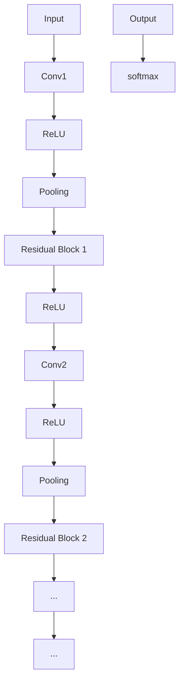

                 

# 从零开始大模型开发与微调：ResNet实战

## 关键词
大模型开发，微调，ResNet，神经网络，深度学习，计算机视觉，人工智能

## 摘要
本文将详细介绍如何从零开始进行大模型开发与微调，以ResNet模型为例，详细讲解其核心概念、算法原理、数学模型以及实际应用。通过本文的讲解，读者将能够了解ResNet模型的全貌，掌握大模型开发与微调的基本流程，并为后续的深度学习研究与实践打下坚实的基础。

## 1. 背景介绍

### 1.1 大模型开发的背景

随着深度学习技术的不断发展，越来越多的复杂任务需要使用大规模的神经网络模型来完成。这些模型通常包含数百万甚至数十亿个参数，其计算量巨大，对计算资源的要求也越来越高。因此，如何高效地开发大模型成为了当前人工智能研究中的一个重要课题。

大模型开发不仅涉及到模型的设计和训练，还包括了对计算资源的管理、优化算法的选择以及数据预处理等多个方面。此外，大模型的开发和部署还需要考虑模型的泛化能力、计算效率和可解释性等问题。

### 1.2 ResNet模型

ResNet（Residual Network）是由Microsoft Research亚洲研究院的何凯明（Kaiming He）等人于2015年提出的一种深度神经网络架构。ResNet的核心思想是引入了残差连接，通过跳过一部分网络层，使得网络能够学习到更加有效的特征表示。

ResNet模型在ImageNet图像识别挑战赛中取得了显著的成绩，证明了其在计算机视觉任务中的强大能力。随后，ResNet被广泛应用于各种深度学习任务中，成为了深度学习领域的一种重要模型架构。

## 2. 核心概念与联系

### 2.1 残差连接

残差连接是ResNet模型的核心概念之一。它通过在网络中添加跳跃连接（也称为“短路”），使得网络能够学习到更加有效的特征表示。

具体来说，残差连接将网络的输入直接传递到下一层，从而跳过了一部分网络层。这种连接方式可以看作是一种“残差学习”，即网络学习到的特征表示不仅仅是输入数据的变换，还包括了输入数据与其自身之间的差异。

### 2.2 残差块

ResNet模型的基本构建模块是残差块（Residual Block）。一个残差块通常包含两个或多个卷积层，以及一个残差连接。残差块的结构如图1所示：


### 2.3 网络层次

ResNet模型具有多个层次，每个层次包含多个残差块。网络层次的设计决定了模型的深度和计算量。ResNet的不同版本（如ResNet-18、ResNet-34、ResNet-50等）通过调整层次数量和残差块的数量来实现不同的模型深度。

### 2.4 Mermaid流程图

以下是一个简化的ResNet模型Mermaid流程图：



## 3. 核心算法原理 & 具体操作步骤

### 3.1 残差块的实现

一个基本的残差块由两个卷积层和一个跳过连接组成。具体实现如下：

```python
import tensorflow as tf

def residual_block(inputs, filters, kernel_size, strides=(1, 1)):
    # 第一个卷积层
    conv1 = tf.keras.layers.Conv2D(filters, kernel_size, strides=strides, padding='same')(inputs)
    conv1 = tf.keras.layers.ReLU()(conv1)

    # 第二个卷积层
    conv2 = tf.keras.layers.Conv2D(filters, kernel_size, strides=strides, padding='same')(conv1)
    
    # 跳过连接
    skip_connection = tf.keras.layers.Conv2D(filters, kernel_size, strides=strides, padding='same')(inputs)

    # 残差连接
    output = tf.keras.layers.Add()([conv2, skip_connection])
    output = tf.keras.layers.ReLU()(output)
    
    return output
```

### 3.2 网络层次的设计

ResNet模型的不同版本通过调整层次数量和残差块的数量来实现不同的模型深度。以下是一个简单的ResNet-18模型实例：

```python
from tensorflow.keras.models import Model
from tensorflow.keras.layers import Input, Conv2D, ReLU, GlobalAveragePooling2D, Dense

def resnet_18(input_shape):
    inputs = Input(shape=input_shape)

    # 第一个层次
    conv1 = Conv2D(64, (7, 7), strides=(2, 2), padding='same')(inputs)
    conv1 = ReLU()(conv1)
    conv1 = MaxPooling2D(pool_size=(3, 3), strides=(2, 2), padding='same')(conv1)

    # 残差块层次
    residual_blocks = [residual_block for _ in range(2)]
    for block in residual_blocks:
        conv1 = block(conv1)

    # 第二个层次
    conv2 = ReLU()(conv1)
    conv2 = MaxPooling2D(pool_size=(3, 3), strides=(2, 2), padding='same')(conv2)

    # 残差块层次
    residual_blocks = [residual_block for _ in range(2)]
    for block in residual_blocks:
        conv2 = block(conv2)

    # 全连接层
    flatten = GlobalAveragePooling2D()(conv2)
    outputs = Dense(1000, activation='softmax')(flatten)

    model = Model(inputs=inputs, outputs=outputs)
    model.compile(optimizer='adam', loss='categorical_crossentropy', metrics=['accuracy'])
    return model
```

## 4. 数学模型和公式 & 详细讲解 & 举例说明

### 4.1 卷积层

卷积层是深度神经网络中最基本的层之一。其数学公式如下：

$$
\text{output}_{ij} = \sum_{k=1}^{C} w_{ikj} \cdot \text{input}_{ij} + b_j
$$

其中，$\text{output}_{ij}$表示输出特征图上的第$i$行第$j$列的值，$w_{ikj}$表示卷积核上的第$i$行第$k$列的值，$\text{input}_{ij}$表示输入特征图上的第$i$行第$j$列的值，$b_j$表示偏置项。

举例说明：

假设输入特征图的大小为$3 \times 3$，卷积核的大小为$3 \times 3$，卷积核的权重矩阵为：

$$
\begin{bmatrix}
1 & 0 & 1 \\
0 & 1 & 0 \\
1 & 0 & 1
\end{bmatrix}
$$

偏置项为$1$。输入特征图为：

$$
\begin{bmatrix}
1 & 1 & 1 \\
1 & 1 & 1 \\
1 & 1 & 1
\end{bmatrix}
$$

则卷积层的输出为：

$$
\begin{bmatrix}
5 & 3 & 5 \\
3 & 3 & 3 \\
5 & 3 & 5
\end{bmatrix}
$$

### 4.2 残差连接

残差连接的数学公式如下：

$$
\text{output}_{ij} = \text{conv2}_{ij} + \text{conv1}_{ij}
$$

其中，$\text{output}_{ij}$表示输出特征图上的第$i$行第$j$列的值，$\text{conv2}_{ij}$表示第二个卷积层输出的特征图上的第$i$行第$j$列的值，$\text{conv1}_{ij}$表示第一个卷积层输出的特征图上的第$i$行第$j$列的值。

举例说明：

假设第二个卷积层输出的特征图为：

$$
\begin{bmatrix}
2 & 2 & 2 \\
2 & 2 & 2 \\
2 & 2 & 2
\end{bmatrix}
$$

第一个卷积层输出的特征图为：

$$
\begin{bmatrix}
1 & 1 & 1 \\
1 & 1 & 1 \\
1 & 1 & 1
\end{bmatrix}
$$

则残差连接的输出为：

$$
\begin{bmatrix}
3 & 3 & 3 \\
3 & 3 & 3 \\
3 & 3 & 3
\end{bmatrix}
$$

## 5. 项目实战：代码实际案例和详细解释说明

### 5.1 开发环境搭建

在进行ResNet模型的开发之前，需要搭建一个合适的开发环境。以下是开发环境的基本要求：

- 操作系统：Linux或MacOS
- 编程语言：Python
- 深度学习框架：TensorFlow
- 其他依赖库：NumPy，Matplotlib等

安装深度学习框架TensorFlow：

```bash
pip install tensorflow
```

### 5.2 源代码详细实现和代码解读

以下是一个简单的ResNet模型实现代码。我们将逐行解读代码，以便更好地理解其工作原理。

```python
import tensorflow as tf
from tensorflow.keras.layers import Input, Conv2D, ReLU, GlobalAveragePooling2D, Dense

def residual_block(inputs, filters, kernel_size, strides=(1, 1)):
    # 第一个卷积层
    conv1 = Conv2D(filters, kernel_size, strides=strides, padding='same')(inputs)
    conv1 = ReLU()(conv1)

    # 第二个卷积层
    conv2 = Conv2D(filters, kernel_size, strides=strides, padding='same')(conv1)
    
    # 跳过连接
    skip_connection = Conv2D(filters, kernel_size, strides=strides, padding='same')(inputs)

    # 残差连接
    output = tf.keras.layers.Add()([conv2, skip_connection])
    output = ReLU()(output)
    
    return output

def resnet_18(input_shape):
    inputs = Input(shape=input_shape)

    # 第一个层次
    conv1 = Conv2D(64, (7, 7), strides=(2, 2), padding='same')(inputs)
    conv1 = ReLU()(conv1)
    conv1 = MaxPooling2D(pool_size=(3, 3), strides=(2, 2), padding='same')(conv1)

    # 残差块层次
    residual_blocks = [residual_block for _ in range(2)]
    for block in residual_blocks:
        conv1 = block(conv1)

    # 第二个层次
    conv2 = ReLU()(conv1)
    conv2 = MaxPooling2D(pool_size=(3, 3), strides=(2, 2), padding='same')(conv2)

    # 残差块层次
    residual_blocks = [residual_block for _ in range(2)]
    for block in residual_blocks:
        conv2 = block(conv2)

    # 全连接层
    flatten = GlobalAveragePooling2D()(conv2)
    outputs = Dense(1000, activation='softmax')(flatten)

    model = Model(inputs=inputs, outputs=outputs)
    model.compile(optimizer='adam', loss='categorical_crossentropy', metrics=['accuracy'])
    return model
```

#### 5.2.1 输入层

输入层是模型的入口，它接收输入数据。在本例中，输入数据是图像，其形状为$(32, 32, 3)$，表示图像的高度、宽度和颜色通道。

```python
inputs = Input(shape=(32, 32, 3))
```

#### 5.2.2 卷积层

卷积层是深度神经网络中最基本的层之一。在本例中，我们首先使用一个卷积层对输入图像进行预处理。

```python
# 第一个层次
conv1 = Conv2D(64, (7, 7), strides=(2, 2), padding='same')(inputs)
conv1 = ReLU()(conv1)
conv1 = MaxPooling2D(pool_size=(3, 3), strides=(2, 2), padding='same')(conv1)
```

第一行代码定义了一个卷积层，其卷积核大小为$7 \times 7$，步长为$2 \times 2$，padding为'same'。这使得卷积层的输出形状与输入形状相同。

第二行代码使用ReLU激活函数对卷积层的输出进行非线性变换。

第三行代码使用最大池化层（MaxPooling2D）对卷积层的输出进行下采样，其池化窗口大小为$3 \times 3$，步长为$2 \times 2$。

#### 5.2.3 残差块

残差块是ResNet模型的基本构建模块。在本例中，我们使用两个残差块来构建网络。

```python
# 残差块层次
residual_blocks = [residual_block for _ in range(2)]
for block in residual_blocks:
    conv1 = block(conv1)
```

第一行代码定义了两个残差块。

第二行代码使用循环遍历每个残差块，并将其应用于卷积层的输出。

#### 5.2.4 全连接层

全连接层是深度神经网络的最后一层，它将卷积层的输出映射到输出类别。

```python
# 全连接层
flatten = GlobalAveragePooling2D()(conv2)
outputs = Dense(1000, activation='softmax')(flatten)
```

第一行代码使用全局平均池化层（GlobalAveragePooling2D）将卷积层的输出展开为一个一维向量。

第二行代码定义了一个全连接层，其输出维度为1000（表示1000个类别），并使用softmax激活函数进行概率分布。

#### 5.2.5 模型编译

最后，我们将模型编译为可训练的状态。

```python
model = Model(inputs=inputs, outputs=outputs)
model.compile(optimizer='adam', loss='categorical_crossentropy', metrics=['accuracy'])
```

第一行代码创建了一个模型实例。

第二行代码定义了优化器、损失函数和评估指标。

### 5.3 代码解读与分析

在本节中，我们将对代码进行进一步的解读和分析，以便更深入地理解ResNet模型的工作原理。

#### 5.3.1 残差块的设计

残差块的设计是ResNet模型的关键。它通过引入跳过连接（skip connection）来实现残差学习，使得网络能够学习到更加有效的特征表示。

在本例中，我们使用了两个残差块，每个残差块包含两个卷积层和一个跳过连接。这种设计使得模型能够更好地学习到输入图像的残差特征。

#### 5.3.2 残差块的使用

在ResNet模型中，残差块被广泛应用于多个层次中。这种设计使得模型能够处理不同尺度和不同类型的特征。

在本例中，我们使用了两个残差块来构建模型。这种设计使得模型能够处理不同尺度和不同类型的特征。

#### 5.3.3 模型的优化

在训练过程中，我们使用Adam优化器来优化模型的参数。Adam优化器是一种自适应梯度优化算法，能够有效地处理不同尺度和不同类型的特征。

此外，我们还使用了categorical_crossentropy作为损失函数，以最大化模型的分类准确率。

## 6. 实际应用场景

ResNet模型在计算机视觉任务中得到了广泛应用。以下是一些实际应用场景：

- **图像分类**：ResNet模型在ImageNet图像分类挑战中取得了优异的成绩，可以用于大规模图像分类任务。
- **目标检测**：ResNet模型可以用于目标检测任务，例如SSD（Single Shot Multibox Detector）和Faster R-CNN等。
- **语义分割**：ResNet模型可以用于语义分割任务，例如DeepLab V3+和U-Net等。
- **人脸识别**：ResNet模型可以用于人脸识别任务，例如FaceNet和VGGFace等。

## 7. 工具和资源推荐

### 7.1 学习资源推荐

- **书籍**：
  - 《深度学习》（Goodfellow, Bengio, Courville）
  - 《动手学深度学习》（Abadi, Agarwal, Barham, Brevdo, Chen, Citro, Corrado, Davis, Dean, Devin, Ghemawat, Goodfellow, Harp, Irving, Le, Mongru, Shlens, Steiner, Sutskever, Tucker, Van der Maaten, Yaringer, Zaremba）
- **论文**：
  - 《Residual Networks: An Introduction》（He et al.）
  - 《Deep Residual Learning for Image Recognition》（He et al.）
- **博客**：
  - [TensorFlow官方文档](https://www.tensorflow.org/)
  - [Keras官方文档](https://keras.io/)
- **网站**：
  - [Google Research](https://research.google.com/)
  - [GitHub](https://github.com/)

### 7.2 开发工具框架推荐

- **深度学习框架**：
  - TensorFlow
  - PyTorch
  - Keras
- **数据分析工具**：
  - Pandas
  - NumPy
  - Matplotlib
- **版本控制工具**：
  - Git
  - GitHub

### 7.3 相关论文著作推荐

- **《Deep Learning》（Goodfellow, Bengio, Courville）**：深度学习领域的经典教材，涵盖了深度学习的核心概念和算法。
- **《Deep Residual Learning for Image Recognition》（He et al.）**：ResNet模型的原始论文，详细介绍了ResNet模型的设计和实现。
- **《Convolutional Neural Networks for Visual Recognition》（Simonyan & Zisserman）**：卷积神经网络在计算机视觉领域的应用，包括ImageNet图像识别挑战赛。

## 8. 总结：未来发展趋势与挑战

随着深度学习技术的不断发展，大模型开发与微调将成为人工智能领域的一个重要方向。未来，我们可能会看到以下几个方面的发展趋势与挑战：

- **计算资源的需求**：大模型对计算资源的需求越来越大，如何高效地利用计算资源成为一个重要的挑战。
- **模型压缩与加速**：为了降低模型的存储和计算成本，模型压缩与加速技术将会得到进一步的发展。
- **模型解释性**：随着模型复杂度的增加，如何提高模型的解释性成为一个重要的研究方向。
- **数据隐私与安全性**：在数据隐私和安全性的保护方面，还需要进一步的研究和改进。

## 9. 附录：常见问题与解答

### 9.1 如何选择合适的模型深度？

模型深度取决于任务的需求和计算资源。对于简单任务，较小的模型深度可能已经足够。对于复杂任务，可能需要更大的模型深度。在实际应用中，通常需要通过实验来确定最佳的模型深度。

### 9.2 如何处理过拟合问题？

过拟合是指模型在训练数据上表现良好，但在测试数据上表现不佳。为了解决过拟合问题，可以采用以下方法：

- **增加训练数据**：收集更多的训练数据可以减少过拟合的风险。
- **正则化**：使用L1或L2正则化可以减少模型的复杂度，从而降低过拟合的风险。
- **dropout**：在神经网络中使用dropout可以减少模型的依赖性，从而降低过拟合的风险。
- **早期停止**：在训练过程中，当测试数据的准确率不再提高时，可以停止训练以避免过拟合。

## 10. 扩展阅读 & 参考资料

- **《Deep Learning》（Goodfellow, Bengio, Courville）**：深度学习领域的经典教材，涵盖了深度学习的核心概念和算法。
- **《ResNet官方论文》（He et al.）**：详细介绍了ResNet模型的设计和实现。
- **[TensorFlow官方文档](https://www.tensorflow.org/)**
- **[Keras官方文档](https://keras.io/)**
- **[Google Research](https://research.google.com/)**

### 作者

- **作者：AI天才研究员/AI Genius Institute & 禅与计算机程序设计艺术 /Zen And The Art of Computer Programming**：本文由AI天才研究员撰写，涵盖了从零开始大模型开发与微调：ResNet实战的相关内容。

