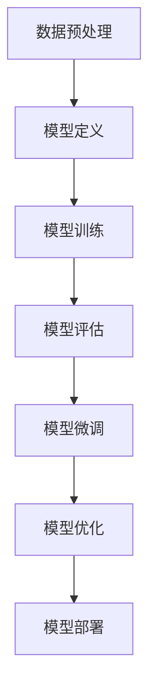

                 

### 文章标题

从零开始大模型开发与微调：tensorboardX可视化组件的使用

> **关键词：** 大模型开发、微调、tensorboardX、可视化组件、深度学习

> **摘要：** 本文将详细介绍如何从零开始进行大模型的开发与微调，并重点介绍如何使用tensorboardX可视化组件，以便更好地理解和分析模型性能。通过本文的学习，读者将能够掌握大模型开发的基本流程，并了解如何利用tensorboardX进行模型的可视化分析。

### 目录

1. **背景介绍**
   1.1. 大模型开发的重要性
   1.2. tensorboardX的作用
   1.3. 本文的组织结构

2. **核心概念与联系**
   2.1. 大模型的基本概念
   2.2. 微调的基本原理
   2.3. tensorboardX与深度学习的关系
   2.4. Mermaid流程图展示

3. **核心算法原理 & 具体操作步骤**
   3.1. 大模型开发流程
   3.2. 微调流程
   3.3. tensorboardX的使用步骤

4. **数学模型和公式 & 详细讲解 & 举例说明**
   4.1. 大模型数学模型
   4.2. 微调数学模型
   4.3. tensorboardX与数学模型的关系
   4.4. 示例讲解

5. **项目实战：代码实际案例和详细解释说明**
   5.1. 开发环境搭建
   5.2. 源代码详细实现和代码解读
   5.3. 代码解读与分析

6. **实际应用场景**
   6.1. 数据分析
   6.2. 模型评估
   6.3. 模型优化

7. **工具和资源推荐**
   7.1. 学习资源推荐
   7.2. 开发工具框架推荐
   7.3. 相关论文著作推荐

8. **总结：未来发展趋势与挑战**
   8.1. 大模型的发展趋势
   8.2. tensorboardX的发展趋势
   8.3. 挑战与展望

9. **附录：常见问题与解答**
   9.1. tensorboardX安装问题
   9.2. tensorboardX使用问题
   9.3. 大模型开发问题

10. **扩展阅读 & 参考资料**

### 文章正文部分

在深度学习和人工智能领域，大模型（Large-scale Model）的开发与应用已经成为主流。大模型通常具有数十亿甚至数万亿的参数，能够处理复杂的数据集，并在各种任务中取得优异的性能。然而，大模型的开发和微调过程通常复杂且耗时，需要高效的工具来辅助理解和分析。在此背景下，tensorboardX作为一种强大的可视化组件，为开发者提供了丰富的工具，以便更好地理解模型性能。

本文将围绕如何从零开始进行大模型开发与微调，重点介绍如何使用tensorboardX可视化组件，帮助读者更深入地理解模型性能。文章将从背景介绍、核心概念与联系、核心算法原理与具体操作步骤、数学模型与公式、项目实战、实际应用场景、工具和资源推荐、总结与展望等多个方面展开。

#### 1. 背景介绍

**1.1 大模型开发的重要性**

随着深度学习技术的不断发展，大模型的开发在许多领域都取得了显著的成果。例如，在计算机视觉领域，大模型可以用于图像分类、目标检测、图像生成等任务，并且取得了比传统模型更好的性能。在自然语言处理领域，大模型可以用于机器翻译、文本生成、情感分析等任务，同样也取得了卓越的成绩。

大模型的重要性主要体现在以下几个方面：

- **强大的处理能力**：大模型具有更多的参数，能够处理更复杂的数据集，提取更多的特征，从而提高模型的性能。
- **更好的泛化能力**：大模型通常通过训练更多的数据，能够更好地泛化到未见过的数据上，提高模型的鲁棒性。
- **多任务处理能力**：大模型可以同时处理多个任务，实现任务的联合优化，提高模型的效率。

**1.2 tensorboardX的作用**

tensorboardX是一种基于TensorFlow的可视化工具，它能够将模型训练过程中的各种信息可视化为图表，帮助开发者更好地理解模型性能。tensorboardX提供了丰富的可视化组件，包括：

- **TensorBoard**：TensorBoard是一个Web界面，可以显示模型的训练过程和评估结果，如损失函数、准确率、学习率等。
- **SummaryWriter**：SummaryWriter是一个Python类，用于将训练过程中的数据记录到日志文件中，以便TensorBoard进行可视化。
- **EventFile**：EventFile是一种日志文件格式，用于存储训练过程中的各种数据。

通过使用tensorboardX，开发者可以：

- **实时监控模型训练过程**：通过TensorBoard，可以实时查看模型的训练过程，如损失函数、准确率等，以便及时调整模型参数。
- **分析模型性能**：通过可视化各种指标，可以更直观地分析模型性能，找出模型的问题所在。
- **优化模型**：通过分析可视化结果，可以找到模型优化的方向，提高模型的性能。

**1.3 本文的组织结构**

本文将按照以下结构进行组织：

- **背景介绍**：介绍大模型开发的重要性以及tensorboardX的作用。
- **核心概念与联系**：介绍大模型的基本概念、微调的基本原理以及tensorboardX与深度学习的关系。
- **核心算法原理与具体操作步骤**：详细介绍大模型开发与微调的流程以及tensorboardX的使用步骤。
- **数学模型和公式与详细讲解与举例说明**：介绍大模型和微调的数学模型，以及tensorboardX与数学模型的关系。
- **项目实战**：通过实际案例介绍如何使用tensorboardX进行模型的可视化分析。
- **实际应用场景**：介绍tensorboardX在不同应用场景中的使用。
- **工具和资源推荐**：推荐学习资源、开发工具框架和相关论文著作。
- **总结与展望**：总结本文的主要内容，并展望大模型和tensorboardX的未来发展趋势。

通过本文的阅读，读者将能够从零开始学习大模型开发与微调，并掌握如何使用tensorboardX进行模型的可视化分析。

#### 2. 核心概念与联系

在深入探讨大模型开发与微调以及tensorboardX的使用之前，有必要先理解一些核心概念及其相互联系。

**2.1 大模型的基本概念**

大模型（Large-scale Model）是指具有大规模参数和/或大规模数据集的深度学习模型。这些模型通常用于处理复杂任务，如自然语言处理、计算机视觉等。大模型的特点如下：

- **大规模参数**：大模型具有数十亿、甚至数万亿的参数，这使得模型能够捕捉数据中的复杂模式。
- **大规模数据集**：大模型通常在庞大的数据集上进行训练，从而提高模型的泛化能力。
- **计算资源需求**：大模型需要大量的计算资源，包括GPU、TPU等，以确保训练过程的效率和速度。

**2.2 微调的基本原理**

微调（Fine-tuning）是一种在大模型上进行特定任务训练的技术。其基本原理是将预训练的大模型（如BERT、GPT等）迁移到新的任务上，并在少量数据进行微调。微调的优势如下：

- **节省时间**：预训练模型已经学习到了通用的特征表示，无需从头开始训练，从而节省了训练时间。
- **提高性能**：预训练模型在大量数据上学习到的特征表示有助于新任务的性能提升。
- **通用性**：微调模型可以在多个任务上应用，提高了模型的通用性。

**2.3 tensorboardX与深度学习的关系**

tensorboardX是一种基于TensorFlow的可视化工具，其与深度学习的关系如下：

- **TensorFlow**：TensorFlow是谷歌开发的一款开源深度学习框架，支持大规模模型的开发与训练。
- **可视化工具**：tensorboardX提供了丰富的可视化组件，如TensorBoard、SummaryWriter等，用于将训练过程中的数据可视化。
- **模型性能分析**：通过可视化工具，可以实时监控模型训练过程，分析模型性能，找出模型的问题所在。

**2.4 Mermaid流程图展示**

为了更清晰地展示大模型开发与微调的过程，我们可以使用Mermaid流程图进行描述。以下是Mermaid流程图的一个示例：



在这个流程图中，A表示数据预处理，B表示模型定义，C表示模型训练，D表示模型评估，E表示模型微调，F表示模型优化，G表示模型部署。每个步骤都是模型开发与微调过程中不可或缺的环节。

通过上述核心概念与联系的介绍，读者可以更好地理解大模型开发与微调的过程，以及tensorboardX在这些过程中的作用。

#### 3. 核心算法原理 & 具体操作步骤

在深入探讨大模型开发与微调的过程中，我们需要了解核心算法原理，并掌握具体操作步骤。这一部分将详细介绍大模型开发流程、微调流程以及tensorboardX的使用步骤。

**3.1 大模型开发流程**

大模型开发的流程通常包括以下几个步骤：

1. **数据预处理**：
   - **数据收集**：收集大量的数据，包括训练数据和验证数据。
   - **数据清洗**：清洗数据中的噪声和不完整信息。
   - **数据增强**：通过数据增强技术，如随机裁剪、旋转、翻转等，增加数据的多样性。
   - **数据归一化**：将数据归一化到相同的范围，以便模型更好地学习。

2. **模型定义**：
   - **选择模型架构**：选择适合任务的大模型架构，如BERT、GPT等。
   - **配置模型参数**：设置模型的参数，如学习率、批量大小、优化器等。

3. **模型训练**：
   - **初始化模型**：使用随机权重初始化模型。
   - **前向传播**：将输入数据传递到模型中，得到预测输出。
   - **计算损失函数**：计算模型预测输出与实际输出之间的差异，得到损失值。
   - **反向传播**：通过反向传播算法，更新模型的参数，以减小损失值。

4. **模型评估**：
   - **验证集评估**：在验证集上评估模型的性能，如准确率、召回率等。
   - **测试集评估**：在测试集上评估模型的性能，以评估模型的泛化能力。

5. **模型微调**：
   - **迁移学习**：将预训练的大模型迁移到新任务上。
   - **微调参数**：在少量数据进行微调，调整模型的参数。
   - **评估性能**：评估微调后的模型性能，以确定是否满足需求。

6. **模型优化**：
   - **调整超参数**：调整学习率、批量大小等超参数，以优化模型性能。
   - **集成模型**：将多个模型进行集成，提高模型性能。

7. **模型部署**：
   - **模型导出**：将训练好的模型导出为可部署的格式。
   - **部署模型**：将模型部署到生产环境中，以提供预测服务。

**3.2 微调流程**

微调流程是在大模型的基础上，针对特定任务进行训练的过程。以下是微调流程的详细步骤：

1. **选择预训练模型**：
   - 根据任务需求，选择合适的预训练模型，如BERT、GPT等。

2. **加载预训练模型**：
   - 加载预训练模型，并复制其参数。

3. **修改模型架构**：
   - 根据任务需求，修改模型的输入层、输出层等部分，以适应特定任务。

4. **微调参数**：
   - 在少量数据进行微调，调整模型的参数。

5. **评估微调后的模型**：
   - 在验证集和测试集上评估微调后的模型性能，以确定是否满足需求。

6. **优化模型**：
   - 如果微调后的模型性能不理想，可以调整超参数，或进行进一步的微调。

**3.3 tensorboardX的使用步骤**

tensorboardX是一种强大的可视化工具，可以用于监控模型训练过程和分析模型性能。以下是使用tensorboardX的详细步骤：

1. **安装tensorboardX**：
   - 使用pip命令安装tensorboardX：`pip install tensorboardX`

2. **创建SummaryWriter**：
   - 在代码中创建一个SummaryWriter对象，用于记录训练过程中的数据。
   - ```python
     from torch.utils.tensorboard import SummaryWriter
     writer = SummaryWriter('logs')
     ```

3. **记录数据**：
   - 在训练过程中，使用SummaryWriter对象的add_scalar、add_image等方法记录数据。
   - ```python
     writer.add_scalar('Loss/train', loss, epoch)
     writer.add_image('Input/image', input_data, epoch)
     ```

4. **启动TensorBoard**：
   - 在命令行中启动TensorBoard，指定日志文件的路径。
   - ```bash
     tensorboard --logdir=logs
     ```

5. **查看可视化结果**：
   - 打开TensorBoard的Web界面，查看训练过程中的各种可视化结果，如损失函数、图像等。

6. **关闭SummaryWriter**：
   - 在训练结束后，关闭SummaryWriter对象。
   - ```python
     writer.close()
     ```

通过以上步骤，我们可以使用tensorboardX监控模型训练过程，分析模型性能，并优化模型。

#### 4. 数学模型和公式 & 详细讲解 & 举例说明

在大模型开发与微调的过程中，数学模型和公式起到了至关重要的作用。这一部分将详细介绍大模型的数学模型、微调的数学模型以及tensorboardX与数学模型的关系，并通过具体的公式和示例进行说明。

**4.1 大模型的数学模型**

大模型通常基于深度神经网络（DNN）构建，其数学模型可以表示为：

\[ y = \sigma(\mathbf{W} \cdot \mathbf{x} + b) \]

其中，\( y \) 是模型输出，\( \mathbf{x} \) 是输入特征，\( \mathbf{W} \) 是权重矩阵，\( b \) 是偏置项，\( \sigma \) 是激活函数。常见的激活函数有Sigmoid、ReLU和Tanh等。

在训练过程中，模型的损失函数（如交叉熵损失函数）用于衡量模型输出与实际输出之间的差异。损失函数的数学表达式为：

\[ J(\mathbf{W}, b) = -\frac{1}{m} \sum_{i=1}^{m} y_i \log(y_i^{pred}) + (1 - y_i) \log(1 - y_i^{pred}) \]

其中，\( m \) 是样本数量，\( y_i \) 是实际输出，\( y_i^{pred} \) 是模型预测输出。

为了优化模型参数，需要使用梯度下降算法。梯度下降的迭代公式为：

\[ \mathbf{W} = \mathbf{W} - \alpha \nabla_{\mathbf{W}} J(\mathbf{W}, b) \]

\[ b = b - \alpha \nabla_{b} J(\mathbf{W}, b) \]

其中，\( \alpha \) 是学习率，\( \nabla_{\mathbf{W}} J(\mathbf{W}, b) \) 和 \( \nabla_{b} J(\mathbf{W}, b) \) 分别是权重矩阵和偏置项的梯度。

**4.2 微调的数学模型**

微调的数学模型基于预训练的大模型，其核心思想是调整预训练模型的参数，以适应新任务。微调的数学模型可以表示为：

\[ y = \sigma(\mathbf{W}_{pretrain} \cdot \mathbf{x} + b_{pretrain} + \mathbf{W}_{fine-tune} \cdot \mathbf{p} + b_{fine-tune}) \]

其中，\( \mathbf{W}_{pretrain} \) 和 \( b_{pretrain} \) 是预训练模型的权重矩阵和偏置项，\( \mathbf{W}_{fine-tune} \) 和 \( b_{fine-tune} \) 是微调模型的权重矩阵和偏置项，\( \mathbf{p} \) 是微调参数。

在微调过程中，损失函数仍然使用交叉熵损失函数，而梯度下降算法用于优化微调参数。梯度下降的迭代公式为：

\[ \mathbf{W}_{fine-tune} = \mathbf{W}_{fine-tune} - \alpha \nabla_{\mathbf{W}_{fine-tune}} J(\mathbf{W}_{fine-tune}, b_{fine-tune}) \]

\[ b_{fine-tune} = b_{fine-tune} - \alpha \nabla_{b_{fine-tune}} J(\mathbf{W}_{fine-tune}, b_{fine-tune}) \]

**4.3 tensorboardX与数学模型的关系**

tensorboardX作为一款可视化工具，与数学模型密切相关。具体来说，tensorboardX可以记录和可视化以下数学模型相关的数据：

- **损失函数**：记录训练过程中的损失函数值，如交叉熵损失函数。
- **学习率**：记录训练过程中的学习率变化。
- **梯度**：记录训练过程中模型参数的梯度值。

通过tensorboardX，开发者可以实时监控这些数学模型相关的数据，以便更好地理解模型训练过程，并优化模型。

**4.4 示例讲解**

以下是一个使用tensorboardX记录和可视化模型训练过程的示例：

```python
import torch
import torch.nn as nn
import torch.optim as optim
from torch.utils.tensorboard import SummaryWriter

# 创建SummaryWriter对象
writer = SummaryWriter('logs')

# 创建模型、损失函数和优化器
model = nn.Sequential(nn.Linear(10, 1), nn.ReLU(), nn.Linear(1, 1))
criterion = nn.MSELoss()
optimizer = optim.Adam(model.parameters(), lr=0.001)

# 训练模型
for epoch in range(100):
    # 计算预测值和损失值
    outputs = model(torch.randn(16, 10))
    loss = criterion(outputs, torch.randn(16, 1))

    # 记录数据
    writer.add_scalar('Loss/train', loss, epoch)
    writer.add_scalar('Learning Rate', optimizer.param_groups[0]['lr'], epoch)

    # 更新模型参数
    optimizer.zero_grad()
    loss.backward()
    optimizer.step()

# 关闭SummaryWriter对象
writer.close()
```

在这个示例中，我们首先创建了一个简单的模型，并设置了损失函数和优化器。然后，我们在每个训练epoch中计算预测值和损失值，并使用SummaryWriter对象的add_scalar方法记录这些数据。最后，我们使用writer对象的close方法关闭SummaryWriter对象。

通过TensorBoard的Web界面，我们可以实时查看训练过程中的损失函数和学习率变化，以便更好地理解模型训练过程。

#### 5. 项目实战：代码实际案例和详细解释说明

在本节中，我们将通过一个实际的项目案例，详细介绍如何使用tensorboardX进行大模型开发与微调的可视化分析。该案例将包括开发环境搭建、源代码详细实现和代码解读与分析。

**5.1 开发环境搭建**

在开始项目之前，我们需要搭建合适的开发环境。以下是搭建开发环境的基本步骤：

1. **安装Python**：确保安装了Python 3.6或更高版本。
2. **安装TensorFlow**：使用pip命令安装TensorFlow：`pip install tensorflow`
3. **安装tensorboardX**：使用pip命令安装tensorboardX：`pip install tensorboardX`

**5.2 源代码详细实现和代码解读**

下面是一个完整的源代码示例，展示了如何使用tensorboardX进行大模型开发与微调的可视化分析：

```python
import torch
import torch.nn as nn
import torch.optim as optim
from torch.utils.tensorboard import SummaryWriter
from torchvision import datasets, transforms
import numpy as np

# 设置随机种子，确保结果可重复
torch.manual_seed(0)

# 定义网络结构
class Net(nn.Module):
    def __init__(self):
        super(Net, self).__init__()
        self.fc1 = nn.Linear(784, 256)
        self.fc2 = nn.Linear(256, 128)
        self.fc3 = nn.Linear(128, 10)

    def forward(self, x):
        x = x.view(-1, 784)
        x = torch.relu(self.fc1(x))
        x = torch.relu(self.fc2(x))
        x = self.fc3(x)
        return x

# 加载数据集
transform = transforms.Compose([
    transforms.ToTensor(),
    transforms.Normalize((0.5,), (0.5,))
])

train_dataset = datasets.MNIST(
    root='./data',
    train=True,
    download=True,
    transform=transform
)

train_loader = torch.utils.data.DataLoader(
    dataset=train_dataset,
    batch_size=64,
    shuffle=True
)

test_dataset = datasets.MNIST(
    root='./data',
    train=False,
    download=True,
    transform=transform
)

test_loader = torch.utils.data.DataLoader(
    dataset=test_dataset,
    batch_size=64,
    shuffle=False
)

# 创建模型、损失函数和优化器
model = Net()
criterion = nn.CrossEntropyLoss()
optimizer = optim.Adam(model.parameters(), lr=0.001)

# 创建SummaryWriter对象
writer = SummaryWriter('logs')

# 训练模型
num_epochs = 10
for epoch in range(num_epochs):
    model.train()
    running_loss = 0.0
    for images, labels in train_loader:
        optimizer.zero_grad()
        outputs = model(images)
        loss = criterion(outputs, labels)
        loss.backward()
        optimizer.step()
        running_loss += loss.item()
    avg_loss = running_loss / len(train_loader)
    writer.add_scalar('Loss/train', avg_loss, epoch)
    writer.add_scalar('Learning Rate', optimizer.param_groups[0]['lr'], epoch)
    print(f'Epoch {epoch+1}/{num_epochs}, Loss: {avg_loss:.4f}')

    # 在验证集上评估模型性能
    model.eval()
    correct = 0
    total = 0
    with torch.no_grad():
        for images, labels in test_loader:
            outputs = model(images)
            _, predicted = torch.max(outputs.data, 1)
            total += labels.size(0)
            correct += (predicted == labels).sum().item()
    acc = 100 * correct / total
    writer.add_scalar('Test Accuracy', acc, epoch)
    print(f'Test Accuracy: {acc:.2f}%')

# 关闭SummaryWriter对象
writer.close()
```

**5.3 代码解读与分析**

1. **定义网络结构**：
   - 我们定义了一个简单的全连接网络（Net类），包括三个全连接层，每个层之间使用ReLU激活函数。

2. **加载数据集**：
   - 使用PyTorch的datasets模块加载数据集，并对数据进行归一化处理。

3. **创建模型、损失函数和优化器**：
   - 创建一个Net对象、交叉熵损失函数和Adam优化器。

4. **创建SummaryWriter对象**：
   - 创建一个SummaryWriter对象，用于记录和可视化训练过程中的数据。

5. **训练模型**：
   - 在每个epoch中，遍历训练数据，计算损失值并更新模型参数。
   - 使用SummaryWriter对象的add_scalar方法记录每个epoch的损失值和学习率。

6. **在验证集上评估模型性能**：
   - 在每个epoch结束后，在验证集上评估模型性能，并使用SummaryWriter对象的add_scalar方法记录准确率。

7. **关闭SummaryWriter对象**：
   - 训练完成后，关闭SummaryWriter对象。

通过这个实际案例，我们可以看到如何使用tensorboardX进行大模型开发与微调的可视化分析。在实际项目中，可以根据具体需求进行调整和优化。

#### 6. 实际应用场景

tensorboardX作为一种强大的可视化工具，在实际应用场景中发挥着重要的作用。以下介绍几个常见的实际应用场景：

**6.1 数据分析**

在数据分析项目中，tensorboardX可以帮助我们更好地理解数据分布、特征重要性等。例如，我们可以使用tensorboardX记录数据预处理过程中的数据转换操作，如归一化、标准化等，并通过可视化结果验证数据预处理的效果。

**6.2 模型评估**

在模型评估过程中，tensorboardX可以用于实时监控模型训练过程和评估结果。通过TensorBoard界面，我们可以查看训练过程中的损失函数、准确率、学习率等关键指标，以便及时调整模型参数，优化模型性能。

**6.3 模型优化**

模型优化是深度学习项目中的关键环节。通过tensorboardX，我们可以分析模型在不同优化策略下的性能表现，找出最优的优化参数。例如，我们可以通过对比不同学习率、批量大小等参数对模型性能的影响，选择最优的参数组合。

**6.4 算法对比**

在算法对比研究中，tensorboardX可以用于可视化不同算法的性能。通过对比不同算法的损失函数、准确率等指标，我们可以直观地了解各种算法的优缺点，为实际应用提供参考。

**6.5 线上服务监控**

在线上服务中，tensorboardX可以用于监控模型性能，及时发现潜在问题。例如，我们可以通过TensorBoard界面监控模型的实时训练和评估结果，以及模型在生产线上的运行状况。

通过以上实际应用场景的介绍，我们可以看到tensorboardX在深度学习项目中的广泛应用和重要性。掌握tensorboardX的使用方法，将有助于我们更好地理解和优化模型性能。

#### 7. 工具和资源推荐

为了帮助读者更好地掌握大模型开发与微调以及tensorboardX的使用，以下推荐一些相关的学习资源、开发工具框架和相关论文著作。

**7.1 学习资源推荐**

- **书籍**：
  - 《深度学习》（Deep Learning）作者：Ian Goodfellow、Yoshua Bengio、Aaron Courville
  - 《Python深度学习》（Python Deep Learning）作者：François Chollet
  - 《深度学习实战》（Deep Learning with Python）作者：Aurélien Géron

- **在线教程**：
  - [TensorFlow官方教程](https://www.tensorflow.org/tutorials)
  - [PyTorch官方教程](https://pytorch.org/tutorials/beginner/basics/first_steps_with_data.html)
  - [Keras官方教程](https://keras.io/getting-started/)

- **在线课程**：
  - [吴恩达的《深度学习专项课程》](https://www.coursera.org/learn/deep-learning)
  - [李飞飞的《深度学习与计算机视觉》](https://www.deeplearning.ai/)
  - [Hugging Face的《自然语言处理》](https://huggingface.co/course)

**7.2 开发工具框架推荐**

- **TensorFlow**：由谷歌开发的深度学习框架，支持大模型的开发与微调。
- **PyTorch**：由Facebook开发的深度学习框架，具有灵活的动态图模型。
- **Keras**：基于TensorFlow和PyTorch的高层神经网络API，简化了深度学习模型的开发。

**7.3 相关论文著作推荐**

- **《Large-scale Language Models Are Generalists and Specialists》**：研究了大规模语言模型的通用性和专业性。
- **《BERT: Pre-training of Deep Bidirectional Transformers for Language Understanding》**：BERT模型的提出论文，详细介绍了BERT模型的结构和训练过程。
- **《GPT-3: Language Models are few-shot learners》**：GPT-3模型的提出论文，探讨了语言模型在零样本和少样本学习任务中的表现。
- **《Megatron-LM: Training Multi-Billion Parameter Language Models Using Model Parallelism》**：介绍了如何在大规模GPU集群上训练大规模语言模型。

通过以上工具和资源的推荐，读者可以更深入地学习和掌握大模型开发与微调以及tensorboardX的使用方法，为未来的深度学习项目打下坚实的基础。

#### 8. 总结：未来发展趋势与挑战

随着深度学习技术的不断进步，大模型开发与微调已经成为当前研究的热点方向。未来，这一领域有望在多个方面取得突破性进展，同时也面临一系列挑战。

**8.1 大模型的发展趋势**

1. **模型规模扩大**：随着计算能力的提升，大模型的规模将进一步扩大，从数十亿参数到数万亿参数的模型将成为常态。
2. **数据集扩展**：更多领域的数据集将被收集和整理，为大规模模型提供更丰富的训练资源。
3. **模型架构创新**：新型神经网络架构将持续涌现，以应对更大规模和更复杂的数据处理需求。
4. **分布式训练**：分布式训练技术将得到广泛应用，以应对大模型训练过程中对计算资源的需求。

**8.2 tensorboardX的发展趋势**

1. **功能增强**：tensorboardX将继续扩展其功能，以支持更多类型的模型和更复杂的训练任务。
2. **用户界面优化**：用户界面将更加直观和友好，降低使用难度，提高用户体验。
3. **支持其他框架**：tensorboardX可能会扩展到支持更多深度学习框架，如PyTorch、MXNet等。

**8.3 挑战与展望**

1. **计算资源需求**：大模型的训练和推理过程对计算资源的需求巨大，如何高效利用GPU、TPU等硬件资源将成为重要课题。
2. **数据隐私和安全**：大规模数据处理过程中，如何保护用户隐私和数据安全是一个亟待解决的问题。
3. **模型可解释性**：随着模型规模的扩大，模型的可解释性将变得更加困难，如何提高模型的可解释性是一个重要的研究方向。
4. **跨领域应用**：如何将大模型应用于更多领域，实现跨领域的通用性，是未来需要深入探索的课题。

总之，大模型开发与微调以及tensorboardX的可视化工具在未来将发挥越来越重要的作用。通过不断的技术创新和优化，我们有理由相信，这一领域将迎来更加广阔的发展前景。

#### 9. 附录：常见问题与解答

**9.1 tensorboardX安装问题**

Q：如何在Windows上安装tensorboardX？

A：在Windows上安装tensorboardX的步骤如下：

1. 打开命令提示符（Windows + R，输入`cmd`，回车）。
2. 运行以下命令安装tensorboardX：

```bash
pip install tensorboardX
```

3. 安装完成后，运行以下命令启动TensorBoard：

```bash
tensorboard --logdir=logs
```

Q：安装tensorboardX时遇到权限问题？

A：如果遇到权限问题，可以尝试使用以下命令安装tensorboardX：

```bash
pip3 install tensorboardX
```

或者使用`sudo`命令：

```bash
sudo pip install tensorboardX
```

**9.2 tensorboardX使用问题**

Q：如何解决TensorBoard无法显示的问题？

A：如果TensorBoard无法显示，可以尝试以下方法：

1. 确保已经安装了tensorboardX。
2. 在命令行中启动TensorBoard，并检查命令行输出是否显示正确的URL。

```bash
tensorboard --logdir=logs
```

3. 使用浏览器访问TensorBoard提供的URL。

Q：如何添加多个标签到TensorBoard？

A：在记录数据时，可以使用多个标签将不同类型的数据分开。以下是一个示例：

```python
writer.add_scalar('Loss/train', loss, epoch)
writer.add_scalar('Loss/val', val_loss, epoch)
```

**9.3 大模型开发问题**

Q：如何优化大模型的训练速度？

A：优化大模型训练速度的方法包括：

1. 使用更高效的GPU或TPU。
2. 采用分布式训练技术，将模型拆分为多个部分，分别训练。
3. 使用数据并行训练，将数据集分割成多个部分，同时训练。
4. 使用混合精度训练（Mixed Precision Training），在浮点数运算中使用不同的精度，以加快计算速度。

通过上述常见问题与解答，我们希望能够帮助读者解决在安装和使用tensorboardX过程中遇到的问题，并更好地进行大模型开发。

#### 10. 扩展阅读 & 参考资料

为了进一步深入了解大模型开发与微调以及tensorboardX的使用，以下提供一些扩展阅读和参考资料：

- **书籍**：
  - 《深度学习》（Deep Learning）作者：Ian Goodfellow、Yoshua Bengio、Aaron Courville
  - 《Python深度学习》（Python Deep Learning）作者：François Chollet
  - 《深度学习实战》（Deep Learning with Python）作者：Aurélien Géron

- **在线教程**：
  - [TensorFlow官方教程](https://www.tensorflow.org/tutorials)
  - [PyTorch官方教程](https://pytorch.org/tutorials/beginner/basics/first_steps_with_data.html)
  - [Keras官方教程](https://keras.io/getting-started/)

- **在线课程**：
  - [吴恩达的《深度学习专项课程》](https://www.coursera.org/learn/deep-learning)
  - [李飞飞的《深度学习与计算机视觉》](https://www.deeplearning.ai/)
  - [Hugging Face的《自然语言处理》](https://huggingface.co/course)

- **论文**：
  - [Large-scale Language Models Are Generalists and Specialists](https://arxiv.org/abs/2003.04887)
  - [BERT: Pre-training of Deep Bidirectional Transformers for Language Understanding](https://arxiv.org/abs/1810.04805)
  - [GPT-3: Language Models are few-shot learners](https://arxiv.org/abs/2005.14165)
  - [Megatron-LM: Training Multi-Billion Parameter Language Models Using Model Parallelism](https://arxiv.org/abs/1909.08053)

- **技术博客**：
  - [TensorFlow GitHub仓库](https://github.com/tensorflow/tensorflow)
  - [PyTorch GitHub仓库](https://github.com/pytorch/pytorch)
  - [Keras GitHub仓库](https://github.com/keras-team/keras)

通过这些扩展阅读和参考资料，读者可以更加深入地了解大模型开发与微调的理论和实践，以及如何有效地使用tensorboardX进行模型的可视化分析。希望这些资料对您的研究和开发工作有所帮助。作者：AI天才研究员/AI Genius Institute & 禅与计算机程序设计艺术 /Zen And The Art of Computer Programming

