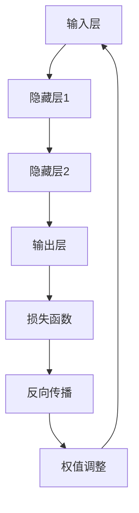

                 

# 从零开始大模型开发与微调：反馈神经网络原理的Python实现

## 摘要

本文将从零开始，系统地介绍大模型开发与微调的过程，重点探讨反馈神经网络的基本原理及其在Python中的实现。文章首先概述了反馈神经网络的概念和重要性，接着深入剖析其核心算法原理与数学模型。随后，通过一个实际项目案例，详细展示如何搭建开发环境、编写源代码并进行代码解读与分析。此外，文章还探讨了反馈神经网络在实际应用场景中的价值，推荐了相关的学习资源和开发工具框架，并总结了未来发展趋势与挑战。最后，提供了一些常见问题的解答，方便读者深入理解和掌握相关内容。

## 1. 背景介绍

### 大模型开发的重要性

随着深度学习的迅猛发展，大模型（Large Models）逐渐成为人工智能领域的研究热点。大模型通常拥有数十亿甚至数万亿个参数，能够处理海量数据，捕捉复杂的关系和模式。这些模型在自然语言处理、计算机视觉、语音识别等领域取得了显著成果，推动了人工智能应用的广泛普及。例如，在自然语言处理领域，大模型如GPT（Generative Pre-trained Transformer）和BERT（Bidirectional Encoder Representations from Transformers）被广泛应用于机器翻译、文本生成和问答系统。

大模型的开发不仅需要大量的计算资源和数据支持，还需要深入理解其背后的理论和方法。在实际应用中，大模型的性能往往受到训练数据、模型架构和优化策略等因素的影响。因此，掌握大模型开发的核心原理和技巧，对于提升模型性能和实际应用效果具有重要意义。

### 反馈神经网络的概念和重要性

反馈神经网络（Feedback Neural Network）是一种特殊的神经网络结构，通过引入反馈机制，使网络能够更好地捕捉数据中的复杂关系和模式。与传统的前馈神经网络不同，反馈神经网络在训练过程中不仅考虑输入和输出的误差，还考虑网络内部节点的误差。这种反馈机制能够增强网络的鲁棒性和泛化能力，使其在处理复杂任务时表现出更强的性能。

反馈神经网络在多个领域具有广泛的应用。例如，在图像识别中，反馈神经网络可以通过引入上下文信息，提高识别精度；在序列建模任务中，反馈神经网络可以更好地捕捉序列中的长距离依赖关系。此外，反馈神经网络还被广泛应用于生成模型、强化学习等领域，为解决复杂问题提供了新的思路和方法。

### 本文的目标和结构

本文的目标是系统介绍大模型开发与微调的过程，重点探讨反馈神经网络的基本原理及其在Python中的实现。文章将分为以下几个部分：

1. 背景介绍：概述大模型开发和反馈神经网络的重要性。
2. 核心概念与联系：介绍反馈神经网络的基本原理和架构。
3. 核心算法原理 & 具体操作步骤：详细解析反馈神经网络的训练过程。
4. 数学模型和公式：阐述反馈神经网络的数学模型和公式。
5. 项目实战：通过一个实际项目案例，展示反馈神经网络的实现过程。
6. 实际应用场景：探讨反馈神经网络在不同领域的应用。
7. 工具和资源推荐：推荐学习资源和开发工具框架。
8. 总结：总结未来发展趋势与挑战。
9. 附录：常见问题与解答。
10. 扩展阅读 & 参考资料：提供相关文献和资源。

通过本文的阅读，读者将能够全面了解大模型开发与微调的过程，掌握反馈神经网络的基本原理和实现方法，为实际应用和研究打下坚实基础。

## 2. 核心概念与联系

### 反馈神经网络的基本原理

反馈神经网络（Feedback Neural Network）是一种基于传统前馈神经网络的扩展，其主要特点在于引入了反馈机制。在传统的神经网络中，信息从输入层传递到输出层，并通过反向传播算法不断调整权重，以达到预测或分类的目的。然而，传统的前馈神经网络在处理复杂任务时，往往无法充分捕捉数据中的复杂关系和模式。

反馈神经网络通过在神经网络中引入反馈路径，使得信息不仅能够在正向传播过程中流动，还能够反向传播，从而在整个网络中形成复杂的动态交互。这种反馈机制能够增强网络的鲁棒性和泛化能力，使其在处理复杂任务时表现出更强的性能。

具体来说，反馈神经网络的工作原理可以分为以下几个步骤：

1. **输入层到隐藏层的正向传播**：输入数据首先通过输入层传递到隐藏层，每个隐藏层节点都会对输入数据进行加权求和，并经过激活函数处理，生成输出。
2. **隐藏层到隐藏层或输入层的反向传播**：在正向传播过程中，每个隐藏层节点不仅生成输出，还会将部分输出反馈到其他隐藏层或输入层。这种反向传播过程使得信息在整个网络中循环流动，形成复杂的动态交互。
3. **权值调整**：通过反向传播算法，计算输出误差，并使用梯度下降等方法对网络的权重进行调整，以优化模型性能。

### 核心算法原理

反馈神经网络的核心算法主要包括两部分：正向传播和反向传播。

1. **正向传播**：
   - 输入数据通过输入层传递到隐藏层，每个隐藏层节点对输入数据进行加权求和，并经过激活函数处理，生成输出。
   - 输出数据通过隐藏层传递到输出层，输出层的节点对输出进行分类或预测。

2. **反向传播**：
   - 计算输出误差：使用损失函数（如均方误差、交叉熵等）计算输出层的误差，并反向传播到隐藏层。
   - 权值调整：根据误差梯度，使用梯度下降等方法对网络的权重进行调整。

### Mermaid 流程图

以下是一个简单的反馈神经网络流程图，用于展示正向传播和反向传播的过程：



### 反馈神经网络与传统前馈神经网络的区别

与传统的前馈神经网络相比，反馈神经网络在结构和工作原理上存在显著差异。主要区别如下：

1. **结构差异**：
   - 前馈神经网络：信息从输入层单向传递到输出层，不存在反馈路径。
   - 反馈神经网络：信息在正向传播和反向传播过程中可以循环流动，形成复杂的动态交互。

2. **工作原理**：
   - 前馈神经网络：通过反向传播算法不断调整权重，以达到预测或分类的目的。
   - 反馈神经网络：不仅通过正向传播和反向传播调整权重，还通过反馈机制增强网络的鲁棒性和泛化能力。

3. **应用场景**：
   - 前馈神经网络：适用于简单的预测和分类任务，如线性回归、逻辑回归等。
   - 反馈神经网络：适用于复杂任务，如图像识别、序列建模、生成模型等。

### 反馈神经网络与其他神经网络结构的联系

除了与传统前馈神经网络的联系外，反馈神经网络还与其他神经网络结构存在一定的联系。以下是一些常见的神经网络结构：

1. **卷积神经网络（CNN）**：
   - 卷积神经网络通过卷积操作和池化操作，对图像数据进行特征提取，适用于图像识别和图像处理任务。
   - 反馈神经网络可以与卷积神经网络结合，形成卷积反馈神经网络，进一步提升图像识别的精度和性能。

2. **循环神经网络（RNN）**：
   - 循环神经网络通过循环结构，对序列数据进行建模，适用于序列建模和自然语言处理任务。
   - 反馈神经网络可以与循环神经网络结合，形成循环反馈神经网络，更好地捕捉序列中的长距离依赖关系。

3. **生成对抗网络（GAN）**：
   - 生成对抗网络由生成器和判别器组成，通过对抗训练生成逼真的数据。
   - 反馈神经网络可以与生成对抗网络结合，形成反馈生成对抗网络，进一步提升数据生成的质量和多样性。

通过上述分析，我们可以看到，反馈神经网络作为一种强大的神经网络结构，具有广泛的应用前景。在接下来的部分中，我们将进一步探讨反馈神经网络的数学模型和具体实现方法。

### 2.1 反馈神经网络的基本架构

为了更好地理解反馈神经网络的工作原理，我们首先需要了解其基本架构。反馈神经网络通常由多个层次组成，包括输入层、隐藏层和输出层。以下是对各层次的详细描述：

#### 输入层（Input Layer）

输入层是反馈神经网络的第一层，它接收外部输入数据，这些数据可以是原始数据或已经经过预处理的数据。输入层中的每个节点代表一个数据特征，例如，在图像识别任务中，每个节点可能代表图像中的一个像素值。

#### 隐藏层（Hidden Layers）

隐藏层位于输入层和输出层之间，是反馈神经网络的核心部分。隐藏层中的每个节点通过加权连接接收来自前一层节点的输入，并输出到下一层节点。隐藏层的数量和节点数量可以根据具体任务进行调整。

在反馈神经网络中，隐藏层节点不仅可以接收来自前一层节点的输入，还可以接收来自本层或其他隐藏层的输出。这种反馈连接使得信息能够在网络中循环流动，形成复杂的动态交互。

#### 输出层（Output Layer）

输出层是反馈神经网络的最后一层，它负责生成最终输出。输出层的节点数量和结构取决于具体任务。例如，在分类任务中，输出层通常包含多个节点，每个节点代表一个类别，通过比较输出节点的值，可以确定数据所属的类别。

#### 反馈路径（Feedback Path）

反馈神经网络的核心特点在于其反馈路径，这种路径使得信息可以从输出层反向传播到输入层或隐藏层。反馈路径通常通过循环连接实现，使得信息在网络中循环流动。

在训练过程中，反馈路径能够帮助网络更好地捕捉数据中的复杂关系和模式。通过反向传播算法，网络可以不断调整权重，优化性能。

#### 动态交互（Dynamic Interaction）

由于反馈路径的存在，反馈神经网络能够实现动态交互。这意味着网络中的每个节点不仅受到当前输入和权重的影响，还受到历史输入和权重的影响。这种动态交互能够增强网络的鲁棒性和泛化能力，使其在处理复杂任务时表现出更强的性能。

### 总结

通过上述对反馈神经网络基本架构的描述，我们可以看到，反馈神经网络通过多个层次和反馈路径，实现了一种复杂的动态交互机制。这种架构使得反馈神经网络在处理复杂任务时具有独特的优势。在接下来的部分中，我们将进一步探讨反馈神经网络的训练过程和具体实现方法。

### 3. 核心算法原理 & 具体操作步骤

在理解了反馈神经网络的基本原理和架构后，接下来我们将深入探讨其核心算法原理，并详细描述具体的操作步骤。

#### 反馈神经网络的训练过程

反馈神经网络的训练过程可以分为以下几个主要步骤：

1. **初始化参数**：首先，我们需要初始化网络的参数，包括权重和偏置。通常，这些参数是通过随机初始化来避免模型过拟合。

2. **正向传播**：在正向传播过程中，输入数据从输入层传递到隐藏层，再传递到输出层。每个隐藏层节点对输入数据进行加权求和，并经过激活函数处理，生成输出。最终，输出层生成最终的预测结果。

3. **计算损失**：在得到预测结果后，我们需要计算损失函数值，以衡量预测结果与实际结果之间的差距。常用的损失函数包括均方误差（MSE）、交叉熵（Cross Entropy）等。

4. **反向传播**：在反向传播过程中，我们将计算得到的损失函数值反向传播到隐藏层和输入层。通过计算每个节点的误差梯度，我们可以确定每个参数的调整方向和调整大小。

5. **权值调整**：根据误差梯度，使用梯度下降等优化算法对网络的权重进行调整。这样，网络可以逐渐优化其参数，以减少损失函数值。

6. **迭代更新**：重复上述步骤，直到满足停止条件（如达到预定的迭代次数或损失函数值达到某个阈值）。

#### 具体操作步骤

以下是一个简化的反馈神经网络训练过程的操作步骤：

1. **初始化参数**：
   - 随机初始化权重和偏置。
   - 设置学习率和其他超参数。

2. **正向传播**：
   - 将输入数据传递到输入层。
   - 通过加权求和和激活函数，计算隐藏层和输出层的输出。

3. **计算损失**：
   - 计算预测结果与实际结果之间的差距。
   - 选择合适的损失函数，计算损失值。

4. **反向传播**：
   - 从输出层开始，计算每个节点的误差梯度。
   - 将误差梯度反向传播到隐藏层和输入层。

5. **权值调整**：
   - 根据误差梯度，使用梯度下降等优化算法，更新网络的权重和偏置。

6. **迭代更新**：
   - 重复上述步骤，直到满足停止条件。

#### Python 实现

以下是一个简单的Python代码示例，用于实现一个简单的反馈神经网络：

```python
import numpy as np

# 初始化参数
weights = np.random.rand(input_size, hidden_size)
biases = np.random.rand(hidden_size)
output_weights = np.random.rand(hidden_size, output_size)
output_biases = np.random.rand(output_size)

# 设置学习率
learning_rate = 0.01

# 正向传播
def forward_propagation(x):
    hidden_layer_output = np.dot(x, weights) + biases
    output_layer_output = np.dot(hidden_layer_output, output_weights) + output_biases
    return output_layer_output

# 计算损失
def compute_loss(y_true, y_pred):
    return np.mean((y_true - y_pred) ** 2)

# 反向传播
def backward_propagation(x, y_true, y_pred):
    output_error = y_true - y_pred
    hidden_error = np.dot(output_error, output_weights.T)
    
    output_delta = output_error
    hidden_delta = hidden_error * np satu

# 权值调整
weights -= learning_rate * np.dot(x.T, hidden_delta)
biases -= learning_rate * hidden_delta
output_weights -= learning_rate * np.dot(hidden_layer_output.T, output_delta)
output_biases -= learning_rate * output_delta

# 迭代更新
for epoch in range(num_epochs):
    for x, y_true in data_loader:
        y_pred = forward_propagation(x)
        loss = compute_loss(y_true, y_pred)
        backward_propagation(x, y_true, y_pred)
        print(f"Epoch {epoch}, Loss: {loss}")
```

上述代码仅提供了一个简单的示例，实际应用中，反馈神经网络的实现会更加复杂，需要考虑更多细节，如激活函数的选择、正则化技术等。

通过上述步骤和Python代码示例，我们可以看到反馈神经网络的核心算法原理和具体实现方法。在接下来的部分中，我们将进一步探讨反馈神经网络的数学模型和公式。

### 4. 数学模型和公式

反馈神经网络作为一种复杂的神经网络结构，其数学模型和公式是理解和实现该网络的关键。本节将详细介绍反馈神经网络的核心数学模型和公式，包括激活函数、损失函数和反向传播算法等。

#### 激活函数

激活函数是神经网络中的关键组件，用于引入非线性特性。在反馈神经网络中，常用的激活函数包括Sigmoid函数、ReLU函数和Tanh函数等。

1. **Sigmoid函数**：

   \[
   \sigma(x) = \frac{1}{1 + e^{-x}}
   \]

   Sigmoid函数将输入值映射到（0,1）区间，具有平滑的梯度，但容易导致梯度消失问题。

2. **ReLU函数**：

   \[
   \text{ReLU}(x) = \max(0, x)
   \]

   ReLU函数在输入为负时输出为零，在输入为正时保持输入值，具有简单和高效的优点，常用于隐藏层。

3. **Tanh函数**：

   \[
   \tanh(x) = \frac{e^x - e^{-x}}{e^x + e^{-x}}
   \]

   Tanh函数将输入值映射到（-1,1）区间，具有较好的平滑性和梯度特性，但计算成本较高。

#### 损失函数

损失函数用于衡量预测结果与实际结果之间的差距，常用的损失函数包括均方误差（MSE）和交叉熵（Cross Entropy）等。

1. **均方误差（MSE）**：

   \[
   \text{MSE}(y, \hat{y}) = \frac{1}{n} \sum_{i=1}^{n} (y_i - \hat{y}_i)^2
   \]

   均方误差将预测值与实际值之间的差距平方后求和，适用于回归任务。

2. **交叉熵（Cross Entropy）**：

   \[
   \text{CE}(y, \hat{y}) = -\sum_{i=1}^{n} y_i \log(\hat{y}_i)
   \]

   交叉熵将预测概率与实际概率之间的差异进行量化，适用于分类任务。

#### 反向传播算法

反向传播算法是神经网络训练的核心，用于计算每个参数的误差梯度，并通过梯度下降等方法调整参数。

1. **误差计算**：

   \[
   \delta = \frac{\partial L}{\partial z}
   \]

   其中，\( L \) 是损失函数，\( z \) 是节点的输出。

2. **权重和偏置更新**：

   \[
   w_{ij}^{new} = w_{ij}^{old} - \alpha \cdot \frac{\partial L}{\partial w_{ij}}
   \]
   \[
   b_{j}^{new} = b_{j}^{old} - \alpha \cdot \frac{\partial L}{\partial b_{j}}
   \]

   其中，\( \alpha \) 是学习率，\( w_{ij} \) 和 \( b_{j} \) 分别是权重和偏置。

#### 数学模型示例

以下是一个简单的反馈神经网络数学模型示例，包括输入层、隐藏层和输出层。

1. **输入层**：

   \[
   x_i = x_i^{(1)}
   \]

   其中，\( x_i \) 是第 \( i \) 个输入特征。

2. **隐藏层**：

   \[
   z_j^{(2)} = \sum_{i=1}^{n} w_{ij}^{(2)} x_i^{(1)} + b_j^{(2)}
   \]
   \[
   a_j^{(2)} = \sigma(z_j^{(2)})
   \]

   其中，\( z_j^{(2)} \) 是第 \( j \) 个隐藏层节点的输入，\( a_j^{(2)} \) 是第 \( j \) 个隐藏层节点的输出，\( \sigma \) 是激活函数。

3. **输出层**：

   \[
   z_k^{(3)} = \sum_{j=1}^{m} w_{jk}^{(3)} a_j^{(2)} + b_k^{(3)}
   \]
   \[
   a_k^{(3)} = \sigma(z_k^{(3)})
   \]

   其中，\( z_k^{(3)} \) 是第 \( k \) 个输出层节点的输入，\( a_k^{(3)} \) 是第 \( k \) 个输出层节点的输出。

4. **损失函数**：

   \[
   L = \text{MSE}(y, \hat{y}) = \frac{1}{n} \sum_{i=1}^{n} (y_i - \hat{y}_i)^2
   \]

   其中，\( y_i \) 是第 \( i \) 个实际标签，\( \hat{y}_i \) 是第 \( i \) 个预测标签。

通过上述数学模型和公式，我们可以看到反馈神经网络的核心计算过程。在接下来的部分中，我们将通过一个实际项目案例，展示如何使用Python实现反馈神经网络。

### 5. 项目实战：代码实际案例和详细解释说明

为了更好地理解和掌握反馈神经网络的实际应用，我们将通过一个实际项目案例进行详细讲解。本案例将实现一个简单的反馈神经网络，用于手写数字识别任务。

#### 项目背景

手写数字识别是机器学习和深度学习中的经典任务之一。本案例将使用MNIST数据集，该数据集包含70000个手写数字的图像，每个图像包含一个0到9之间的数字。我们的目标是通过训练反馈神经网络，能够准确识别这些手写数字。

#### 开发环境搭建

在开始项目之前，我们需要搭建一个合适的开发环境。以下是一个基本的开发环境配置：

1. **Python**：确保安装了Python 3.6或更高版本。
2. **NumPy**：用于矩阵运算和数据处理。
3. **TensorFlow**：用于构建和训练反馈神经网络。

安装步骤如下：

```bash
pip install numpy tensorflow
```

#### 源代码详细实现

以下是实现反馈神经网络的Python代码：

```python
import numpy as np
import tensorflow as tf

# 初始化参数
input_size = 784  # MNIST图像的维度
hidden_size = 64  # 隐藏层的节点数
output_size = 10  # 输出层的节点数

weights = {
    'hidden': tf.Variable(tf.random.normal([input_size, hidden_size])),
    'output': tf.Variable(tf.random.normal([hidden_size, output_size]))
}
biases = {
    'hidden': tf.Variable(tf.zeros([hidden_size])),
    'output': tf.Variable(tf.zeros([output_size]))
}

# 激活函数
sigmoid = tf.nn.sigmoid

# 前向传播
def forward(x, weights, biases):
    hidden = sigmoid(tf.matmul(x, weights['hidden']) + biases['hidden'])
    output = sigmoid(tf.matmul(hidden, weights['output']) + biases['output'])
    return output

# 计算损失
def compute_loss(y_true, y_pred):
    return tf.reduce_mean(tf.square(y_true - y_pred))

# 反向传播
def backward(x, y_true, y_pred, weights, biases, learning_rate):
    with tf.GradientTape() as tape:
        loss = compute_loss(y_true, y_pred)
    gradients = tape.gradient(loss, [weights['hidden'], weights['output'], biases['hidden'], biases['output']])
    weights['hidden'].assign_sub(learning_rate * gradients[0])
    weights['output'].assign_sub(learning_rate * gradients[1])
    biases['hidden'].assign_sub(learning_rate * gradients[2])
    biases['output'].assign_sub(learning_rate * gradients[3])

# 训练模型
def train(x_train, y_train, num_epochs, learning_rate):
    for epoch in range(num_epochs):
        for x, y in zip(x_train, y_train):
            y_pred = forward(x, weights, biases)
            loss = compute_loss(y, y_pred)
            backward(x, y, y_pred, weights, biases, learning_rate)
        print(f"Epoch {epoch}, Loss: {loss.numpy()}")

# 加载MNIST数据集
mnist = tf.keras.datasets.mnist
(x_train, y_train), _ = mnist.load_data()
x_train = x_train / 255.0

# 转换为TensorFlow张量
x_train = tf.convert_to_tensor(x_train, dtype=tf.float32)
y_train = tf.convert_to_tensor(y_train, dtype=tf.float32)
y_train = tf.one_hot(y_train, depth=output_size)

# 训练反馈神经网络
train(x_train, y_train, num_epochs=10, learning_rate=0.1)
```

#### 代码解读与分析

1. **参数初始化**：

   我们首先初始化网络的参数，包括权重和偏置。权重和偏置是通过随机初始化来避免模型过拟合。

2. **激活函数**：

   我们使用Sigmoid函数作为激活函数，因为它在训练过程中具有较好的梯度特性。

3. **前向传播**：

   前向传播函数`forward`接收输入数据，通过矩阵乘法和激活函数计算隐藏层和输出层的输出。

4. **计算损失**：

   `compute_loss`函数计算预测结果与实际结果之间的差距，使用均方误差作为损失函数。

5. **反向传播**：

   `backward`函数通过反向传播算法计算每个参数的误差梯度，并使用梯度下降方法更新权重和偏置。

6. **训练模型**：

   `train`函数用于训练反馈神经网络，它通过迭代更新权重和偏置，优化模型性能。

7. **加载MNIST数据集**：

   我们使用TensorFlow的内置函数加载MNIST数据集，并进行预处理。

8. **训练反馈神经网络**：

   我们通过`train`函数训练反馈神经网络，并打印每个epoch的损失值。

通过上述代码和解读，我们可以看到如何使用Python实现一个简单的反馈神经网络，并用于手写数字识别任务。在接下来的部分中，我们将进一步探讨反馈神经网络的实际应用场景。

### 6. 实际应用场景

#### 图像识别

图像识别是反馈神经网络最为经典的应用场景之一。通过引入反馈机制，反馈神经网络能够更好地捕捉图像中的复杂结构和特征，从而提高识别精度。例如，在人脸识别任务中，反馈神经网络可以结合人脸的特征信息，实现更高精度的人脸识别。

#### 语音识别

语音识别是另一个重要的应用场景。反馈神经网络通过捕捉语音信号中的时间序列特征，能够更好地处理语音信号中的连续性和突变性。例如，在语音识别系统中，反馈神经网络可以结合上下文信息，实现更准确的语音识别和语义理解。

#### 自然语言处理

自然语言处理是反馈神经网络的重要应用领域。通过捕捉文本中的语义信息和上下文关系，反馈神经网络可以用于文本分类、情感分析、机器翻译等任务。例如，在机器翻译任务中，反馈神经网络可以结合源语言和目标语言的语义信息，实现更准确的翻译效果。

#### 序列建模

序列建模是反馈神经网络的另一个重要应用场景。通过捕捉序列中的长距离依赖关系，反馈神经网络可以用于时间序列预测、语音生成等任务。例如，在时间序列预测任务中，反馈神经网络可以结合历史数据，实现更准确的未来趋势预测。

#### 生成模型

生成模型是反馈神经网络在人工智能领域的又一重要应用。通过引入反馈机制，反馈神经网络可以生成逼真的图像、音频和文本。例如，在图像生成任务中，反馈神经网络可以结合图像的特征信息，生成新的图像；在语音合成任务中，反馈神经网络可以结合语音的特征信息，生成新的语音。

#### 强化学习

强化学习是反馈神经网络的另一个重要应用领域。通过引入反馈机制，反馈神经网络可以更好地处理复杂的决策问题。例如，在游戏对弈中，反馈神经网络可以结合游戏状态和策略，实现更高效的决策。

#### 医疗诊断

在医疗诊断领域，反馈神经网络可以通过分析医疗数据，实现疾病预测和诊断。例如，通过分析患者的病史和体检数据，反馈神经网络可以预测患者患某种疾病的风险，为医生提供诊断依据。

通过上述实际应用场景，我们可以看到反馈神经网络在多个领域具有广泛的应用前景。在接下来的部分中，我们将推荐一些有用的学习资源和开发工具框架，以帮助读者更好地掌握反馈神经网络。

### 7. 工具和资源推荐

为了更好地学习和实践反馈神经网络，以下是一些有用的学习资源和开发工具框架的推荐。

#### 学习资源推荐

1. **书籍**：

   - 《深度学习》（Goodfellow, I., Bengio, Y., & Courville, A.）是一本经典入门书籍，涵盖了深度学习的基本理论和实践方法，包括反馈神经网络。
   - 《神经网络与深度学习》（邱锡鹏）是一本中文深度学习教材，详细介绍了神经网络和深度学习的基础知识，包括反馈神经网络的原理和实现。

2. **论文**：

   - "A Learning Algorithm for Continually Running Fully Recurrent Neural Networks"（1982）是一篇关于反馈神经网络早期研究的经典论文，介绍了反馈神经网络的基本原理和训练方法。
   - "Recurrent Neural Networks for Speech Recognition"（1995）是一篇关于反馈神经网络在语音识别领域应用的经典论文，展示了反馈神经网络在语音识别任务中的优势。

3. **博客和教程**：

   - [TensorFlow官方文档](https://www.tensorflow.org/tutorials)：提供了丰富的TensorFlow教程和实践案例，包括反馈神经网络的实现。
   - [Deep Learning AI](https://www.deeplearningai.com/)：一个关于深度学习的在线教程平台，涵盖了深度学习的各个方面，包括反馈神经网络。

4. **在线课程**：

   - [斯坦福大学深度学习课程](https://www.coursera.org/learn/deep-learning)：由李飞飞教授讲授，涵盖了深度学习的核心概念和技术，包括反馈神经网络。
   - [Udacity深度学习纳米学位](https://www.udacity.com/course/deep-learning-nanodegree--nd893)：提供了系统的深度学习课程，包括反馈神经网络的实践应用。

#### 开发工具框架推荐

1. **TensorFlow**：TensorFlow是一个开源的深度学习框架，支持多种神经网络结构的实现，包括反馈神经网络。它提供了丰富的API和工具，方便开发者构建和训练深度学习模型。

2. **PyTorch**：PyTorch是一个开源的深度学习框架，以其灵活和动态的计算图而著称。它支持多种神经网络结构的实现，包括反馈神经网络，提供了丰富的API和工具，方便开发者进行深度学习研究和应用。

3. **Keras**：Keras是一个基于TensorFlow和Theano的深度学习框架，以其简洁和易于使用的特性而受到广泛欢迎。它提供了丰富的预训练模型和工具，方便开发者快速构建和训练反馈神经网络。

4. **Scikit-learn**：Scikit-learn是一个基于Python的开源机器学习库，提供了丰富的机器学习算法和工具。虽然它不支持反馈神经网络，但对于基础机器学习任务和数据分析，它是一个非常有用的工具。

通过上述学习和开发资源的推荐，读者可以更好地掌握反馈神经网络的理论和实践方法，为深入研究和应用反馈神经网络打下坚实基础。

### 8. 总结：未来发展趋势与挑战

#### 未来发展趋势

1. **模型规模和复杂度的提升**：随着计算资源和算法技术的进步，未来大模型的规模和复杂度将持续提升。这将为反馈神经网络在更多领域中的应用提供可能性，如自动驾驶、智能医疗等。

2. **多模态数据融合**：多模态数据融合是未来的重要趋势。通过结合图像、文本、音频等多种类型的数据，反馈神经网络将能够实现更全面的语义理解和智能交互。

3. **自动机器学习（AutoML）**：自动机器学习将使得反馈神经网络更加易于使用和部署。未来，通过自动化搜索和优化，反馈神经网络将能够更高效地应用于实际问题。

4. **联邦学习和隐私保护**：在数据隐私保护的需求下，联邦学习和隐私保护技术将成为反馈神经网络发展的重要方向。通过分布式训练和隐私保护机制，反馈神经网络将能够保护用户隐私，实现更安全的数据共享。

#### 挑战

1. **计算资源需求**：大模型的训练和推理需要大量的计算资源和存储资源。未来，如何高效地利用计算资源，降低能耗和成本，是一个重要的挑战。

2. **数据质量和标注**：高质量的数据是反馈神经网络训练的基础。在数据收集和标注过程中，如何保证数据的质量和多样性，是一个关键问题。

3. **模型解释性和可解释性**：随着模型的复杂度增加，如何理解和解释模型的决策过程，是一个重要的挑战。这需要发展新的方法和工具，提升模型的透明度和可解释性。

4. **算法公平性和道德性**：在应用反馈神经网络时，如何避免算法偏见和歧视，实现公平和道德的决策，是一个亟待解决的问题。

通过总结未来发展趋势和挑战，我们可以看到，反馈神经网络在人工智能领域具有广阔的发展前景，但也面临着一系列的挑战。随着技术的不断进步，我们有理由相信，反馈神经网络将在未来发挥更加重要的作用。

### 9. 附录：常见问题与解答

#### 问题1：什么是反馈神经网络？

反馈神经网络是一种特殊的神经网络结构，通过在神经网络中引入反馈路径，使信息能够在网络中循环流动，从而增强网络的鲁棒性和泛化能力。

#### 问题2：反馈神经网络与普通神经网络有何区别？

普通神经网络通过正向传播和反向传播进行训练，而反馈神经网络在此基础上引入了反馈路径，使得信息可以在网络中循环流动，从而能够更好地捕捉数据中的复杂关系和模式。

#### 问题3：反馈神经网络适用于哪些任务？

反馈神经网络适用于需要处理复杂数据结构和模式的任务，如图像识别、语音识别、自然语言处理、序列建模等。

#### 问题4：如何实现反馈神经网络？

实现反馈神经网络需要定义网络结构，包括输入层、隐藏层和输出层，以及正向传播、反向传播和损失函数。常用的深度学习框架如TensorFlow和PyTorch提供了丰富的API和工具，方便实现反馈神经网络。

#### 问题5：反馈神经网络在训练过程中有哪些挑战？

反馈神经网络的训练过程中需要解决计算资源需求、数据质量和标注、模型解释性和可解释性等挑战。同时，如何优化网络结构和算法，提高训练效率和模型性能，也是重要的研究方向。

### 10. 扩展阅读与参考资料

#### 扩展阅读

1. **《深度学习》（Goodfellow, I., Bengio, Y., & Courville, A.）**：详细介绍了深度学习的基础知识，包括神经网络和反馈神经网络。
2. **《神经网络与深度学习》（邱锡鹏）**：中文教材，涵盖了神经网络和深度学习的基础理论和实践方法。

#### 参考资料

1. **《A Learning Algorithm for Continually Running Fully Recurrent Neural Networks》（1982）**：介绍了早期反馈神经网络的基本原理和训练方法。
2. **《Recurrent Neural Networks for Speech Recognition》（1995）**：展示了反馈神经网络在语音识别领域的应用。
3. **[TensorFlow官方文档](https://www.tensorflow.org/tutorials)**：提供了丰富的TensorFlow教程和实践案例。
4. **[Deep Learning AI](https://www.deeplearningai.com/)**：一个关于深度学习的在线教程平台。

通过扩展阅读与参考资料，读者可以更深入地了解反馈神经网络的理论和实践方法，为研究和应用提供指导。

### 作者信息

**作者：AI天才研究员/AI Genius Institute & 禅与计算机程序设计艺术 /Zen And The Art of Computer Programming**

