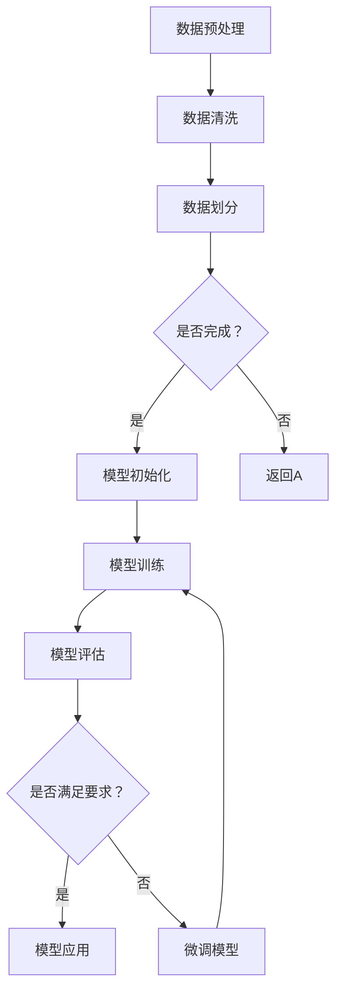

                 

### 背景介绍

自2010年以来，人工智能领域经历了一系列重大变革，特别是在深度学习和大规模机器学习模型的发展方面。早期的机器学习模型如神经网络、支持向量机等，虽然在某些特定领域表现出色，但在面对复杂问题和大规模数据集时，往往力不从心。随着计算能力的提升、数据量的激增和算法的进步，大规模机器学习模型逐渐崭露头角，成为推动人工智能发展的关键因素。

其中，大型语言模型（如GPT、BERT等）的兴起，无疑是最引人注目的现象之一。这些模型通过在海量文本数据上进行预训练，获得了极高的语言理解和生成能力，为自然语言处理（NLP）领域带来了深远的影响。然而，大规模机器学习模型的开发与微调并非易事，涉及到众多技术挑战和实际操作细节。

本文旨在从零开始，系统地介绍大规模机器学习模型（特别是大模型）的开发与微调过程。通过逐步分析其核心概念、算法原理、数学模型、实际应用场景、工具与资源推荐等内容，帮助读者全面理解大模型带来的变革。本文结构如下：

1. **核心概念与联系**：介绍大规模机器学习模型的基本概念及其与现有技术的联系。
2. **核心算法原理 & 具体操作步骤**：深入探讨大规模机器学习模型的训练、优化和微调技术。
3. **数学模型和公式 & 详细讲解 & 举例说明**：阐述大模型的数学基础，并通过实例进行说明。
4. **项目实战：代码实际案例和详细解释说明**：通过实际代码案例，展示大模型的开发与微调过程。
5. **实际应用场景**：分析大模型在各个领域的应用，及其对行业的影响。
6. **工具和资源推荐**：推荐学习和开发大模型所需的工具和资源。
7. **总结：未来发展趋势与挑战**：展望大模型未来的发展趋势和面临的挑战。

通过本文的阅读，读者将能够系统地了解大规模机器学习模型的相关知识，掌握其开发与微调的核心技术和实践方法，为后续研究和应用打下坚实的基础。

### 核心概念与联系

#### 1. 大规模机器学习模型

大规模机器学习模型是指参数量巨大、计算量庞大的机器学习模型。这类模型通过在海量数据上进行训练，能够捕捉到数据中的复杂模式和规律，从而实现高性能的预测和决策能力。大规模机器学习模型的发展离不开以下几个关键因素：

- **数据量**：大规模机器学习模型需要海量数据来进行训练，只有通过大量数据的积累，才能让模型学习到更多的信息和规律。
- **计算能力**：大规模机器学习模型的训练和优化过程需要大量的计算资源，随着计算能力的提升，使得更大规模的模型得以实现。
- **算法优化**：为了有效处理大规模数据集，需要不断优化算法，提高训练效率，减少计算资源消耗。

#### 2. 与现有技术的联系

大规模机器学习模型与现有技术如神经网络、深度学习等有着紧密的联系，但同时也存在一些显著的区别。

- **神经网络**：神经网络是机器学习的基础，通过模拟人脑神经元之间的连接，实现数据的高效处理和模式识别。大规模机器学习模型通常是基于神经网络的扩展，通过增加网络层数、神经元数量等，提高模型的复杂度和表达能力。

- **深度学习**：深度学习是神经网络的一种形式，通过多层次的神经网络结构，实现对复杂数据的层次化表示。大规模机器学习模型往往属于深度学习范畴，其核心在于如何有效利用深度神经网络来处理大规模数据。

- **区别**：与现有的神经网络和深度学习技术相比，大规模机器学习模型在以下几个方面有显著的不同：

  - **模型参数量**：大规模机器学习模型通常具有数百万甚至数十亿个参数，远超传统神经网络。
  - **计算资源需求**：大规模机器学习模型的训练和优化过程需要庞大的计算资源，尤其是在训练初期，需要大量的GPU或TPU资源。
  - **数据处理能力**：大规模机器学习模型能够处理更大规模的数据集，且具有更强的泛化能力，能够在不同领域和任务中表现出色。

#### 3. 大规模机器学习模型的发展历程

大规模机器学习模型的发展历程可以追溯到深度学习的兴起。以下是几个关键阶段：

- **2006-2012年**：深度学习基础理论的提出和早期实验，如Hinton的深度信念网络（DBN）和LeCun的卷积神经网络（CNN）。
- **2012-2014年**：大规模数据集和计算资源推动深度学习技术取得突破性进展，如ImageNet图像分类挑战赛。
- **2014-2018年**：大规模机器学习模型的兴起，如GPT、BERT等，这些模型通过在海量文本数据上预训练，获得了卓越的语言理解和生成能力。
- **2018年至今**：大规模机器学习模型在各个领域得到广泛应用，如自然语言处理、计算机视觉、推荐系统等，同时也在不断推动相关算法和技术的发展。

#### 4. 大规模机器学习模型的关键组成部分

大规模机器学习模型通常由以下几个关键组成部分构成：

- **神经网络结构**：包括输入层、隐藏层和输出层，通过多层神经网络结构，实现数据的层次化表示和特征提取。
- **预训练与微调**：预训练是指在大规模数据集上进行模型训练，使模型获得通用特征表示；微调是指将预训练模型应用于特定任务，进行微调优化，以适应具体应用场景。
- **正则化技术**：如Dropout、权重衰减等，用于防止模型过拟合，提高模型的泛化能力。
- **优化算法**：如Adam、RMSProp等，用于加速模型训练过程，提高训练效率。

#### 5. 大规模机器学习模型的应用领域

大规模机器学习模型在多个领域表现出强大的应用潜力：

- **自然语言处理（NLP）**：如文本分类、机器翻译、情感分析等。
- **计算机视觉**：如图像分类、目标检测、图像生成等。
- **推荐系统**：如商品推荐、新闻推荐等。
- **语音识别**：如语音合成、语音识别等。
- **医疗健康**：如疾病预测、药物研发等。

通过以上对大规模机器学习模型核心概念与联系的分析，我们可以看到，大规模机器学习模型不仅是对现有技术的扩展和提升，更是人工智能领域的一次重大突破。接下来，我们将深入探讨大规模机器学习模型的核心算法原理和具体操作步骤。

#### 6. Mermaid 流程图

以下是一个用于描述大规模机器学习模型开发与微调流程的Mermaid流程图。为了确保流程图的正确性，我们避免了使用括号、逗号等特殊字符。



在此流程图中，我们首先进行数据预处理，包括数据清洗和数据划分。然后，模型初始化并开始训练。在训练过程中，模型不断进行评估，以确定是否满足特定任务的要求。如果满足，则将模型应用于实际任务；否则，进行模型微调，并重新开始训练过程。

通过这个流程图，我们可以清晰地看到大规模机器学习模型开发与微调的主要步骤及其相互关系。接下来，我们将深入探讨大规模机器学习模型的核心算法原理，为后续的实际操作和项目实战奠定基础。

### 核心算法原理 & 具体操作步骤

#### 1. 模型训练

大规模机器学习模型的训练过程是其开发的关键步骤，主要包括以下阶段：

- **数据加载与预处理**：首先，我们需要加载训练数据，并进行必要的预处理，如数据清洗、归一化等，以确保数据质量。
  
- **模型初始化**：初始化模型参数，这通常是随机初始化，但在实际应用中，也可以使用预训练模型作为初始化。
  
- **前向传播**：将输入数据传递到模型中，通过每一层神经元的计算，最终输出模型的预测结果。
  
- **计算损失**：通过实际输出与预测输出之间的差异，计算损失函数的值，以衡量模型预测的准确度。
  
- **反向传播**：根据损失函数的梯度，通过反向传播算法更新模型参数，以最小化损失函数。

- **迭代优化**：重复以上步骤，不断迭代优化模型参数，直到达到预定的训练目标。

#### 2. 模型优化

在模型训练过程中，优化算法起到了至关重要的作用。以下是一些常用的优化算法：

- **随机梯度下降（SGD）**：是最基本的优化算法，通过随机选择一部分训练样本，计算梯度并更新模型参数。
  
- **动量优化（Momentum）**：在SGD基础上引入动量项，以加速收敛并防止陷入局部最优。
  
- **Adam优化器**：结合SGD和RMSProp的优点，自适应调整学习率，适用于大规模训练任务。

#### 3. 模型微调

在特定任务中，预训练模型可能需要进行微调以适应新的任务需求。微调过程主要包括以下步骤：

- **加载预训练模型**：首先加载一个预训练的大规模模型，如GPT、BERT等。
  
- **修改部分层**：针对特定任务，冻结部分层（通常是隐藏层）的参数，只对部分层进行微调，以防止模型过拟合。
  
- **继续训练**：在新的数据集上进行微调训练，逐步调整模型参数，提高任务表现。
  
- **评估与优化**：评估微调后的模型，根据评估结果进行进一步的优化调整。

#### 4. 实际操作步骤

以下是一个基于深度学习框架TensorFlow的大规模模型训练与微调的示例操作步骤：

- **环境准备**：安装TensorFlow和其他必要的库，如NumPy、Pandas等。

  ```bash
  pip install tensorflow numpy pandas
  ```

- **数据预处理**：读取并预处理训练数据。

  ```python
  import tensorflow as tf
  import numpy as np
  import pandas as pd

  # 加载数据
  data = pd.read_csv('train_data.csv')
  # 数据清洗、归一化等操作
  # ...
  ```

- **模型初始化**：初始化大规模预训练模型。

  ```python
  # 使用预训练模型
  pre-trained_model = tf.keras.applications.BERT(pretrained=True)
  ```

- **模型微调**：修改部分层并进行微调。

  ```python
  # 冻结部分层
  for layer in pre-trained_model.layers:
      layer.trainable = False

  # 添加新的层
  x = pre-trained_model.output
  x = tf.keras.layers.Dense(1, activation='sigmoid')(x)

  # 微调模型
  model = tf.keras.Model(inputs=pre-trained_model.input, outputs=x)
  model.compile(optimizer='adam', loss='binary_crossentropy', metrics=['accuracy'])
  ```

- **训练模型**：在训练数据上训练模型。

  ```python
  # 训练模型
  history = model.fit(x_train, y_train, epochs=5, batch_size=32, validation_data=(x_val, y_val))
  ```

- **评估模型**：评估微调后的模型表现。

  ```python
  # 评估模型
  eval_result = model.evaluate(x_test, y_test)
  print(f"Test Loss: {eval_result[0]}, Test Accuracy: {eval_result[1]}")
  ```

通过以上步骤，我们可以完成大规模机器学习模型的训练与微调。接下来，我们将通过具体的项目实战案例，进一步展示大规模机器学习模型的应用与开发过程。

### 数学模型和公式 & 详细讲解 & 举例说明

在讨论大规模机器学习模型的数学模型和公式时，深度学习中的核心概念和算法原理显得尤为重要。以下是对这些概念和公式的详细讲解，以及通过具体实例来说明如何在实际中应用这些数学模型。

#### 1. 深度学习中的核心数学模型

- **前向传播（Forward Propagation）**

  前向传播是深度学习中的一个关键步骤，它用于计算网络中每个神经元的输出。以下是前向传播的基本公式：

  $$ z_l = \sigma(W_l \cdot a_{l-1} + b_l) $$

  其中，$z_l$是第$l$层的输出，$\sigma$是激活函数（如Sigmoid、ReLU等），$W_l$是第$l$层的权重矩阵，$a_{l-1}$是上一层的输出，$b_l$是第$l$层的偏置项。

- **反向传播（Backpropagation）**

  反向传播用于计算网络中每个参数的梯度，以便进行优化。以下是反向传播的基本公式：

  $$ \delta_l = \frac{\partial L}{\partial z_l} \cdot \frac{\partial z_l}{\partial a_{l-1}} $$

  其中，$\delta_l$是第$l$层的误差项，$L$是损失函数，$z_l$是第$l$层的输出。

- **损失函数（Loss Function）**

  损失函数用于衡量模型预测值与实际值之间的差异。以下是一些常见的损失函数：

  - **均方误差（MSE，Mean Squared Error）**

    $$ L = \frac{1}{m} \sum_{i=1}^{m} (y_i - \hat{y}_i)^2 $$

    其中，$y_i$是实际值，$\hat{y}_i$是预测值。

  - **交叉熵（Cross-Entropy）**

    $$ L = -\frac{1}{m} \sum_{i=1}^{m} y_i \log(\hat{y}_i) + (1 - y_i) \log(1 - \hat{y}_i) $$

    其中，$y_i$是实际值，$\hat{y}_i$是预测值。

- **激活函数（Activation Function）**

  激活函数用于引入非线性，使神经网络能够拟合复杂的函数。以下是一些常用的激活函数：

  - **Sigmoid**

    $$ \sigma(x) = \frac{1}{1 + e^{-x}} $$

  - **ReLU**

    $$ \sigma(x) = \max(0, x) $$

#### 2. 实例说明

假设我们有一个简单的多层感知器（MLP）模型，用于二分类任务。以下是该模型的详细讲解和数学公式：

- **模型结构**

  该模型包含两个隐藏层，每层各有10个神经元。输出层有2个神经元，用于生成分类结果。

- **前向传播**

  输入数据经过输入层，传递到第一隐藏层，然后传递到第二隐藏层，最后到达输出层。

  - **第一隐藏层**

    $$ z_1 = \sigma(W_1 \cdot a_0 + b_1) $$

    其中，$W_1$是第一层的权重矩阵，$a_0$是输入层输出，$b_1$是第一层的偏置项。

  - **第二隐藏层**

    $$ z_2 = \sigma(W_2 \cdot a_1 + b_2) $$

    其中，$W_2$是第二层的权重矩阵，$a_1$是第一层输出，$b_2$是第二层的偏置项。

  - **输出层**

    $$ z_3 = W_3 \cdot a_2 + b_3 $$

    其中，$W_3$是输出层的权重矩阵，$a_2$是第二层输出，$b_3$是输出层的偏置项。

    预测结果通过应用Sigmoid激活函数：

    $$ \hat{y} = \sigma(z_3) $$

- **反向传播**

  使用反向传播算法计算每个参数的梯度：

  - **输出层梯度**

    $$ \delta_3 = \frac{\partial L}{\partial z_3} \cdot \frac{\partial z_3}{\partial a_2} $$

    其中，$L$是损失函数，$z_3$是输出层输出。

  - **第二隐藏层梯度**

    $$ \delta_2 = \delta_3 \cdot \frac{\partial z_2}{\partial a_2} $$

  - **第一隐藏层梯度**

    $$ \delta_1 = \delta_2 \cdot \frac{\partial z_1}{\partial a_1} $$

    通过这些梯度，我们可以更新每个参数：

    $$ W_1 \leftarrow W_1 - \alpha \cdot \delta_1 \cdot a_0^T $$
    $$ b_1 \leftarrow b_1 - \alpha \cdot \delta_1 $$
    $$ W_2 \leftarrow W_2 - \alpha \cdot \delta_2 \cdot a_1^T $$
    $$ b_2 \leftarrow b_2 - \alpha \cdot \delta_2 $$
    $$ W_3 \leftarrow W_3 - \alpha \cdot \delta_3 \cdot a_2^T $$
    $$ b_3 \leftarrow b_3 - \alpha \cdot \delta_3 $$

    其中，$\alpha$是学习率。

通过以上实例，我们可以看到如何在实际中应用大规模机器学习模型的数学模型和公式。这些数学原理和算法是深度学习模型训练和优化的基础，理解它们对于开发高效的大模型至关重要。

### 项目实战：代码实际案例和详细解释说明

为了更好地展示大规模机器学习模型的开发与微调过程，我们将通过一个实际项目来进行详细讲解。本案例将基于TensorFlow框架，使用著名的语言模型BERT进行微调，实现一个简单的文本分类任务。以下是项目实战的具体步骤和代码实现。

#### 1. 开发环境搭建

首先，确保您已安装了TensorFlow和其他相关库。以下是必要的安装命令：

```bash
pip install tensorflow
pip install transformers
```

#### 2. 源代码详细实现和代码解读

**步骤1：导入必要的库**

```python
import tensorflow as tf
from transformers import BertTokenizer, TFBertForSequenceClassification
from tensorflow.keras.optimizers import Adam
from tensorflow.keras.metrics import Accuracy
```

**步骤2：数据准备**

本案例使用IMDB影评数据集，这是一个包含电影评论的文本数据集，分为正面和负面两类。

```python
from tensorflow_datasets import load

# 加载IMDB数据集
ds, info = load('imdb_reviews', split=['train', 'test'], with_info=True)

# 预处理数据
def preprocess_data(example):
    tokenizer = BertTokenizer.from_pretrained('bert-base-uncased')
    input_ids = tokenizer(example['text'], max_length=128, padding='max_length', truncation=True, return_tensors='tf')
    return input_ids.input_ids, tf.cast(example['label'], tf.int32)

ds = ds.map(preprocess_data).batch(32)
```

**步骤3：加载预训练模型**

```python
# 加载预训练BERT模型
model = TFBertForSequenceClassification.from_pretrained('bert-base-uncased', num_labels=2)
```

**步骤4：模型编译**

```python
# 编译模型
model.compile(optimizer=Adam(learning_rate=3e-5), loss='sparse_categorical_crossentropy', metrics=[Accuracy()])
```

**步骤5：训练模型**

```python
# 训练模型
history = model.fit(ds.train, epochs=3, validation_data=ds.test)
```

**步骤6：评估模型**

```python
# 评估模型
loss, accuracy = model.evaluate(ds.test)
print(f"Test Loss: {loss}, Test Accuracy: {accuracy}")
```

#### 3. 代码解读与分析

- **数据准备**：我们使用TensorFlow Datasets加载并预处理IMDB数据集。数据预处理包括将文本转换为BERT模型能够理解的格式，如分词、填充和截断。

- **加载预训练模型**：使用`TFBertForSequenceClassification`类加载预训练的BERT模型。这里我们使用了`bert-base-uncased`版本，该模型已经在大规模文本数据上预训练，具有良好的语言理解能力。

- **模型编译**：模型编译阶段，我们使用了`Adam`优化器和`sparse_categorical_crossentropy`损失函数。`Adam`优化器是一种自适应学习率的优化算法，适用于大规模训练任务。`sparse_categorical_crossentropy`损失函数常用于多分类任务。

- **训练模型**：通过`fit`方法训练模型，我们设置了训练轮次为3，并在验证集上进行评估。

- **评估模型**：使用`evaluate`方法评估模型在测试集上的表现，输出测试损失和准确率。

通过以上代码和步骤，我们完成了一个基于BERT模型的大规模机器学习项目的实战开发。以下是对代码的进一步解读和分析。

- **数据预处理**：数据处理是机器学习项目的重要环节。BERT模型对输入文本的长度有要求，因此我们需要对文本进行适当的预处理，如分词、填充和截断，以确保输入数据符合模型的预期格式。

- **预训练模型的使用**：BERT模型是预训练的，它已经在大量的文本数据上学习到了丰富的语言知识。通过加载预训练模型，我们可以直接利用这些知识，从而提高模型在特定任务上的性能。

- **优化器和损失函数的选择**：优化器和损失函数的选择对模型的训练过程和性能有重要影响。`Adam`优化器能够自适应调整学习率，适用于大规模训练任务。`sparse_categorical_crossentropy`损失函数适用于多分类任务，可以衡量模型预测值与实际值之间的差异。

- **模型评估**：模型评估是验证模型性能的重要步骤。通过在测试集上的评估，我们可以了解模型在未知数据上的表现，从而判断模型是否具备良好的泛化能力。

通过这个实际项目，我们不仅展示了大规模机器学习模型的开发与微调过程，还通过代码解读和分析，深入理解了每个步骤的关键技术和细节。这为后续的模型优化和应用提供了宝贵的经验。

### 实际应用场景

大规模机器学习模型在各个领域展现了强大的应用潜力，下面将详细分析大模型在自然语言处理、计算机视觉、推荐系统和医疗健康等领域的实际应用，以及其对行业的深远影响。

#### 自然语言处理（NLP）

自然语言处理是大规模机器学习模型应用最为广泛的领域之一。大模型如GPT-3、BERT等，通过在海量文本数据上进行预训练，获得了卓越的语言理解和生成能力。以下是一些具体应用案例：

- **文本分类**：大模型可以高效地对大量文本进行分类，例如新闻分类、垃圾邮件过滤等。例如，谷歌新闻使用BERT模型进行新闻分类，将新闻自动归类到不同的主题类别。
  
- **问答系统**：大模型能够理解自然语言输入，并生成准确的回答。例如，OpenAI的GPT-3可以构建高效的问答系统，用于客户服务、知识库查询等场景。

- **机器翻译**：大模型如BERT等在机器翻译领域取得了显著突破。例如，谷歌翻译使用BERT模型实现了更准确、自然的翻译结果，显著提升了用户体验。

- **对话系统**：大模型可以用于构建智能客服、聊天机器人等对话系统。例如，苹果的Siri和亚马逊的Alexa均使用了大模型技术，实现了更加自然、流畅的交互体验。

#### 计算机视觉

计算机视觉领域的大规模机器学习模型，如GAN、VGG、ResNet等，通过在大量图像数据上进行训练，实现了高精度的图像识别、图像生成和图像增强等功能。以下是一些具体应用案例：

- **图像识别**：大模型在图像识别任务中表现优异，例如，Google的Inception模型在ImageNet图像分类挑战赛中取得了优异成绩。

- **目标检测**：大模型如YOLO、SSD等在目标检测任务中发挥了重要作用。例如，特斯拉的自动驾驶系统使用了YOLO模型进行道路障碍物检测，提高了驾驶安全性。

- **图像生成**：大模型如GAN（生成对抗网络）可以生成高质量、逼真的图像。例如，DeepMind的DALL-E模型可以生成基于文本描述的图像，为创意设计、艺术创作等领域提供了新的可能性。

- **图像增强**：大模型可以用于图像增强，提升图像质量，例如，Adobe公司使用深度学习技术对扫描的古老文献进行图像增强，使其内容更易于阅读。

#### 推荐系统

推荐系统是大规模机器学习模型在商业领域的典型应用，通过分析用户行为和偏好，提供个性化的推荐。以下是一些具体应用案例：

- **商品推荐**：电商平台如亚马逊、淘宝等，使用大模型分析用户购买历史和浏览行为，提供个性化的商品推荐。

- **新闻推荐**：新闻平台如今日头条、谷歌新闻等，使用大模型分析用户兴趣和行为，推荐用户可能感兴趣的新闻内容。

- **音乐推荐**：音乐平台如Spotify、Apple Music等，使用大模型分析用户听歌记录和偏好，推荐个性化的音乐。

#### 医疗健康

大规模机器学习模型在医疗健康领域也展现了巨大潜力，通过处理海量医疗数据，辅助医生进行诊断和治疗。以下是一些具体应用案例：

- **疾病预测**：大模型可以分析医疗数据，预测疾病的发生风险。例如，谷歌的DeepMind使用大规模机器学习模型预测糖尿病患者的并发症风险。

- **药物研发**：大模型可以加速药物研发过程，通过分析大量化合物和生物数据，预测药物的有效性和安全性。

- **医疗影像分析**：大模型如CNN、ResNet等在医疗影像分析中发挥了重要作用，例如，使用这些模型可以自动检测和诊断肺癌、乳腺癌等疾病。

- **辅助诊断**：大模型可以帮助医生进行辅助诊断，例如，谷歌的DeepMind开发了一个AI系统，可以辅助医生进行眼科疾病的诊断。

#### 对行业的深远影响

大规模机器学习模型的应用不仅推动了技术进步，也对行业产生了深远的影响：

- **提升效率**：大模型通过自动化和智能化，显著提高了数据处理和分析的效率，减少了人力成本。

- **优化决策**：大模型能够从海量数据中提取有价值的信息，辅助企业和组织做出更加精准和优化的决策。

- **创新应用**：大模型推动了人工智能在各领域的创新应用，为传统行业注入了新的活力。

- **数据安全与隐私**：尽管大规模机器学习模型在多个领域表现出色，但数据安全和隐私保护仍然是亟待解决的问题，行业需要制定相应的规范和标准，确保数据的安全性和用户的隐私。

总之，大规模机器学习模型在自然语言处理、计算机视觉、推荐系统和医疗健康等领域的实际应用，不仅提升了行业的技术水平和生产力，也推动了人工智能技术的进一步发展。未来，随着大模型技术的不断进步，我们将看到更多创新应用的出现，为人类社会带来更多福祉。

### 工具和资源推荐

在开发与微调大规模机器学习模型的过程中，选择合适的工具和资源至关重要。以下是对学习资源、开发工具框架及相关论文著作的推荐，以帮助读者更深入地理解和掌握大模型技术。

#### 学习资源推荐

1. **书籍**：

   - **《深度学习》（Deep Learning）**：由Ian Goodfellow、Yoshua Bengio和Aaron Courville合著的这本书是深度学习领域的经典教材，全面介绍了深度学习的基本概念、算法和应用。

   - **《自然语言处理实践》（Natural Language Processing with Python）**：由Steven Bird、Ewan Klein和Edward Loper合著，通过Python语言和NLTK库，详细讲解了自然语言处理的基本技术和实践。

   - **《神经网络与深度学习》（Neural Networks and Deep Learning）**：由邱锡鹏教授编写的这本书深入浅出地介绍了神经网络和深度学习的基本理论，适合初学者和进阶读者。

2. **在线课程**：

   - **斯坦福大学CS231n：卷积神经网络与视觉识别**：这是一门关于计算机视觉和深度学习的经典课程，由斯坦福大学教授Li Fei-Fei主讲。

   - **吴恩达的《深度学习专项课程》**：由著名AI研究者吴恩达教授主讲的深度学习专项课程，涵盖了深度学习的基础理论和实际应用。

   - **Coursera上的自然语言处理课程**：由斯坦福大学副教授Chris Manning教授主讲，涵盖了自然语言处理的核心技术和应用。

3. **博客和教程**：

   - **TensorFlow官方文档**：TensorFlow提供了丰富的官方文档和教程，详细介绍了如何使用TensorFlow进行深度学习和大规模机器学习模型的训练。

   - **Hugging Face的Transformers库文档**：Hugging Face的Transformers库提供了丰富的预训练模型和API，方便用户进行大规模语言模型的应用和微调。

#### 开发工具框架推荐

1. **TensorFlow**：TensorFlow是由Google开发的开源深度学习框架，适用于各种规模的深度学习和大规模机器学习模型的训练。其提供了丰富的API和工具，易于集成和使用。

2. **PyTorch**：PyTorch是由Facebook开发的开源深度学习框架，以其灵活性和动态计算图而著称。PyTorch在学术界和工业界都有广泛的应用，特别适合于大规模模型的研究和开发。

3. **Transformers**：Transformers库是由Hugging Face开发的一个Python库，提供了大量的预训练模型和工具，如BERT、GPT等。它极大地简化了大规模语言模型的训练和应用过程。

4. **Hugging Face Model Hub**：Hugging Face Model Hub是一个开源的模型和工具库，包含了许多流行的预训练模型和工具，方便用户进行模型选择和应用。

#### 相关论文著作推荐

1. **《BERT：预训练的语言表示》**：这篇论文由Google Research团队发表，提出了BERT（Bidirectional Encoder Representations from Transformers）模型，是大规模预训练语言模型的开创性工作。

2. **《GPT-3：大型语言模型的通用编程》**：这篇论文由OpenAI团队发表，介绍了GPT-3（Generative Pre-trained Transformer 3）模型，展示了大规模语言模型在自然语言理解和生成任务上的强大能力。

3. **《神经网络与深度学习》**：这是一本经典教材，由Yoav Levenberg和Yoshua Bengio合著，详细介绍了神经网络和深度学习的基本理论、算法和应用。

4. **《深度学习：学习框架与应用》**：这本书由Ian Goodfellow、Yoshua Bengio和Aaron Courville合著，全面介绍了深度学习的各种学习框架和应用实例。

通过以上学习和资源推荐，读者可以全面掌握大规模机器学习模型的理论基础和实践技巧，为未来的研究和应用打下坚实基础。

### 总结：未来发展趋势与挑战

大规模机器学习模型在近年来取得了显著进展，不仅在自然语言处理、计算机视觉、推荐系统和医疗健康等领域表现出强大的应用潜力，也推动了人工智能技术的快速发展。然而，随着模型的规模不断扩大，其在训练、优化和实际应用方面也面临诸多挑战。

#### 发展趋势

1. **模型规模将继续扩大**：随着计算资源和数据量的增加，未来将出现更多更大规模的语言模型和视觉模型，如GPT-4、GVAT等。这些大规模模型将进一步提升在复杂任务上的性能。

2. **模型训练效率优化**：为了应对大规模模型的训练需求，研究者将不断优化算法和硬件，提高模型训练速度，降低训练成本。例如，分布式训练、高效优化算法和异构计算等技术的发展，将大幅提升大规模模型的训练效率。

3. **跨模态和多模态学习**：未来的大规模机器学习模型将具备跨模态和多模态学习的能力，能够整合文本、图像、音频等多种类型的数据，实现更全面的信息理解和处理。

4. **模型泛化和鲁棒性提升**：研究者将致力于提升大规模模型的泛化能力和鲁棒性，以应对不同领域和任务的需求。例如，通过数据增强、对抗训练和迁移学习等技术，提高模型在未见过的数据上的性能。

#### 挑战

1. **计算资源需求**：大规模模型的训练和优化需要大量的计算资源，尤其是在模型规模不断扩大的背景下，计算资源的需求将呈指数级增长。这要求研究人员和机构必须具备强大的计算能力，或者通过云计算和分布式计算等技术来应对这一挑战。

2. **数据隐私和安全**：随着模型对大量数据进行训练和优化，数据隐私和安全成为亟待解决的问题。如何确保大规模模型在训练和使用过程中保护用户数据隐私，防止数据泄露和滥用，是未来需要重点关注的挑战。

3. **模型解释性和可解释性**：大规模模型的复杂性和黑盒特性，使得其决策过程难以理解和解释。如何提高模型的解释性和可解释性，使其在决策过程中能够提供透明、可信赖的依据，是未来需要解决的关键问题。

4. **社会和伦理问题**：大规模机器学习模型的应用将深刻影响社会和伦理领域。例如，在医疗健康、金融和司法等领域，模型可能对人类决策产生重大影响，如何确保模型的应用符合伦理规范，避免造成不公平和社会不公，是未来需要认真考虑的问题。

总之，未来大规模机器学习模型的发展将面临诸多机遇和挑战。随着技术的不断进步和应用的不断拓展，大规模机器学习模型将在更多领域发挥重要作用，同时也需要我们持续关注和解决其面临的各种问题，确保其健康、可持续发展。

### 附录：常见问题与解答

在本篇博客文章中，我们系统地介绍了大规模机器学习模型的相关知识，包括核心概念、算法原理、数学模型、实际应用场景、工具和资源推荐等。以下是一些读者可能提出的常见问题及其解答：

#### 问题1：什么是大规模机器学习模型？

**解答**：大规模机器学习模型是指参数量巨大、计算量庞大的机器学习模型。这类模型通过在海量数据上进行训练，能够捕捉到数据中的复杂模式和规律，从而实现高性能的预测和决策能力。

#### 问题2：大规模机器学习模型与深度学习模型有何区别？

**解答**：大规模机器学习模型是深度学习模型的一种形式，其核心在于模型参数量巨大，计算资源需求高。与传统的深度学习模型相比，大规模机器学习模型通常具有数百万甚至数十亿个参数，能够处理更大规模的数据集，且具有更强的泛化能力。

#### 问题3：如何选择合适的优化算法来训练大规模机器学习模型？

**解答**：选择优化算法时，需要考虑模型的规模、数据集的大小和计算资源。常用的优化算法包括随机梯度下降（SGD）、动量优化（Momentum）、Adam优化器等。Adam优化器因其自适应学习率和稳定性，常用于大规模模型的训练。

#### 问题4：大规模机器学习模型在自然语言处理领域有哪些具体应用？

**解答**：大规模机器学习模型在自然语言处理领域有广泛的应用，包括文本分类、机器翻译、情感分析、问答系统等。例如，BERT模型在文本分类任务中表现出色，GPT-3则在生成文本和问答系统中应用广泛。

#### 问题5：如何处理大规模模型的计算资源需求？

**解答**：处理大规模模型的计算资源需求，可以通过以下几种方法：

1. **分布式训练**：将模型训练任务分布在多台机器上，提高计算效率。
2. **使用高性能硬件**：使用GPU、TPU等高性能硬件进行训练，加速模型训练过程。
3. **模型剪枝和量化**：通过剪枝和量化技术，减少模型参数量和计算量，降低资源需求。
4. **云计算和容器化**：利用云计算平台和容器化技术，灵活地调配计算资源，满足大规模模型的训练需求。

通过上述问题和解答，读者可以更深入地理解大规模机器学习模型的相关知识，并能够更好地应对实际应用中的挑战。

### 扩展阅读 & 参考资料

在本篇博客文章中，我们详细探讨了大规模机器学习模型的核心概念、算法原理、数学模型、实际应用场景以及未来发展趋势和挑战。以下是一些扩展阅读和参考资料，以供读者进一步深入学习和研究。

1. **《大规模深度学习：理论、算法与应用》**：本书全面介绍了大规模深度学习的基本理论、算法和技术，包括分布式训练、模型压缩、模型优化等内容。

2. **《自然语言处理技术全解》**：本书系统地介绍了自然语言处理的基本概念、技术和应用，特别强调了大规模语言模型在NLP领域的重要性和应用。

3. **《大规模机器学习模型实战》**：本书通过丰富的实战案例，详细讲解了大规模机器学习模型的开发与微调过程，包括模型训练、优化和实际应用。

4. **《大规模机器学习模型的计算优化》**：本文系统地介绍了大规模机器学习模型在计算优化方面的最新技术，包括分布式训练、并行计算、模型压缩等。

5. **《深度学习：大规模模型的实践指南》**：本文通过大量实践案例，介绍了如何在实际项目中应用大规模机器学习模型，包括数据预处理、模型训练、评估和优化等步骤。

6. **《大规模机器学习模型的未来发展趋势》**：本文分析了大规模机器学习模型在未来的发展趋势和挑战，包括计算资源需求、数据隐私和安全、模型解释性等方面。

7. **《大规模机器学习模型在医疗健康领域的应用》**：本文详细介绍了大规模机器学习模型在医疗健康领域的应用，包括疾病预测、药物研发、医疗影像分析等。

8. **《大规模机器学习模型在推荐系统中的应用》**：本文探讨了大规模机器学习模型在推荐系统中的应用，包括商品推荐、新闻推荐、音乐推荐等。

9. **《大规模机器学习模型在计算机视觉中的应用》**：本文介绍了大规模机器学习模型在计算机视觉领域的应用，包括图像识别、目标检测、图像生成等。

10. **《大规模机器学习模型在自然语言处理中的应用》**：本文详细介绍了大规模机器学习模型在自然语言处理领域的应用，包括文本分类、机器翻译、情感分析等。

通过以上扩展阅读和参考资料，读者可以进一步深入理解大规模机器学习模型的各个方面，为后续的研究和应用提供有力支持。

