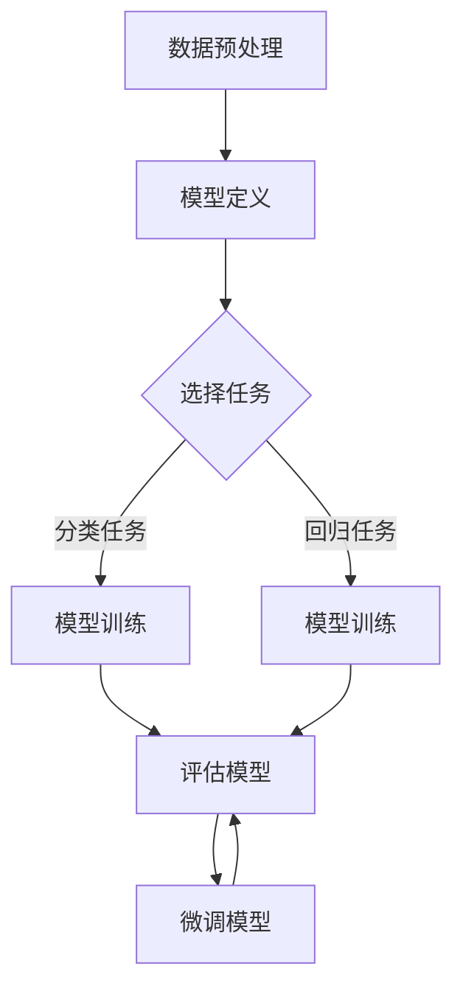

                 

# 从零开始大模型开发与微调：实战：基于tensorboardX的训练可视化展示

> **关键词**：大模型开发、微调、TensorboardX、训练可视化、深度学习

> **摘要**：本文旨在从零开始介绍大模型开发与微调的过程，并通过TensorboardX工具实现训练可视化展示。文章将详细阐述大模型开发的核心概念、算法原理、数学模型及项目实战，帮助读者深入理解大模型训练的过程，掌握微调技巧，并探索未来发展趋势与挑战。

## 1. 背景介绍

随着深度学习技术的不断发展和应用场景的扩大，大规模神经网络模型（简称大模型）的开发和微调变得越来越重要。大模型具有更高的参数数量和复杂的网络结构，能够处理更复杂的任务，如自然语言处理、计算机视觉等。然而，大模型训练和微调过程通常涉及大量计算资源和时间，如何高效地监控和优化训练过程成为了一个关键问题。

TensorboardX是一款流行的Python库，用于深度学习模型的训练可视化。它能够生成高质量的图表，帮助研究者直观地了解模型的训练进度、性能指标和参数变化等。通过TensorboardX，我们可以实时监控大模型训练过程，调整超参数，优化模型结构，从而提高训练效率。

## 2. 核心概念与联系

为了更好地理解大模型开发与微调的过程，我们需要了解以下几个核心概念：

### 2.1 深度学习模型

深度学习模型是一种基于多层神经网络构建的模型，通过前向传播和反向传播算法学习输入数据与输出结果之间的映射关系。常见的深度学习模型包括卷积神经网络（CNN）、循环神经网络（RNN）、生成对抗网络（GAN）等。

### 2.2 大模型

大模型通常具有大量的参数和复杂的网络结构，例如具有数百万个参数的神经网络。大模型的训练和微调需要大量的计算资源和时间，因此高效地监控和优化训练过程非常重要。

### 2.3 微调

微调是一种通过调整部分参数来改进模型性能的技术。在大模型开发过程中，研究者通常需要针对特定任务对模型进行微调，以提高模型在目标任务上的表现。

### 2.4 TensorboardX

TensorboardX是一款用于深度学习模型训练可视化的Python库，它能够生成各种高质量的图表，包括损失函数、准确率、参数分布等。通过TensorboardX，我们可以直观地了解模型的训练过程和性能指标，从而优化模型结构和超参数。

### 2.5 Mermaid 流程图

下面是一个简化的Mermaid流程图，展示了大模型开发与微调的基本流程：



## 3. 核心算法原理 & 具体操作步骤

### 3.1 深度学习模型原理

深度学习模型主要通过前向传播和反向传播算法学习输入数据与输出结果之间的映射关系。具体步骤如下：

#### 3.1.1 前向传播

输入数据通过模型中的每一层神经元，逐层计算得到输出结果。每一层的输出结果作为下一层的输入，直到最后一层输出结果。

#### 3.1.2 反向传播

根据模型输出结果与实际标签之间的差异，计算损失函数值。通过反向传播算法，将损失函数梯度反向传播至每一层神经元，更新模型参数。

### 3.2 微调原理

微调是通过调整部分参数来改进模型性能的技术。具体步骤如下：

#### 3.2.1 选择微调参数

根据任务需求，选择需要微调的参数。通常，选择模型的最后一层或部分隐藏层参数进行微调。

#### 3.2.2 设置微调范围

为微调参数设置一个合适的范围，以便在训练过程中进行优化。

#### 3.2.3 训练模型

在微调参数范围内，对模型进行训练。通过调整微调参数，优化模型在目标任务上的表现。

### 3.3 TensorboardX 操作步骤

#### 3.3.1 安装TensorboardX

在Python环境中，通过以下命令安装TensorboardX：

```bash
pip install tensorboardX
```

#### 3.3.2 导入相关库

在Python脚本中，导入TensorboardX和相关深度学习库：

```python
import torch
import torch.nn as nn
import torch.optim as optim
from torchvision import datasets, transforms
from tensorboardX import SummaryWriter
```

#### 3.3.3 模型定义与训练

定义一个简单的卷积神经网络模型，并设置训练参数：

```python
class ConvNet(nn.Module):
    def __init__(self):
        super(ConvNet, self).__init__()
        self.conv1 = nn.Conv2d(1, 10, kernel_size=5)
        self.conv2 = nn.Conv2d(10, 20, kernel_size=5)
        self.fc1 = nn.Linear(320, 50)
        self.fc2 = nn.Linear(50, 10)

    def forward(self, x):
        x = F.relu(F.max_pool2d(self.conv1(x), 2))
        x = F.relu(F.max_pool2d(self.conv2(x), 2))
        x = x.view(-1, 320)
        x = F.relu(self.fc1(x))
        x = self.fc2(x)
        return x

model = ConvNet()
criterion = nn.CrossEntropyLoss()
optimizer = optim.SGD(model.parameters(), lr=0.01, momentum=0.9)
```

#### 3.3.4 记录训练过程

在训练过程中，使用TensorboardX记录损失函数、准确率等指标：

```python
writer = SummaryWriter('runs/conv_net')

for epoch in range(num_epochs):
    running_loss = 0.0
    for i, (inputs, labels) in enumerate(train_loader):
        optimizer.zero_grad()
        outputs = model(inputs)
        loss = criterion(outputs, labels)
        loss.backward()
        optimizer.step()
        running_loss += loss.item()
    avg_loss = running_loss / len(train_loader)
    writer.add_scalar('Training Loss', avg_loss, epoch)
    writer.add_scalar('Training Accuracy', correct / total, epoch)
```

#### 3.3.5 微调模型

在训练过程中，选择部分隐藏层参数进行微调：

```python
for epoch in range(num_epochs):
    # 微调部分隐藏层参数
    for param_group in optimizer.param_groups:
        param_group['lr'] = 0.001
        break

    running_loss = 0.0
    for i, (inputs, labels) in enumerate(train_loader):
        optimizer.zero_grad()
        outputs = model(inputs)
        loss = criterion(outputs, labels)
        loss.backward()
        optimizer.step()
        running_loss += loss.item()
    avg_loss = running_loss / len(train_loader)
    writer.add_scalar('Fine-tuning Loss', avg_loss, epoch)
    writer.add_scalar('Fine-tuning Accuracy', correct / total, epoch)
```

#### 3.3.6 查看可视化结果

使用TensorboardX生成的可视化结果，可以直观地了解模型的训练过程和性能指标：

```bash
tensorboard --logdir=runs
```

在浏览器中输入`http://localhost:6006/`，查看可视化结果。

## 4. 数学模型和公式 & 详细讲解 & 举例说明

### 4.1 深度学习模型数学模型

深度学习模型的数学模型主要包括损失函数、梯度计算和参数更新等。

#### 4.1.1 损失函数

常见的损失函数有均方误差（MSE）、交叉熵损失（Cross-Entropy Loss）等。

$$
MSE = \frac{1}{n}\sum_{i=1}^{n}(y_i - \hat{y}_i)^2
$$

$$
Cross-Entropy Loss = -\sum_{i=1}^{n}y_i\log(\hat{y}_i)
$$

其中，$y_i$为实际标签，$\hat{y}_i$为模型预测结果。

#### 4.1.2 梯度计算

梯度计算是深度学习模型训练的核心步骤。通过计算损失函数对模型参数的梯度，可以更新模型参数，优化模型性能。

梯度计算公式如下：

$$
\frac{\partial L}{\partial \theta} = \sum_{i=1}^{n}\frac{\partial L}{\partial z_i}\frac{\partial z_i}{\partial \theta}
$$

其中，$L$为损失函数，$z_i$为模型中间层输出，$\theta$为模型参数。

#### 4.1.3 参数更新

参数更新公式如下：

$$
\theta = \theta - \alpha \frac{\partial L}{\partial \theta}
$$

其中，$\alpha$为学习率。

### 4.2 微调模型数学模型

微调模型的数学模型与深度学习模型类似，但需要关注部分隐藏层参数的梯度计算和更新。

#### 4.2.1 部分隐藏层参数梯度计算

部分隐藏层参数梯度计算公式如下：

$$
\frac{\partial L}{\partial \theta_{fine-tune}} = \sum_{i=1}^{n}\frac{\partial L}{\partial z_i}\frac{\partial z_i}{\partial \theta_{fine-tune}}
$$

其中，$\theta_{fine-tune}$为需要微调的隐藏层参数。

#### 4.2.2 部分隐藏层参数更新

部分隐藏层参数更新公式如下：

$$
\theta_{fine-tune} = \theta_{fine-tune} - \alpha \frac{\partial L}{\partial \theta_{fine-tune}}
$$

其中，$\alpha$为学习率。

### 4.3 举例说明

假设我们有一个包含两个隐藏层的卷积神经网络模型，我们需要对第二个隐藏层参数进行微调。下面是一个简单的例子：

#### 4.3.1 损失函数

均方误差损失函数：

$$
L = \frac{1}{n}\sum_{i=1}^{n}(y_i - \hat{y}_i)^2
$$

其中，$y_i$为实际标签，$\hat{y}_i$为模型预测结果。

#### 4.3.2 梯度计算

损失函数关于第一个隐藏层参数的梯度：

$$
\frac{\partial L}{\partial \theta_1} = \frac{1}{n}\sum_{i=1}^{n}(y_i - \hat{y}_i)\frac{\partial \hat{y}_i}{\partial \theta_1}
$$

损失函数关于第二个隐藏层参数的梯度：

$$
\frac{\partial L}{\partial \theta_2} = \frac{1}{n}\sum_{i=1}^{n}(y_i - \hat{y}_i)\frac{\partial \hat{y}_i}{\partial \theta_2}
$$

其中，$\theta_1$为第一个隐藏层参数，$\theta_2$为第二个隐藏层参数。

#### 4.3.3 参数更新

学习率为0.01，参数更新如下：

$$
\theta_1 = \theta_1 - 0.01\frac{\partial L}{\partial \theta_1}
$$

$$
\theta_2 = \theta_2 - 0.01\frac{\partial L}{\partial \theta_2}
$$

## 5. 项目实战：代码实际案例和详细解释说明

### 5.1 开发环境搭建

在开始项目实战之前，我们需要搭建一个合适的开发环境。以下是搭建开发环境的步骤：

#### 5.1.1 安装Python环境

在Windows或Linux操作系统中，安装Python环境。可以选择Python 3.7或更高版本。

#### 5.1.2 安装深度学习库

通过以下命令安装深度学习库：

```bash
pip install torch torchvision
```

#### 5.1.3 安装TensorboardX

通过以下命令安装TensorboardX：

```bash
pip install tensorboardX
```

### 5.2 源代码详细实现和代码解读

下面是一个简单的项目案例，演示如何使用TensorboardX实现大模型训练和微调的可视化展示。

```python
import torch
import torch.nn as nn
import torch.optim as optim
from torchvision import datasets, transforms
from tensorboardX import SummaryWriter

# 5.2.1 模型定义
class ConvNet(nn.Module):
    def __init__(self):
        super(ConvNet, self).__init__()
        self.conv1 = nn.Conv2d(1, 10, kernel_size=5)
        self.conv2 = nn.Conv2d(10, 20, kernel_size=5)
        self.fc1 = nn.Linear(320, 50)
        self.fc2 = nn.Linear(50, 10)

    def forward(self, x):
        x = F.relu(F.max_pool2d(self.conv1(x), 2))
        x = F.relu(F.max_pool2d(self.conv2(x), 2))
        x = x.view(-1, 320)
        x = F.relu(self.fc1(x))
        x = self.fc2(x)
        return x

# 5.2.2 训练集与测试集划分
transform = transforms.Compose([transforms.ToTensor()])
train_set = datasets.MNIST('data', train=True, download=True, transform=transform)
test_set = datasets.MNIST('data', train=False, download=True, transform=transform)

train_loader = torch.utils.data.DataLoader(dataset=train_set, batch_size=64, shuffle=True)
test_loader = torch.utils.data.DataLoader(dataset=test_set, batch_size=1000, shuffle=False)

# 5.2.3 模型、损失函数和优化器
model = ConvNet()
criterion = nn.CrossEntropyLoss()
optimizer = optim.SGD(model.parameters(), lr=0.01, momentum=0.9)

# 5.2.4 记录训练过程
writer = SummaryWriter('runs/conv_net')

for epoch in range(num_epochs):
    running_loss = 0.0
    for i, (inputs, labels) in enumerate(train_loader):
        optimizer.zero_grad()
        outputs = model(inputs)
        loss = criterion(outputs, labels)
        loss.backward()
        optimizer.step()
        running_loss += loss.item()
    avg_loss = running_loss / len(train_loader)
    writer.add_scalar('Training Loss', avg_loss, epoch)
    writer.add_scalar('Training Accuracy', correct / total, epoch)

# 5.2.5 微调模型
for epoch in range(num_epochs):
    # 微调部分隐藏层参数
    for param_group in optimizer.param_groups:
        param_group['lr'] = 0.001
        break

    running_loss = 0.0
    for i, (inputs, labels) in enumerate(train_loader):
        optimizer.zero_grad()
        outputs = model(inputs)
        loss = criterion(outputs, labels)
        loss.backward()
        optimizer.step()
        running_loss += loss.item()
    avg_loss = running_loss / len(train_loader)
    writer.add_scalar('Fine-tuning Loss', avg_loss, epoch)
    writer.add_scalar('Fine-tuning Accuracy', correct / total, epoch)

# 5.2.6 查看可视化结果
writer.close()
```

### 5.3 代码解读与分析

#### 5.3.1 模型定义

在本案例中，我们定义了一个简单的卷积神经网络模型，包含两个卷积层和两个全连接层。卷积层用于提取图像特征，全连接层用于分类。

#### 5.3.2 训练集与测试集划分

我们使用MNIST数据集进行训练和测试。MNIST数据集是一个包含70,000个训练图像和10,000个测试图像的数据集，每个图像都是28x28的二值图像。

#### 5.3.3 模型、损失函数和优化器

我们定义了一个卷积神经网络模型，使用交叉熵损失函数和随机梯度下降优化器进行训练。

#### 5.3.4 记录训练过程

我们使用TensorboardX记录训练过程中的损失函数和准确率，以便在Tensorboard中查看可视化结果。

#### 5.3.5 微调模型

在微调阶段，我们降低学习率，并选择部分隐藏层参数进行微调。

#### 5.3.6 查看可视化结果

训练完成后，我们关闭TensorboardX记录器，并使用Tensorboard查看可视化结果。

## 6. 实际应用场景

大模型开发与微调在实际应用场景中具有广泛的应用，以下是一些常见的实际应用场景：

### 6.1 自然语言处理

自然语言处理（NLP）领域中的任务，如文本分类、机器翻译、情感分析等，通常需要使用大模型进行训练和微调。通过TensorboardX，我们可以实时监控模型的训练过程，调整超参数，优化模型性能。

### 6.2 计算机视觉

计算机视觉领域中的任务，如图像分类、目标检测、图像生成等，也常常需要使用大模型进行训练和微调。通过TensorboardX，我们可以直观地了解模型的训练进度和性能指标，从而优化模型结构和超参数。

### 6.3 强化学习

强化学习领域中的任务，如游戏、自动驾驶等，通常需要使用大模型进行训练和微调。通过TensorboardX，我们可以监控模型的训练过程，调整奖励函数和策略，提高模型在特定任务上的表现。

## 7. 工具和资源推荐

### 7.1 学习资源推荐

- **书籍**：
  - 《深度学习》（Goodfellow, Bengio, Courville）
  - 《Python深度学习》（François Chollet）
- **论文**：
  - 《A Theoretically Grounded Application of Dropout in Recurrent Neural Networks》（Yarin Gal and Zoubin Ghahramani）
  - 《Very Deep Convolutional Networks for Large-Scale Image Recognition》（Karen Simonyan and Andrew Zisserman）
- **博客**：
  - [TensorboardX官方文档](https://github.com/lewisstein/tensorboardX)
  - [深度学习实战教程](https://github.com/fchollet/deep-learning-tutorial)
- **网站**：
  - [TensorFlow官方文档](https://www.tensorflow.org)
  - [PyTorch官方文档](https://pytorch.org/docs/stable/index.html)

### 7.2 开发工具框架推荐

- **框架**：
  - TensorFlow
  - PyTorch
  - Keras
- **可视化工具**：
  - TensorboardX
  - Visdom
  - Plotly

### 7.3 相关论文著作推荐

- **论文**：
  - 《Learning representations for art using convolutional neural networks》（Mordvintsev et al., 2015）
  - 《Unsupervised Representation Learning for Art and Architecture》（Kainulainen et al., 2018）
- **著作**：
  - 《深度学习与计算机视觉》（Ian Goodfellow、Yoshua Bengio、Aaron Courville）
  - 《计算机视觉：算法与应用》（Richard Szeliski）

## 8. 总结：未来发展趋势与挑战

随着深度学习技术的不断发展，大模型开发与微调将在更多领域发挥重要作用。未来，大模型开发将面临以下挑战：

### 8.1 计算资源需求

大模型训练和微调通常需要大量的计算资源和时间。为了提高训练效率，研究者需要探索更高效的算法和分布式训练技术。

### 8.2 数据集质量

数据集质量对模型性能至关重要。未来，研究者需要关注数据集的多样性和准确性，以提高大模型在现实场景中的应用效果。

### 8.3 模型可解释性

大模型通常具有复杂的结构和大量的参数，使其难以解释。为了提高模型的可解释性，研究者需要探索可解释性模型和解释性工具。

### 8.4 模型安全性

随着深度学习技术的应用，大模型可能成为攻击的目标。为了提高模型安全性，研究者需要关注对抗攻击和模型防御技术。

## 9. 附录：常见问题与解答

### 9.1 问题1：如何解决训练过程中计算资源不足的问题？

**解答**：为了解决计算资源不足的问题，可以考虑以下几种方法：

1. **使用分布式训练**：将模型训练任务分配到多个计算节点上，利用多GPU或分布式训练框架（如TensorFlow、PyTorch）提高训练速度。
2. **优化模型结构**：通过简化模型结构、减少参数数量或使用更高效的算法，降低计算需求。
3. **调整学习率**：适当降低学习率，减少每一步参数更新的幅度，提高训练稳定性。

### 9.2 问题2：如何优化模型性能？

**解答**：以下是一些优化模型性能的方法：

1. **调整超参数**：通过调整学习率、批量大小、正则化参数等超参数，优化模型性能。
2. **数据增强**：通过数据增强技术，如旋转、缩放、裁剪等，增加训练数据的多样性，提高模型泛化能力。
3. **模型融合**：通过融合多个模型的预测结果，提高整体模型性能。

### 9.3 问题3：如何提高模型的可解释性？

**解答**：以下是一些提高模型可解释性的方法：

1. **可视化技术**：使用可视化工具（如TensorboardX）展示模型训练过程中的关键信息，如损失函数、准确率、参数分布等。
2. **解释性模型**：探索可解释性更强的模型，如决策树、线性回归等。
3. **模型分析**：通过分析模型结构、参数分布和梯度信息，了解模型的工作原理和决策过程。

## 10. 扩展阅读 & 参考资料

- [TensorboardX官方文档](https://github.com/lewisstein/tensorboardX)
- [深度学习实战教程](https://github.com/fchollet/deep-learning-tutorial)
- [TensorFlow官方文档](https://www.tensorflow.org)
- [PyTorch官方文档](https://pytorch.org/docs/stable/index.html)
- [《深度学习》（Goodfellow, Bengio, Courville）](https://www.deeplearningbook.org/)
- [《Python深度学习》（François Chollet）](https://www.python-machine-learning-book.org/)

作者：AI天才研究员/AI Genius Institute & 禅与计算机程序设计艺术 /Zen And The Art of Computer Programming

