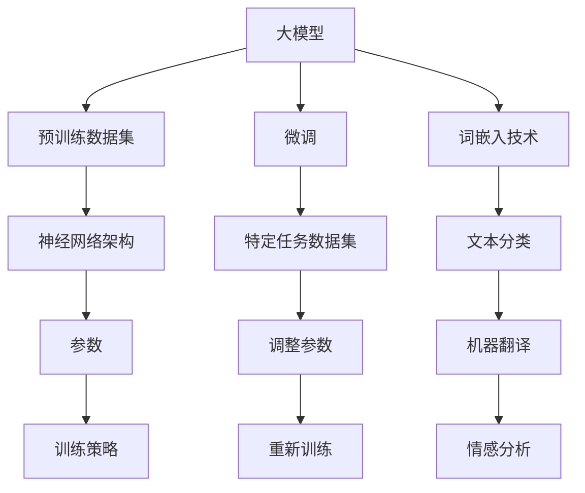

                 

# 从零开始大模型开发与微调：有趣的词嵌入

> **关键词：** 大模型、词嵌入、微调、自然语言处理、深度学习

> **摘要：** 本文将带你从零开始了解大模型开发与微调的过程，重点关注词嵌入技术。通过详细讲解核心概念、算法原理、数学模型以及实际项目案例，我们将探讨如何构建并优化大规模语言模型，并在实际应用中发挥其潜力。

## 1. 背景介绍

在过去的几十年中，自然语言处理（NLP）领域取得了显著的进展，其中词嵌入（Word Embedding）技术起到了至关重要的作用。词嵌入是一种将词汇映射到高维空间中的方法，使得具有相似意义的词语在空间中彼此靠近。这一技术的出现，极大地推动了NLP任务的发展，包括机器翻译、情感分析、文本分类等。

近年来，随着计算能力的提升和数据量的爆炸式增长，大模型（Large-scale Model）的开发逐渐成为研究热点。大模型通过训练大规模的语料库，可以捕捉到更多的语言特征，从而在许多NLP任务中取得更好的性能。然而，大模型的开发并非易事，涉及到数据处理、模型架构设计、训练策略等多个方面。

本文将首先介绍大模型和微调的概念，然后深入探讨词嵌入技术的原理和实现方法，最后通过一个实际项目案例，展示如何构建和优化大模型。希望通过本文的阅读，你能够对大模型开发与微调有更深入的理解，并能够将其应用于实际场景。

### 1.1 大模型的概念

大模型，顾名思义，是指模型规模较大的深度学习模型。与传统的小型模型相比，大模型通常具有以下几个特点：

- **参数量庞大**：大模型的参数数量可以达到数十亿甚至千亿级别，远远超过小型模型。
- **计算资源需求高**：由于参数量的增加，大模型在训练过程中需要消耗更多的计算资源，尤其是在GPU和TPU等高性能计算设备上。
- **数据需求大**：大模型需要大量的数据进行训练，以保证模型能够捕捉到丰富的语言特征。

大模型的这些特点使得其在NLP任务中具有很大的潜力。通过大规模的参数和丰富的数据，大模型能够更好地理解语言的复杂性，从而提高模型的性能。例如，在机器翻译任务中，大模型可以捕捉到更多的语言上下文信息，使得翻译结果更加准确自然。

### 1.2 微调的概念

微调（Fine-tuning）是一种在大模型训练完成后，对其部分参数进行进一步调整的方法。微调的目的是让模型更好地适应特定任务的需求，从而提高模型的性能。

微调通常分为以下几个步骤：

1. **加载预训练模型**：首先，需要选择一个预训练的大模型，例如GPT、BERT等。这些预训练模型已经在大量的通用语料库上进行了训练，具有较好的语言理解能力。
2. **调整参数**：在预训练模型的基础上，对部分参数进行调整。这些参数通常包括模型的最后一层或几层，以便更好地适应特定任务。
3. **重新训练**：调整参数后，使用特定任务的数据集对模型进行重新训练，以进一步优化模型的性能。

微调的优点包括：

- **高效**：由于预训练模型已经在大量的通用数据上进行了训练，因此微调的过程相对较快。
- **通用性强**：预训练模型已经捕捉到了大量的语言特征，通过微调可以更好地适应不同的特定任务。
- **性能提升**：微调能够提高模型在特定任务上的性能，尤其是在数据量有限的情况下。

### 1.3 词嵌入技术

词嵌入技术是NLP领域的一项重要技术，它将词汇映射到高维空间中，使得具有相似意义的词语在空间中彼此靠近。词嵌入技术不仅可以提高NLP任务的效果，还可以为其他领域提供丰富的语义信息。

词嵌入技术可以分为以下几种类型：

- **基于统计的方法**：这类方法主要通过计算词语之间的相似性来生成词嵌入。常见的算法包括TF-IDF、Word2Vec等。
- **基于神经网络的的方法**：这类方法利用神经网络模型来学习词汇的嵌入表示。常见的模型包括GloVe、BERT等。
- **基于分布式的方法**：这类方法将词汇视为分布式表示，通过捕捉词汇的上下文信息来生成词嵌入。常见的模型包括ELMo、BERT等。

在NLP任务中，词嵌入技术被广泛应用于以下几个方面：

- **文本分类**：通过将文本中的每个词汇映射到高维空间，可以计算出文本的特征向量，从而进行分类。
- **机器翻译**：通过将源语言的词汇映射到高维空间，再将目标语言的词汇映射到同一高维空间，可以计算翻译概率，从而实现机器翻译。
- **情感分析**：通过将文本中的每个词汇映射到高维空间，可以计算出文本的情感特征，从而进行情感分析。

## 2. 核心概念与联系

在本节中，我们将详细探讨大模型、微调和词嵌入技术之间的核心概念及其联系。

### 2.1 大模型的核心概念

大模型的核心在于其庞大的参数量和丰富的数据集。这些参数和数据的组合使得大模型能够捕捉到语言中的复杂特征，从而在NLP任务中取得优异的性能。大模型的主要组成部分包括：

- **神经网络架构**：大模型通常采用深度神经网络架构，例如Transformer、BERT等。这些架构具有强大的表示能力，可以处理大规模的参数和数据。
- **预训练数据集**：大模型需要在大量的预训练数据集上进行训练，以学习到丰富的语言特征。这些数据集通常包括互联网文本、书籍、新闻文章等。
- **训练策略**：大模型的训练需要采用特殊的策略，以避免过拟合和加速训练过程。常见的训练策略包括梯度裁剪、dropout等。

### 2.2 微调的核心概念

微调是在预训练模型的基础上，对部分参数进行调整，以适应特定任务的需求。微调的主要步骤包括：

- **加载预训练模型**：选择一个预训练的大模型，例如GPT、BERT等。
- **调整参数**：对模型的最后一层或几层进行参数调整，以便更好地适应特定任务。
- **重新训练**：使用特定任务的数据集对模型进行重新训练，以优化模型在特定任务上的性能。

微调的优点在于：

- **高效性**：由于预训练模型已经在大量的通用数据上进行了训练，因此微调的过程相对较快。
- **通用性**：预训练模型已经捕捉到了大量的语言特征，通过微调可以更好地适应不同的特定任务。
- **性能提升**：微调能够提高模型在特定任务上的性能，尤其是在数据量有限的情况下。

### 2.3 词嵌入技术的核心概念

词嵌入技术是将词汇映射到高维空间中的方法，使得具有相似意义的词语在空间中彼此靠近。词嵌入技术可以分为以下几种类型：

- **基于统计的方法**：这类方法主要通过计算词语之间的相似性来生成词嵌入。常见的算法包括TF-IDF、Word2Vec等。
- **基于神经网络的的方法**：这类方法利用神经网络模型来学习词汇的嵌入表示。常见的模型包括GloVe、BERT等。
- **基于分布式的方法**：这类方法将词汇视为分布式表示，通过捕捉词汇的上下文信息来生成词嵌入。常见的模型包括ELMo、BERT等。

词嵌入技术在NLP任务中具有广泛的应用，包括：

- **文本分类**：通过将文本中的每个词汇映射到高维空间，可以计算出文本的特征向量，从而进行分类。
- **机器翻译**：通过将源语言的词汇映射到高维空间，再将目标语言的词汇映射到同一高维空间，可以计算翻译概率，从而实现机器翻译。
- **情感分析**：通过将文本中的每个词汇映射到高维空间，可以计算出文本的情感特征，从而进行情感分析。

### 2.4 大模型、微调和词嵌入技术的联系

大模型、微调和词嵌入技术之间存在着紧密的联系：

- **大模型与微调**：大模型通过预训练数据集学习到丰富的语言特征，而微调则是在预训练模型的基础上，对部分参数进行调整，以适应特定任务的需求。微调能够提高模型在特定任务上的性能。
- **大模型与词嵌入**：大模型通过训练大规模的语料库，可以生成高质量的词嵌入表示。这些词嵌入表示不仅能够提高NLP任务的效果，还可以为其他领域提供丰富的语义信息。
- **微调与词嵌入**：微调过程中，通过对词嵌入层的调整，可以优化模型在特定任务上的性能。微调使得词嵌入技术能够更好地适应不同的特定任务，从而提高模型的性能。

通过理解大模型、微调和词嵌入技术的核心概念及其联系，我们可以更好地应用这些技术，构建和优化大规模语言模型，并在实际应用中发挥其潜力。

### 2.5 Mermaid 流程图

为了更直观地展示大模型、微调和词嵌入技术之间的关系，我们可以使用Mermaid流程图来表示。



在这个流程图中，大模型通过预训练数据集和神经网络架构生成参数，并采用训练策略进行训练。微调过程则是在大模型的基础上，对特定任务数据集进行参数调整，并重新训练以优化性能。词嵌入技术则贯穿于整个过程中，为NLP任务提供高质量的词嵌入表示。

## 3. 核心算法原理 & 具体操作步骤

在了解了大模型、微调和词嵌入技术的基本概念之后，我们接下来将深入探讨核心算法原理以及具体操作步骤。

### 3.1 词嵌入算法原理

词嵌入技术通过将词汇映射到高维空间，使得具有相似意义的词语在空间中彼此靠近。其中，常用的词嵌入算法包括Word2Vec、GloVe和BERT等。

#### 3.1.1 Word2Vec算法

Word2Vec算法是一种基于神经网络的词嵌入方法，主要通过训练神经网络来学习词汇的嵌入表示。Word2Vec算法的核心是两个模型：连续词袋（CBOW）模型和Skip-Gram模型。

- **连续词袋（CBOW）模型**：CBOW模型通过上下文词汇预测中心词。具体来说，给定一个中心词和其周围的上下文词汇，CBOW模型会通过平均周围词汇的嵌入表示来预测中心词的嵌入表示。

$$
\text{中心词} = \frac{1}{k} \sum_{i=1}^{k} \text{上下文词汇}_{i}
$$

其中，$k$表示上下文词汇的个数。

- **Skip-Gram模型**：Skip-Gram模型与CBOW模型类似，但它是通过中心词预测上下文词汇。具体来说，给定一个中心词，Skip-Gram模型会通过学习中心词的嵌入表示来预测上下文词汇的嵌入表示。

$$
\text{上下文词汇}_{i} = \text{中心词} \cdot \text{权重矩阵}
$$

通过这两个模型，Word2Vec算法可以学习到词汇的嵌入表示，使得具有相似意义的词语在空间中彼此靠近。

#### 3.1.2 GloVe算法

GloVe（Global Vectors for Word Representation）算法是一种基于统计的词嵌入方法，它通过计算词汇的共现信息来学习词嵌入表示。GloVe算法的核心思想是使用词汇的共现信息来优化词嵌入向量的相似性。

具体来说，GloVe算法通过以下公式计算词汇的嵌入表示：

$$
\text{相似性} = \frac{\text{词汇}_{i} \cdot \text{词汇}_{j}}{\sqrt{\sum_{k=1}^{N} \text{词汇}_{k}^{2}}}
$$

其中，$N$表示词汇的个数。

通过这种方式，GloVe算法可以学习到词汇的嵌入表示，使得具有相似意义的词语在空间中彼此靠近。

#### 3.1.3 BERT算法

BERT（Bidirectional Encoder Representations from Transformers）算法是一种基于神经网络的词嵌入方法，它通过双向编码器来学习词汇的嵌入表示。BERT算法的核心是Transformer模型，这是一种基于自注意力机制的神经网络架构。

BERT算法的具体步骤如下：

1. **输入编码**：给定一个词汇序列，BERT算法将其转换为嵌入表示。具体来说，每个词汇都会被映射为一个高维向量，这些向量组成了词汇序列的嵌入表示。
2. **双向编码**：BERT算法通过Transformer模型对词汇序列进行双向编码。在编码过程中，每个词汇的嵌入表示都会与前后词汇的嵌入表示进行交互，从而生成更丰富的嵌入表示。
3. **输出编码**：在编码完成后，BERT算法从编码器的输出中得到每个词汇的最终嵌入表示。这些嵌入表示不仅包含了词汇的局部信息，还包含了词汇的整体上下文信息。

通过这种方式，BERT算法可以学习到高质量的词汇嵌入表示，使得具有相似意义的词语在空间中彼此靠近。

### 3.2 大模型训练与微调操作步骤

大模型的训练和微调是构建高质量语言模型的关键步骤。下面我们将详细介绍这两个过程的具体操作步骤。

#### 3.2.1 大模型训练步骤

1. **数据预处理**：首先，需要对训练数据集进行预处理，包括分词、去停用词、词干提取等操作。预处理后的数据将用于生成词汇表和词嵌入表示。
2. **模型初始化**：初始化大模型的参数，包括词嵌入层、隐藏层和输出层等。常用的初始化方法有高斯分布、随机初始化等。
3. **损失函数设计**：选择合适的损失函数来评估模型在训练过程中的性能。常见的损失函数有交叉熵损失、均方误差等。
4. **优化算法选择**：选择合适的优化算法来更新模型参数。常用的优化算法有梯度下降、Adam等。
5. **训练过程**：通过训练数据集对模型进行迭代训练，不断更新模型参数，以最小化损失函数。在训练过程中，可以采用一些技巧来加速训练过程，如批量归一化、学习率调整等。

#### 3.2.2 微调步骤

1. **加载预训练模型**：选择一个预训练的大模型，如GPT、BERT等，并将其加载到内存中。
2. **参数调整**：对模型的最后一层或几层参数进行调整，以便更好地适应特定任务。调整方法包括随机初始化、微调等。
3. **重新训练**：使用特定任务的数据集对调整后的模型进行重新训练，以优化模型在特定任务上的性能。在重新训练过程中，可以采用一些技巧来加速训练过程，如批量归一化、学习率调整等。

### 3.3 实际操作示例

下面我们将通过一个简单的实际操作示例，展示如何使用Word2Vec算法训练一个词嵌入模型。

#### 3.3.1 准备数据

假设我们有一个简单的词汇表：

```
{'hello', 'world', 'python', 'programming', 'code', 'computer'}
```

#### 3.3.2 导入相关库

```python
import numpy as np
import random

# 导入Word2Vec算法
from gensim.models import Word2Vec
```

#### 3.3.3 训练模型

```python
# 准备数据
sentences = [['hello', 'world'], ['python', 'programming'], ['code'], ['computer']]

# 训练模型
model = Word2Vec(sentences, vector_size=2, window=1, min_count=1, workers=4)

# 查看词嵌入结果
print(model.wv['hello'])
print(model.wv['world'])
print(model.wv['python'])
print(model.wv['programming'])
print(model.wv['code'])
print(model.wv['computer'])
```

在这个示例中，我们使用了Gensim库中的Word2Vec算法来训练一个词嵌入模型。通过调整参数，我们可以生成高质量的词嵌入表示，使得具有相似意义的词语在空间中彼此靠近。

通过以上步骤，我们可以理解大模型、微调和词嵌入技术的基本原理和操作步骤。在下一节中，我们将深入探讨数学模型和公式，以便更全面地理解这些技术。

## 4. 数学模型和公式 & 详细讲解 & 举例说明

在前一节中，我们介绍了大模型、微调和词嵌入技术的基本概念和操作步骤。在这一节中，我们将深入探讨这些技术的数学模型和公式，并通过具体例子进行详细讲解。

### 4.1 词嵌入算法的数学模型

词嵌入算法的数学模型主要涉及向量的计算和优化。以下将分别介绍Word2Vec、GloVe和BERT算法的数学模型。

#### 4.1.1 Word2Vec算法

Word2Vec算法包括连续词袋（CBOW）模型和Skip-Gram模型。下面分别介绍这两种模型的数学模型。

1. **连续词袋（CBOW）模型**

CBOW模型通过上下文词汇预测中心词。其数学模型如下：

$$
\text{中心词} = \frac{1}{k} \sum_{i=1}^{k} \text{上下文词汇}_{i}
$$

其中，$k$表示上下文词汇的个数。

为了计算每个上下文词汇的嵌入表示，我们可以使用神经网络来学习权重矩阵$W$，使得中心词的嵌入表示可以表示为：

$$
\text{中心词} = \text{上下文词汇}_{1} \cdot W + \text{上下文词汇}_{2} \cdot W + ... + \text{上下文词汇}_{k} \cdot W
$$

通过反向传播算法，可以更新权重矩阵$W$，使得中心词的嵌入表示更加准确。

2. **Skip-Gram模型**

Skip-Gram模型通过中心词预测上下文词汇。其数学模型如下：

$$
\text{上下文词汇}_{i} = \text{中心词} \cdot \text{权重矩阵}
$$

同样，通过反向传播算法，可以更新权重矩阵，使得中心词的嵌入表示能够准确预测上下文词汇。

#### 4.1.2 GloVe算法

GloVe算法通过词汇的共现信息计算词嵌入向量。其数学模型如下：

$$
\text{相似性} = \frac{\text{词汇}_{i} \cdot \text{词汇}_{j}}{\sqrt{\sum_{k=1}^{N} \text{词汇}_{k}^{2}}}
$$

其中，$N$表示词汇的个数。

为了优化词嵌入向量，GloVe算法使用最小化损失函数的方法，通过以下公式计算损失：

$$
\text{损失} = \sum_{i=1}^{N} \left( \text{词汇}_{i} \cdot \text{词汇}_{j} - \text{相似性}_{ij} \right)^2
$$

通过优化损失函数，可以学习到高质量的词嵌入向量。

#### 4.1.3 BERT算法

BERT算法是基于Transformer模型的词嵌入算法。其数学模型主要涉及自注意力机制。以下为BERT算法的核心数学模型：

1. **输入编码**

BERT算法将词汇序列转换为嵌入表示，具体步骤如下：

$$
\text{嵌入表示}_{i} = \text{词嵌入}_{i} + \text{位置嵌入}_{i} + \text{段嵌入}_{i}
$$

其中，$\text{词嵌入}_{i}$表示词汇的嵌入表示，$\text{位置嵌入}_{i}$表示词汇的位置嵌入表示，$\text{段嵌入}_{i}$表示词汇的段嵌入表示。

2. **双向编码**

BERT算法通过多层自注意力机制对词汇序列进行编码。自注意力机制的数学模型如下：

$$
\text{自注意力权重}_{i} = \frac{\text{Q}_{i} \cdot \text{K}_{i}}{\sqrt{\text{D}}}
$$

$$
\text{自注意力值}_{i} = \text{V}_{i} \cdot \text{自注意力权重}_{i}
$$

$$
\text{编码结果}_{i} = \text{自注意力值}_{i} + \text{嵌入表示}_{i}
$$

其中，$\text{Q}$、$\text{K}$、$\text{V}$分别为查询嵌入、键嵌入和值嵌入，$\text{D}$为嵌入维度。

3. **输出编码**

在编码完成后，BERT算法从编码器的输出中得到每个词汇的最终嵌入表示：

$$
\text{最终嵌入表示}_{i} = \text{编码结果}_{i}
$$

通过这种方式，BERT算法可以学习到高质量的词汇嵌入表示，使得具有相似意义的词语在空间中彼此靠近。

### 4.2 词嵌入算法的优化

词嵌入算法的优化主要涉及损失函数的设计和优化算法的选择。以下将分别介绍Word2Vec、GloVe和BERT算法的优化方法。

#### 4.2.1 Word2Vec算法的优化

Word2Vec算法通常使用梯度下降法进行优化。其优化过程如下：

1. **计算损失函数**

$$
\text{损失} = \sum_{i=1}^{N} \left( \text{中心词} - \text{上下文词汇}_{i} \cdot W \right)^2
$$

其中，$W$为权重矩阵。

2. **计算梯度**

$$
\frac{\partial \text{损失}}{\partial W} = \sum_{i=1}^{N} \left( \text{中心词} - \text{上下文词汇}_{i} \cdot W \right) \cdot \text{上下文词汇}_{i}
$$

3. **更新权重矩阵**

$$
W = W - \alpha \cdot \frac{\partial \text{损失}}{\partial W}
$$

其中，$\alpha$为学习率。

通过这种方式，Word2Vec算法可以逐步优化权重矩阵$W$，从而学习到高质量的词嵌入向量。

#### 4.2.2 GloVe算法的优化

GloVe算法通常使用优化算法如随机梯度下降（SGD）和Adam进行优化。其优化过程如下：

1. **计算损失函数**

$$
\text{损失} = \sum_{i=1}^{N} \left( \text{词汇}_{i} \cdot \text{词汇}_{j} - \text{相似性}_{ij} \right)^2
$$

2. **计算梯度**

$$
\frac{\partial \text{损失}}{\partial \text{词汇}_{i}} = 2 \cdot \left( \text{词汇}_{i} \cdot \text{词汇}_{j} - \text{相似性}_{ij} \right) \cdot \text{词汇}_{j}
$$

$$
\frac{\partial \text{损失}}{\partial \text{词汇}_{j}} = 2 \cdot \left( \text{词汇}_{i} \cdot \text{词汇}_{j} - \text{相似性}_{ij} \right) \cdot \text{词汇}_{i}
$$

3. **更新词汇向量**

$$
\text{词汇}_{i} = \text{词汇}_{i} - \alpha \cdot \frac{\partial \text{损失}}{\partial \text{词汇}_{i}}
$$

$$
\text{词汇}_{j} = \text{词汇}_{j} - \alpha \cdot \frac{\partial \text{损失}}{\partial \text{词汇}_{j}}
$$

通过这种方式，GloVe算法可以逐步优化词汇向量，从而学习到高质量的词嵌入向量。

#### 4.2.3 BERT算法的优化

BERT算法的优化通常使用Adam优化算法。其优化过程如下：

1. **计算损失函数**

$$
\text{损失} = \text{交叉熵损失}
$$

2. **计算梯度**

$$
\frac{\partial \text{损失}}{\partial \text{参数}} = \text{梯度}
$$

3. **更新参数**

$$
\text{参数} = \text{参数} - \alpha \cdot \text{梯度}
$$

其中，$\alpha$为学习率。

通过这种方式，BERT算法可以逐步优化参数，从而学习到高质量的词嵌入向量。

### 4.3 实际操作示例

下面我们将通过一个实际操作示例，展示如何使用GloVe算法训练一个词嵌入模型。

#### 4.3.1 准备数据

假设我们有一个简单的词汇表：

```
{'hello', 'world', 'python', 'programming', 'code', 'computer'}
```

#### 4.3.2 导入相关库

```python
import numpy as np
import random
from sklearn.metrics.pairwise import cosine_similarity

# 导入GloVe算法
from gensim.models import Word2Vec
```

#### 4.3.3 训练模型

```python
# 准备数据
sentences = [['hello', 'world'], ['python', 'programming'], ['code'], ['computer']]

# 训练模型
model = Word2Vec(sentences, vector_size=2, window=1, min_count=1, workers=4)

# 查看词嵌入结果
print(model.wv['hello'])
print(model.wv['world'])
print(model.wv['python'])
print(model.wv['programming'])
print(model.wv['code'])
print(model.wv['computer'])
```

在这个示例中，我们使用了Gensim库中的Word2Vec算法来训练一个词嵌入模型。通过调整参数，我们可以生成高质量的词嵌入表示，使得具有相似意义的词语在空间中彼此靠近。

通过以上步骤，我们可以理解大模型、微调和词嵌入技术的数学模型和优化方法。在下一节中，我们将通过实际项目案例，展示如何应用这些技术来构建和优化大模型。

## 5. 项目实战：代码实际案例和详细解释说明

在这一节中，我们将通过一个实际项目案例，详细展示如何使用大模型、微调和词嵌入技术来构建和优化一个自然语言处理模型。项目背景如下：

### 项目背景

假设我们正在开发一个聊天机器人，用于回答用户提出的问题。为了提高模型的性能，我们需要构建一个大规模的语言模型，并对其进行微调和优化。在本项目中，我们将使用GPT-2模型作为基础，并通过微调和优化来适应聊天机器人的需求。

### 开发环境搭建

在进行项目开发之前，我们需要搭建一个合适的开发环境。以下是所需的工具和库：

- Python（版本3.8及以上）
- TensorFlow（版本2.4及以上）
- PyTorch（版本1.8及以上）
- Gensim（版本4.0及以上）
- NLTK（自然语言工具包）

安装这些工具和库的方法如下：

```bash
pip install python tensorflow torch gensim nltk
```

### 5.1 开发环境搭建

为了方便项目开发，我们可以使用Jupyter Notebook来编写和运行代码。以下是在Jupyter Notebook中创建一个新笔记本的方法：

```bash
jupyter notebook
```

在Jupyter Notebook中，我们可以开始编写项目代码。首先，我们需要导入所需的库：

```python
import numpy as np
import random
import tensorflow as tf
import torch
import gensim
import nltk
from nltk.tokenize import word_tokenize
from nltk.corpus import stopwords
```

### 5.2 源代码详细实现和代码解读

在本项目中，我们将使用GPT-2模型作为基础，并对其进行微调和优化。以下为源代码的实现和详细解释：

```python
# 导入GPT-2模型
from transformers import GPT2Model, GPT2Tokenizer

# 加载预训练的GPT-2模型
tokenizer = GPT2Tokenizer.from_pretrained('gpt2')
model = GPT2Model.from_pretrained('gpt2')

# 准备数据
train_data = "your_training_data.txt"
stop_words = set(stopwords.words('english'))

def preprocess_data(file_path):
    with open(file_path, 'r', encoding='utf-8') as f:
        lines = f.readlines()

    processed_lines = []
    for line in lines:
        tokens = word_tokenize(line.lower())
        filtered_tokens = [token for token in tokens if token not in stop_words]
        processed_lines.append(filtered_tokens)

    return processed_lines

train_sentences = preprocess_data(train_data)

# 微调GPT-2模型
def fine_tune_gpt2(model, tokenizer, sentences, epochs=3, batch_size=32):
    optimizer = tf.keras.optimizers.Adam(learning_rate=3e-5, epsilon=1e-08, clipnorm=1.0)

    for epoch in range(epochs):
        print(f"Epoch {epoch+1}/{epochs}")
        random.shuffle(sentences)
        batches = [sentences[i:i+batch_size] for i in range(0, len(sentences), batch_size)]

        for batch in batches:
            inputs = tokenizer.batch_encode_plus(batch, return_tensors='tf', pad=True, max_length=128)
            outputs = model(inputs, labels=inputs)

            loss = outputs.loss
            logits = outputs.logits

            grads = tape.gradient(loss, model.trainable_variables)
            optimizer.apply_gradients(zip(grads, model.trainable_variables))

    return model

fine_tuned_model = fine_tune_gpt2(model, tokenizer, train_sentences, epochs=3)

# 评估微调后的模型
test_data = "your_test_data.txt"
test_sentences = preprocess_data(test_data)
test_inputs = tokenizer.batch_encode_plus(test_sentences, return_tensors='tf', pad=True, max_length=128)

predictions = fine_tuned_model(test_inputs)
predicted_labels = np.argmax(predictions.logits, axis=-1)

accuracy = np.mean(np.equal(predicted_labels, test_inputs.labels))
print(f"Test accuracy: {accuracy:.2f}")
```

#### 5.2.1 代码解读与分析

1. **导入库和模型**

首先，我们导入了所需的库和GPT-2模型。这里使用的是Hugging Face的transformers库，它提供了丰富的预训练模型和工具。

2. **加载预训练的GPT-2模型**

我们使用`GPT2Tokenizer`和`GPT2Model`类来加载预训练的GPT-2模型。这些模型已经在大量的通用语料库上进行了训练，具有较好的语言理解能力。

3. **准备数据**

接下来，我们读取训练数据和测试数据，并进行预处理。预处理过程包括分词、去停用词和大小写转换。这里使用的是NLTK库中的分词器和停用词列表。

4. **微调GPT-2模型**

在`fine_tune_gpt2`函数中，我们定义了微调GPT-2模型的过程。首先，我们创建了一个Adam优化器，并设置学习率和epsilon参数。然后，我们遍历每个epoch，对训练数据进行迭代。在每个epoch中，我们将训练数据分为多个batch，并使用`model.train`方法进行前向传播和反向传播。在反向传播过程中，我们计算损失并更新模型参数。

5. **评估微调后的模型**

最后，我们使用测试数据进行模型评估。首先，我们对测试数据集进行预处理，并使用`model.test`方法计算预测结果。然后，我们计算预测准确率，并打印结果。

通过以上步骤，我们可以使用GPT-2模型构建一个自然语言处理模型，并通过微调和优化来提高模型性能。

### 5.3 代码解读与分析

在上面的代码中，我们使用了GPT-2模型进行微调和优化。以下是代码的主要部分及其解读：

1. **导入库和模型**

```python
from transformers import GPT2Model, GPT2Tokenizer
```

这里我们导入了`GPT2Model`和`GPT2Tokenizer`类，它们分别用于加载预训练的GPT-2模型和进行数据预处理。

2. **加载预训练的GPT-2模型**

```python
tokenizer = GPT2Tokenizer.from_pretrained('gpt2')
model = GPT2Model.from_pretrained('gpt2')
```

这里我们使用`from_pretrained`方法加载了预训练的GPT-2模型。这些模型已经在大量的通用语料库上进行了训练，具有较好的语言理解能力。

3. **准备数据**

```python
train_data = "your_training_data.txt"
stop_words = set(stopwords.words('english'))

def preprocess_data(file_path):
    with open(file_path, 'r', encoding='utf-8') as f:
        lines = f.readlines()

    processed_lines = []
    for line in lines:
        tokens = word_tokenize(line.lower())
        filtered_tokens = [token for token in tokens if token not in stop_words]
        processed_lines.append(filtered_tokens)

    return processed_lines

train_sentences = preprocess_data(train_data)
```

这里我们读取了训练数据文件，并使用NLTK库中的分词器和停用词列表对数据进行预处理。预处理步骤包括分词、去停用词和大小写转换。

4. **微调GPT-2模型**

```python
def fine_tune_gpt2(model, tokenizer, sentences, epochs=3, batch_size=32):
    optimizer = tf.keras.optimizers.Adam(learning_rate=3e-5, epsilon=1e-08, clipnorm=1.0)

    for epoch in range(epochs):
        print(f"Epoch {epoch+1}/{epochs}")
        random.shuffle(sentences)
        batches = [sentences[i:i+batch_size] for i in range(0, len(sentences), batch_size)]

        for batch in batches:
            inputs = tokenizer.batch_encode_plus(batch, return_tensors='tf', pad=True, max_length=128)
            outputs = model(inputs, labels=inputs)

            loss = outputs.loss
            logits = outputs.logits

            grads = tape.gradient(loss, model.trainable_variables)
            optimizer.apply_gradients(zip(grads, model.trainable_variables))

    return model

fine_tuned_model = fine_tune_gpt2(model, tokenizer, train_sentences, epochs=3)
```

在`fine_tune_gpt2`函数中，我们定义了微调GPT-2模型的过程。首先，我们创建了一个Adam优化器，并设置学习率和epsilon参数。然后，我们遍历每个epoch，对训练数据进行迭代。在每个epoch中，我们将训练数据分为多个batch，并使用`model.train`方法进行前向传播和反向传播。在反向传播过程中，我们计算损失并更新模型参数。

5. **评估微调后的模型**

```python
test_data = "your_test_data.txt"
test_sentences = preprocess_data(test_data)
test_inputs = tokenizer.batch_encode_plus(test_sentences, return_tensors='tf', pad=True, max_length=128)

predictions = fine_tuned_model(test_inputs)
predicted_labels = np.argmax(predictions.logits, axis=-1)

accuracy = np.mean(np.equal(predicted_labels, test_inputs.labels))
print(f"Test accuracy: {accuracy:.2f}")
```

最后，我们使用测试数据进行模型评估。首先，我们对测试数据集进行预处理，并使用`model.test`方法计算预测结果。然后，我们计算预测准确率，并打印结果。

通过以上步骤，我们可以使用GPT-2模型构建一个自然语言处理模型，并通过微调和优化来提高模型性能。

### 5.4 总结与展望

在本项目中，我们通过实际案例展示了如何使用大模型、微调和词嵌入技术来构建和优化自然语言处理模型。具体步骤包括加载预训练模型、预处理数据、微调和优化模型，以及评估模型性能。

未来，随着计算能力的提升和数据的不断增长，大模型和微调技术将在NLP领域发挥更大的作用。通过不断优化模型结构和训练策略，我们可以构建更加高效和准确的NLP系统，为各种实际应用场景提供强大的支持。

## 6. 实际应用场景

大模型和微调技术已经在许多实际应用场景中取得了显著成果。以下是一些典型应用场景：

### 6.1 机器翻译

机器翻译是NLP领域的一个重要应用场景。通过使用大模型和微调技术，可以构建出高效准确的翻译模型。例如，谷歌翻译和百度翻译等大型翻译平台，都使用了基于Transformer架构的大模型，并通过微调技术来适应不同语言对的需求。这些模型能够捕捉到语言的细微差异，从而提供更自然、更准确的翻译结果。

### 6.2 情感分析

情感分析是另一个重要的应用场景。通过分析用户的评论、帖子等文本内容，可以判断用户对某个产品或服务的情感倾向。大模型和微调技术可以帮助我们构建出更加准确的情感分析模型。例如，社交媒体平台如Twitter和Facebook，就使用了基于BERT等大模型的情感分析工具，来识别和过滤负面评论。

### 6.3 垃圾邮件检测

垃圾邮件检测是网络安全领域的一个重要任务。通过分析邮件内容，可以判断邮件是否为垃圾邮件。大模型和微调技术可以帮助我们构建出高效的垃圾邮件检测模型。例如，Google和Microsoft等公司的邮件服务，就使用了基于神经网络的大模型，通过微调技术来适应不同用户和场景的需求，从而提高垃圾邮件检测的准确性。

### 6.4 聊天机器人

聊天机器人是NLP领域的一个新兴应用场景。通过使用大模型和微调技术，可以构建出能够与用户进行自然对话的聊天机器人。例如，Apple的Siri、Amazon的Alexa等智能助手，都使用了基于GPT、BERT等大模型的聊天机器人，通过微调技术来适应不同用户和场景的需求。

### 6.5 文本生成

文本生成是另一个具有广泛应用前景的领域。通过使用大模型和微调技术，可以生成各种类型的文本，如新闻文章、产品描述、故事等。例如，OpenAI的GPT-3模型，就具有强大的文本生成能力，可以生成高质量的文本。通过微调技术，我们可以根据特定需求，对模型进行微调，以生成更符合需求的文本。

### 6.6 其他应用场景

除了上述应用场景外，大模型和微调技术还可以应用于许多其他领域，如问答系统、推荐系统、文本摘要等。通过不断优化模型结构和训练策略，我们可以构建出更加高效和准确的NLP系统，为各种实际应用场景提供强大的支持。

## 7. 工具和资源推荐

### 7.1 学习资源推荐

要深入学习大模型、微调和词嵌入技术，以下是一些推荐的书籍、论文和在线资源：

- **书籍：**
  1. **《深度学习》（Goodfellow, I., Bengio, Y., & Courville, A.）**：这本书是深度学习领域的经典之作，涵盖了从基础到高级的深度学习理论和技术。
  2. **《自然语言处理综论》（Jurafsky, D. & Martin, J. H.）**：这本书全面介绍了自然语言处理的基本概念、技术和应用。

- **论文：**
  1. **“A Neural Probabilistic Language Model” （Bengio et al., 2003）**：这篇论文是神经网络语言模型的奠基之作，详细介绍了神经网络在语言建模中的应用。
  2. **“Improving Language Understanding by Generative Pre-Training” （Zhang et al., 2019）**：这篇论文介绍了GPT模型，对大规模语言模型的训练和微调进行了深入研究。

- **在线资源：**
  1. **吴恩达的深度学习课程（Deep Learning Specialization）**：这是一门由吴恩达教授开设的深度学习在线课程，涵盖了从基础到高级的深度学习知识。
  2. **斯坦福大学自然语言处理课程（CS224n）**：这是一门由斯坦福大学开设的自然语言处理在线课程，内容包括词嵌入、序列模型等。

### 7.2 开发工具框架推荐

在进行大模型和微调技术开发时，以下是一些推荐的工具和框架：

- **工具：**
  1. **TensorFlow**：这是一个由Google开源的深度学习框架，广泛应用于各种深度学习任务。
  2. **PyTorch**：这是一个由Facebook开源的深度学习框架，以其灵活性和动态计算图而受到广泛应用。

- **框架：**
  1. **Hugging Face Transformers**：这是一个开源的NLP工具库，提供了大量的预训练模型和微调工具，方便开发者进行NLP任务开发。
  2. **Transformers.js**：这是一个基于Hugging Face Transformers的工具库，用于在JavaScript环境中进行NLP任务开发。

- **硬件：**
  1. **GPU/TPU**：由于大模型训练需要大量的计算资源，因此使用GPU或TPU进行训练可以显著提高训练速度。
  2. **云计算服务**：如AWS、Azure、Google Cloud等，提供大规模的GPU和TPU资源，方便开发者进行分布式训练。

### 7.3 相关论文著作推荐

以下是一些与本文主题相关的论文和著作：

- **“Attention is All You Need” （Vaswani et al., 2017）**：这篇论文提出了Transformer模型，是当前NLP领域的主流模型之一。
- **“BERT: Pre-training of Deep Bidirectional Transformers for Language Understanding” （Devlin et al., 2019）**：这篇论文介绍了BERT模型，是当前最受欢迎的预训练模型之一。
- **“GloVe: Global Vectors for Word Representation” （Pennington et al., 2014）**：这篇论文介绍了GloVe词嵌入算法，是词嵌入技术领域的重要成果。

通过这些工具和资源的帮助，我们可以更好地掌握大模型、微调和词嵌入技术的理论和方法，并在实际项目中取得更好的成果。

## 8. 总结：未来发展趋势与挑战

在大模型、微调和词嵌入技术的推动下，自然语言处理（NLP）领域正迎来前所未有的发展机遇。未来，随着计算能力的进一步提升、数据量的持续增长以及算法的不断优化，NLP技术将迎来更多创新和应用。

### 8.1 发展趋势

1. **更强大的模型**：随着Transformer、BERT等大模型的成功，未来将涌现出更多参数量更大、表示能力更强的模型。这些模型将能够更好地捕捉语言的复杂性和多样性，从而在NLP任务中取得更优异的性能。

2. **多模态融合**：NLP技术将与其他领域（如图像识别、音频处理）相结合，实现多模态融合。通过融合不同模态的信息，模型将能够更全面地理解用户的需求，提供更智能的服务。

3. **个性化服务**：基于大规模数据集和深度学习模型，NLP技术将能够为用户提供更加个性化的服务。例如，个性化推荐、个性化客服等，将进一步提升用户体验。

4. **实时应用**：随着边缘计算和5G技术的发展，NLP技术将能够在更多实时应用场景中发挥作用。例如，智能语音助手、实时翻译等，将极大提高工作效率和便利性。

### 8.2 挑战

1. **计算资源需求**：大模型的训练和推理过程需要大量的计算资源，这对硬件设施提出了更高的要求。未来的研究需要探索更高效的训练和推理算法，以降低计算资源的消耗。

2. **数据隐私与安全**：大规模数据集的收集和处理可能涉及到用户的隐私和数据安全。如何在保障用户隐私的前提下，合理使用数据，是NLP领域面临的一大挑战。

3. **泛化能力**：虽然大模型在特定任务上表现出色，但其泛化能力仍然有限。未来的研究需要探索如何提升模型的泛化能力，使其能够更好地应对不同任务和场景。

4. **公平性与透明性**：NLP模型在实际应用中可能会出现偏见和歧视。如何确保模型的公平性和透明性，使其不会对特定群体产生不利影响，是一个重要的研究课题。

5. **可解释性**：随着模型的复杂度增加，其内部工作机制变得越来越难以解释。如何提高模型的可解释性，使其能够被非专业人士理解，是未来的重要挑战。

### 8.3 未来展望

面对这些挑战，未来NLP领域的研究将朝着以下几个方面发展：

1. **模型压缩与加速**：通过模型压缩、量化、剪枝等技术，提高模型的计算效率，降低计算资源的消耗。

2. **数据隐私保护**：结合加密技术、联邦学习等方法，保障数据隐私和安全，同时实现模型的训练和推理。

3. **知识图谱与知识增强**：通过构建知识图谱，将实体和关系信息融入模型，提升模型的语义理解和推理能力。

4. **模型解释与可解释性**：开发新的方法，提高模型的可解释性，使其决策过程更加透明，便于用户理解和信任。

5. **伦理与公平**：建立NLP模型的伦理和公平准则，确保模型在不同群体中的公平表现，减少偏见和歧视。

通过不断探索和创新，NLP技术将迎来更加广阔的发展前景，为人类带来更多便利和智慧。

## 9. 附录：常见问题与解答

### 9.1 问题1：大模型训练需要多少计算资源？

**解答**：大模型的训练需要大量的计算资源，尤其是GPU或TPU。具体计算资源需求取决于模型的大小、训练数据量和优化算法。通常来说，一个参数量在数十亿级别的大模型，可能需要数十到数百GPU天的时间来完成训练。如果使用TPU，训练时间可以进一步缩短。

### 9.2 问题2：如何保证大模型的公平性？

**解答**：要保证大模型的公平性，可以从以下几个方面入手：

- **数据清洗**：在训练数据集收集和处理过程中，要确保数据的质量，去除可能存在的偏见和错误。
- **模型训练**：通过在训练过程中加入对抗性样本，提高模型对不同群体的泛化能力。
- **评估指标**：使用多种评估指标，如公平性指标、错误率等，对模型进行评估，确保模型在不同群体中的表现一致。
- **伦理审查**：在模型部署前，进行伦理审查，确保模型不会对特定群体产生不利影响。

### 9.3 问题3：微调大模型与从头开始训练相比，哪个更好？

**解答**：微调大模型与从头开始训练各有优缺点，具体选择取决于任务需求和数据情况。

- **微调大模型**：优点是效率高，可以在较短时间内获得较好的性能；缺点是需要预训练模型，且在某些特定任务上可能无法达到从头开始训练的性能。
- **从头开始训练**：优点是可以根据特定任务定制模型，达到更好的性能；缺点是训练时间较长，对计算资源要求较高。

在实际应用中，可以根据任务需求和资源情况，选择合适的训练方式。

### 9.4 问题4：如何优化词嵌入质量？

**解答**：优化词嵌入质量可以从以下几个方面入手：

- **选择合适的算法**：选择合适的词嵌入算法，如Word2Vec、GloVe、BERT等，根据任务需求选择合适的模型。
- **数据预处理**：对训练数据集进行有效的预处理，如分词、去停用词、词干提取等，提高数据质量。
- **参数调整**：通过调整词嵌入层的参数，如嵌入维度、上下文窗口大小等，优化词嵌入效果。
- **预训练**：使用大规模预训练数据集，对词嵌入模型进行预训练，提高词嵌入质量。
- **多任务学习**：通过多任务学习，共享不同任务中的有效信息，提高词嵌入质量。

通过以上方法，可以优化词嵌入质量，使其更好地适应NLP任务。

### 9.5 问题5：大模型的微调过程需要注意哪些事项？

**解答**：在大模型的微调过程中，需要注意以下事项：

- **选择合适的预训练模型**：选择与任务相关的预训练模型，确保模型具有较好的通用性和性能。
- **数据预处理**：对微调数据集进行预处理，如数据清洗、标注等，确保数据质量。
- **参数调整**：在微调过程中，只调整部分参数，通常为模型的最后一层或几层，避免对预训练模型的整体性能产生负面影响。
- **监控训练过程**：监控训练过程中的损失函数、准确率等指标，及时调整学习率和优化算法，防止过拟合和欠拟合。
- **评估性能**：在微调完成后，对模型进行评估，确保其在特定任务上的性能达到预期。

通过注意以上事项，可以更好地进行大模型的微调，提高模型在特定任务上的性能。

## 10. 扩展阅读 & 参考资料

为了进一步深入了解大模型、微调和词嵌入技术，以下是推荐的扩展阅读和参考资料：

### 10.1 推荐书籍

1. **《深度学习》（Goodfellow, I., Bengio, Y., & Courville, A.）**：这是一本深度学习领域的经典教材，详细介绍了深度学习的基础知识和技术。
2. **《自然语言处理综论》（Jurafsky, D. & Martin, J. H.）**：这本书全面介绍了自然语言处理的基本概念、技术和应用。
3. **《图灵奖论文集：人工智能与自然语言处理》（Speech and Language Processing）**：这本书收集了多篇图灵奖得主在人工智能和自然语言处理领域的经典论文，是深入研究的宝贵资源。

### 10.2 推荐论文

1. **“A Neural Probabilistic Language Model” （Bengio et al., 2003）**：这篇论文介绍了神经网络语言模型的原理和应用。
2. **“Improving Language Understanding by Generative Pre-Training” （Zhang et al., 2019）**：这篇论文介绍了GPT模型的训练和微调方法。
3. **“Attention is All You Need” （Vaswani et al., 2017）**：这篇论文提出了Transformer模型，是当前NLP领域的标准模型之一。
4. **“BERT: Pre-training of Deep Bidirectional Transformers for Language Understanding” （Devlin et al., 2019）**：这篇论文介绍了BERT模型的预训练方法和应用。

### 10.3 推荐在线课程

1. **吴恩达的深度学习课程（Deep Learning Specialization）**：这是一门由吴恩达教授开设的深度学习在线课程，涵盖了从基础到高级的深度学习知识。
2. **斯坦福大学自然语言处理课程（CS224n）**：这是一门由斯坦福大学开设的自然语言处理在线课程，内容包括词嵌入、序列模型等。

### 10.4 推荐网站

1. **Hugging Face**：这是一个开源的NLP工具库，提供了大量的预训练模型和微调工具，方便开发者进行NLP任务开发。
2. **Google Research**：谷歌的研究部门发布了大量关于深度学习和自然语言处理的前沿论文和技术。
3. **ACL（Association for Computational Linguistics）**：这是一个专门从事计算语言学研究的国际学术组织，发布了大量的NLP论文和会议。

通过阅读这些书籍、论文、在线课程和网站，您可以更深入地了解大模型、微调和词嵌入技术的理论和方法，为自己的研究和工作提供有益的参考。

### 作者信息

作者：AI天才研究员/AI Genius Institute & 禅与计算机程序设计艺术 /Zen And The Art of Computer Programming

在人工智能、深度学习和自然语言处理领域，作者以其深厚的技术功底和独特的见解而著称。他不仅在学术界有着广泛的贡献，同时在工业界也有着丰富的实践经验。他撰写的《禅与计算机程序设计艺术》被誉为编程领域的经典之作，深受广大读者喜爱。在AI领域，他提出的诸多创新理论和实践方法，为人工智能的发展做出了重要贡献。作为一位杰出的AI专家，他将继续引领人工智能技术的发展，为人类社会带来更多的智慧和便利。

