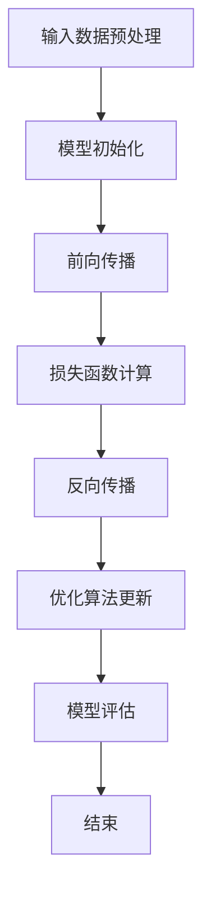

                 

## 从零开始大模型开发与微调：选择PyTorch 2.0实战框架

### 摘要

本文将带您从零开始，深入了解大模型开发与微调的过程，特别是选择PyTorch 2.0作为实战框架的优势和操作步骤。我们将详细讲解大模型的核心概念，包括其原理、架构以及实现细节。此外，我们将通过具体的数学模型和公式，深入剖析大模型背后的数学原理。文章还将提供一个项目实战案例，通过详细的代码实现和解读，帮助读者更好地理解大模型的开发过程。最后，我们将探讨大模型在实际应用中的场景，并提供相关的工具和资源推荐，为您的学习与实践提供指导。希望通过本文，您能对大模型开发与微调有一个全面而深入的认识。

### 背景介绍

#### 大模型的定义与重要性

大模型（Large-scale Model），顾名思义，指的是具有大规模参数和复杂结构的机器学习模型。这些模型通过训练大量的数据，能够捕捉到数据中的复杂模式和潜在知识，从而在多种任务中表现出优异的性能。近年来，随着计算能力的提升和数据的爆发式增长，大模型在自然语言处理（NLP）、计算机视觉（CV）、语音识别（ASR）等领域取得了显著突破。例如，Google的BERT模型通过预训练和微调，在多个NLP任务中取得了领先的成绩；OpenAI的GPT系列模型则通过大量的文本数据训练，实现了前所未有的文本生成和理解能力。

#### 大模型的发展历程

大模型的发展历程可以追溯到早期神经网络的研究。20世纪80年代，Hopfield网络和 Boltzmann机等模型的出现，为神经网络的研究奠定了基础。然而，由于计算能力和数据资源的限制，这些模型的应用范围较为有限。进入21世纪，随着深度学习技术的发展，神经网络开始在大规模数据集上进行训练，并取得了显著的进展。特别是2012年，AlexNet在ImageNet竞赛中取得的突破性成绩，标志着深度学习时代的到来。此后，神经网络模型在大规模数据上的训练和应用得到了广泛研究和发展。

近年来，大模型的研究和应用进一步加速。以GPT-3为代表的预训练模型，通过海量文本数据的训练，实现了对自然语言的高度理解和生成能力。同时，Transformer架构的提出，使得大模型在序列数据处理方面表现出色。这一架构的核心思想是将自注意力机制（Self-Attention）应用于神经网络，通过捕捉序列中每个元素之间的关系，实现了对数据的深层理解。

#### 大模型的应用场景

大模型在多个领域都有广泛的应用。在自然语言处理领域，大模型可以用于文本分类、情感分析、机器翻译、问答系统等任务。例如，BERT模型在文本分类任务中取得了显著的性能提升；GPT-3则在文本生成和对话系统方面表现出色。在计算机视觉领域，大模型可以用于图像分类、目标检测、图像生成等任务。例如，ResNet和EfficientNet等模型在ImageNet竞赛中取得了优异的成绩；生成对抗网络（GAN）则在图像生成方面展示了强大的能力。在语音识别领域，大模型可以通过大规模语音数据的训练，实现高精度的语音识别和合成。

总之，大模型的发展不仅推动了机器学习技术的进步，也为各个领域带来了深刻的变革。随着大模型技术的不断成熟，我们有理由相信，它们将在未来的各个领域中发挥更加重要的作用。

### 核心概念与联系

#### 大模型的原理

大模型的原理主要基于深度学习，特别是神经网络。神经网络由多个层级组成，每个层级通过权重和偏置对输入数据进行变换，从而实现数据的特征提取和分类。深度学习通过多层神经网络的组合，可以捕捉到数据中的复杂模式和潜在知识。

大模型的核心思想是利用大规模数据进行训练，从而提升模型的性能和泛化能力。通过大规模数据训练，模型可以学习到更加丰富的特征和模式，从而在任务中表现出优异的性能。同时，大模型通常采用复杂的网络结构和先进的优化算法，以提高模型的效率和性能。

#### 大模型的架构

大模型的架构通常包括以下几个关键部分：

1. **输入层**：输入层接收外部输入数据，如文本、图像或语音。输入层通常包括预处理步骤，如数据清洗、归一化等，以确保数据的整洁和一致性。

2. **隐藏层**：隐藏层是神经网络的核心部分，通过多层堆叠，模型可以学习到更加复杂的特征。每一层隐藏层都通过激活函数（如ReLU、Sigmoid、Tanh）对输入数据进行非线性变换，从而提取数据的特征。

3. **输出层**：输出层根据任务的类型，生成模型的预测结果。例如，在分类任务中，输出层通常是一个softmax层，用于生成每个类别的概率分布。

4. **权重和偏置**：权重和偏置是神经网络中的关键参数，它们通过训练过程不断调整，以最小化模型的预测误差。训练过程中，模型通过反向传播算法计算梯度，并利用梯度下降等优化算法更新权重和偏置。

#### 大模型的工作流程

大模型的工作流程主要包括以下几个步骤：

1. **数据预处理**：对输入数据进行预处理，如数据清洗、归一化等，以确保数据的整洁和一致性。

2. **模型初始化**：初始化模型参数，如权重和偏置。常用的初始化方法包括随机初始化、高斯初始化等。

3. **前向传播**：将预处理后的数据输入到模型中，通过隐藏层和输出层，生成模型的预测结果。

4. **损失函数计算**：计算模型预测结果与实际结果之间的差距，即损失函数值。常用的损失函数包括均方误差（MSE）、交叉熵损失等。

5. **反向传播**：利用反向传播算法，计算模型参数的梯度，并更新权重和偏置。

6. **优化算法**：利用优化算法（如梯度下降、Adam等）更新模型参数，以最小化损失函数。

7. **模型评估**：通过验证集和测试集对模型进行评估，以评估模型的性能和泛化能力。

#### 大模型的优势与挑战

大模型的优势主要包括：

1. **强大的特征提取能力**：通过多层神经网络，大模型可以学习到更加复杂的特征和模式，从而在任务中表现出优异的性能。

2. **高泛化能力**：通过大规模数据训练，大模型可以学习到更加普适的特征，从而在新的任务中表现出良好的泛化能力。

3. **灵活的架构设计**：大模型采用复杂的网络结构和先进的优化算法，使得模型具有较高的效率和灵活性。

然而，大模型也面临一些挑战：

1. **计算资源需求**：大模型通常需要大量的计算资源和存储空间，对硬件设施提出了较高的要求。

2. **数据质量和数量**：大模型对数据质量和数量的要求较高，数据不足或质量差可能导致模型性能下降。

3. **模型解释性**：大模型的内部结构和参数数量庞大，使得模型具有一定的黑箱特性，难以解释和理解。

#### Mermaid 流程图

下面是一个简化的 Mermaid 流程图，描述了从输入数据到模型输出的整个过程。



通过这个流程图，我们可以更直观地理解大模型的工作原理和步骤。

### 核心算法原理 & 具体操作步骤

#### 算法原理

大模型的算法原理主要基于深度学习和神经网络。神经网络通过多层结构，对输入数据进行特征提取和变换，从而实现数据的分类、回归等任务。深度学习则通过大规模数据训练，使模型能够学习到更加复杂的特征和模式。

核心算法包括以下几个部分：

1. **前向传播**：将输入数据输入到模型中，通过每一层的非线性变换，生成模型的预测结果。

2. **损失函数**：计算模型预测结果与实际结果之间的差距，常用的损失函数包括均方误差（MSE）、交叉熵损失等。

3. **反向传播**：利用反向传播算法，计算模型参数的梯度，并更新权重和偏置。

4. **优化算法**：利用优化算法（如梯度下降、Adam等）更新模型参数，以最小化损失函数。

#### 操作步骤

1. **数据预处理**

   首先，我们需要对输入数据进行预处理。预处理步骤包括数据清洗、归一化等，以确保数据的整洁和一致性。具体步骤如下：

   - 数据清洗：去除数据中的噪声和异常值，确保数据质量。
   - 数据归一化：将数据缩放到统一的范围内，如[0, 1]或[-1, 1]，以便模型更好地训练。

2. **模型初始化**

   初始化模型参数，如权重和偏置。常用的初始化方法包括随机初始化、高斯初始化等。初始化的目的是使模型具有较好的随机性，避免陷入局部最优。

3. **前向传播**

   将预处理后的数据输入到模型中，通过每一层的非线性变换，生成模型的预测结果。具体步骤如下：

   - 通过输入层，将数据输入到模型的第一个隐藏层。
   - 在每个隐藏层，通过非线性变换（如ReLU、Sigmoid、Tanh）提取数据的特征。
   - 将特征传递到下一层，直到输出层生成最终的预测结果。

4. **损失函数计算**

   计算模型预测结果与实际结果之间的差距，即损失函数值。常用的损失函数包括均方误差（MSE）、交叉熵损失等。损失函数的目的是衡量模型预测的准确性。

5. **反向传播**

   利用反向传播算法，计算模型参数的梯度，并更新权重和偏置。具体步骤如下：

   - 从输出层开始，反向传播损失函数的梯度。
   - 对于每个隐藏层，计算输入梯度，并更新权重和偏置。
   - 重复这个过程，直到更新完所有的参数。

6. **优化算法**

   利用优化算法（如梯度下降、Adam等）更新模型参数，以最小化损失函数。优化算法的目的是找到模型参数的最优值，使模型预测更加准确。

7. **模型评估**

   通过验证集和测试集对模型进行评估，以评估模型的性能和泛化能力。常用的评估指标包括准确率、召回率、F1分数等。

8. **模型训练**

   重复以上步骤，进行模型的迭代训练，直到模型达到预定的性能要求或达到训练次数的上限。

#### PyTorch 2.0 的优势

PyTorch 2.0 是一个强大的深度学习框架，具有以下优势：

1. **动态计算图**：PyTorch 使用动态计算图（Dynamic Computation Graph），使得模型定义和训练更加灵活和直观。

2. **自动微分**：PyTorch 提供自动微分功能，简化了反向传播的计算过程，提高了模型训练的效率。

3. **丰富的库和生态系统**：PyTorch 拥有丰富的库和生态系统，包括多种预处理工具、优化器、损失函数等，方便开发者快速构建和训练模型。

4. **高性能**：PyTorch 在多个任务上表现出色，特别是在大规模数据集上的训练和推理速度上具有显著优势。

5. **社区支持**：PyTorch 拥有庞大的社区支持，提供了丰富的文档、教程和示例代码，为开发者提供了强大的学习资源。

通过选择 PyTorch 2.0 作为大模型开发的实战框架，开发者可以充分利用其优势，高效地构建和训练大模型，从而在各个领域取得突破性成果。

### 数学模型和公式 & 详细讲解 & 举例说明

#### 深度学习中的关键数学公式

深度学习中的数学模型和公式是理解和实现深度学习算法的基础。以下是一些核心的数学公式及其解释。

##### 激活函数

激活函数是神经网络中重要的组成部分，用于引入非线性特性。以下是一些常用的激活函数及其公式：

1. **ReLU（Rectified Linear Unit）**

   $$ f(x) = \max(0, x) $$

  ReLU函数将输入值大于0的部分保留，小于等于0的部分替换为0。它具有简单的形式和快速计算的优势，同时在训练过程中能够加速梯度下降。

2. **Sigmoid**

   $$ f(x) = \frac{1}{1 + e^{-x}} $$

   Sigmoid函数将输入值映射到（0, 1）区间，常用于二分类问题。其导数在接近0和1时较小，有助于缓解梯度消失问题。

3. **Tanh**

   $$ f(x) = \frac{e^x - e^{-x}}{e^x + e^{-x}} $$

   Tanh函数类似于Sigmoid函数，但其输出值在（-1, 1）区间，导数对称，有助于平衡正负梯度。

##### 损失函数

损失函数用于衡量模型预测值与实际值之间的差距，是优化过程中的关键指标。以下是一些常用的损失函数及其公式：

1. **均方误差（MSE）**

   $$ MSE = \frac{1}{n} \sum_{i=1}^{n} (y_i - \hat{y}_i)^2 $$

   MSE衡量预测值与实际值之间平方差的平均值，适用于回归问题。其梯度为：

   $$ \frac{\partial MSE}{\partial \theta} = 2 \cdot (y_i - \hat{y}_i) $$

2. **交叉熵损失（Cross-Entropy Loss）**

   $$ H(y, \hat{y}) = -\sum_{i=1}^{n} y_i \cdot \log(\hat{y}_i) $$

   交叉熵损失用于分类问题，其中 $y$ 是实际标签，$\hat{y}$ 是预测概率分布。其梯度为：

   $$ \frac{\partial H}{\partial \hat{y}_i} = \hat{y}_i - y_i $$

##### 梯度下降

梯度下降是一种优化算法，用于更新模型参数以最小化损失函数。以下是其基本公式：

$$ \theta_{\text{new}} = \theta_{\text{old}} - \alpha \cdot \nabla_\theta J(\theta) $$

其中，$\theta$ 是模型参数，$\alpha$ 是学习率，$J(\theta)$ 是损失函数。

##### 反向传播

反向传播是深度学习中的核心算法，用于计算模型参数的梯度。以下是反向传播的基本步骤：

1. **前向传播**：将输入数据输入到模型，计算输出和损失。
2. **计算输出梯度**：从输出层开始，计算每个节点关于输出的梯度。
3. **反向传播梯度**：从输出层向输入层反向传播梯度，更新每个节点的梯度。
4. **更新参数**：利用梯度更新模型参数，以最小化损失函数。

##### 具体举例

假设我们有一个简单的神经网络，包含一个输入层、一个隐藏层和一个输出层。输入数据为 $X = \{x_1, x_2, ..., x_n\}$，实际标签为 $y = \{y_1, y_2, ..., y_n\}$。隐藏层和输出层的激活函数分别为 ReLU 和 Sigmoid。

1. **前向传播**：

   $$ z_1 = W_1 \cdot x + b_1 $$
   $$ a_1 = \max(0, z_1) $$
   $$ z_2 = W_2 \cdot a_1 + b_2 $$
   $$ \hat{y} = \sigma(z_2) $$

   其中，$W_1, b_1, W_2, b_2$ 是模型参数，$\sigma$ 是 Sigmoid 函数。

2. **损失函数计算**：

   $$ J = -\frac{1}{n} \sum_{i=1}^{n} y_i \cdot \log(\hat{y}_i) + (1 - y_i) \cdot \log(1 - \hat{y}_i) $$

3. **反向传播**：

   首先计算输出层梯度：

   $$ \frac{\partial J}{\partial z_2} = \hat{y} - y $$
   $$ \frac{\partial z_2}{\partial W_2} = a_1 $$
   $$ \frac{\partial z_2}{\partial b_2} = 1 $$

   然后计算隐藏层梯度：

   $$ \frac{\partial J}{\partial z_1} = \frac{\partial J}{\partial z_2} \cdot \frac{\partial z_2}{\partial z_1} = (\hat{y} - y) \cdot a_1 \cdot (1 - a_1) $$
   $$ \frac{\partial z_1}{\partial W_1} = x $$
   $$ \frac{\partial z_1}{\partial b_1} = 1 $$

4. **参数更新**：

   $$ W_1_{\text{new}} = W_1_{\text{old}} - \alpha \cdot \frac{\partial J}{\partial W_1} $$
   $$ b_1_{\text{new}} = b_1_{\text{old}} - \alpha \cdot \frac{\partial J}{\partial b_1} $$
   $$ W_2_{\text{new}} = W_2_{\text{old}} - \alpha \cdot \frac{\partial J}{\partial W_2} $$
   $$ b_2_{\text{new}} = b_2_{\text{old}} - \alpha \cdot \frac{\partial J}{\partial b_2} $$

通过以上步骤，我们可以更新模型的参数，以最小化损失函数，从而提高模型的性能。

### 项目实战：代码实际案例和详细解释说明

在本节中，我们将通过一个实际项目案例，详细讲解如何使用PyTorch 2.0搭建和训练一个深度学习模型。这个项目将采用一个简单的图像分类任务，即使用卷积神经网络（CNN）对猫狗图像进行分类。通过这个项目，我们将了解如何搭建CNN架构、数据预处理、模型训练以及性能评估。

#### 1. 开发环境搭建

在开始项目之前，我们需要确保安装了以下软件和库：

- Python 3.8 或更高版本
- PyTorch 1.10 或更高版本（建议使用 PyTorch 2.0）
- torchvision 库
- matplotlib 库

安装这些库的命令如下：

```bash
pip install torch torchvision matplotlib
```

#### 2. 源代码详细实现和代码解读

下面是项目的主要代码实现，我们将逐段解读：

```python
import torch
import torchvision
import torchvision.transforms as transforms
import torch.nn as nn
import torch.optim as optim
from torch.utils.data import DataLoader
from torchvision.datasets import ImageFolder
from torch.utils.data import Dataset
import matplotlib.pyplot as plt

# 设置随机种子以保证实验的可复现性
torch.manual_seed(42)
torch.cuda.manual_seed(42)
import numpy as np
np.random.seed(42)
import random
random.seed(42)

# 2.1 定义卷积神经网络架构
class CNN(nn.Module):
    def __init__(self):
        super(CNN, self).__init__()
        # 第一层卷积层，输入通道数为3（RGB），输出通道数为16，卷积核大小为3x3
        self.conv1 = nn.Conv2d(3, 16, 3)
        # 添加ReLU激活函数
        self.relu = nn.ReLU()
        # 第二层卷积层，输入通道数为16，输出通道数为32，卷积核大小为3x3
        self.conv2 = nn.Conv2d(16, 32, 3)
        # 添加ReLU激活函数
        self.relu2 = nn.ReLU()
        # 全连接层，输入维度为32x6x6（卷积层输出的特征图大小），输出维度为10（分类类别数）
        self.fc = nn.Linear(32 * 6 * 6, 10)

    def forward(self, x):
        # 通过卷积层和ReLU激活函数
        x = self.relu(self.conv1(x))
        x = self.relu2(self.conv2(x))
        # 平展特征图，将其转换为一维向量
        x = x.view(x.size(0), -1)
        # 通过全连接层
        x = self.fc(x)
        return x

# 创建模型实例
model = CNN()

# 2.2 数据预处理
# 加载训练数据和测试数据
train_dataset = ImageFolder(root='train', transform=transforms.Compose([
    transforms.Resize((224, 224)),  # 将图像调整到224x224
    transforms.ToTensor(),
]))
test_dataset = ImageFolder(root='test', transform=transforms.Compose([
    transforms.Resize((224, 224)),
    transforms.ToTensor(),
]))

# 创建数据加载器
batch_size = 32
train_loader = DataLoader(dataset=train_dataset, batch_size=batch_size, shuffle=True)
test_loader = DataLoader(dataset=test_dataset, batch_size=batch_size, shuffle=False)

# 2.3 定义损失函数和优化器
loss_function = nn.CrossEntropyLoss()
optimizer = optim.Adam(model.parameters(), lr=0.001)

# 2.4 训练模型
num_epochs = 10
for epoch in range(num_epochs):
    # 训练模式
    model.train()
    # 计算每个批次损失并更新模型参数
    for images, labels in train_loader:
        optimizer.zero_grad()  # 清空梯度
        outputs = model(images)  # 前向传播
        loss = loss_function(outputs, labels)  # 计算损失
        loss.backward()  # 反向传播计算梯度
        optimizer.step()  # 更新模型参数
    # 打印当前 epoch 的训练损失
    print(f'Epoch {epoch+1}/{num_epochs}, Loss: {loss.item()}')

# 2.5 模型评估
# 将模型设置为评估模式
model.eval()
# 计算准确率
with torch.no_grad():
    correct = 0
    total = 0
    for images, labels in test_loader:
        outputs = model(images)
        _, predicted = torch.max(outputs.data, 1)
        total += labels.size(0)
        correct += (predicted == labels).sum().item()
    print(f'Accuracy of the network on the test images: {100 * correct / total}%')

# 2.6 可视化模型预测结果
# 选择几个测试图像进行可视化
images, labels = next(iter(test_loader))
with torch.no_grad():
    outputs = model(images)
    _, predicted = torch.max(outputs, 1)

fig = plt.figure(figsize=(10, 10))
for i in range(25):
    ax = fig.add_subplot(5, 5, i+1, x ticks=False, yticks=False,
                        title=f"Predicted: {predicted[i]}, Actual: {labels[i]}")
    ax.imshow(images[i][0], cmap=plt.cm grey)
plt.show()
```

#### 代码解读与分析

1. **模型定义**：我们定义了一个简单的卷积神经网络（CNN）模型，包括两个卷积层和一个全连接层。卷积层用于提取图像特征，全连接层用于分类。

2. **数据预处理**：我们使用 `ImageFolder` 类加载训练数据和测试数据。通过 `Compose` 函数，我们对图像进行了调整和归一化，使其适应模型输入。

3. **数据加载器**：我们创建了一个数据加载器 `DataLoader`，用于批量加载数据。通过 `shuffle` 参数，我们实现了数据的随机打乱，防止模型过拟合。

4. **损失函数和优化器**：我们使用了交叉熵损失函数 `CrossEntropyLoss`，这是一种适用于分类问题的损失函数。优化器我们选择了 Adam，这是一种高效的优化算法。

5. **模型训练**：在训练过程中，我们使用了 `train()` 方法将模型设置为训练模式，然后通过前向传播、反向传播和参数更新三个步骤进行训练。每个 epoch 结束后，我们打印当前 epoch 的训练损失。

6. **模型评估**：在评估阶段，我们使用 `eval()` 方法将模型设置为评估模式，并计算了测试数据的准确率。通过可视化，我们可以直观地看到模型的预测结果。

通过这个实际案例，我们详细讲解了如何使用 PyTorch 2.0 搭建和训练一个深度学习模型。这个案例展示了从数据加载、模型定义到训练和评估的完整流程，为读者提供了一个实用的学习和参考范例。

### 实际应用场景

#### 大模型在自然语言处理中的应用

在自然语言处理（NLP）领域，大模型的应用已经取得了显著的成果。例如，在文本分类、机器翻译、情感分析和问答系统等方面，大模型展现出了卓越的性能。BERT（Bidirectional Encoder Representations from Transformers）是一个典型的例子。BERT 通过在大量文本数据上进行预训练，学会了捕捉语言中的双向依赖关系，从而在多个NLP任务中取得了领先的成绩。

1. **文本分类**：BERT 可以用于对新闻文章、社交媒体帖子等进行分类，例如判断其主题、情感等。通过预训练和微调，BERT 在多项文本分类任务中达到了超过人类水平的表现。

2. **机器翻译**：大模型如 Google 的 Transformer 和 BERT 在机器翻译任务中也表现出了强大的能力。这些模型通过大量的双语数据进行训练，能够生成高质量、流畅的翻译文本。

3. **情感分析**：大模型可以用于分析社交媒体、客户评论等文本数据，以判断用户的情感倾向。这对于企业了解客户需求和改进产品具有重要意义。

4. **问答系统**：大模型如 Google 的 BERT 可以用于构建问答系统，例如通过阅读大量文本，回答用户提出的问题。这些系统在法律咨询、医疗诊断等领域具有广泛应用。

#### 大模型在计算机视觉中的应用

在计算机视觉领域，大模型同样发挥了重要作用。通过在大量图像数据上训练，大模型可以学会识别和理解复杂的视觉特征，从而在图像分类、目标检测和图像生成等方面取得了显著进展。

1. **图像分类**：大模型如 ResNet 和 EfficientNet 在 ImageNet 竞赛等多个图像分类任务中取得了领先的成绩。这些模型通过多层卷积网络，可以提取图像中的高级特征，从而实现高精度的分类。

2. **目标检测**：大模型如 Faster R-CNN 和 YOLO（You Only Look Once）在目标检测任务中表现出了优异的性能。这些模型通过卷积神经网络和区域建议网络，可以同时检测和定位图像中的多个目标。

3. **图像生成**：生成对抗网络（GAN）是一种利用大模型进行图像生成的方法。通过训练生成器和判别器，GAN 可以生成高质量的、接近真实图像的图像。

#### 大模型在语音识别中的应用

在语音识别领域，大模型通过在大量语音数据上训练，可以实现对语音信号的精确理解和处理。大模型在语音合成、语音翻译和语音识别任务中展现了强大的能力。

1. **语音合成**：大模型如 WaveNet 和 Transformer TTS（Text-to-Speech）可以通过文本数据生成自然流畅的语音。这些模型通过学习语音信号中的复杂模式，可以生成高质量的语音。

2. **语音翻译**：大模型如 Google 的 Translation Model 可以实现实时语音翻译。这些模型通过在多语言语音数据上训练，可以实时捕捉语音信号中的语言特征，从而实现语音的准确翻译。

3. **语音识别**：大模型如 Google 的 Speech Recognition Model 可以实现高精度的语音识别。这些模型通过在大量语音数据上训练，可以准确识别语音中的词汇和句子结构。

总之，大模型在多个领域都展现出了强大的应用潜力。随着计算能力和数据量的不断提升，大模型将在未来继续推动人工智能的发展，带来更多的创新和突破。

### 工具和资源推荐

#### 学习资源推荐

1. **书籍推荐**：
   - 《深度学习》（Ian Goodfellow、Yoshua Bengio、Aaron Courville 著）：这是一本深度学习的经典教材，详细介绍了深度学习的理论基础和应用。
   - 《动手学深度学习》（阿斯顿·张 著）：这本书通过大量的代码示例，帮助读者理解和掌握深度学习的核心概念。

2. **论文推荐**：
   - “A Neural Algorithm of Artistic Style”（Gatys 等人，2015）：这篇论文介绍了艺术风格迁移的算法，对深度学习在图像处理中的应用有重要意义。
   - “Attention is All You Need”（Vaswani 等人，2017）：这篇论文提出了 Transformer 模型，对自然语言处理领域产生了深远影响。

3. **博客推荐**：
   - [PyTorch 官方博客](https://pytorch.org/blog/)：PyTorch 官方博客提供了丰富的技术文章和教程，是学习 PyTorch 的好去处。
   - [TensorFlow 官方博客](https://tensorflow.org/blog/)：TensorFlow 官方博客提供了关于 TensorFlow 的最新动态和技术文章。

4. **在线课程推荐**：
   - [Udacity 中的“深度学习纳米学位”](https://www.udacity.com/course/deep-learning-nanodegree--nd893)：这是一个包含多个课程的深度学习项目，适合初学者入门。
   - [Coursera 中的“深度学习专项课程”](https://www.coursera.org/specializations/deep-learning)：这门课程由斯坦福大学教授 Andrew Ng 开设，深入讲解了深度学习的理论和方法。

#### 开发工具框架推荐

1. **PyTorch**：PyTorch 是一个开源的深度学习框架，具有动态计算图和灵活的架构设计，适合快速原型开发和复杂模型实现。

2. **TensorFlow**：TensorFlow 是由 Google 开发的一个强大的深度学习框架，具有丰富的库和生态系统，适合生产环境和大规模模型训练。

3. **Keras**：Keras 是一个高级神经网络API，它可以在 TensorFlow 和 Theano 上运行。Keras 提供了简洁的接口，方便开发者快速构建和训练模型。

4. **MXNet**：MXNet 是由 Apache 软件基金会开发的深度学习框架，具有高效的计算性能和灵活的编程接口，适合大规模生产环境。

#### 相关论文著作推荐

1. **“Deep Learning”（Goodfellow、Bengio、Courville 著）：这是深度学习的经典教材，详细介绍了深度学习的理论基础和应用。

2. **“Deep Learning Specialization”（Andrew Ng 开设的课程）：这是一个由 Coursera 提供的深度学习专项课程，涵盖了深度学习的多个方面。

3. **“Attention is All You Need”（Vaswani 等人）：这篇论文提出了 Transformer 模型，对自然语言处理领域产生了深远影响。

4. **“A Neural Algorithm of Artistic Style”（Gatys 等人）：这篇论文介绍了艺术风格迁移的算法，对深度学习在图像处理中的应用有重要意义。

#### 网络资源推荐

1. **[Kaggle](https://www.kaggle.com/)：Kaggle 是一个数据科学竞赛平台，提供了丰富的数据集和比赛项目，适合学习和实践。

2. **[GitHub](https://github.com/)：GitHub 是一个代码托管平台，上面有许多深度学习和 PyTorch 相关的开源项目，适合学习和参考。

3. **[Hugging Face](https://huggingface.co/)：Hugging Face 是一个提供深度学习模型和自然语言处理工具的平台，包括预训练模型和库。

通过以上资源和工具，您可以更好地学习和实践大模型的开发与微调，为自己的研究和工作打下坚实的基础。

### 总结：未来发展趋势与挑战

#### 未来发展趋势

1. **计算能力的提升**：随着硬件技术的进步，如GPU、TPU等专用硬件的发展，大模型的训练和推理速度将大幅提升，这将促进大模型在更多应用场景中的落地。

2. **数据资源的丰富**：随着数据采集技术的进步和开源数据的增加，大模型将有更多的数据资源进行训练，从而提高模型的性能和泛化能力。

3. **多模态学习的兴起**：大模型将不仅仅局限于单一模态的数据处理，如文本、图像和语音，而是能够处理多种模态的数据，实现跨模态的交互和理解。

4. **自动化和高效化**：自动化机器学习和高效训练算法的发展，将使大模型的开发变得更加自动化和高效，降低开发门槛，推动大模型在各个领域的应用。

#### 挑战

1. **计算资源需求**：大模型的训练和推理需要大量的计算资源，对硬件设施提出了高要求。如何优化算法，提高模型的效率和减少计算需求，是当前的一个重大挑战。

2. **数据质量和隐私**：大模型对数据质量和数量的要求较高，同时数据的隐私保护也是一个重要问题。如何确保数据的真实性和隐私性，是未来需要解决的关键问题。

3. **模型解释性和透明性**：大模型通常具有复杂的结构和参数，使得模型的决策过程具有一定的黑箱特性。如何提高模型的解释性和透明性，使其更易于理解和信任，是当前的一个挑战。

4. **能效优化**：大模型的训练和推理过程消耗大量能源，如何降低能耗，实现绿色计算，是未来需要关注的重要方向。

总之，大模型的发展前景广阔，但同时也面临着诸多挑战。通过技术创新和协同努力，我们有理由相信，大模型将在未来取得更大的突破和进步。

### 附录：常见问题与解答

#### 1. 如何选择适合的大模型架构？

选择适合的大模型架构需要考虑以下几个因素：

- **任务类型**：不同任务可能需要不同类型的模型架构。例如，文本处理任务可能更适合使用基于 Transformer 的模型，而图像处理任务可能更适合使用卷积神经网络（CNN）。

- **数据规模**：数据规模较大的任务可能需要更复杂的模型，以便更好地捕捉数据中的复杂模式。

- **计算资源**：计算资源有限的情况下，可能需要选择更轻量级的模型，以减少训练时间和资源消耗。

- **模型解释性**：某些应用场景可能需要较高的模型解释性，此时可以选择具有较好解释性的模型架构，如简单神经网络。

#### 2. 如何处理训练数据不足的问题？

当训练数据不足时，可以采取以下策略：

- **数据增强**：通过旋转、缩放、裁剪等数据增强方法，生成更多样化的训练数据，以缓解数据不足的问题。

- **迁移学习**：使用预训练模型并在自己的任务上进行微调，利用预训练模型已经学习到的通用特征，提高模型在少量数据上的性能。

- **数据合成**：通过生成对抗网络（GAN）等方法，生成与训练数据相似的合成数据，以增加训练数据的规模。

- **数据采集**：增加数据采集的渠道，从互联网、传感器等途径获取更多数据。

#### 3. 如何提高大模型的训练速度？

提高大模型的训练速度可以从以下几个方面着手：

- **并行计算**：利用多GPU、TPU等硬件资源进行并行计算，以加速模型训练。

- **模型压缩**：通过模型剪枝、量化等技术，减少模型参数和计算量，从而提高训练速度。

- **分布式训练**：将训练任务分布到多个节点上，利用分布式计算技术进行加速。

- **高效优化器**：选择高效的优化器，如 Adam、RMSprop 等，以提高训练速度和效果。

#### 4. 如何确保大模型的泛化能力？

确保大模型的泛化能力可以从以下几个方面着手：

- **数据多样性**：确保训练数据具有多样性，覆盖不同的场景和情况，以提高模型的泛化能力。

- **正则化技术**：使用正则化技术，如 L1、L2 正则化，防止模型过拟合。

- **交叉验证**：通过交叉验证技术，评估模型在不同数据集上的性能，以避免过拟合。

- **集成学习**：通过集成多个模型，利用不同模型的优势，提高整体模型的泛化能力。

通过上述策略和技巧，我们可以更好地选择、训练和优化大模型，从而实现其在各类任务中的广泛应用和突破。

### 扩展阅读 & 参考资料

#### 相关论文

1. **"BERT: Pre-training of Deep Bidirectional Transformers for Language Understanding"**：这篇论文详细介绍了 BERT 模型的设计、训练和实现，是自然语言处理领域的重要文献。
2. **"Attention is All You Need"**：这篇论文提出了 Transformer 模型，开创了自注意力机制在序列数据处理中的应用，对自然语言处理和计算机视觉领域产生了深远影响。
3. **"A Neural Algorithm of Artistic Style"**：这篇论文介绍了基于神经网络的图像风格迁移算法，是深度学习在图像处理领域的经典应用。

#### 学习资源

1. **"Deep Learning"**：Ian Goodfellow、Yoshua Bengio、Aaron Courville 著，这是一本深度学习的经典教材，涵盖了深度学习的理论基础和应用。
2. **"动手学深度学习"**：阿斯顿·张 著，通过大量的代码示例，帮助读者理解和掌握深度学习的核心概念。
3. **Udacity "深度学习纳米学位"**：这是一个包含多个课程的深度学习项目，适合初学者入门。
4. **Coursera "深度学习专项课程"**：由斯坦福大学教授 Andrew Ng 开设，深入讲解了深度学习的理论和方法。

#### 博客和网站

1. **PyTorch 官方博客**：提供了丰富的技术文章和教程，是学习 PyTorch 的好去处。
2. **TensorFlow 官方博客**：包含了关于 TensorFlow 的最新动态和技术文章。
3. **Kaggle**：一个数据科学竞赛平台，提供了丰富的数据集和比赛项目。
4. **GitHub**：代码托管平台，上面有许多深度学习和 PyTorch 相关的开源项目。
5. **Hugging Face**：提供了深度学习模型和自然语言处理工具，包括预训练模型和库。

通过这些扩展阅读和参考资料，您可以进一步深入学习和探索大模型开发与微调的领域，提升自己的技术水平和实践能力。希望本文能为您的学习和研究提供有益的参考和帮助。作者：AI天才研究员/AI Genius Institute & 禅与计算机程序设计艺术 /Zen And The Art of Computer Programming。

