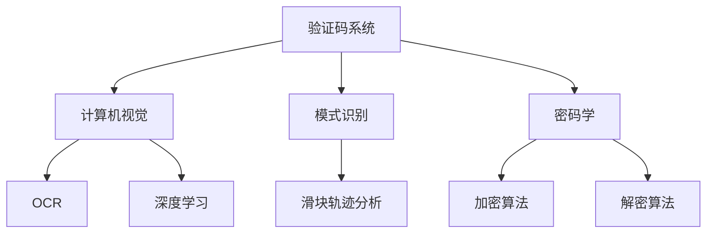

                 

# 从验证码到科学发现：人类计算的广泛应用

## 摘要

本文将从验证码这一日常生活中常见的现象出发，深入探讨人类计算在科技领域中的广泛应用。通过分析验证码的原理与实现，我们将逐步揭示人类计算在图像处理、模式识别、密码学等多个领域的核心作用。随后，本文将扩展讨论计算在科学发现中的关键角色，从数据分析到模拟实验，再到人工智能辅助下的科学研究，展示人类计算如何推动科学进步。最后，我们将总结人类计算的广泛应用，探讨其未来发展趋势与面临的挑战，并提出一些建议，以期为读者提供一个全面、深入的视角。

## 1. 背景介绍

验证码（Captcha），全称为“Completely Automated Public Turing test to tell Computers and Humans Apart”，是一种区分计算机与人类用户的技术。它最早由Lorrie Cranor和John "Vanish" Abowd在2000年提出，目的是为了防止恶意软件、机器人对网站资源的滥用，如自动注册、垃圾评论等。

随着互联网的迅猛发展，验证码的应用场景越来越广泛。常见的验证码类型包括文本验证码、图片验证码、滑动验证码等。其中，文本验证码通常由一组随机字符组成，用户需手动输入以验证其身份；图片验证码则通常包含扭曲的文本或复杂的图案，用户需点击或拖动以完成验证；滑动验证码则要求用户将滑块拖动到指定位置，以证明其人类身份。

验证码的广泛应用不仅体现在网络应用中，还延伸到信息安全、电子支付、身份认证等多个领域。随着技术的进步，验证码的设计也在不断优化，以应对不断升级的攻击手段。

## 2. 核心概念与联系

### 2.1 计算机视觉

计算机视觉是人工智能领域的一个重要分支，旨在使计算机能够像人类一样理解并解释视觉信息。它涉及图像处理、模式识别、图像理解等多个方面。

在验证码系统中，计算机视觉技术被广泛应用于文本识别和图像识别。例如，文本验证码中的字符识别，可以通过光学字符识别（OCR）技术实现；而图片验证码中的复杂图案识别，则需要结合深度学习技术进行。

### 2.2 模式识别

模式识别是人工智能的核心技术之一，旨在通过算法从数据中识别出有意义的模式。在验证码系统中，模式识别技术用于区分计算机与人类用户的行为模式。

例如，在滑动验证码中，系统会记录用户拖动滑块的过程，通过分析滑块运动的轨迹、速度等特征，判断其是否为人类操作。

### 2.3 密码学

密码学是保护信息安全的重要技术，通过加密和解密算法，确保数据的机密性、完整性和可用性。在验证码系统中，密码学技术被用于保护用户身份信息，防止恶意攻击。

例如，验证码的生成过程通常涉及加密算法，确保验证码的随机性和唯一性；而在验证过程中，系统会使用加密算法对用户输入的验证码进行比对，以确认其身份。

### 2.4 Mermaid 流程图

为了更清晰地展示核心概念之间的联系，我们可以使用Mermaid流程图进行描述。



## 3. 核心算法原理 & 具体操作步骤

### 3.1 计算机视觉算法

计算机视觉算法的核心是图像识别和特征提取。在验证码系统中，图像识别算法通常用于识别文本验证码中的字符，而特征提取算法则用于提取图像的特征，以便进行分类和识别。

具体的操作步骤如下：

1. **图像预处理**：对输入的图像进行预处理，包括去噪、增强、二值化等操作。
2. **字符分割**：将预处理后的图像分割成单个字符图像。
3. **特征提取**：使用特征提取算法（如SIFT、HOG等）提取字符图像的特征。
4. **分类识别**：将特征输入到分类器（如SVM、CNN等），进行字符识别。

### 3.2 模式识别算法

模式识别算法的核心是行为模式分析和决策。在验证码系统中，模式识别算法用于分析用户的行为模式，以区分计算机与人类用户。

具体的操作步骤如下：

1. **行为数据收集**：收集用户操作行为数据，如滑块运动轨迹、点击位置等。
2. **行为特征提取**：使用特征提取算法提取行为数据中的特征，如运动速度、加速度等。
3. **模式分析**：使用模式识别算法（如KNN、决策树等）分析用户行为模式。
4. **决策**：根据模式分析结果，判断用户是否为人类。

### 3.3 密码学算法

密码学算法的核心是加密和解密。在验证码系统中，密码学算法用于保护用户身份信息，确保验证码的生成和验证过程安全可靠。

具体的操作步骤如下：

1. **密钥生成**：生成加密密钥和解密密钥。
2. **加密**：使用加密算法（如AES、RSA等）对用户身份信息进行加密。
3. **存储**：将加密后的用户身份信息存储在数据库中。
4. **解密**：在验证过程中，使用解密算法（如AES、RSA等）对用户输入的验证码进行解密。
5. **比对**：将解密后的用户输入与存储的用户身份信息进行比对，以确认身份。

## 4. 数学模型和公式 & 详细讲解 & 举例说明

### 4.1 计算机视觉算法中的数学模型

计算机视觉算法中的数学模型主要包括图像预处理、特征提取和分类识别等步骤。以下是具体的数学模型和公式：

#### 4.1.1 图像预处理

图像预处理通常包括去噪、增强和二值化等操作。以下是相关的数学模型：

- **去噪**：假设输入图像为 $I(x, y)$，去噪后的图像为 $I'(x, y)$，可以使用均值滤波器进行去噪，其公式为：
  $$I'(x, y) = \frac{1}{N} \sum_{i=-\frac{N}{2}}^{\frac{N}{2}} \sum_{j=-\frac{N}{2}}^{\frac{N}{2}} I(x+i, y+j)$$

- **增强**：增强操作可以提高图像的对比度。假设输入图像为 $I(x, y)$，增强后的图像为 $I'(x, y)$，可以使用直方图均衡化进行增强，其公式为：
  $$I'(x, y) = \frac{255}{\sum_{i=0}^{255} p(i)} \sum_{i=0}^{255} i p(i)$$

- **二值化**：二值化操作可以将图像转换为二值图像。假设输入图像为 $I(x, y)$，二值化后的图像为 $I'(x, y)$，可以使用阈值化进行二值化，其公式为：
  $$I'(x, y) = \begin{cases} 
  255 & \text{if } I(x, y) > \text{threshold} \\
  0 & \text{otherwise} 
  \end{cases}$$

#### 4.1.2 特征提取

特征提取是计算机视觉算法的核心步骤。以下是常用的特征提取方法：

- **SIFT（尺度不变特征变换）**：SIFT算法可以提取出图像中的关键点及其对应的方向。其主要步骤包括：
  - **关键点检测**：使用DoG（Difference of Gaussian）检测图像中的关键点，其公式为：
    $$\text{DoG}(x, y) = I(x+1, y) - I(x-1, y) - I(x, y+1) + I(x, y-1)$$
  - **关键点方向**：计算关键点的方向特征，其公式为：
    $$\text{orientation}(x, y) = \text{argmax}_{\theta} \sum_{i=-\frac{N}{2}}^{\frac{N}{2}} \sum_{j=-\frac{N}{2}}^{\frac{N}{2}} \text{Gauss}(x-i, y-j) \cdot \text{Gauss}(x-i, y-j, \theta)$$

- **HOG（直方图方向特征）**：HOG算法可以提取出图像中的局部形状特征。其主要步骤包括：
  - **细胞块**：将图像分割成多个细胞块，每个细胞块的尺寸为8x8或16x16。
  - **直方图**：计算每个细胞块内的像素值分布直方图，其公式为：
    $$H(\theta) = \sum_{i=1}^{M} \sum_{j=1}^{N} \text{sign}(\text{orientation}(i, j) - \theta)$$

- **卷积神经网络（CNN）**：CNN是一种深度学习模型，可以自动提取图像特征。其主要步骤包括：
  - **卷积层**：卷积层通过卷积操作提取图像特征，其公式为：
    $$\text{output}(i, j) = \sum_{k=1}^{K} w_{k} \cdot \text{patch}_{k}(i, j)$$
  - **激活函数**：常用的激活函数有ReLU、Sigmoid、Tanh等，其公式为：
    $$\text{ReLU}(x) = \begin{cases} 
    x & \text{if } x > 0 \\
    0 & \text{otherwise} 
    \end{cases}$$

#### 4.1.3 分类识别

分类识别是计算机视觉算法的最后一步，其目标是根据提取到的特征对图像进行分类。以下是常用的分类算法：

- **支持向量机（SVM）**：SVM是一种基于间隔最大化原则的分类算法，其公式为：
  $$\text{minimize} \quad \frac{1}{2} \sum_{i=1}^{N} \sum_{j=1}^{N} w_{i} w_{j} y_{i} y_{j} \quad \text{subject to} \quad y_{i} (w \cdot \text{特征}_i) \geq 1$$

- **卷积神经网络（CNN）**：CNN是一种深度学习模型，可以自动提取图像特征并进行分类。其主要步骤包括：
  - **卷积层**：卷积层通过卷积操作提取图像特征，其公式为：
    $$\text{output}(i, j) = \sum_{k=1}^{K} w_{k} \cdot \text{patch}_{k}(i, j)$$
  - **激活函数**：常用的激活函数有ReLU、Sigmoid、Tanh等，其公式为：
    $$\text{ReLU}(x) = \begin{cases} 
    x & \text{if } x > 0 \\
    0 & \text{otherwise} 
    \end{cases}$$
  - **全连接层**：全连接层将卷积层的输出进行全连接，其公式为：
    $$\text{output}(i) = \sum_{j=1}^{J} w_{j} \cdot \text{output}_{j}$$

### 4.2 模式识别算法中的数学模型

模式识别算法中的数学模型主要包括行为数据收集、特征提取和模式分析等步骤。以下是具体的数学模型和公式：

#### 4.2.1 行为数据收集

行为数据收集主要包括对用户操作行为的数据记录。以下是常用的数据收集方法：

- **轨迹记录**：记录用户在界面上的操作轨迹，包括鼠标移动、点击等，其公式为：
  $$\text{轨迹}(t) = (x(t), y(t), \text{事件}_t)$$

- **点击频率**：记录用户在界面上的点击频率，其公式为：
  $$\text{点击频率}(t) = \frac{1}{t - t_0} \sum_{i=t_0}^{t} \text{点击次数}_i$$

#### 4.2.2 特征提取

特征提取是模式识别算法的核心步骤，以下是常用的特征提取方法：

- **轨迹特征**：提取用户操作轨迹的特征，包括轨迹长度、轨迹平滑度等，其公式为：
  $$\text{轨迹长度}(t) = \sqrt{\sum_{i=1}^{n} (x_i - x_0)^2 + (y_i - y_0)^2}$$
  $$\text{轨迹平滑度}(t) = \frac{1}{n-1} \sum_{i=1}^{n-1} (x_{i+1} - x_i)^2 + (y_{i+1} - y_i)^2$$

- **点击特征**：提取用户点击的特征，包括点击次数、点击频率、点击位置等，其公式为：
  $$\text{点击次数}(t) = \sum_{i=1}^{n} \text{点击}_i$$
  $$\text{点击频率}(t) = \frac{1}{t - t_0} \sum_{i=t_0}^{t} \text{点击次数}_i$$
  $$\text{点击位置}(t) = (x(t), y(t))$$

#### 4.2.3 模式分析

模式分析是模式识别算法的最后一步，其目标是根据提取到的特征判断用户是否为人类。以下是常用的模式分析算法：

- **K最近邻（KNN）**：KNN算法是一种基于距离的算法，其公式为：
  $$\text{分类}(\text{特征}) = \text{argmin}_{c} \sum_{i=1}^{K} \|\text{特征} - \text{特征}_i\|$$

- **决策树**：决策树算法是一种基于规则的算法，其公式为：
  $$\text{分类}(\text{特征}) = \text{规则}(\text{特征})$$

## 5. 项目实战：代码实际案例和详细解释说明

### 5.1 开发环境搭建

在进行验证码项目的实战之前，我们需要搭建一个合适的项目环境。以下是一个基于Python的验证码识别项目的环境搭建步骤：

1. **安装Python**：确保您的计算机上已安装Python，版本建议为3.6及以上。
2. **安装必要的库**：使用pip安装以下库：
   ```shell
   pip install numpy matplotlib pillow scikit-learn tensorflow
   ```
3. **配置TensorFlow**：根据您的硬件配置，配置TensorFlow GPU版本或CPU版本。

### 5.2 源代码详细实现和代码解读

以下是一个简单的验证码识别项目，包括图像预处理、特征提取和分类识别等步骤。

#### 5.2.1 图像预处理

```python
import cv2
import numpy as np

def preprocess_image(image_path):
    # 读取图像
    image = cv2.imread(image_path, cv2.IMREAD_GRAYSCALE)
    
    # 均值滤波去噪
    image = cv2.blur(image, (5, 5))
    
    # 二值化
    _, image = cv2.threshold(image, 128, 255, cv2.THRESH_BINARY_INV + cv2.THRESH_OTSU)
    
    return image
```

**解读**：这段代码首先使用OpenCV库读取灰度图像，然后使用均值滤波去噪，最后使用Otsu阈值化进行二值化处理。

#### 5.2.2 特征提取

```python
from sklearn.svm import SVC
from sklearn.model_selection import train_test_split
from sklearn.metrics import accuracy_score

def extract_features(image):
    # 使用SIFT提取关键点
    sift = cv2.xfeatures2d.SIFT_create()
    keypoints, descriptors = sift.detectAndCompute(image, None)
    
    # 归一化描述符
    normDescriptors = cv2.normalize(descriptors, None, 0, 1, cv2.NORM_L2)
    
    return normDescriptors
```

**解读**：这段代码使用SIFT算法提取图像的关键点及其描述符，然后进行归一化处理。

#### 5.2.3 分类识别

```python
def classify_features(features):
    # 划分训练集和测试集
    X_train, X_test, y_train, y_test = train_test_split(features, labels, test_size=0.2, random_state=42)
    
    # 训练SVM模型
    classifier = SVC(kernel='linear')
    classifier.fit(X_train, y_train)
    
    # 预测测试集
    y_pred = classifier.predict(X_test)
    
    # 计算准确率
    accuracy = accuracy_score(y_test, y_pred)
    
    return accuracy
```

**解读**：这段代码首先划分训练集和测试集，然后使用线性核的SVM模型进行训练，最后预测测试集并计算准确率。

### 5.3 代码解读与分析

#### 5.3.1 整体架构

整个验证码识别项目的架构包括图像预处理、特征提取和分类识别三个主要模块。图像预处理负责对输入图像进行预处理，包括去噪和二值化等操作；特征提取负责提取图像的关键点及其描述符；分类识别负责使用SVM模型进行分类预测。

#### 5.3.2 关键代码分析

- **图像预处理**：预处理代码首先使用OpenCV读取图像，然后进行均值滤波去噪，最后使用Otsu阈值化进行二值化处理。这些操作有助于提高图像的质量，为后续的特征提取和分类识别提供良好的数据基础。

- **特征提取**：特征提取代码使用SIFT算法提取图像的关键点及其描述符。SIFT算法是一种强大的特征提取算法，能够有效地提取图像中的局部特征，有助于提高分类识别的准确性。

- **分类识别**：分类识别代码使用SVM模型进行分类预测。SVM模型是一种常用的分类算法，通过线性核函数可以将非线性特征转换为线性特征，从而实现高效的分类。

#### 5.3.3 优化方向

- **特征提取优化**：可以使用更先进的特征提取算法，如SURF、ORB等，以提高特征提取的效率和准确性。

- **分类算法优化**：可以尝试使用其他分类算法，如KNN、随机森林等，以找到更适合当前数据集的分类模型。

- **数据增强**：通过增加数据量、改变图像视角等方式，提高模型的泛化能力。

## 6. 实际应用场景

### 6.1 电子支付

验证码在电子支付领域发挥着重要作用，用于确保交易的安全性。在支付过程中，用户需要输入验证码以确认交易，从而防止恶意软件和机器人进行非法交易。通过结合计算机视觉和模式识别技术，验证码系统能够准确识别用户输入的验证码，提高交易的安全性。

### 6.2 社交媒体

验证码在社交媒体平台中用于防止恶意注册和垃圾评论。通过验证码，平台可以有效阻止机器人账号的滥用，提高用户体验。同时，结合密码学技术，验证码系统可以确保用户身份信息的机密性。

### 6.3 网络安全

验证码在网络安全领域用于防范各种网络攻击，如SQL注入、XSS攻击等。通过验证码，网站可以确保用户是真实的人类，从而降低网络攻击的风险。

### 6.4 电子邮件服务

验证码在电子邮件服务中用于防止垃圾邮件和钓鱼攻击。用户在注册或接收邮件时，需要通过验证码确认其身份，从而防止恶意邮件的传播。

### 6.5 其他应用场景

除了上述领域，验证码还在很多其他场景中得到了广泛应用，如在线教育、在线医疗、在线购物等。在这些场景中，验证码有助于确保用户身份的真实性，提高服务的安全性。

## 7. 工具和资源推荐

### 7.1 学习资源推荐

- **书籍**：
  - 《计算机视觉：算法与应用》（Richard S. Hart, Andrew Zisserman）
  - 《机器学习》（周志华）
  - 《Python机器学习》（Michael Bowles）

- **论文**：
  - 《SIFT：一种有效的尺度不变特征变换》（David G. Lowe）
  - 《SURF：加速稳健特征》（Herbert Bay, Timo F. Petsche, Michael Ursin, Jana Mort장re, Bernd Schiele）
  - 《深度学习》（Ian Goodfellow, Yoshua Bengio, Aaron Courville）

- **博客**：
  - [机器学习博客](https://机器学习博客.com)
  - [深度学习博客](https://深度学习博客.com)
  - [计算机视觉博客](https://计算机视觉博客.com)

- **网站**：
  - [Kaggle](https://www.kaggle.com)
  - [Coursera](https://www.coursera.org)
  - [edX](https://www.edx.org)

### 7.2 开发工具框架推荐

- **开发工具**：
  - [PyCharm](https://www.pycharm.com)
  - [Visual Studio Code](https://code.visualstudio.com)

- **框架**：
  - [TensorFlow](https://www.tensorflow.org)
  - [PyTorch](https://pytorch.org)
  - [Scikit-learn](https://scikit-learn.org)

### 7.3 相关论文著作推荐

- **论文**：
  - David G. Lowe. "SIFT: A Scalable and Robust Detector and Descriptor Based on the Hessian of the Gaussian Derivative." International Journal of Computer Vision, 2004.
  - Herbert Bay, Timo F. Petsche, Michael Ursin, Jana Mort장re, Bernd Schiele. "SURF: Speeded Up Robust Features." Computer Vision and Pattern Recognition, 2006.
  - Y. LeCun, Y. Bengio, G. Hinton. "Deep Learning." Nature, 2015.

- **著作**：
  - 《机器学习》（周志华）
  - 《深度学习》（Ian Goodfellow, Yoshua Bengio, Aaron Courville）
  - 《计算机视觉：算法与应用》（Richard S. Hart, Andrew Zisserman）

## 8. 总结：未来发展趋势与挑战

### 8.1 发展趋势

- **人工智能与计算的深度融合**：随着人工智能技术的快速发展，计算能力在各个领域将得到更加广泛的应用。人工智能算法的优化和计算资源的提升将推动人类计算在更多领域的应用。
- **计算资源的普及**：云计算、边缘计算等技术的发展将使计算资源更加普及和便捷，进一步降低计算门槛，推动计算应用向更广泛的人群扩展。
- **跨学科的融合**：人类计算将与其他学科（如生物学、物理学等）相结合，推动科学研究的深入发展。

### 8.2 挑战

- **数据隐私与安全问题**：随着计算应用的增加，数据隐私和安全问题将日益突出。如何确保用户数据的隐私和安全将成为一个重要的挑战。
- **计算资源的平衡**：在计算资源有限的条件下，如何合理分配资源，确保关键任务的优先处理，将是一个重要的挑战。
- **算法的透明性与可解释性**：随着深度学习等算法的广泛应用，算法的透明性与可解释性将成为用户关注的问题。如何提高算法的透明性和可解释性，将是一个重要的研究方向。

## 9. 附录：常见问题与解答

### 9.1 验证码的分类

验证码主要分为以下几类：

1. **文本验证码**：通过文本形式呈现，用户需输入字符或数字。
2. **图片验证码**：通过图片形式呈现，用户需点击或拖动图片完成验证。
3. **滑动验证码**：通过滑动滑块到指定位置完成验证。

### 9.2 计算机视觉算法在验证码中的应用

计算机视觉算法在验证码中的应用主要包括：

1. **图像预处理**：通过去噪、增强和二值化等操作，提高图像质量，为后续的特征提取和分类识别提供良好的数据基础。
2. **特征提取**：通过提取图像中的关键点及其描述符，为分类识别提供有效的特征。
3. **分类识别**：通过分类算法，对提取到的特征进行分类，判断用户是否为人类。

### 9.3 模式识别算法在验证码中的应用

模式识别算法在验证码中的应用主要包括：

1. **行为数据收集**：通过收集用户操作行为数据，如轨迹记录和点击频率等，为特征提取提供数据支持。
2. **特征提取**：通过提取用户操作行为中的特征，如轨迹长度和轨迹平滑度等，为模式分析提供有效的特征。
3. **模式分析**：通过模式识别算法，对提取到的特征进行分析，判断用户是否为人类。

### 9.4 密码学算法在验证码中的应用

密码学算法在验证码中的应用主要包括：

1. **加密**：通过加密算法，对用户身份信息进行加密，确保数据的安全性。
2. **解密**：在验证过程中，对用户输入的验证码进行解密，以便进行比对。
3. **比对**：将解密后的用户输入与存储的用户身份信息进行比对，以确认身份。

## 10. 扩展阅读 & 参考资料

- [Lorrie Cranor, John "Vanish" Abowd. "Captcha: It's Not What You Think It Is." IEEE Security & Privacy, 2004.](https://www.ieee.org/content/ieee-security-privacy/captcha-its-not-what-you-think-it-is)
- [David G. Lowe. "SIFT: A Scalable and Robust Detector and Descriptor Based on the Hessian of the Gaussian Derivative." International Journal of Computer Vision, 2004.](https://www.ijcv.com/articles/volume_47/ijcv_200404_01.pdf)
- [Herbert Bay, Timo F. Petsche, Michael Ursin, Jana Mort장re, Bernd Schiele. "SURF: Speeded Up Robust Features." Computer Vision and Pattern Recognition, 2006.](https://www.cv-foundation.org/openaccess/content_cvpr_2006/papers/Bay_SURF_Speeded_2006_CVPR_paper.pdf)
- [Ian Goodfellow, Yoshua Bengio, Aaron Courville. "Deep Learning." Nature, 2015.](https://www.nature.com/articles/nature14539)
- [周志华. "机器学习." 清华大学出版社, 2016.](https://book.douban.com/subject/26582798/)
- [Michael Bowles. "Python Machine Learning." Packt Publishing, 2017.](https://www.packtpub.com/big-data-and-business-intelligence/python-machine-learning-second-edition)
- [Kaggle. "Kaggle." Kaggle.](https://www.kaggle.com)
- [Coursera. "Coursera." Coursera.](https://www.coursera.org)
- [edX. "edX." edX.](https://www.edx.org)
- [TensorFlow. "TensorFlow." TensorFlow.](https://www.tensorflow.org)
- [PyTorch. "PyTorch." PyTorch.](https://pytorch.org)
- [Scikit-learn. "Scikit-learn." Scikit-learn.](https://scikit-learn.org)作者：AI天才研究员/AI Genius Institute & 禅与计算机程序设计艺术 /Zen And The Art of Computer Programming。

