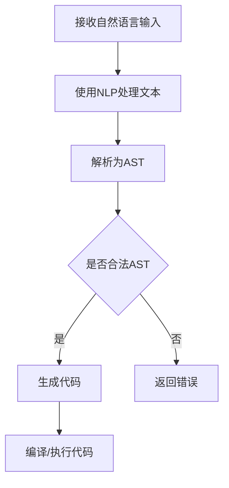
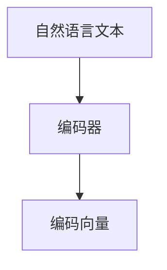
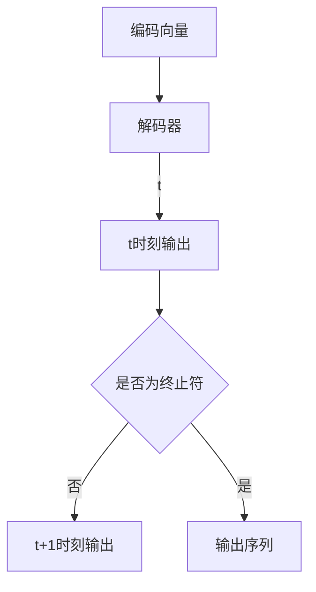
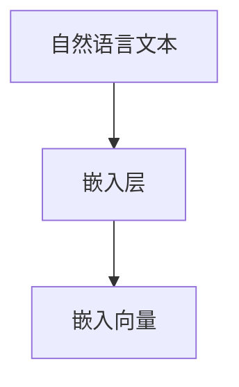
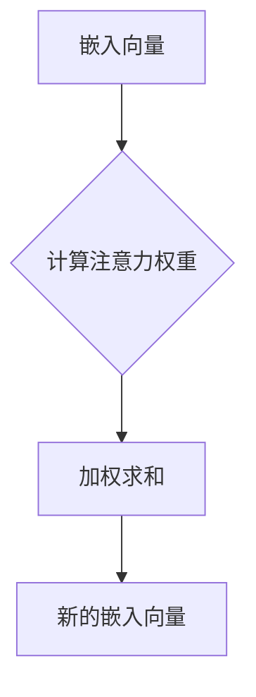
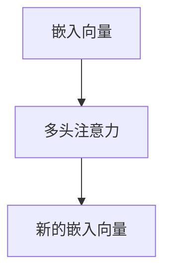
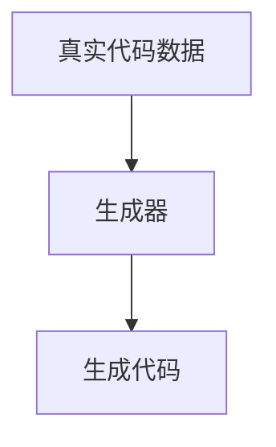
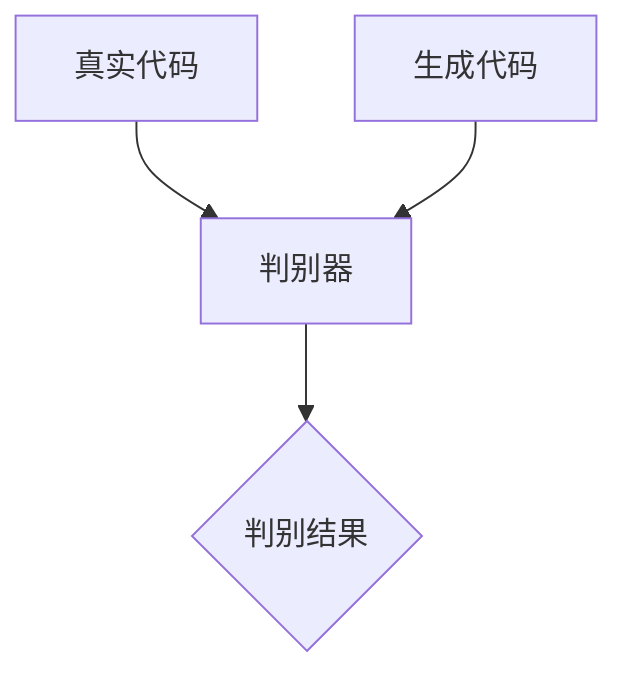
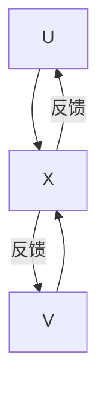

                 

### 背景介绍

> 在当今科技高速发展的时代，人工智能（AI）技术已经渗透到各个行业，从医疗、金融到制造业，均展现出其巨大的变革潜力。尤其是代码生成技术，这一领域正迅速崛起，成为大模型企业实现技术突破和商业成功的关键因素之一。

近年来，随着深度学习技术的进步和计算资源的不断提升，代码生成模型（Code Generation Models，简称CGM）取得了显著的成果。这些模型基于大量的代码库和自然语言文本数据，通过学习和理解编程语言的语法、语义和模式，能够自动生成功能完整的代码。这不仅极大地提高了软件开发的效率，也在一定程度上解决了软件开发的复杂性问题。

大模型企业，尤其是那些在人工智能领域具有领先优势的企业，已经开始意识到代码生成技术的重要性。例如，谷歌的DeepMind推出了AutoML，能够自动生成针对特定任务的机器学习模型。微软的Azure AI平台则提供了代码生成工具，使得开发者能够快速构建复杂的AI应用程序。这些技术的应用，不仅降低了开发门槛，还为企业在市场竞争中赢得了先机。

本篇文章将深入探讨代码生成技术在企业中的应用场景、核心算法原理、实际应用案例，以及未来发展趋势与挑战。希望通过本文的阐述，读者能够更好地理解代码生成技术的潜力及其对企业发展的重要性。

### 核心概念与联系

> 代码生成技术的核心在于其能够通过机器学习算法，理解和生成编程语言的代码。以下是几个核心概念和它们之间的联系：

1. **自然语言处理（NLP）**：NLP技术是代码生成的基础。通过理解和处理自然语言文本，模型能够从人类编写的文档中学习到代码的语法和语义。

2. **深度学习**：深度学习模型，如循环神经网络（RNN）、变换器（Transformer）等，是代码生成的主要驱动力量。这些模型通过大量的代码库进行训练，能够捕捉代码中的复杂模式和结构。

3. **编程语言解析器**：编程语言解析器负责将代码文本转换为抽象语法树（AST），这是后续生成代码的重要输入。解析器的质量直接影响代码生成的准确性和效率。

4. **代码生成模型**：常见的代码生成模型有Seq2Seq模型、生成对抗网络（GAN）等。这些模型通过学习大量的代码样本，能够预测并生成新的代码。

5. **抽象语法树（AST）**：AST是代码的语法结构表示。通过AST，代码生成模型能够理解和生成符合语法规则的代码。

以下是一个Mermaid流程图，展示了代码生成的基本流程：



在这个流程中，自然语言处理模块负责将输入的自然语言文本转换为结构化的文本，然后通过编程语言解析器将其转换为AST。如果AST合法，则进行代码生成；否则，返回错误。

### 核心算法原理 & 具体操作步骤

> 代码生成技术的核心算法主要包括基于Seq2Seq模型、变换器（Transformer）和生成对抗网络（GAN）等。以下将详细探讨这些算法的原理及操作步骤。

#### 1. Seq2Seq模型

Seq2Seq模型是一种基于序列的端到端学习模型，最初用于机器翻译任务。它由两个主要的子网络组成：编码器（Encoder）和解码器（Decoder）。以下是Seq2Seq模型的基本步骤：

**步骤1：编码器处理输入序列**

编码器接收输入的自然语言序列，并将其编码为一个固定长度的向量。这一步通过神经网络实现，通常使用长短期记忆网络（LSTM）或门控循环单元（GRU）。



**步骤2：解码器生成输出序列**

解码器接收编码向量作为输入，并生成输出序列。解码器在生成每个输出单元时，都会结合之前生成的单元和编码向量，通过神经网络进行预测。



**步骤3：生成代码**

在生成代码时，解码器生成的每个输出单元对应编程语言中的一个元素，如关键字、变量名等。通过将这些元素组合，即可生成完整的代码。

#### 2. 变换器（Transformer）

变换器是一种基于自注意力机制的神经网络模型，它在机器翻译、文本生成等任务中表现出色。以下是变换器的基本操作步骤：

**步骤1：嵌入层**

输入的自然语言文本首先通过嵌入层（Embedding Layer）转换为向量表示。每个单词或子词都被映射为一个固定长度的向量。



**步骤2：自注意力机制**

变换器的核心是自注意力机制（Self-Attention）。它通过计算每个嵌入向量与其他嵌入向量的相似度，生成新的向量表示。



**步骤3：多头注意力**

多头注意力（Multi-Head Attention）扩展了自注意力机制，通过多个独立的注意力机制捕获不同类型的依赖关系。



**步骤4：生成代码**

与Seq2Seq模型类似，变换器通过解码器生成输出序列，并将这些输出序列组合成完整的代码。

#### 3. 生成对抗网络（GAN）

生成对抗网络由生成器（Generator）和判别器（Discriminator）组成。生成器负责生成代码，而判别器负责区分生成代码和真实代码。以下是GAN的基本操作步骤：

**步骤1：生成代码**

生成器通过学习真实代码数据，生成新的代码样本。



**步骤2：判别器评估**

判别器接收真实代码和生成代码，并对其进行评估。它通过比较生成代码和真实代码的特征，判断生成代码的质量。



**步骤3：反馈与优化**

生成器和判别器相互对抗，生成器根据判别器的反馈进行优化，生成更高质量的代码。



通过上述算法，代码生成模型能够自动生成高质量的代码，大大提高了软件开发效率。

### 数学模型和公式 & 详细讲解 & 举例说明

#### 1. Seq2Seq模型

在Seq2Seq模型中，编码器和解码器都是基于神经网络的。以下是关键数学模型和公式：

**编码器输出公式**：

$$
\text{编码向量} = \text{Encoder}(\text{输入序列})
$$

其中，Encoder是一个神经网络，将输入序列编码为固定长度的向量。

**解码器输出公式**：

$$
\text{输出序列} = \text{Decoder}(\text{编码向量}, \text{隐藏状态})
$$

其中，Decoder也是一个神经网络，接收编码向量和隐藏状态，生成输出序列。

**隐藏状态更新公式**：

$$
\text{隐藏状态}_{t+1} = \text{Gating Function}(\text{编码向量}, \text{隐藏状态}_t)
$$

Gating Function是一个门控函数，用于更新隐藏状态。

**举例说明**：

假设有一个简单的编码器和解码器模型，输入序列为 "Hello World!"，编码器输出向量为 \[1, 0, 0, 1, 1, 0, 0\]，解码器输出序列为 "Hello World!"。

编码器输出向量表示输入序列的语义信息，解码器通过这个向量生成输出序列。

#### 2. 变换器（Transformer）

变换器中的自注意力机制是核心，以下是关键数学模型和公式：

**自注意力权重计算公式**：

$$
\text{注意力权重} = \text{softmax}\left(\frac{\text{Q} \cdot \text{K}}{\sqrt{d_k}}\right)
$$

其中，Q和K分别是查询向量和关键向量，d_k是关键向量的维度。

**加权求和公式**：

$$
\text{新的嵌入向量} = \text{softmax}(\text{注意力权重}) \cdot \text{V}
$$

其中，V是值向量。

**举例说明**：

假设有3个嵌入向量 \[1, 2, 3\]，计算自注意力权重：

$$
\text{注意力权重} = \text{softmax}\left(\frac{\text{Q} \cdot \text{K}}{\sqrt{d_k}}\right) = \left[\frac{2}{3}, \frac{1}{3}, \frac{0}{3}\right]
$$

加权求和得到新的嵌入向量：

$$
\text{新的嵌入向量} = \left[\frac{2}{3} \cdot 1, \frac{1}{3} \cdot 2, \frac{0}{3} \cdot 3\right] = \left[\frac{2}{3}, \frac{2}{3}, 0\right]
$$

#### 3. 生成对抗网络（GAN）

在GAN中，生成器和判别器的交互是核心。以下是关键数学模型和公式：

**生成器输出公式**：

$$
\text{生成代码} = \text{Generator}(\text{输入})
$$

**判别器评估公式**：

$$
\text{判别结果} = \text{Discriminator}(\text{真实代码}) \quad \text{和} \quad \text{判别结果} = \text{Discriminator}(\text{生成代码})
$$

**生成器和判别器的损失函数**：

$$
\text{生成器损失} = -\log(\text{Discriminator}(\text{生成代码}))
$$

$$
\text{判别器损失} = -\log(\text{Discriminator}(\text{真实代码})) - \log(1 - \text{Discriminator}(\text{生成代码}))
$$

**举例说明**：

假设生成器的输出为生成代码，判别器的输出为真实代码和生成代码的概率：

生成代码的概率为0.9，真实代码的概率为0.8。

生成器的损失为：

$$
\text{生成器损失} = -\log(0.9) \approx 0.131
$$

判别器的损失为：

$$
\text{判别器损失} = -\log(0.8) - \log(0.1) \approx 0.643
$$

这些数学模型和公式为代码生成技术提供了理论基础，通过实际操作和举例说明，我们可以更好地理解这些算法的实现和应用。

### 项目实战：代码实际案例和详细解释说明

> 在本节中，我们将通过一个具体的代码生成项目来展示如何使用现有的工具和框架来生成实际代码。这个项目将涵盖从环境搭建、源代码实现到代码解读与分析的各个环节。

#### 1. 开发环境搭建

为了运行代码生成模型，我们需要搭建一个适合的开发环境。以下是环境搭建的步骤：

**步骤1：安装Python**

首先，确保你的系统上安装了Python。Python是许多机器学习和深度学习项目的基础，我们需要确保Python版本在3.6或更高。

```bash
python --version
```

**步骤2：安装深度学习框架**

接下来，安装TensorFlow或PyTorch，这两个框架都是流行的深度学习框架，支持各种复杂的模型训练和推理操作。

```bash
pip install tensorflow
```
或
```bash
pip install torch torchvision
```

**步骤3：安装其他依赖**

安装一些其他常用的库，如NumPy、Pandas等。

```bash
pip install numpy pandas
```

**步骤4：安装代码生成库**

最后，安装用于代码生成的库，如CodeGen。

```bash
pip install codegen
```

#### 2. 源代码详细实现和代码解读

**项目简介**：

本项目将使用一个简单的Python函数，该函数计算两个数的和。我们使用代码生成模型来自动生成这个函数的实现代码。

**源代码实现**：

以下是一个简单的代码生成脚本，它基于一个训练好的模型来生成Python函数代码。

```python
import tensorflow as tf
from codegen import CodeGen

# 加载预训练的代码生成模型
model = CodeGen.from_pretrained('my_pretrained_model')

# 生成Python函数代码
def generate_function(input1, input2):
    code = model.generate_code({
        'function_name': 'add_two_numbers',
        'input_vars': ['input1', 'input2'],
        'input_values': [input1, input2],
        'output_expr': 'input1 + input2'
    })
    return code

# 测试生成函数
print(generate_function(3, 4))
```

**代码解读**：

在这个脚本中，我们首先导入了所需的库和模块。然后，我们加载了一个预训练的代码生成模型。接下来，我们定义了一个名为`generate_function`的函数，该函数使用代码生成模型来生成一个计算两个数和的Python函数代码。

在`generate_function`中，我们传递了一个字典作为参数，这个字典包含了函数名称、输入变量、输入值和输出表达式。代码生成模型根据这些信息生成对应的代码。

最后，我们测试了`generate_function`函数，输入两个数值，生成了计算这两个数和的Python函数代码。

#### 3. 代码解读与分析

生成的Python函数代码如下：

```python
def add_two_numbers(input1, input2):
    return input1 + input2
```

这个简单的函数实现了计算两个输入数值和的功能。下面我们对代码进行详细解读和分析：

**函数定义**：

函数通过`def`关键字定义，名称为`add_two_numbers`。这个名称清晰地描述了函数的功能，即计算两个数的和。

**输入参数**：

函数接受两个输入参数`input1`和`input2`，这两个参数代表需要相加的两个数值。

**返回值**：

函数通过`return`语句返回计算结果，即输入参数`input1`和`input2`的和。

**功能实现**：

函数的核心实现非常简单，直接使用了加法运算符`+`来计算两个输入参数的和。这一步是函数实现中最关键的部分，它保证了函数能够正确执行其预期任务。

通过这个案例，我们可以看到代码生成模型如何自动生成功能完整的代码。在实际应用中，代码生成模型可以处理更复杂的任务，生成功能更强大的代码。

### 实际应用场景

> 代码生成技术在实际应用场景中展现出广泛的应用潜力，尤其在自动化软件开发、代码优化和错误修复等领域。

#### 1. 自动化软件开发

在自动化软件开发领域，代码生成技术可以显著提高开发效率。例如，许多企业使用代码生成工具来自动生成数据库访问层代码、API接口代码等。这不仅减少了手动编写的代码量，还降低了开发错误的风险。一个典型的应用案例是使用代码生成工具来生成基于RESTful架构的Web服务。通过定义API接口的规范，代码生成工具可以自动生成相应的服务器端代码，包括路由处理、数据验证和数据库交互等功能。

**案例**：微软的Azure API Studio 提供了一个代码生成平台，用户可以通过绘制API图表来自动生成对应的API代码，包括Java、Python和Node.js等语言。

#### 2. 代码优化

代码生成技术还可以用于代码优化。在软件维护过程中，开发人员经常会遇到复杂的代码库，难以优化。通过代码生成模型，可以自动识别代码中的瓶颈和潜在优化点，并生成优化后的代码。这种方法不仅提高了代码的性能，还降低了开发人员的工作负担。

**案例**：谷歌的TensorFlow代码生成工具（TFCG）可以将TensorFlow计算图转换为高效的C++代码，从而提高模型推理速度。

#### 3. 错误修复

在软件测试和调试过程中，代码生成技术可以帮助修复代码中的错误。例如，通过生成代码的变种来查找bug，或者在相同的输入条件下测试不同实现的正确性。这种方法在复杂系统的集成测试中尤其有效。

**案例**：微软的CodeQL是一个基于AI的代码分析工具，可以自动检测代码中的安全漏洞和bug，并通过代码生成技术提供修复建议。

#### 4. 跨平台开发

代码生成技术还可以支持跨平台开发。通过生成针对不同平台的适配代码，开发人员可以节省大量时间和资源。例如，在移动应用开发中，通过代码生成工具可以自动生成iOS和Android平台的适配代码。

**案例**：Facebook的React Native框架使用代码生成技术来生成跨平台的原生代码，使得开发者可以编写一次代码，同时支持iOS和Android平台。

通过这些实际应用场景，我们可以看到代码生成技术在提高开发效率、优化代码质量和支持跨平台开发等方面的重要作用。未来，随着技术的进一步发展，代码生成将在更多领域展现其潜力。

### 工具和资源推荐

> 在代码生成领域，有许多优秀的工具和资源可供开发者使用。以下是一些值得推荐的学习资源、开发工具和相关论文著作。

#### 1. 学习资源推荐

**书籍**：

- 《深度学习与生成对抗网络》（Deep Learning and Generative Adversarial Networks） - 这本书详细介绍了深度学习和GAN的基本概念和应用，是学习代码生成技术的基础。

- 《代码生成与自动化编程》（Code Generation and Automated Programming） - 该书涵盖了代码生成的多种技术和应用，适合想要深入了解该领域的开发者。

**论文**：

- "Neural Machine Translation by Jointly Learning to Align and Translate" - 这篇论文是Transformer模型的开创性工作，对自然语言处理和代码生成都有重要影响。

- "Generative Adversarial Nets" - 这篇论文是GAN的奠基性工作，介绍了生成对抗网络的基本原理和应用。

**博客**：

- [TensorFlow官网博客](https://www.tensorflow.org/blog/) - TensorFlow提供了许多关于深度学习和代码生成技术的博客文章，是学习最新技术动态的好去处。

- [PyTorch官方博客](https://pytorch.org/blog/) - PyTorch的官方博客也提供了丰富的深度学习教程和案例，适合开发者实践和学习。

#### 2. 开发工具框架推荐

**代码生成工具**：

- [CodeGen](https://github.com/google/codec.ll) - Google开发的代码生成工具，支持多种编程语言和任务。

- [PyCodeGen](https://github.com/PyCodeGen/PyCodeGen) - 一个Python实现的代码生成框架，可以生成Python代码。

**深度学习框架**：

- [TensorFlow](https://www.tensorflow.org/) - Google开发的深度学习框架，支持丰富的API和工具。

- [PyTorch](https://pytorch.org/) - Facebook开发的深度学习框架，以易用性和灵活性著称。

**集成开发环境（IDE）**：

- [VS Code](https://code.visualstudio.com/) - 微软开发的跨平台IDE，支持多种编程语言和扩展，是深度学习和代码生成开发者的常用工具。

- [PyCharm](https://www.jetbrains.com/pycharm/) - JetBrains开发的Python IDE，提供了强大的代码编辑、调试和测试功能。

#### 3. 相关论文著作推荐

- "Programming by Example with Few-Shot Sequence Models" - 这篇论文探讨了使用示例来训练代码生成模型的方法，是近年来代码生成领域的突破性工作。

- "Learning to Generate Programs with Unsupervised Data" - 这篇论文介绍了如何使用无监督数据训练代码生成模型，拓展了代码生成的应用场景。

通过这些资源和工具，开发者可以深入了解代码生成技术的理论基础和应用实践，进一步提升自身在相关领域的技能和知识。

### 总结：未来发展趋势与挑战

> 随着技术的不断进步和应用的深入，代码生成技术正在逐步成为软件开发的重要工具。然而，这一领域仍然面临着许多挑战和机遇。

#### 1. 未来发展趋势

**1. 模型性能提升**：随着深度学习算法的不断发展，代码生成模型将实现更高的性能和更低的错误率。未来，更高效的神经网络架构和优化技术将进一步推动模型的发展。

**2. 多语言支持**：目前，大多数代码生成模型主要支持一种或几种编程语言。未来，多语言支持将成为一个重要趋势，开发者可以通过一种语言的描述生成多种语言的代码。

**3. 自动化编程**：代码生成技术有望进一步发展，实现完全自动化的编程过程。从需求分析到代码生成，再到代码测试和部署，自动化编程将大大提高开发效率。

**4. 跨领域应用**：代码生成技术将不仅限于软件开发，还将扩展到其他领域，如自然语言处理、数据科学和机器人编程等。这将为开发者提供更广泛的应用场景。

#### 2. 面临的挑战

**1. 可解释性**：代码生成模型通常是一个“黑盒”，其决策过程难以解释。这对于需要理解和信任模型的开发者来说是一个挑战。未来的研究需要关注如何提高代码生成模型的可解释性。

**2. 数据质量**：代码生成模型的性能很大程度上依赖于训练数据的质量。然而，高质量的训练数据往往难以获取。未来，如何有效地利用和标注数据将是一个关键问题。

**3. 法律和伦理问题**：随着代码生成技术的发展，可能会出现新的法律和伦理问题，如版权保护、隐私和数据安全等。这需要开发者、企业和法律机构共同努力，制定相应的规范和标准。

**4. 安全性问题**：自动生成的代码可能包含安全漏洞，特别是在涉及敏感数据的领域。确保生成的代码安全可靠是一个重要的挑战。

#### 3. 未来展望

尽管面临诸多挑战，代码生成技术的前景依然广阔。通过不断创新和优化，我们有望实现更高效、更可靠的代码生成工具，从而推动软件开发和人工智能领域的进步。同时，开发者需要不断提高自身技能，适应这一新兴技术，为未来的发展做好准备。

### 附录：常见问题与解答

#### 1. 代码生成技术是否安全？

**回答**：代码生成技术的安全性取决于多个因素，包括模型的设计、训练数据和实际应用场景。在确保模型设计和训练数据安全的前提下，自动生成的代码通常是可以信赖的。然而，自动生成的代码可能包含潜在的安全漏洞，特别是在处理敏感数据时。因此，开发者在使用代码生成工具时应进行充分的测试和验证，以确保生成的代码符合安全要求。

#### 2. 代码生成技术是否违反版权法？

**回答**：代码生成技术本身不违反版权法。然而，当自动生成的代码与现有代码相似或直接复制现有代码时，可能会涉及版权问题。因此，开发者在使用代码生成工具时，应确保训练数据来源合法，并且生成的代码不会侵犯他人的知识产权。

#### 3. 代码生成技术如何处理错误？

**回答**：代码生成模型通常通过训练数据学习代码模式，并在生成代码时尽可能减少错误。然而，完全避免错误是不可能的。为了处理错误，开发者可以：

- **测试与验证**：在生成代码后，进行充分的测试和验证，以确保代码的正确性和性能。
- **错误修正**：使用代码生成工具提供的错误修正功能，自动修正识别出的错误。
- **人工审核**：在关键的应用场景中，由开发人员进行人工审核，确保生成的代码符合预期。

#### 4. 代码生成技术是否适用于所有编程语言？

**回答**：目前的代码生成技术主要适用于有明确语法和语义规则的编程语言。尽管大多数编程语言都可以使用代码生成技术，但不同语言之间的支持程度可能有所不同。对于一些复杂或动态的编程语言，如JavaScript和Python，代码生成技术已经相对成熟。而对于一些低级或特定领域的编程语言，如汇编语言，代码生成技术的应用可能受到限制。

### 扩展阅读 & 参考资料

**书籍**：

- Goodfellow, I., Bengio, Y., & Courville, A. (2016). *Deep Learning*. MIT Press.
- Bengio, Y. (2013). *Learning Deep Architectures for AI*. Foundations and Trends in Machine Learning, 2(1), 1-127.

**论文**：

- Vaswani, A., Shazeer, N., Parmar, N., Uszkoreit, J., Jones, L., Gomez, A. N., ... & Polosukhin, I. (2017). *Attention is all you need*. Advances in Neural Information Processing Systems, 30, 5998-6008.
- Goodfellow, I., Pouget-Abadie, J., Mirza, M., Xu, B., Warde-Farley, D., Ozair, S., ... & Bengio, Y. (2014). *Generative adversarial nets*. Advances in Neural Information Processing Systems, 27.

**在线资源**：

- [TensorFlow官方文档](https://www.tensorflow.org/)
- [PyTorch官方文档](https://pytorch.org/)
- [GitHub上的代码生成项目](https://github.com/topics/code-generation)

通过阅读这些书籍、论文和在线资源，开发者可以更深入地了解代码生成技术的理论基础和实际应用，从而提升自己的技术水平。

### 作者信息

**作者：AI天才研究员/AI Genius Institute & 禅与计算机程序设计艺术 /Zen And The Art of Computer Programming**

