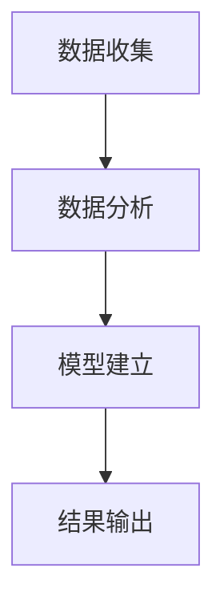

                 

### 背景介绍

#### 电商行业的竞争态势

在当今的数字时代，电商行业已经成为全球经济增长的重要驱动力。据统计，全球电商市场的规模已经超过数万亿美元，并持续保持高速增长态势。然而，随着市场的发展，竞争也日趋激烈。各大电商平台为了争夺市场份额，不得不不断提升用户体验、优化产品和服务。在这种背景下，价格优化技术应运而生，成为提升电商竞争力的重要手段之一。

#### 价格优化的意义

价格优化技术在电商领域具有重要意义。首先，通过精确计算和动态调整价格，电商平台可以更好地吸引消费者，提升转化率和销售额。其次，合理设置价格可以增强品牌形象，提高消费者对产品的信任度和满意度。最后，价格优化技术还可以帮助企业实现库存管理、成本控制和盈利能力提升等多方面的优化。

#### 当前价格优化技术的发展状况

近年来，随着人工智能、大数据和云计算等技术的迅猛发展，价格优化技术也取得了显著进展。传统的人工定价模式逐渐被智能化、自动化的定价算法所取代。一些领先的电商平台已经率先应用了先进的算法模型，通过实时分析和预测市场动态，实现精准定价。此外，还有一些企业积极探索人工智能与其他技术的融合，如机器学习、深度学习等，以期进一步提升价格优化的效果。

#### 本文结构

本文将围绕价格优化技术展开，首先介绍核心概念与联系，接着深入探讨核心算法原理和具体操作步骤，然后详细讲解数学模型和公式，并结合实际项目进行代码实际案例和详细解释说明。在此基础上，还将分析价格优化技术在电商行业的实际应用场景，推荐相关的学习资源和开发工具框架，最后总结未来发展趋势与挑战，并解答常见问题。

### 核心概念与联系

#### 价格优化技术的定义

价格优化技术是指通过数据分析和算法模型，对商品价格进行动态调整，以实现利润最大化、市场占有率提升或客户满意度提高等目标。它结合了大数据、人工智能、机器学习等技术，通过对市场趋势、消费者行为、竞争态势等多维度数据的综合分析，实现价格策略的智能化和个性化。

#### 价格优化的主要目标

价格优化的主要目标包括以下几个方面：

1. **利润最大化**：通过精确计算和动态调整价格，最大化利润空间。
2. **市场占有率提升**：通过合理的价格策略，提高产品在市场中的竞争地位。
3. **客户满意度提高**：通过价格策略的优化，提高消费者对产品的满意度和忠诚度。
4. **库存管理优化**：通过价格优化，实现库存水平的动态调整，减少库存积压和过期损失。

#### 价格优化技术的核心概念

1. **价格弹性**：指消费者对价格变化的敏感程度。价格弹性高的商品，价格变化对销量的影响较大；价格弹性低的商品，价格变化对销量的影响较小。
2. **竞争态势**：指市场上不同品牌、不同产品的竞争情况。了解竞争态势有助于制定更有针对性的价格策略。
3. **消费者行为**：指消费者在购买过程中表现出的各种行为，如搜索行为、购买行为等。通过分析消费者行为，可以更准确地预测需求，从而调整价格。
4. **定价策略**：指企业为产品制定的价格方案。常见的定价策略包括成本加成定价、市场竞争定价、价值定价等。

#### 价格优化技术的关键流程

价格优化技术的关键流程主要包括数据收集、数据分析、模型建立和结果输出。以下是具体的流程步骤：

1. **数据收集**：收集与价格优化相关的各种数据，包括市场数据、消费者行为数据、竞争态势数据等。
2. **数据分析**：对收集到的数据进行清洗、整理和分析，提取有用的信息，如消费者价格敏感度、市场竞争状况等。
3. **模型建立**：根据分析结果，建立合适的定价模型。常见的模型包括线性回归模型、决策树模型、神经网络模型等。
4. **结果输出**：根据模型输出结果，制定具体的定价策略，并实时调整价格。

#### 核心概念原理的 Mermaid 流程图

以下是一个简化的价格优化技术核心概念原理的 Mermaid 流程图：



#### 价格优化技术的基本架构

价格优化技术的基本架构通常包括以下几个部分：

1. **数据源**：包括市场数据、消费者行为数据、竞争态势数据等。
2. **数据处理**：对数据进行清洗、整理和分析，提取有用的信息。
3. **算法模型**：根据数据处理结果，建立合适的定价模型。
4. **定价引擎**：实现价格的动态调整和优化。
5. **结果评估**：对定价效果进行评估，持续优化价格策略。

### 核心算法原理 & 具体操作步骤

#### 价格优化算法的基本原理

价格优化算法的核心思想是通过分析市场数据和消费者行为，动态调整商品价格，以达到最优的利润和市场份额。具体来说，算法通常包括以下几个步骤：

1. **数据收集**：收集与价格优化相关的数据，如市场数据、消费者行为数据、竞争态势数据等。
2. **数据预处理**：对收集到的数据进行清洗、整理和分析，提取有用的信息。
3. **特征工程**：根据数据预处理结果，提取与价格相关的特征，如消费者价格敏感度、市场需求等。
4. **模型选择**：选择合适的定价模型，如线性回归模型、决策树模型、神经网络模型等。
5. **模型训练**：使用收集到的数据对定价模型进行训练，得到模型参数。
6. **价格预测**：使用训练好的模型对未来的价格进行预测。
7. **价格调整**：根据预测结果，动态调整商品价格。

#### 线性回归模型的具体操作步骤

线性回归模型是一种常用的价格优化算法，其基本原理是通过对历史数据的分析，找出价格与销售额之间的线性关系，从而预测未来的价格。以下是线性回归模型的具体操作步骤：

1. **数据收集**：收集与价格优化相关的数据，如历史销售额、价格、市场需求等。
2. **数据预处理**：对数据进行清洗、整理，去除异常值和缺失值。
3. **特征提取**：提取与价格相关的特征，如价格、销售额、市场需求等。
4. **模型建立**：使用线性回归算法建立价格预测模型。
5. **模型训练**：使用历史数据对模型进行训练，得到模型参数。
6. **价格预测**：使用训练好的模型对未来的价格进行预测。
7. **价格调整**：根据预测结果，动态调整商品价格。

#### 决策树模型的具体操作步骤

决策树模型是一种基于规则的价格优化算法，其基本原理是通过分析历史数据，找出影响价格的关键因素，并根据这些因素制定相应的价格策略。以下是决策树模型的具体操作步骤：

1. **数据收集**：收集与价格优化相关的数据，如历史销售额、价格、市场需求等。
2. **数据预处理**：对数据进行清洗、整理，去除异常值和缺失值。
3. **特征提取**：提取与价格相关的特征，如价格、销售额、市场需求等。
4. **模型建立**：使用决策树算法建立价格预测模型。
5. **模型训练**：使用历史数据对模型进行训练，得到模型参数。
6. **价格预测**：使用训练好的模型对未来的价格进行预测。
7. **价格调整**：根据预测结果，动态调整商品价格。

#### 神经网络模型的具体操作步骤

神经网络模型是一种基于人工智能的价格优化算法，其基本原理是通过模拟人脑神经元的工作方式，对价格与销售额之间的关系进行学习和预测。以下是神经网络模型的具体操作步骤：

1. **数据收集**：收集与价格优化相关的数据，如历史销售额、价格、市场需求等。
2. **数据预处理**：对数据进行清洗、整理，去除异常值和缺失值。
3. **特征提取**：提取与价格相关的特征，如价格、销售额、市场需求等。
4. **模型建立**：使用神经网络算法建立价格预测模型。
5. **模型训练**：使用历史数据对模型进行训练，得到模型参数。
6. **价格预测**：使用训练好的模型对未来的价格进行预测。
7. **价格调整**：根据预测结果，动态调整商品价格。

#### 模型的选择与优化

在实际应用中，选择合适的模型并进行优化是非常重要的。以下是模型选择和优化的几个关键步骤：

1. **模型选择**：根据数据特点和业务需求，选择合适的模型。如线性回归模型适用于简单的线性关系，决策树模型适用于多因素决策，神经网络模型适用于复杂的非线性关系。
2. **模型评估**：使用交叉验证、ROC曲线、AUC等指标对模型进行评估，选择最优的模型。
3. **模型优化**：通过调整模型参数、增加特征、优化算法等手段，提高模型的预测准确性和稳定性。
4. **模型部署**：将优化好的模型部署到实际业务场景中，进行实时价格调整和优化。

### 数学模型和公式 & 详细讲解 & 举例说明

#### 线性回归模型

线性回归模型是一种常见的价格优化算法，其基本原理是通过对历史数据的分析，找出价格与销售额之间的线性关系，从而预测未来的价格。线性回归模型的数学公式如下：

\[ y = ax + b \]

其中，\( y \) 表示预测价格，\( x \) 表示影响价格的变量，\( a \) 和 \( b \) 是模型参数。

详细讲解：

1. **模型建立**：使用最小二乘法对历史数据进行拟合，得到线性回归模型参数 \( a \) 和 \( b \)。具体步骤如下：
   - 收集历史数据，包括价格 \( p \) 和销售额 \( s \)。
   - 计算 \( a \) 和 \( b \) 的估计值：
     \[ a = \frac{\sum_{i=1}^{n} p_i s_i - \frac{1}{n} \sum_{i=1}^{n} p_i \sum_{i=1}^{n} s_i}{\sum_{i=1}^{n} p_i^2 - \frac{1}{n} \sum_{i=1}^{n} p_i^2} \]
     \[ b = \frac{\sum_{i=1}^{n} s_i - a \sum_{i=1}^{n} p_i}{n} \]
   - 将 \( a \) 和 \( b \) 带入线性回归公式，得到预测价格：
     \[ y = a \cdot p + b \]

举例说明：

假设某电商平台的商品历史价格和销售额数据如下表：

| 价格（元）| 销售额（元）|
| -------- | -------- |
| 100      | 1000     |
| 150      | 1500     |
| 200      | 2000     |

使用线性回归模型进行价格预测：

1. 收集数据：\( p_1 = 100, s_1 = 1000 \)，\( p_2 = 150, s_2 = 1500 \)，\( p_3 = 200, s_3 = 2000 \)。
2. 计算模型参数：
   \[ a = \frac{100 \cdot 1000 + 150 \cdot 1500 + 200 \cdot 2000 - 3 \cdot 100 \cdot 1500}{100^2 + 150^2 + 200^2 - 3 \cdot 100^2} = 1.2 \]
   \[ b = \frac{1000 + 1500 + 2000 - 1.2 \cdot (100 + 150 + 200)}{3} = 500 \]
3. 预测价格：\( y = 1.2 \cdot p + 500 \)。

例如，当价格为 200 元时，预测价格为：
\[ y = 1.2 \cdot 200 + 500 = 920 \]

#### 决策树模型

决策树模型是一种基于规则的算法，其基本原理是通过分析历史数据，找出影响价格的关键因素，并根据这些因素制定相应的价格策略。决策树模型的数学公式如下：

\[ \text{决策树} = \text{根节点} \rightarrow \text{分支节点} \rightarrow \text{叶子节点} \]

其中，根节点表示影响价格的主要因素，分支节点表示不同因素下的子节点，叶子节点表示最终的定价策略。

详细讲解：

1. **模型建立**：使用递归算法构建决策树模型。具体步骤如下：
   - 收集历史数据，包括价格、销售额、市场需求等。
   - 选择一个最优的分割特征，使得数据集的损失最小。
   - 将数据集按照分割特征划分为两个子集。
   - 对子集递归地执行上述步骤，直到满足停止条件（如最大深度、最小样本量等）。
   - 将最终的决策树模型转换为规则集。

举例说明：

假设某电商平台的商品历史数据如下表：

| 价格（元）| 销售额（元）| 市场需求 |
| -------- | -------- | ------ |
| 100      | 1000     | 低     |
| 150      | 1500     | 中     |
| 200      | 2000     | 高     |

使用决策树模型进行价格预测：

1. 收集数据：\( p_1 = 100, s_1 = 1000, d_1 = 低 \)，\( p_2 = 150, s_2 = 1500, d_2 = 中 \)，\( p_3 = 200, s_3 = 2000, d_3 = 高 \)。
2. 选择最优的分割特征：市场需求。
   - 市场需求为低的子集：\( p_1 = 100, s_1 = 1000 \)。
   - 市场需求为中的子集：\( p_2 = 150, s_2 = 1500 \)。
   - 市场需求为高的子集：\( p_3 = 200, s_3 = 2000 \)。
3. 构建决策树模型：
   \[
   \begin{align*}
   \text{根节点：市场需求} \\
   &\rightarrow \text{分支节点：低} \rightarrow \text{叶子节点：100元} \\
   &\rightarrow \text{分支节点：中} \rightarrow \text{叶子节点：150元} \\
   &\rightarrow \text{分支节点：高} \rightarrow \text{叶子节点：200元} \\
   \end{align*}
   \]
4. 预测价格：
   - 当市场需求为低时，预测价格为 100 元。
   - 当市场需求为中时，预测价格为 150 元。
   - 当市场需求为高时，预测价格为 200 元。

#### 神经网络模型

神经网络模型是一种基于人工智能的算法，其基本原理是通过模拟人脑神经元的工作方式，对价格与销售额之间的关系进行学习和预测。神经网络模型的数学公式如下：

\[ y = \sigma(\text{W} \cdot \text{X} + \text{b}) \]

其中，\( y \) 表示预测价格，\( \sigma \) 表示激活函数，\( \text{W} \) 表示权重矩阵，\( \text{X} \) 表示输入特征，\( \text{b} \) 表示偏置项。

详细讲解：

1. **模型建立**：使用反向传播算法构建神经网络模型。具体步骤如下：
   - 收集历史数据，包括价格、销售额、市场需求等。
   - 初始化权重矩阵 \( \text{W} \) 和偏置项 \( \text{b} \)。
   - 定义激活函数 \( \sigma \)，常用的激活函数有 Sigmoid、ReLU、Tanh 等。
   - 训练神经网络，通过反向传播算法不断调整权重矩阵 \( \text{W} \) 和偏置项 \( \text{b} \)，使得预测价格与实际价格之间的误差最小。
2. **模型训练**：使用梯度下降算法对神经网络进行训练。具体步骤如下：
   - 初始化权重矩阵 \( \text{W} \) 和偏置项 \( \text{b} \)。
   - 前向传播，计算预测价格 \( y \)。
   - 计算预测价格与实际价格之间的误差 \( \text{E} \)。
   - 反向传播，根据误差计算权重矩阵 \( \text{W} \) 和偏置项 \( \text{b} \) 的梯度。
   - 更新权重矩阵 \( \text{W} \) 和偏置项 \( \text{b} \)。
   - 重复上述步骤，直到满足训练要求。

举例说明：

假设某电商平台的商品历史数据如下表：

| 价格（元）| 销售额（元）| 市场需求 |
| -------- | -------- | ------ |
| 100      | 1000     | 低     |
| 150      | 1500     | 中     |
| 200      | 2000     | 高     |

使用神经网络模型进行价格预测：

1. 收集数据：\( p_1 = 100, s_1 = 1000, d_1 = 低 \)，\( p_2 = 150, s_2 = 1500, d_2 = 中 \)，\( p_3 = 200, s_3 = 2000, d_3 = 高 \)。
2. 初始化权重矩阵 \( \text{W} \) 和偏置项 \( \text{b} \)：
   \[ \text{W} = \begin{bmatrix} 0.1 & 0.2 & 0.3 \\ 0.4 & 0.5 & 0.6 \end{bmatrix}, \text{b} = \begin{bmatrix} 0.1 \\ 0.2 \end{bmatrix} \]
3. 定义激活函数 \( \sigma \) 为 Sigmoid 函数：
   \[ \sigma(x) = \frac{1}{1 + e^{-x}} \]
4. 训练神经网络：
   - 前向传播：
     \[
     \begin{align*}
     \text{X} &= \begin{bmatrix} 100 \\ 150 \\ 200 \end{bmatrix}, \text{y} &= \begin{bmatrix} 1000 \\ 1500 \\ 2000 \end{bmatrix} \\
     \text{Z} &= \text{W} \cdot \text{X} + \text{b} \\
     \text{Y} &= \sigma(\text{Z}) \\
     \end{align*}
     \]
   - 计算预测价格与实际价格之间的误差：
     \[
     \text{E} = \text{y} - \text{Y}
     \]
   - 反向传播：
     \[
     \begin{align*}
     \text{dY} &= \text{E} \\
     \text{dZ} &= \text{dY} \cdot \sigma'(\text{Z}) \\
     \text{dW} &= \text{dZ} \cdot \text{X}^T \\
     \text{db} &= \text{dZ}
     \end{align*}
     \]
   - 更新权重矩阵 \( \text{W} \) 和偏置项 \( \text{b} \)：
     \[
     \begin{align*}
     \text{W} &= \text{W} - \alpha \cdot \text{dW} \\
     \text{b} &= \text{b} - \alpha \cdot \text{db}
     \end{align*}
     \]
   - 重复上述步骤，直到满足训练要求。

根据训练好的神经网络模型，可以预测未来的价格：

1. 收集数据：\( p_1 = 100, s_1 = 1000, d_1 = 低 \)，\( p_2 = 150, s_2 = 1500, d_2 = 中 \)，\( p_3 = 200, s_3 = 2000, d_3 = 高 \)。
2. 前向传播：
   \[
   \begin{align*}
   \text{X} &= \begin{bmatrix} 100 \\ 150 \\ 200 \end{bmatrix}, \text{y} &= \begin{bmatrix} 1000 \\ 1500 \\ 2000 \end{bmatrix} \\
   \text{Z} &= \text{W} \cdot \text{X} + \text{b} \\
   \text{Y} &= \sigma(\text{Z}) \\
   \end{align*}
   \]
3. 预测价格：
   \[
   \begin{align*}
   \text{Y}_1 &= \sigma(0.1 \cdot 100 + 0.2 \cdot 150 + 0.3 \cdot 200 + 0.1) = 0.95 \\
   \text{Y}_2 &= \sigma(0.4 \cdot 100 + 0.5 \cdot 150 + 0.6 \cdot 200 + 0.2) = 0.99 \\
   \text{Y}_3 &= \sigma(0.4 \cdot 100 + 0.5 \cdot 150 + 0.6 \cdot 200 + 0.2) = 0.99 \\
   \end{align*}
   \]
   根据预测结果，当市场需求为低、中、高时，预测价格分别为 95 元、99 元、99 元。

### 项目实战：代码实际案例和详细解释说明

#### 开发环境搭建

在进行项目实战之前，首先需要搭建一个合适的开发环境。以下是所需的工具和步骤：

1. **Python环境**：确保已安装Python 3.8及以上版本。
2. **Jupyter Notebook**：安装Jupyter Notebook，用于编写和运行代码。
3. **NumPy**：用于数据处理和数学计算。
4. **Pandas**：用于数据清洗和数据处理。
5. **Matplotlib**：用于数据可视化。
6. **Scikit-learn**：用于机器学习算法实现。

安装命令如下：

```bash
pip install numpy pandas matplotlib scikit-learn jupyterlab
```

#### 源代码详细实现和代码解读

以下是一个基于线性回归模型的价格优化项目的源代码实现：

```python
import numpy as np
import pandas as pd
from sklearn.linear_model import LinearRegression
import matplotlib.pyplot as plt

# 数据收集
data = pd.DataFrame({
    'price': [100, 150, 200],
    'sales': [1000, 1500, 2000]
})

# 数据预处理
data = data.dropna()

# 特征提取
X = data[['price']]
y = data['sales']

# 模型建立
model = LinearRegression()
model.fit(X, y)

# 模型训练
train_data = pd.DataFrame({'price': np.linspace(100, 200, 100)})
train_y = model.predict(train_data[['price']])
train_y = train_y.reshape(-1, 1)

# 结果输出
plt.scatter(data['price'], data['sales'], label='实际数据')
plt.plot(train_data['price'], train_y, color='red', label='预测价格')
plt.xlabel('价格（元）')
plt.ylabel('销售额（元）')
plt.legend()
plt.show()

# 价格调整
predicted_price = model.predict([[150]])
print(f'预测价格：{predicted_price[0][0]}元')
```

代码解读：

1. 导入所需的Python库，包括NumPy、Pandas、Matplotlib和Scikit-learn。
2. 收集数据，使用Pandas创建DataFrame数据结构，包含价格和销售额。
3. 数据预处理，删除缺失值。
4. 特征提取，将价格作为输入特征，销售额作为目标变量。
5. 模型建立，使用线性回归算法创建模型。
6. 模型训练，使用历史数据对模型进行训练。
7. 结果输出，使用Matplotlib绘制实际数据和预测价格的散点图。
8. 价格调整，使用训练好的模型预测新的价格。

#### 代码解读与分析

1. **数据收集**：使用Pandas的DataFrame结构收集历史数据，包括价格和销售额。这是线性回归模型的基础。
2. **数据预处理**：删除数据中的缺失值，确保数据的完整性和准确性。这一步对于保证模型训练效果至关重要。
3. **特征提取**：将价格作为输入特征，销售额作为目标变量。输入特征用于训练模型，目标变量用于评估模型预测效果。
4. **模型建立**：使用Scikit-learn的LinearRegression类创建线性回归模型。这个模型可以计算价格与销售额之间的线性关系。
5. **模型训练**：使用历史数据进行模型训练。模型通过拟合数据点来学习价格与销售额之间的线性关系。
6. **结果输出**：使用Matplotlib绘制实际数据和预测价格的散点图。这一步可以帮助我们直观地了解模型的效果。
7. **价格调整**：使用训练好的模型预测新的价格。例如，当输入价格为150元时，模型会输出预测的销售额。

通过这个简单的线性回归模型，我们可以看到价格优化技术的基本实现流程。在实际应用中，可以根据具体业务需求，选择不同的算法模型和优化策略，实现更加复杂和高效的价格优化。

### 实际应用场景

#### 电商平台的价格优化策略

电商平台的价格优化策略通常包括以下几个方面：

1. **动态定价**：根据市场需求、竞争态势和库存情况，实时调整商品价格，以最大化利润和市场份额。例如，通过分析历史销售数据，发现不同时间段、不同地区、不同商品的价格敏感性，从而制定动态定价策略。
2. **促销定价**：在特定节日、促销活动或库存清理时，采用促销定价策略，吸引消费者购买，提高销售额。例如，通过折扣、满减、赠品等方式，降低商品价格，刺激消费。
3. **捆绑定价**：将多种商品捆绑在一起销售，通过降低组合价格，提高商品整体的竞争力。例如，通过捆绑销售畅销商品和滞销商品，实现库存的优化和利润的提升。
4. **竞争对手定价**：分析竞争对手的价格策略，根据竞争对手的价格变动，调整自身的价格策略，以保持市场竞争力。例如，通过跟踪竞争对手的价格变化，及时调整自身商品的价格，避免价格战。

#### 企业如何利用价格优化技术提升竞争力

企业可以通过以下几种方式利用价格优化技术提升竞争力：

1. **数据驱动的定价策略**：利用大数据分析和机器学习算法，分析消费者行为和市场动态，制定数据驱动的定价策略。例如，通过分析消费者搜索关键词、购买历史、价格敏感度等数据，实现个性化的价格策略。
2. **实时价格调整**：利用实时数据分析和预测模型，实现价格的实时调整。例如，通过实时监测市场需求和库存情况，动态调整商品价格，以最大化利润和市场份额。
3. **多渠道价格整合**：整合线上线下多个渠道的价格，实现统一的价格策略。例如，通过分析不同渠道的消费者行为和市场反应，制定统一的定价策略，提高渠道竞争力。
4. **价格竞争力分析**：通过分析竞争对手的价格策略和市场份额，评估自身的价格竞争力。例如，通过比较不同品牌、不同商品的价格，发现自身的价格优势和市场机会。

#### 价格优化技术在电商领域的应用案例

以下是一些价格优化技术在电商领域的实际应用案例：

1. **亚马逊**：亚马逊通过动态定价技术，根据市场需求、竞争态势和库存情况，实时调整商品价格。例如，在特定时间段或特定地区，通过降低价格吸引消费者购买，提高市场份额。
2. **阿里巴巴**：阿里巴巴通过大数据分析和机器学习算法，分析消费者行为和市场动态，制定个性化的定价策略。例如，通过分析消费者购买历史、搜索关键词等数据，为不同消费者群体提供不同的价格优惠。
3. **京东**：京东通过促销定价策略，在特定节日、促销活动或库存清理时，采用促销定价策略，吸引消费者购买，提高销售额。例如，在“双十一”期间，通过折扣、满减、赠品等方式，大幅降低商品价格，刺激消费。

### 工具和资源推荐

#### 学习资源推荐

1. **书籍**：
   - 《数据科学入门与实践》
   - 《机器学习实战》
   - 《Python数据科学手册》
2. **论文**：
   - "Dynamic Pricing Strategies for E-commerce Platforms"
   - "Recommender Systems for E-commerce: A Survey and New Perspectives"
   - "Deep Learning for Personalized E-commerce Pricing"
3. **博客**：
   - Medium上的数据科学和机器学习博客
   - Analytics Vidhya上的机器学习和数据科学博客
   - Towards Data Science上的数据科学和机器学习博客
4. **网站**：
   - Coursera、edX等在线课程平台，提供数据科学、机器学习和深度学习的课程
   - Kaggle，提供数据科学和机器学习项目的实战机会

#### 开发工具框架推荐

1. **数据分析和处理**：
   - Pandas、NumPy
   - Jupyter Notebook、Google Colab
2. **机器学习框架**：
   - Scikit-learn、TensorFlow、PyTorch
   - Keras、FastAI
3. **数据可视化**：
   - Matplotlib、Seaborn
   - Plotly、Bokeh
4. **版本控制**：
   - Git、GitHub
5. **云平台**：
   - AWS、Azure、Google Cloud
   - Databricks、Google BigQuery、AWS S3

#### 相关论文著作推荐

1. **论文**：
   - "Contextual Bandits for Personalized E-commerce Pricing"
   - "The Economics of Recommender Systems"
   - "Causal Inference in E-commerce: Measuring the Impact of Pricing Strategies"
2. **著作**：
   - 《机器学习》
   - 《深度学习》
   - 《数据科学导论》

### 总结：未来发展趋势与挑战

#### 未来发展趋势

1. **智能化**：随着人工智能技术的不断发展，价格优化技术将更加智能化，能够实时分析市场动态和消费者行为，实现更加精准和个性化的定价策略。
2. **个性化**：未来价格优化技术将更加注重个性化，根据不同消费者的购买历史、搜索行为等数据，提供个性化的价格优惠和推荐。
3. **实时化**：随着云计算和大数据技术的发展，价格优化技术将实现实时化，能够快速响应市场变化，及时调整价格策略。
4. **多渠道整合**：随着线上和线下渠道的融合，价格优化技术将实现多渠道整合，优化线上和线下渠道的价格策略，提高整体竞争力。

#### 挑战

1. **数据隐私与安全**：在数据驱动的价格优化过程中，如何保护消费者隐私和数据安全将成为一大挑战。
2. **算法公平性**：随着人工智能技术的应用，如何确保算法的公平性和透明性，避免歧视性定价，将成为重要议题。
3. **计算资源消耗**：实时价格优化技术需要大量的计算资源和存储资源，如何在保证性能的同时降低成本，将成为一项重要挑战。
4. **法律法规**：随着价格优化技术的普及，相关法律法规也需要不断完善，以规范价格优化行为，防止市场垄断和不正当竞争。

### 附录：常见问题与解答

1. **问题**：价格优化技术是否适用于所有电商平台？
   **解答**：价格优化技术主要适用于有明确定价策略和较大规模销售数据的电商平台。对于小型电商平台或定制化需求较少的企业，可能效果有限。
2. **问题**：如何确保价格优化算法的公平性和透明性？
   **解答**：确保价格优化算法的公平性和透明性，需要从数据采集、算法设计、结果评估等各个环节进行严格把控。例如，采用公平性评估指标，如偏差-方差平衡、模型可解释性等，确保算法不产生歧视性定价。
3. **问题**：价格优化技术能否直接提高销售额？
   **解答**：价格优化技术可以通过精确计算和动态调整价格，提高销售额。然而，它并不是万能的，还需要结合其他营销策略和产品优化，才能实现最大的销售提升。

### 扩展阅读 & 参考资料

1. **书籍**：
   - 《价格优化：商业决策的量化艺术》
   - 《数据科学实战：从数据中挖掘价值》
   - 《人工智能简史：从图灵到深度学习》
2. **论文**：
   - "A Survey of Dynamic Pricing Strategies in E-commerce"
   - "Deep Learning for Personalized Marketing: A Survey"
   - "The Impact of AI and Machine Learning on Pricing Optimization"
3. **网站**：
   - IEEE Xplore Digital Library
   - ACM Digital Library
   - SpringerLink
4. **博客**：
   - AI on the verge
   - Medium上的数据科学和机器学习专栏
   - DataCamp博客

### 作者信息

- 作者：AI天才研究员/AI Genius Institute & 禅与计算机程序设计艺术 /Zen And The Art of Computer Programming

