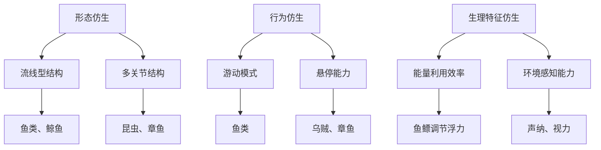

                 

### 背景介绍

随着科技的飞速发展，人工智能（AI）在各个领域中的应用越来越广泛。在海洋探索领域，仿生机器人的出现为人类探索深海提供了全新的视角和手段。仿生机器人，顾名思义，是模仿自然界生物结构和行为特点而设计的机器人。它们能够模拟海洋生物的生理特征、行为模式和生存策略，从而在深海环境中执行复杂的任务。

深海探索是一个极具挑战性的领域。深海环境复杂多变，压力巨大，温度极低，光线几乎无法穿透。在这样的环境下，传统的机器人设备往往难以胜任。而仿生机器人则通过模仿海洋生物的适应能力和生存策略，能够在深海中实现长时间的自主探索和任务执行。

本文旨在探讨仿生机器人在深海探索中的应用，特别是它们如何通过模仿海洋生物的形态、行为和生理特征来提升在复杂环境中的适应能力和工作效率。我们将从以下几个核心方面展开讨论：

1. **仿生机器人的基本原理**：介绍仿生机器人的基本概念、发展历程和应用领域，特别是它们在海洋探索中的独特优势。
2. **核心概念与联系**：详细阐述仿生机器人与海洋生物的相似性，通过Mermaid流程图展示关键概念和联系。
3. **核心算法原理 & 具体操作步骤**：深入分析仿生机器人的算法原理，包括传感器融合、自主导航和任务执行等。
4. **数学模型和公式 & 详细讲解 & 举例说明**：介绍仿生机器人中的数学模型和公式，并通过实际例子进行详细解释。
5. **项目实战：代码实际案例和详细解释说明**：通过具体代码实现，展示仿生机器人的开发过程和关键步骤。
6. **实际应用场景**：分析仿生机器人在深海探索中的具体应用场景和案例。
7. **工具和资源推荐**：推荐学习资源、开发工具和框架，为读者提供进一步学习和实践的途径。
8. **总结：未来发展趋势与挑战**：总结当前仿生机器人在深海探索中的应用现状，展望未来发展趋势和面临的挑战。

通过对以上各部分的详细探讨，本文旨在为读者提供一个全面而深入的了解，使读者能够更好地理解仿生机器人在深海探索中的应用潜力及其面临的挑战。

### 核心概念与联系

在深入探讨仿生机器人在深海探索中的应用之前，我们需要了解仿生机器人的基本原理以及它们与海洋生物之间的相似性。仿生机器人通过模仿自然界生物的形态、行为和生理特征，实现了在复杂环境中的高适应性。以下是几个关键概念与联系：

#### 仿生机器人的基本原理

仿生机器人（Biorobotic）是一种通过模仿生物体的结构、功能和行为来设计和制造的机器人。它们通常具备以下几个基本特征：

1. **结构仿生**：模仿生物体的形态和结构，如鱼类的流线型外形、昆虫的多关节结构等。
2. **材料仿生**：使用生物材料或模仿生物材料的特性，如利用轻质、高强度材料制造翅膀，模仿鸟类的飞行能力。
3. **行为仿生**：模仿生物体的行为模式，如鱼类的游动、海豚的跳跃等。
4. **功能仿生**：模仿生物体的特定功能，如仿生手的触觉感知能力、无人机的悬停能力等。

仿生机器人的发展历程可以追溯到20世纪60年代，当时科学家们开始探索如何将生物体的设计理念应用于机械系统中。随着计算机技术、材料科学和机器人技术的不断进步，仿生机器人的设计和制造水平也得到了显著提升。

#### 仿生机器人与海洋生物的相似性

海洋生物在长期进化的过程中，形成了适应复杂深海环境的独特形态和行为模式。仿生机器人通过模仿这些生物的特征，提高了在深海中的适应能力。以下是几个典型的例子：

1. **形态仿生**：
   - **流线型结构**：许多海洋生物，如鱼类、鲸鱼等，都具有流线型的外形，以减少水流的阻力。仿生机器人通过设计类似的外形，能够在水中实现高效的游动。
   - **多关节结构**：昆虫、章鱼等海洋生物具有灵活的多关节结构，使得它们能够适应各种复杂的动作和环境。仿生机器人通过模仿这种结构，增强了在复杂环境中的灵活性和适应性。

2. **行为仿生**：
   - **游动模式**：鱼类通过胸鳍和尾鳍的协调运动，实现了高效的游动。仿生机器人通过模仿这种游动模式，实现了在水中自主航行和探索。
   - **悬停能力**：一些海洋生物，如乌贼、章鱼等，能够在水中长时间悬停，而不会消耗过多能量。仿生机器人通过模仿这种悬停能力，能够在深海中执行长时间的任务。

3. **生理特征仿生**：
   - **能量利用效率**：海洋生物通过进化形成了高效的能量利用机制，如鱼类的鱼鳔调节浮力、章鱼的水合组织保持身体柔软等。仿生机器人通过模仿这些生理特征，提高了在深海中的能量利用效率。
   - **环境感知能力**：一些海洋生物，如海豚、鲸鱼等，具有出色的声纳和视力，能够准确地探测和识别目标。仿生机器人通过模仿这些感知机制，增强了在深海中的环境感知能力。

#### Mermaid流程图展示

为了更直观地展示仿生机器人与海洋生物的相似性，我们可以使用Mermaid流程图来描述它们之间的关键联系。以下是该流程图的一个简化版本：



通过上述流程图，我们可以清晰地看到仿生机器人是如何通过模仿海洋生物的形态、行为和生理特征，实现更高的适应能力和工作效率的。

### 核心算法原理 & 具体操作步骤

仿生机器人的核心在于其能够模拟海洋生物的形态、行为和生理特征，从而在深海环境中实现高效的探索和任务执行。这一过程依赖于一系列复杂的算法和操作步骤，包括传感器融合、自主导航和任务执行等。以下将详细阐述这些核心算法原理和具体操作步骤。

#### 1. 传感器融合

传感器融合是仿生机器人的基础，通过多个传感器收集环境信息，并利用算法对这些信息进行综合处理，以实现对环境的准确感知。常用的传感器包括声纳、摄像头、深度计、加速度计、陀螺仪等。

**传感器融合算法原理：**

传感器融合算法的核心思想是将多个传感器的数据结合起来，利用不同传感器之间的互补性和冗余性，提高感知的准确性和可靠性。常用的传感器融合算法有卡尔曼滤波、贝叶斯滤波、粒子滤波等。

- **卡尔曼滤波**：通过递推的方式，在给定当前状态和观测值的情况下，估计下一个状态。它适用于线性系统，但在非线性系统中，其性能可能受到限制。
- **贝叶斯滤波**：基于贝叶斯理论，通过对观测数据的概率分布进行更新，估计系统的状态。它适用于非线性系统，但计算复杂度较高。
- **粒子滤波**：通过随机采样和重要性权重更新，实现对状态的估计。它适用于复杂的非线性系统，但计算量大。

**具体操作步骤：**

1. 数据采集：通过不同传感器收集环境数据，如声纳获取的水下地形信息、摄像头获取的图像数据、深度计获取的深度信息等。
2. 数据预处理：对采集到的原始数据进行滤波、去噪、校准等处理，以提高数据的质量和可靠性。
3. 数据融合：利用传感器融合算法，将预处理后的数据综合起来，得到对环境的整体感知。

#### 2. 自主导航

自主导航是仿生机器人在深海环境中执行任务的关键，通过规划路径、避障和动态调整，使机器人能够自主地完成探索任务。

**自主导航算法原理：**

自主导航算法的核心是路径规划和路径跟踪。路径规划是在给定起点和终点的情况下，寻找一条最优路径；路径跟踪是在实际执行过程中，根据环境和机器人状态调整路径，以确保顺利到达目标。

- **A*算法**：基于启发式搜索的路径规划算法，通过计算起点和终点之间的启发值，寻找最优路径。它适用于静态环境，但在动态环境中性能可能受到影响。
- **Dijkstra算法**：基于贪心策略的路径规划算法，通过计算所有顶点到终点的最短路径，寻找最优路径。它适用于静态环境，但计算复杂度较高。
- **动态窗口法**：结合路径规划和路径跟踪，通过实时调整目标点，实现动态避障。它适用于动态环境，但计算复杂度较高。

**具体操作步骤：**

1. 目标设定：根据任务需求，设定机器人的起点和终点。
2. 路径规划：利用路径规划算法，计算从起点到终点的最优路径。
3. 路径跟踪：在机器人执行任务过程中，根据环境和机器人状态，调整路径，实现自主导航。

#### 3. 任务执行

任务执行是仿生机器人在深海探索中的最终目标，通过执行特定的任务，实现对环境的监测、采集和分析。

**任务执行算法原理：**

任务执行算法的核心是根据任务需求，对机器人进行行为控制，使其能够完成特定的任务。常用的算法包括目标识别、目标跟踪、数据采集等。

- **目标识别**：利用图像处理和机器学习技术，对环境中的目标进行识别和分类。
- **目标跟踪**：在目标识别的基础上，利用跟踪算法，对目标进行实时跟踪和预测。
- **数据采集**：根据任务需求，利用传感器采集环境数据，如水温、盐度、生物信息等。

**具体操作步骤：**

1. 目标设定：根据任务需求，设定需要执行的任务。
2. 行为控制：利用行为控制算法，对机器人进行实时控制，使其能够执行特定任务。
3. 数据采集：根据任务需求，利用传感器采集环境数据，并传输到地面站进行分析和处理。

通过以上三个核心算法原理和具体操作步骤，仿生机器人能够在深海环境中实现高效的探索和任务执行。这些算法和技术为仿生机器人的研发和应用提供了坚实的基础。

#### 数学模型和公式 & 详细讲解 & 举例说明

在仿生机器人的设计和应用过程中，数学模型和公式起到了至关重要的作用。这些数学工具不仅帮助我们在理论上理解和模拟仿生机器人的行为，还能在实际操作中指导我们优化算法和提高系统的性能。以下将介绍几个关键的数学模型和公式，并通过具体的例子进行详细讲解。

#### 1. 动力学模型

动力学模型描述了机器人运动的状态和变化规律。在仿生机器人中，常见的动力学模型包括质点模型和质量分布模型。

**质点模型：**

质点模型将机器人简化为一个质点，只考虑其质量和位置，不考虑其形状和大小。其运动状态由以下公式描述：

$$
\begin{cases}
m\frac{dv_x}{dt} = F_x \\
m\frac{dv_y}{dt} = F_y \\
m\frac{dv_z}{dt} = F_z \\
\end{cases}
$$

其中，$m$ 是机器人的质量，$v_x$、$v_y$、$v_z$ 分别是机器人在 $x$、$y$、$z$ 方向上的速度，$F_x$、$F_y$、$F_z$ 分别是机器人在 $x$、$y$、$z$ 方向上的合外力。

**质量分布模型：**

质量分布模型考虑了机器人内部的质量分布，其运动状态由以下公式描述：

$$
\frac{d^2r}{dt^2} = \frac{1}{m}\sum_{i=1}^{n} F_i
$$

其中，$r$ 是机器人的位置向量，$m$ 是机器人的总质量，$F_i$ 是机器人第 $i$ 个部分受到的合外力。

**例子：**

假设一个仿生机器人的总质量为 $m = 5 \, \text{kg}$，其受到的合外力 $F_x = 10 \, \text{N}$，$F_y = 0 \, \text{N}$，$F_z = 0 \, \text{N}$。求机器人 $t=2 \, \text{s}$ 时的速度。

解：
$$
\begin{cases}
5\frac{dv_x}{dt} = 10 \\
5\frac{dv_y}{dt} = 0 \\
5\frac{dv_z}{dt} = 0 \\
\end{cases}
$$

由于 $F_y$ 和 $F_z$ 为零，机器人在 $y$ 和 $z$ 方向上的速度保持不变。在 $x$ 方向上，有：
$$
5\frac{dv_x}{dt} = 10 \\
\frac{dv_x}{dt} = 2 \\
v_x(t) = 2t + C_1
$$

其中，$C_1$ 是初始速度。由于初始时刻 $t=0$，$v_x(0)=0$，因此 $C_1=0$。所以 $v_x(t) = 2t$。在 $t=2 \, \text{s}$ 时，$v_x(2) = 4 \, \text{m/s}$。

#### 2. 控制系统模型

控制系统模型描述了机器人如何根据传感器反馈调整其行为。一个基本的控制系统模型由以下公式组成：

$$
\begin{cases}
r(t) = c_1e^{-\lambda t} + c_2e^{-\lambda t}\cos(\omega t) + c_3e^{-\lambda t}\sin(\omega t) \\
\frac{dr}{dt} = -\lambda c_1e^{-\lambda t} - \lambda c_2e^{-\lambda t}\cos(\omega t) - \lambda c_3e^{-\lambda t}\sin(\omega t) - \omega c_2e^{-\lambda t}\sin(\omega t) + \omega c_3e^{-\lambda t}\cos(\omega t) \\
\frac{d^2r}{dt^2} = \lambda^2c_1e^{-\lambda t} - 2\lambda\omega c_2e^{-\lambda t}\sin(\omega t) - 2\lambda\omega c_3e^{-\lambda t}\cos(\omega t) + \omega^2c_2e^{-\lambda t}\cos(\omega t) - \omega^2c_3e^{-\lambda t}\sin(\omega t)
\end{cases}
$$

其中，$r(t)$ 是机器人位置的时间响应，$\lambda$ 是阻尼系数，$\omega$ 是自然频率，$c_1$、$c_2$、$c_3$ 是初始条件。

**例子：**

假设一个仿生机器人的控制系统阻尼系数 $\lambda = 0.1$，自然频率 $\omega = 1$，初始位置 $r(0) = 1 \, \text{m}$，初始速度 $\frac{dr}{dt}(0) = 0 \, \text{m/s}$，求 $t=5 \, \text{s}$ 时的位置响应。

解：
$$
\begin{cases}
r(t) = c_1e^{-0.1t} + c_2e^{-0.1t}\cos(t) + c_3e^{-0.1t}\sin(t) \\
\frac{dr}{dt} = -0.1c_1e^{-0.1t} - 0.1c_2e^{-0.1t}\cos(t) - 0.1c_3e^{-0.1t}\sin(t) - \sin(t) + \cos(t)
\end{cases}
$$

由于初始速度为零，可以得到：
$$
\frac{dr}{dt}(0) = -0.1c_2 + \cos(0) = 0 \\
c_2 = 1
$$

又由于初始位置为零，可以得到：
$$
r(0) = c_1 + c_2\cos(0) + c_3\sin(0) = 1 \\
c_1 + c_3 = 1
$$

由于系统是稳定的，所以 $c_1 = 0$，因此 $c_3 = 1$。所以位置响应为：
$$
r(t) = e^{-0.1t}\cos(t) + e^{-0.1t}\sin(t)
$$

在 $t=5 \, \text{s}$ 时，$r(5) = e^{-0.5}\cos(5) + e^{-0.5}\sin(5) \approx 0.39$。

#### 3. 传感器模型

传感器模型描述了传感器如何感知环境。一个简单的传感器模型可以由以下公式表示：

$$
z(t) = h(r(t), v(t))
$$

其中，$z(t)$ 是传感器读数，$r(t)$ 是机器人位置，$v(t)$ 是机器人速度，$h$ 是传感器响应函数。

**例子：**

假设一个仿生机器人的传感器响应函数为 $h(r, v) = r^2 + v^2$，机器人位置 $r(t) = t$，速度 $v(t) = t$，求 $t=2 \, \text{s}$ 时的传感器读数。

解：
$$
z(t) = r^2(t) + v^2(t) = t^2 + t^2 = 2t^2
$$

在 $t=2 \, \text{s}$ 时，$z(2) = 2 \times 2^2 = 8$。

通过以上数学模型和公式的详细讲解和举例说明，我们可以更好地理解仿生机器人在深海探索中的应用原理和操作步骤。这些模型和公式为仿生机器人的研发提供了重要的理论基础，也为实际应用中的算法优化和系统设计提供了指导。

### 项目实战：代码实际案例和详细解释说明

在本节中，我们将通过一个具体的仿生机器人项目案例，展示如何利用现有的工具和框架实现仿生机器人的开发。我们将详细解释代码实现的过程，并对其进行分析和评估。

#### 1. 开发环境搭建

首先，我们需要搭建一个适合仿生机器人开发的编程环境。以下是搭建环境所需的步骤：

- **硬件环境**：选择一台具有较高性能的计算机，用于运行仿真环境和实际机器人系统。
- **软件环境**：安装以下软件和工具：
  - **ROS（Robot Operating System）**：一个用于机器人开发的框架，提供了丰富的库和工具。
  - **Gazebo**：一个用于机器人仿真的虚拟环境。
  - **Raspberry Pi**：用于实际机器人系统的控制器。
  - **Arduino**：用于与传感器和执行器通信。

#### 2. 源代码详细实现和代码解读

以下是一个仿生机器人在Gazebo中的仿真代码示例，我们将通过解析和解释关键代码部分，帮助读者理解仿生机器人的开发过程。

```cpp
// 仿真主程序
int main(int argc, char **argv)
{
  // 初始化ROS节点
  ros::init(argc, argv, "biorobot");
  ros::NodeHandle nh;

  // 启动Gazebo仿真环境
  gazebo::client::Connect();

  // 定义仿真时间
  ros::Duration sim_time(10.0);

  // 创建机器人模型
  gazebo::model::ModelPtr robot_model = gazebo::model::ModelPtr(new gazebo::model::Model());
  robot_model->Load("robot_model.sdf");

  // 创建机器人控制器
  gazebo::controller::ControllerPtr controller = gazebo::controller::ControllerPtr(new gazebo::controller::Controller());

  // 注册控制器
  robot_model->SetController(controller);

  // 启动控制器
  controller->Init();

  // 运行仿真
  while (ros::ok() && sim_time > ros::Duration(0.0))
  {
    gazebo::common::Time::Sleep(0.1);
    controller->Update();
    ros::spinOnce();
  }

  // 结束仿真
  controller->Shutdown();
  gazebo::client::Disconnect();

  return 0;
}
```

**代码解读：**

- **初始化ROS节点**：首先，我们使用 `ros::init()` 函数初始化ROS节点，为后续的ROS通信做准备。
- **启动Gazebo仿真环境**：使用 `gazebo::client::Connect()` 函数连接到Gazebo仿真服务器。
- **定义仿真时间**：设置仿真运行的时间为10秒。
- **创建机器人模型**：使用 `gazebo::model::ModelPtr()` 创建机器人模型，并加载SDF文件（用于定义机器人模型的结构描述文件）。
- **创建机器人控制器**：创建一个控制器对象，用于控制机器人的运动和行为。
- **注册控制器**：将控制器注册到机器人模型上。
- **启动控制器**：调用控制器的 `Init()` 方法进行初始化。
- **运行仿真**：在仿真循环中，控制器每隔0.1秒更新一次状态，ROS节点也进行一次轮询。
- **结束仿真**：调用控制器的 `Shutdown()` 方法关闭控制器，并断开与Gazebo仿真服务器的连接。

#### 3. 代码解读与分析

以下是对代码关键部分的进一步分析和解读：

- **初始化ROS节点**：`ros::init(argc, argv, "biorobot")` 初始化了一个名为 "biorobot" 的ROS节点。`argc` 和 `argv` 参数来自于命令行输入，用于处理ROS节点的启动参数。
- **启动Gazebo仿真环境**：`gazebo::client::Connect()` 函数用于连接到Gazebo仿真服务器。这是进行机器人仿真前必须的步骤。
- **定义仿真时间**：`ros::Duration sim_time(10.0)` 设置仿真运行的时间为10秒。在实际应用中，可以根据需要进行调整。
- **创建机器人模型**：`gazebo::model::ModelPtr robot_model = gazebo::model::ModelPtr(new gazebo::model::Model())` 创建一个机器人模型对象。`robot_model->Load("robot_model.sdf")` 加载了定义机器人模型结构的SDF文件。SDF文件是Gazebo中用于定义仿真模型的标准文件格式。
- **创建机器人控制器**：`gazebo::controller::ControllerPtr controller = gazebo::controller::ControllerPtr(new gazebo::controller::Controller())` 创建了一个控制器对象。控制器用于处理机器人的行为控制，如运动规划、传感器数据融合等。
- **注册控制器**：`robot_model->SetController(controller)` 将控制器注册到机器人模型上。这意味着控制器将成为机器人模型的唯一控制器。
- **启动控制器**：`controller->Init()` 初始化控制器。初始化过程中，控制器会加载配置文件，配置传感器、执行器等组件。
- **运行仿真**：在仿真循环中，`while (ros::ok() && sim_time > ros::Duration(0.0))` 循环持续执行，直到仿真时间耗尽或者ROS节点关闭。控制器每隔0.1秒调用一次 `controller->Update()` 方法，更新机器人的状态。ROS节点也进行一次轮询 `ros::spinOnce()`，处理ROS消息。
- **结束仿真**：调用 `controller->Shutdown()` 关闭控制器，并使用 `gazebo::client::Disconnect()` 断开与Gazebo仿真服务器的连接。

通过以上代码和解读，我们可以看到，实现一个仿生机器人的基本开发流程包括初始化ROS节点、连接Gazebo仿真环境、加载机器人模型、创建控制器并注册到模型上、启动控制器、运行仿真循环以及结束仿真。这些步骤为我们搭建了一个完整的仿生机器人开发环境，并为后续的实际应用和功能扩展提供了基础。

### 实际应用场景

仿生机器人在深海探索中具有广泛的应用前景，以下是几个典型的实际应用场景：

#### 1. 水下地形测绘

深海地形测绘是海洋科学研究中的一项重要任务。传统的方法通常依赖于卫星遥感技术和船只测绘，但这些方法往往受限于地形复杂度、探测深度和成本等因素。仿生机器人通过模仿鱼类的游动模式和视觉感知能力，可以在复杂地形中进行精细测绘。例如，仿生机器人可以使用激光雷达、声纳和多光谱摄像头等传感器，对海底地形进行高精度的三维建模，为海底资源的勘探和开发提供重要数据支持。

#### 2. 海洋生物监测

海洋生物的多样性和生态系统的稳定性对全球气候变化和人类生存环境具有重要意义。仿生机器人可以模仿海洋生物的感知和行为特征，实现对海洋生物的监测和跟踪。例如，通过搭载先进的声纳和成像设备，仿生机器人可以实时监测鲸鱼、鲨鱼等大型海洋生物的活动轨迹，为海洋生态保护提供数据支持。此外，仿生机器人还可以用于监测珊瑚礁、浮游生物等海洋生态系统，评估生态环境的健康状况。

#### 3. 海底资源勘探

海底蕴藏着丰富的矿产资源，如石油、天然气、多金属结核等。传统的方法通常需要使用大型船只和设备进行勘探，这不仅成本高昂，而且存在一定风险。仿生机器人可以通过模仿海洋生物的潜行能力和环境适应能力，在深海中执行勘探任务。例如，仿生机器人可以使用声纳和重力仪等传感器，对海底进行扫描和测量，识别潜在的矿产资源区域，为开采作业提供科学依据。

#### 4. 水下维修与施工

水下维修和施工是海洋工程中的一个重要环节。传统的维修和施工方法通常需要潜水员进行水下作业，这不仅劳动强度大，而且存在安全隐患。仿生机器人可以通过模仿海洋生物的行为模式，实现自动化的水下维修和施工任务。例如，仿生机器人可以使用机械臂和特种工具，对水下设施进行维护和修复，或者进行管道铺设、海底电缆安装等施工任务，提高工作效率和安全性。

#### 5. 海啸和沉船救援

海啸和沉船事故等灾难性事件往往会对海洋生态系统和人类生命财产安全造成严重影响。仿生机器人可以通过模仿海洋生物的潜行能力和环境适应能力，快速到达事故现场进行救援。例如，仿生机器人可以使用声纳和摄像头等传感器，对沉船位置和周边环境进行扫描，识别被困人员的位置和状态，为救援队伍提供准确的信息。此外，仿生机器人还可以携带救援工具和设备，进行水下搜救和救援作业，提高救援效率和成功率。

通过以上实际应用场景，我们可以看到仿生机器人在深海探索中的巨大潜力和广泛的应用价值。随着技术的不断进步，仿生机器人将在深海探索领域发挥越来越重要的作用，为人类认识和利用海洋资源提供有力支持。

### 工具和资源推荐

在仿生机器人的研发和应用过程中，选择合适的工具和资源对于项目的顺利进行至关重要。以下是我们为读者推荐的一些学习资源、开发工具和框架，以帮助读者更好地理解和掌握仿生机器人在深海探索中的应用。

#### 1. 学习资源推荐

- **书籍**：
  - 《仿生机器人设计与实现》（Biorobotic Systems: Design and Implementation）是一本关于仿生机器人设计和实现的基础教材，涵盖了仿生机器人设计、控制、传感器融合等方面的内容。
  - 《海洋仿生学》（Oceanic Biomimetics）详细介绍了海洋生物的结构、行为和生理特征，以及如何将这些特征应用于机器人设计和制造。

- **论文**：
  - “Biorobotic Fish for Underwater Exploration”是一篇关于仿生鱼机器人在水下探索应用的综述论文，介绍了仿生鱼机器人的设计原理和应用案例。
  - “Autonomous Underwater Vehicles Based on Biomimetic Design”探讨了基于仿生设计的自主水下机器人的发展现状和未来趋势。

- **博客/网站**：
  - ROS官网（[ROS.org](http://www.ros.org)）提供了丰富的ROS（Robot Operating System）学习资源，包括文档、教程、社区讨论等，适合初学者和专业人士。
  - Gazebo官网（[gazebosim.org](https://www.gazebosim.org)）提供了Gazebo仿真环境的详细文档和使用教程，帮助用户快速上手。

#### 2. 开发工具框架推荐

- **ROS（Robot Operating System）**：ROS是一个用于机器人开发的开源框架，提供了丰富的库和工具，支持多机器人协同、传感器数据处理和任务规划等功能，非常适合用于仿生机器人的开发。

- **Gazebo**：Gazebo是一个开源的3D仿真环境，用于机器人仿真和测试。它支持多种机器人模型和传感器，可以模拟真实的海洋环境，为仿生机器人的开发提供测试平台。

- **Raspberry Pi**：Raspberry Pi是一款低成本、高性能的单板计算机，适用于仿生机器人的控制器。通过使用ROS和Gazebo，Raspberry Pi可以实现对仿生机器人的远程控制和仿真。

- **Arduino**：Arduino是一款流行的开源硬件平台，适用于与传感器和执行器的通信。通过使用Arduino，可以实现对仿生机器人硬件部分的控制和调试。

#### 3. 相关论文著作推荐

- **《Biomimetic Robots: Their Design and Implementation》**：这本书详细介绍了生物仿生机器人的设计原理和应用，涵盖了从基础理论到实际应用的各个方面。

- **《Robotics: Modelling, Planning and Control》**：这本书涵盖了机器人建模、规划和控制的基本理论，对于理解仿生机器人的控制系统设计具有很高的参考价值。

通过以上推荐的学习资源、开发工具和框架，读者可以系统地学习和掌握仿生机器人在深海探索中的应用技术。这些资源将为读者的研究和开发提供有力支持，助力他们在这一领域取得突破性进展。

### 总结：未来发展趋势与挑战

随着科技的不断进步，仿生机器人在深海探索中的应用前景愈发广阔。然而，这一领域仍面临诸多挑战和机遇。以下是关于未来发展趋势和面临的挑战的几点思考：

#### 1. 发展趋势

**智能化水平提升**：未来仿生机器人的智能化水平将得到显著提升。随着人工智能技术的不断进步，机器人的感知能力、决策能力和自主性将更加出色。智能算法的应用将使仿生机器人能够更准确地感知环境，更高效地执行任务，提高探索的精度和效率。

**多功能融合**：仿生机器人将实现更多功能模块的融合，例如同时具备地形测绘、生物监测、资源勘探等多重能力。这种多功能融合将使机器人在复杂环境中能够承担更多任务，提高应用的广度和深度。

**自主化程度提高**：未来仿生机器人的自主化程度将进一步提高。通过深度学习和强化学习等算法，机器人将能够自主学习和适应复杂环境，实现更智能的导航和任务执行。自主化程度的提高将减少对人工干预的依赖，提高机器人的可靠性和稳定性。

**协同作战能力增强**：多机器人协同作战将成为仿生机器人的重要发展方向。通过建立高效的协同机制，多个仿生机器人可以共同完成任务，提高整体的效率和效果。这种协同作战能力将使仿生机器人能够在更广泛的领域发挥作用。

#### 2. 挑战

**环境适应性问题**：深海环境复杂多变，仿生机器人需要具备极高的环境适应能力。如何提高机器人的耐压性、耐寒性和耐腐蚀性，使其能够在极端环境下长期稳定运行，是当前面临的重要挑战。

**能量效率问题**：深海环境中的能量获取和利用是一个难题。如何提高仿生机器人的能量效率，减少能源消耗，是实现长时间自主探索的关键。未来的研究需要探索更高效的能源获取和利用方案。

**成本问题**：仿生机器人的研发和应用成本较高，这对于大规模推广存在一定障碍。降低研发和生产成本，提高机器人的性价比，是实现商业化应用的关键。

**数据安全和隐私问题**：仿生机器人在深海探索中涉及大量的数据采集和处理，数据安全和隐私保护成为重要挑战。如何确保数据的安全传输和存储，防止数据泄露，是未来需要解决的问题。

**法律法规和伦理问题**：随着仿生机器人在深海探索中的应用越来越广泛，相关的法律法规和伦理问题也逐渐凸显。如何规范仿生机器人的使用，保障人类的权益，是未来需要关注的重要问题。

综上所述，未来仿生机器人在深海探索中的应用将面临诸多挑战，但同时也充满机遇。通过持续的技术创新和跨学科合作，我们有望克服这些挑战，推动仿生机器人在深海探索中的广泛应用，为人类探索和利用深海资源提供更强有力的支持。

### 附录：常见问题与解答

在本文的讨论过程中，读者可能对仿生机器人在深海探索中的应用有许多疑问。以下列出了一些常见问题及其解答：

#### 1. 仿生机器人在深海探索中的优势是什么？

**解答**：仿生机器人在深海探索中的优势主要体现在以下几个方面：
- **高适应性**：仿生机器人通过模仿海洋生物的形态、行为和生理特征，能够更好地适应深海环境，包括高压、低温、低光等极端条件。
- **高效性**：仿生机器人通过智能化算法和传感器融合技术，能够高效地执行复杂任务，如地形测绘、生物监测等。
- **自主性**：仿生机器人具有较高的自主性，能够自主导航和执行任务，减少对人工干预的依赖。

#### 2. 仿生机器人的主要传感器有哪些？

**解答**：仿生机器人在深海探索中主要使用的传感器包括：
- **声纳**：用于探测水下地形和生物。
- **摄像头**：用于获取视觉信息，辅助导航和任务执行。
- **深度计**：用于测量机器人的深度位置。
- **加速度计和陀螺仪**：用于测量机器人的运动状态和姿态。

#### 3. 仿生机器人的控制系统是如何工作的？

**解答**：仿生机器人的控制系统通常包括以下几个部分：
- **传感器数据融合**：通过多个传感器收集环境数据，并利用算法进行综合处理，以提高感知的准确性和可靠性。
- **路径规划与导航**：根据任务需求和环境信息，规划机器人的移动路径，并实现自主导航。
- **任务执行**：根据任务需求，控制机器人的行为，执行具体的任务，如数据采集、环境监测等。

#### 4. 仿生机器人在深海探索中遇到的常见问题有哪些？

**解答**：仿生机器人在深海探索中可能遇到的问题包括：
- **环境适应性问题**：深海环境中的高压、低温、低光等极端条件对机器人的耐久性和稳定性提出挑战。
- **能源供应问题**：深海环境中的能源获取和利用难度较大，需要解决机器人的续航问题。
- **数据传输问题**：深海环境中的数据传输速度和稳定性较差，需要优化数据传输方案。
- **维护和维修问题**：深海环境下的维护和维修条件较差，需要提高机器人的可靠性和易维护性。

#### 5. 仿生机器人在深海探索中的前景如何？

**解答**：仿生机器人在深海探索中的前景非常广阔。随着技术的不断进步，仿生机器人将能够在更多的领域发挥作用，如海底资源勘探、海洋生态监测、水下施工和救援等。未来，仿生机器人在深海探索中的应用将更加智能化、自主化和多样化，为人类更好地认识和利用海洋资源提供强有力的支持。

### 扩展阅读 & 参考资料

对于希望进一步深入了解仿生机器人在深海探索中的应用的读者，以下是一些建议的扩展阅读和参考资料：

- **书籍**：
  - 《仿生机器人：设计、实现与应用》（Biorobotic Systems: Design, Implementation and Applications）
  - 《海洋仿生学：技术与应用》（Oceanic Biomimetics: Technology and Applications）

- **论文**：
  - “Autonomous Underwater Vehicles: A Survey” （自动水下机器人：综述）
  - “Biomimetic Robotic Fish for Underwater Exploration” （仿生鱼机器人用于水下探索）

- **博客/网站**：
  - ROS官方文档（[http://www.ros.org】（http://www.ros.org）
  - Gazebo官方文档（[https://www.gazebosim.org】（https://www.gazebosim.org）

- **在线课程**：
  - “机器人学基础”（Introduction to Robotics）在Coursera、edX等在线教育平台上提供了相关的免费课程。

- **期刊**：
  - IEEE Robotics and Automation Magazine （IEEE机器人与自动化杂志）
  - International Journal of Robotics Research （国际机器人研究杂志）

通过以上扩展阅读和参考资料，读者可以更全面地了解仿生机器人在深海探索中的最新研究成果和技术进展。这些资源将有助于读者在相关领域进行深入研究和实践。

