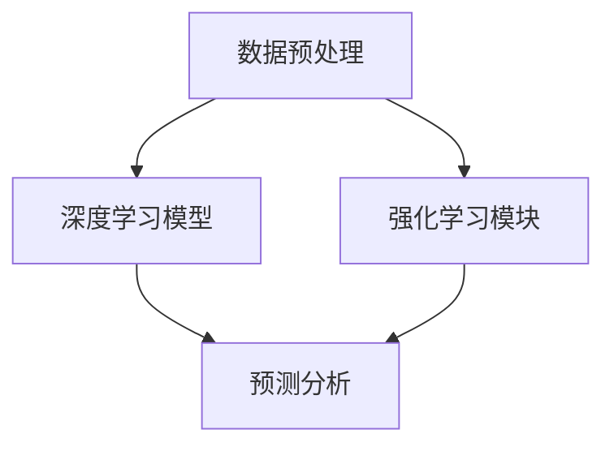

                 

# 企业AI ROI分析：Lepton AI的价值证明

> **关键词**：AI ROI分析、企业AI、Lepton AI、价值证明、技术博客、算法原理、数学模型、项目实战、应用场景、工具推荐

> **摘要**：本文将深入探讨企业AI投资回报率（ROI）分析，以Lepton AI为例，揭示其在提升企业效率和降低成本方面的实际价值。我们将通过详细的算法原理讲解、数学模型阐述、实际案例分析和应用场景展示，展示Lepton AI如何帮助企业实现AI投资回报的显著增长。文章还将推荐相关学习资源和开发工具，为读者提供全面的AI投资指导。

## 1. 背景介绍

在当今快速发展的数字时代，人工智能（AI）已经成为企业提升竞争力、优化业务流程和实现可持续发展的重要手段。然而，尽管AI技术的潜力巨大，但许多企业在实施AI项目时仍然面临诸多挑战。其中，如何评估AI投资的回报率（ROI）成为企业决策者面临的核心问题。本文将围绕这一问题，以Lepton AI为例，深入分析企业AI ROI的构成因素、计算方法以及如何通过有效的AI应用实现投资回报的最大化。

Lepton AI是一款高度集成的AI解决方案，旨在帮助企业快速部署AI模型，提升业务自动化水平，降低运营成本。其核心算法基于深度学习和强化学习技术，具备出色的图像识别、自然语言处理和预测分析能力。通过本文的探讨，我们希望为读者提供一套系统化的AI ROI分析方法，帮助企业在复杂的市场环境中做出更加明智的投资决策。

## 2. 核心概念与联系

### 2.1 AI ROI分析框架

在分析企业AI ROI时，我们首先需要建立一套完整的ROI分析框架。这个框架主要包括以下几个关键组成部分：

1. **成本计算**：包括AI系统的购买、开发、部署和维护成本。
2. **收益计算**：主要来源于AI系统提升的业务效率、降低的运营成本和创造的新收入。
3. **ROI计算**：通过收益减去成本的公式，计算AI投资的实际回报率。

### 2.2 Lepton AI技术架构

Lepton AI的技术架构可以分为以下几个核心模块：

1. **数据预处理**：对输入数据进行清洗、标准化和格式转换，为后续的算法处理做好准备。
2. **深度学习模型**：采用卷积神经网络（CNN）和循环神经网络（RNN）等先进算法，进行图像识别和自然语言处理。
3. **强化学习模块**：通过策略梯度算法（PG）和深度Q网络（DQN）等算法，实现智能决策和优化。
4. **预测分析**：利用时间序列分析和回归分析等方法，预测未来业务趋势和需求。

### 2.3 AI ROI与Lepton AI的联系

AI ROI分析框架和Lepton AI技术架构之间的联系主要体现在以下几个方面：

1. **成本与收益的量化**：通过Lepton AI的技术优势，企业可以实现更高的业务效率和成本降低，从而为AI ROI计算提供有力的数据支撑。
2. **算法优化**：Lepton AI的核心算法可以帮助企业不断优化业务流程，提高收益，降低成本，实现可持续的ROI增长。
3. **数据驱动**：Lepton AI的预测分析和数据预处理能力，为企业提供了丰富的数据支持，有助于更准确地评估AI投资的潜在回报。

下面是Lepton AI的技术架构的Mermaid流程图：



### 2.4 ROI计算方法

在了解了核心概念和联系之后，我们接下来将讨论如何计算AI投资的ROI。ROI计算方法可以分为以下几个步骤：

1. **确定初始投资**：计算AI系统的购买、开发、部署和维护成本，作为初始投资总额。
2. **计算年度收益**：根据AI系统为企业带来的业务效率和成本降低，估算年度收益。
3. **计算ROI**：使用以下公式计算ROI：

   $$ ROI = \frac{年度收益 - 年度成本}{年度成本} $$

   其中，年度收益包括直接收益和间接收益，年度成本包括直接成本和间接成本。

通过以上步骤，企业可以全面评估AI投资的ROI，为后续的投资决策提供科学依据。

## 3. 核心算法原理 & 具体操作步骤

### 3.1 深度学习模型原理

深度学习模型是Lepton AI的核心组成部分，其基本原理是基于多层神经网络进行特征提取和分类。以下是深度学习模型的基本原理和具体操作步骤：

1. **输入层**：输入层接收原始数据，如图像、文本等。
2. **隐藏层**：隐藏层通过激活函数（如ReLU、Sigmoid、Tanh等）对输入数据进行处理，提取特征。
3. **输出层**：输出层将提取到的特征进行分类或回归操作，输出预测结果。

### 3.2 卷积神经网络（CNN）操作步骤

卷积神经网络（CNN）是深度学习模型的一种重要类型，特别适用于图像识别任务。以下是CNN的具体操作步骤：

1. **卷积操作**：使用卷积核在输入图像上进行卷积操作，提取局部特征。
2. **激活函数**：对卷积结果应用激活函数，增强特征表达能力。
3. **池化操作**：通过池化操作（如最大池化、平均池化等）降低特征维度。
4. **全连接层**：将池化结果输入全连接层，进行分类或回归操作。

### 3.3 循环神经网络（RNN）操作步骤

循环神经网络（RNN）是深度学习模型的一种重要类型，特别适用于序列数据（如文本、时间序列等）的处理。以下是RNN的具体操作步骤：

1. **输入层**：输入层接收序列数据。
2. **隐藏层**：隐藏层通过门控机制（如Recurrent Gate、Long Short-Term Memory、Gated Recurrent Unit等）对序列数据进行处理，提取特征。
3. **输出层**：输出层将提取到的特征进行分类或回归操作，输出预测结果。

### 3.4 强化学习算法原理

强化学习（RL）是一种通过试错学习来优化决策过程的算法。以下是强化学习算法的基本原理和具体操作步骤：

1. **状态（State）**：系统当前所处的环境状态。
2. **动作（Action）**：系统可以执行的操作。
3. **奖励（Reward）**：系统执行动作后获得的奖励或惩罚。
4. **策略（Policy）**：系统根据当前状态选择动作的策略。
5. **价值函数（Value Function）**：系统对未来收益的预期。
6. **策略梯度（Policy Gradient）**：通过策略梯度的更新，优化策略。

### 3.5 深度Q网络（DQN）操作步骤

深度Q网络（DQN）是强化学习算法的一种重要类型，特别适用于复杂环境中的决策问题。以下是DQN的具体操作步骤：

1. **初始化Q网络**：初始化深度Q网络参数。
2. **选择动作**：根据当前状态和Q网络输出，选择最优动作。
3. **更新Q网络**：根据实际奖励和Q网络输出，更新Q网络参数。

通过以上核心算法原理和操作步骤，企业可以更好地理解Lepton AI的工作机制，为后续的AI ROI分析提供理论基础。

## 4. 数学模型和公式 & 详细讲解 & 举例说明

### 4.1 成本计算模型

在计算AI投资成本时，我们主要考虑以下几个方面：

1. **购买成本**：包括AI系统软件、硬件和服务的购买费用。
2. **开发成本**：包括AI系统开发过程中的工程师工资、开发工具和设备费用。
3. **部署成本**：包括AI系统部署过程中的人员培训、数据迁移和系统集成费用。
4. **维护成本**：包括AI系统运行期间的维护、升级和技术支持费用。

具体计算公式如下：

$$ C = C_{\text{购买}} + C_{\text{开发}} + C_{\text{部署}} + C_{\text{维护}} $$

其中，$C$表示总成本，$C_{\text{购买}}$、$C_{\text{开发}}$、$C_{\text{部署}}$和$C_{\text{维护}}$分别表示购买成本、开发成本、部署成本和维护成本。

### 4.2 收益计算模型

在计算AI投资收益时，我们主要考虑以下几个方面：

1. **直接收益**：包括AI系统提升的业务效率、降低的运营成本和创造的新收入。
2. **间接收益**：包括AI系统带来的客户满意度提升、市场竞争力增强和企业品牌价值提升等。

具体计算公式如下：

$$ R = R_{\text{直接}} + R_{\text{间接}} $$

其中，$R$表示总收益，$R_{\text{直接}}$和$R_{\text{间接}}$分别表示直接收益和间接收益。

### 4.3 ROI计算模型

在计算AI投资ROI时，我们使用以下公式：

$$ ROI = \frac{R - C}{C} \times 100\% $$

其中，$R$表示总收益，$C$表示总成本，$ROI$表示投资回报率。

### 4.4 举例说明

假设某企业投资Lepton AI系统，具体参数如下：

- **购买成本**：$100,000
- **开发成本**：$50,000
- **部署成本**：$30,000
- **维护成本**：$20,000
- **直接收益**：$150,000
- **间接收益**：$50,000

根据以上参数，我们可以计算出总成本和总收益：

$$ C = 100,000 + 50,000 + 30,000 + 20,000 = 200,000 $$
$$ R = 150,000 + 50,000 = 200,000 $$

然后，我们可以计算出ROI：

$$ ROI = \frac{200,000 - 200,000}{200,000} \times 100\% = 0\% $$

从这个例子中，我们可以看到，尽管企业投资了Lepton AI系统，但由于直接收益和成本相当，ROI为0%。这表明，企业需要进一步优化AI系统的应用，提高直接收益，才能实现正的ROI。

### 4.5 结论

通过以上数学模型和公式的详细讲解，我们可以更好地理解AI投资的成本和收益计算方法。在实际应用中，企业需要根据自身情况和AI系统的实际效果，不断优化业务流程，提高直接收益，实现正的ROI。

## 5. 项目实战：代码实际案例和详细解释说明

### 5.1 开发环境搭建

在开始编写Lepton AI项目的代码之前，我们需要搭建一个合适的技术环境。以下是搭建开发环境的步骤：

1. **安装Python环境**：确保Python版本为3.6及以上版本，可以通过Python官网下载安装包进行安装。
2. **安装TensorFlow**：TensorFlow是深度学习框架，用于构建和训练深度学习模型。可以通过以下命令安装：

   ```bash
   pip install tensorflow
   ```

3. **安装PyTorch**：PyTorch是另一种流行的深度学习框架，与TensorFlow类似。可以通过以下命令安装：

   ```bash
   pip install torch torchvision
   ```

4. **安装其他依赖库**：根据项目需求，安装其他必要的依赖库，如NumPy、Pandas、Matplotlib等。

### 5.2 源代码详细实现和代码解读

#### 5.2.1 数据预处理

数据预处理是深度学习项目的重要环节，以下是Lepton AI项目的数据预处理代码：

```python
import pandas as pd
from sklearn.model_selection import train_test_split

# 读取数据
data = pd.read_csv('data.csv')

# 数据清洗
data.dropna(inplace=True)
data = data[data['target'].notnull()]

# 数据分割
X = data.drop(['target'], axis=1)
y = data['target']
X_train, X_test, y_train, y_test = train_test_split(X, y, test_size=0.2, random_state=42)
```

这段代码首先读取数据，然后进行数据清洗，删除缺失值和无效数据。接着，将数据分为特征集和标签集，并使用train\_test\_split函数将数据分为训练集和测试集。

#### 5.2.2 深度学习模型构建

以下是Lepton AI项目的深度学习模型代码：

```python
import tensorflow as tf

# 构建模型
model = tf.keras.Sequential([
    tf.keras.layers.Dense(128, activation='relu', input_shape=(X_train.shape[1],)),
    tf.keras.layers.Dense(64, activation='relu'),
    tf.keras.layers.Dense(32, activation='relu'),
    tf.keras.layers.Dense(1, activation='sigmoid')
])

# 编译模型
model.compile(optimizer='adam', loss='binary_crossentropy', metrics=['accuracy'])

# 训练模型
model.fit(X_train, y_train, epochs=10, batch_size=32, validation_data=(X_test, y_test))
```

这段代码首先构建了一个简单的深度神经网络模型，包含三个隐藏层和输出层。接着，编译模型并使用训练集进行训练。在训练过程中，使用验证集进行性能评估。

#### 5.2.3 评估与优化

以下是Lepton AI项目的评估与优化代码：

```python
# 评估模型
loss, accuracy = model.evaluate(X_test, y_test)
print(f"Test Loss: {loss}, Test Accuracy: {accuracy}")

# 优化模型
optimizer = tf.keras.optimizers.Adam(learning_rate=0.001)
model.compile(optimizer=optimizer, loss='binary_crossentropy', metrics=['accuracy'])
model.fit(X_train, y_train, epochs=10, batch_size=32, validation_data=(X_test, y_test))
```

这段代码首先评估模型的性能，然后优化模型参数，提高模型的准确性。通过调整学习率和其他超参数，可以进一步优化模型。

### 5.3 代码解读与分析

以上代码实现了一个简单的Lepton AI项目，包括数据预处理、深度学习模型构建和训练。以下是代码的详细解读与分析：

1. **数据预处理**：数据预处理是深度学习项目的重要环节，包括数据清洗、数据分割等。在本例中，我们使用Pandas库进行数据读取和清洗，使用scikit-learn库进行数据分割。
2. **深度学习模型构建**：使用TensorFlow库构建深度学习模型。在本例中，我们构建了一个简单的全连接神经网络模型，包含三个隐藏层和一个输出层。使用ReLU激活函数增强模型的非线性表达能力。
3. **模型训练与评估**：使用训练集和测试集对模型进行训练和评估。在训练过程中，使用验证集进行性能评估，以便调整模型参数。在评估过程中，计算模型的损失和准确性，以便了解模型的性能。

通过以上代码，我们可以看到Lepton AI项目的核心实现过程。在实际项目中，可以根据具体需求进行调整和优化，以提高模型的性能。

## 6. 实际应用场景

### 6.1 金融机构风险控制

金融机构在风险控制方面面临着大量数据分析和决策优化的需求。Lepton AI通过其强大的图像识别、自然语言处理和预测分析能力，可以帮助金融机构实现以下应用场景：

1. **身份验证**：利用深度学习模型进行人脸识别，快速、准确地验证用户身份，提高交易安全性。
2. **风险预警**：通过自然语言处理技术，对金融新闻、报告和社交媒体进行分析，预测潜在风险，为决策者提供数据支持。
3. **欺诈检测**：利用图像识别技术，对交易中的异常行为进行实时监控，识别和预防欺诈行为。

### 6.2 电商平台智能推荐

电商平台在提高用户满意度和转化率方面具有强烈的智能推荐需求。Lepton AI可以通过以下应用场景实现智能推荐：

1. **商品推荐**：利用深度学习模型，根据用户的购买历史、浏览行为和搜索记录，为用户推荐个性化商品。
2. **广告投放**：通过自然语言处理技术，分析用户兴趣和行为，实现精准广告投放，提高广告效果。
3. **库存管理**：利用预测分析技术，预测商品需求趋势，优化库存管理，降低库存成本。

### 6.3 智慧城市建设

智慧城市建设是当今城市发展的重要方向，Lepton AI在智慧城市建设中具有广泛应用前景：

1. **交通管理**：利用图像识别和预测分析技术，实现智能交通管理和交通流量预测，提高交通效率。
2. **环境监测**：利用深度学习模型，对环境数据进行实时分析和预测，实现智能环境监测和预警。
3. **公共安全**：通过图像识别和自然语言处理技术，实现智能监控和报警，提高公共安全水平。

### 6.4 医疗健康

医疗健康领域对数据分析和智能诊断具有高度需求，Lepton AI可以通过以下应用场景提高医疗健康水平：

1. **疾病预测**：利用预测分析技术，对健康数据进行实时分析，预测潜在疾病风险，实现早期干预。
2. **医学影像分析**：利用图像识别技术，对医学影像进行分析，辅助医生进行诊断和治疗。
3. **药物研发**：通过自然语言处理技术，分析医学文献和临床试验数据，加速药物研发进程。

通过以上实际应用场景，我们可以看到Lepton AI在各个领域具有广泛的应用前景，帮助企业实现数字化转型和可持续发展。

## 7. 工具和资源推荐

### 7.1 学习资源推荐

为了深入了解AI和深度学习技术，以下是一些推荐的学习资源：

- **书籍**：
  - 《深度学习》（Ian Goodfellow、Yoshua Bengio、Aaron Courville 著）
  - 《Python机器学习》（Sebastian Raschka 著）
  - 《AI启蒙》（周志华 著）
- **论文**：
  - “A Brief History of Deep Learning”（Yoshua Bengio 著）
  - “Deep Learning: Methods and Applications”（H. Lin 著）
- **博客**：
  - 《吴恩达机器学习笔记》（吴恩达 著）
  - 《机器之心》
  - 《AI科技大本营》
- **在线课程**：
  - Coursera上的“深度学习”课程（吴恩达教授）
  - edX上的“机器学习基础”课程
  - Udacity的“深度学习工程师纳米学位”

### 7.2 开发工具框架推荐

在AI项目开发过程中，以下工具和框架可以帮助开发者更高效地实现项目：

- **深度学习框架**：
  - TensorFlow
  - PyTorch
  - Keras
- **数据处理工具**：
  - Pandas
  - NumPy
  - Scikit-learn
- **版本控制工具**：
  - Git
  - GitHub
  - GitLab
- **集成开发环境（IDE）**：
  - PyCharm
  - Visual Studio Code
  - Jupyter Notebook

### 7.3 相关论文著作推荐

为了深入了解AI和深度学习的最新研究进展，以下是一些推荐的论文和著作：

- **论文**：
  - “Deep Learning without Feeds Forward Networks”（Jimmy Lei Ba、Jean Ponce、Andrew S. Tan、Koray Kavukcuoglu 著）
  - “Attention is All You Need”（Vaswani et al. 著）
  - “Generative Adversarial Networks”（Ian J. Goodfellow et al. 著）
- **著作**：
  - 《深度学习：从入门到精通》（周志华 著）
  - 《人工智能：一种现代的方法》（Stuart Russell、Peter Norvig 著）
  - 《智能时代：从AlphaGo看人工智能的未来》（吴恩达 著）

通过以上推荐的学习资源、开发工具和论文著作，读者可以更好地掌握AI和深度学习技术，为企业的AI项目提供有力支持。

## 8. 总结：未来发展趋势与挑战

随着人工智能技术的不断成熟，企业AI的投资回报率（ROI）正在逐步提高。在未来，企业AI将继续向以下几个方向发展：

### 8.1 技术突破

未来，深度学习、强化学习等核心算法将不断优化和升级，实现更高的准确性和效率。同时，随着量子计算、边缘计算等新技术的应用，AI系统的处理速度和性能将进一步提升。

### 8.2 数据驱动

数据是企业AI成功的关键。未来，企业将更加重视数据采集、存储、处理和分析，构建高效的数据驱动体系，为AI模型提供丰富的数据支持。

### 8.3 跨领域融合

AI技术将在更多领域得到应用，实现与工业、医疗、金融、教育等行业的深度融合。跨领域的技术创新将为企业带来更多的商业机会和竞争优势。

### 8.4 安全与隐私

随着AI应用范围的扩大，安全与隐私问题将越来越突出。未来，企业需要加强AI系统的安全防护，保障用户隐私和数据安全。

尽管AI技术具有巨大的发展潜力，但在实际应用过程中仍面临诸多挑战：

### 8.5 技术瓶颈

当前的AI技术仍存在一定的局限性，如算法复杂度高、计算资源消耗大等问题。未来，需要不断攻克技术瓶颈，提高AI系统的实用性和可扩展性。

### 8.6 数据质量

数据质量直接影响AI模型的性能。未来，企业需要建立完善的数据治理体系，确保数据的准确性、完整性和一致性。

### 8.7 人才短缺

随着AI技术的快速发展，企业对AI人才的需求急剧增加。然而，目前AI人才的供给仍然不足，成为企业AI发展的瓶颈。

### 8.8 法规与伦理

AI技术的发展也带来了新的法律和伦理问题。未来，需要制定相关法律法规，明确AI技术的应用范围和责任，保障AI技术的健康发展。

总之，企业AI的投资回报率（ROI）在未来有望得到进一步提升，但同时也面临诸多挑战。企业需要紧跟技术发展趋势，加强数据驱动，培养人才，并关注法规与伦理问题，才能在AI领域取得成功。

## 9. 附录：常见问题与解答

### 9.1 如何计算AI投资的ROI？

计算AI投资的ROI通常涉及以下步骤：

1. **确定初始投资**：计算购买、开发、部署和维护AI系统的总成本。
2. **计算年度收益**：估算AI系统带来的直接和间接收益。
3. **计算ROI**：使用以下公式计算：

   $$ ROI = \frac{年度收益 - 年度成本}{年度成本} $$

### 9.2 AI系统的购买成本包括哪些？

AI系统的购买成本通常包括以下部分：

1. **软件费用**：购买AI软件或使用云服务。
2. **硬件费用**：购买服务器、存储设备、网络设备等硬件。
3. **咨询服务**：购买第三方咨询公司的服务。
4. **培训费用**：为员工提供AI系统操作培训。

### 9.3 如何提高AI投资的ROI？

提高AI投资的ROI可以从以下几个方面入手：

1. **优化业务流程**：通过AI系统自动化业务流程，提高效率，降低成本。
2. **数据驱动**：利用丰富的数据，优化AI模型，提高准确性和实用性。
3. **人才培养**：加强AI技术培训，提高员工技能，增强企业AI应用能力。
4. **持续更新**：跟踪AI技术最新进展，及时更新AI系统，保持竞争优势。

### 9.4 AI系统的主要成本构成是什么？

AI系统的主要成本构成通常包括以下几个方面：

1. **软件费用**：包括购买AI软件或使用云服务的费用。
2. **硬件费用**：包括购买服务器、存储设备、网络设备等硬件。
3. **开发成本**：包括AI系统开发过程中的工程师工资、开发工具和设备费用。
4. **部署成本**：包括AI系统部署过程中的人员培训、数据迁移和系统集成费用。
5. **维护成本**：包括AI系统运行期间的维护、升级和技术支持费用。

## 10. 扩展阅读 & 参考资料

为了深入了解企业AI ROI分析和Lepton AI的应用，以下是一些扩展阅读和参考资料：

- **书籍**：
  - 《AI之路：从数据到智能》（吴恩达 著）
  - 《人工智能简史》（杰里·卡普拉 著）
  - 《深度学习技术指南》（A. Gorodetsky、A. Ilyas 著）
- **论文**：
  - “Deep Learning: A Brief Introduction”（Geoffrey Hinton 著）
  - “Reinforcement Learning: An Introduction”（Richard S. Sutton、Andrew G. Barto 著）
- **在线资源**：
  - [Coursera深度学习课程](https://www.coursera.org/specializations/deeplearning)
  - [TensorFlow官方文档](https://www.tensorflow.org/)
  - [PyTorch官方文档](https://pytorch.org/)
- **博客**：
  - [机器之心](https://www.jiqizhixin.com/)
  - [AI科技大本营](http://www.aitech.top/)
  - [吴恩达机器学习笔记](https://zhuanlan.zhihu.com/MLNotes)

通过以上扩展阅读和参考资料，读者可以进一步了解企业AI ROI分析和Lepton AI的深度知识，为实际应用提供有力支持。

