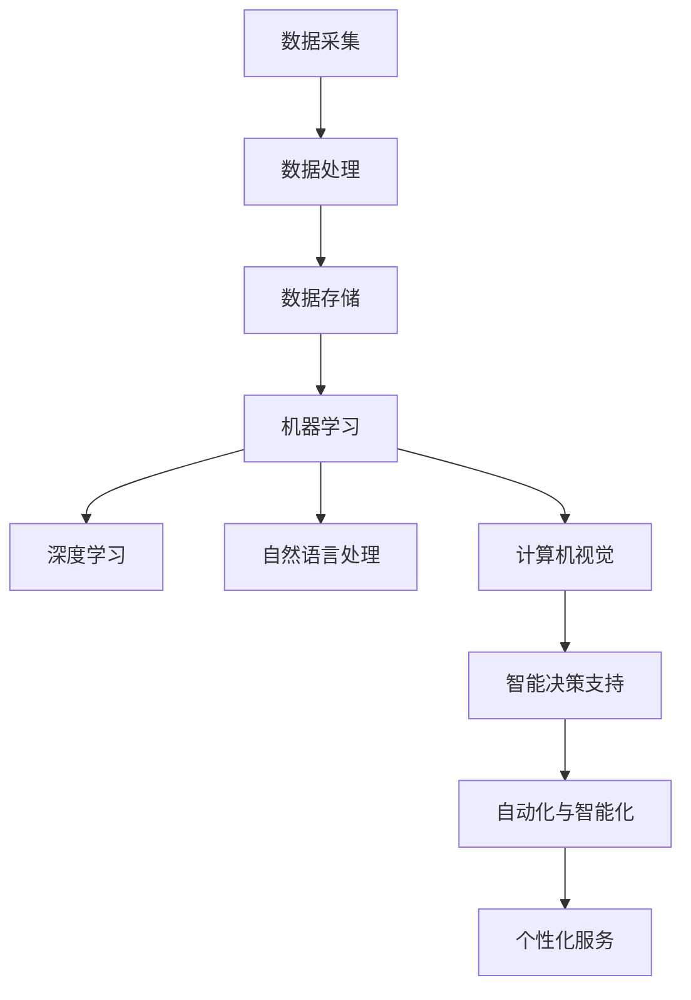

                 

### 文章标题：企业数字化转型中的AI应用技术

> **关键词**：企业数字化、AI应用、技术架构、深度学习、数据挖掘、云计算、智能决策、案例研究
>
> **摘要**：本文将深入探讨企业在数字化转型过程中如何应用人工智能技术。通过介绍核心概念、算法原理、数学模型、项目实战和实际应用场景，本文旨在为读者提供一个全面的技术指南，帮助企业在数字化时代中抓住AI带来的机遇。

### 1. 背景介绍

#### 1.1 企业数字化转型的意义

企业数字化转型是一个从传统业务模式向数字驱动的业务模式转变的过程。这一转变不仅仅涉及技术工具的升级，更是一个深层次的变革，涉及到企业战略、组织结构、业务流程和文化等多个方面。

- **提高效率**：通过自动化和智能化，减少人工干预，提高生产效率和服务质量。
- **增强竞争力**：利用数字化手段，企业可以更好地了解市场需求，快速响应市场变化，提升竞争力。
- **优化客户体验**：通过数据分析，提供个性化服务，提升客户满意度和忠诚度。
- **创新商业模式**：数字化转型为企业提供了新的商业模式，如订阅模式、共享经济等。

#### 1.2 人工智能在数字化转型中的作用

人工智能（AI）作为数字技术的重要组成部分，在企业数字化转型中发挥着关键作用。AI的应用不仅可以提高业务效率，还可以带来深度的业务变革。

- **数据分析与挖掘**：通过机器学习和深度学习算法，从海量数据中提取有价值的信息。
- **智能决策支持**：利用AI算法进行预测和决策，帮助企业做出更明智的决策。
- **自动化与智能化**：通过机器人流程自动化（RPA）和自然语言处理（NLP）等技术，实现业务流程的自动化和智能化。
- **个性化服务**：通过客户行为分析和偏好分析，提供个性化的产品和服务。

### 2. 核心概念与联系

在探讨AI在企业数字化转型中的应用之前，我们需要了解一些核心概念和它们之间的联系。

#### 2.1 数据处理与存储

- **数据采集**：通过各种传感器、应用程序等手段收集数据。
- **数据处理**：对采集到的数据进行清洗、转换、归一化等预处理。
- **数据存储**：将处理后的数据存储在数据库或数据湖中，以便进一步分析和利用。

#### 2.2 机器学习与深度学习

- **机器学习**：一种使计算机能够从数据中学习的方法，无需显式编写具体的规则或指令。
- **深度学习**：一种基于多层神经网络的学习方法，通过层层抽象，实现复杂模式的识别和预测。

#### 2.3 自然语言处理

- **自然语言处理（NLP）**：使计算机能够理解和生成人类语言的技术。

#### 2.4 计算机视觉

- **计算机视觉**：使计算机能够“看”和理解图像和视频内容的技术。

#### 2.5 云计算

- **云计算**：提供弹性的计算资源，支持大规模数据处理和存储。

#### 2.6 Mermaid 流程图



### 3. 核心算法原理 & 具体操作步骤

在了解了核心概念后，我们将深入探讨几个关键算法的原理和操作步骤。

#### 3.1 机器学习算法

**原理**：机器学习算法通过从数据中学习，提高计算机的自主能力。常见的机器学习算法包括线性回归、决策树、随机森林、支持向量机（SVM）等。

**操作步骤**：

1. 数据预处理：清洗数据，进行特征工程。
2. 选择算法：根据问题选择合适的算法。
3. 训练模型：使用训练数据集训练模型。
4. 验证模型：使用验证数据集评估模型性能。
5. 调参优化：调整模型参数，优化模型性能。

#### 3.2 深度学习算法

**原理**：深度学习算法通过多层神经网络进行特征提取和模式识别，实现复杂问题的求解。

**操作步骤**：

1. 数据预处理：同机器学习。
2. 构建网络结构：设计合适的神经网络架构。
3. 选择激活函数：如ReLU、Sigmoid、Tanh等。
4. 编写前向传播和反向传播代码：实现模型训练。
5. 训练和验证模型：同机器学习。

#### 3.3 自然语言处理算法

**原理**：NLP算法通过理解和生成人类语言，实现人与计算机的交互。

**操作步骤**：

1. 分词：将文本划分为单词或句子。
2. 词向量表示：将单词转换为向量表示。
3. 语言模型训练：使用神经网络训练语言模型。
4. 语义分析：通过深度学习模型分析文本的语义。
5. 文本生成：根据语言模型生成文本。

### 4. 数学模型和公式 & 详细讲解 & 举例说明

在AI应用中，数学模型和公式起着至关重要的作用。以下是一些常见的数学模型和公式的详细讲解。

#### 4.1 线性回归

**公式**：

$$
y = w_0 + w_1 \cdot x_1 + w_2 \cdot x_2 + \ldots + w_n \cdot x_n
$$

**详细讲解**：

线性回归是一种用于预测数值型因变量的方法。公式中的 $w_0, w_1, \ldots, w_n$ 是模型的参数，$x_1, x_2, \ldots, x_n$ 是输入特征。

**举例说明**：

假设我们想要预测房价，输入特征包括房屋面积、房间数量等。我们可以使用线性回归模型来建立房价与这些特征之间的关系。

#### 4.2 支持向量机（SVM）

**公式**：

$$
\begin{aligned}
    &\min_{\mathbf{w}, b} \frac{1}{2} ||\mathbf{w}||^2 \\
    &s.t. \mathbf{w} \cdot \mathbf{x}_i - b \geq 1, \forall i
\end{aligned}
$$

**详细讲解**：

SVM是一种用于分类的机器学习算法。公式中的 $\mathbf{w}$ 和 $b$ 分别是模型的权重和偏置，$\mathbf{x}_i$ 是训练样本。

**举例说明**：

我们可以使用SVM来分类手写数字图像，将图像分为0到9的类别。

#### 4.3 卷积神经网络（CNN）

**公式**：

$$
\begin{aligned}
    &z^{(l)} = \text{ReLU}(\mathbf{W}^{(l)} \cdot \mathbf{a}^{(l-1)} + b^{(l)}) \\
    &\mathbf{a}^{(l)} = \text{ReLU}(\mathbf{W}^{(l)} \cdot \mathbf{a}^{(l-1)} + b^{(l)})
\end{aligned}
$$

**详细讲解**：

CNN是一种用于图像处理的深度学习模型。公式中的 $\text{ReLU}$ 是ReLU激活函数，$\mathbf{W}^{(l)}$ 和 $b^{(l)}$ 分别是第$l$层的权重和偏置。

**举例说明**：

我们可以使用CNN来识别图像中的物体，如猫、狗等。

### 5. 项目实战：代码实际案例和详细解释说明

在本节中，我们将通过一个实际项目来展示如何使用AI技术实现企业数字化转型。

#### 5.1 开发环境搭建

1. 安装Python环境。
2. 安装TensorFlow库：`pip install tensorflow`。
3. 安装其他必要库：如NumPy、Pandas等。

#### 5.2 源代码详细实现和代码解读

**代码**：

```python
import tensorflow as tf
from tensorflow.keras import layers

# 构建模型
model = tf.keras.Sequential([
    layers.Conv2D(32, (3, 3), activation='relu', input_shape=(28, 28, 1)),
    layers.MaxPooling2D((2, 2)),
    layers.Conv2D(64, (3, 3), activation='relu'),
    layers.MaxPooling2D((2, 2)),
    layers.Conv2D(64, (3, 3), activation='relu'),
    layers.Flatten(),
    layers.Dense(64, activation='relu'),
    layers.Dense(10, activation='softmax')
])

# 编译模型
model.compile(optimizer='adam',
              loss='categorical_crossentropy',
              metrics=['accuracy'])

# 训练模型
model.fit(x_train, y_train, epochs=10, batch_size=64)
```

**代码解读**：

1. 导入TensorFlow库。
2. 定义模型结构：使用卷积层、池化层、全连接层等构建模型。
3. 编译模型：设置优化器、损失函数和评估指标。
4. 训练模型：使用训练数据集训练模型。

#### 5.3 代码解读与分析

- **卷积层**：用于提取图像的特征。
- **池化层**：用于降低模型的复杂度和过拟合风险。
- **全连接层**：用于分类。

通过这个案例，我们可以看到如何使用深度学习技术实现图像分类，为企业提供智能化的解决方案。

### 6. 实际应用场景

#### 6.1 客户服务自动化

通过自然语言处理和机器学习技术，企业可以实现自动化的客户服务系统，提高服务质量和效率。

#### 6.2 生产流程优化

通过计算机视觉和深度学习技术，企业可以对生产流程进行实时监控和优化，提高生产效率。

#### 6.3 风险管理

通过数据分析和技术，企业可以实时监控业务风险，提前预警，降低风险。

#### 6.4 营销与销售

通过客户行为分析和推荐系统，企业可以提供个性化的营销和销售策略，提高转化率。

### 7. 工具和资源推荐

#### 7.1 学习资源推荐

- **书籍**：《深度学习》、《Python机器学习》
- **论文**：Google论文《TensorFlow：大规模机器学习系统设计》
- **博客**：TensorFlow官方博客
- **网站**：Kaggle

#### 7.2 开发工具框架推荐

- **工具**：TensorFlow、PyTorch、Scikit-learn
- **框架**：Keras、TensorFlow.js、PyTorch Lightning

#### 7.3 相关论文著作推荐

- **论文**：Goodfellow, I., Bengio, Y., & Courville, A. (2016). *Deep Learning*.
- **著作**：Hastie, T., Tibshirani, R., & Friedman, J. (2009). *The Elements of Statistical Learning*.

### 8. 总结：未来发展趋势与挑战

#### 8.1 发展趋势

- **AI技术的普及**：随着技术的成熟和成本的降低，AI技术将在更多企业中得到广泛应用。
- **跨领域融合**：AI技术将与物联网、云计算、大数据等融合，实现更智能的业务流程。
- **个性化服务**：基于用户数据的个性化服务将成为企业竞争的关键。

#### 8.2 挑战

- **数据安全与隐私**：随着数据量的增加，数据安全和隐私保护将成为重要问题。
- **技术人才短缺**：随着AI技术的普及，对专业人才的需求将增加，但当前的人才储备不足。
- **道德与伦理问题**：AI技术可能带来的伦理和道德问题需要引起关注。

### 9. 附录：常见问题与解答

#### 9.1 问题1：什么是机器学习？

**解答**：机器学习是一种使计算机能够从数据中学习的方法，无需显式编写具体的规则或指令。

#### 9.2 问题2：如何搭建深度学习环境？

**解答**：在Python中，可以使用TensorFlow或PyTorch等深度学习框架。首先安装Python环境，然后安装相应的库。

### 10. 扩展阅读 & 参考资料

- **论文**：《人工智能：一种全新的数字经济形态》
- **书籍**：《智能时代：人工智能如何重塑商业、社会和生活》
- **网站**：人工智能研究院官方网站

### 作者信息

**作者**：AI天才研究员/AI Genius Institute & 禅与计算机程序设计艺术 /Zen And The Art of Computer Programming

通过本文的探讨，我们希望能够为读者提供一份全面的技术指南，帮助企业抓住数字化转型的机遇，利用AI技术实现业务创新和增长。在未来的发展中，AI技术将继续发挥重要作用，为企业和个人带来更多便利和可能性。让我们共同努力，迎接数字化的未来。\[完\]

