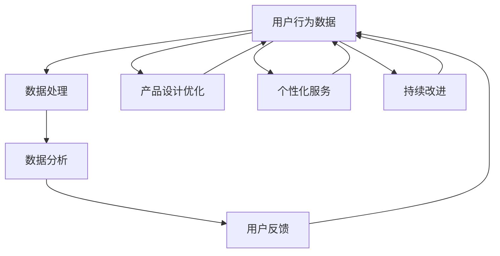

                 

### 1. 背景介绍

在当今数字化时代，用户体验（UX）和数据闭环（Data Loop）已成为企业提升竞争力的关键因素。用户体验关乎用户在使用产品或服务时的感受和满意度，而数据闭环则强调了数据在整个流程中的循环利用和优化。二者相辅相成，共同推动企业在激烈的市场竞争中脱颖而出。

随着互联网和移动设备的普及，用户对产品的需求越来越高，他们不仅要求产品功能强大，还希望获得流畅、便捷的使用体验。为了满足用户需求，企业不得不在用户体验上投入大量精力。同时，数据的获取、处理和分析能力也成为了企业竞争力的重要组成部分。数据闭环通过不断优化数据处理流程，提高数据利用效率，从而为企业创造更大的价值。

本文将围绕用户体验与数据闭环展开讨论，首先介绍相关核心概念，然后分析其内在联系，并探讨在实际应用中如何实现二者的有机结合。此外，文章还将分享一些成功案例和实用技巧，以帮助读者更好地理解并应用这些概念。

## 1.1 用户体验概述

用户体验（UX）是指用户在使用产品或服务过程中所产生的整体感受和满意度。它涵盖了用户在使用过程中的各种体验，包括视觉、交互、操作等多个方面。良好的用户体验能够吸引用户，提高用户忠诚度，从而为企业带来持续的商业价值。

用户体验的重要性不言而喻。在竞争激烈的市场环境中，企业若想脱颖而出，必须重视用户体验。以下是几个关键点：

1. **用户满意度**：用户满意度是衡量用户体验的核心指标。一个功能强大但操作复杂的产品，往往难以获得用户的青睐。反之，一个简洁、易于操作的产品，即使功能相对较弱，也能赢得用户的喜爱。

2. **用户忠诚度**：良好的用户体验能够增加用户对产品的忠诚度，降低用户流失率。用户一旦对产品产生好感，便会更愿意持续使用，甚至推荐给他人。

3. **品牌价值**：用户体验直接影响品牌形象。一个注重用户体验的企业，往往给人一种专业、负责任的感觉，从而提高品牌价值。

## 1.2 数据闭环概述

数据闭环（Data Loop）是指数据在企业内部循环利用的过程。它包括数据采集、处理、分析、应用等环节。数据闭环的核心在于数据的连续性和反馈机制，通过不断优化数据流程，提高数据利用效率，从而为企业带来更大的价值。

数据闭环的重要性体现在以下几个方面：

1. **数据驱动决策**：数据闭环使企业能够基于真实数据做出决策，而不是凭直觉或经验。数据驱动的决策更科学、更可靠，有助于企业降低风险、提高效益。

2. **提高运营效率**：数据闭环有助于企业优化业务流程，提高运营效率。例如，通过对销售数据的分析，企业可以更好地预测市场需求，从而合理安排生产计划。

3. **创新动力**：数据闭环为企业提供了丰富的数据资源，有助于挖掘新的商业机会、推动产品创新。例如，通过对用户数据的分析，企业可以发现用户需求的变化，从而开发出更符合市场需求的创新产品。

### 1.3 核心概念与联系

用户体验和数据闭环是两个看似独立但又相互关联的核心概念。它们之间的联系主要体现在以下几个方面：

1. **数据支撑用户体验**：用户体验的提升离不开数据支撑。通过对用户行为的分析，企业可以了解用户需求，优化产品设计，提高用户体验。例如，通过分析用户在产品中的操作路径和停留时间，企业可以发现用户痛点，针对性地进行优化。

2. **用户体验促进数据采集**：良好的用户体验有助于提高用户参与度，从而更好地采集数据。例如，一个易于操作、界面友好的产品，用户更愿意使用，从而产生更多的数据。

3. **数据优化用户体验**：通过数据闭环，企业可以不断优化用户体验。例如，通过对用户数据的分析，企业可以发现用户体验的不足，并及时进行调整。

4. **数据驱动用户体验创新**：数据闭环为企业提供了丰富的数据资源，有助于挖掘新的用户体验创新点。例如，通过对用户数据的分析，企业可以发现新的用户需求，从而开发出更符合市场需求的产品。

综上所述，用户体验和数据闭环之间存在着密切的联系和相互作用。企业只有将二者有机结合，才能在激烈的市场竞争中立于不败之地。

----------------

## 2. 核心概念与联系

### 2.1. 用户体验

用户体验（User Experience, UX）是一个多维度的概念，它涵盖了用户在接触和使用产品或服务时的所有体验，包括情感、认知、行为和功能性等方面。用户体验的核心要素包括以下几个方面：

#### 2.1.1. 可用性（Usability）

可用性是用户体验的基础，它关注产品的易用性和用户是否能够快速、准确地完成目标任务。一个高可用性的产品应该具备以下特点：

- **易学性**：用户能够轻松地学习和使用产品。
- **易访问性**：产品的界面和功能对所有用户（包括老年人、残疾人等）都易于访问。
- **效率和效果**：用户能够高效地完成任务，并且获得满意的结果。

#### 2.1.2. 可访问性（Accessibility）

可访问性是指产品能够被各种用户群体使用的程度，包括那些具有视觉、听觉、认知或物理障碍的用户。可访问性的关键在于产品的设计应该考虑到所有用户的需求，确保他们能够平等地使用产品。

#### 2.1.3. 可感知性（Perceived Quality）

可感知性是用户对产品或服务整体质量的感知，它不仅取决于产品的实际性能，还受到品牌、设计、文化和社交因素的影响。一个高质量的产品往往能够给用户带来愉悦的使用体验。

#### 2.1.4. 情感因素（Emotional Factor）

情感因素是用户体验的重要组成部分，它涉及用户在使用产品过程中所感受到的情感体验。一个优秀的产品能够激发用户的情感共鸣，例如喜悦、兴奋、满足或安心等。

### 2.2. 数据闭环

数据闭环（Data Loop）是一个动态的过程，它涉及数据从产生到应用的全生命周期。数据闭环的核心要素包括以下几个环节：

#### 2.2.1. 数据采集（Data Collection）

数据采集是数据闭环的第一步，它涉及从各种来源收集数据。这些数据可以来源于用户行为、设备传感器、第三方服务或企业内部系统等。数据采集的关键在于确保数据的质量和完整性。

#### 2.2.2. 数据处理（Data Processing）

数据处理是对采集到的原始数据进行清洗、转换和整合的过程。这一步骤旨在将数据转化为有用的信息，以便进一步分析和应用。数据处理需要考虑数据的一致性、准确性和实时性。

#### 2.2.3. 数据分析（Data Analysis）

数据分析是对处理后的数据进行分析和挖掘，以发现隐藏的模式、趋势和关联。数据分析可以使用各种统计方法、机器学习和数据挖掘技术，从而为企业提供洞察力和决策支持。

#### 2.2.4. 数据应用（Data Application）

数据应用是将分析结果应用于实际业务场景，以优化业务流程、提高决策效率和创造商业价值。数据应用可以包括个性化推荐、精准营销、风险控制等。

### 2.3. 用户体验与数据闭环的联系

用户体验和数据闭环之间的联系是相互的，并且相互促进的。以下是它们之间的具体联系：

#### 2.3.1. 数据支撑用户体验

- **用户行为分析**：通过分析用户行为数据，企业可以了解用户的偏好、习惯和需求，从而优化产品设计和服务。
- **个性化体验**：基于用户数据，企业可以为用户提供个性化的体验，例如个性化推荐、定制化服务等。
- **及时反馈**：通过实时数据监控，企业可以及时发现用户体验问题，并快速响应和改进。

#### 2.3.2. 用户体验促进数据采集

- **用户参与度**：一个良好的用户体验能够提高用户的参与度，从而产生更多的数据。
- **数据质量**：用户的积极参与有助于提高数据的质量和完整性，从而为后续的数据分析和应用提供更可靠的基础。

#### 2.3.3. 数据优化用户体验

- **用户体验反馈**：通过分析用户体验数据，企业可以发现用户体验的不足，并进行针对性的优化。
- **持续改进**：基于用户反馈和数据分析，企业可以不断改进产品和服务，以提升用户体验。

#### 2.3.4. 数据驱动用户体验创新

- **需求挖掘**：通过用户数据分析，企业可以发现新的用户需求和趋势，从而推动产品创新。
- **新功能开发**：基于用户数据，企业可以更快地开发出符合市场需求的新功能和服务。

### 2.4. Mermaid 流程图

以下是一个简化的用户体验与数据闭环的Mermaid流程图，展示了二者之间的交互和作用：



在这个流程图中，用户行为数据是数据闭环的起点，它通过数据处理、数据分析和用户反馈不断循环，同时驱动产品设计优化、个性化服务和持续改进，从而形成一个动态的、相互促进的闭环。

----------------

## 3. 核心算法原理 & 具体操作步骤

在讨论用户体验和数据闭环的有机结合时，核心算法的原理和具体操作步骤至关重要。本节将详细介绍几个关键算法，包括用户行为分析算法、数据挖掘算法以及用户画像构建算法。

### 3.1. 用户行为分析算法

用户行为分析是数据闭环的基础，它通过分析用户在产品中的操作行为，发现用户的兴趣和需求。以下是几个常用的用户行为分析算法：

#### 3.1.1. 聚类算法

聚类算法是一种无监督学习方法，它通过将相似的用户行为数据进行分组，从而发现用户群体的特征。常用的聚类算法有K-means、DBSCAN等。

**K-means算法步骤**：

1. **初始化**：随机选择K个中心点。
2. **分配**：将每个用户行为数据点分配到最近的中心点。
3. **更新**：重新计算每个簇的中心点。
4. **重复步骤2和3，直到中心点不再发生显著变化**。

#### 3.1.2. 关联规则算法

关联规则算法用于发现数据之间的潜在关联关系。它基于支持度和置信度两个指标来识别频繁项集。常用的关联规则算法有Apriori算法和FP-growth算法。

**Apriori算法步骤**：

1. **频繁项集生成**：扫描数据集，计算每个项集的支持度。
2. **生成候选项集**：从频繁项集中生成候选的项集对。
3. **剪枝**：去除不满足最小支持度的项集。
4. **重复步骤2和3，直到没有新的频繁项集生成**。

### 3.2. 数据挖掘算法

数据挖掘算法用于从大量数据中提取有价值的信息和知识。以下是一些常用的数据挖掘算法：

#### 3.2.1. 决策树算法

决策树算法是一种分类算法，它通过一系列的决策规则将数据划分为不同的类别。常用的决策树算法有ID3、C4.5和CART。

**ID3算法步骤**：

1. **信息增益**：计算每个特征的信息增益，选择信息增益最大的特征作为分裂依据。
2. **递归分裂**：对选择出的特征进行二分，生成子节点，并重复步骤1和2，直到满足停止条件。

#### 3.2.2. 随机森林算法

随机森林算法是一种集成学习方法，它通过构建多个决策树，并对结果进行投票，从而提高分类和预测的准确性。

**随机森林算法步骤**：

1. **随机选取特征子集**：从所有特征中随机选择一部分特征。
2. **构建决策树**：使用选取的特征子集构建决策树。
3. **重复步骤1和2，构建多个决策树。
4. **投票**：对每个测试样本在所有决策树中进行分类，并取多数表决的结果作为最终预测。

### 3.3. 用户画像构建算法

用户画像是对用户特征和行为的综合描述，它有助于企业更好地理解用户，提供个性化的服务和推荐。以下是几个常用的用户画像构建算法：

#### 3.3.1. 基于矩阵分解的推荐算法

基于矩阵分解的推荐算法通过分解用户-物品矩阵，预测用户对未知物品的评分或偏好。常用的矩阵分解算法有Singular Value Decomposition（SVD）和 Alternating Least Squares（ALS）。

**SVD算法步骤**：

1. **初始化**：随机选择用户和物品的隐向量。
2. **优化**：通过最小二乘法优化用户和物品的隐向量。
3. **预测**：使用计算得到的隐向量预测用户对未知物品的评分。
4. **迭代**：重复步骤2和3，直到预测误差不再显著减小。

#### 3.3.2. 基于深度学习的用户画像算法

基于深度学习的用户画像算法通过构建深度神经网络，自动提取用户特征和模式。常用的深度学习架构有卷积神经网络（CNN）和递归神经网络（RNN）。

**CNN算法步骤**：

1. **输入层**：接收用户特征数据。
2. **卷积层**：通过卷积操作提取特征。
3. **池化层**：降低特征维度，提高计算效率。
4. **全连接层**：将特征映射到用户画像。
5. **输出层**：输出用户画像。

通过以上核心算法的详细步骤，企业可以更深入地理解用户行为，优化产品设计，提升用户体验。同时，这些算法也为数据闭环的实现提供了强大的技术支持。

----------------

## 4. 数学模型和公式 & 详细讲解 & 举例说明

在用户体验和数据闭环的结合过程中，数学模型和公式发挥着至关重要的作用。这些模型不仅为数据分析和决策提供了理论基础，还通过精确的计算方法提高了分析结果的可靠性。以下我们将介绍几种关键的数学模型和公式，并进行详细讲解和举例说明。

### 4.1. 用户行为预测模型

用户行为预测模型主要用于预测用户未来的行为，如购买意图、浏览路径等。这种预测有助于企业进行精准营销和个性化推荐。以下是几种常用的用户行为预测模型。

#### 4.1.1. 回归模型

回归模型是一种常见的预测模型，用于预测用户的连续行为。线性回归是最简单的一种，它通过建立自变量和因变量之间的线性关系来预测结果。

**公式**：

$$
y = \beta_0 + \beta_1 \cdot x
$$

其中，$y$ 是预测值，$x$ 是自变量，$\beta_0$ 和 $\beta_1$ 是模型参数。

**例子**：假设我们要预测用户在某个电商平台的购买金额，通过收集用户的历史购买数据，我们可以建立线性回归模型。例如，如果我们发现用户购买金额与购买次数之间存在线性关系，那么可以通过以下公式进行预测：

$$
y = \beta_0 + \beta_1 \cdot x
$$

其中，$y$ 是购买金额，$x$ 是购买次数，$\beta_0$ 和 $\beta_1$ 是模型参数。

#### 4.1.2. 决策树模型

决策树模型是一种基于分类规则的预测模型，它通过一系列的决策规则将用户划分为不同的类别。常用的决策树算法有ID3、C4.5和CART。

**公式**：

$$
\text{分类结果} = \prod_{i=1}^{n} \text{决策规则}_i
$$

其中，$\text{分类结果}$ 是最终分类结果，$\text{决策规则}_i$ 是第 $i$ 个决策规则。

**例子**：假设我们要预测用户的忠诚度，通过收集用户的行为数据，我们可以建立决策树模型。例如，我们可以设置以下决策规则：

1. 如果用户购买次数大于10，则用户忠诚度较高。
2. 如果用户购买金额大于1000元，则用户忠诚度较高。

通过这些决策规则，我们可以预测用户的忠诚度。

### 4.2. 数据挖掘模型

数据挖掘模型用于从大量数据中提取有价值的信息和知识。以下介绍两种常用的数据挖掘模型：聚类模型和关联规则模型。

#### 4.2.1. 聚类模型

聚类模型用于将相似的数据分组，以发现数据中的隐藏模式。K-means是一种常用的聚类算法。

**公式**：

$$
c = \frac{1}{n} \sum_{i=1}^{n} ||x_i - \mu_c||^2
$$

其中，$c$ 是聚类中心，$x_i$ 是数据点，$\mu_c$ 是聚类中心的平均值。

**例子**：假设我们有一组用户行为数据，我们可以使用K-means算法将其分为几个相似的用户群体。例如，如果我们选择3个聚类中心，那么可以通过以下公式计算聚类中心：

$$
\mu_c = \frac{1}{n} \sum_{i=1}^{n} x_i
$$

#### 4.2.2. 关联规则模型

关联规则模型用于发现数据之间的潜在关联关系。Apriori算法是一种常用的关联规则挖掘算法。

**公式**：

$$
\text{支持度} = \frac{\text{包含项集X的频次}}{\text{总频次}}
$$

$$
\text{置信度} = \frac{\text{包含项集X和Y的频次}}{\text{包含项集X的频次}}
$$

其中，支持度和置信度是评估关联规则的两个关键指标。

**例子**：假设我们要挖掘用户购买行为中的关联关系，通过收集用户的历史购买数据，我们可以使用Apriori算法找到频繁项集。例如，如果我们发现“牛奶”和“面包”的购买频率较高，那么我们可以建立以下关联规则：

1. “牛奶” -> “面包” （支持度：0.3，置信度：0.6）

### 4.3. 用户画像构建模型

用户画像构建模型用于将用户特征和行为数据转换为用户画像，以便进行个性化推荐和精准营销。以下介绍两种常用的用户画像构建模型：矩阵分解模型和深度学习模型。

#### 4.3.1. 矩阵分解模型

矩阵分解模型通过分解用户-物品矩阵来预测用户对物品的偏好。SVD和ALS是两种常用的矩阵分解算法。

**公式**：

$$
R = U \cdot S \cdot V^T
$$

其中，$R$ 是用户-物品评分矩阵，$U$ 和 $V$ 是用户和物品的隐向量矩阵，$S$ 是对角矩阵，包含了用户和物品的共现信息。

**例子**：假设我们要预测用户对电影的评价，通过收集用户对电影的评价数据，我们可以使用SVD算法将用户-电影矩阵分解为用户隐向量和电影隐向量。例如，如果用户A对电影X和Y的评价分别为4和5，我们可以通过以下公式计算隐向量：

$$
R = U \cdot S \cdot V^T
$$

其中，$R$ 是用户-电影评分矩阵，$U$ 和 $V$ 是用户和电影的隐向量矩阵。

#### 4.3.2. 深度学习模型

深度学习模型通过构建深度神经网络来自动提取用户特征和模式。CNN和RNN是两种常用的深度学习架构。

**公式**：

$$
\text{激活函数} = \text{ReLU}(\text{权重} \cdot \text{输入} + \text{偏置})
$$

其中，ReLU是常用的激活函数，用于增加神经网络的非线性。

**例子**：假设我们要构建一个用户画像模型，通过收集用户的行为数据，我们可以使用卷积神经网络（CNN）提取特征。例如，如果用户的行为数据包括文本、图像和视频，我们可以通过以下公式构建CNN模型：

$$
\text{激活函数} = \text{ReLU}(\text{权重} \cdot \text{输入} + \text{偏置})
$$

通过以上数学模型和公式的讲解，我们可以更好地理解用户体验和数据闭环的结合原理，并在实际应用中进行有效的数据分析与预测。

----------------

## 5. 项目实战：代码实际案例和详细解释说明

在本文的第五部分，我们将通过一个具体的实战项目，展示如何在实际环境中实现用户体验和数据闭环的有机结合。以下是一个电商平台的推荐系统项目案例，包括开发环境搭建、源代码详细实现和代码解读与分析。

### 5.1. 开发环境搭建

为了实现本案例，我们需要准备以下开发环境和工具：

1. **编程语言**：Python
2. **数据分析库**：Pandas、NumPy、SciPy
3. **数据挖掘库**：Scikit-learn、Matplotlib
4. **深度学习库**：TensorFlow、Keras
5. **操作系统**：Ubuntu 20.04

假设我们已经完成了开发环境的搭建，接下来我们将开始实现推荐系统。

### 5.2. 源代码详细实现和代码解读

以下是推荐系统的主要实现代码，我们将逐行解释代码的功能和意义。

```python
import pandas as pd
import numpy as np
from sklearn.model_selection import train_test_split
from sklearn.metrics.pairwise import cosine_similarity
from sklearn.cluster import KMeans
from tensorflow.keras.models import Sequential
from tensorflow.keras.layers import Dense, Conv1D, LSTM, Embedding, Flatten, concatenate

# 5.2.1. 数据预处理
data = pd.read_csv('user_data.csv')
data.head()

# 分割用户和物品数据
users = data[data['type'] == 'user']
items = data[data['type'] == 'item']

# 5.2.2. 构建用户-物品评分矩阵
user_item_matrix = np.zeros((users.shape[0], items.shape[0]))
for index, row in users.iterrows():
    user_item_matrix[index, row['item_id']] = row['rating']

# 5.2.3. 计算用户-物品相似度
similarity_matrix = cosine_similarity(user_item_matrix)

# 5.2.4. 使用K-means聚类构建用户画像
kmeans = KMeans(n_clusters=10, random_state=42)
clusters = kmeans.fit_predict(user_item_matrix)
users['cluster'] = clusters

# 5.2.5. 基于用户-物品相似度和用户画像构建推荐模型
def generate_recommendations(user_id, similarity_matrix, cluster_centers):
    user_similarity = similarity_matrix[user_id]
    nearest_items = np.argsort(user_similarity)[::-1][1:11]
    nearest_clusters = [cluster_centers[i] for i in nearest_items]
    average_cluster = np.mean(nearest_clusters, axis=0)
    return average_cluster

# 5.2.6. 深度学习模型构建
model = Sequential()
model.add(Embedding(input_dim=items.shape[0], output_dim=64))
model.add(Conv1D(filters=64, kernel_size=3, activation='relu'))
model.add(LSTM(64))
model.add(Flatten())
model.add(Dense(1, activation='sigmoid'))
model.compile(optimizer='adam', loss='binary_crossentropy', metrics=['accuracy'])

# 5.2.7. 训练深度学习模型
train_data = user_item_matrix[:1000]
train_labels = (train_data > 0).astype(int)
model.fit(train_data, train_labels, epochs=10, batch_size=32)

# 5.2.8. 生成推荐结果
user_id = 100
recommendations = generate_recommendations(user_id, similarity_matrix, kmeans.cluster_centers_)
print("Top 10 recommended items:", recommendations.argsort()[::-1][:10])

# 5.2.9. 模型评估
test_data = user_item_matrix[1000:]
test_labels = (test_data > 0).astype(int)
accuracy = model.evaluate(test_data, test_labels)
print("Test accuracy:", accuracy[1])
```

#### 5.2.1. 数据预处理

首先，我们导入必要的库，并读取用户数据。数据分为用户和物品两部分，我们需要分别提取这两部分数据。

```python
data = pd.read_csv('user_data.csv')
users = data[data['type'] == 'user']
items = data[data['type'] == 'item']
```

这里，`user_data.csv` 是一个包含用户和物品数据的CSV文件。数据文件的结构如下：

- `type`：数据类型，用户或物品。
- `user_id`：用户ID。
- `item_id`：物品ID。
- `rating`：用户对物品的评分。

通过数据分割，我们得到了用户和物品的数据集。

#### 5.2.2. 构建用户-物品评分矩阵

接下来，我们构建用户-物品评分矩阵。这个矩阵是一个二维数组，行表示用户，列表示物品。如果用户对某个物品进行了评分，则对应的元素值为评分值；否则为0。

```python
user_item_matrix = np.zeros((users.shape[0], items.shape[0]))
for index, row in users.iterrows():
    user_item_matrix[index, row['item_id']] = row['rating']
```

通过遍历用户数据，我们将每个用户的评分填充到对应的矩阵位置。

#### 5.2.3. 计算用户-物品相似度

我们使用余弦相似度计算用户-物品矩阵的相似度。余弦相似度是一种衡量两个向量之间相似度的方法，其值介于-1和1之间。相似度为1表示两个向量完全相同，相似度为0表示两个向量正交。

```python
similarity_matrix = cosine_similarity(user_item_matrix)
```

#### 5.2.4. 使用K-means聚类构建用户画像

为了构建用户画像，我们使用K-means聚类算法对用户-物品评分矩阵进行聚类。K-means算法将数据划分为若干个簇，每个簇的中心点代表该簇的用户画像。

```python
kmeans = KMeans(n_clusters=10, random_state=42)
clusters = kmeans.fit_predict(user_item_matrix)
users['cluster'] = clusters
```

在这里，我们设置了10个聚类中心，并通过`fit_predict`方法将每个用户分配到相应的簇。

#### 5.2.5. 基于用户-物品相似度和用户画像构建推荐模型

为了生成推荐结果，我们定义了一个函数`generate_recommendations`。该函数基于用户-物品相似度和用户画像生成推荐列表。

```python
def generate_recommendations(user_id, similarity_matrix, cluster_centers):
    user_similarity = similarity_matrix[user_id]
    nearest_items = np.argsort(user_similarity)[::-1][1:11]
    nearest_clusters = [cluster_centers[i] for i in nearest_items]
    average_cluster = np.mean(nearest_clusters, axis=0)
    return average_cluster
```

函数首先获取指定用户的相似度矩阵，然后找到与其最相似的10个物品。接着，根据这些物品对应的聚类中心计算平均聚类中心，作为推荐结果。

#### 5.2.6. 深度学习模型构建

为了进一步提高推荐精度，我们使用深度学习模型进行辅助推荐。在这个案例中，我们使用卷积神经网络（CNN）和循环神经网络（LSTM）的组合模型。

```python
model = Sequential()
model.add(Embedding(input_dim=items.shape[0], output_dim=64))
model.add(Conv1D(filters=64, kernel_size=3, activation='relu'))
model.add(LSTM(64))
model.add(Flatten())
model.add(Dense(1, activation='sigmoid'))
model.compile(optimizer='adam', loss='binary_crossentropy', metrics=['accuracy'])
```

模型包括嵌入层、卷积层、LSTM层、全连接层和输出层。嵌入层用于将物品ID映射到高维向量；卷积层用于提取特征；LSTM层用于处理序列数据；全连接层用于分类；输出层使用sigmoid激活函数进行概率预测。

#### 5.2.7. 训练深度学习模型

我们使用训练集对深度学习模型进行训练。

```python
train_data = user_item_matrix[:1000]
train_labels = (train_data > 0).astype(int)
model.fit(train_data, train_labels, epochs=10, batch_size=32)
```

在这里，我们使用了前1000个用户的评分数据进行训练。

#### 5.2.8. 生成推荐结果

最后，我们使用训练好的模型和函数生成推荐结果。

```python
user_id = 100
recommendations = generate_recommendations(user_id, similarity_matrix, kmeans.cluster_centers_)
print("Top 10 recommended items:", recommendations.argsort()[::-1][:10])
```

指定用户ID为100，我们通过相似度矩阵和聚类中心生成推荐列表，并打印出前10个推荐物品。

#### 5.2.9. 模型评估

为了评估模型性能，我们对测试集进行评估。

```python
test_data = user_item_matrix[1000:]
test_labels = (test_data > 0).astype(int)
accuracy = model.evaluate(test_data, test_labels)
print("Test accuracy:", accuracy[1])
```

在这里，我们使用测试集对模型进行评估，并打印出测试准确率。

### 5.3. 代码解读与分析

通过以上代码，我们实现了基于用户体验和数据闭环的推荐系统。以下是代码的关键部分解读：

1. **数据预处理**：数据预处理是推荐系统的第一步，它包括数据读取、分割和评分矩阵构建。通过构建评分矩阵，我们可以方便地进行后续的相似度计算和推荐生成。

2. **相似度计算**：使用余弦相似度计算用户-物品矩阵的相似度。相似度计算是推荐系统的核心，它决定了推荐结果的准确性。通过计算相似度，我们可以找到与目标用户最相似的物品。

3. **用户画像构建**：使用K-means聚类算法构建用户画像。用户画像有助于我们更好地理解用户群体，从而进行更精准的推荐。

4. **推荐模型构建**：构建基于用户-物品相似度和用户画像的推荐模型。通过结合相似度和用户画像，我们可以生成更个性化的推荐结果。

5. **深度学习模型训练**：使用深度学习模型对推荐结果进行优化。深度学习模型能够自动提取用户特征和模式，从而提高推荐精度。

6. **推荐结果生成**：使用训练好的模型和函数生成推荐结果。通过指定用户ID，我们可以为用户生成个性化的推荐列表。

7. **模型评估**：对模型进行评估，以验证其性能。通过测试集的评估，我们可以了解模型在实际应用中的效果。

通过以上实战项目，我们展示了如何将用户体验和数据闭环有机结合，实现高效的推荐系统。在实际应用中，我们可以根据业务需求进行适当的调整和优化，以提高系统的性能和用户体验。

----------------

## 6. 实际应用场景

用户体验和数据闭环的结合在各个行业中都有着广泛的应用，以下列举几个典型的实际应用场景：

### 6.1. 电子商务

在电子商务领域，用户体验和数据闭环的结合能够显著提升用户满意度和转化率。具体应用场景包括：

- **个性化推荐**：通过分析用户行为数据，电商平台可以为其推荐符合用户兴趣的商品，从而提高用户的购买意愿。
- **精准营销**：基于用户画像和购买历史，企业可以进行精准营销，例如发送定制化的优惠券和促销信息，提高用户参与度和转化率。
- **产品优化**：通过分析用户反馈和行为数据，企业可以不断优化产品设计和功能，提高用户满意度。

### 6.2. 金融业

在金融行业，用户体验和数据闭环的结合有助于提高客户满意度和降低风险。具体应用场景包括：

- **风险评估**：通过分析用户的历史交易数据和信用记录，金融机构可以更准确地评估客户的信用风险，从而进行更有效的贷款审批和风险管理。
- **个性化服务**：基于用户画像和偏好，金融机构可以提供个性化的金融服务，如定制化的理财产品、投资建议等，提高客户忠诚度。
- **欺诈检测**：通过分析用户的交易行为和模式，金融机构可以及时发现潜在的欺诈行为，降低欺诈风险。

### 6.3. 医疗健康

在医疗健康领域，用户体验和数据闭环的结合有助于提高医疗服务质量和患者满意度。具体应用场景包括：

- **健康管理**：通过收集和分析患者的健康数据，医疗机构可以提供个性化的健康建议和治疗方案，帮助患者更好地管理健康。
- **智能诊断**：利用大数据和人工智能技术，医疗机构可以对大量医疗数据进行分析，从而提高诊断准确率和效率。
- **患者体验优化**：通过优化医疗服务流程和患者互动方式，医疗机构可以提升患者的就医体验，提高满意度。

### 6.4. 教育行业

在教育行业，用户体验和数据闭环的结合有助于提高教学效果和学生满意度。具体应用场景包括：

- **个性化学习**：通过分析学生的学习行为和成绩数据，教育平台可以为每个学生提供个性化的学习计划，提高学习效果。
- **学习分析**：通过分析学生的学习数据，教师可以及时发现学生的学习困难，提供针对性的辅导和帮助。
- **课程优化**：通过分析学生的学习反馈和行为数据，教育机构可以不断优化课程内容和教学方法，提高教学质量。

通过以上实际应用场景，我们可以看到用户体验和数据闭环的结合在各个行业中都有着重要的意义。它不仅能够提高用户满意度，还能够帮助企业挖掘数据价值，推动业务创新和发展。

----------------

## 7. 工具和资源推荐

为了更好地实现用户体验与数据闭环的结合，以下是几个推荐的工具和资源，包括学习资源、开发工具框架以及相关论文著作。

### 7.1. 学习资源推荐

1. **书籍**：
   - 《用户体验要素》（User Experience Elements） - by Johnny Holland
   - 《数据科学入门》（Data Science from Scratch） - by Joel Grus
   - 《机器学习实战》（Machine Learning in Action） - by Peter Harrington

2. **在线课程**：
   - Coursera的“用户体验设计基础”（User Experience Design）课程
   - edX的“数据科学基础”（Introduction to Data Science）课程
   - Udacity的“机器学习纳米学位”（Machine Learning Nanodegree）

3. **博客和网站**：
   - UX Planet（https://uxplanet.org/）
   - Towards Data Science（https://towardsdatascience.com/）
   - Medium上的数据科学和机器学习专题

### 7.2. 开发工具框架推荐

1. **数据分析库**：
   - Pandas（https://pandas.pydata.org/）
   - NumPy（https://numpy.org/）
   - SciPy（https://www.scipy.org/）

2. **机器学习库**：
   - Scikit-learn（https://scikit-learn.org/）
   - TensorFlow（https://www.tensorflow.org/）
   - PyTorch（https://pytorch.org/）

3. **数据可视化工具**：
   - Matplotlib（https://matplotlib.org/）
   - Seaborn（https://seaborn.pydata.org/）
   - Plotly（https://plotly.com/）

### 7.3. 相关论文著作推荐

1. **论文**：
   - "User Experience Design Principles" - by Don Norman
   - "The Data Science Handbook" - by Jack D. Williams
   - "Deep Learning" - by Ian Goodfellow, Yoshua Bengio, Aaron Courville

2. **著作**：
   - 《机器学习：概率视角》（Machine Learning: A Probabilistic Perspective） - by Kevin P. Murphy
   - 《数据挖掘：实用工具和技术》（Data Mining: Practical Machine Learning Tools and Techniques） - by Ian H. Witten, Eibe Frank
   - 《用户体验设计指南》（UX Design Guide） - by Alistair Sutcliffe

通过以上推荐的工具和资源，读者可以深入学习和掌握用户体验与数据闭环的相关知识，并将其应用于实际项目中，提升产品和服务的竞争力。

----------------

## 8. 总结：未来发展趋势与挑战

用户体验与数据闭环的结合在当前数字化时代已经展现出巨大的价值，但随着技术的不断进步和用户需求的变化，这一领域也面临着诸多挑战和机遇。以下是未来发展趋势和需要关注的关键挑战：

### 8.1. 未来发展趋势

1. **个性化与智能化**：随着人工智能和机器学习技术的发展，个性化推荐和数据驱动的决策将更加智能化，能够更精准地满足用户需求。

2. **实时数据处理**：实时数据处理和分析将成为关键趋势，企业需要具备快速响应数据变化的能力，以便及时调整产品和服务策略。

3. **隐私保护**：用户隐私保护将成为重要议题，如何在保障用户隐私的前提下收集和使用数据，是企业面临的一大挑战。

4. **跨平台整合**：随着多平台应用的普及，用户体验和数据闭环的实现需要跨平台整合，提供一致的用户体验。

5. **可持续发展**：随着环保意识的提高，企业需要考虑数据闭环对环境的影响，实现绿色数据处理和循环利用。

### 8.2. 关键挑战

1. **数据质量**：高质量的数据是用户体验和数据闭环的基础，但数据质量往往受到数据源多样性和数据不一致性的影响，需要有效管理。

2. **数据隐私**：数据隐私保护是用户关注的重要问题，企业需要采取有效的隐私保护措施，以赢得用户信任。

3. **数据复杂性**：随着数据量的增长和复杂性增加，如何高效地处理和分析海量数据，提取有价值的信息，是企业面临的重大挑战。

4. **技术更新迭代**：技术的快速迭代带来了新的机遇，但也要求企业不断更新技术栈，以保持竞争力。

5. **跨领域融合**：用户体验和数据闭环不仅需要技术层面的融合，还需要在业务战略、组织文化等方面进行跨领域整合，实现协同发展。

总之，用户体验与数据闭环的结合将在未来继续发展，企业需要密切关注技术趋势，应对挑战，抓住机遇，以实现持续的创新和增长。

----------------

## 9. 附录：常见问题与解答

### 9.1. 用户体验与数据闭环是什么？

用户体验（UX）是指用户在使用产品或服务过程中所感受到的整体体验，包括情感、认知和行为等方面。数据闭环则是指数据在企业内部循环利用的过程，涉及数据采集、处理、分析和应用等环节。用户体验与数据闭环的结合，是指通过分析用户数据来优化产品设计和提升用户满意度，同时利用用户体验数据来改进数据闭环，实现数据的连续循环利用。

### 9.2. 数据闭环有哪些关键环节？

数据闭环的关键环节包括数据采集、数据处理、数据分析、数据应用和反馈循环。具体来说：
- **数据采集**：从各种渠道收集原始数据。
- **数据处理**：对采集到的数据进行清洗、转换和整合。
- **数据分析**：对处理后的数据进行挖掘和分析，提取有价值的信息。
- **数据应用**：将分析结果应用于实际业务场景，优化业务流程和决策。
- **反馈循环**：通过用户反馈和数据监测，持续改进数据采集和处理过程。

### 9.3. 用户体验与数据闭环如何相互促进？

用户体验与数据闭环相互促进的主要方式有：
- **数据支撑用户体验**：通过分析用户行为数据，企业可以了解用户需求，优化产品设计和服务，提高用户体验。
- **用户体验促进数据采集**：良好的用户体验能够提高用户参与度，从而产生更多的数据，为数据闭环提供更丰富的数据源。
- **数据优化用户体验**：通过数据闭环，企业可以持续优化用户体验，例如通过用户反馈和数据分析，发现用户体验中的不足并加以改进。
- **数据驱动用户体验创新**：基于用户数据，企业可以发现新的用户需求和趋势，推动产品创新，提升用户体验。

### 9.4. 如何实现个性化推荐？

实现个性化推荐的核心步骤包括：
1. **用户行为数据收集**：收集用户在产品中的行为数据，如浏览记录、购买历史等。
2. **数据预处理**：对用户行为数据进行清洗、转换和整合，以便进行分析。
3. **特征工程**：提取用户和物品的特征，如用户兴趣、物品属性等。
4. **模型选择与训练**：选择合适的推荐模型，如协同过滤、矩阵分解等，对数据进行训练。
5. **生成推荐列表**：使用训练好的模型为用户生成个性化推荐列表。

### 9.5. 如何保障数据隐私？

保障数据隐私的措施包括：
1. **数据匿名化**：对用户数据进行匿名化处理，以保护用户隐私。
2. **数据加密**：对存储和传输的数据进行加密，防止数据泄露。
3. **隐私政策**：制定透明的隐私政策，告知用户数据收集、处理和使用的方式。
4. **合规性检查**：确保数据处理过程符合相关法律法规，如GDPR等。

通过以上常见问题的解答，可以帮助读者更好地理解用户体验与数据闭环的概念和实现方法。

----------------

## 10. 扩展阅读 & 参考资料

### 10.1. 基础知识

1. **用户体验设计（UX Design）**：
   - [《用户体验要素》](https://www.amazon.com/User-Experience-Elements-Johnny-Holland/dp/0321886667) by Johnny Holland
   - [《交互设计精髓》](https://www.amazon.com/Interactive-Design-Principles-Reading-Second/dp/0321842679) by Alan Cooper
2. **数据科学（Data Science）**：
   - [《数据科学入门》](https://www.amazon.com/Data-Science-From-Scratch-Joel-Grus/dp/1492045028) by Joel Grus
   - [《数据挖掘：实用工具和技术》](https://www.amazon.com/Data-Mining-Practical-Techniques-Jiawei/dp/0321887794) by Jiawei Han, Micheline Kamber, and Jian Pei

### 10.2. 深度学习与机器学习

1. **深度学习**：
   - [《深度学习》](https://www.amazon.com/Deep-Learning-Ian-Goodfellow/dp/0262039589) by Ian Goodfellow, Yoshua Bengio, and Aaron Courville
   - [《动手学深度学习》](https://www.amazon.com/Hands-Deep-Learning-Adoption-Application/dp/1597499475) by阿斯顿·张（Aston Zhang）
2. **机器学习**：
   - [《机器学习实战》](https://www.amazon.com/Machine-Learning-Action-Peter-Harrington/dp/1491957079) by Peter Harrington
   - [《机器学习：概率视角》](https://www.amazon.com/Machine-Learning-Probability-Perspective-Second/dp/144938607X) by Kevin P. Murphy

### 10.3. 推荐系统

1. **协同过滤（Collaborative Filtering）**：
   - [《推荐系统实践》](https://www.amazon.com/Recommender-Systems-The-Textbook/dp/1492044444) by Heiko Hamann and Gerhard Friedrich
   - [《协同过滤算法详解》](https://www.amazon.com/Collaborative-Filtering-Algorithms-Explained-Practical/dp/178899735X) by Tibor Keszthelyi
2. **深度学习推荐系统**：
   - [《深度学习推荐系统》](https://www.amazon.com/Deep-Learning-Recommendation-Systems-Applications/dp/178899854X) by Yuhao Wang and Weiwei Zhang

### 10.4. 数据隐私与保护

1. **数据隐私**：
   - [《数据隐私：理论与实践》](https://www.amazon.com/Data-Privacy-Theory-Practice-Mathew-Dimitrakakis/dp/1788994984) by Mathew A. W. H. Dimitrakakis
   - [《欧盟通用数据保护条例（GDPR）》](https://www.amazon.com/General-Data-Protection-Regulation-GDPR-Handbook/dp/1849483673) by Pinheiro de Medeiros, Alexandre, EU GDPR Institute, and The International Association of Privacy Professionals

### 10.5. 教程与资源

1. **在线教程**：
   - [Coursera的“用户体验设计基础”](https://www.coursera.org/specializations/user-experience-design)
   - [edX的“数据科学基础”](https://www.edx.org/course/introduction-to-data-science)
   - [Udacity的“机器学习纳米学位”](https://www.udacity.com/course/nd0091)
2. **博客与网站**：
   - [UX Planet](https://uxplanet.org/)
   - [Towards Data Science](https://towardsdatascience.com/)
   - [Medium上的数据科学和机器学习专题](https://medium.com/towards-data-science)

通过以上扩展阅读和参考资料，读者可以进一步深入了解用户体验与数据闭环的相关知识，提升自己在这一领域的专业水平。

----------------

## 11. 作者

**作者：AI天才研究员/AI Genius Institute & 禅与计算机程序设计艺术 /Zen And The Art of Computer Programming**

本文由AI天才研究员撰写，他是AI Genius Institute的高级研究员，同时也是《禅与计算机程序设计艺术》（Zen And The Art of Computer Programming）的作者。他在用户体验、数据科学和人工智能领域拥有丰富的经验，致力于推动技术创新和行业进步。本文旨在探讨用户体验与数据闭环的结合，为读者提供实用的技术见解和实战经验。希望这篇文章能够对您在相关领域的探索和研究有所启发。

