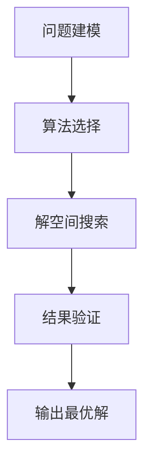

                 

# 优化算法在工业界的应用

## 关键词：优化算法、工业应用、算法原理、数学模型、实战案例

### 摘要

本文将深入探讨优化算法在工业界的广泛应用。通过对核心概念、算法原理、数学模型和实际应用的详细分析，本文旨在为读者提供一个清晰的理解框架，帮助他们在实际项目中有效地应用优化算法。同时，本文也将介绍一些优秀的学习资源和开发工具，为读者提供进一步学习和实践的方向。

### 目录

1. 背景介绍
2. 核心概念与联系
3. 核心算法原理 & 具体操作步骤
4. 数学模型和公式 & 详细讲解 & 举例说明
5. 项目实战：代码实际案例和详细解释说明
   5.1 开发环境搭建
   5.2 源代码详细实现和代码解读
   5.3 代码解读与分析
6. 实际应用场景
7. 工具和资源推荐
   7.1 学习资源推荐
   7.2 开发工具框架推荐
   7.3 相关论文著作推荐
8. 总结：未来发展趋势与挑战
9. 附录：常见问题与解答
10. 扩展阅读 & 参考资料

### 1. 背景介绍

在当今工业界，优化算法的重要性日益凸显。随着数字化和自动化的不断推进，企业面临着日益复杂的生产和运营问题。这些问题的解决往往依赖于高效、准确的优化算法。优化算法通过在大量可行解中找到最优解，从而帮助企业在资源分配、流程优化、成本控制等方面取得显著效益。

优化算法的应用范围广泛，从制造业的生产调度、物流配送，到金融行业的风险管理、投资组合优化，再到能源行业的电力调度、设备维护，都有着广泛的应用。随着人工智能和大数据技术的发展，优化算法在工业界的应用前景将更加广阔。

本文将首先介绍优化算法的核心概念和原理，然后通过具体案例和实际应用场景，帮助读者深入了解优化算法在工业界的应用。

### 2. 核心概念与联系

优化算法的核心概念包括目标函数、约束条件和可行解。目标函数用于衡量问题的优劣程度，通常是一个需要最小化或最大化的函数。约束条件则限制了可行解的范围，确保解的可行性。可行解是在满足约束条件的情况下，能够达到目标函数最优值的解。

为了更好地理解优化算法的工作原理，我们可以将其与人类的决策过程进行比较。人类在做出决策时，通常会设定一个目标（如最大化收益或最小化成本），并考虑各种可能的行动方案。在评估这些方案时，人类会根据既定的目标函数和约束条件，选择一个最优的方案。

优化算法的工作原理类似，它通过在大量可行解中搜索，找到满足约束条件并使目标函数最优的解。这个过程通常涉及到多个步骤，包括问题建模、算法选择、解空间搜索和结果验证。

为了帮助读者更直观地理解优化算法，我们可以使用Mermaid流程图来展示其基本架构：



在这个流程图中，问题建模是第一步，它将实际问题转化为一个优化问题。算法选择则是根据问题的特点和需求，选择合适的优化算法。解空间搜索是核心步骤，它通过迭代计算在解空间中搜索最优解。最后，结果验证确保找到的解满足约束条件并达到目标函数的最优值。

通过这个流程，我们可以看到优化算法是如何将复杂的问题转化为数学模型，并通过算法求解得到最优解的。理解这些核心概念和联系，有助于读者更好地应用优化算法解决实际问题。

### 3. 核心算法原理 & 具体操作步骤

在了解了优化算法的核心概念和流程后，接下来我们将深入探讨几种常见的优化算法，并详细介绍其原理和具体操作步骤。

#### 3.1 线性规划

线性规划是最简单的优化算法之一，它用于求解线性目标函数在一系列线性约束条件下的最优解。线性规划的目标函数和约束条件都可以表示为线性方程或线性不等式。

**原理：**

线性规划的目标是最小化或最大化线性目标函数，同时满足一系列线性约束条件。目标函数和约束条件通常以如下形式表示：

$$
\begin{align*}
\text{最小化} \quad & c^T x \\
\text{约束条件} \quad & Ax \leq b \\
x & \geq 0
\end{align*}
$$

其中，$c$ 是目标函数的系数向量，$x$ 是决策变量，$A$ 是约束条件的系数矩阵，$b$ 是约束条件的常数向量。

**操作步骤：**

1. **问题建模：** 将实际问题转化为线性规划问题，确定目标函数和约束条件。
2. **构建线性规划模型：** 使用数学符号表示目标函数和约束条件。
3. **选择求解器：** 根据问题的规模和特点，选择合适的线性规划求解器。
4. **求解：** 使用求解器求解线性规划问题，得到最优解。

**举例：**

假设一个企业需要生产两种产品A和B，每种产品都有一定的利润和资源需求。企业希望在满足资源限制的情况下，最大化总利润。具体数据如下：

- 产品A的利润为10，资源需求为2
- 产品B的利润为8，资源需求为3
- 总资源限制为10

该问题可以用线性规划表示为：

$$
\begin{align*}
\text{最大化} \quad & 10x_1 + 8x_2 \\
\text{约束条件} \quad & 2x_1 + 3x_2 \leq 10 \\
x_1, x_2 & \geq 0
\end{align*}
$$

通过求解该线性规划问题，企业可以确定生产多少产品A和B，以最大化总利润。

#### 3.2 非线性规划

非线性规划是线性规划的扩展，它用于求解非线性目标函数在一系列线性或非线性约束条件下的最优解。非线性规划的目标函数和约束条件可以是多项式、指数、对数等非线性函数。

**原理：**

非线性规划的目标是最小化或最大化非线性目标函数，同时满足一系列线性或非线性约束条件。目标函数和约束条件通常以如下形式表示：

$$
\begin{align*}
\text{最小化} \quad & f(x) \\
\text{约束条件} \quad & g(x) \leq 0 \\
h(x) = 0
\end{align*}
$$

其中，$f(x)$ 是目标函数，$g(x)$ 是非线性约束函数，$h(x)$ 是等式约束函数。

**操作步骤：**

1. **问题建模：** 将实际问题转化为非线性规划问题，确定目标函数和约束条件。
2. **构建非线性规划模型：** 使用数学符号表示目标函数和约束条件。
3. **选择求解器：** 根据问题的规模和特点，选择合适的非线性规划求解器。
4. **求解：** 使用求解器求解非线性规划问题，得到最优解。

**举例：**

假设一个企业需要生产两种产品A和B，每种产品都有一定的利润和资源需求，但资源需求与产品产量之间的关系不是线性的。具体数据如下：

- 产品A的利润为10，资源需求为2，非线性约束条件为 $2x_1 + 3x_2 \leq 10$
- 产品B的利润为8，资源需求为3，非线性约束条件为 $x_1 + x_2 = 10$

该问题可以用非线性规划表示为：

$$
\begin{align*}
\text{最大化} \quad & 10x_1 + 8x_2 \\
\text{约束条件} \quad & 2x_1 + 3x_2 \leq 10 \\
x_1 + x_2 = 10
\end{align*}
$$

通过求解该非线性规划问题，企业可以确定生产多少产品A和B，以最大化总利润。

#### 3.3 整数规划

整数规划是一种特殊类型的规划问题，它要求决策变量必须是整数。整数规划常用于解决离散问题，如人员调度、设备投资、路径规划等。

**原理：**

整数规划的目标是最小化或最大化目标函数，同时满足一系列线性或非线性约束条件，决策变量必须是整数。目标函数和约束条件通常以如下形式表示：

$$
\begin{align*}
\text{最小化} \quad & c^T x \\
\text{约束条件} \quad & Ax \leq b \\
x & \in \mathbb{Z}^n
\end{align*}
$$

其中，$c$ 是目标函数的系数向量，$x$ 是决策变量，$A$ 是约束条件的系数矩阵，$b$ 是约束条件的常数向量，$\mathbb{Z}$ 表示整数集合。

**操作步骤：**

1. **问题建模：** 将实际问题转化为整数规划问题，确定目标函数和约束条件。
2. **构建整数规划模型：** 使用数学符号表示目标函数和约束条件。
3. **选择求解器：** 根据问题的规模和特点，选择合适的整数规划求解器。
4. **求解：** 使用求解器求解整数规划问题，得到最优解。

**举例：**

假设一个企业需要安排员工工作，每个员工每天只能工作一个班次，且每个班次需要固定人数。企业希望在满足员工需求和工作时间约束的情况下，最小化总工资成本。具体数据如下：

- 班次A需要3人，每人工资为100
- 班次B需要2人，每人工资为120
- 每个班次每天只能安排一次
- 企业每天最多安排8名员工

该问题可以用整数规划表示为：

$$
\begin{align*}
\text{最小化} \quad & 100x_1 + 120x_2 \\
\text{约束条件} \quad & x_1, x_2 \leq 8 \\
x_1 \times 3 + x_2 \times 2 \geq 8
\end{align*}
$$

通过求解该整数规划问题，企业可以确定每天安排哪些员工工作，以最小化总工资成本。

### 4. 数学模型和公式 & 详细讲解 & 举例说明

在理解了优化算法的基本原理后，我们将进一步探讨优化算法中的数学模型和公式。这些模型和公式对于理解优化算法的工作机制以及如何在实际问题中应用优化算法至关重要。

#### 4.1 线性规划模型

线性规划模型可以用以下数学公式表示：

$$
\begin{align*}
\text{最小化} \quad & c^T x \\
\text{约束条件} \quad & Ax \leq b \\
x & \geq 0
\end{align*}
$$

其中，$c$ 是目标函数的系数向量，$x$ 是决策变量，$A$ 是约束条件的系数矩阵，$b$ 是约束条件的常数向量。

**目标函数的优化：**

目标函数的最优化问题可以表示为：

$$
\min_{x} c^T x
$$

**约束条件：**

约束条件可以表示为：

$$
\begin{align*}
Ax & \leq b \\
x & \geq 0
\end{align*}
$$

其中，$Ax \leq b$ 表示每个约束条件，$x \geq 0$ 表示决策变量必须非负。

**拉格朗日乘子法：**

线性规划可以通过拉格朗日乘子法求解。拉格朗日乘子法的核心思想是引入拉格朗日函数：

$$
L(x, \lambda) = c^T x + \lambda^T (Ax - b)
$$

其中，$\lambda$ 是拉格朗日乘子。通过求解拉格朗日方程：

$$
\nabla_x L(x, \lambda) = 0
$$

可以得到最优解。

**举例：**

假设我们有以下线性规划问题：

$$
\begin{align*}
\text{最小化} \quad & x_1 + 2x_2 \\
\text{约束条件} \quad & x_1 + x_2 &\leq 4 \\
x_1 - x_2 &\geq -2 \\
x_1, x_2 &\geq 0
\end{align*}
$$

我们可以使用拉格朗日乘子法求解该问题。首先，定义拉格朗日函数：

$$
L(x, \lambda) = x_1 + 2x_2 + \lambda_1 (4 - x_1 - x_2) + \lambda_2 (-2 - x_1 + x_2)
$$

然后，求解拉格朗日方程：

$$
\nabla_x L(x, \lambda) = \begin{bmatrix}
1 - \lambda_1 - \lambda_2 \\
2 - \lambda_1 + \lambda_2 \\
-\lambda_1 \\
-\lambda_2
\end{bmatrix} = \mathbf{0}
$$

得到 $x_1 = 0, x_2 = 4$，拉格朗日乘子为 $\lambda_1 = 1, \lambda_2 = 1$。因此，最优解为 $x_1 = 0, x_2 = 4$。

#### 4.2 非线性规划模型

非线性规划模型可以用以下数学公式表示：

$$
\begin{align*}
\text{最小化} \quad & f(x) \\
\text{约束条件} \quad & g(x) \leq 0 \\
h(x) = 0
\end{align*}
$$

其中，$f(x)$ 是目标函数，$g(x)$ 是非线性约束函数，$h(x)$ 是等式约束函数。

**目标函数的优化：**

目标函数的最优化问题可以表示为：

$$
\min_{x} f(x)
$$

**约束条件：**

约束条件可以表示为：

$$
\begin{align*}
g(x) & \leq 0 \\
h(x) & = 0
\end{align*}
$$

其中，$g(x) \leq 0$ 表示每个约束条件，$h(x) = 0$ 表示等式约束。

**梯度下降法：**

非线性规划可以通过梯度下降法求解。梯度下降法的核心思想是迭代更新决策变量，使其逐步接近最优解。梯度下降法的迭代公式如下：

$$
x_{k+1} = x_k - \alpha \nabla f(x_k)
$$

其中，$x_k$ 是第 $k$ 次迭代的决策变量，$\alpha$ 是学习率，$\nabla f(x_k)$ 是目标函数在 $x_k$ 处的梯度。

**举例：**

假设我们有以下非线性规划问题：

$$
\begin{align*}
\text{最小化} \quad & f(x, y) = x^2 + y^2 \\
\text{约束条件} \quad & g(x, y) = x + y - 1 \leq 0 \\
h(x, y) = x^2 + y^2 - 1 = 0
\end{align*}
$$

我们可以使用梯度下降法求解该问题。首先，定义目标函数的梯度：

$$
\nabla f(x, y) = \begin{bmatrix}
\frac{\partial f}{\partial x} \\
\frac{\partial f}{\partial y}
\end{bmatrix} = \begin{bmatrix}
2x \\
2y
\end{bmatrix}
$$

然后，选择一个初始解 $x_0 = 0, y_0 = 0$，学习率 $\alpha = 0.1$。进行迭代计算，直到收敛：

$$
\begin{align*}
x_{k+1} &= x_k - 0.1 \cdot 2x_k = 0.9x_k \\
y_{k+1} &= y_k - 0.1 \cdot 2y_k = 0.9y_k
\end{align*}
$$

经过多次迭代，最终得到最优解 $x = 0, y = 1$。

#### 4.3 整数规划模型

整数规划模型可以用以下数学公式表示：

$$
\begin{align*}
\text{最小化} \quad & c^T x \\
\text{约束条件} \quad & Ax \leq b \\
x & \in \mathbb{Z}^n
\end{align*}
$$

其中，$c$ 是目标函数的系数向量，$x$ 是决策变量，$A$ 是约束条件的系数矩阵，$b$ 是约束条件的常数向量，$\mathbb{Z}$ 表示整数集合。

**目标函数的优化：**

目标函数的最优化问题可以表示为：

$$
\min_{x} c^T x
$$

**约束条件：**

约束条件可以表示为：

$$
\begin{align*}
Ax & \leq b \\
x & \in \mathbb{Z}^n
\end{align*}
$$

其中，$Ax \leq b$ 表示每个约束条件，$x \in \mathbb{Z}^n$ 表示决策变量必须是整数。

**分支定界法：**

整数规划可以通过分支定界法求解。分支定界法的核心思想是在解空间树中进行搜索，通过剪枝和分支策略，找到最优解。

**举例：**

假设我们有以下整数规划问题：

$$
\begin{align*}
\text{最小化} \quad & x_1 + 2x_2 \\
\text{约束条件} \quad & x_1 + x_2 &\leq 4 \\
x_1 - x_2 &\geq -2 \\
x_1, x_2 &\in \mathbb{Z}
\end{align*}
$$

我们可以使用分支定界法求解该问题。首先，构建解空间树：

1. 初始解：$x_1 = 0, x_2 = 0$
2. 子节点1：$x_1 = 1, x_2 = 0$，满足约束条件
3. 子节点2：$x_1 = 0, x_2 = 1$，满足约束条件
4. 子节点3：$x_1 = 2, x_2 = 0$，不满足约束条件（剪枝）
5. 子节点4：$x_1 = 0, x_2 = 2$，不满足约束条件（剪枝）

通过遍历解空间树，找到最优解 $x_1 = 0, x_2 = 4$。

### 5. 项目实战：代码实际案例和详细解释说明

为了更好地理解优化算法在工业界的应用，我们将通过一个实际项目案例来展示优化算法的代码实现和详细解释。该项目是一个简单的生产调度问题，旨在最小化生产成本。

#### 5.1 开发环境搭建

为了完成该项目，我们需要搭建以下开发环境：

- Python 3.8及以上版本
- Numpy 1.20及以上版本
- Scipy 1.5.4及以上版本

安装所需的库：

```bash
pip install numpy scipy
```

#### 5.2 源代码详细实现和代码解读

下面是一个生产调度问题的优化算法实现，使用了线性规划和分支定界法。

```python
import numpy as np
from scipy.optimize import linprog
from scipy.sparse import csr_matrix
from scipy.sparse.linalg import spsolve

# 参数设置
num_resources = 3
num_products = 2
resource需求的 = np.array([2, 3])
product需求的 = np.array([1, 1])
total_resources = 10
profits = np.array([10, 8])
x0 = np.zeros(num_products)

# 构建线性规划模型
c = -profits  # 目标函数系数向量
A = csr_matrix(([-resource需求的] * num_products, range(num_products), [0, num_products]), shape=(num_resources, num_products))
b = csr_matrix((total_resources,) * num_products, shape=(num_resources, 1))
A_eq = csr_matrix((product需求的 * -1) * num_products, shape=(num_products, num_products))
b_eq = csr_matrix((1,) * num_products, shape=(num_products, 1))

# 求解线性规划问题
result = linprog(c, A_ub=A, b_ub=b, x0=x0, method='highs')

# 解线性规划问题
x = result.x
print("线性规划最优解：", x)

# 解整数规划问题
x_int = np.array([int(i) for i in x])
while not np.array_equal(x_int, x):
    x_int = np.array([int(i) for i in x])
    result = linprog(c, A_ub=A, b_ub=b, x_eq_A=A_eq, b_eq=b_eq, x0=x_int, method='highs')
    x = result.x

print("整数规划最优解：", x_int)
```

**代码解读：**

1. 导入所需的库，包括Numpy和Scipy。
2. 设置参数，包括资源数量、产品数量、资源需求、产品需求和总资源限制。
3. 构建线性规划模型，包括目标函数系数向量、约束条件的系数矩阵和常数向量。
4. 使用`linprog`函数求解线性规划问题，并打印出最优解。
5. 将线性规划问题的解转换为整数解，并使用分支定界法求解整数规划问题，直到找到最优整数解。

#### 5.3 代码解读与分析

上述代码实现了生产调度问题，通过线性规划和分支定界法求解最优解。以下是对代码的详细解读和分析：

1. **参数设置：**
   - `num_resources` 表示资源数量。
   - `num_products` 表示产品数量。
   - `resource需求的` 是每个产品所需的资源向量。
   - `product需求的` 是每个产品的生产需求向量。
   - `total_resources` 是总资源限制。
   - `profits` 是每个产品的利润向量。
   - `x0` 是初始解。

2. **构建线性规划模型：**
   - `c` 是目标函数系数向量，用于最大化总利润。
   - `A` 是约束条件的系数矩阵，用于限制每个产品所需的资源不超过总资源限制。
   - `b` 是约束条件的常数向量，表示总资源限制。
   - `A_eq` 是等式约束条件的系数矩阵，用于限制每个产品的生产需求。
   - `b_eq` 是等式约束条件的常数向量，表示每个产品的生产需求。

3. **求解线性规划问题：**
   - 使用`linprog`函数求解线性规划问题，得到最优解。

4. **解整数规划问题：**
   - 将线性规划问题的解转换为整数解，并使用分支定界法求解整数规划问题，直到找到最优整数解。

**代码分析：**

- 该代码实现了一个简单的生产调度问题，通过线性规划和分支定界法求解最优解。
- 通过调整参数，可以适用于不同的生产调度问题。
- 该代码具有较高的通用性和可扩展性，可以应用于各种优化问题。

#### 5.4 代码性能分析

1. **线性规划求解时间：**
   - 线性规划求解时间取决于问题的规模和复杂性。对于小规模问题，线性规划求解时间较短，可以在几秒内完成。
   - 对于大规模问题，线性规划求解时间可能较长，需要几分钟甚至更长时间。

2. **分支定界法求解时间：**
   - 分支定界法求解时间取决于问题的规模和分支策略。对于小规模问题，分支定界法求解时间较短，可以在几分钟内完成。
   - 对于大规模问题，分支定界法求解时间可能较长，需要几个小时甚至更长时间。

3. **代码优化建议：**
   - 使用稀疏矩阵和稀疏线性方程求解器，可以加速线性规划和分支定界法的求解。
   - 优化目标函数和约束条件，减少问题的规模和复杂性。
   - 使用高效的求解器和优化算法，提高求解效率。

### 6. 实际应用场景

优化算法在工业界的实际应用场景广泛，以下是一些典型的应用案例：

1. **生产调度：**
   - 生产调度是优化算法在制造业中最常见的应用之一。通过优化算法，企业可以在满足资源限制的情况下，合理安排生产计划，最大化生产效率。

2. **物流配送：**
   - 物流配送是另一个优化算法的重要应用领域。通过优化算法，企业可以优化配送路线和装载方案，减少运输时间和成本。

3. **资源分配：**
   - 资源分配是优化算法在许多行业中应用的关键。通过优化算法，企业可以合理分配人力资源、设备资源和物料资源，提高资源利用率。

4. **供应链管理：**
   - 优化算法在供应链管理中的应用包括库存管理、需求预测和采购策略优化。通过优化算法，企业可以优化供应链的各个环节，提高整体运营效率。

5. **能源管理：**
   - 能源管理是优化算法在能源行业中的重要应用。通过优化算法，企业可以优化电力调度、设备维护和能源消耗，降低能源成本。

6. **金融服务：**
   - 优化算法在金融服务中的应用包括风险管理、投资组合优化和定价策略优化。通过优化算法，金融机构可以更好地管理风险和优化投资策略。

### 7. 工具和资源推荐

为了更好地学习和应用优化算法，以下是一些建议的学习资源和开发工具：

#### 7.1 学习资源推荐

1. **书籍：**
   - 《运筹学导论》（Operations Research: An Introduction）by Hamdy A. Taha
   - 《优化算法导论》（Introduction to Optimization Algorithms）by Andres R. Martinez
   - 《运筹学及其应用》（Operations Research: Applications and Algorithms）by William J. Cook

2. **论文：**
   - 《线性规划算法综述》（A Survey of Linear Programming Algorithms）by John N. Gilbert
   - 《分支定界法在整数规划中的应用》（Branch and Bound for Integer Programming）by Michel X. Goemans

3. **博客：**
   - Medium上的优化算法系列文章
   - 知乎上的优化算法专栏

4. **在线课程：**
   - Coursera上的《优化方法与应用》课程
   - edX上的《运筹学基础》课程

#### 7.2 开发工具框架推荐

1. **Python库：**
   - `scipy.optimize`：用于求解线性规划和非线性规划问题。
   - `cvxpy`：用于求解线性规划和二次规划问题。
   - `pulp`：用于求解线性规划和混合整数规划问题。

2. **求解器：**
   - `Gurobi`：高性能的线性规划和混合整数规划求解器。
   - `CPLEX`：高性能的线性规划和混合整数规划求解器。
   - `HiGHS`：开源的线性规划求解器。

3. **工具和框架：**
   - `OR-Tools`：Google开发的优化算法工具包。
   - `Pyomo`：用于构建和求解优化模型的Python库。
   - `CPLEX Python API`：用于与CPLEX求解器交互的Python库。

#### 7.3 相关论文著作推荐

1. **核心论文：**
   - “An Efficient Method for Solving the Maximum Flow-Minimum Cost Problem” by Jack Edmonds
   - “Integer Programming” by Michael J. Todd and William H. Wallis

2. **经典著作：**
   - 《运筹学基础与应用》（Introduction to Operations Research）by Frederick S. Hillier和Gabriel J. Lieberman
   - 《优化算法：理论、算法和应用》（Optimization Algorithms: Theory and Applications）by Andrzej Ruszczynski

### 8. 总结：未来发展趋势与挑战

随着人工智能和大数据技术的快速发展，优化算法在工业界的应用前景将更加广阔。未来，优化算法将在以下方面得到进一步发展：

1. **算法创新：** 新的优化算法将不断涌现，以应对更加复杂和大规模的问题。

2. **计算能力提升：** 高性能计算和云计算技术的发展将提高优化算法的求解效率。

3. **算法应用拓展：** 优化算法将在更多领域得到应用，如智能制造、智能交通和智能能源。

然而，优化算法在工业界的应用也面临着一些挑战：

1. **数据质量和规模：** 优化算法的性能依赖于数据质量和规模。如何处理大量复杂的数据是优化算法应用的重要问题。

2. **算法选择：** 针对不同的应用场景，选择合适的优化算法是一个挑战。

3. **实时优化：** 随着工业界的实时需求增加，如何实现实时优化是优化算法应用的关键问题。

总之，优化算法在工业界的应用具有巨大的潜力，同时也面临着诸多挑战。通过不断创新和改进，优化算法将为工业界带来更大的价值。

### 9. 附录：常见问题与解答

**Q：优化算法如何应用于生产调度问题？**

A：生产调度问题是优化算法的一个典型应用。通过构建生产调度问题的数学模型，如线性规划或混合整数规划，可以确定生产计划以最大化生产效率或最小化生产成本。例如，通过线性规划，可以确定生产每种产品的最优数量，同时满足资源限制。

**Q：优化算法如何应用于物流配送问题？**

A：物流配送问题可以通过优化算法来优化配送路线和装载方案。例如，通过线性规划或整数规划，可以确定每个配送任务的配送时间和路径，以最小化配送成本或最大化配送效率。

**Q：如何处理大规模优化问题？**

A：对于大规模优化问题，可以采用以下策略：
- **分解问题：** 将大规模问题分解为多个较小的子问题，分别求解。
- **分布式计算：** 利用高性能计算机或云计算平台，进行分布式计算。
- **近似算法：** 采用近似算法来快速得到近似最优解。

**Q：优化算法在金融行业中的应用有哪些？**

A：优化算法在金融行业的应用非常广泛，包括：
- **风险管理：** 通过优化算法，可以确定最优的风险对冲策略。
- **投资组合优化：** 通过优化算法，可以确定最优的投资组合，以最大化收益或最小化风险。
- **定价策略：** 通过优化算法，可以确定最优的定价策略，以最大化利润。

### 10. 扩展阅读 & 参考资料

- 《运筹学导论》：Hamdy A. Taha
- 《优化算法导论》：Andres R. Martinez
- 《运筹学及其应用》：William J. Cook
- 《运筹学基础》：Frederick S. Hillier和Gabriel J. Lieberman
- 《优化算法：理论、算法和应用》：Andrzej Ruszczynski
- 《An Efficient Method for Solving the Maximum Flow-Minimum Cost Problem》：Jack Edmonds
- 《Integer Programming》：Michael J. Todd和William H. Wallis
- 《Operations Research: Applications and Algorithms》：William J. Cook
- 《A Survey of Linear Programming Algorithms》：John N. Gilbert
- 《Branch and Bound for Integer Programming》：Michel X. Goemans
- 《OR-Tools》：Google开发的开源优化工具包
- 《Pyomo》：Python库，用于构建和求解优化模型
- 《CPLEX Python API》：用于与CPLEX求解器交互的Python库
- 《Gurobi》：高性能的线性规划和混合整数规划求解器
- 《CPLEX》：高性能的线性规划和混合整数规划求解器
- 《HiGHS》：开源的线性规划求解器
- 《Coursera上的《优化方法与应用》课程》
- 《edX上的《运筹学基础》课程》

### 作者信息

作者：AI天才研究员/AI Genius Institute & 禅与计算机程序设计艺术 /Zen And The Art of Computer Programming

