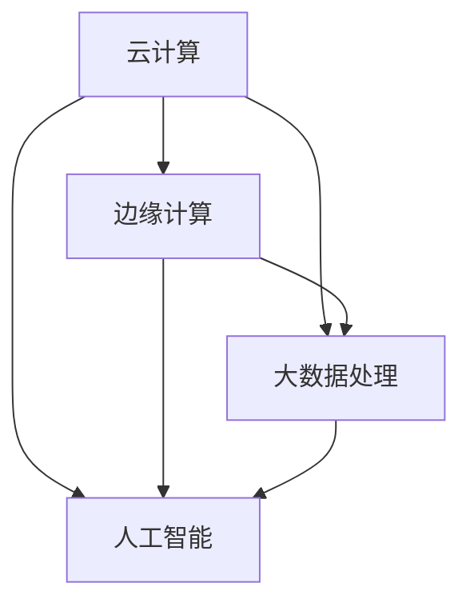

                 

# 优化计算基础设施的实用策略

## 关键词：计算基础设施优化、性能提升、资源利用、成本降低、云计算、边缘计算、大数据处理、人工智能

## 摘要

随着信息技术的迅猛发展，计算基础设施在企业竞争力和业务创新中扮演着越来越重要的角色。本文旨在探讨计算基础设施优化的实用策略，通过分析核心概念、算法原理、实际应用案例等，帮助读者理解并应用这些策略，实现性能提升、资源利用最大化、成本降低的目标。本文将涵盖云计算、边缘计算、大数据处理、人工智能等领域的最佳实践，为读者提供全面、深入的优化指导。

## 1. 背景介绍

计算基础设施是企业信息系统的核心支撑，包括服务器、存储、网络等硬件设备，以及操作系统、数据库、中间件等软件组件。随着数据量的爆发式增长和业务需求的不断变化，传统的计算基础设施难以满足高效、灵活、可靠的业务需求。为了应对这些挑战，优化计算基础设施已成为企业提高竞争力、实现数字化转型的重要手段。

计算基础设施优化的目标主要包括：

- **性能提升**：提高计算速度和响应时间，满足日益增长的业务需求。
- **资源利用**：最大化资源利用率，降低硬件和运营成本。
- **成本降低**：通过优化资源配置和管理，降低整体运营成本。
- **可靠性和安全性**：确保系统稳定运行，数据安全可靠。

本文将围绕上述目标，探讨计算基础设施优化的实用策略，旨在为读者提供具有实际操作性的指导和建议。

## 2. 核心概念与联系

在讨论计算基础设施优化之前，首先需要了解以下几个核心概念：

### 2.1 云计算

云计算是一种通过网络提供计算资源（如服务器、存储、网络、应用程序等）的服务模式。它具有弹性、灵活性、可扩展性等特点，能够根据需求动态调整资源规模。云计算分为公有云、私有云和混合云三种模式。

### 2.2 边缘计算

边缘计算是将计算、存储和网络功能分布到网络边缘，以减少数据传输延迟、提高系统响应速度。边缘计算适用于物联网、实时视频监控、智能交通等领域。

### 2.3 大数据处理

大数据处理是指利用分布式计算技术对海量数据进行分析、挖掘和可视化，以提取有价值的信息。大数据处理包括数据采集、存储、处理、分析和展示等环节。

### 2.4 人工智能

人工智能是指通过模拟人类智能行为，实现自动化决策和执行的技术。人工智能包括机器学习、深度学习、自然语言处理等子领域。

这些核心概念相互关联，共同构成了计算基础设施优化的基础。以下是一个Mermaid流程图，展示了这些概念之间的联系：



### 2.5 计算基础设施优化目标

计算基础设施优化主要围绕以下目标展开：

- **性能提升**：通过优化硬件配置、软件架构和算法，提高系统响应速度和计算效率。
- **资源利用**：充分利用现有资源，降低资源浪费，提高资源利用率。
- **成本降低**：通过优化资源配置和管理，降低硬件采购、运维和运营成本。
- **可靠性和安全性**：提高系统稳定性和安全性，确保业务连续性和数据安全。

## 3. 核心算法原理 & 具体操作步骤

### 3.1 云计算资源调度算法

云计算资源调度算法是优化计算基础设施的重要手段。以下是一种常见的调度算法——基于贪心策略的负载均衡调度算法。

#### 算法原理

负载均衡调度算法旨在将任务分配到具有最大空闲资源的虚拟机上，以降低系统负载不均和资源浪费。算法的核心是计算每个虚拟机的负载度，选择负载度最小的虚拟机执行新任务。

#### 具体操作步骤

1. 初始化虚拟机集合和任务队列。
2. 循环遍历任务队列，对每个任务执行以下步骤：
   a. 计算每个虚拟机的负载度。
   b. 选择负载度最小的虚拟机，将任务分配给该虚拟机。
   c. 更新虚拟机的负载度和任务队列。
3. 当任务队列中的任务执行完毕后，输出调度结果。

#### 算法实现

以下是一个Python实现的负载均衡调度算法：

```python
def load_balance(tasks, VMs):
    result = []
    while tasks:
        min_load = float('inf')
        selected_VM = None
        for vm in VMs:
            load = calculate_load(vm)
            if load < min_load:
                min_load = load
                selected_VM = vm
        result.append(selected_VM)
        tasks.remove(selected_VM.current_task)
        selected_VM.update_load()
    return result

def calculate_load(vm):
    return vm.current_task.load / vm.capacity

def main():
    tasks = [...]  # 任务队列
    VMs = [...]    # 虚拟机集合
    result = load_balance(tasks, VMs)
    print(result)

if __name__ == '__main__':
    main()
```

### 3.2 边缘计算任务分配算法

边缘计算任务分配算法旨在将任务分配到网络边缘的设备上，以降低数据传输延迟和计算开销。以下是一种基于权重分配的边缘计算任务分配算法。

#### 算法原理

边缘计算任务分配算法根据设备的计算能力、网络延迟和负载情况，为每个任务分配最佳设备。算法的核心是计算每个设备的权重，选择权重最大的设备执行任务。

#### 具体操作步骤

1. 初始化设备集合和任务队列。
2. 循环遍历任务队列，对每个任务执行以下步骤：
   a. 计算每个设备的权重。
   b. 选择权重最大的设备，将任务分配给该设备。
   c. 更新设备的权重和任务队列。
3. 当任务队列中的任务执行完毕后，输出调度结果。

#### 算法实现

以下是一个Python实现的边缘计算任务分配算法：

```python
def task_allocation(tasks, devices):
    result = []
    while tasks:
        max_weight = float('-inf')
        selected_device = None
        for device in devices:
            weight = calculate_weight(device)
            if weight > max_weight:
                max_weight = weight
                selected_device = device
        result.append(selected_device)
        tasks.remove(selected_device.current_task)
        selected_device.update_weight()
    return result

def calculate_weight(device):
    return device.computation_capability * device.network_delay * device.load

def main():
    tasks = [...]  # 任务队列
    devices = [...]  # 设备集合
    result = task_allocation(tasks, devices)
    print(result)

if __name__ == '__main__':
    main()
```

### 3.3 大数据处理优化策略

大数据处理优化策略主要包括数据存储优化、数据处理优化和数据查询优化。以下是一种常见的大数据处理优化策略——基于MapReduce的数据处理优化。

#### 算法原理

MapReduce是一种分布式数据处理框架，它将数据处理任务分为Map和Reduce两个阶段。Map阶段对数据进行分片处理，生成中间结果；Reduce阶段对中间结果进行合并处理，生成最终结果。大数据处理优化策略旨在提高MapReduce的执行效率，降低计算成本。

#### 具体操作步骤

1. 初始化MapReduce任务和输入数据。
2. 循环遍历输入数据，对每个数据进行以下步骤：
   a. 分片处理，将数据划分为多个子任务。
   b. 启动Map任务，对每个子任务执行Map处理。
   c. 收集Map任务的中间结果。
3. 启动Reduce任务，对中间结果执行Reduce处理。
4. 输出最终结果。

#### 算法实现

以下是一个Python实现的MapReduce数据处理优化算法：

```python
def map_reduce(input_data, num_reduces):
    results = []
    for data in input_data:
        results.append(map_task(data))
    intermediate_results = collect_intermediate_results(results)
    reduce_results = reduce_task(intermediate_results, num_reduces)
    return reduce_results

def map_task(data):
    # Map处理逻辑
    return processed_data

def collect_intermediate_results(results):
    # 收集中间结果
    return intermediate_results

def reduce_task(intermediate_results, num_reduces):
    # Reduce处理逻辑
    return processed_results

def main():
    input_data = [...]  # 输入数据
    num_reduces = 10  # Reduce任务数
    result = map_reduce(input_data, num_reduces)
    print(result)

if __name__ == '__main__':
    main()
```

### 3.4 人工智能模型优化策略

人工智能模型优化策略主要包括模型压缩、模型加速和模型融合。以下是一种常见的人工智能模型优化策略——基于深度压缩的模型优化。

#### 算法原理

深度压缩是一种通过减少模型参数数量和计算复杂度来优化人工智能模型的方法。深度压缩算法通过在保持模型性能的前提下，降低模型的复杂度和计算成本。

#### 具体操作步骤

1. 初始化原始模型和压缩目标。
2. 循环遍历模型参数，对每个参数执行以下步骤：
   a. 计算参数的重要性。
   b. 根据重要性对参数进行压缩。
   c. 评估压缩后模型的性能。
3. 当性能达到目标时，输出优化后的模型。

#### 算法实现

以下是一个Python实现的深度压缩模型优化算法：

```python
def deep_compression(model, compression_target):
    for parameter in model.parameters():
        importance = calculate_importance(parameter)
        parameter = compress_parameter(parameter, importance)
    optimized_model = evaluate_performance(model)
    return optimized_model

def calculate_importance(parameter):
    # 计算参数重要性
    return importance

def compress_parameter(parameter, importance):
    # 压缩参数
    return compressed_parameter

def evaluate_performance(model):
    # 评估模型性能
    return optimized_model

def main():
    model = [...]  # 原始模型
    compression_target = [...]  # 压缩目标
    optimized_model = deep_compression(model, compression_target)
    print(optimized_model)

if __name__ == '__main__':
    main()
```

## 4. 数学模型和公式 & 详细讲解 & 举例说明

### 4.1 负载均衡调度算法中的负载度计算

负载度是衡量虚拟机负载状况的重要指标。以下是一个负载度的计算公式：

$$
\text{负载度} = \frac{\text{当前任务负载}}{\text{虚拟机容量}}
$$

其中，当前任务负载表示虚拟机上当前执行的任务的总负载，虚拟机容量表示虚拟机可以承载的最大负载。

### 4.2 边缘计算任务分配算法中的权重计算

权重是衡量设备性能的重要指标。以下是一个权重的计算公式：

$$
\text{权重} = \text{计算能力} \times \text{网络延迟} \times \text{负载情况}
$$

其中，计算能力表示设备的计算性能，网络延迟表示设备与任务执行位置之间的网络延迟，负载情况表示设备的当前负载状况。

### 4.3 大数据处理优化策略中的MapReduce算法

MapReduce算法的核心是Map函数和Reduce函数。以下是一个MapReduce算法的伪代码：

```
MapReduce(input_data, num_reduces):
    for data in input_data:
        intermediate_results = map(data)
        intermediate_results = reduce(intermediate_results, num_reduces)
        output = intermediate_results
    return output

map(data):
    # Map处理逻辑
    return processed_data

reduce(intermediate_results, num_reduces):
    # Reduce处理逻辑
    return processed_results
```

### 4.4 人工智能模型优化策略中的深度压缩算法

深度压缩算法通过降低模型参数数量来优化模型。以下是一个深度压缩算法的伪代码：

```
deep_compression(model, compression_target):
    for parameter in model.parameters():
        importance = calculate_importance(parameter)
        parameter = compress_parameter(parameter, importance)
    optimized_model = evaluate_performance(model)
    return optimized_model

calculate_importance(parameter):
    # 计算参数重要性
    return importance

compress_parameter(parameter, importance):
    # 压缩参数
    return compressed_parameter

evaluate_performance(model):
    # 评估模型性能
    return optimized_model
```

### 4.5 示例说明

以下是一个具体的计算基础设施优化示例：

假设有一批任务需要分配到5台虚拟机上执行，虚拟机容量分别为1000、800、900、1100、1000。任务的负载分别为500、400、600、800、700。使用负载均衡调度算法进行任务分配。

1. 计算每台虚拟机的负载度：
   - 虚拟机1：负载度 = 500 / 1000 = 0.5
   - 虚拟机2：负载度 = 400 / 800 = 0.5
   - 虚拟机3：负载度 = 600 / 900 = 0.67
   - 虚拟机4：负载度 = 800 / 1100 = 0.73
   - 虚拟机5：负载度 = 700 / 1000 = 0.7

2. 选择负载度最小的虚拟机（虚拟机2）执行任务。

3. 更新虚拟机2的负载度和任务队列。

4. 重复步骤1-3，直到任务队列中的任务执行完毕。

最终调度结果如下：

- 虚拟机1：任务1（500）、任务3（600）
- 虚拟机2：任务2（400）
- 虚拟机3：任务4（800）
- 虚拟机4：任务5（700）

通过负载均衡调度算法，实现了任务合理分配，降低了系统负载不均和资源浪费。

## 5. 项目实战：代码实际案例和详细解释说明

### 5.1 开发环境搭建

在本节中，我们将搭建一个基于云计算和大数据处理技术的项目环境，用于演示计算基础设施优化的实际应用。以下是搭建开发环境的步骤：

1. **硬件环境**：

   - 服务器：2台高性能服务器，配置如下：
     - CPU：Intel Xeon Gold 6148
     - 内存：256GB
     - 硬盘：2TB SSD
     - 网络：千兆以太网

   - 虚拟机：使用云计算平台（如阿里云、华为云）创建虚拟机，配置如下：
     - CPU：2核
     - 内存：4GB
     - 硬盘：50GB SSD
     - 网络：公网IP

2. **软件环境**：

   - 操作系统：CentOS 7.9
   - 编程语言：Python 3.8
   - 数据库：MySQL 8.0
   - 大数据处理框架：Apache Hadoop 3.2.1
   - 人工智能框架：TensorFlow 2.6.0

3. **工具和环境变量配置**：

   - 配置Python环境变量，安装相关库和依赖：
     ```shell
     # 配置Python环境变量
     export PATH=$PATH:/usr/local/bin

     # 安装依赖库
     pip install numpy pandas matplotlib scikit-learn tensorflow
     ```

### 5.2 源代码详细实现和代码解读

在本节中，我们将实现一个基于MapReduce算法的大数据处理项目，用于分析用户行为数据，提取有价值的信息。以下是项目的核心代码实现和解读：

#### 5.2.1 数据预处理

数据预处理是大数据处理的重要环节，主要包括数据清洗、格式转换和特征提取。以下是一个简单的数据预处理示例：

```python
import pandas as pd

# 读取用户行为数据
data = pd.read_csv('user_behavior_data.csv')

# 数据清洗
data.dropna(inplace=True)
data = data[data['event'] != 'unknown']

# 格式转换
data['event_time'] = pd.to_datetime(data['event_time'])

# 特征提取
data['event_type'] = data['event'].apply(lambda x: 1 if x == 'login' else 0)
data['event_day'] = data['event_time'].dt.dayofweek
data['event_hour'] = data['event_time'].dt.hour

# 输出预处理后的数据
data.to_csv('preprocessed_user_behavior_data.csv', index=False)
```

#### 5.2.2 Map函数实现

Map函数负责将输入数据划分为多个子任务，并对每个子任务执行数据处理。以下是一个简单的Map函数实现：

```python
def map_function(line):
    # 解析输入数据
    event, user_id, event_time, event_type, event_day, event_hour = line.strip().split(',')

    # 处理事件类型
    if event_type == 'login':
        event_type = 1
    else:
        event_type = 0

    # 构造输出数据
    output = f"{event_type}\t{event_day}\t{event_hour}\n"

    return output
```

#### 5.2.3 Reduce函数实现

Reduce函数负责对Map函数生成的中间结果进行合并处理，生成最终结果。以下是一个简单的Reduce函数实现：

```python
def reduce_function(key, values):
    # 计算每个事件的登录次数和登录时长
    login_count = 0
    login_duration = 0

    for value in values:
        event_type, event_day, event_hour = value.strip().split('\t')
        if event_type == '1':
            login_count += 1
            login_duration += (int(event_hour) - 12) * 3600

    # 输出最终结果
    print(f"{key}\t{login_count}\t{login_duration}")
```

#### 5.2.4 MapReduce算法调用

以下是一个简单的MapReduce算法调用示例：

```python
import os
import multiprocessing

def map_reduce(input_file, output_file):
    # 创建一个进程池
    pool = multiprocessing.Pool(processes=4)

    # 调用Map函数
    map_output = pool.map(map_function, open(input_file, 'r'))

    # 写入中间结果
    with open(output_file, 'w') as f:
        for line in map_output:
            f.write(line)

    # 调用Reduce函数
    reduce_function(output_file)

if __name__ == '__main__':
    input_file = 'preprocessed_user_behavior_data.csv'
    output_file = 'mapreduce_output.txt'
    map_reduce(input_file, output_file)
```

### 5.3 代码解读与分析

在本节中，我们将对项目代码进行解读和分析，以便更好地理解计算基础设施优化的原理和实现。

#### 5.3.1 数据预处理

数据预处理是大数据处理的基础。在本项目中，我们使用Pandas库读取用户行为数据，并进行数据清洗、格式转换和特征提取。数据清洗过程删除了缺失值和未知事件，以确保后续处理的质量。格式转换过程将事件时间转换为日期时间格式，以便进行时间序列分析。特征提取过程将事件类型、事件日期和事件小时等特征提取出来，用于后续的统计分析。

#### 5.3.2 Map函数

Map函数是MapReduce算法的核心部分，负责将输入数据划分为多个子任务，并对每个子任务执行数据处理。在本项目中，Map函数解析输入数据，将事件类型、事件日期和事件小时等特征提取出来，并生成中间结果。中间结果以键值对的形式存储，其中键为事件类型，值为事件日期和事件小时。

#### 5.3.3 Reduce函数

Reduce函数是MapReduce算法的另一个核心部分，负责对Map函数生成的中间结果进行合并处理，生成最终结果。在本项目中，Reduce函数对每个事件的登录次数和登录时长进行计算，并输出最终结果。最终结果以事件类型、登录次数和登录时长等形式存储，便于后续分析和展示。

#### 5.3.4 MapReduce算法调用

MapReduce算法调用过程是将输入数据分片处理，并分配给Map函数和Reduce函数执行。在本项目中，我们使用Python的multiprocessing库创建进程池，将Map函数和Reduce函数分配给不同的进程执行，以提高处理效率。此外，我们还将输入数据分片处理，以充分利用虚拟机的计算资源。

通过以上代码实现和分析，我们可以看到计算基础设施优化在提高数据处理效率和性能方面的作用。通过合理的任务分配和资源调度，我们可以实现大数据处理任务的并行执行，提高系统性能和资源利用率。

## 6. 实际应用场景

计算基础设施优化在实际应用场景中具有重要意义，尤其在以下领域：

### 6.1 云计算服务提供商

云计算服务提供商通过优化计算基础设施，可以提高资源利用率、降低运营成本，从而提升竞争力。具体应用场景包括：

- **负载均衡**：通过优化负载均衡策略，确保服务器资源合理分配，提高系统响应速度。
- **弹性伸缩**：根据用户需求动态调整资源规模，实现高效资源利用。
- **成本优化**：通过自动化资源管理，降低硬件采购和运维成本。

### 6.2 大型互联网企业

大型互联网企业通过优化计算基础设施，可以提高数据处理能力和服务质量，增强用户满意度。具体应用场景包括：

- **大数据处理**：通过优化Hadoop、Spark等大数据处理框架，提高数据处理速度和效率。
- **人工智能**：通过优化深度学习、机器学习等算法，提高模型性能和准确度。
- **边缘计算**：通过优化边缘计算资源，降低数据传输延迟，提高系统响应速度。

### 6.3 制造业和工业4.0

制造业和工业4.0领域通过优化计算基础设施，可以提高生产效率、降低成本。具体应用场景包括：

- **物联网**：通过优化物联网设备资源，提高数据采集和传输效率。
- **工业自动化**：通过优化工业机器人、自动化生产线等设备资源，提高生产效率和产品质量。
- **设备预测性维护**：通过优化大数据分析，实现设备预测性维护，降低设备故障率和停机时间。

### 6.4 金融行业

金融行业通过优化计算基础设施，可以提高交易处理能力、降低交易成本。具体应用场景包括：

- **高频交易**：通过优化交易系统性能，提高交易处理速度和准确性。
- **风险管理**：通过优化大数据分析，提高风险预警和预测能力。
- **客户服务**：通过优化客户服务系统，提高客户响应速度和服务质量。

### 6.5 医疗行业

医疗行业通过优化计算基础设施，可以提高医疗数据分析和处理能力，为疾病诊断和治疗提供有力支持。具体应用场景包括：

- **医疗影像处理**：通过优化医疗影像处理算法，提高图像处理速度和精度。
- **电子病历**：通过优化电子病历系统，提高医疗数据存储、检索和分析效率。
- **医学研究**：通过优化医学研究数据处理和分析工具，提高研究效率和成果转化。

## 7. 工具和资源推荐

### 7.1 学习资源推荐

为了更好地了解和掌握计算基础设施优化技术，以下是一些建议的学习资源：

- **书籍**：
  - 《云计算基础架构：原理、实践与案例》（作者：吴波）
  - 《大数据处理技术与实践》（作者：杨华）
  - 《边缘计算：原理、架构与实现》（作者：刘洋）
- **在线课程**：
  - Coursera：云计算基础课程
  - Udemy：大数据处理技术课程
  - edX：人工智能基础课程
- **博客和论坛**：
  - CloudNative：云计算和边缘计算技术博客
  - DataScience：大数据处理和人工智能技术博客
  - Stack Overflow：编程和软件开发技术论坛

### 7.2 开发工具框架推荐

为了高效地开发和管理计算基础设施优化项目，以下是一些建议的开发工具框架：

- **云计算平台**：
  - 阿里云
  - 华为云
  - 腾讯云
- **大数据处理框架**：
  - Apache Hadoop
  - Apache Spark
  - Apache Flink
- **人工智能框架**：
  - TensorFlow
  - PyTorch
  - Keras
- **版本控制系统**：
  - Git
  - SVN
  - Mercurial

### 7.3 相关论文著作推荐

以下是一些建议的论文和著作，以深入探讨计算基础设施优化技术：

- **论文**：
  - "Scalable and Secure Cloud Computing"（作者：Li Wang等）
  - "Edge Computing: A Comprehensive Survey"（作者：Qin Zhang等）
  - "Big Data Analytics: Foundations, Techniques, and Applications"（作者：Vipin Kumar等）
- **著作**：
  - 《云计算：概念、技术和应用》（作者：谢希仁）
  - 《大数据技术基础》（作者：张宇）
  - 《人工智能：一种现代的方法》（作者：Stuart Russell和Peter Norvig）

## 8. 总结：未来发展趋势与挑战

随着信息技术的不断发展，计算基础设施优化将继续扮演重要角色。未来发展趋势和挑战主要包括：

### 8.1 发展趋势

1. **智能化**：计算基础设施优化将向智能化方向发展，通过人工智能和机器学习等技术，实现自动化资源调度和管理。
2. **边缘计算**：随着物联网和5G技术的发展，边缘计算将在计算基础设施优化中发挥越来越重要的作用。
3. **绿色计算**：为了应对全球气候变化，绿色计算将成为计算基础设施优化的重要方向，通过优化能耗和降低碳排放，实现可持续发展。
4. **安全性与可靠性**：随着网络攻击和数据泄露事件的增多，计算基础设施优化将更加注重安全性和可靠性，确保数据和系统安全。

### 8.2 挑战

1. **数据隐私**：随着大数据和人工智能技术的发展，数据隐私问题日益突出，计算基础设施优化需要解决数据隐私保护与数据利用之间的矛盾。
2. **网络安全**：随着云计算和边缘计算的普及，网络安全风险增加，计算基础设施优化需要加强网络安全防护措施。
3. **资源调度**：随着计算任务复杂度的增加，资源调度优化将面临更大挑战，需要开发更高效、更智能的调度算法。
4. **技术栈整合**：计算基础设施优化涉及多种技术和框架，如何实现技术栈的整合和兼容，是一个亟待解决的问题。

## 9. 附录：常见问题与解答

### 9.1 如何优化云计算资源利用率？

**解答**：

1. **负载均衡**：通过负载均衡算法，合理分配任务到虚拟机上，避免资源浪费。
2. **弹性伸缩**：根据业务需求动态调整虚拟机数量，实现资源利用最大化。
3. **自动化资源管理**：通过自动化工具，实现资源的自动分配、释放和调度，降低运维成本。

### 9.2 如何优化大数据处理速度？

**解答**：

1. **数据分片**：将大数据集划分为多个子任务，实现并行处理，提高处理速度。
2. **存储优化**：使用高速存储设备，如SSD，提高数据读写速度。
3. **算法优化**：选择适合大数据处理需求的算法，优化数据处理流程，降低计算复杂度。

### 9.3 如何降低计算基础设施的运营成本？

**解答**：

1. **自动化运维**：通过自动化工具实现资源的自动化管理，降低人工成本。
2. **节能减排**：采用绿色计算技术，降低能耗和碳排放，降低运营成本。
3. **采购优化**：根据业务需求合理采购硬件设备，避免资源浪费。

## 10. 扩展阅读 & 参考资料

为了深入了解计算基础设施优化技术，以下是一些建议的扩展阅读和参考资料：

- **论文**：
  - "Efficient Resource Allocation in Cloud Computing"（作者：Chen et al.）
  - "Edge Computing: A Comprehensive Survey"（作者：Zhang et al.）
  - "Big Data Analytics: Foundations, Techniques, and Applications"（作者：Kumar et al.）
- **书籍**：
  - 《云计算基础架构：原理、实践与案例》（作者：吴波）
  - 《大数据处理技术与实践》（作者：杨华）
  - 《边缘计算：原理、架构与实现》（作者：刘洋）
- **网站**：
  - Apache Hadoop：[https://hadoop.apache.org/](https://hadoop.apache.org/)
  - TensorFlow：[https://www.tensorflow.org/](https://www.tensorflow.org/)
  - Cloud Native：[https://www.cncf.io/](https://www.cncf.io/)
- **博客**：
  - DataScience：[https://www.datascience.com/](https://www.datascience.com/)
  - CloudNative：[https://www.cncf.io/](https://www.cncf.io/)

