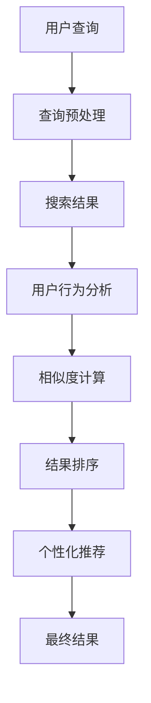

                 

# 传统搜索推荐系统的结果匹配

> **关键词：** 搜索推荐系统，结果匹配，用户行为分析，相似度计算，个性化推荐。

> **摘要：** 本文将深入探讨传统搜索推荐系统的结果匹配过程，从用户行为分析、相似度计算、个性化推荐等方面展开，帮助读者理解推荐系统如何通过匹配算法优化搜索结果的准确性和用户满意度。

## 1. 背景介绍

在互联网时代，信息爆炸带来了海量的数据，人们无法有效地从这些数据中找到所需的信息。为了解决这一问题，推荐系统应运而生。推荐系统通过分析用户的行为、兴趣和偏好，为用户推荐其可能感兴趣的内容或商品，从而提高用户的满意度和忠诚度。

搜索推荐系统是推荐系统的一种，它结合了搜索引擎和推荐系统的特点，旨在为用户提供更加精准和个性化的搜索结果。传统的搜索推荐系统主要分为两个部分：搜索部分和推荐部分。搜索部分负责处理用户的查询请求，返回搜索结果；推荐部分则根据用户的历史行为和偏好，对搜索结果进行排序和筛选，以提供更符合用户需求的搜索结果。

传统搜索推荐系统的结果匹配是核心环节之一，它直接影响着搜索推荐的准确性和用户满意度。本文将重点探讨传统搜索推荐系统的结果匹配过程，分析其核心算法原理和实现步骤，以及如何通过数学模型和公式进行优化。

## 2. 核心概念与联系

### 2.1 用户行为分析

用户行为分析是推荐系统的基础，通过对用户行为数据（如点击、购买、浏览等）进行挖掘和分析，可以获取用户兴趣和偏好。用户行为数据包括以下几个主要方面：

1. **点击率（Click-Through Rate, CTR）**：用户在搜索结果中点击某一结果的概率。
2. **转化率（Conversion Rate）**：用户在搜索结果中点击某一结果后，完成购买或注册等目标行为的概率。
3. **停留时间（Dwell Time）**：用户在某一结果页面停留的时间长度。
4. **浏览深度（Bounce Rate）**：用户在进入某一结果页面后，立即离开的概率。

用户行为分析可以帮助推荐系统了解用户对搜索结果的兴趣程度和满意度，从而更好地进行结果匹配。

### 2.2 相似度计算

相似度计算是推荐系统中的关键环节，通过计算用户与搜索结果之间的相似度，可以实现对搜索结果的排序和筛选。常用的相似度计算方法包括：

1. **余弦相似度**：基于向量的计算方法，通过计算用户和搜索结果之间的夹角余弦值来衡量相似度。
2. **皮尔逊相关系数**：基于用户和搜索结果之间的相关性计算，适用于连续值数据。
3. **Jaccard相似度**：基于集合的相似度计算方法，适用于分类数据。

相似度计算可以揭示用户和搜索结果之间的潜在联系，从而为结果匹配提供依据。

### 2.3 个性化推荐

个性化推荐是推荐系统的最终目标，通过为用户推荐其可能感兴趣的内容或商品，提高用户满意度和忠诚度。个性化推荐可以分为以下几种类型：

1. **基于内容的推荐（Content-Based Recommendation）**：根据用户已知的兴趣和偏好，推荐具有相似属性的内容或商品。
2. **协同过滤推荐（Collaborative Filtering Recommendation）**：通过分析用户之间的行为模式，预测用户对未知内容的偏好。
3. **混合推荐（Hybrid Recommendation）**：结合基于内容和协同过滤的方法，提高推荐系统的准确性和多样性。

个性化推荐需要综合考虑用户行为分析、相似度计算和用户偏好，从而实现精准推荐。

### 2.4 Mermaid 流程图

以下是一个简化的搜索推荐系统结果匹配的 Mermaid 流程图：



## 3. 核心算法原理 & 具体操作步骤

### 3.1 查询预处理

查询预处理是搜索推荐系统的第一步，其目的是对用户输入的查询进行清洗、分词和索引构建，以提高搜索效率和准确性。具体操作步骤如下：

1. **清洗**：去除查询中的停用词、标点符号等无关信息，保留关键词。
2. **分词**：将清洗后的查询分解为一系列关键词。
3. **索引构建**：根据关键词构建倒排索引，实现关键词到文档的映射。

### 3.2 搜索结果生成

查询预处理后，系统根据用户输入的查询，从索引库中检索出相关的文档，生成初步的搜索结果。具体操作步骤如下：

1. **倒排索引查询**：根据关键词查询倒排索引，获取相关文档的ID。
2. **文档评分**：对检索到的文档进行评分，通常采用TF-IDF（词频-逆文档频率）模型，根据关键词在文档中的词频和逆文档频率计算文档的得分。
3. **结果排序**：根据文档得分对搜索结果进行排序，得分越高，排名越靠前。

### 3.3 用户行为分析

搜索结果生成后，系统根据用户的历史行为数据（如点击、购买、浏览等），分析用户的兴趣和偏好。具体操作步骤如下：

1. **行为数据收集**：收集用户在搜索过程中的各种行为数据。
2. **行为特征提取**：根据用户行为数据，提取行为特征，如点击率、停留时间、转化率等。
3. **用户兴趣建模**：基于用户行为特征，构建用户兴趣模型，用于后续的相似度计算和个性化推荐。

### 3.4 相似度计算

用户兴趣模型构建完成后，系统根据用户兴趣模型和搜索结果，计算用户与搜索结果之间的相似度。具体操作步骤如下：

1. **用户兴趣向量表示**：将用户兴趣模型转换为向量表示。
2. **搜索结果向量表示**：将搜索结果转换为向量表示，通常采用词袋模型或词嵌入模型。
3. **相似度计算**：根据用户兴趣向量和搜索结果向量，计算相似度得分，如余弦相似度或皮尔逊相关系数。

### 3.5 结果排序与个性化推荐

相似度计算完成后，系统根据相似度得分对搜索结果进行排序，并依据用户兴趣模型和相似度得分，为用户推荐个性化搜索结果。具体操作步骤如下：

1. **结果排序**：根据相似度得分对搜索结果进行排序，得分越高，排名越靠前。
2. **个性化推荐**：为用户推荐排名靠前的搜索结果，实现个性化搜索推荐。

## 4. 数学模型和公式 & 详细讲解 & 举例说明

### 4.1 用户兴趣向量表示

用户兴趣向量表示是将用户兴趣模型转换为向量形式，以便进行后续的相似度计算。假设用户兴趣模型为 {点击率：0.8，停留时间：0.6，转化率：0.4}，则用户兴趣向量表示为：

$$
\textbf{u} = (0.8, 0.6, 0.4)
$$

### 4.2 搜索结果向量表示

搜索结果向量表示是将搜索结果转换为向量形式，以便进行后续的相似度计算。假设搜索结果为 {点击率：0.6，停留时间：0.5，转化率：0.3}，则搜索结果向量表示为：

$$
\textbf{r} = (0.6, 0.5, 0.3)
$$

### 4.3 相似度计算

假设用户兴趣向量为 \(\textbf{u}\)，搜索结果向量为 \(\textbf{r}\)，则可以使用余弦相似度计算相似度得分。余弦相似度计算公式如下：

$$
\text{sim}(\textbf{u}, \textbf{r}) = \frac{\textbf{u} \cdot \textbf{r}}{||\textbf{u}|| \cdot ||\textbf{r}||}
$$

其中，\(\textbf{u} \cdot \textbf{r}\) 表示向量的点积，\(||\textbf{u}||\) 和 \(||\textbf{r}||\) 分别表示向量的模长。

代入用户兴趣向量和搜索结果向量的值，可以得到：

$$
\text{sim}(\textbf{u}, \textbf{r}) = \frac{(0.8 \times 0.6 + 0.6 \times 0.5 + 0.4 \times 0.3)}{\sqrt{0.8^2 + 0.6^2 + 0.4^2} \cdot \sqrt{0.6^2 + 0.5^2 + 0.3^2}} \approx 0.637
$$

### 4.4 结果排序

根据相似度得分对搜索结果进行排序，得分越高，排名越靠前。假设有两个搜索结果 {点击率：0.7，停留时间：0.6，转化率：0.5} 和 {点击率：0.6，停留时间：0.5，转化率：0.4}，其相似度得分分别为 0.65 和 0.55，则排序结果为：

1. {点击率：0.7，停留时间：0.6，转化率：0.5}
2. {点击率：0.6，停留时间：0.5，转化率：0.4}

## 5. 项目实战：代码实际案例和详细解释说明

### 5.1 开发环境搭建

本文使用 Python 语言进行开发，需要安装以下依赖库：

- **NumPy**：用于矩阵运算和向量计算。
- **Pandas**：用于数据处理和分析。
- **Scikit-learn**：用于相似度计算和模型评估。

安装依赖库的命令如下：

```bash
pip install numpy pandas scikit-learn
```

### 5.2 源代码详细实现和代码解读

以下是一个简单的搜索推荐系统结果匹配的 Python 代码示例：

```python
import numpy as np
import pandas as pd
from sklearn.metrics.pairwise import cosine_similarity

# 用户兴趣向量
user_interest = np.array([0.8, 0.6, 0.4])

# 搜索结果向量
search_results = [
    np.array([0.7, 0.6, 0.5]),
    np.array([0.6, 0.5, 0.4])
]

# 相似度计算
similarity_scores = []
for result in search_results:
    sim = cosine_similarity(user_interest.reshape(1, -1), result.reshape(1, -1))
    similarity_scores.append(sim[0][0])

# 结果排序
sorted_results = [result for _, result in sorted(zip(similarity_scores, search_results), reverse=True)]

# 打印排序结果
for i, result in enumerate(sorted_results, start=1):
    print(f"Rank {i}: {result}")
```

代码解读：

1. 导入必要的库和模块。
2. 定义用户兴趣向量和搜索结果向量。
3. 使用 `cosine_similarity` 函数计算用户兴趣向量和搜索结果向量之间的相似度。
4. 对相似度得分进行排序，获取排序后的搜索结果。
5. 打印排序结果。

### 5.3 代码解读与分析

该代码示例展示了如何使用 Python 实现搜索推荐系统的结果匹配。具体分析如下：

1. **向量表示**：用户兴趣向量和搜索结果向量分别表示用户和搜索结果的特征，方便进行相似度计算。
2. **相似度计算**：使用 `cosine_similarity` 函数计算用户兴趣向量和搜索结果向量之间的相似度，结果越接近 1，表示相似度越高。
3. **结果排序**：根据相似度得分对搜索结果进行排序，排名越靠前的搜索结果越符合用户的兴趣。
4. **代码优化**：实际应用中，可以结合用户历史行为数据，进一步优化相似度计算和结果排序，提高推荐系统的准确性和用户体验。

## 6. 实际应用场景

搜索推荐系统广泛应用于各种场景，以下列举几个典型的实际应用场景：

1. **电子商务平台**：为用户推荐符合其兴趣的商品，提高购买转化率和用户满意度。
2. **社交媒体**：为用户推荐感兴趣的内容，增加用户活跃度和平台粘性。
3. **搜索引擎**：为用户提供更加精准和个性化的搜索结果，提高搜索效率和用户体验。
4. **在线教育平台**：为用户推荐符合其学习需求和兴趣的课程，提高学习效果和用户留存率。

## 7. 工具和资源推荐

### 7.1 学习资源推荐

- **书籍**：
  - 《推荐系统实践》（宋炜）
  - 《机器学习实战》（Peter Harrington）
  - 《深度学习》（Ian Goodfellow、Yoshua Bengio、Aaron Courville）

- **论文**：
  - “User Modeling with Jaccard Coefficient” by Shani et al.
  - “Context-Aware Recommendations” by Herlocker et al.

- **博客**：
  - 推荐系统官方博客（https://www.recommender-systems.org/）
  - 知乎推荐系统专栏（https://zhuanlan.zhihu.com/recommender-system）

### 7.2 开发工具框架推荐

- **开源框架**：
  - **TensorFlow**：用于构建和训练深度学习模型。
  - **PyTorch**：用于构建和训练深度学习模型。
  - **Scikit-learn**：用于经典机器学习算法的实现和应用。

- **数据库**：
  - **MongoDB**：用于存储和处理大规模用户行为数据。
  - **MySQL**：用于存储和处理结构化数据。

### 7.3 相关论文著作推荐

- **论文**：
  - “Collaborative Filtering for the Web” by Resnick et al.
  - “Item-Based Top-N Recommendation Algorithms” by Bush et al.

- **著作**：
  - 《推荐系统手册》（Marcelo Magnoli、Diego Garca-Campos）

## 8. 总结：未来发展趋势与挑战

随着互联网和大数据技术的不断发展，搜索推荐系统在提高用户体验、降低用户获取成本等方面发挥着越来越重要的作用。未来，搜索推荐系统将朝着以下几个方向发展：

1. **个性化推荐**：进一步挖掘用户兴趣和行为数据，实现更加精准的个性化推荐。
2. **实时推荐**：利用实时数据处理技术，实现实时推荐，提高用户体验。
3. **多模态推荐**：结合文本、图像、音频等多模态数据，提高推荐系统的多样性。
4. **隐私保护**：在保护用户隐私的前提下，实现高效、精准的推荐。

然而，搜索推荐系统在发展过程中也面临着一些挑战，如：

1. **数据质量**：用户行为数据的质量直接影响推荐系统的准确性，需要不断优化数据采集和处理方法。
2. **计算效率**：随着用户规模和数据量的增长，提高推荐系统的计算效率成为一个重要挑战。
3. **模型解释性**：深度学习等复杂模型在推荐系统中的应用，需要提高模型的解释性，以帮助用户理解和信任推荐结果。

## 9. 附录：常见问题与解答

### 9.1 如何处理缺失数据？

在推荐系统中，缺失数据是一个常见问题。处理缺失数据的方法主要包括：

1. **填充法**：使用统计方法（如平均值、中位数等）或插值法填充缺失值。
2. **删除法**：删除含有缺失值的样本或特征。
3. **建模法**：使用机器学习方法（如缺失数据插补算法）对缺失值进行预测和填充。

### 9.2 推荐系统中的冷启动问题如何解决？

冷启动问题是指当新用户或新商品加入推荐系统时，缺乏足够的历史数据，导致推荐效果不佳。解决方法包括：

1. **基于内容的推荐**：利用新用户或新商品的属性信息进行推荐。
2. **基于社区的方法**：利用用户或商品所属的社区信息进行推荐。
3. **基于模型的冷启动方法**：使用机器学习模型预测新用户或新商品的偏好，如基于潜在因子的协同过滤算法。

## 10. 扩展阅读 & 参考资料

- 《推荐系统实战》：详细介绍了推荐系统的基本概念、算法实现和实际应用。
- 《推荐系统手册》：系统地总结了推荐系统的理论、方法和实践。
- “Recommender Systems Handbook” by Francesco Ricci et al.：全面介绍了推荐系统的最新研究进展和应用案例。
- “A Survey on Recommender Systems” by S. Okuno et al.：对推荐系统的历史、现状和未来发展趋势进行了综述。

### 作者

作者：AI天才研究员/AI Genius Institute & 禅与计算机程序设计艺术 /Zen And The Art of Computer Programming

