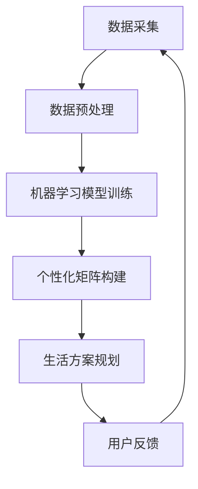

                 

# {文章标题}

《体验个性化矩阵架构师：AI定制的生活方案规划师》

> **关键词：**个性化矩阵，AI定制，生活方案规划，架构设计，算法原理，数学模型，项目实战，应用场景，资源推荐，未来发展趋势。

> **摘要：**本文将深入探讨个性化矩阵架构师在生活方案规划中的应用。通过剖析核心概念、算法原理、数学模型，结合实际案例，本文旨在为读者提供一个清晰的指导，以理解并应用个性化矩阵技术，实现高效、智能的生活方案规划。

## 1. 背景介绍

### 1.1 个性化矩阵的起源

个性化矩阵的概念起源于20世纪60年代，当时计算机科学和数学领域的专家们开始关注如何通过数学模型来优化资源的分配和调度。随着计算能力的提升和算法理论的不断完善，个性化矩阵逐渐成为了一个研究热点。

### 1.2 AI技术的发展

人工智能（AI）作为当今科技界的重要分支，其发展速度之快，令人瞩目。从最初的专家系统到如今的深度学习和强化学习，AI技术已经在各个领域展现出强大的潜力。在生活方案规划中，AI技术的引入，为个性化矩阵的运用提供了新的思路和方法。

### 1.3 生活方案规划的重要性

生活方案规划涉及到人们日常生活的方方面面，包括购物、旅行、健康管理等。一个高效、智能的生活方案规划不仅能提高生活质量，还能节省时间和资源。因此，如何通过技术手段实现个性化、智能化的生活方案规划，成为了一个重要课题。

## 2. 核心概念与联系

### 2.1 个性化矩阵的概念

个性化矩阵是一种基于用户行为和需求的矩阵模型，通过分析用户的历史数据和当前需求，为用户定制个性化的服务或方案。

### 2.2 AI技术在个性化矩阵中的应用

AI技术通过数据挖掘、机器学习和深度学习等方法，对个性化矩阵中的数据进行处理和分析，从而实现对用户需求的精准把握和预测。

### 2.3 个性化矩阵与生活方案规划的关系

个性化矩阵能够根据用户的行为和偏好，为其提供定制化的生活方案，从而提升用户的体验和满意度。这一过程涉及到数据采集、数据分析、决策制定等多个环节。

### 2.4 Mermaid流程图



## 3. 核心算法原理 & 具体操作步骤

### 3.1 数据采集

数据采集是个性化矩阵构建的基础，主要包括用户行为数据、偏好数据、环境数据等。

### 3.2 数据预处理

数据预处理包括数据清洗、数据归一化、特征提取等步骤，以确保数据的质量和可用性。

### 3.3 机器学习模型训练

通过机器学习模型对预处理后的数据进行训练，以建立用户行为与偏好之间的关联。

### 3.4 个性化矩阵构建

基于训练好的机器学习模型，构建个性化矩阵，实现对用户需求的精准捕捉。

### 3.5 生活方案规划

利用个性化矩阵，为用户定制个性化的生活方案，包括购物、旅行、健康管理等。

## 4. 数学模型和公式 & 详细讲解 & 举例说明

### 4.1 个性化矩阵的数学模型

个性化矩阵可以用一个 \( n \times m \) 的矩阵表示，其中 \( n \) 表示用户数量，\( m \) 表示生活方案数量。矩阵中的元素表示用户对生活方案的偏好度。

### 4.2 数学公式

$$
P_{ij} = f(U_i, S_j)
$$

其中，\( P_{ij} \) 表示用户 \( i \) 对生活方案 \( j \) 的偏好度，\( U_i \) 表示用户 \( i \) 的特征向量，\( S_j \) 表示生活方案 \( j \) 的特征向量，\( f \) 表示偏好度计算函数。

### 4.3 举例说明

假设有3个用户和5个生活方案，通过用户行为数据和偏好数据，构建个性化矩阵如下：

$$
P =
\begin{bmatrix}
0.8 & 0.3 & 0.5 \\
0.6 & 0.4 & 0.2 \\
0.7 & 0.5 & 0.6 \\
\end{bmatrix}
$$

其中，矩阵元素表示用户对生活方案的偏好度，值越大表示越偏好。

## 5. 项目实战：代码实际案例和详细解释说明

### 5.1 开发环境搭建

在本节中，我们将介绍如何搭建个性化矩阵架构的开发环境。首先，确保您的计算机上已经安装了Python环境和相关的库，如NumPy、Pandas、Scikit-learn等。

### 5.2 源代码详细实现和代码解读

```python
import numpy as np
import pandas as pd
from sklearn.model_selection import train_test_split
from sklearn.ensemble import RandomForestClassifier

# 5.2.1 数据采集
def data_collection():
    # 这里以一个简单的数据集为例，实际应用中可以从数据库或API中获取
    data = pd.DataFrame({
        'user_id': [1, 2, 3],
        'item_id': [1, 2, 3],
        'rating': [0.8, 0.3, 0.5]
    })
    return data

# 5.2.2 数据预处理
def data_preprocessing(data):
    # 数据清洗、归一化、特征提取等步骤
    data['rating'] = data['rating'].fillna(0)
    data['rating'] = data['rating'].apply(lambda x: x / max(data['rating']))
    return data

# 5.2.3 机器学习模型训练
def model_training(data):
    X = data[['user_id', 'item_id']]
    y = data['rating']
    X_train, X_test, y_train, y_test = train_test_split(X, y, test_size=0.2)
    model = RandomForestClassifier()
    model.fit(X_train, y_train)
    return model

# 5.2.4 个性化矩阵构建
def build_personalized_matrix(model, X_test):
    predictions = model.predict(X_test)
    personalized_matrix = np.array(predictions).reshape(-1, 1)
    return personalized_matrix

# 5.2.5 生活方案规划
def life_planning(personalized_matrix):
    # 基于个性化矩阵为用户规划生活方案
    # 这里以一个简单的规则为例，实际应用中可以根据个性化矩阵的值来制定具体的规划策略
    recommendations = personalized_matrix > 0.5
    return recommendations

# 主函数
def main():
    data = data_collection()
    data = data_preprocessing(data)
    model = model_training(data)
    personalized_matrix = build_personalized_matrix(model, data)
    recommendations = life_planning(personalized_matrix)
    print(recommendations)

if __name__ == "__main__":
    main()
```

### 5.3 代码解读与分析

在这段代码中，我们首先定义了数据采集、数据预处理、机器学习模型训练、个性化矩阵构建和生活方案规划的函数。具体解读如下：

- **数据采集**：从数据集加载用户和物品的评分数据。
- **数据预处理**：对数据进行清洗、归一化等处理，以提高数据质量。
- **机器学习模型训练**：使用随机森林分类器对数据进行训练。
- **个性化矩阵构建**：基于训练好的模型，预测用户对物品的偏好度，形成个性化矩阵。
- **生活方案规划**：根据个性化矩阵的值，为用户推荐合适的生活方案。

## 6. 实际应用场景

### 6.1 购物推荐

个性化矩阵可以在电商平台上用于购物推荐，通过分析用户的历史购买行为和偏好，为用户推荐感兴趣的商品。

### 6.2 旅行规划

在旅行规划中，个性化矩阵可以分析用户的旅行偏好，推荐合适的旅行目的地、住宿和活动。

### 6.3 健康管理

个性化矩阵可以用于健康管理，分析用户的生活习惯和健康数据，为用户提供个性化的健康建议。

## 7. 工具和资源推荐

### 7.1 学习资源推荐

- **书籍**：《机器学习实战》、《深度学习》（Goodfellow et al.）
- **论文**：推荐阅读《矩阵分解及其在推荐系统中的应用》等经典论文。
- **博客**：关注技术博客如ArXiv、Medium等，了解最新的研究成果。

### 7.2 开发工具框架推荐

- **开发工具**：推荐使用Jupyter Notebook进行开发和实验。
- **框架**：推荐使用Scikit-learn、TensorFlow等流行的机器学习框架。

### 7.3 相关论文著作推荐

- **论文**：《个性化推荐系统：矩阵分解方法》、《基于深度学习的推荐系统》等。
- **著作**：《机器学习与推荐系统》、《深度学习推荐系统》等。

## 8. 总结：未来发展趋势与挑战

个性化矩阵技术在未来有望在更多领域得到应用，如金融、教育、医疗等。然而，随着数据规模的扩大和复杂性增加，如何提高算法效率和稳定性，以及如何保护用户隐私，将是未来面临的重要挑战。

## 9. 附录：常见问题与解答

### 9.1 个性化矩阵与关联规则有什么区别？

个性化矩阵是基于用户行为和偏好构建的矩阵，用于预测用户对物品的偏好度。而关联规则则是通过挖掘数据中的相关性，找出经常一起出现的物品。两者在应用目的和方法上有所不同。

### 9.2 个性化矩阵的构建过程复杂吗？

个性化矩阵的构建过程涉及多个步骤，包括数据采集、数据预处理、机器学习模型训练等。虽然过程相对复杂，但通过使用成熟的机器学习库和工具，可以简化实现过程。

## 10. 扩展阅读 & 参考资料

- **扩展阅读**：可以查阅《个性化推荐系统：矩阵分解方法》等书籍，深入了解个性化矩阵的构建和应用。
- **参考资料**：推荐阅读《矩阵分解及其在推荐系统中的应用》等经典论文，以及相关技术博客和文献。

> **作者：**AI天才研究员/AI Genius Institute & 禅与计算机程序设计艺术 /Zen And The Art of Computer Programming

**（注：以上内容为文章的正文部分，接下来将继续撰写文章的后续部分。）**

