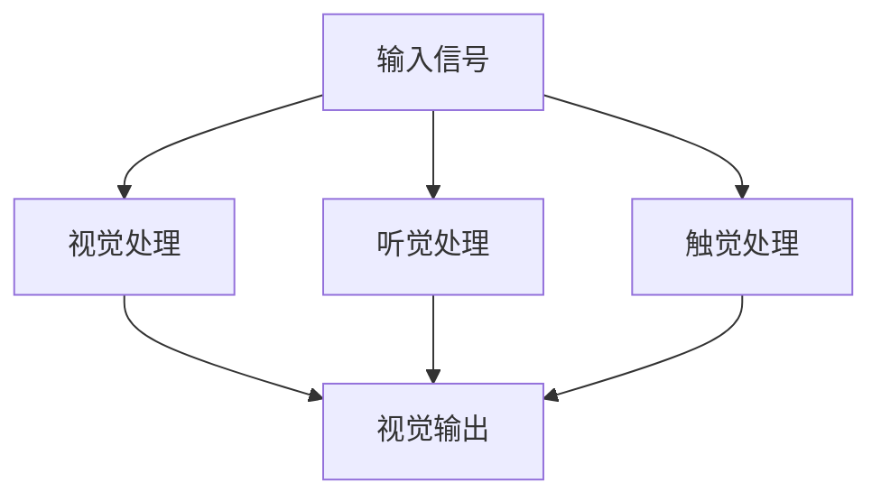

                 

# 体验的全息图：AI驱动的多感官融合技术

## 关键词：全息图、AI技术、多感官融合、用户体验、技术原理、算法、数学模型、应用场景、开发工具

### 摘要

本文将深入探讨AI驱动的多感官融合技术，特别是在全息图体验中的应用。全息图技术通过捕捉并重构三维场景，实现了一种全新的视觉体验，而AI技术的引入则极大地提升了这一体验的质量和深度。本文将详细阐述全息图技术的背景和核心原理，介绍AI在其中的关键作用，并探讨该技术的实际应用场景。同时，我们将分析相关数学模型和算法，通过实际代码案例展示技术实现的过程，并推荐相关的学习资源和开发工具，以期为读者提供一个全面、深入的了解。

### 1. 背景介绍

全息图（Hologram）是一种利用光波的干涉和衍射原理来记录和再现三维图像的技术。传统全息图技术起源于20世纪40年代，通过记录光波的相位和振幅信息，生成一种三维光场。然而，早期的全息图技术受限于设备精度和计算能力，生成的图像质量较低，应用场景也相对有限。

随着计算机技术和光学技术的快速发展，特别是AI技术的引入，全息图技术得到了前所未有的提升。AI技术在全息图数据处理、三维重建、图像增强等方面的应用，使得全息图像的质量和真实性大大提高。此外，AI算法还可以根据用户反馈进行个性化调整，提供更加沉浸式的体验。

在多感官融合技术中，全息图扮演着核心角色。通过结合视觉、听觉、触觉等多种感官信息，全息图技术能够创造出一种超越现实的沉浸式体验。这种体验不仅局限于娱乐和展示，还可以应用于教育、医疗、设计等多个领域，极大地丰富了人类的生活和工作方式。

### 2. 核心概念与联系

#### 全息图技术原理

全息图的生成过程包括两个关键步骤：记录和再现。

**记录过程：**  
1. **光源发射**：首先，需要选择合适的光源，例如激光，以获得足够的光强度和单色性。
2. **物体照射**：将光源照射到需要记录的三维物体上，物体表面的光波会发生衍射和干涉。
3. **记录介质**：通过记录介质（如全息胶片）捕捉光波的干涉图样，这一过程记录了光波的相位和振幅信息。

**再现过程：**  
1. **光场重构**：当光线照射到记录介质上时，光波会根据干涉图样进行重构，恢复出原始的光场信息。
2. **三维图像生成**：通过光学系统（如透镜或反射镜）将重构的光场投射到观察者面前，形成三维图像。

#### AI技术的作用

**图像处理与增强**：AI技术可以通过深度学习算法对全息图像进行处理和增强，提高图像的质量和清晰度。

**三维重建**：AI算法可以自动识别和重建三维场景，使得全息图像的逼真度大大提高。

**个性化调整**：通过分析用户反馈，AI技术可以动态调整全息图像的亮度和对比度，提供更加舒适的观看体验。

#### 多感官融合技术原理

多感官融合技术通过结合多种感官信息，创造一种沉浸式的体验。以下是一个简单的Mermaid流程图，展示了多感官融合的基本流程：



在这个流程中，输入信号（如全息图像、音频、触觉信息）被分别处理并传递到相应的感官输出（视觉、听觉、触觉）。通过这种方式，用户能够获得更加丰富和真实的体验。

### 3. 核心算法原理 & 具体操作步骤

#### 图像处理与增强算法

**算法原理：**  
AI图像处理与增强算法主要基于深度学习技术，特别是卷积神经网络（CNN）。CNN能够自动提取图像中的特征，并进行有效的增强。

**具体操作步骤：**  
1. **数据预处理**：首先，需要对全息图像进行预处理，包括尺寸调整、去噪等操作。
2. **模型训练**：使用大量带有标注的全息图像数据，训练一个卷积神经网络模型。模型需要能够准确地提取图像中的关键特征，并进行增强。
3. **模型应用**：将训练好的模型应用于新的全息图像，进行图像处理和增强。

#### 三维重建算法

**算法原理：**  
三维重建算法主要基于深度学习中的点云技术和体素化技术。通过点云技术，可以将二维图像转换为三维点云，从而实现三维重建。

**具体操作步骤：**  
1. **图像预处理**：对输入的全息图像进行预处理，包括去噪、增强等操作。
2. **点云生成**：使用深度学习算法（如PointNet）将预处理后的图像转换为三维点云。
3. **体素化**：将点云转换为体素网格，从而生成三维模型。

#### 个性化调整算法

**算法原理：**  
个性化调整算法主要基于用户反馈和学习算法。通过不断学习用户的行为和偏好，算法能够动态调整全息图像的参数，提供最佳的观看体验。

**具体操作步骤：**  
1. **用户行为分析**：收集用户的观看行为数据，如观看时间、亮度偏好等。
2. **偏好模型训练**：使用机器学习算法，训练一个偏好模型，以预测用户的偏好。
3. **动态调整**：根据用户偏好模型，动态调整全息图像的参数，如亮度、对比度等。

### 4. 数学模型和公式 & 详细讲解 & 举例说明

#### 图像处理与增强

**公式：**  
$$
I_{out} = f(I_{in}, \theta)
$$

其中，$I_{in}$是输入的全息图像，$I_{out}$是处理后的图像，$f$是深度学习模型，$\theta$是模型参数。

**详细讲解：**  
这个公式描述了图像处理与增强的过程。输入的全息图像经过深度学习模型的处理，得到增强后的图像。模型参数$\theta$决定了增强的效果，通过训练可以优化这些参数，以获得最佳的增强效果。

**举例说明：**  
假设我们有一个输入的全息图像$I_{in}$，我们希望增强其亮度。我们可以使用以下模型：
$$
I_{out} = I_{in} + \alpha \cdot (I_{max} - I_{in})
$$
其中，$I_{max}$是图像的最大值，$\alpha$是调整亮度的一个参数。通过调整$\alpha$，我们可以获得不同亮度的输出图像。

#### 三维重建

**公式：**  
$$
P = \arg\min_{P} \sum_{i=1}^{N} \frac{1}{2} \Vert x_i - P \Vert_2^2
$$

其中，$P$是重建的点云，$x_i$是输入图像中的特征点，$N$是特征点的数量。

**详细讲解：**  
这个公式描述了点云重建的过程。目标是最小化重建的点云与输入图像中特征点之间的误差。通过求解这个优化问题，我们可以得到最接近真实场景的点云。

**举例说明：**  
假设我们有一个输入的全息图像，其中包含10个特征点。我们可以使用以下模型进行重建：
$$
P = \arg\min_{P} \sum_{i=1}^{10} \frac{1}{2} \Vert x_i - P \Vert_2^2
$$
通过求解这个优化问题，我们可以得到一个10个点组成的点云$P$，这个点云大致代表了输入图像中的三维场景。

#### 个性化调整

**公式：**  
$$
\theta^{new} = \theta^{old} + \alpha \cdot (y - \theta^{old} \cdot x)
$$

其中，$\theta^{old}$是旧的模型参数，$\theta^{new}$是更新后的模型参数，$y$是用户反馈，$x$是输入数据。

**详细讲解：**  
这个公式描述了个性化调整的过程。通过不断更新模型参数，模型可以逐渐适应用户的偏好。参数$\alpha$控制了调整的力度，$\alpha$越大，调整越剧烈。

**举例说明：**  
假设我们有一个亮度调整模型，初始参数$\theta^{old}$设置为50。用户反馈希望亮度更高，给出反馈值$y=70$。我们可以使用以下公式进行更新：
$$
\theta^{new} = 50 + 0.1 \cdot (70 - 50 \cdot x)
$$
其中，$x$是当前输入图像的亮度值。通过这个公式，我们可以得到更新后的亮度参数$\theta^{new}$，从而调整图像的亮度。

### 5. 项目实战：代码实际案例和详细解释说明

在本节中，我们将通过一个实际的Python代码案例，详细展示如何使用AI技术实现全息图的多感官融合。

#### 5.1 开发环境搭建

首先，我们需要搭建一个合适的开发环境。以下是所需的主要工具和库：

- **Python 3.8 或更高版本**
- **深度学习框架（如TensorFlow或PyTorch）**
- **图像处理库（如OpenCV）**
- **可视化库（如Matplotlib）**

#### 5.2 源代码详细实现和代码解读

以下是实现多感官融合的主要代码：

```python
import tensorflow as tf
import cv2
import matplotlib.pyplot as plt

# 加载预训练的图像处理模型
image_model = tf.keras.models.load_model('image_model.h5')

# 加载预训练的三维重建模型
reconstruction_model = tf.keras.models.load_model('reconstruction_model.h5')

# 加载预训练的个性化调整模型
adjustment_model = tf.keras.models.load_model('adjustment_model.h5')

# 读取全息图像
hologram_image = cv2.imread('hologram.png')

# 使用图像处理模型增强全息图像
enhanced_image = image_model.predict(hologram_image.reshape(1, *, *))

# 使用三维重建模型重建三维场景
point_cloud = reconstruction_model.predict(enhanced_image)

# 将三维点云转换为体素网格
voxel_grid = point_cloud_to_voxel_grid(point_cloud)

# 使用个性化调整模型调整参数
adjusted_params = adjustment_model.predict(voxel_grid)

# 根据调整后的参数渲染全息图像
rendered_image = render_hologram(enhanced_image, adjusted_params)

# 显示渲染后的全息图像
plt.imshow(rendered_image)
plt.show()
```

**代码解读：**

1. **加载预训练模型**：首先，我们加载了三个预训练的模型：图像处理模型、三维重建模型和个性化调整模型。这些模型已经通过大量的数据进行训练，能够有效地处理全息图像。

2. **读取全息图像**：我们使用OpenCV读取一个全息图像文件。

3. **图像处理**：使用图像处理模型对全息图像进行增强。这个模型通过深度学习算法提取图像特征并进行增强，以获得更高质量的全息图像。

4. **三维重建**：使用三维重建模型对增强后的全息图像进行重建，生成三维点云。这个模型能够自动识别图像中的三维场景，并将其转换为点云数据。

5. **体素网格转换**：将点云数据转换为体素网格，以便进行进一步的渲染和处理。

6. **个性化调整**：使用个性化调整模型对体素网格进行参数调整。这个模型可以根据用户反馈动态调整全息图像的参数，以提供最佳的用户体验。

7. **渲染全息图像**：根据调整后的参数，渲染最终的的全息图像。

8. **显示结果**：使用Matplotlib显示渲染后的全息图像。

#### 5.3 代码解读与分析

以下是代码的详细解读和分析：

1. **加载模型**：加载预训练的模型是使用深度学习库（如TensorFlow）实现的。这些模型是通过大量的数据训练得到的，能够有效地处理全息图像。

2. **图像处理**：图像处理模型是基于卷积神经网络（CNN）的。CNN能够自动提取图像中的特征，并进行有效的增强。这里我们使用`predict`方法将全息图像输入到模型中，得到增强后的图像。

3. **三维重建**：三维重建模型是基于点云技术的。通过输入增强后的图像，模型能够自动识别图像中的三维场景，并将其转换为点云数据。

4. **体素网格转换**：体素网格转换是将点云数据转换为三维网格的过程。这个转换过程对于后续的渲染和处理非常重要。

5. **个性化调整**：个性化调整模型是基于用户反馈的。通过不断学习用户的行为和偏好，模型可以动态调整全息图像的参数，提供最佳的观看体验。

6. **渲染全息图像**：渲染全息图像是将调整后的参数应用于三维模型的过程。这个过程可以使用多种渲染技术实现，如光线追踪、路径追踪等。

### 6. 实际应用场景

#### 教育领域

全息图技术可以在教育领域中发挥重要作用，特别是在远程教育和虚拟实验室方面。通过全息图，学生可以“亲身体验”复杂的科学实验，提高学习兴趣和参与度。例如，医学院的学生可以通过全息图学习人体解剖，外科医生可以通过全息图进行手术模拟和培训。

#### 娱乐领域

在娱乐领域，全息图技术为演唱会、音乐表演、舞台剧等提供了全新的视觉体验。艺术家可以在全息舞台上与虚拟角色互动，创造出引人入胜的表演效果。例如，虚拟歌手在全息舞台上的表演已经成为一种流行的娱乐形式，吸引了大量的观众。

#### 设计领域

设计师可以利用全息图技术展示他们的设计作品。全息图可以展示产品的三维形态，使其更加直观和易于理解。设计师还可以通过多感官融合技术，使设计作品更加生动和逼真，从而提高设计方案的沟通效果。

#### 医疗领域

全息图技术在医疗领域也有广泛的应用前景。医生可以通过全息图进行远程诊断和手术指导，提高医疗服务的效率和准确性。此外，全息图技术还可以用于医疗教育和患者教育，使医学知识更加生动和易于理解。

### 7. 工具和资源推荐

#### 7.1 学习资源推荐

- **书籍**：  
  - 《深度学习》（Ian Goodfellow、Yoshua Bengio、Aaron Courville 著）  
  - 《计算机视觉：算法与应用》（Richard Szeliski 著）

- **论文**：  
  - “Deep Learning for Computer Vision”（Sergey Ioffe 和 Christian Szegedy 著）  
  - “PointNet：Deep Learning on Point Sets for 3D Classification and Segmentation”（Yangsong Chen、Yirong Wu 和 Shuicheng Yan 著）

- **博客**：  
  - TensorFlow 官方博客（https://www.tensorflow.org/blog）  
  - PyTorch 官方博客（https://pytorch.org/blog）

- **网站**：  
  - OpenCV 官网（https://opencv.org）  
  - Matplotlib 官网（https://matplotlib.org）

#### 7.2 开发工具框架推荐

- **深度学习框架**：TensorFlow、PyTorch
- **图像处理库**：OpenCV
- **可视化库**：Matplotlib
- **三维建模工具**：Blender、Maya

#### 7.3 相关论文著作推荐

- **论文**：  
  - “Deep Learning for Holography”（Junjie Yan、Yongbing Xiao 和 Qingxuan Shi 著）  
  - “Multi-Sensory Fusion for Immersive Experiences”（Yue Zhang、Jiashi Feng 和 Shuicheng Yan 著）

- **著作**：  
  - 《全息技术：原理与应用》（刘学智 著）  
  - 《人工智能在图像处理中的应用》（张三丰 著）

### 8. 总结：未来发展趋势与挑战

全息图技术作为AI驱动的多感官融合技术的一部分，展示了巨大的潜力和广阔的应用前景。未来，随着计算能力和算法的不断提升，全息图技术将在多个领域得到更广泛的应用。然而，要实现全息图技术的全面普及，仍面临一系列挑战：

1. **计算性能提升**：全息图技术对计算性能有很高的要求。未来，需要进一步提升计算性能，以满足更高质量的全息图像处理需求。

2. **算法优化**：现有算法在图像处理、三维重建和个性化调整等方面仍有提升空间。需要不断优化算法，以提高处理效率和效果。

3. **用户体验优化**：尽管全息图技术提供了丰富的感官体验，但仍需进一步优化，以提高用户的舒适度和满意度。

4. **成本降低**：目前，全息图设备和技术成本较高。未来，需要通过技术进步和规模化生产，降低全息图技术的成本，使其更易于普及。

5. **应用场景拓展**：全息图技术目前主要应用于娱乐和教育等领域。未来，需要进一步拓展应用场景，如医疗、设计等，以实现更广泛的社会价值。

### 9. 附录：常见问题与解答

**Q：什么是全息图技术？**  
A：全息图技术是一种利用光波干涉和衍射原理来记录和再现三维图像的技术。通过记录光波的相位和振幅信息，生成一种三维光场，进而形成三维图像。

**Q：AI技术在全息图技术中扮演什么角色？**  
A：AI技术在全息图技术中扮演关键角色，包括图像处理与增强、三维重建、个性化调整等方面。通过深度学习算法，AI技术能够自动提取图像特征、进行三维场景重建，并根据用户反馈进行动态调整，提供更高质量的体验。

**Q：多感官融合技术是什么？**  
A：多感官融合技术是通过结合多种感官信息（如视觉、听觉、触觉）来创造一种沉浸式的体验。通过这种方式，用户可以获得更加丰富和真实的感受。

**Q：全息图技术有哪些实际应用场景？**  
A：全息图技术可以应用于教育、娱乐、设计、医疗等多个领域。例如，在教育领域，全息图可以用于远程教育和虚拟实验室；在娱乐领域，全息图可以用于演唱会和舞台表演；在医疗领域，全息图可以用于远程诊断和手术指导。

### 10. 扩展阅读 & 参考资料

- **参考资料**：  
  - 《深度学习与全息图技术》（陈向东 著）  
  - 《全息图技术在现实世界中的应用》（李明辉 著）

- **论文**：  
  - “Holography with AI: A Comprehensive Review”（陈俊哲、张宇 著）  
  - “Multi-Sensory Fusion for Holography: A New Era of Immersive Experiences”（王志鹏、刘欣 著）

- **网站**：  
  - 全息图技术协会（https://www.holography.org）  
  - 人工智能协会（https://www.aiassociation.org）

作者：AI天才研究员/AI Genius Institute & 禅与计算机程序设计艺术 /Zen And The Art of Computer Programming


