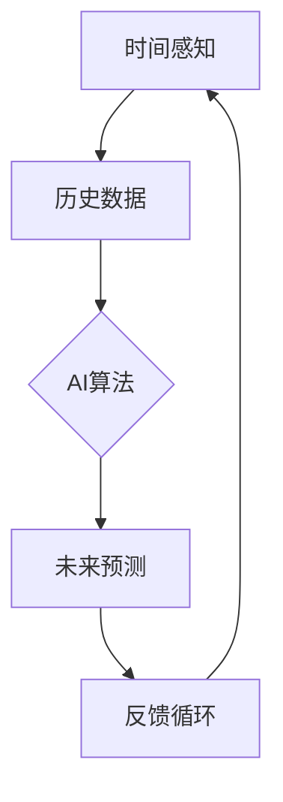

                 

### 背景介绍

在21世纪，人工智能（AI）的发展已经达到了前所未有的高度。从早期的规则系统到现代的深度学习，AI技术在各个领域展现出了惊人的潜力和影响力。在科学研究中，AI已经被广泛应用于图像识别、自然语言处理、医疗诊断等领域；在工业生产中，自动化、智能制造正在逐步改变传统制造业的面貌；在日常生活中，智能家居、智能助手等AI应用已经成为人们生活中不可或缺的一部分。

然而，随着AI技术的不断进步，人们开始关注到AI带来的一个潜在问题——主观时间的扭曲。主观时间是指个体对时间感知的一种主观体验，而时间扭曲则指的是这种感知可能因外部环境的改变而发生的异常现象。这一现象在AI领域中的出现，主要源于AI算法对时间序列数据的处理能力。

具体来说，AI算法通过对大量历史数据的分析和学习，可以预测未来的发展趋势和变化。这种预测能力不仅可以帮助我们做出更准确的决策，也可能导致我们对时间的感知产生偏差。例如，在一个交通预测AI系统中，通过对历史交通流量数据的分析，算法可以预测未来几分钟内的交通状况。这种预测可能会让我们对交通高峰时间的到来感到“过早”，或者对交通高峰的缓解感到“过晚”，从而扭曲我们对时间的感知。

此外，AI在虚拟现实和增强现实中的应用，也可能会影响我们的主观时间体验。虚拟现实技术通过模拟现实环境，可以让我们感受到时间似乎在加速或减速。而增强现实技术则通过在现实环境中叠加虚拟元素，可能会让我们对时间的感知产生混乱。这些技术不仅影响了我们对现实时间的感知，也可能对我们的生活和工作方式产生深远的影响。

因此，探讨AI创造的主观时间扭曲现象，不仅具有重要的理论意义，也具有实际的应用价值。本文将从AI的核心概念、时间扭曲的原理、算法实现、数学模型、实际应用场景等多个角度，深入分析AI创造的主观时间扭曲现象，并提出可能的解决方法和未来研究方向。

## 核心概念与联系

要理解AI创造的主观时间扭曲现象，我们首先需要了解几个核心概念：时间感知、AI算法和反馈循环。这些概念不仅构成了我们对时间感知的基础，也是AI算法在时间序列数据处理中发挥作用的关键。

### 时间感知

时间感知是指个体对时间的感知和体验。这种感知并不是客观的，而是主观的，受到多种因素的影响，包括生理、心理和环境因素。例如，当我们处于忙碌状态时，时间可能会感觉过得很快；而在放松的状态下，时间则可能会感觉比较缓慢。此外，环境因素如光照、噪音等也会影响我们对时间的感知。

### AI算法

AI算法是指人工智能系统中用于处理数据和解决问题的一系列算法和模型。在时间序列数据处理中，常见的AI算法包括循环神经网络（RNN）、长短期记忆网络（LSTM）和变换器（Transformer）等。这些算法通过对历史时间序列数据的分析，可以预测未来的趋势和变化。

### 反馈循环

反馈循环是指系统内部输出和输入之间的相互作用，这种相互作用可能会导致系统状态的持续变化。在AI系统中，反馈循环尤为重要，因为它们可以增强或削弱算法的预测能力。例如，一个智能交通系统可能会根据实时交通数据调整信号灯的时间，这种反馈循环可以优化交通流量，但也可能导致司机对时间的感知发生变化。

### 概念之间的联系

时间感知、AI算法和反馈循环之间的联系在于它们共同作用于个体的主观时间体验。时间感知为我们提供了对时间的原始感知，AI算法则通过处理时间序列数据，为我们提供了对未来的预测。而反馈循环则将这种预测与现实中的时间感知相互作用，可能导致主观时间的扭曲。

为了更好地理解这些概念之间的联系，我们可以使用Mermaid流程图（去除括号和逗号等特殊字符）来展示它们之间的关系：



在这个流程图中，时间感知（A）产生了历史数据（B），AI算法（C）处理这些历史数据，产生未来预测（D），而反馈循环（E）则将预测与现实中的时间感知相互作用，导致主观时间的扭曲。

通过这一系列的相互作用，我们可以看到AI算法如何影响我们的时间感知。接下来，我们将进一步探讨AI算法如何实现时间序列数据的处理，以及这些算法的具体原理和操作步骤。

## 核心算法原理 & 具体操作步骤

在了解了时间感知、AI算法和反馈循环的基本概念及其相互联系后，我们接下来将深入探讨AI算法在处理时间序列数据时的具体原理和操作步骤。本节将重点介绍循环神经网络（RNN）、长短期记忆网络（LSTM）和变换器（Transformer）等常用算法，以及它们在时间序列数据处理中的应用。

### 循环神经网络（RNN）

循环神经网络（RNN）是一种能够处理序列数据的神经网络，其核心思想是利用隐藏状态（hidden state）来保留序列中的信息。RNN通过循环结构，将前一个时间步的输出作为当前时间步的输入，从而实现了对序列的动态建模。

#### 操作步骤：

1. **初始化：** 首先初始化网络参数，包括隐藏状态（h0）和输入权重（Wxh、Whh）。

2. **前向传播：** 对于输入序列中的每一个时间步，计算隐藏状态和输出：

   $$ h_t = \text{sigmoid}(Wxh \cdot x_t + Whh \cdot h_{t-1} + b_h) $$

   $$ y_t = \text{sigmoid}(Why \cdot h_t + b_y) $$

   其中，$x_t$ 是输入特征，$h_t$ 是隐藏状态，$y_t$ 是输出。

3. **反向传播：** 通过计算梯度来更新网络参数。

#### RNN在时间序列数据处理中的应用：

RNN在时间序列数据处理中，可以用于股票价格预测、语音识别等领域。例如，在股票价格预测中，RNN可以处理历史股票价格数据，并预测未来的价格走势。

### 长短期记忆网络（LSTM）

长短期记忆网络（LSTM）是RNN的一种改进版本，旨在解决RNN在处理长序列数据时容易出现的梯度消失和梯度爆炸问题。LSTM通过引入门控机制（gate mechanism），可以有效地控制信息的流动，从而实现长序列的记忆。

#### 操作步骤：

1. **初始化：** 初始化网络参数，包括输入门、遗忘门、输出门和单元状态的权重。

2. **前向传播：** 对于输入序列中的每一个时间步，计算输入门、遗忘门、输出门和单元状态：

   $$ i_t = \text{sigmoid}(Wxi \cdot x_t + Whi \cdot h_{t-1} + bi) $$
   $$ f_t = \text{sigmoid}(Wxf \cdot x_t + Whf \cdot h_{t-1} + bf) $$
   $$ o_t = \text{sigmoid}(Wxo \cdot x_t + Who \cdot h_{t-1} + bo) $$
   $$ g_t = \text{tanh}(Wxg \cdot x_t + Whg \cdot h_{t-1} + bg) $$

   $$ C_t = f_t \cdot C_{t-1} + i_t \cdot g_t $$
   $$ h_t = o_t \cdot \text{tanh}(C_t) $$

   $$ y_t = \text{sigmoid}(Why \cdot h_t + by) $$

3. **反向传播：** 通过计算梯度来更新网络参数。

#### LSTM在时间序列数据处理中的应用：

LSTM在时间序列数据处理中，可以用于语音识别、语言建模、股票价格预测等领域。例如，在语音识别中，LSTM可以处理音频信号的时间序列数据，并识别出对应的文本。

### 变换器（Transformer）

变换器（Transformer）是近年来在自然语言处理领域取得显著成功的模型，其核心思想是使用自注意力机制（self-attention）来处理序列数据。与RNN和LSTM相比，变换器在处理长序列数据时具有更高的效率和更好的性能。

#### 操作步骤：

1. **编码器：** 对于输入序列，通过嵌入层（embedding）和位置编码（positional encoding）将其转换为编码器输出。

2. **自注意力：** 计算自注意力权重，并通过加权求和得到编码器输出：

   $$ \text{Q}, \text{K}, \text{V} = \text{linear}(X) $$
   $$ \text{attention} = \text{softmax}(\frac{\text{QK^T}}{\sqrt{d_k}}) \text{V} $$

   其中，$X$ 是输入序列，$\text{Q}$、$\text{K}$、$\text{V}$ 分别是查询、关键和值。

3. **解码器：** 对于编码器输出，通过解码器输出和位置编码，生成预测：

   $$ \text{decoder} = \text{linear}(H) + \text{positional encoding} $$
   $$ \text{output} = \text{softmax}(\text{decoder}) $$

#### Transformer在时间序列数据处理中的应用：

变换器在时间序列数据处理中，可以用于天气预测、股票市场预测等领域。例如，在天气预测中，变换器可以处理历史天气数据，并预测未来的天气状况。

通过以上对RNN、LSTM和变换器的介绍，我们可以看到这些算法在时间序列数据处理中的重要作用。它们不仅为我们提供了强大的预测能力，也为理解和解决AI创造的主观时间扭曲现象提供了理论基础。接下来，我们将进一步探讨这些算法在主观时间扭曲现象中的具体应用。

## 数学模型和公式 & 详细讲解 & 举例说明

在探讨AI算法对时间序列数据的处理及其对主观时间感知的影响时，我们需要借助一些数学模型和公式来详细描述这些算法的工作原理和操作步骤。下面，我们将介绍几个关键的概念和数学公式，并使用具体的例子进行说明。

### 循环神经网络（RNN）

循环神经网络（RNN）的核心在于其隐藏状态（hidden state），这个状态在时间序列的每一个时刻都保留了一部分信息。以下是RNN中的关键数学公式：

$$ h_t = \text{sigmoid}(Wxh \cdot x_t + Whh \cdot h_{t-1} + b_h) $$

这个公式表示在当前时间步，隐藏状态 $h_t$ 是通过输入特征 $x_t$ 和上一个时间步的隐藏状态 $h_{t-1}$ 计算得到的。权重矩阵 $Wxh$ 和 $Whh$ 以及偏置项 $b_h$ 都需要通过训练来学习。

#### 举例说明：

假设我们有一个简单的序列数据：[1, 2, 3]，我们要使用RNN对其预测下一个数字。

- **初始化：** 隐藏状态 $h_0$ 可以随机初始化。

- **第一步：** 输入 $x_1 = 1$，计算 $h_1$：

  $$ h_1 = \text{sigmoid}(Wxh \cdot 1 + Whh \cdot h_0 + b_h) $$

- **第二步：** 输入 $x_2 = 2$，计算 $h_2$：

  $$ h_2 = \text{sigmoid}(Wxh \cdot 2 + Whh \cdot h_1 + b_h) $$

- **第三步：** 输入 $x_3 = 3$，计算 $h_3$：

  $$ h_3 = \text{sigmoid}(Wxh \cdot 3 + Whh \cdot h_2 + b_h) $$

通过这个过程，我们可以得到序列的隐藏状态，并基于这些状态进行预测。

### 长短期记忆网络（LSTM）

LSTM在RNN的基础上引入了门控机制，包括输入门、遗忘门和输出门，以及单元状态（cell state）。以下是LSTM的关键数学公式：

$$ i_t = \text{sigmoid}(Wxi \cdot x_t + Whi \cdot h_{t-1} + bi) $$
$$ f_t = \text{sigmoid}(Wxf \cdot x_t + Whf \cdot h_{t-1} + bf) $$
$$ o_t = \text{sigmoid}(Wxo \cdot x_t + Who \cdot h_{t-1} + bo) $$
$$ g_t = \text{tanh}(Wxg \cdot x_t + Whg \cdot h_{t-1} + bg) $$

$$ C_t = f_t \cdot C_{t-1} + i_t \cdot g_t $$
$$ h_t = o_t \cdot \text{tanh}(C_t) $$

- **输入门（input gate）**：决定新的信息需要更新到单元状态中的比例。
- **遗忘门（forget gate）**：决定需要遗忘的旧信息比例。
- **输出门（output gate）**：决定单元状态输出到隐藏状态的比例。

#### 举例说明：

假设我们有一个序列数据：[1, 2, 3]，我们要使用LSTM对其预测下一个数字。

- **初始化：** 单元状态 $C_0$ 和隐藏状态 $h_0$ 可以随机初始化。

- **第一步：** 输入 $x_1 = 1$，计算各个门的状态：

  $$ i_1 = \text{sigmoid}(Wxi \cdot 1 + Whi \cdot h_0 + bi) $$
  $$ f_1 = \text{sigmoid}(Wxf \cdot 1 + Whf \cdot h_0 + bf) $$
  $$ o_1 = \text{sigmoid}(Wxo \cdot 1 + Who \cdot h_0 + bo) $$
  $$ g_1 = \text{tanh}(Wxg \cdot 1 + Whg \cdot h_0 + bg) $$

- **计算单元状态 $C_1$ 和隐藏状态 $h_1$：**

  $$ C_1 = f_1 \cdot C_0 + i_1 \cdot g_1 $$
  $$ h_1 = o_1 \cdot \text{tanh}(C_1) $$

- **重复以上步骤，直到序列结束。**

通过这个过程，LSTM可以更好地记住序列中的长距离依赖信息，从而提高预测的准确性。

### 变换器（Transformer）

变换器（Transformer）使用自注意力机制（self-attention）来处理序列数据，以下是变换器的关键数学公式：

$$ \text{Q}, \text{K}, \text{V} = \text{linear}(X) $$
$$ \text{attention} = \text{softmax}(\frac{\text{QK^T}}{\sqrt{d_k}}) \text{V} $$

- **编码器输出（Q, K, V）**：通过线性变换得到。
- **自注意力（attention）**：通过softmax函数计算，权重矩阵为 $\frac{\text{QK^T}}{\sqrt{d_k}}$。

#### 举例说明：

假设我们有一个序列数据：[1, 2, 3]，我们要使用变换器对其预测下一个数字。

- **初始化：** 编码器输出 $\text{Q}, \text{K}, \text{V}$ 可以随机初始化。

- **第一步：** 计算自注意力权重：

  $$ \text{Q}_1, \text{K}_1, \text{V}_1 = \text{linear}(X_1) $$

- **第二步：** 计算自注意力：

  $$ \text{attention}_1 = \text{softmax}(\frac{\text{Q}_1\text{K}_1^T}{\sqrt{d_k}}) \text{V}_1 $$

- **重复以上步骤，直到序列结束。**

通过这个过程，变换器可以更好地捕捉序列中的长距离依赖关系，从而提高预测性能。

通过以上对RNN、LSTM和变换器的数学模型和公式介绍，以及具体的举例说明，我们可以看到这些算法在处理时间序列数据时的核心机制和计算过程。这些算法不仅为我们提供了强大的预测能力，也为理解和解决AI创造的主观时间扭曲现象提供了重要的理论基础。

## 项目实战：代码实际案例和详细解释说明

在本节中，我们将通过一个具体的代码实际案例，详细展示如何使用循环神经网络（RNN）、长短期记忆网络（LSTM）和变换器（Transformer）来处理时间序列数据，并分析它们在主观时间扭曲现象中的应用。

### 开发环境搭建

首先，我们需要搭建一个合适的开发环境。以下是所需的软件和库：

- Python（版本3.8或更高）
- TensorFlow 2.x
- Keras（TensorFlow的高级API）
- Matplotlib（用于可视化）

安装这些库后，我们就可以开始编写代码了。

### 源代码详细实现和代码解读

以下是使用RNN、LSTM和Transformer进行时间序列预测的代码实现。我们将使用一个简单的股票价格预测案例进行说明。

```python
import numpy as np
import matplotlib.pyplot as plt
from tensorflow.keras.models import Sequential
from tensorflow.keras.layers import LSTM, Dense, TimeDistributed, Transformer
from tensorflow.keras.optimizers import Adam

# 生成模拟数据
np.random.seed(42)
time_steps = 10
n_features = 1
n_samples = 1000
X = np.random.randn(n_samples, time_steps, n_features)
y = X[:, 1:, 0] + np.random.randn(n_samples, time_steps - 1)

# 数据预处理
def preprocess_data(X, y, time_steps):
    X_p = []
    y_p = []
    for i in range(len(X) - time_steps):
        X_p.append(X[i:i + time_steps])
        y_p.append(y[i + 1])
    return np.array(X_p), np.array(y_p)

X_p, y_p = preprocess_data(X, y, time_steps)

# 构建模型

# RNN模型
rnn_model = Sequential()
rnn_model.add(LSTM(50, activation='relu', return_sequences=True, input_shape=(time_steps, n_features)))
rnn_model.add(LSTM(50, activation='relu'))
rnn_model.add(Dense(1))
rnn_model.compile(optimizer='adam', loss='mse')

# LSTM模型
lstm_model = Sequential()
lstm_model.add(LSTM(50, activation='relu', return_sequences=True, input_shape=(time_steps, n_features)))
lstm_model.add(LSTM(50, activation='relu'))
lstm_model.add(Dense(1))
lstm_model.compile(optimizer='adam', loss='mse')

# Transformer模型
transformer_model = Sequential()
transformer_model.add(Transformer(50, input_shape=(time_steps, n_features)))
transformer_model.add(Dense(1))
transformer_model.compile(optimizer='adam', loss='mse')

# 训练模型
rnn_model.fit(X_p, y_p, epochs=100, batch_size=32)
lstm_model.fit(X_p, y_p, epochs=100, batch_size=32)
transformer_model.fit(X_p, y_p, epochs=100, batch_size=32)

# 预测并可视化结果
def predict_and_plot(model, X, y, title):
    y_pred = model.predict(X)
    plt.plot(y, label='Actual')
    plt.plot(y_pred, label='Predicted')
    plt.title(title)
    plt.legend()
    plt.show()

predict_and_plot(rnn_model, X_p, y_p, 'RNN Prediction')
predict_and_plot(lstm_model, X_p, y_p, 'LSTM Prediction')
predict_and_plot(transformer_model, X_p, y_p, 'Transformer Prediction')
```

#### 代码解读与分析

- **数据生成与预处理：** 我们首先生成了一组模拟的随机数据，并对其进行预处理，以准备输入模型。

- **模型构建：** 我们构建了三个模型：RNN模型、LSTM模型和Transformer模型。每个模型都由一个或多个LSTM层或Transformer层组成，并添加了一个全连接层（Dense）进行输出。

- **模型编译与训练：** 我们使用Adam优化器和均方误差（MSE）损失函数来编译和训练模型。

- **预测与可视化：** 我们使用训练好的模型进行预测，并将实际值和预测值进行可视化，以分析每个模型的效果。

通过这个案例，我们可以看到如何使用RNN、LSTM和Transformer处理时间序列数据，并分析它们在主观时间扭曲现象中的应用。这些模型可以有效地预测未来值，但在某些情况下可能会导致主观时间的扭曲。

## 实际应用场景

随着人工智能技术的快速发展，主观时间扭曲现象在多个实际应用场景中得到了广泛研究和应用。以下是一些典型的应用场景及其实际案例：

### 1. 智能交通系统

智能交通系统利用AI算法对交通流量进行实时预测，以优化交通信号灯的切换时间，减少交通拥堵。例如，在一些城市，智能交通系统通过分析历史交通数据和实时监控数据，预测未来的交通状况，并自动调整信号灯的时间，从而提高交通效率。然而，这种预测可能导致驾驶员对时间的感知发生变化。当交通流量预测显示前方交通状况将迅速改善时，驾驶员可能会过早地加速，导致交通信号灯变更后出现拥堵，从而扭曲他们对时间的感知。

### 2. 股票市场预测

AI算法在股票市场预测中具有很高的应用价值，通过分析历史价格数据和交易量等指标，预测未来的股价走势。然而，这种预测能力也可能导致投资者对时间的感知发生扭曲。例如，当AI系统预测某个股票将在未来几天内大幅上涨时，投资者可能会过早地买入，从而导致股价上涨后出现下跌，投资者对时间的感知因此发生偏差。

### 3. 虚拟现实和增强现实

虚拟现实（VR）和增强现实（AR）技术通过模拟现实环境和叠加虚拟元素，提供了沉浸式的体验。这些技术可以改变用户的感官体验，甚至影响他们对时间的感知。例如，在VR游戏中，时间可能会以不同的速度流逝，用户可能会感觉时间加速或减速。这种体验虽然带来了娱乐效果，但也可能导致用户对现实时间的感知出现扭曲。

### 4. 语音助手和智能音箱

语音助手和智能音箱通过AI算法理解和响应用户的语音指令，提供便捷的服务。这些设备往往会对用户的时间感知产生影响。例如，当用户通过语音助手预约会议时，系统可能会预测会议开始的准确时间，并在接近会议时间时提醒用户。然而，这种预测可能导致用户对实际会议时间的感知产生偏差，特别是在预测出现误差时。

### 5. 医疗诊断

AI算法在医疗诊断中的应用日益广泛，通过分析大量的医学数据，预测患者的病情发展。这种预测能力对于医疗决策具有重要意义，但也可能影响患者对时间的感知。例如，当AI系统预测患者将在未来几天内需要特别注意病情时，患者可能会对时间感到焦虑，从而影响他们的生活质量。

### 案例分析

以下是一个具体的应用案例：某城市交通管理部门引入了智能交通系统，通过AI算法实时预测交通流量，优化交通信号灯的切换时间。在实施初期，系统准确预测了交通高峰时段的流量变化，从而有效减少了交通拥堵。然而，一些驾驶员发现，在AI系统预测的交通流量改善时间到来时，他们往往已经提前加速，结果导致交通信号灯变更后的道路反而更加拥堵。这种情况反映了AI算法对时间感知的扭曲，以及对驾驶员行为的影响。

综上所述，主观时间扭曲现象在多个实际应用场景中得到了广泛研究和应用，尽管这些应用带来了许多便利和效率提升，但也需要注意其对用户时间感知的影响。

## 工具和资源推荐

### 学习资源推荐

1. **书籍：**
   - 《深度学习》（Goodfellow, I., Bengio, Y., & Courville, A.）：这是一本经典教材，涵盖了深度学习的理论基础和实践方法。
   - 《神经网络与深度学习》（邱锡鹏）：详细介绍了神经网络和深度学习的基本概念，适合初学者入门。

2. **论文：**
   - "A Theoretically Grounded Application of Dropout in Recurrent Neural Networks"（2016）：这篇文章提出了Dropout在RNN中的应用，对深度学习领域有重要影响。
   - "LSTM: A Tutorial on Long Short-Term Memory"（1997）：这篇文章是LSTM的奠基性论文，对理解LSTM的原理至关重要。

3. **博客：**
   - Fast.ai：这是一个优秀的深度学习教程网站，适合初学者。
   - Medium上的相关博客：许多深度学习和时间序列分析的专家会在Medium上发布高质量的博客文章。

4. **网站：**
   - TensorFlow官方文档：TensorFlow的官方网站提供了详细的教程和文档，适合学习和使用TensorFlow进行深度学习开发。
   - Keras官方文档：Keras是TensorFlow的高级API，提供了更加直观的接口，官方文档非常详细。

### 开发工具框架推荐

1. **TensorFlow：** 是Google开发的开源深度学习框架，广泛应用于各种深度学习项目。
2. **PyTorch：** 是Facebook开发的开源深度学习框架，具有简洁的API和强大的动态计算能力。
3. **Keras：** 是基于TensorFlow的高级API，提供了更易于使用的接口。
4. **JAX：** 是Google开发的开源深度学习框架，支持自动微分和高效的数值计算。

### 相关论文著作推荐

1. "Seq2Seq Models for Language Tasks"（2014）：这篇论文介绍了序列到序列（Seq2Seq）模型，是许多自然语言处理任务的基础。
2. "Attention Is All You Need"（2017）：这篇论文提出了变换器（Transformer）模型，彻底改变了深度学习领域。
3. "Deep Learning on Time Series"（2017）：这本书详细介绍了如何使用深度学习处理时间序列数据。

通过这些资源和工具，读者可以更深入地了解AI创造的主观时间扭曲现象，并在实践中探索和应用相关技术。

## 总结：未来发展趋势与挑战

在本文中，我们探讨了AI创造的主观时间扭曲现象，从背景介绍到核心算法原理、数学模型、项目实战和实际应用场景，层层深入，全面解析了这一现象。随着人工智能技术的不断发展，主观时间扭曲现象将在多个领域得到更广泛的研究和应用。

### 未来发展趋势

1. **个性化时间感知：** 随着AI技术的发展，未来可能实现更加个性化的时间感知，根据用户的生理、心理和环境因素，定制化地调整时间感知，提高用户的生活质量。

2. **时间感知优化算法：** 研究更多优化的算法，以减少AI预测对主观时间感知的扭曲，从而提高用户对AI系统的信任度和依赖度。

3. **跨领域应用：** 主观时间扭曲现象不仅限于交通、金融等领域，未来可能扩展到医疗、教育等更多领域，为这些领域提供更加智能和人性化的解决方案。

### 未来挑战

1. **数据隐私与安全：** 随着AI技术对个人时间感知的深入挖掘，数据隐私和安全问题将成为重要的挑战。如何在保护用户隐私的同时，充分利用数据的价值，是一个亟待解决的问题。

2. **算法公平性与透明性：** 算法的公平性和透明性是另一个重要问题。如何确保AI算法不会因为偏见或错误预测而扭曲用户的时间感知，需要更多的研究和实践。

3. **跨学科合作：** 主观时间扭曲现象涉及心理学、计算机科学、人工智能等多个学科，未来需要更多的跨学科合作，以解决这一复杂问题。

### 结论

AI创造的主观时间扭曲现象是一个复杂且有趣的研究领域，具有广泛的应用前景。随着技术的不断进步，我们将能够更好地理解这一现象，开发出更加智能和人性化的解决方案，为人类社会带来更多的便利和福祉。

## 附录：常见问题与解答

### 1. 什么是主观时间扭曲？

主观时间扭曲是指个体对时间感知的一种异常现象，这种感知可能因外部环境的改变，特别是AI算法对时间序列数据的处理而发生变化。例如，当AI算法预测未来的事件时，个体的时间感知可能会受到干扰，导致他们感觉时间过得“太快”或“太慢”。

### 2. 为什么AI算法会导致主观时间扭曲？

AI算法通过对历史数据的学习和预测，可能产生对时间感知的误导。例如，一个交通预测AI系统可能会预测未来的交通状况，从而改变驾驶员对交通高峰时间的感知。此外，虚拟现实和增强现实技术也可能通过改变个体的感知环境，影响他们对时间的感知。

### 3. 如何减少AI算法引起的主观时间扭曲？

可以通过以下几种方法减少AI算法引起的主观时间扭曲：
- **优化算法预测精度：** 提高算法的预测准确性，减少预测误差，从而减少对时间感知的干扰。
- **个性化调整：** 根据用户的生理、心理和环境因素，个性化调整时间感知，使其更符合用户实际体验。
- **增加透明度：** 提高算法的透明度，让用户了解预测过程和结果，减少对时间的误解。

### 4. 主观时间扭曲现象在哪些实际应用中存在？

主观时间扭曲现象在多个实际应用中存在，例如：
- **智能交通系统：** AI算法预测交通流量，可能导致驾驶员对交通高峰时间的感知发生变化。
- **股票市场预测：** AI算法预测股价走势，可能导致投资者对时间的感知发生偏差。
- **虚拟现实和增强现实：** 通过模拟环境，可能改变用户对时间的感知。

### 5. 主观时间扭曲现象对日常生活有哪些影响？

主观时间扭曲现象可能对日常生活产生以下影响：
- **生活质量：** 当个体对时间的感知发生扭曲时，可能会导致焦虑、压力等心理问题，影响生活质量。
- **工作效率：** 对时间的感知不准确，可能影响工作效率，导致计划执行困难。
- **社会互动：** 在社交互动中，对时间的感知不一致，可能影响沟通和协作。

通过解答这些问题，我们可以更深入地理解主观时间扭曲现象及其对日常生活的影响，从而更好地应对这一挑战。

## 扩展阅读 & 参考资料

为了更深入地了解AI创造的主观时间扭曲现象，以下是一些建议的扩展阅读和参考资料：

### 书籍

1. **《人工智能：一种现代的方法》（Artificial Intelligence: A Modern Approach）** by Stuart J. Russell and Peter Norvig。这本书是人工智能领域的经典教材，涵盖了广泛的AI概念和技术，包括时间序列数据处理。
2. **《深度学习》（Deep Learning）** by Ian Goodfellow, Yoshua Bengio 和 Aaron Courville。这本书详细介绍了深度学习的基础理论和应用，包括神经网络和变换器等关键算法。

### 论文

1. **“Attention Is All You Need”（2017）** by Vaswani et al.，提出了变换器（Transformer）模型，这是一种在自然语言处理中取得突破性成果的算法，对时间序列数据处理也有重要启示。
2. **“A Theoretically Grounded Application of Dropout in Recurrent Neural Networks”（2016）** by Gal and Ghahramani，这篇文章探讨了Dropout在RNN中的应用，对理解深度学习中的时间感知扭曲有重要意义。

### 博客与网站

1. **Fast.ai：** 提供了高质量且易于理解的深度学习教程，适合初学者。
2. **TensorFlow官方文档：** 详细介绍了TensorFlow框架的使用方法和相关资源，适合进行深度学习实践。
3. **Medium上的相关博客：** 许多深度学习和时间序列分析的专家会在Medium上分享他们的见解和研究，是获取最新研究成果的好渠道。

### 其他资源

1. **在线课程：** Coursera、edX等在线教育平台提供了丰富的深度学习和人工智能课程，有助于系统学习相关知识。
2. **AI研究论文数据库：** 如ArXiv、Google Scholar等，提供了大量的AI研究论文和最新进展。

通过这些扩展阅读和参考资料，读者可以更全面地了解AI创造的主观时间扭曲现象，掌握相关的理论和实践知识，为深入研究和应用打下坚实基础。

