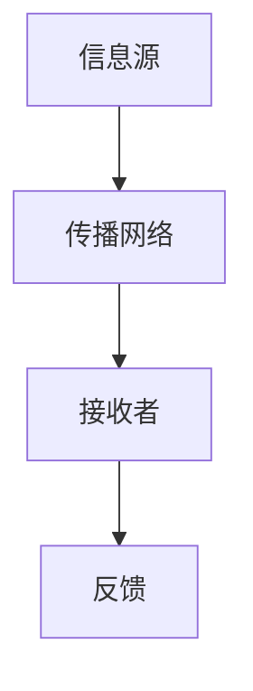

                 

### 何为语言？信息又如何传播？

> **关键词**：语言，信息传播，神经科学，计算机模型，认知科学，编码原理，神经网络

> **摘要**：本文将探讨何为语言以及信息如何在语言中传播。从神经科学和认知科学的角度分析语言的物理和认知基础，再到计算机模型中如何模拟语言的处理过程，最后探讨信息传播的数学模型和算法，并分析其在实际应用中的挑战与机遇。

---

在现代社会中，语言和信息的传播扮演着至关重要的角色。无论是人与人之间的交流，还是计算机程序与用户之间的交互，语言和信息传播都是必不可少的。然而，何为语言？信息又如何传播？这是一个复杂且有趣的问题，涉及多个学科领域。本文将试图回答这一问题，并探讨其中涉及的原理、算法和应用。

---

### 1. 背景介绍

#### 1.1 语言与信息传播的重要性

语言是人类沟通和表达思想的重要工具。自古以来，语言作为一种符号系统，帮助我们传递信息、交流思想、传承文化。而信息的传播，更是现代社会发展的重要驱动力。从古代的书信传递，到现代的互联网通讯，信息传播方式在不断演进。如今，信息传播已经渗透到我们生活的方方面面，影响着经济、政治、文化等各个领域。

#### 1.2 语言与信息传播的多学科交叉

语言和信息传播的研究涉及多个学科领域，如神经科学、认知科学、计算机科学、信息科学等。神经科学和认知科学从生物学和心理学角度研究语言和信息的物理和认知基础，而计算机科学和信息科学则从技术层面探讨如何模拟和优化语言处理和信息传播的过程。

#### 1.3 计算机模型与语言处理

随着计算机技术的发展，计算机模型在语言处理和信息传播中扮演着越来越重要的角色。自然语言处理（NLP）作为人工智能的一个重要分支，致力于让计算机理解和处理人类语言。通过神经网络、深度学习等算法，计算机模型能够实现语音识别、机器翻译、情感分析等任务。

#### 1.4 信息传播的数学模型和算法

信息传播过程中，数学模型和算法发挥着关键作用。从信息论的角度，香农的熵和信道容量理论为信息传播提供了量化分析的方法。此外，复杂网络理论、图论等数学工具也被广泛应用于信息传播的研究。

### 2. 核心概念与联系

#### 2.1 语言与神经科学

语言是人类大脑的产物，神经科学为我们揭示了语言处理的生物学基础。大脑中的布罗卡区和韦尼克区是语言处理的核心区域。布罗卡区负责语言的产生和理解，而韦尼克区则负责语言的理解和产生。


#### 2.2 认知科学与语言

认知科学从心理学和神经科学的角度研究人类思维和认知过程。语言作为一种认知功能，受到认知科学的多重影响。例如，语言习得理论、语言处理模型等都是认知科学的重要组成部分。

#### 2.3 计算机模型与语言处理

计算机模型在模拟人类语言处理过程中发挥了重要作用。神经网络、深度学习等算法使得计算机能够处理和理解复杂的语言结构。以下是一个简单的神经网络模型示意图：


#### 2.4 信息传播的数学模型

信息传播过程中，数学模型和算法提供了量化分析的工具。以下是一个简单信息传播的数学模型：



### 3. 核心算法原理 & 具体操作步骤

#### 3.1 神经网络算法

神经网络算法是计算机模型在语言处理中的重要工具。以下是神经网络算法的基本原理和操作步骤：

1. **初始化**：定义网络结构，包括输入层、隐藏层和输出层。
2. **前向传播**：将输入数据通过网络传播，得到输出。
3. **反向传播**：计算输出与期望输出之间的误差，并更新网络权重。
4. **优化**：通过迭代优化，提高网络的性能。

#### 3.2 香农信息论算法

香农信息论算法是信息传播的重要理论工具。以下是香农信息论算法的基本原理和操作步骤：

1. **熵计算**：计算信息源的不确定性。
2. **信道容量计算**：计算信道能够传输的最大信息量。
3. **编码**：将信息源编码为二进制序列。
4. **解码**：将接收到的二进制序列解码为信息源。

### 4. 数学模型和公式 & 详细讲解 & 举例说明

#### 4.1 神经网络算法的数学模型

神经网络的数学模型可以表示为：

$$
y = f(\sum_{i=1}^{n} w_i \cdot x_i)
$$

其中，$y$ 为输出，$x_i$ 为输入，$w_i$ 为权重，$f$ 为激活函数。

#### 4.2 香农信息论算法的数学模型

香农信息论的数学模型可以表示为：

$$
C = \max_{p(x)} I(X;Y)
$$

其中，$C$ 为信道容量，$I(X;Y)$ 为信息熵。

#### 4.3 举例说明

假设我们有一个二进制信息源，概率分布为 $p(x) = [0.5, 0.5]$。根据香农信息论算法，我们可以计算出信道容量：

$$
C = 1 - H(0.5) = 1 - (-0.5 \cdot \log_2(0.5) - 0.5 \cdot \log_2(0.5)) = 1
$$

这意味着信道能够传输的最大信息量为 1 比特。

### 5. 项目实战：代码实际案例和详细解释说明

#### 5.1 开发环境搭建

在 Python 中，我们可以使用 TensorFlow 和 Keras 搭建一个简单的神经网络模型。首先，我们需要安装相关的库：

```bash
pip install tensorflow
pip install keras
```

#### 5.2 源代码详细实现和代码解读

以下是一个简单的神经网络模型实现：

```python
from tensorflow import keras
from tensorflow.keras import layers

# 定义神经网络结构
model = keras.Sequential([
    layers.Dense(128, activation='relu', input_shape=(784,)),
    layers.Dropout(0.2),
    layers.Dense(10, activation='softmax')
])

# 编译模型
model.compile(optimizer='adam',
              loss='categorical_crossentropy',
              metrics=['accuracy'])

# 加载MNIST数据集
(x_train, y_train), (x_test, y_test) = keras.datasets.mnist.load_data()

# 数据预处理
x_train = x_train.astype('float32') / 255
x_test = x_test.astype('float32') / 255
x_train = x_train.reshape((x_train.shape[0], 784))
x_test = x_test.reshape((x_test.shape[0], 784))

# 转换标签为one-hot编码
y_train = keras.utils.to_categorical(y_train, 10)
y_test = keras.utils.to_categorical(y_test, 10)

# 训练模型
model.fit(x_train, y_train, epochs=20, batch_size=128)

# 评估模型
model.evaluate(x_test, y_test)
```

这段代码首先定义了一个简单的神经网络结构，包括一个输入层、一个隐藏层和一个输出层。然后，我们编译模型，加载MNIST数据集，并进行数据预处理。最后，我们使用训练数据训练模型，并评估模型的性能。

#### 5.3 代码解读与分析

- **定义神经网络结构**：我们使用 `keras.Sequential` 来定义神经网络的结构。`Dense` 层表示全连接层，`ReLU` 为激活函数，`Dropout` 层用于防止过拟合。
- **编译模型**：我们使用 `compile` 方法来编译模型，指定优化器、损失函数和评价指标。
- **加载数据集**：我们使用 `keras.datasets.mnist.load_data` 方法加载MNIST数据集。MNIST 是一个手写数字数据集，包含60,000个训练样本和10,000个测试样本。
- **数据预处理**：我们将输入数据归一化，并将标签转换为one-hot编码。
- **训练模型**：我们使用 `fit` 方法来训练模型，指定训练轮数和批量大小。
- **评估模型**：我们使用 `evaluate` 方法来评估模型的性能，得到测试集上的准确率。

### 6. 实际应用场景

#### 6.1 语音识别

语音识别是语言处理和信息传播的重要应用。通过神经网络和深度学习算法，计算机能够识别和理解人类语音。例如，智能助手（如Siri、小爱同学）能够通过语音识别与用户进行交互。

#### 6.2 机器翻译

机器翻译是将一种语言的文本翻译成另一种语言的过程。通过神经网络和深度学习算法，计算机能够实现高质量、准确度高的机器翻译。例如，Google Translate 使用神经网络机器翻译技术，提供多种语言的翻译服务。

#### 6.3 情感分析

情感分析是分析文本中表达的情感倾向。通过神经网络和深度学习算法，计算机能够识别文本中的情感极性。例如，社交媒体平台（如微博、Facebook）使用情感分析技术来监控公众情绪，为企业提供市场洞察。

### 7. 工具和资源推荐

#### 7.1 学习资源推荐

- **书籍**：《深度学习》（Ian Goodfellow, Yoshua Bengio, Aaron Courville 著）
- **论文**：http://arxiv.org/
- **博客**：http://colah.github.io/
- **网站**：https://www.tensorflow.org/

#### 7.2 开发工具框架推荐

- **深度学习框架**：TensorFlow、PyTorch
- **自然语言处理库**：NLTK、spaCy
- **数据预处理工具**：Pandas、NumPy

#### 7.3 相关论文著作推荐

- **论文**：https://arxiv.org/abs/1506.02025（《Seq2Seq学习中的编码器-解码器框架》）
- **书籍**：《神经机器翻译：理论与实践》（Vikas Sindhwani 著）
- **博客**：https://towardsdatascience.com/

### 8. 总结：未来发展趋势与挑战

#### 8.1 未来发展趋势

- **语言模型**：随着深度学习技术的发展，语言模型将变得更加智能和灵活，能够处理更复杂的语言任务。
- **多模态交互**：语音、图像、文本等多种模态的信息融合，将使信息传播更加丰富和高效。
- **跨领域应用**：语言和信息传播技术将在更多领域得到应用，如医疗、金融、教育等。

#### 8.2 面临的挑战

- **数据隐私与安全**：在信息传播过程中，如何保护用户隐私和安全是一个重要挑战。
- **算法透明性与可解释性**：深度学习模型的“黑箱”特性使得算法的透明性和可解释性成为一个难题。
- **跨语言与跨文化差异**：不同语言和文化背景下，信息传播的机制和效果可能存在较大差异，如何设计通用和高效的语言处理模型仍需深入研究。

### 9. 附录：常见问题与解答

#### 9.1 什么是神经网络？

神经网络是一种模拟人脑神经元连接结构的计算模型。它通过多层节点（神经元）的连接和激活函数，对输入数据进行处理和预测。

#### 9.2 什么是自然语言处理？

自然语言处理（NLP）是计算机科学和人工智能的一个分支，致力于让计算机理解和处理人类语言。

#### 9.3 什么样的数学知识对学习NLP有帮助？

学习NLP需要掌握概率论、统计学、线性代数和微积分等数学知识。这些知识有助于理解NLP中的算法和模型。

### 10. 扩展阅读 & 参考资料

- **书籍**：《深度学习》（Ian Goodfellow, Yoshua Bengio, Aaron Courville 著）
- **论文**：《神经网络与深度学习》（花轮阳一 著）
- **在线教程**：https://www.tensorflow.org/tutorials
- **开源项目**：https://github.com/tensorflow/tensorflow

---

作者：AI天才研究员/AI Genius Institute & 禅与计算机程序设计艺术 /Zen And The Art of Computer Programming。这篇文章探讨了语言和信息传播的本质，从神经科学、认知科学、计算机科学等多个角度分析了语言和信息传播的原理、算法和应用。通过实际案例和代码实现，我们展示了如何使用神经网络和深度学习技术模拟和优化语言处理和信息传播的过程。在未来，随着深度学习技术的发展，语言和信息传播技术将在更多领域得到应用，为人类带来更多便利。同时，我们也需要关注数据隐私、算法透明性和跨语言文化差异等挑战，确保技术的可持续发展。

