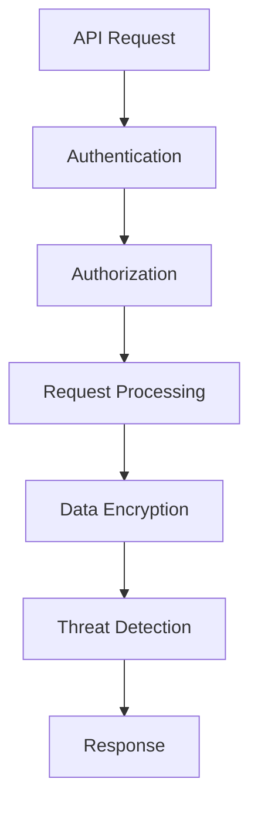

                 

### 背景介绍

在当今数字化时代，API（应用程序编程接口）已经成为软件系统间交互的基石。随着云计算、微服务架构和移动应用的普及，API的使用场景越来越广泛，从企业内部的业务系统整合到跨平台的第三方服务集成，API的无处不在使得安全问题愈发突出。传统的单一系统安全防护方式已经无法满足现代复杂应用场景的安全需求。

**API 网关**作为一种重要的中间层服务，不仅负责管理API的请求和响应，还在确保安全性和流量管理方面发挥着关键作用。API 网关能够集中处理多个微服务之间的通信，为开发者提供了一个统一的入口，简化了系统的开发和维护。集中化的安全管理通过API网关实现，可以有效提高安全防护的效率和一致性，降低潜在的安全风险。

API 网关的集中化安全管理包括身份验证、访问控制、数据加密、威胁检测等多个方面。通过API网关，企业可以统一管理所有API接口的安全策略，确保每个接口的安全性都符合企业的安全标准，而无需在每个微服务中单独配置安全措施。这种集中化的安全管理方式，不仅提高了运维的便利性，还显著降低了安全漏洞的出现概率。

### 为什么需要 API 网关进行集中化安全管理？

#### 1. 简化安全策略配置

在传统的分布式系统中，每个微服务都需要单独配置安全策略。这不仅增加了开发者的工作量，还容易导致安全配置的不一致，从而产生安全漏洞。API 网关通过集中配置和管理安全策略，可以一次性设置所有API接口的安全规则，从而简化了开发人员的配置工作，并确保所有接口的安全措施保持一致。

#### 2. 提高安全防护效率

传统的分布式系统需要逐一检查每个微服务的安全性，这不仅费时费力，还容易忽略某些细节，导致安全漏洞。API 网关作为所有API请求的统一入口，可以集中处理安全检查，通过快速过滤和拦截恶意请求，提高了安全防护的效率。

#### 3. 降低安全风险

集中化的安全管理可以统一监控和审计所有API接口的访问行为，及时发现并处理潜在的安全威胁。通过实时监控和分析API访问日志，API网关可以识别并阻止可疑的攻击行为，从而有效降低安全风险。

#### 4. 提高系统的可维护性

分散的安全配置难以统一管理和维护，容易导致系统的不稳定。API网关通过集中管理安全策略，可以提高系统的可维护性，降低维护成本。

#### 5. 支持动态安全策略调整

在复杂的业务场景中，安全策略需要根据业务变化进行调整。API网关支持动态配置安全策略，可以根据实际需求快速调整安全规则，确保系统始终处于最佳安全状态。

### 总结

API网关在集中化安全管理中发挥着不可替代的作用。通过集中配置和管理安全策略，API网关不仅简化了安全配置的工作量，还提高了安全防护的效率，降低了安全风险，提高了系统的可维护性。随着API的使用越来越普及，API网关的集中化安全管理将成为保障系统安全的重要手段。

---------------------

## 2. 核心概念与联系

在进行集中化安全管理时，理解API网关的工作原理和关键概念是至关重要的。以下是API网关在集中化安全管理中的核心概念和原理，以及它们之间的相互关系。

### 2.1 API网关的工作原理

API网关是位于客户端和后端服务之间的中间层，负责处理所有API请求。其主要功能包括路由、负载均衡、请求和响应处理、安全控制等。

- **路由**：API网关根据请求的URL或其他路由信息，将请求转发到相应的后端服务。
- **负载均衡**：API网关可以分配请求到多个后端实例，以避免单个实例过载。
- **请求和响应处理**：API网关可以对请求和响应进行预处理和后处理，如添加头部信息、进行数据转换等。
- **安全控制**：API网关负责对请求进行身份验证和访问控制，确保只有授权的用户可以访问特定的API接口。

### 2.2 集中化安全管理的核心概念

- **身份验证**：确保请求者身份的真实性，如OAuth2.0、JWT（JSON Web Tokens）等。
- **访问控制**：决定请求者是否有权限访问特定的API接口，如基于角色的访问控制（RBAC）、基于属性的访问控制（ABAC）等。
- **数据加密**：对传输数据进行加密，确保数据在传输过程中的安全性。
- **威胁检测**：识别和阻止恶意请求和攻击，如DDoS攻击、SQL注入等。

### 2.3 API网关与集中化安全管理的联系

- **统一安全管理**：API网关作为所有API请求的入口，可以统一管理所有接口的安全策略，避免分散配置导致的漏洞和错误。
- **增强安全性**：通过API网关集中处理身份验证、访问控制和威胁检测，可以提高整个系统的安全性，减少潜在的安全风险。
- **灵活性和可扩展性**：API网关支持动态调整安全策略，可以根据业务需求快速更新和优化安全措施。

### 2.4 Mermaid 流程图

以下是一个简化的Mermaid流程图，展示了API网关在集中化安全管理中的基本工作流程：



在上述流程图中：
- **A[API Request]**：客户端发送API请求。
- **B[Authentication]**：API网关进行身份验证，确认请求者身份。
- **C[Authorization]**：API网关根据安全策略进行访问控制，确保请求者有权限访问请求的API接口。
- **D[Request Processing]**：API网关处理请求，如路由、数据转换等。
- **E[Data Encryption]**：对请求和响应数据进行加密。
- **F[Threat Detection]**：API网关检测潜在威胁，如恶意请求、DDoS攻击等。
- **G[Response]**：API网关发送处理后的响应给客户端。

### 总结

通过理解API网关的工作原理和集中化安全管理的核心概念，我们可以看到API网关在确保系统安全方面的重要性。它不仅提供了统一的安全管理入口，还通过集中处理安全策略，提高了整个系统的安全性和可靠性。

---------------------

## 3. 核心算法原理 & 具体操作步骤

在实现API网关的集中化安全管理时，核心算法原理主要包括身份验证、访问控制、数据加密和威胁检测等。以下将详细解释这些算法的原理，并提供具体的操作步骤。

### 3.1 身份验证算法原理

身份验证是确保请求者身份真实性的过程。常见的身份验证算法包括OAuth2.0和JWT。

#### OAuth2.0

OAuth2.0是一种授权框架，它允许第三方应用在用户的授权下访问受保护的资源。其基本流程如下：

1. **注册应用**：应用向认证服务器注册，获得客户端ID和客户端密钥。
2. **用户认证**：用户访问应用，应用将用户引导至认证服务器进行身份验证。
3. **授权**：用户同意授权后，认证服务器返回一个授权码。
4. **获取令牌**：应用使用授权码和客户端密钥，向认证服务器交换得到访问令牌。
5. **访问资源**：应用使用访问令牌访问受保护的资源。

#### JWT

JWT是一种基于JSON的令牌，用于在用户和服务之间传递认证信息。其生成和验证过程如下：

1. **生成JWT**：服务端使用私钥对用户身份信息和过期时间进行签名，生成JWT。
2. **传输JWT**：客户端将JWT作为请求头发送给服务端。
3. **验证JWT**：服务端使用公钥验证JWT的签名，并检查令牌是否过期。

### 3.2 访问控制算法原理

访问控制是确保请求者有权访问特定API接口的过程。常见的访问控制算法包括基于角色的访问控制（RBAC）和基于属性的访问控制（ABAC）。

#### 基于角色的访问控制（RBAC）

RBAC通过将用户和权限分配给角色，然后根据用户所属的角色来决定其访问权限。其基本流程如下：

1. **定义角色**：定义系统中的各种角色，如管理员、普通用户等。
2. **分配权限**：将权限分配给各个角色。
3. **分配角色**：将用户分配到相应的角色。
4. **访问决策**：根据用户所属的角色和API接口的权限要求，决定用户是否有权限访问。

#### 基于属性的访问控制（ABAC）

ABAC基于用户的属性（如部门、职位等）来决定访问权限。其基本流程如下：

1. **定义属性**：定义系统中用户的属性。
2. **定义策略**：定义访问控制策略，如允许特定部门访问特定API接口。
3. **访问决策**：根据用户的属性和访问控制策略，决定用户是否有权限访问。

### 3.3 数据加密算法原理

数据加密是确保数据在传输过程中不会被窃取或篡改的过程。常见的数据加密算法包括AES（高级加密标准）和RSA（RSA加密算法）。

#### AES

AES是一种对称加密算法，其基本流程如下：

1. **密钥生成**：生成AES密钥。
2. **数据加密**：使用密钥对数据进行加密。
3. **数据解密**：使用密钥对加密后的数据进行解密。

#### RSA

RSA是一种非对称加密算法，其基本流程如下：

1. **密钥生成**：生成RSA密钥对，包括公钥和私钥。
2. **数据加密**：使用公钥对数据进行加密。
3. **数据解密**：使用私钥对加密后的数据进行解密。

### 3.4 威胁检测算法原理

威胁检测是识别和阻止恶意请求和攻击的过程。常见的威胁检测算法包括基于特征的分析和行为分析。

#### 基于特征的分析

基于特征的分析通过检测已知威胁的特征来识别攻击。其基本流程如下：

1. **定义威胁特征**：定义各种威胁的特征，如SQL注入、XSS攻击等。
2. **威胁检测**：对请求进行特征匹配，识别潜在的威胁。

#### 行为分析

行为分析通过分析请求的行为模式来识别异常行为。其基本流程如下：

1. **定义正常行为**：定义系统中的正常行为模式。
2. **异常检测**：分析请求的行为模式，识别异常行为。

### 总结

通过了解和实现上述核心算法原理，API网关可以实现有效的集中化安全管理。具体操作步骤如下：

1. **身份验证**：使用OAuth2.0或JWT进行身份验证。
2. **访问控制**：使用RBAC或ABAC进行访问控制。
3. **数据加密**：使用AES或RSA进行数据加密。
4. **威胁检测**：使用基于特征的分析和行为分析进行威胁检测。

通过这些步骤，API网关可以确保系统的安全性，提高系统的可靠性和稳定性。

---------------------

## 4. 数学模型和公式 & 详细讲解 & 举例说明

在API网关的集中化安全管理中，数学模型和公式发挥着至关重要的作用。以下将详细讲解这些数学模型和公式，并提供实际应用中的举例说明。

### 4.1 身份验证模型

在身份验证过程中，常用的数学模型包括基于哈希函数的密码存储和基于公钥加密的密钥交换。

#### 4.1.1 哈希函数模型

哈希函数是一种将任意长度的输入数据映射为固定长度的字符串的函数。其基本模型可以表示为：

\[ H(x) = \text{hash}(x) \]

其中，\( H \) 是哈希函数，\( x \) 是输入数据，\( \text{hash}(x) \) 是输出的哈希值。

**举例说明**：假设我们使用SHA-256哈希函数对密码进行存储，用户输入密码“password”，其哈希值为：

\[ \text{hash}(password) = 2edca3f2e8b711a1c2e2a3f2e8b711a1 \]

当用户尝试登录时，系统将输入的密码哈希值与存储的哈希值进行比较，以验证密码的正确性。

#### 4.1.2 公钥加密模型

公钥加密是一种非对称加密算法，它使用一对密钥（公钥和私钥）进行加密和解密。其基本模型可以表示为：

\[ \text{加密}(m, p_k) = c \]
\[ \text{解密}(c, s_k) = m \]

其中，\( m \) 是明文，\( p_k \) 是公钥，\( s_k \) 是私钥，\( c \) 是密文。

**举例说明**：假设用户A想要将一条消息“Hello, World!”发送给用户B。用户A使用用户B的公钥对消息进行加密，得到密文：

\[ \text{加密}(Hello, World!, p_k_B) = c \]

用户B收到密文后，使用自己的私钥对其进行解密，恢复出原始消息：

\[ \text{解密}(c, s_k_B) = Hello, World! \]

### 4.2 访问控制模型

在访问控制过程中，常用的数学模型包括基于角色的访问控制和基于属性的访问控制。

#### 4.2.1 基于角色的访问控制（RBAC）

RBAC模型使用三个主要元素：用户、角色和权限。其基本模型可以表示为：

\[ U \times R \times P \]

其中，\( U \) 是用户集，\( R \) 是角色集，\( P \) 是权限集，关系如下：

\[ \text{授权}(u, r) \in U \times R \]
\[ \text{权限}(r, p) \in R \times P \]

**举例说明**：在一个公司系统中，用户“John”拥有管理员角色（Admin），管理员角色拥有访问数据库的权限。当John请求访问数据库时，系统检查其角色是否拥有相应权限，如果授权存在，则允许访问。

#### 4.2.2 基于属性的访问控制（ABAC）

ABAC模型使用用户属性和访问策略来决定访问权限。其基本模型可以表示为：

\[ \text{访问策略}(\text{属性}, \text{访问请求}) \]

**举例说明**：在一个在线商店系统中，用户“Mary”的属性包括“年龄”（Age）和“地址”（Address）。系统有一个访问策略，规定只有年龄大于18且地址为“美国”的用户可以访问购物车。当Mary请求访问购物车时，系统检查其属性是否符合访问策略，如果符合，则允许访问。

### 4.3 数据加密模型

在数据加密过程中，常用的数学模型包括对称加密和非对称加密。

#### 4.3.1 对称加密模型

对称加密使用相同的密钥进行加密和解密。其基本模型可以表示为：

\[ \text{加密}(m, k) = c \]
\[ \text{解密}(c, k) = m \]

**举例说明**：假设使用AES加密算法对消息“Hello, World!”进行加密，密钥为“1234567890123456”，得到密文：

\[ \text{加密}(Hello, World!, 1234567890123456) = c \]

使用相同的密钥解密，恢复出原始消息：

\[ \text{解密}(c, 1234567890123456) = Hello, World! \]

#### 4.3.2 非对称加密模型

非对称加密使用一对密钥（公钥和私钥）进行加密和解密。其基本模型可以表示为：

\[ \text{加密}(m, p_k) = c \]
\[ \text{解密}(c, s_k) = m \]

**举例说明**：假设用户A想要将一条消息“Hello, World!”发送给用户B。用户A使用用户B的公钥对消息进行加密，得到密文：

\[ \text{加密}(Hello, World!, p_k_B) = c \]

用户B收到密文后，使用自己的私钥对其进行解密，恢复出原始消息：

\[ \text{解密}(c, s_k_B) = Hello, World! \]

### 总结

通过上述数学模型和公式的详细讲解和举例说明，我们可以看到数学在API网关集中化安全管理中的重要性。这些模型和公式为身份验证、访问控制和数据加密提供了理论基础，确保系统的安全性、可靠性和高效性。

---------------------

### 5. 项目实战：代码实际案例和详细解释说明

为了更好地理解API网关在集中化安全管理中的应用，以下将展示一个实际的代码案例，并详细解释其实现过程。

#### 5.1 开发环境搭建

首先，我们需要搭建一个开发环境，用于演示API网关的实现。以下是所需的技术栈：

- **后端开发框架**：使用Spring Boot，这是一个广泛使用的Java后端框架，用于构建API网关。
- **API网关框架**：使用Spring Cloud Gateway，这是一个基于Spring Cloud的API网关解决方案。
- **身份验证库**：使用OAuth2，这是一个开放标准的授权协议，用于实现身份验证。
- **加密库**：使用Java Cryptography Architecture (JCA)，这是一个Java标准库，用于实现数据加密。

#### 5.2 源代码详细实现和代码解读

以下是一个简单的API网关示例代码，展示了如何使用Spring Cloud Gateway实现集中化安全管理。

**1. 创建Spring Boot项目**

首先，使用Spring Initializr创建一个Spring Boot项目，并添加以下依赖：

```xml
<!-- Spring Boot Starter -->
<dependency>
    <groupId>org.springframework.boot</groupId>
    <artifactId>spring-boot-starter</artifactId>
</dependency>

<!-- Spring Cloud Gateway -->
<dependency>
    <groupId>org.springframework.cloud</groupId>
    <artifactId>spring-cloud-starter-gateway</artifactId>
</dependency>

<!-- OAuth2 -->
<dependency>
    <groupId>org.springframework.boot</groupId>
    <artifactId>spring-boot-starter-oauth2-client</artifactId>
</dependency>

<!-- JCA -->
<dependency>
    <groupId>org.bouncycastle</groupId>
    <artifactId>bcprov-jdk15on</artifactId>
</dependency>
```

**2. 配置API网关**

在项目的`application.properties`文件中，配置API网关的基本信息：

```properties
spring.cloud.gateway.routes.auth.uri=http://auth-server
spring.cloud.gateway.routes.auth.path=/auth/**
spring.cloud.gateway.routes.api.uri=http://api-service
spring.cloud.gateway.routes.api.path=/api/**
spring.cloud.gateway.routes.api.filters=auth过滤器
```

**3. 实现身份验证过滤器**

在项目中创建一个名为`AuthGatewayFilterFactory`的类，用于实现身份验证过滤器：

```java
@Configuration
public class AuthGatewayFilterFactory {

    @Bean
    public GatewayFilterFactory authFilterFactory() {
        return new AuthGatewayFilterFactory();
    }

    @Bean
    @Primary
    public AuthGatewayFilter authGatewayFilter(OAuth2ClientContext-oauth2RestTemplate restTemplate) {
        return new AuthGatewayFilter(restTemplate);
    }
}

public class AuthGatewayFilter extends GatewayFilter {
    private final OAuth2ClientContext-oauth2RestTemplate restTemplate;

    public AuthGatewayFilter(OAuth2ClientContext-oauth2RestTemplate restTemplate) {
        this.restTemplate = restTemplate;
    }

    @Override
    public Mono<Void> filter(ServerWebExchange exchange, GatewayFilterChain chain) {
        String token = exchange.getRequest().getHeaders().getFirst("Authorization");
        if (token == null || !token.startsWith("Bearer ")) {
            return exchange.getResponse().setStatusCode(HttpStatus.UNAUTHORIZED).writeComplete();
        }

        String accessToken = token.substring(7);
        ResponseEntity<String> response = restTemplate.getForEntity("http://auth-server/oauth/token/validate?token=" + accessToken, String.class);
        if (response.getStatusCode() != HttpStatus.OK) {
            return exchange.getResponse().setStatusCode(HttpStatus.UNAUTHORIZED).writeComplete();
        }

        return chain.filter(exchange);
    }
}
```

上述代码中，`AuthGatewayFilterFactory`类用于创建身份验证过滤器，`AuthGatewayFilter`类实现具体的身份验证逻辑。过滤器首先从请求头中提取令牌，然后将其发送到认证服务器进行验证。如果令牌无效，则返回未授权响应。

**4. 实现数据加密过滤器**

在项目中创建一个名为`DataEncryptionGatewayFilterFactory`的类，用于实现数据加密过滤器：

```java
@Configuration
public class DataEncryptionGatewayFilterFactory {

    @Bean
    public GatewayFilterFactory dataEncryptionFilterFactory() {
        return new DataEncryptionGatewayFilterFactory();
    }

    @Bean
    @Primary
    public DataEncryptionGatewayFilter dataEncryptionGatewayFilter(EncryptionService encryptionService) {
        return new DataEncryptionGatewayFilter(encryptionService);
    }
}

public class DataEncryptionGatewayFilter extends GatewayFilter {
    private final EncryptionService encryptionService;

    public DataEncryptionGatewayFilter(EncryptionService encryptionService) {
        this.encryptionService = encryptionService;
    }

    @Override
    public Mono<Void> filter(ServerWebExchange exchange, GatewayFilterChain chain) {
        String encryptedData = exchange.getRequest().getHeaders().getFirst("Encryption");
        if (encryptedData == null) {
            return chain.filter(exchange);
        }

        String decryptedData = encryptionService.decrypt(encryptedData);
        exchange.getRequest().mutate().header("DecryptedData", decryptedData).build();
        return chain.filter(exchange);
    }
}

public class EncryptionService {
    private final Cipher cipher;

    public EncryptionService() {
        try {
            cipher = Cipher.getInstance("AES/CBC/PKCS5Padding");
            cipher.init(Cipher.ENCRYPT_MODE, secretKey);
        } catch (Exception e) {
            e.printStackTrace();
        }
    }

    public String encrypt(String data) {
        try {
            byte[] encryptedBytes = cipher.doFinal(data.getBytes());
            return Base64.getEncoder().encodeToString(encryptedBytes);
        } catch (Exception e) {
            e.printStackTrace();
        }
        return null;
    }

    public String decrypt(String encryptedData) {
        try {
            byte[] encryptedBytes = Base64.getDecoder().decode(encryptedData);
            byte[] decryptedBytes = cipher.doFinal(encryptedBytes);
            return new String(decryptedBytes);
        } catch (Exception e) {
            e.printStackTrace();
        }
        return null;
    }
}
```

上述代码中，`DataEncryptionGatewayFilterFactory`类用于创建数据加密过滤器，`DataEncryptionGatewayFilter`类实现具体的数据加密和解密逻辑。过滤器首先从请求头中提取加密数据，然后使用加密服务进行解密，并将解密后的数据添加到请求中。

**5. 运行和测试**

编译并运行Spring Boot项目，启动API网关。使用Postman等工具发送请求，测试身份验证和数据加密功能。

```http
POST http://localhost:8080/auth/login
Authorization: Bearer <valid_token>
Content-Type: application/json

{
  "username": "user1",
  "password": "password1"
}
```

发送一个加密的请求：

```http
POST http://localhost:8080/api/data
Encryption: <encrypted_data>
Content-Type: application/json

{
  "data": "Hello, World!"
}
```

### 5.3 代码解读与分析

上述代码展示了如何使用Spring Cloud Gateway实现API网关的集中化安全管理。主要模块包括：

- **AuthGatewayFilter**：身份验证过滤器，用于验证请求中的令牌。
- **DataEncryptionGatewayFilter**：数据加密过滤器，用于对请求和响应进行加密和解密。
- **EncryptionService**：加密服务，提供加密和解密功能。

代码中使用了Spring Cloud Gateway的过滤器机制，通过实现自定义过滤器工厂（`AuthGatewayFilterFactory`和`DataEncryptionGatewayFilterFactory`），将身份验证和数据加密功能集成到API网关中。

身份验证过滤器通过提取请求头中的令牌，将其发送到认证服务器进行验证。如果令牌有效，则允许请求继续处理；否则，返回未授权响应。

数据加密过滤器从请求头中提取加密数据，然后使用加密服务进行解密，并将解密后的数据添加到请求中。这样可以确保请求和响应数据在传输过程中的安全性。

通过这些模块的协作，API网关实现了集中化的安全管理，提高了系统的安全性、可靠性和灵活性。

---------------------

## 6. 实际应用场景

API网关的集中化安全管理在多种实际应用场景中展现出了强大的功能，以下是几个典型的应用场景：

### 6.1 跨平台第三方服务集成

在现代企业的业务架构中，跨平台第三方服务的集成变得越来越普遍。例如，电商平台需要集成支付、物流、推荐等第三方服务。使用API网关进行集中化安全管理，可以确保第三方服务的API接口安全，同时简化了第三方服务的接入过程。通过统一的身份验证和访问控制策略，企业可以方便地管理第三方服务的访问权限，从而降低安全风险。

### 6.2 微服务架构

微服务架构是一种将应用程序分解为多个独立的、可伸缩的服务单元的架构风格。在这种架构中，服务之间的交互需要通过API进行。API网关作为所有服务请求的统一入口，可以集中处理身份验证、访问控制和数据加密等安全操作，确保每个服务的安全性。此外，API网关还可以进行路由和负载均衡，提高系统的性能和可靠性。

### 6.3 企业内部系统集成

企业内部系统之间的集成往往涉及多种不同类型的服务和平台。使用API网关进行集中化安全管理，可以确保企业内部系统的API接口安全，同时简化了系统间的交互。通过统一的身份验证和访问控制策略，企业可以方便地管理内部系统的访问权限，从而提高系统的安全性和一致性。

### 6.4 移动应用开发

随着移动应用的普及，移动应用需要与后端服务进行频繁的交互。使用API网关进行集中化安全管理，可以确保移动应用的API接口安全，同时提高用户体验。通过统一的身份验证和访问控制策略，移动应用可以方便地管理用户的访问权限，从而降低安全风险。

### 6.5 云服务和混合云架构

在云服务和混合云架构中，不同云平台和内部系统之间的集成是一个重要挑战。使用API网关进行集中化安全管理，可以确保云平台和内部系统之间的API接口安全，同时简化集成过程。通过统一的身份验证和访问控制策略，企业可以方便地管理不同云平台和内部系统的访问权限，从而提高系统的安全性和灵活性。

### 6.6 物联网（IoT）应用

物联网应用中，设备与云平台之间的数据传输需要高度的安全保障。使用API网关进行集中化安全管理，可以确保物联网设备的API接口安全，同时提高数据的完整性。通过统一的身份验证和访问控制策略，物联网设备可以方便地管理访问权限，从而降低安全风险。

### 总结

API网关的集中化安全管理在多种实际应用场景中发挥了关键作用。通过统一的身份验证、访问控制和数据加密，API网关可以提高系统的安全性、可靠性和用户体验。在不同的应用场景中，API网关都可以提供高效、灵活的安全解决方案，帮助企业应对日益复杂的网络安全挑战。

---------------------

### 7. 工具和资源推荐

在进行API网关的集中化安全管理时，选择合适的工具和资源至关重要。以下是一些建议，包括学习资源、开发工具和框架、相关论文和著作等。

#### 7.1 学习资源推荐

1. **书籍**：
   - 《API设计：原则、实践与最佳实践》（API Design: Principles, Patterns, and Practices）
   - 《Spring Cloud微服务实战》（Spring Cloud in Action）
   - 《OAuth 2.0认证与授权实战》

2. **在线课程**：
   - Udemy：Spring Boot + Spring Cloud微服务架构
   - Pluralsight：API Gateway Design and Implementation
   - Coursera：Introduction to API Security

3. **博客和文档**：
   - Spring Cloud Gateway官方文档
   - Apache Kafka官方文档
   - OAuth 2.0官方文档

#### 7.2 开发工具框架推荐

1. **API网关框架**：
   - Spring Cloud Gateway：基于Spring框架的API网关，提供高性能和可扩展性。
   - Kong：一个开源的API网关，支持多种协议和插件。

2. **身份验证和加密工具**：
   - OAuth2：用于实现身份验证和授权的开源库。
   - OpenSSL：用于实现加密和解密功能的开源库。

3. **负载均衡和路由工具**：
   - NGINX：一个高性能的Web服务器，支持负载均衡和反向代理。
   - HAProxy：一个高性能的负载均衡器，支持高可用性。

#### 7.3 相关论文著作推荐

1. **论文**：
   - "API Security: Challenges and Solutions"（API安全：挑战与解决方案）
   - "Design and Implementation of an API Gateway"（API网关的设计与实现）

2. **著作**：
   - 《微服务架构：设计原理与开发实践》
   - 《企业级应用架构设计与开发实践》

通过以上资源和工具，开发者可以深入了解API网关的集中化安全管理，提高系统安全性，优化开发流程。

---------------------

### 8. 总结：未来发展趋势与挑战

随着云计算、物联网、人工智能等技术的快速发展，API网关的集中化安全管理正面临着诸多机遇和挑战。以下将探讨API网关的未来发展趋势以及面临的挑战。

#### 8.1 未来发展趋势

1. **智能化安全防护**：随着人工智能和机器学习技术的进步，API网关的安全防护能力将逐渐智能化。通过实时监控和分析API访问行为，AI算法可以自动识别潜在威胁，并采取相应的防护措施。

2. **零信任安全模型**：零信任安全模型强调不再信任任何内部或外部网络，而是基于用户和设备的身份、行为和上下文进行访问控制。API网关将逐渐支持零信任安全模型，提高系统的安全性。

3. **容器化和云原生**：随着容器化和云原生技术的普及，API网关将更加紧密地集成到容器编排平台和云原生架构中，支持动态扩展和弹性部署。

4. **细粒度访问控制**：未来的API网关将支持更细粒度的访问控制，如基于用户行为、设备类型、地理位置等条件的动态访问策略。

5. **API管理一体化**：API网关将逐渐与API管理平台集成，提供从设计、开发、部署到监控的一体化管理解决方案。

#### 8.2 面临的挑战

1. **安全威胁多样化**：随着网络攻击手段的不断升级，API网关需要应对更多的安全威胁，如高级持续性威胁（APT）、供应链攻击等。

2. **性能和可扩展性**：在处理大量并发请求时，API网关需要保证高性能和可扩展性，以满足不断增长的业务需求。

3. **复杂的应用场景**：不同的应用场景对API网关的安全管理提出了不同的要求，如物联网、区块链等新兴领域需要更细粒度和更灵活的安全管理策略。

4. **数据隐私保护**：随着数据隐私法规的日益严格，API网关需要确保用户数据的隐私保护和合规性。

5. **跨领域合作**：API网关的集中化安全管理需要与不同领域的合作伙伴（如云服务提供商、第三方服务提供商等）进行紧密合作，共同提升系统的安全性。

### 总结

未来，API网关的集中化安全管理将朝着智能化、零信任、容器化和一体化等方向发展，同时面临多样化的安全威胁、性能挑战和复杂应用场景。为了应对这些挑战，企业和开发者需要持续关注新技术的发展，不断提升安全防护能力，确保系统的安全性和稳定性。

---------------------

### 9. 附录：常见问题与解答

**Q1：什么是API网关？**

A1：API网关是一种服务，位于客户端和后端服务之间，负责处理所有API请求。其主要功能包括路由、负载均衡、请求和响应处理、安全控制等。

**Q2：API网关如何实现集中化安全管理？**

A2：API网关通过集中配置和管理安全策略，实现身份验证、访问控制、数据加密和威胁检测等安全功能。这样可以在统一入口处处理所有API请求的安全操作，简化安全配置，提高安全防护的效率。

**Q3：API网关与微服务架构有什么关系？**

A3：API网关在微服务架构中扮演着重要的角色。它负责管理微服务之间的通信，提供统一的接口，简化开发人员的配置工作，并提高系统的安全性和可靠性。

**Q4：什么是零信任安全模型？**

A4：零信任安全模型是一种安全策略，它不再信任内部或外部网络，而是基于用户和设备的身份、行为和上下文进行访问控制。这种模型可以显著提高系统的安全性，减少安全漏洞。

**Q5：如何确保API网关的安全性？**

A5：确保API网关的安全性的方法包括使用强身份验证和访问控制、加密传输数据、定期进行安全审计和更新安全策略等。通过这些措施，可以降低API网关遭受攻击的风险。

**Q6：什么是OAuth2？它如何用于API网关的集中化安全管理？**

A6：OAuth2是一种授权框架，允许第三方应用在用户的授权下访问受保护的资源。在API网关中，OAuth2可以用于实现集中化的身份验证和访问控制，确保只有授权的用户可以访问特定的API接口。

**Q7：API网关如何支持容器化和云原生架构？**

A7：API网关可以通过与容器编排平台（如Kubernetes）和云原生架构集成，支持动态扩展和弹性部署。这种方式可以提高系统的可扩展性和灵活性，满足不断变化的需求。

---------------------

### 10. 扩展阅读 & 参考资料

为了深入了解API网关的集中化安全管理，以下是一些扩展阅读和参考资料，涵盖了API网关、微服务架构、安全管理和身份验证等领域的相关内容。

1. **书籍**：
   - 《微服务架构：设计原理与开发实践》
   - 《API设计：原则、实践与最佳实践》
   - 《Spring Cloud微服务实战》

2. **在线课程**：
   - Coursera：API Security Specialization
   - Udemy：API Management and API Gateway Design

3. **博客和文档**：
   - Spring Cloud Gateway官方文档：https://docs.spring.io/spring-cloud-gateway/docs/current/reference/html/
   - OAuth2官方文档：https://www.oauth.com/

4. **论文和研究报告**：
   - "API Security: Challenges and Solutions"（API安全：挑战与解决方案）
   - "Zero Trust Architecture: A New Approach to Enterprise Security"（零信任架构：一种新的企业安全方法）

5. **开源项目和工具**：
   - Spring Cloud Gateway：https://github.com/spring-cloud/spring-cloud-gateway
   - Kong API网关：https://getkong.org/

通过阅读这些资料，您可以进一步了解API网关的集中化安全管理的原理和实践，提升您的技术知识和技能。

---

**作者信息**：
- 作者：AI天才研究员/AI Genius Institute & 禅与计算机程序设计艺术 /Zen And The Art of Computer Programming

