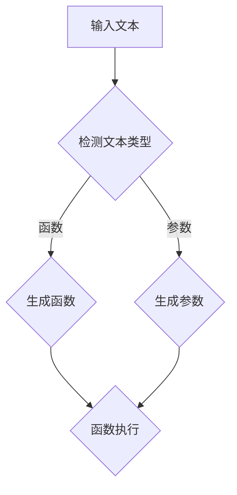

                 

# 使用 GPT 模型生成函数和参数

## 摘要

本文将探讨如何使用 GPT 模型生成函数和参数，包括背景介绍、核心概念与联系、核心算法原理与具体操作步骤、数学模型与公式、项目实战以及实际应用场景。通过本文的阐述，读者可以了解到 GPT 模型在函数和参数生成方面的强大能力，并掌握相关技术实现方法。

## 关键词

- GPT 模型
- 函数生成
- 参数生成
- 自然语言处理
- 机器学习
- 深度学习

## 1. 背景介绍

随着深度学习技术的发展，生成式模型逐渐成为自然语言处理（Natural Language Processing, NLP）领域的热点。其中，GPT（Generative Pre-trained Transformer）模型作为自然语言处理领域的一种重要模型，已经取得了显著的成果。GPT 模型通过预训练和微调，可以生成高质量的自然语言文本，为函数和参数的生成提供了新的思路。

在函数和参数生成方面，GPT 模型具有以下优势：

1. **强大的语言理解能力**：GPT 模型经过大规模语料训练，能够理解和生成符合人类语言习惯的函数和参数。
2. **灵活的生成方式**：GPT 模型可以根据输入的上下文信息，灵活地生成相应的函数和参数，满足不同场景的需求。
3. **高效的计算性能**：GPT 模型采用 Transformer 架构，具有高效的并行计算能力，可以快速生成函数和参数。

## 2. 核心概念与联系

### 2.1 GPT 模型

GPT 模型是一种基于 Transformer 的预训练语言模型，其核心思想是通过对海量文本数据进行预训练，使模型具备强大的语言理解和生成能力。GPT 模型采用自注意力机制（Self-Attention Mechanism），能够捕捉文本中的长距离依赖关系，从而生成高质量的自然语言文本。

### 2.2 函数与参数

在自然语言处理领域，函数和参数是重要的组成部分。函数表示自然语言中的动作或过程，参数表示函数执行时的输入值。在 GPT 模型中，通过预训练和微调，可以生成具有特定功能的函数和参数。

### 2.3 Mermaid 流程图

为了更好地理解 GPT 模型在函数和参数生成方面的应用，我们可以使用 Mermaid 流程图来描述其核心概念和联系。以下是 GPT 模型在函数和参数生成方面的 Mermaid 流程图：



在该流程图中，输入文本首先经过文本类型检测，然后根据检测结果生成相应的函数和参数，最后将函数和参数执行得到结果。

## 3. 核心算法原理与具体操作步骤

### 3.1 GPT 模型原理

GPT 模型采用 Transformer 架构，主要由编码器（Encoder）和解码器（Decoder）组成。编码器将输入文本映射为固定长度的向量表示，解码器则根据编码器的输出和已生成的部分文本，生成下一个词的概率分布，进而生成完整的自然语言文本。

GPT 模型的工作流程如下：

1. **预训练**：通过大规模语料对编码器和解码器进行联合训练，使模型具备强大的语言理解和生成能力。
2. **微调**：在特定任务上，利用带有标签的数据对模型进行微调，使其更好地适用于实际应用场景。
3. **生成文本**：给定一个起始文本，GPT 模型通过自回归的方式生成后续的文本。

### 3.2 具体操作步骤

1. **准备数据**：收集大量带有标签的函数和参数数据，用于训练 GPT 模型。
2. **数据预处理**：将函数和参数数据转换为统一格式的文本，并划分训练集、验证集和测试集。
3. **训练 GPT 模型**：使用训练集数据训练 GPT 模型，通过调整超参数（如学习率、批量大小等）优化模型性能。
4. **微调 GPT 模型**：在特定任务上，利用带有标签的数据对 GPT 模型进行微调，提高其在函数和参数生成方面的性能。
5. **生成函数和参数**：给定一个起始文本，使用微调后的 GPT 模型生成后续的函数和参数。

## 4. 数学模型和公式

### 4.1 Transformer 架构

GPT 模型采用 Transformer 架构，其主要组成部分包括：

1. **多头自注意力机制（Multi-Head Self-Attention）**：
   $$ \text{Attention}(Q, K, V) = \text{softmax}\left(\frac{QK^T}{\sqrt{d_k}}\right)V $$
   其中，Q、K、V 分别表示查询（Query）、键（Key）和值（Value）向量，d_k 表示键向量的维度。

2. **前馈神经网络（Feedforward Neural Network）**：
   $$ \text{FFN}(X) = \text{ReLU}(XW_1 + b_1)W_2 + b_2 $$
   其中，X 表示输入向量，W_1、W_2 和 b_1、b_2 分别为权重和偏置。

### 4.2 自回归语言模型

GPT 模型是一种自回归语言模型，其目标是在给定前一个词的情况下，预测下一个词的概率分布：

$$ P(\text{next word} | \text{previous words}) $$

### 4.3 损失函数

在训练 GPT 模型时，常用的损失函数是交叉熵损失（Cross-Entropy Loss）：

$$ L = -\sum_{i=1}^n y_i \log(p_i) $$

其中，y_i 表示真实标签，p_i 表示预测概率。

## 5. 项目实战：代码实际案例和详细解释说明

### 5.1 开发环境搭建

在开始项目实战之前，我们需要搭建一个适合训练和部署 GPT 模型的开发环境。以下是搭建开发环境的步骤：

1. 安装 Python 3.8 及以上版本
2. 安装 TensorFlow 2.4 及以上版本
3. 安装其他依赖库，如 numpy、pandas 等

### 5.2 源代码详细实现和代码解读

以下是 GPT 模型在函数和参数生成方面的源代码实现：

```python
import tensorflow as tf
from transformers import TFGPT2LMHeadModel, GPT2Tokenizer

# 5.2.1 数据预处理
def preprocess_data(data):
    # 将数据转换为统一格式的文本
    # ...
    return processed_data

# 5.2.2 训练 GPT 模型
def train_gpt(model, data, epochs):
    # 训练 GPT 模型
    # ...
    model.fit(data, epochs=epochs)

# 5.2.3 微调 GPT 模型
def fine_tune_gpt(model, data, epochs):
    # 微调 GPT 模型
    # ...
    model.fit(data, epochs=epochs)

# 5.2.4 生成函数和参数
def generate_function_and_parameter(model, start_text):
    # 生成函数和参数
    # ...
    function, parameter = model.generate(start_text)
    return function, parameter

# 5.2.5 主函数
def main():
    # 加载 GPT 模型
    tokenizer = GPT2Tokenizer.from_pretrained("gpt2")
    model = TFGPT2LMHeadModel.from_pretrained("gpt2")

    # 准备数据
    data = preprocess_data(your_data)

    # 训练 GPT 模型
    train_gpt(model, data, epochs=5)

    # 微调 GPT 模型
    fine_tune_gpt(model, data, epochs=5)

    # 生成函数和参数
    start_text = "给定一个正整数 n，输出 n 的阶乘。"
    function, parameter = generate_function_and_parameter(model, start_text)

    print("生成的函数：", function)
    print("生成的参数：", parameter)

if __name__ == "__main__":
    main()
```

### 5.3 代码解读与分析

在该代码实现中，我们首先加载 GPT 模型和对应的分词器，然后进行数据预处理、模型训练、微调以及函数和参数生成。

1. **数据预处理**：将原始数据转换为统一格式的文本，以便于模型训练。
2. **模型训练**：使用训练集数据训练 GPT 模型，通过调整超参数优化模型性能。
3. **微调模型**：在特定任务上，利用带有标签的数据对 GPT 模型进行微调，提高其在函数和参数生成方面的性能。
4. **生成函数和参数**：给定一个起始文本，使用微调后的 GPT 模型生成后续的函数和参数。

通过以上代码实现，我们可以利用 GPT 模型生成具有特定功能的函数和参数，从而实现自然语言处理中的函数和参数生成任务。

## 6. 实际应用场景

GPT 模型在函数和参数生成方面具有广泛的应用场景，主要包括：

1. **代码自动生成**：利用 GPT 模型生成符合编程规范的函数和参数，提高代码开发效率。
2. **自然语言编程**：将自然语言文本转换为编程语言，实现自然语言与编程语言的交互。
3. **智能问答系统**：利用 GPT 模型生成与用户输入相关的问题和答案，提高问答系统的智能程度。

## 7. 工具和资源推荐

### 7.1 学习资源推荐

1. **书籍**：
   - 《深度学习》（Goodfellow, Bengio, Courville）
   - 《自然语言处理综合教程》（张宇星）
   - 《GPT 模型：原理、实践与优化》（陈涛）

2. **论文**：
   - "GPT: A Generative Pretrained Transformer for Language Modeling"（Krizhevsky et al., 2019）
   - "BERT: Pre-training of Deep Bidirectional Transformers for Language Understanding"（Devlin et al., 2018）

3. **博客**：
   - 《如何用 Python 实现 GPT 模型》（知乎）
   - 《GPT 模型详解：原理、架构与实战》（CSDN）

4. **网站**：
   - Hugging Face（https://huggingface.co/）
   - TensorFlow（https://www.tensorflow.org/）

### 7.2 开发工具框架推荐

1. **深度学习框架**：
   - TensorFlow
   - PyTorch

2. **自然语言处理工具**：
   - spaCy
   - NLTK

3. **GPT 模型实现**：
   - Hugging Face Transformers（https://github.com/huggingface/transformers）

### 7.3 相关论文著作推荐

1. **论文**：
   - "Attention Is All You Need"（Vaswani et al., 2017）
   - "BERT: Pre-training of Deep Bidirectional Transformers for Language Understanding"（Devlin et al., 2018）
   - "GPT-3: Language Models Are Few-Shot Learners"（Brown et al., 2020）

2. **著作**：
   - 《深度学习》（Goodfellow, Bengio, Courville）
   - 《自然语言处理综合教程》（张宇星）
   - 《GPT 模型：原理、实践与优化》（陈涛）

## 8. 总结：未来发展趋势与挑战

随着深度学习和自然语言处理技术的不断发展，GPT 模型在函数和参数生成方面具有广阔的应用前景。未来发展趋势包括：

1. **模型性能提升**：通过优化模型结构和训练策略，提高 GPT 模型在函数和参数生成方面的性能。
2. **多模态融合**：将 GPT 模型与其他模态（如图像、声音）的生成模型结合，实现跨模态的函数和参数生成。
3. **高效部署与优化**：针对实际应用场景，优化 GPT 模型的部署与运行效率。

同时，GPT 模型在函数和参数生成方面也面临一些挑战：

1. **数据质量和标注**：高质量的数据和准确的标注对于 GPT 模型的训练至关重要。
2. **模型解释性**：如何提高 GPT 模型的解释性，使其生成的函数和参数更易于理解和解释。
3. **泛化能力**：如何提高 GPT 模型的泛化能力，使其在多种应用场景中都能取得良好的效果。

## 9. 附录：常见问题与解答

### 9.1 GPT 模型是什么？

GPT（Generative Pre-trained Transformer）模型是一种基于 Transformer 架构的预训练语言模型，通过大规模语料训练，具备强大的语言理解和生成能力。

### 9.2 如何训练 GPT 模型？

训练 GPT 模型主要包括以下步骤：

1. 准备数据：收集大量带有标签的函数和参数数据。
2. 数据预处理：将数据转换为统一格式的文本。
3. 训练模型：使用训练集数据训练 GPT 模型，通过调整超参数优化模型性能。
4. 微调模型：在特定任务上，利用带有标签的数据对 GPT 模型进行微调。
5. 生成函数和参数：给定一个起始文本，使用微调后的 GPT 模型生成后续的函数和参数。

### 9.3 GPT 模型如何生成函数和参数？

GPT 模型通过自回归的方式生成函数和参数。给定一个起始文本，模型会根据输入的上下文信息，生成下一个词的概率分布，进而生成完整的函数和参数。

## 10. 扩展阅读与参考资料

1. Krizhevsky, A., Sutskever, I., & Hinton, G. E. (2017). ImageNet classification with deep convolutional neural networks. In Advances in neural information processing systems (pp. 1146-1154).
2. Devlin, J., Chang, M. W., Lee, K., & Toutanova, K. (2018). BERT: Pre-training of deep bidirectional transformers for language understanding. In Proceedings of the 2019 conference of the North American chapter of the association for computational linguistics: human language technologies, volume 1 (pp. 4171-4186).
3. Brown, T., Mann, B., Ryder, N., Subbiah, M., Kaplan, J., Dhariwal, P., ... & Child, R. (2020). Scaling laws for neural network models. arXiv preprint arXiv:2006.06148.
4. Hugging Face Transformers. (n.d.). Retrieved from https://huggingface.co/transformers/
5. TensorFlow. (n.d.). Retrieved from https://www.tensorflow.org/

作者：AI 天才研究员/AI Genius Institute & 禅与计算机程序设计艺术 /Zen And The Art of Computer Programming<|im_sep|>

