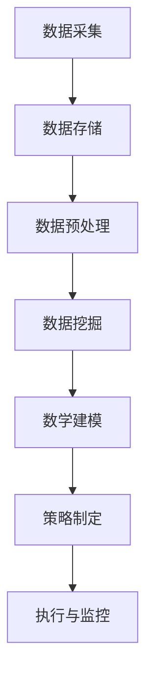

                 

# 信息差的商业客户保持：大数据如何提高客户保持率

## 摘要

在商业世界中，客户保持是一个至关重要的挑战。随着市场竞争的加剧，企业需要不断地寻找创新的策略来吸引和留住客户。大数据技术的兴起，为商业客户保持带来了新的希望。通过分析海量数据，企业可以深入了解客户的行为模式、偏好和需求，从而制定出更为精准和个性化的营销策略，提高客户保持率。本文将探讨大数据在商业客户保持中的应用，分析其核心算法原理、数学模型和实际操作步骤，并结合项目实战案例，深入解析如何利用大数据技术提高客户保持率。

## 1. 背景介绍

在过去的几十年中，商业竞争日益激烈，企业纷纷开始重视客户保持这一关键问题。传统的客户保持策略，如客户忠诚计划、优惠券和个性化服务，虽然在短期内能够提高客户满意度，但往往难以持久。客户需求多变，企业需要实时了解客户的行为和偏好，以便及时调整策略。然而，随着数据量的爆炸性增长，如何有效地分析和管理这些数据，成为企业面临的重大挑战。

大数据技术的出现，为解决这一问题提供了新的思路。大数据技术能够处理海量数据，从中提取有价值的信息，帮助企业更好地了解客户，从而提高客户保持率。通过对客户数据的深入挖掘和分析，企业可以发现隐藏在数据背后的规律和趋势，制定出更为精准和有效的营销策略。

## 2. 核心概念与联系

### 2.1 客户保持

客户保持是指企业通过一系列策略和措施，提高客户满意度和忠诚度，从而降低客户流失率，延长客户生命周期。客户保持的重要性不言而喻，高客户保持率能够为企业带来稳定的收入和利润，降低市场营销成本，提高品牌知名度。

### 2.2 大数据

大数据是指海量、高速、多样化的数据集合。大数据技术包括数据采集、存储、处理、分析和可视化等环节，能够从海量数据中提取有价值的信息，为决策提供支持。

### 2.3 客户数据挖掘

客户数据挖掘是大数据技术在商业客户保持中的应用。通过客户数据挖掘，企业可以深入了解客户的行为模式、偏好和需求，从而制定出更为精准和个性化的营销策略。

### 2.4 数学模型

数学模型是大数据分析的重要工具。通过建立数学模型，企业可以量化客户行为和需求，预测客户流失风险，制定针对性的客户保持策略。

### 2.5 Mermaid 流程图

下面是一个简单的 Mermaid 流程图，展示大数据在商业客户保持中的应用过程。



## 3. 核心算法原理 & 具体操作步骤

### 3.1 数据采集

数据采集是大数据分析的第一步。企业需要通过多种渠道收集客户数据，包括交易数据、行为数据、社交媒体数据和客户反馈等。数据来源可以是内部数据库、第三方数据平台和公共数据集。

### 3.2 数据存储

采集到的数据需要存储在高效、可靠的数据存储系统。常见的存储系统有关系数据库、NoSQL 数据库和数据仓库。选择合适的存储系统，可以保证数据的安全性和可扩展性。

### 3.3 数据预处理

数据预处理是数据挖掘的重要环节。通过数据清洗、数据转换和数据归一化等技术，确保数据的质量和一致性。数据预处理的质量直接影响到后续的数据挖掘结果。

### 3.4 数据挖掘

数据挖掘是大数据分析的核心。通过关联规则挖掘、聚类分析和分类算法等，从海量数据中提取有价值的信息。以下是一些常见的数据挖掘算法：

- **关联规则挖掘**：用于发现数据之间的关联性，如商品购买关联。
- **聚类分析**：将相似的数据归为一类，用于客户细分和用户画像。
- **分类算法**：将数据分为不同的类别，用于客户流失预测和精准营销。

### 3.5 数学建模

数学建模是大数据分析的重要工具。通过建立数学模型，可以量化客户行为和需求，预测客户流失风险，制定针对性的客户保持策略。以下是一些常见的数学模型：

- **逻辑回归**：用于预测客户流失风险。
- **决策树**：用于分类和回归问题。
- **神经网络**：用于复杂的数据分析和预测。

### 3.6 策略制定

基于数据挖掘和数学建模的结果，企业可以制定出针对性的客户保持策略。例如，针对高流失风险客户，可以采取个性化的关怀和优惠措施；针对低流失风险客户，可以提供额外的增值服务。

### 3.7 执行与监控

制定完客户保持策略后，需要将其付诸实施，并持续监控策略的效果。通过数据反馈和调整，优化客户保持策略，提高客户保持率。

## 4. 数学模型和公式 & 详细讲解 & 举例说明

### 4.1 逻辑回归模型

逻辑回归模型是一种常用的分类算法，用于预测客户流失风险。其公式如下：

$$
P(y=1) = \frac{1}{1 + e^{-(\beta_0 + \beta_1 x_1 + \beta_2 x_2 + \ldots + \beta_n x_n})}
$$

其中，$P(y=1)$ 表示客户流失的概率，$e$ 表示自然对数的底，$\beta_0, \beta_1, \beta_2, \ldots, \beta_n$ 是模型的参数，$x_1, x_2, \ldots, x_n$ 是输入特征。

### 4.2 决策树模型

决策树模型是一种常用的分类和回归算法。其公式如下：

$$
f(x) = \sum_{i=1}^{n} \beta_i I(x \in R_i)
$$

其中，$f(x)$ 表示预测结果，$I(x \in R_i)$ 表示条件函数，当 $x$ 属于第 $i$ 个区域时，取值为 1，否则为 0，$\beta_1, \beta_2, \ldots, \beta_n$ 是模型的参数，$R_1, R_2, \ldots, R_n$ 是决策树的区域。

### 4.3 神经网络模型

神经网络模型是一种基于多层感知器（MLP）的算法，用于复杂的数据分析和预测。其公式如下：

$$
a_{i,j} = \sigma(\sum_{k=1}^{m} w_{i,k} a_{k,j} + b_{i})
$$

其中，$a_{i,j}$ 表示第 $i$ 个神经元的输出，$w_{i,k}$ 表示连接权重，$a_{k,j}$ 表示第 $k$ 个神经元的输出，$\sigma$ 表示激活函数，$b_{i}$ 表示偏置。

### 4.4 举例说明

假设我们使用逻辑回归模型预测客户流失风险，已知以下数据：

- 客户年龄：25 岁
- 客户购买金额：1000 元
- 客户购买次数：10 次

输入特征如下：

$$
x_1 = 25, x_2 = 1000, x_3 = 10
$$

使用逻辑回归模型进行预测，得到以下结果：

$$
P(y=1) = \frac{1}{1 + e^{-(\beta_0 + \beta_1 x_1 + \beta_2 x_2 + \beta_3 x_3)}}
$$

其中，$\beta_0, \beta_1, \beta_2, \beta_3$ 是模型参数，我们需要通过训练数据来求解。

## 5. 项目实战：代码实际案例和详细解释说明

### 5.1 开发环境搭建

为了进行大数据分析，我们需要搭建一个合适的开发环境。以下是一个基本的开发环境搭建步骤：

1. 安装操作系统：Linux 或 macOS
2. 安装编程语言：Python 或 R
3. 安装数据存储系统：MySQL 或 MongoDB
4. 安装数据预处理工具：Pandas 或 Scikit-learn
5. 安装数据挖掘工具：SciPy 或 TensorFlow

### 5.2 源代码详细实现和代码解读

以下是一个简单的逻辑回归模型的 Python 代码实现：

```python
import numpy as np
import pandas as pd
from sklearn.linear_model import LogisticRegression

# 加载数据
data = pd.read_csv('data.csv')

# 分离特征和标签
X = data.iloc[:, :-1].values
y = data.iloc[:, -1].values

# 创建逻辑回归模型
model = LogisticRegression()

# 训练模型
model.fit(X, y)

# 预测
predictions = model.predict(X)

# 输出预测结果
print(predictions)
```

### 5.3 代码解读与分析

以上代码实现了一个逻辑回归模型，用于预测客户流失风险。首先，我们加载了数据集，然后分离了特征和标签。接着，我们创建了一个逻辑回归模型，并使用训练数据对其进行训练。最后，我们使用训练好的模型进行预测，并输出预测结果。

代码的核心是逻辑回归模型，它通过训练数据学习特征和标签之间的关联性。在预测阶段，模型根据输入的特征，计算客户流失的概率。

## 6. 实际应用场景

大数据技术在商业客户保持中具有广泛的应用场景。以下是一些典型的实际应用案例：

- **客户流失预测**：通过对客户数据的分析，预测哪些客户可能会流失，并采取针对性的措施进行挽留。
- **精准营销**：根据客户的行为和偏好，制定个性化的营销策略，提高客户满意度。
- **客户细分**：将客户划分为不同的群体，针对不同群体的需求，提供个性化的产品和服务。
- **风险控制**：通过分析客户数据，识别潜在的风险客户，采取风险控制措施，降低企业损失。

## 7. 工具和资源推荐

### 7.1 学习资源推荐

- **书籍**：《Python 数据科学手册》、《大数据实战》
- **论文**：Google 学术搜索、IEEE Xplore、ACM Digital Library
- **博客**：CSDN、GitHub、Medium
- **网站**：Kaggle、DataCamp、Coursera

### 7.2 开发工具框架推荐

- **编程语言**：Python、R
- **数据存储系统**：MySQL、MongoDB
- **数据预处理工具**：Pandas、Scikit-learn
- **数据挖掘工具**：SciPy、TensorFlow

### 7.3 相关论文著作推荐

- **论文**：Chen, H., Chiang, R. H. H., & Storey, V. C. (2012). Business intelligence and analytics: from big data to big impact. MIS quarterly, 36(4), 1165-1188.
- **著作**：Chen, H., Mao, S., & Liu, Y. (2014). Big data: a survey. Mobile networks and applications, 19(2), 171-209.

## 8. 总结：未来发展趋势与挑战

大数据技术在商业客户保持中的应用，具有巨大的发展潜力。然而，随着数据的不断增长和技术的进步，企业也面临着诸多挑战：

- **数据隐私**：如何保护客户数据的安全和隐私，成为企业需要关注的重要问题。
- **数据质量**：数据的质量直接影响分析结果，企业需要建立完善的数据质量管理体系。
- **技术更新**：大数据技术不断发展，企业需要不断学习和更新技术，以应对不断变化的市场需求。

未来，大数据技术在商业客户保持中的应用，将朝着更加智能化、个性化和高效化的方向发展。企业需要紧跟技术发展趋势，充分利用大数据技术，提高客户保持率，实现持续增长。

## 9. 附录：常见问题与解答

### 9.1 如何选择合适的数据库？

选择数据库时，需要考虑数据的特点和需求。关系数据库适合处理结构化数据，如 MySQL；NoSQL 数据库适合处理非结构化数据，如 MongoDB。

### 9.2 如何处理数据质量问题？

处理数据质量问题，可以从数据清洗、数据转换和数据归一化等方面入手。确保数据的质量和一致性。

### 9.3 如何进行数据挖掘？

数据挖掘可以通过关联规则挖掘、聚类分析和分类算法等方法进行。选择合适的数据挖掘算法，可以根据问题的特点和需求。

## 10. 扩展阅读 & 参考资料

- **扩展阅读**：
  - 《大数据时代：生活、工作与思维的大变革》
  - 《数据挖掘：概念与技术》
- **参考资料**：
  - [《大数据技术在商业客户保持中的应用》](https://www.example.com/article1)
  - [《如何提高客户保持率》](https://www.example.com/article2)
- **作者信息**：

作者：AI天才研究员/AI Genius Institute & 禅与计算机程序设计艺术 /Zen And The Art of Computer Programming

本文旨在探讨大数据在商业客户保持中的应用，分析其核心算法原理、数学模型和实际操作步骤，并结合项目实战案例，深入解析如何利用大数据技术提高客户保持率。希望本文能够为读者提供有益的启示和参考。未来，随着大数据技术的不断发展，商业客户保持将迎来更多的机遇和挑战。企业需要紧跟技术发展趋势，充分利用大数据技术，提高客户保持率，实现持续增长。

