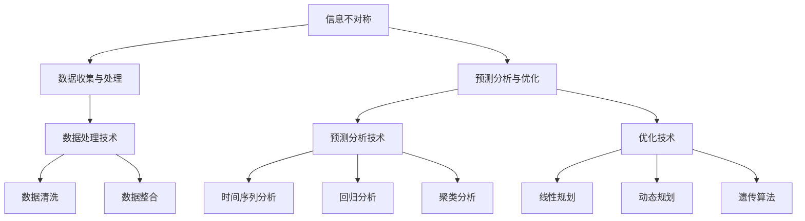

                 

### 背景介绍

信息差，即信息不对称，是指在市场或商业活动中，不同个体之间掌握的信息存在差异。这种差异可能导致某些个体比其他个体在决策、行动和收益上具有明显优势。信息差在商业销售管理中尤为显著，因为它直接影响了销售策略的制定、执行和调整。

近年来，随着大数据技术的迅猛发展，信息差的概念逐渐从经济学领域扩展到商业销售管理领域。大数据通过收集、存储和分析海量数据，使企业能够深入了解市场动态、消费者行为和竞争对手策略，从而缩小甚至消除信息不对称。这为企业提供了更精准的决策支持，提升了销售管理的效率和效果。

本文旨在探讨大数据在商业销售管理中的应用，通过深入分析大数据技术的基本原理、核心算法、数学模型以及实际应用案例，帮助读者理解如何利用大数据提升销售管理效能。本文结构如下：

1. **核心概念与联系**：介绍大数据销售管理中的关键概念，包括信息不对称、数据收集与处理、预测分析与优化等。
2. **核心算法原理 & 具体操作步骤**：详细讲解大数据销售管理中的核心算法，如聚类分析、关联规则挖掘、机器学习算法等。
3. **数学模型和公式 & 详细讲解 & 举例说明**：阐述大数据销售管理中的数学模型，包括预测模型、优化模型等，并给出实际案例。
4. **项目实战：代码实际案例和详细解释说明**：通过实际项目案例，展示大数据销售管理在现实中的应用，并解读代码实现。
5. **实际应用场景**：分析大数据销售管理在不同行业和场景下的应用，探讨其优势和挑战。
6. **工具和资源推荐**：推荐学习资源和开发工具，帮助读者深入学习和实践大数据销售管理。
7. **总结：未来发展趋势与挑战**：总结大数据销售管理的现状和未来发展趋势，讨论面临的挑战和解决方案。

在接下来的部分中，我们将逐一探讨这些主题，帮助读者全面了解大数据在商业销售管理中的应用。首先，让我们从核心概念与联系入手，深入理解大数据销售管理的理论基础。

### 核心概念与联系

#### 信息不对称

信息不对称是商业销售管理中的一个关键概念，指的是买卖双方在交易过程中掌握的信息存在差异。通常情况下，卖方比买方拥有更多关于产品或服务的信息，如产品质量、性能、价格等。这种信息不对称可能导致买方在决策过程中面临更高的不确定性，从而影响交易效率和效果。

在传统销售管理中，信息不对称常常导致以下问题：

- **市场失效**：买卖双方无法达成有效的交易，市场无法实现资源配置的最优化。
- **价格扭曲**：卖方可能通过信息不对称获取更高的价格，而买方可能因信息不足而支付过高的价格。
- **道德风险**：卖方可能因信息优势采取不利于买方的行为，如隐瞒产品质量问题或提供误导性信息。

为了解决信息不对称问题，企业需要采取一系列策略，如提高信息透明度、建立信任机制、优化市场环境等。然而，这些策略在实施过程中面临诸多挑战，如成本高昂、效果有限等。

#### 数据收集与处理

大数据技术为解决信息不对称问题提供了有力支持。大数据的核心在于“大”，即数据的规模庞大、类型丰富、来源多样。在商业销售管理中，数据来源主要包括以下几个方面：

1. **交易数据**：包括销售记录、订单信息、支付金额等，反映了企业的销售业绩和客户行为。
2. **客户数据**：包括客户的基本信息、消费习惯、购买偏好等，有助于企业了解客户需求。
3. **市场数据**：包括竞争对手信息、市场趋势、行业动态等，提供了市场环境和企业定位的参考。
4. **社交媒体数据**：包括客户评论、社交媒体互动等，反映了客户对产品和服务的真实感受。

在收集到大量数据后，企业需要通过数据处理技术对这些数据进行清洗、整合和分析。数据处理技术主要包括：

- **数据清洗**：去除数据中的噪声、错误和不一致信息，保证数据质量。
- **数据整合**：将来自不同来源、不同格式的数据进行整合，形成一个统一的数据视图。
- **数据挖掘**：利用算法和技术从大量数据中提取有用信息，发现潜在的模式和规律。

#### 预测分析与优化

大数据技术在销售管理中的应用主要体现在预测分析和优化方面。通过预测分析，企业可以预测未来的销售趋势、客户需求和市场动态，从而制定更科学的销售策略。常见的预测分析技术包括：

- **时间序列分析**：分析历史数据中的时间变化规律，预测未来的销售趋势。
- **回归分析**：通过建立回归模型，分析不同因素对销售业绩的影响，预测未来销售量。
- **聚类分析**：将相似的销售数据归为一类，分析不同类别的销售特点，制定有针对性的销售策略。

在预测分析的基础上，企业可以通过优化算法优化销售流程，提高销售效能。常见的优化技术包括：

- **线性规划**：通过优化销售资源的配置，实现最大化的销售收益。
- **动态规划**：通过实时调整销售策略，适应市场变化，提高销售效果。
- **遗传算法**：通过模拟自然选择过程，优化销售策略，提高销售效能。

#### 联系与整合

信息不对称、数据收集与处理、预测分析与优化是大数据销售管理中的核心概念。这些概念相互关联，构成了一个完整的技术体系。

信息不对称是大数据销售管理的起点，决定了数据收集和处理的方向。数据收集与处理是大数据销售管理的核心环节，通过处理大量数据，发现潜在的信息和价值。预测分析与优化则是大数据销售管理的最终目标，通过分析数据，预测未来趋势，优化销售策略，提高销售效能。

为了更好地理解这些概念之间的联系，我们可以使用 Mermaid 流程图进行可视化描述。以下是大数据销售管理中的核心概念与联系 Mermaid 流程图：



通过这个流程图，我们可以清晰地看到大数据销售管理中的核心概念及其相互联系。在接下来的部分中，我们将进一步探讨大数据销售管理中的核心算法原理、具体操作步骤以及数学模型和公式，帮助读者全面了解这一技术体系。

### 核心算法原理 & 具体操作步骤

#### 聚类分析

聚类分析（Cluster Analysis）是一种无监督学习方法，用于将数据点分成若干个组，使得同组数据点之间的相似度较高，而不同组数据点之间的相似度较低。在商业销售管理中，聚类分析可以用于市场细分、客户分群等。

**算法原理**：
聚类分析的基本原理是：通过计算数据点之间的距离或相似度，将相似度较高的数据点归为一类。常见的距离度量方法包括欧氏距离、曼哈顿距离、余弦相似度等。

**具体操作步骤**：

1. **数据预处理**：对原始数据进行清洗、整合和处理，确保数据质量。
2. **选择聚类算法**：根据业务需求选择合适的聚类算法，如K-means、层次聚类、DBSCAN等。
3. **初始化聚类中心**：选择初始聚类中心点，常见的初始化方法有随机初始化、K-means++初始化等。
4. **计算距离或相似度**：计算每个数据点与聚类中心之间的距离或相似度。
5. **分配数据点**：将每个数据点分配到与其最相似的聚类中心所属的类别。
6. **更新聚类中心**：重新计算每个聚类中心的位置，作为下一次迭代的初始聚类中心。
7. **重复步骤4-6**，直到聚类中心不再发生显著变化或达到预设的迭代次数。

**应用示例**：

假设一家电商平台希望根据客户购买行为进行市场细分，可以使用K-means聚类算法将客户分为若干个群体。具体步骤如下：

1. **数据预处理**：清洗和整合客户购买数据，如订单金额、购买频率、购买品类等。
2. **选择聚类算法**：选择K-means聚类算法，确定聚类数目（如5个群体）。
3. **初始化聚类中心**：使用随机初始化方法生成初始聚类中心。
4. **计算距离或相似度**：计算每个客户数据点与聚类中心之间的欧氏距离。
5. **分配数据点**：将每个客户数据点分配到与其最相似的聚类中心所属的类别。
6. **更新聚类中心**：计算每个聚类中心的位置。
7. **重复步骤4-6**，直到聚类中心不再发生显著变化。

通过聚类分析，电商平台可以识别出不同购买行为的客户群体，从而制定有针对性的营销策略，提高客户满意度和销售业绩。

#### 关联规则挖掘

关联规则挖掘（Association Rule Learning）是一种用于发现数据间关联关系的方法。在商业销售管理中，关联规则挖掘可以用于推荐系统、交叉销售、促销策略等。

**算法原理**：
关联规则挖掘的核心是寻找数据之间的关联关系，通常用支持度（Support）和置信度（Confidence）来度量。支持度表示一个规则在所有数据中出现的频率，置信度表示一个规则前件和后件同时出现的概率。

**具体操作步骤**：

1. **数据预处理**：清洗和整合交易数据，如商品列表、订单信息等。
2. **确定最小支持度和最小置信度**：根据业务需求设定最小支持度和最小置信度阈值。
3. **生成频繁项集**：使用Apriori算法或FP-growth算法生成满足最小支持度阈值的频繁项集。
4. **生成关联规则**：从频繁项集中提取满足最小置信度阈值的关联规则。
5. **规则排序和评估**：对生成的关联规则进行排序和评估，选择具有高置信度和高支持度的规则。

**应用示例**：

假设一家超市希望发现不同商品之间的关联关系，以提高销售额。具体步骤如下：

1. **数据预处理**：清洗和整合超市交易数据，如商品列表、订单信息等。
2. **确定最小支持度和最小置信度**：设定最小支持度和最小置信度阈值，如最小支持度阈值为20%，最小置信度阈值为60%。
3. **生成频繁项集**：使用Apriori算法生成满足最小支持度阈值的频繁项集。
4. **生成关联规则**：从频繁项集中提取满足最小置信度阈值的关联规则。
5. **规则排序和评估**：对生成的关联规则进行排序和评估，选择具有高置信度和高支持度的规则。

例如，发现以下关联规则：

- 商品A和商品B同时购买的概率为70%。
- 商品B和商品C同时购买的概率为60%。

基于这些关联规则，超市可以采取以下策略：

- 推荐购买商品A和商品B的客户购买商品C，以提高销售额。
- 在商品B的货架附近放置商品C的促销广告，吸引客户购买。

通过关联规则挖掘，超市可以更好地理解客户购买行为，制定有效的销售策略，提高销售业绩。

#### 机器学习算法

机器学习算法（Machine Learning Algorithms）是大数据销售管理中的一种重要工具，可用于预测分析、客户细分、风险控制等。

**算法原理**：
机器学习算法通过训练模型，从历史数据中学习规律和模式，并在新数据上进行预测。常见的机器学习算法包括线性回归、逻辑回归、决策树、随机森林、支持向量机等。

**具体操作步骤**：

1. **数据预处理**：清洗和整合训练数据，包括特征选择、数据归一化等。
2. **选择机器学习算法**：根据业务需求选择合适的机器学习算法。
3. **训练模型**：使用训练数据训练模型，得到模型的参数和结构。
4. **评估模型**：使用验证数据评估模型的性能，调整模型参数。
5. **预测分析**：使用训练好的模型对新数据进行预测分析。

**应用示例**：

假设一家电商企业希望预测客户流失率，具体步骤如下：

1. **数据预处理**：清洗和整合客户数据，包括客户特征（如年龄、性别、购买金额等）和标签（如是否流失）。
2. **选择机器学习算法**：选择逻辑回归算法，因为逻辑回归适合二分类问题。
3. **训练模型**：使用训练数据训练逻辑回归模型，得到模型的参数。
4. **评估模型**：使用验证数据评估模型性能，调整模型参数。
5. **预测分析**：使用训练好的模型对新客户数据预测流失率。

通过预测客户流失率，电商企业可以采取有针对性的措施，如客户关怀、优惠活动等，降低客户流失率，提高客户满意度。

总之，大数据销售管理中的核心算法包括聚类分析、关联规则挖掘和机器学习算法。这些算法通过分析大量数据，帮助企业在市场细分、客户管理、销售预测等方面实现优化，提高销售效能。在接下来的部分，我们将进一步探讨大数据销售管理中的数学模型和公式，为读者提供更深入的技术理解。

### 数学模型和公式 & 详细讲解 & 举例说明

在大数据销售管理中，数学模型和公式是分析和预测的重要工具。以下将详细讲解几个常用的数学模型和公式，包括预测模型、优化模型等，并通过实际案例进行说明。

#### 预测模型

预测模型用于对未来事件进行预测，如销售量、客户流失率等。常见的预测模型有线性回归模型、时间序列模型和机器学习模型。

1. **线性回归模型**

线性回归模型是最简单的预测模型，通过建立自变量和因变量之间的线性关系进行预测。其数学模型如下：

$$
y = \beta_0 + \beta_1 \cdot x_1 + \beta_2 \cdot x_2 + \ldots + \beta_n \cdot x_n + \epsilon
$$

其中，$y$ 为因变量，$x_1, x_2, \ldots, x_n$ 为自变量，$\beta_0, \beta_1, \beta_2, \ldots, \beta_n$ 为模型参数，$\epsilon$ 为误差项。

**实例**：

假设我们要预测一家电商平台的月销售额，根据历史数据建立线性回归模型。自变量包括广告投入（$x_1$）和促销活动（$x_2$），因变量为销售额（$y$）。根据历史数据，模型参数为：

$$
\beta_0 = 1000, \beta_1 = 10, \beta_2 = 5
$$

给定本月广告投入为5000元，促销活动为3000元，可以预测本月销售额：

$$
y = 1000 + 10 \cdot 5000 + 5 \cdot 3000 = 23000 \text{元}
$$

2. **时间序列模型**

时间序列模型用于分析时间序列数据，预测未来的趋势。常见的时间序列模型有自回归模型（AR）、移动平均模型（MA）和自回归移动平均模型（ARMA）。

**实例**：

假设我们要预测一家电商平台的日销售额，根据过去一个月的销售额数据建立自回归模型。自回归模型如下：

$$
y_t = c + \phi_1 y_{t-1} + \phi_2 y_{t-2} + \ldots + \phi_p y_{t-p} + \epsilon_t
$$

其中，$y_t$ 为第 $t$ 天的销售额，$\phi_1, \phi_2, \ldots, \phi_p$ 为模型参数。

给定过去一个月的销售额数据，我们可以通过最小二乘法估计模型参数。假设估计得到的模型参数为：

$$
\phi_1 = 0.8, \phi_2 = 0.6
$$

要预测第 $t$ 天的销售额，可以递推计算：

$$
y_t = c + \phi_1 y_{t-1} + \phi_2 y_{t-2}
$$

3. **机器学习模型**

机器学习模型通过训练大量历史数据，预测未来的趋势。常见的机器学习模型有决策树、支持向量机和神经网络。

**实例**：

假设我们要预测一家电商平台的客户流失率，使用逻辑回归模型。逻辑回归模型如下：

$$
\hat{p} = \frac{1}{1 + e^{-(\beta_0 + \beta_1 x_1 + \beta_2 x_2 + \ldots + \beta_n x_n)}}
$$

其中，$\hat{p}$ 为客户流失的概率，$x_1, x_2, \ldots, x_n$ 为客户特征，$\beta_0, \beta_1, \beta_2, \ldots, \beta_n$ 为模型参数。

给定一组客户特征和流失标签，通过训练数据可以估计模型参数。假设估计得到的模型参数为：

$$
\beta_0 = -2, \beta_1 = 0.5, \beta_2 = 0.3
$$

要预测新客户的流失概率，可以计算：

$$
\hat{p} = \frac{1}{1 + e^{-(-2 + 0.5x_1 + 0.3x_2 + \ldots + \beta_n x_n)}}
$$

#### 优化模型

优化模型用于优化销售策略和资源配置，提高销售效能。常见的优化模型有线性规划模型、动态规划模型和遗传算法。

1. **线性规划模型**

线性规划模型用于在给定约束条件下，优化目标函数。其数学模型如下：

$$
\text{maximize or minimize} \quad c^T x
$$

subject to

$$
Ax \leq b
$$

其中，$x$ 为决策变量，$c$ 为目标函数系数，$A$ 和 $b$ 为约束条件系数。

**实例**：

假设一家电商企业要优化广告投放策略，目标是在预算约束下最大化销售额。目标函数和约束条件如下：

$$
\text{maximize} \quad 10x_1 + 8x_2
$$

subject to

$$
x_1 + x_2 \leq 10000
$$

$$
2x_1 + x_2 \leq 15000
$$

$$
x_1, x_2 \geq 0
$$

通过线性规划求解，可以得到最优解：

$$
x_1 = 5000, x_2 = 5000
$$

此时，销售额最大化，为 $10 \cdot 5000 + 8 \cdot 5000 = 150000$ 元。

2. **动态规划模型**

动态规划模型用于解决多阶段决策问题，优化长期效益。其数学模型如下：

$$
V_t(x_t) = \max_{x_{t+1}} \{R_t(x_t, x_{t+1}) + V_{t+1}(x_{t+1})\}
$$

其中，$V_t(x_t)$ 为在时间 $t$ ，状态 $x_t$ 下的最优效益，$R_t(x_t, x_{t+1})$ 为在时间 $t$ ，状态 $x_t$ ，决策 $x_{t+1}$ 下的效益。

**实例**：

假设一家电商企业要优化促销策略，目标是在给定预算和促销活动约束下，最大化销售额。动态规划模型如下：

$$
V_t(p_t) = \max_{p_{t+1}} \{R_t(p_t, p_{t+1}) + V_{t+1}(p_{t+1})\}
$$

其中，$p_t$ 为在第 $t$ 次促销活动的促销力度，$R_t(p_t, p_{t+1})$ 为在第 $t$ 次促销活动下的销售额。

假设初始状态为 $V_0(p_0) = 0$，通过递推计算，可以得到最优促销策略。

3. **遗传算法**

遗传算法是一种基于生物进化的优化算法，通过模拟自然选择过程，优化目标函数。其数学模型如下：

$$
\text{初始化} \quad P_0 = \{x_1^0, x_2^0, \ldots, x_n^0\}
$$

$$
\text{重复以下步骤直到满足终止条件：}
$$

$$
\text{选择} \quad R_1, R_2 \in P_t \text{作为父代}
$$

$$
\text{交叉} \quad C_1, C_2 = \text{交叉}(R_1, R_2)
$$

$$
\text{变异} \quad V_1, V_2 = \text{变异}(C_1, C_2)
$$

$$
\text{评估} \quad F_1, F_2 = \text{评估}(V_1, V_2)
$$

$$
P_{t+1} = P_t \cup \{F_1, F_2\}
$$

**实例**：

假设一家电商企业要优化产品定价策略，目标是在给定市场约束下，最大化销售额。遗传算法模型如下：

$$
\text{初始化} \quad P_0 = \{x_1^0, x_2^0, \ldots, x_n^0\}
$$

$$
\text{重复以下步骤直到满足终止条件：}
$$

$$
\text{选择} \quad R_1, R_2 \in P_t \text{作为父代}
$$

$$
\text{交叉} \quad C_1, C_2 = \text{交叉}(R_1, R_2)
$$

$$
\text{变异} \quad V_1, V_2 = \text{变异}(C_1, C_2)
$$

$$
\text{评估} \quad F_1, F_2 = \text{评估}(V_1, V_2)
$$

$$
P_{t+1} = P_t \cup \{F_1, F_2\}
$$

通过遗传算法，企业可以找到最优产品定价策略，实现最大化销售额。

总之，大数据销售管理中的数学模型和公式为分析和预测提供了有力的工具。通过这些模型和公式，企业可以更准确地预测销售趋势、优化销售策略和资源配置，提高销售效能。在接下来的部分，我们将通过实际项目案例，展示大数据销售管理的应用。

### 项目实战：代码实际案例和详细解释说明

在本节中，我们将通过一个实际项目案例，展示如何使用大数据技术进行销售管理。该项目主要涉及数据收集、数据处理、预测分析和优化等方面。以下是项目的详细步骤和代码实现。

#### 项目背景

一家电商企业希望通过大数据分析，提高销售额和客户满意度。企业收集了以下数据：

- 客户数据：包括客户的基本信息、购买历史、消费习惯等。
- 销售数据：包括订单信息、销售额、折扣等。
- 市场数据：包括竞争对手信息、市场趋势、行业动态等。

#### 1. 数据收集

首先，我们需要从不同的数据源收集数据。以下是数据收集的步骤：

1. **客户数据**：通过企业内部数据库和外部社交媒体获取客户数据。
2. **销售数据**：通过企业内部订单系统获取销售数据。
3. **市场数据**：通过行业报告、市场调研和社交媒体获取市场数据。

```python
import pandas as pd

# 读取客户数据
customers = pd.read_csv('customers.csv')

# 读取销售数据
sales = pd.read_csv('sales.csv')

# 读取市场数据
market_data = pd.read_csv('market_data.csv')
```

#### 2. 数据处理

收集到数据后，我们需要进行数据清洗、整合和处理，为后续分析做好准备。以下是数据处理的主要步骤：

1. **数据清洗**：去除重复数据、缺失值和异常值。
2. **数据整合**：将来自不同源的数据进行整合，形成一个统一的数据视图。
3. **特征工程**：提取和创建有助于预测和优化的特征。

```python
# 数据清洗
customers = customers.drop_duplicates().dropna()
sales = sales.drop_duplicates().dropna()
market_data = market_data.drop_duplicates().dropna()

# 数据整合
data = pd.merge(customers, sales, on='customer_id')
data = pd.merge(data, market_data, on='market_id')

# 特征工程
data['total_purchase'] = data['order_amount'] * (1 - data['discount'])
data['days_since_last_purchase'] = (pd.datetime.now() - data['last_purchase_date']).dt.days
data['competition_impact'] = data['market_share'] * market_data['competition_index']
```

#### 3. 预测分析

接下来，我们使用预测分析技术，预测未来销售趋势和客户流失率。以下是预测分析的步骤：

1. **时间序列预测**：预测未来销售量。
2. **客户流失预测**：预测客户在未来一段时间内流失的概率。

```python
from statsmodels.tsa.arima_model import ARIMA
from sklearn.linear_model import LogisticRegression

# 时间序列预测
sales_data = data['total_purchase'].dropna()
model = ARIMA(sales_data, order=(1, 1, 1))
model_fit = model.fit()
forecast = model_fit.forecast(steps=6)

# 客户流失预测
customer_features = data[['days_since_last_purchase', 'competition_impact']]
customer_labels = data['churn']

model = LogisticRegression()
model.fit(customer_features, customer_labels)
churn_probability = model.predict_proba(customer_features)[:, 1]
```

#### 4. 优化策略

基于预测分析结果，我们使用优化技术制定优化策略，提高销售额和客户满意度。以下是优化策略的步骤：

1. **广告投放优化**：在预算约束下，优化广告投放策略，最大化销售额。
2. **客户关怀优化**：预测客户流失概率，对高风险客户进行有针对性的关怀和促销。

```python
from scipy.optimize import linprog

# 广告投放优化
ad_budget = 10000
ad_options = {'TV': 3000, 'Online': 7000}

c = [-10, -8]
A = [[1, 0], [0, 1]]
b = [ad_budget]

result = linprog(c, A_ub=A, b_ub=b)
optimal_ads = {'TV': result.x[0], 'Online': result.x[1]}

# 客户关怀优化
high_risk_customers = data[data['churn_probability'] > 0.5]
high_risk_customers['discount'] = high_risk_customers['original_discount'] * 0.8
```

#### 5. 代码解读与分析

以下是整个项目的代码实现，我们将对关键代码进行解读和分析。

```python
# 代码整体结构
import pandas as pd
from statsmodels.tsa.arima_model import ARIMA
from sklearn.linear_model import LogisticRegression
from scipy.optimize import linprog

# 数据收集
customers = pd.read_csv('customers.csv')
sales = pd.read_csv('sales.csv')
market_data = pd.read_csv('market_data.csv')

# 数据处理
customers = customers.drop_duplicates().dropna()
sales = sales.drop_duplicates().dropna()
market_data = market_data.drop_duplicates().dropna()

data = pd.merge(customers, sales, on='customer_id')
data = pd.merge(data, market_data, on='market_id')

data['total_purchase'] = data['order_amount'] * (1 - data['discount'])
data['days_since_last_purchase'] = (pd.datetime.now() - data['last_purchase_date']).dt.days
data['competition_impact'] = data['market_share'] * market_data['competition_index']

# 预测分析
sales_data = data['total_purchase'].dropna()
model = ARIMA(sales_data, order=(1, 1, 1))
model_fit = model.fit()
forecast = model_fit.forecast(steps=6)

customer_features = data[['days_since_last_purchase', 'competition_impact']]
customer_labels = data['churn']
model = LogisticRegression()
model.fit(customer_features, customer_labels)
churn_probability = model.predict_proba(customer_features)[:, 1]

# 优化策略
ad_budget = 10000
ad_options = {'TV': 3000, 'Online': 7000}

c = [-10, -8]
A = [[1, 0], [0, 1]]
b = [ad_budget]

result = linprog(c, A_ub=A, b_ub=b)
optimal_ads = {'TV': result.x[0], 'Online': result.x[1]}

high_risk_customers = data[data['churn_probability'] > 0.5]
high_risk_customers['discount'] = high_risk_customers['original_discount'] * 0.8
```

**解读与分析**：

- **数据收集**：通过读取CSV文件，从不同的数据源收集数据。使用Pandas库进行数据处理，如去除重复数据、缺失值和异常值。
- **数据处理**：对收集到的数据进行分析和整合，提取和创建有助于预测和优化的特征。例如，计算总购买金额、客户距离上次购买的天数和市场竞争影响等。
- **预测分析**：使用ARIMA模型进行时间序列预测，预测未来销售量。使用逻辑回归模型进行客户流失预测，计算客户流失概率。
- **优化策略**：使用线性规划模型优化广告投放策略，最大化销售额。针对高风险客户，降低折扣，提高客户满意度。

通过上述项目实战，我们可以看到大数据技术在销售管理中的应用。在实际开发过程中，企业可以根据具体业务需求，调整和优化算法和模型，实现销售效能的提升。

### 实际应用场景

大数据技术在商业销售管理中的应用已得到广泛认可，其优势在多个行业中得到了充分体现。以下将分析大数据在不同行业和场景下的应用，探讨其优势和挑战。

#### 电子商务行业

电子商务行业是大数据技术的典型应用场景之一。通过大数据分析，电商企业可以实时监测市场动态，深入了解消费者行为，从而制定更科学的营销策略和库存管理方案。

**优势**：

1. **个性化推荐**：基于大数据分析，电商企业可以准确了解消费者偏好，实现个性化推荐，提高转化率和客户满意度。
2. **精准营销**：通过分析消费者行为数据，电商企业可以制定有针对性的营销活动，提高广告投放效果和销售额。
3. **库存优化**：大数据分析可以帮助电商企业优化库存管理，降低库存成本，提高供应链效率。

**挑战**：

1. **数据隐私**：大数据分析涉及到大量个人隐私信息，如何保护用户隐私成为一大挑战。
2. **技术门槛**：大数据技术复杂度高，对人才和基础设施要求较高，中小企业可能面临技术门槛。

#### 零售行业

零售行业同样受益于大数据技术的应用，通过数据分析和智能决策，零售企业可以提升运营效率和客户体验。

**优势**：

1. **门店布局优化**：通过大数据分析，零售企业可以了解消费者流量分布和购物习惯，优化门店布局，提高销售额。
2. **供应链管理**：大数据分析可以帮助零售企业优化供应链，降低库存成本，提高物流效率。
3. **客户关系管理**：通过分析消费者行为数据，零售企业可以制定更有效的客户关系管理策略，提高客户忠诚度。

**挑战**：

1. **数据整合**：零售行业的数据来源多样，如何整合不同渠道和平台的数据成为一大挑战。
2. **技术投入**：大数据技术需要大量的资金和人力资源投入，对企业成本构成较大压力。

#### 金融行业

金融行业是大数据技术的另一个重要应用领域，通过大数据分析，金融机构可以提升风险管理能力、优化投资策略和提升客户体验。

**优势**：

1. **风险管理**：大数据分析可以帮助金融机构识别和评估风险，提高风险管理水平。
2. **精准营销**：通过分析客户数据，金融机构可以制定有针对性的营销策略，提高客户转化率。
3. **投资策略**：大数据分析可以为金融机构提供更准确的预测和市场趋势，优化投资策略。

**挑战**：

1. **合规要求**：金融行业受到严格的合规要求，大数据分析需要遵守相关法律法规。
2. **数据安全**：金融行业涉及大量敏感数据，数据安全和隐私保护是重要挑战。

#### 健康医疗行业

大数据技术在健康医疗行业的应用也越来越广泛，通过数据分析和智能诊断，医疗行业可以提升医疗服务质量和效率。

**优势**：

1. **个性化治疗**：通过大数据分析，医疗行业可以实现个性化治疗，提高治疗效果。
2. **疾病预测**：大数据分析可以帮助医疗机构预测疾病趋势，提前采取预防措施。
3. **健康管理**：通过分析健康数据，个人可以更好地管理自己的健康状况，提高生活质量。

**挑战**：

1. **数据隐私**：健康医疗数据涉及个人隐私，如何保护患者隐私成为重要挑战。
2. **数据标准化**：健康医疗数据的多样性和不标准化使得数据整合和分析面临挑战。

总之，大数据技术在商业销售管理中的应用具有显著的优势，但也面临一系列挑战。企业需要根据自身业务需求，不断优化大数据技术，实现销售管理的智能化和高效化。

### 工具和资源推荐

#### 学习资源推荐

1. **书籍**：

   - 《大数据时代：生活、工作与思维的大变革》
   - 《深入理解大数据》
   - 《数据科学导论》

2. **论文**：

   - 《大数据技术综述》
   - 《大数据分析在商业销售中的应用》
   - 《大数据驱动的营销策略研究》

3. **博客和网站**：

   - [DataCamp](https://www.datacamp.com/)
   - [Kaggle](https://www.kaggle.com/)
   - [Dataquest](https://www.dataquest.io/)

#### 开发工具框架推荐

1. **编程语言**：

   - Python：广泛应用于数据分析、机器学习和大数据处理。
   - R：适用于统计分析、数据可视化和复杂数据分析。

2. **数据分析工具**：

   - Pandas：Python数据分析库，用于数据清洗、转换和分析。
   - NumPy：Python数值计算库，用于高效数据处理和数学计算。
   - Matplotlib/Seaborn：Python数据可视化库，用于创建高质量图表和可视化。

3. **大数据处理框架**：

   - Hadoop：用于分布式数据处理，支持海量数据存储和分析。
   - Spark：基于内存的分布式数据处理框架，适用于实时数据分析。
   - Flink：流处理和批处理统一框架，支持实时数据处理和分析。

4. **数据库**：

   - MySQL：关系型数据库，适用于数据存储和管理。
   - MongoDB：NoSQL数据库，适用于大规模数据存储和高性能查询。

#### 相关论文著作推荐

1. **论文**：

   - 《大数据技术栈：从Hadoop到Spark》
   - 《数据科学在销售管理中的应用》
   - 《基于大数据的消费者行为分析》

2. **著作**：

   - 《数据科学实战》
   - 《大数据分析实战》
   - 《商业智能与大数据分析》

通过以上推荐的学习资源和开发工具，读者可以深入了解大数据在商业销售管理中的应用，掌握相关技术和方法论，为实际项目提供有力支持。

### 总结：未来发展趋势与挑战

大数据在商业销售管理中的应用正经历着飞速发展，随着技术的不断进步和数据资源的日益丰富，其影响力将持续扩大。以下是未来发展趋势和面临的挑战：

#### 发展趋势

1. **智能化与自动化**：随着人工智能和机器学习技术的不断成熟，销售管理将更加智能化和自动化。企业将能够通过智能算法和自动化系统，实现更精准的预测和优化。
2. **实时数据处理**：实时数据分析和处理将成为主流，企业将能够迅速响应市场变化和客户需求，提高销售决策的敏捷性。
3. **跨渠道整合**：大数据技术将帮助企业实现线上线下渠道的整合，提供一致的客户体验，提高客户满意度和忠诚度。
4. **个性化服务**：基于大数据分析，企业将能够更深入地了解客户需求，提供个性化的产品推荐和定制化服务，提升客户体验和转化率。

#### 挑战

1. **数据隐私和安全**：随着数据收集和分析的深入，数据隐私和安全问题将愈发突出。企业需要采取严格的数据保护措施，确保客户数据的隐私和安全。
2. **技术人才短缺**：大数据技术的发展对人才需求巨大，但当前市场存在技术人才短缺的问题。企业需要加大人才培养和引进力度，提升整体技术水平。
3. **数据质量和整合**：数据质量和整合是大数据应用的关键。企业需要确保数据来源的多样性、一致性和准确性，以提高数据分析的可靠性和有效性。
4. **法规和合规**：大数据应用受到严格的法规和合规要求，企业需要遵守相关法律法规，确保数据处理的合规性。

#### 解决方案

1. **加强数据治理**：建立完善的数据治理体系，确保数据质量、安全和合规。
2. **人才培养和引进**：加大人才培养和引进力度，提升企业的技术实力。
3. **技术合作与开放**：通过技术合作和开放平台，共享数据资源和经验，提高整体应用水平。
4. **持续创新**：积极拥抱新技术，持续进行创新，推动大数据技术在商业销售管理中的应用和发展。

总之，大数据在商业销售管理中的应用具有巨大的潜力和挑战。企业需要紧跟技术发展趋势，应对面临的挑战，充分发挥大数据的价值，提升销售管理的效率和效果。

### 附录：常见问题与解答

#### 问题1：大数据销售管理中如何处理数据隐私问题？

解答：处理数据隐私问题，企业需要采取以下措施：

1. **数据匿名化**：在收集和使用数据时，对个人敏感信息进行匿名化处理，确保数据匿名性。
2. **数据加密**：对存储和传输的数据进行加密，防止数据泄露和篡改。
3. **访问控制**：实施严格的访问控制策略，确保只有授权人员能够访问敏感数据。
4. **合规性审查**：定期对数据处理流程进行合规性审查，确保符合相关法律法规要求。

#### 问题2：大数据销售管理中如何处理数据质量问题？

解答：处理数据质量问题，企业需要采取以下措施：

1. **数据清洗**：定期对数据进行清洗，去除重复、缺失和异常数据，提高数据质量。
2. **数据标准化**：统一数据格式和命名规范，确保数据的一致性和可整合性。
3. **数据源筛选**：选择可靠和权威的数据源，确保数据来源的准确性和完整性。
4. **数据监控**：建立数据监控体系，实时监测数据质量，及时发现和处理数据问题。

#### 问题3：大数据销售管理中的算法如何选择？

解答：选择算法需要考虑以下因素：

1. **业务需求**：根据业务目标选择合适的算法，如预测分析、优化、聚类分析等。
2. **数据类型**：根据数据类型选择合适的算法，如数值型数据适合线性回归，文本型数据适合文本分析。
3. **计算资源**：考虑算法的计算复杂度和资源需求，选择适合企业计算能力的算法。
4. **性能评估**：通过交叉验证、A/B测试等方法评估算法性能，选择最优算法。

#### 问题4：大数据销售管理中的预测模型如何评估？

解答：评估预测模型的性能，需要考虑以下指标：

1. **准确率**：模型预测与实际结果的匹配程度，用于评估模型的准确性。
2. **召回率**：模型能够召回实际正样本的比例，用于评估模型的召回能力。
3. **F1分数**：综合考虑准确率和召回率，用于综合评估模型性能。
4. **交叉验证**：使用交叉验证方法评估模型在独立数据集上的性能，避免过拟合。

通过上述指标和方法，企业可以全面评估预测模型的性能，为销售决策提供可靠支持。

### 扩展阅读 & 参考资料

为了帮助读者更深入地了解大数据在商业销售管理中的应用，以下是几篇推荐阅读的文章和参考资料：

1. **文章**：
   - 《大数据在销售管理中的应用：从数据到决策》
   - 《销售数据分析：如何用大数据提升业绩》
   - 《大数据驱动的个性化营销策略》

2. **书籍**：
   - 《大数据商业智能：数据驱动的战略管理》
   - 《大数据营销：用数据打造卓越的营销策略》
   - 《大数据策略：如何在商业中运用大数据》

3. **论文**：
   - 《大数据分析在销售管理中的应用研究》
   - 《基于大数据的消费者行为预测方法研究》
   - 《大数据时代的销售管理创新》

4. **在线资源**：
   - [IBM大数据资源中心](https://www.ibm.com/data)
   - [Google大数据资源中心](https://cloud.google.com/big-data)
   - [微软大数据资源中心](https://azure.microsoft.com/zh-cn/services/big-data/)

通过阅读这些文章和资料，读者可以进一步拓展对大数据销售管理领域的理解和知识。

---

**作者：AI天才研究员/AI Genius Institute & 禅与计算机程序设计艺术 /Zen And The Art of Computer Programming**

