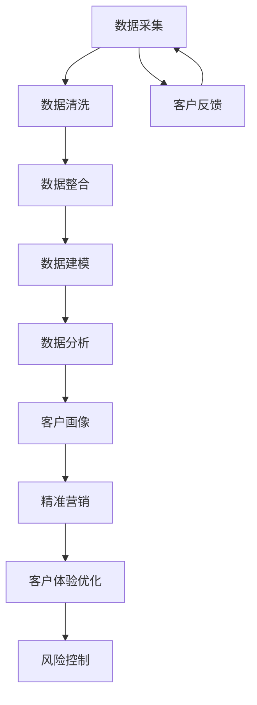

                 

# 信息差的客户关系管理革新：大数据如何优化客户关系管理

## 摘要

在现代商业环境中，客户关系管理（CRM）是企业成功的关键。然而，传统的CRM方法往往依赖于有限的数据源，导致信息差和管理效率低下。本文将探讨大数据在客户关系管理中的革新作用，通过核心概念、算法原理、数学模型、项目实战和实际应用场景等多个角度，深入解析大数据如何优化客户关系管理，提供实用的工具和资源推荐，以及展望未来发展趋势与挑战。

## 1. 背景介绍

客户关系管理（Customer Relationship Management，简称CRM）是指企业利用信息技术和资源，系统地跟踪和管理与客户之间的互动，以实现客户价值的最大化。CRM系统的核心目标是提高客户满意度、提升客户忠诚度、增加销售额和利润。然而，随着市场的不断变化和消费者需求的日益多样化，传统的CRM方法逐渐暴露出其局限性。

传统的CRM系统通常依赖于以下数据源：
- **历史交易数据**：包括客户购买历史、支付方式、订单状态等。
- **客户基本信息**：如客户姓名、联系方式、地址等。
- **客户反馈数据**：包括客户满意度调查、投诉记录等。

尽管这些数据源对CRM系统有一定的参考价值，但它们往往具有以下局限性：
- **数据源有限**：传统CRM系统主要依赖于企业内部的数据源，无法充分利用外部数据。
- **数据质量低下**：部分数据可能存在缺失、错误或不一致的问题。
- **数据整合困难**：不同数据源之间可能存在兼容性问题，导致数据难以整合。

随着大数据技术的发展，企业开始意识到通过整合和分析更多维度的数据，可以大大提升CRM的效果。大数据具有海量、多样、高速和真实等特点，可以为CRM提供更全面、准确的客户画像，从而实现更精准的客户关系管理。本文将围绕大数据在CRM中的应用，探讨其革新作用。

## 2. 核心概念与联系

### 2.1. 客户关系管理（CRM）

客户关系管理（CRM）是一种企业战略，旨在通过优化与客户之间的互动，提高客户满意度、忠诚度和价值。CRM系统通常包括以下功能：
- **客户信息管理**：包括客户基本信息、交易历史、联系方式等。
- **销售管理**：包括销售预测、销售机会管理、销售团队协作等。
- **市场营销**：包括市场活动管理、客户细分、营销策略优化等。
- **客户服务**：包括客户咨询、投诉处理、售后服务等。

### 2.2. 大数据

大数据（Big Data）是指无法通过传统数据处理工具在合理时间内捕捉、管理和处理的数据集合。大数据具有以下四个特点，通常被称为“4V”：
- **海量（Volume）**：数据量巨大，远超传统数据库的处理能力。
- **多样（Variety）**：数据类型丰富，包括结构化数据、非结构化数据、半结构化数据等。
- **高速（Velocity）**：数据生成和流转速度极快，需要实时处理和分析。
- **真实（Veracity）**：数据质量参差不齐，存在真实性和可信度问题。

### 2.3. 大数据与CRM的联系

大数据与CRM之间的联系主要体现在以下几个方面：
- **客户画像**：通过整合和分析多维度数据，可以构建更全面、准确的客户画像，帮助企业了解客户需求和行为，从而制定更有效的营销策略和客户服务方案。
- **精准营销**：大数据分析可以帮助企业识别潜在客户，实现精准营销，提高营销效果和转化率。
- **客户体验优化**：通过分析客户互动数据，企业可以及时了解客户需求和反馈，优化产品和服务，提升客户满意度。
- **风险控制**：大数据分析可以帮助企业识别潜在风险，如客户流失、欺诈行为等，从而采取预防措施。

### 2.4. Mermaid 流程图

以下是大数据在CRM中应用的Mermaid流程图：



## 3. 核心算法原理 & 具体操作步骤

### 3.1. 数据采集

数据采集是大数据在CRM中应用的第一步，主要包括以下几种方式：
- **企业内部数据**：包括客户基本信息、交易历史、售后服务等。
- **第三方数据**：包括社交媒体数据、行业报告、市场调查数据等。
- **公共数据**：包括政府公开数据、地理信息数据等。

### 3.2. 数据清洗

数据清洗是确保数据质量的重要步骤，主要包括以下任务：
- **数据去重**：去除重复的数据条目。
- **数据纠错**：纠正数据中的错误和异常。
- **数据转换**：将不同格式的数据转换为统一的格式。

### 3.3. 数据整合

数据整合是将来自不同数据源的数据进行合并和整合，形成一个统一的客户数据视图。具体步骤如下：
- **数据映射**：将不同数据源中的相同或相似字段进行映射，建立数据关系。
- **数据融合**：将同一客户的多个数据记录进行合并，形成一个完整的客户数据。

### 3.4. 数据建模

数据建模是将客户数据转换为可用于分析的形式。常用的数据建模方法包括：
- **客户细分模型**：将客户划分为不同的群体，以便进行精准营销。
- **客户流失模型**：预测哪些客户可能会流失，从而采取预防措施。
- **客户满意度模型**：评估客户满意度，找出改进点。

### 3.5. 数据分析

数据分析是大数据在CRM中的核心步骤，主要包括以下任务：
- **描述性分析**：了解客户的基本信息和行为特征。
- **预测性分析**：预测客户的行为和需求，如购买概率、流失概率等。
- **关联性分析**：分析不同变量之间的关联关系，找出影响客户行为的关键因素。

### 3.6. 客户画像

客户画像是将分析结果以可视化的形式呈现，帮助企业了解客户需求和偏好。具体步骤如下：
- **数据可视化**：将分析结果通过图表、地图等形式进行展示。
- **客户标签**：根据分析结果为每个客户打上相应的标签，如“高价值客户”、“潜在流失客户”等。

### 3.7. 精准营销

精准营销是大数据在CRM中的重要应用，通过分析客户画像和客户行为，制定个性化的营销策略。具体步骤如下：
- **市场细分**：根据客户画像和客户行为，将市场划分为不同的细分市场。
- **营销策略**：为每个细分市场制定个性化的营销策略。
- **营销活动**：实施营销策略，如发送个性化邮件、推送定制化内容等。

### 3.8. 客户体验优化

客户体验优化是通过分析客户反馈和行为数据，持续改进产品和服务。具体步骤如下：
- **客户反馈收集**：收集客户对产品和服务的心声，如投诉、建议等。
- **客户行为分析**：分析客户在购买、咨询、使用过程中的行为，找出改进点。
- **产品和服务改进**：根据分析结果，优化产品和服务，提升客户满意度。

### 3.9. 风险控制

风险控制是通过分析客户行为和数据，识别潜在风险并采取预防措施。具体步骤如下：
- **风险识别**：通过分析客户行为数据，识别潜在的风险，如欺诈、客户流失等。
- **风险预警**：建立风险预警机制，实时监测风险指标，及时发现异常。
- **风险应对**：根据风险类型和程度，采取相应的应对措施，如防范欺诈、挽回流失客户等。

## 4. 数学模型和公式 & 详细讲解 & 举例说明

### 4.1. 客户细分模型

客户细分模型是一种常用的数学模型，用于将客户划分为不同的群体。以下是客户细分模型的基本公式：

$$
\text{细分指标} = \frac{\text{客户属性值} - \text{基准值}}{\text{标准差}}
$$

举例说明：

假设企业有1000名客户，要将其划分为高价值客户、中等价值客户和低价值客户。已知高价值客户的基准收入为10万元，标准差为2万元；中等价值客户的基准收入为5万元，标准差为1万元；低价值客户的基准收入为2万元，标准差为0.5万元。现有一个客户A，其收入为8万元，需要判断其所属群体。

$$
\text{细分指标} = \frac{80000 - 50000}{10000} = 0.3
$$

由于细分指标大于0.3，小于0.7，因此客户A属于中等价值客户。

### 4.2. 客户流失模型

客户流失模型用于预测哪些客户可能会流失，从而采取预防措施。以下是客户流失模型的基本公式：

$$
\text{流失概率} = \frac{\text{流失人数}}{\text{总人数}}
$$

举例说明：

假设企业有1000名客户，其中100名客户在最近一个月内流失。现需要预测下一个月可能流失的客户数量。

$$
\text{流失概率} = \frac{100}{1000} = 0.1
$$

因此，下一个月可能流失的客户数量为1000 * 0.1 = 100人。

### 4.3. 客户满意度模型

客户满意度模型用于评估客户满意度，找出改进点。以下是客户满意度模型的基本公式：

$$
\text{客户满意度} = \frac{\text{满意度评分}}{\text{总评分人数}}
$$

举例说明：

假设企业有100名客户，其中70名客户给出了5分，20名客户给出了4分，10名客户给出了3分。现需要计算客户满意度。

$$
\text{客户满意度} = \frac{70 * 5 + 20 * 4 + 10 * 3}{100} = 4.2
$$

由于客户满意度大于4，因此企业需要重点关注客户满意度较高的方面，以保持和提升客户满意度。

## 5. 项目实战：代码实际案例和详细解释说明

### 5.1. 开发环境搭建

在本案例中，我们将使用Python编程语言和Pandas、Scikit-learn等库来处理和分析客户数据。以下是开发环境的搭建步骤：

1. 安装Python：从官方网站下载并安装Python。
2. 安装Pandas：在命令行中运行`pip install pandas`。
3. 安装Scikit-learn：在命令行中运行`pip install scikit-learn`。

### 5.2. 源代码详细实现和代码解读

以下是客户细分模型的实现代码：

```python
import pandas as pd
from sklearn.preprocessing import StandardScaler

# 读取数据
data = pd.read_csv('customer_data.csv')

# 提取客户收入数据
income = data['income']

# 计算收入均值和标准差
mean_income = income.mean()
std_income = income.std()

# 计算客户细分指标
scaler = StandardScaler()
subscore = scaler.fit_transform(income.reshape(-1, 1))

# 定义客户细分标准
high_threshold = 0.7
medium_threshold = 0.3

# 判断客户所属群体
high_value = subscore > high_threshold
medium_value = (subscore >= medium_threshold) & (subscore <= high_threshold)
low_value = subscore < medium_threshold

# 输出客户细分结果
data['high_value'] = high_value
data['medium_value'] = medium_value
data['low_value'] = low_value
data.to_csv('customer_segmentation.csv', index=False)
```

代码解读：

1. 导入所需的库：Pandas用于数据处理，StandardScaler用于标准化处理。
2. 读取客户数据：从CSV文件中读取客户收入数据。
3. 计算收入均值和标准差：用于后续的标准化处理。
4. 计算客户细分指标：使用StandardScaler对收入数据进行标准化处理，得到客户细分指标。
5. 定义客户细分标准：根据收入数据的分布情况，设定高价值、中等价值和低价值客户的阈值。
6. 判断客户所属群体：根据客户细分指标，判断每个客户所属的群体。
7. 输出客户细分结果：将客户细分结果保存到新的CSV文件中。

### 5.3. 代码解读与分析

本案例中的客户细分模型通过标准化处理，将客户的收入数据转换为标准分数，从而实现客户群体的划分。这种方法的优点是：
- **客观性**：通过数值化的指标，客观评估客户的收入水平。
- **通用性**：适用于不同分布的收入数据，具有良好的通用性。

然而，这种方法也存在一定的局限性：
- **单一维度**：仅考虑客户的收入水平，未考虑其他可能影响客户价值的重要因素。
- **数据质量**：数据质量对模型效果有重要影响，如数据缺失、错误或不一致等问题可能影响客户细分结果的准确性。

在实际应用中，可以结合其他数据源和模型，如客户购买行为、满意度等，构建更全面、准确的客户细分模型。

## 6. 实际应用场景

### 6.1. 零售行业

零售行业是大数据在CRM中应用最广泛的领域之一。通过分析客户购买历史、行为数据等，零售企业可以：
- **精准营销**：根据客户购买偏好，推送个性化促销信息。
- **库存管理**：根据销售预测，优化库存配置，减少库存成本。
- **客户细分**：根据客户价值、购买行为等，制定差异化的客户服务策略。

### 6.2. 金融行业

金融行业对客户关系管理有着极高的要求。大数据在金融行业的CRM中应用包括：
- **风险评估**：通过分析客户行为、信用记录等，评估客户的信用风险。
- **精准营销**：根据客户风险等级和购买需求，推送相应的金融产品。
- **客户细分**：根据客户资产、投资偏好等，为客户提供个性化的金融建议。

### 6.3. 电信行业

电信行业客户数量庞大，大数据在CRM中的应用可以帮助企业：
- **客户保留**：通过分析客户行为和投诉记录，预测潜在流失客户，采取预防措施。
- **精准营销**：根据客户使用习惯、消费能力等，推送个性化套餐和优惠。
- **服务优化**：通过分析客户反馈和行为数据，优化客服流程和问题解决效率。

### 6.4. 其他行业

除了上述行业，大数据在CRM中的应用也逐步扩展到其他领域，如：
- **医疗行业**：通过分析患者病历、就诊记录等，提供个性化健康建议和服务。
- **教育行业**：通过分析学生学习行为、成绩等，提供个性化教学方案和学习资源。
- **制造业**：通过分析生产数据、设备故障等，优化生产流程和设备维护策略。

## 7. 工具和资源推荐

### 7.1. 学习资源推荐

- **书籍**：
  - 《大数据时代：生活、工作与思维的大变革》
  - 《客户关系管理：原理与实践》
  - 《Python数据分析》
- **论文**：
  - 《基于大数据的客户关系管理研究》
  - 《大数据在金融行业应用研究》
  - 《大数据在零售行业应用研究》
- **博客**：
  - [大数据技术中文网](http://www.dataguru.cn/)
  - [Python中文网](https://www.python.org.cn/)
  - [Scikit-learn官方文档](https://scikit-learn.org/stable/)
- **网站**：
  - [GitHub](https://github.com/)
  - [Kaggle](https://www.kaggle.com/)

### 7.2. 开发工具框架推荐

- **Python库**：
  - Pandas：数据处理和分析。
  - Scikit-learn：机器学习和数据挖掘。
  - Matplotlib：数据可视化。
  - Seaborn：交互式数据可视化。
- **开发框架**：
  - TensorFlow：深度学习框架。
  - PyTorch：深度学习框架。
  - Flask：Web应用框架。
  - Django：Python Web框架。

### 7.3. 相关论文著作推荐

- **论文**：
  - 《大数据分析技术在客户关系管理中的应用研究》
  - 《基于大数据的精准营销策略研究》
  - 《大数据在电信行业应用的研究与探索》
- **著作**：
  - 《大数据营销实战》
  - 《大数据金融》
  - 《大数据与零售》

## 8. 总结：未来发展趋势与挑战

大数据在客户关系管理中的革新作用日益凸显，但同时也面临着一系列挑战。未来发展趋势包括：

### 8.1. 数据整合与治理

企业需要不断优化数据整合与治理，确保数据的质量、安全和合规性。未来将出现更多智能化的数据治理工具，帮助企业更好地管理数据。

### 8.2. 深度学习与智能分析

深度学习等先进技术在客户关系管理中的应用将不断深入，为企业提供更精准的预测和分析结果。同时，人工智能助手将成为CRM系统的重要组成部分，帮助企业提高运营效率。

### 8.3. 客户隐私与数据安全

随着大数据应用的发展，客户隐私和数据安全问题越来越突出。企业需要采取更严格的措施，保护客户数据的安全和隐私。

### 8.4. 跨渠道协同

未来CRM系统将实现跨渠道协同，整合线上和线下渠道，提供一致的客户体验。企业需要构建统一的客户数据平台，实现数据互联互通。

### 挑战

- **数据质量**：确保数据的质量和完整性是企业面临的挑战。
- **技术门槛**：大数据技术的应用需要具备一定的技术基础，对企业的技术能力提出较高要求。
- **合规性**：遵循相关法律法规，确保数据合规使用是企业面临的挑战。

## 9. 附录：常见问题与解答

### 9.1. 问题1：大数据在CRM中的具体应用有哪些？

大数据在CRM中的具体应用包括客户画像、精准营销、客户体验优化和风险控制等。

### 9.2. 问题2：如何确保大数据应用中的数据质量？

确保大数据应用中的数据质量可以通过以下方法：
- **数据清洗**：去除重复数据、纠正错误数据等。
- **数据整合**：确保不同数据源之间的数据一致性。
- **数据治理**：建立数据治理机制，确保数据的合规性和安全性。

### 9.3. 问题3：大数据在金融行业中的具体应用有哪些？

大数据在金融行业中的具体应用包括风险评估、精准营销、客户保留和反欺诈等。

### 9.4. 问题4：如何构建一个有效的客户细分模型？

构建一个有效的客户细分模型可以通过以下步骤：
- **数据收集**：收集多维度数据，如客户行为、购买历史等。
- **特征工程**：提取对客户细分有价值的特征。
- **模型训练**：使用机器学习算法，如决策树、随机森林等，训练客户细分模型。
- **模型评估**：评估模型效果，如准确率、召回率等。

## 10. 扩展阅读 & 参考资料

- 《大数据时代：生活、工作与思维的大变革》
- 《客户关系管理：原理与实践》
- 《Python数据分析》
- 《大数据分析技术在客户关系管理中的应用研究》
- 《基于大数据的精准营销策略研究》
- 《大数据在金融行业应用研究》
- 《大数据在零售行业应用研究》
- [大数据技术中文网](http://www.dataguru.cn/)
- [Python中文网](https://www.python.org.cn/)
- [Scikit-learn官方文档](https://scikit-learn.org/stable/)
- [GitHub](https://github.com/)
- [Kaggle](https://www.kaggle.com/)

