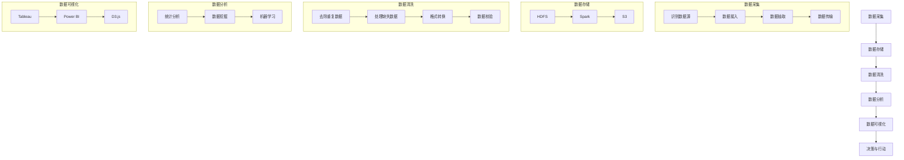

                 

### 背景介绍

在当今数字化时代，信息量的爆炸式增长和互联网的普及使得企业之间的竞争愈发激烈。传统的市场调查和竞争分析手段已经无法满足现代商业环境中对实时性和深度分析的需求。为了在这种竞争环境中占据优势，越来越多的企业开始采用大数据技术来分析竞争对手。

大数据分析不仅仅是对大量数据的简单处理，它涉及到从数据中提取有价值的信息，了解竞争对手的市场行为、用户需求以及业务模式。通过大数据技术，企业可以实现对市场趋势的预测，发现潜在的商业机会，从而制定出更加精准的营销策略和业务发展计划。

本文将围绕信息差的竞争对手分析，探讨大数据技术在分析竞争对手中的应用。我们将首先介绍大数据分析的基本概念和核心原理，然后详细探讨如何使用大数据技术来挖掘和分析竞争对手的信息。最后，我们将分享一些实际应用场景和工具资源，帮助读者更好地理解和应用这些技术。

通过对大数据技术进行深入探讨，本文旨在为企业提供一套系统的竞争对手分析方案，帮助它们在竞争激烈的市场中脱颖而出。

### 大数据分析的基本概念与核心原理

大数据分析，顾名思义，是对大规模数据集进行分析和处理的过程。它不仅仅关注数据的数量，更强调数据的质量和多样性。与传统数据分析相比，大数据分析具备以下几个核心特点：

1. **数据量（Volume）**：大数据处理的数据量巨大，通常达到TB甚至PB级别。这些数据来源于各种渠道，包括社交媒体、传感器、物联网设备、企业内部系统等。
2. **数据多样性（Variety）**：大数据不仅包括结构化数据，如关系型数据库中的数据，还涵盖了非结构化数据，如文本、图像、音频、视频等。
3. **数据速度（Velocity）**：大数据分析需要快速处理实时数据流，以便在数据产生后迅速提取有价值的信息。
4. **数据真实性（Veracity）**：大数据的真实性是其分析效果的关键。如何从海量数据中筛选出真实、可靠的信息，是大数据分析面临的一大挑战。

**核心原理**：

- **数据采集**：通过传感器、网站点击日志、社交媒体互动等多种方式收集数据。
- **数据存储**：利用分布式存储系统，如Hadoop、Spark等，存储和管理海量数据。
- **数据清洗**：对采集到的数据进行清洗和预处理，去除重复、不准确或不完整的数据。
- **数据分析**：采用数据挖掘、机器学习等算法，从数据中提取有价值的信息。
- **数据可视化**：利用可视化工具，如Tableau、Power BI等，将分析结果以图表、地图等形式呈现，便于理解和决策。

#### 数据采集

数据采集是大数据分析的第一步，也是最为关键的一步。一个完整的数据采集流程通常包括以下几个环节：

1. **数据源识别**：确定需要采集的数据类型和数据来源，例如社交媒体、用户行为数据、市场调研数据等。
2. **数据接入**：建立数据接入通道，包括API接口、数据库连接、文件传输协议等。
3. **数据抽取**：通过自动化工具或脚本，定期或实时地从数据源中抽取数据。
4. **数据传输**：利用数据传输工具，如Flume、Kafka等，将抽取的数据传输到数据仓库或数据湖。

#### 数据存储

数据存储是大数据分析的基础。随着数据量的不断增长，传统的集中式存储系统已经无法满足需求。分布式存储系统应运而生，例如：

- **Hadoop HDFS**：Hadoop分布式文件系统，适合存储海量数据，并提供高可靠性。
- **Apache Spark**：Spark是一个开源的分布式数据处理框架，提供高效的内存计算和分布式存储功能。
- **Amazon S3**：Amazon Web Services提供的简单存储服务，适合大规模数据存储和管理。

#### 数据清洗

数据清洗是确保数据质量的重要步骤。主要包括以下任务：

1. **去除重复数据**：识别和删除重复的数据记录。
2. **处理缺失数据**：填补缺失的数据或删除含有缺失数据的数据记录。
3. **格式转换**：统一数据格式，例如将日期格式从YYYY-MM-DD转换为DD-MM-YYYY。
4. **数据校验**：检查数据的一致性和准确性，例如检查电话号码是否合法。

#### 数据分析

数据分析是大数据技术的核心。常见的分析方法包括：

1. **统计分析**：使用统计方法，如描述性统计、回归分析等，了解数据的分布和关系。
2. **数据挖掘**：使用机器学习算法，如分类、聚类、关联规则挖掘等，从数据中自动发现模式。
3. **机器学习**：通过训练模型，从数据中学习并预测未来的趋势和结果。

#### 数据可视化

数据可视化是将数据分析结果以图表、地图等形式呈现的过程。数据可视化不仅有助于理解数据，还能帮助企业做出更明智的决策。常见的数据可视化工具包括：

- **Tableau**：一个功能强大的数据可视化工具，支持多种图表类型和交互功能。
- **Power BI**：Microsoft推出的商业智能工具，提供丰富的数据连接和可视化功能。
- **D3.js**：一个基于JavaScript的库，用于创建自定义的交互式数据可视化。

通过以上对大数据分析基本概念和核心原理的介绍，我们可以看到，大数据分析不仅需要技术的支持，还需要深入的思考和分析。在接下来的部分，我们将深入探讨如何使用大数据技术来挖掘和分析竞争对手的信息。

### 核心概念原理与架构的 Mermaid 流程图

为了更好地理解大数据分析的核心概念和原理，我们可以使用Mermaid流程图来展示整个分析过程。以下是一个简化的Mermaid流程图，描述了从数据采集到数据分析，再到数据可视化的全过程。



上述Mermaid流程图展示了大数据分析的主要步骤和关键环节，包括数据采集、数据存储、数据清洗、数据分析、数据可视化以及最终的决策与行动。通过这个流程图，我们可以清晰地看到每个步骤在整体分析过程中的作用和相互关系。

#### 数据采集

数据采集是大数据分析的第一步，涉及到多个子步骤：

- **识别数据源**：确定需要采集的数据类型和来源，如社交媒体、用户行为数据等。
- **数据接入**：建立与数据源的连接，通过API接口、数据库连接等方式获取数据。
- **数据抽取**：使用自动化工具或脚本定期或实时地从数据源中抽取数据。
- **数据传输**：利用数据传输工具，如Flume、Kafka等，将抽取的数据传输到数据仓库或数据湖。

#### 数据存储

数据存储是确保数据安全和高效访问的关键。在分布式存储系统中，常用的技术包括：

- **Hadoop HDFS**：适合存储海量数据，提供高可靠性。
- **Apache Spark**：提供高效的内存计算和分布式存储功能。
- **Amazon S3**：适用于大规模数据存储和管理。

#### 数据清洗

数据清洗是提升数据质量的重要步骤，包括以下任务：

- **去除重复数据**：识别和删除重复的数据记录。
- **处理缺失数据**：填补缺失的数据或删除含有缺失数据的数据记录。
- **格式转换**：统一数据格式，确保数据的一致性。
- **数据校验**：检查数据的一致性和准确性，确保数据质量。

#### 数据分析

数据分析是大数据技术的核心，通过统计、数据挖掘和机器学习等方法提取有价值的信息：

- **统计分析**：使用描述性统计、回归分析等了解数据的分布和关系。
- **数据挖掘**：自动发现数据中的模式，如分类、聚类、关联规则挖掘等。
- **机器学习**：通过训练模型，从数据中学习并预测未来的趋势和结果。

#### 数据可视化

数据可视化是将分析结果以图表、地图等形式呈现，便于理解和决策。常见的数据可视化工具包括：

- **Tableau**：提供多种图表类型和交互功能。
- **Power BI**：支持丰富的数据连接和可视化功能。
- **D3.js**：用于创建自定义的交互式数据可视化。

通过以上流程图，我们可以更直观地理解大数据分析的过程和各个步骤之间的联系。在接下来的部分，我们将深入探讨如何使用大数据技术来挖掘和分析竞争对手的信息。

### 核心算法原理 & 具体操作步骤

要利用大数据技术对竞争对手进行分析，我们首先需要了解一些核心算法，这些算法能够帮助我们从海量数据中提取有价值的信息。以下是一些常用的算法及其基本原理和具体操作步骤。

#### 1. 关联规则挖掘（Association Rule Learning）

关联规则挖掘是一种用于发现数据集中项目之间关系的方法。常见的算法包括Apriori算法和FP-Growth算法。

**Apriori算法原理**：

Apriori算法通过迭代扫描数据集来找出所有频繁项集。频繁项集是指在一个数据集中出现次数超过最小支持度阈值的项集。算法的基本步骤如下：

1. **频繁1项集生成**：扫描数据集，找出所有出现次数大于最小支持度阈值（min_support）的1项集。
2. **频繁k项集生成**：使用前一个频繁(k-1)项集，通过连接和剪枝操作生成所有可能的k项集，并计算它们的支持度。如果支持度小于最小支持度阈值，则剪枝。
3. **重复步骤2，直到不能生成新的频繁项集为止**。

**FP-Growth算法原理**：

FP-Growth算法通过构建FP-Tree（频繁模式树）来减少计算频繁项集的时间复杂度。算法的基本步骤如下：

1. **构建FP-Tree**：扫描数据集，记录每个项出现的频率，并按频率降序排列。
2. **挖掘频繁模式**：从FP-Tree中提取频繁模式，构建条件模式基（Conditional Pattern Base，CPB）。
3. **递归挖掘**：对每个频繁模式，构建新的FP-Tree并重复挖掘过程。

**具体操作步骤**：

- 确定最小支持度阈值（min_support）和最小置信度阈值（min_confidence）。
- 使用Apriori算法或FP-Growth算法生成频繁项集。
- 根据频繁项集计算关联规则，筛选出满足最小置信度阈值的规则。

#### 2. 聚类算法（Clustering）

聚类是一种无监督学习方法，用于将数据集划分为若干个组，使得组内的数据点尽可能接近，组间的数据点尽可能远。常见的聚类算法包括K-means算法和DBSCAN算法。

**K-means算法原理**：

K-means算法通过迭代优化找到数据点在k维空间中的聚类中心，使得每个聚类中心周围的点尽量多，聚类中心之间的距离尽量大。算法的基本步骤如下：

1. **初始化**：随机选择k个初始聚类中心。
2. **分配点**：将每个数据点分配到最近的聚类中心。
3. **更新中心**：计算每个聚类的新的中心点。
4. **重复步骤2和3，直到聚类中心不再变化或达到最大迭代次数**。

**DBSCAN算法原理**：

DBSCAN（Density-Based Spatial Clustering of Applications with Noise）算法根据数据点的密度分布来聚类。算法的基本步骤如下：

1. **确定邻域**：对于每个数据点，确定其邻域内的点。
2. **生成核心点**：如果一个点的邻域内存在足够多的点，则该点为核心点。
3. **扩展聚类**：从核心点开始，递归扩展聚类，直到所有核心点都被包含。
4. **处理边界点和噪声点**：对于边界点和噪声点，分别进行特殊处理。

**具体操作步骤**：

- 确定聚类数目k或密度阈值（eps）和最小邻域点数（min_points）。
- 使用K-means算法或DBSCAN算法进行聚类。
- 分析聚类结果，调整参数以优化聚类效果。

#### 3. 机器学习分类算法（Machine Learning Classification）

机器学习分类算法用于将数据点划分为不同的类别。常见的分类算法包括逻辑回归、决策树、随机森林和神经网络。

**逻辑回归（Logistic Regression）原理**：

逻辑回归是一种广义线性模型，用于预测二分类问题。算法的基本步骤如下：

1. **模型训练**：使用训练数据集计算模型的参数。
2. **模型评估**：使用验证数据集评估模型的效果。
3. **模型预测**：对于新数据点，根据模型的参数计算其属于每个类别的概率，并选择概率最大的类别作为预测结果。

**具体操作步骤**：

- 准备训练数据集和验证数据集。
- 使用逻辑回归算法训练模型。
- 评估模型效果，调整参数以优化模型。
- 使用训练好的模型进行预测。

#### 4. 主题建模（Topic Modeling）

主题建模是一种无监督学习方法，用于从文本数据中发现隐藏的主题。常见的主题建模算法包括LDA（Latent Dirichlet Allocation）。

**LDA算法原理**：

LDA算法通过Dirichlet分布模型来估计文本数据的潜在主题分布。算法的基本步骤如下：

1. **初始化**：随机生成文档-主题分布和主题-词分布。
2. **迭代优化**：通过Gibbs采样等方法，优化文档-主题分布和主题-词分布，直到收敛。
3. **提取主题**：根据最终的主题-词分布，提取文本数据中的潜在主题。

**具体操作步骤**：

- 准备文本数据集。
- 使用LDA算法训练模型。
- 提取潜在主题，分析文本数据中的主题分布。

通过上述算法，我们可以从大数据中提取有价值的信息，进一步分析竞争对手的市场行为、用户偏好和业务模式。在接下来的部分，我们将探讨如何将这些算法应用于实际的竞争对手分析场景。

#### 数学模型和公式 & 详细讲解 & 举例说明

在分析竞争对手的过程中，数学模型和公式扮演着至关重要的角色。它们不仅帮助我们从复杂的数据中提取信息，还使得我们的分析结果更加准确和可解释。以下是一些常见的数学模型和公式，以及它们在竞争对手分析中的应用和详细解释。

##### 1. 贝叶斯定理

贝叶斯定理是概率论中的一个重要公式，用于计算某个事件在给定另一个事件已发生的条件下发生的概率。其公式如下：

\[ P(A|B) = \frac{P(B|A) \cdot P(A)}{P(B)} \]

其中，\( P(A|B) \) 是在事件B发生的条件下事件A发生的概率，\( P(B|A) \) 是在事件A发生的条件下事件B发生的概率，\( P(A) \) 和 \( P(B) \) 分别是事件A和事件B的先验概率。

**竞争对手分析中的应用**：

在竞争对手分析中，贝叶斯定理可以帮助我们根据已知的市场数据和历史表现，预测竞争对手在未来某一时间点可能会采取的行动。例如，如果我们知道一个竞争对手在过去几个月内频繁增加广告投放，那么我们可以使用贝叶斯定理来计算这个竞争对手在未来增加广告投放的概率。

举例说明：

假设一个竞争对手在过去三个月内每月的广告投放费用为100万元，现在我们需要预测这个竞争对手在未来一个月内增加广告投放费用的概率。我们可以收集该竞争对手过去三个月的广告投放数据，使用贝叶斯定理来计算这个概率。

设事件A为“竞争对手在未来一个月内增加广告投放费用”，事件B为“竞争对手在过去三个月内每月的广告投放费用为100万元”。已知 \( P(B) \) 为竞争对手在过去三个月内每月的广告投放费用为100万元的概率，\( P(A|B) \) 为在竞争对手过去三个月内每月的广告投放费用为100万元的条件下，竞争对手在未来一个月内增加广告投放费用的概率。

通过贝叶斯定理，我们可以计算 \( P(A|B) \)，从而预测竞争对手在未来一个月内增加广告投放费用的概率。

##### 2. 决策树

决策树是一种常见的数据挖掘工具，用于分类和回归分析。它通过一系列判断节点和结果节点来表示数据，并能够根据输入的特征值输出预测结果。

**决策树的基本结构**：

决策树由根节点、内部节点和叶子节点组成。根节点表示输入特征，内部节点表示特征取值，叶子节点表示预测结果。

**决策树的构建过程**：

1. **选择最佳特征**：使用信息增益（Information Gain）或基尼不纯度（Gini Impurity）等指标选择具有最大信息增益或最小不纯度的特征作为当前节点的分裂特征。
2. **计算特征取值**：对于选定的特征，将其取值分为多个区间，并将数据点分配到这些区间。
3. **递归构建子树**：对每个区间内的数据点，重复上述过程，直到满足停止条件（如节点包含的数据点少于最小样本数或特征没有信息增益）。

**竞争对手分析中的应用**：

在竞争对手分析中，决策树可以帮助我们识别影响市场行为的关键因素，并预测竞争对手的未来行动。例如，我们可以使用决策树来分析竞争对手的市场投放策略，识别影响其市场表现的变量。

举例说明：

假设我们有一个关于竞争对手市场投放的数据集，数据包括广告投放费用、销售量、市场份额等特征。我们可以使用决策树来分析这些特征对竞争对手市场表现的影响，并预测竞争对手在未来某一时间段内的市场投放策略。

通过构建决策树，我们可以得到一个预测模型，该模型根据输入的特征值，输出竞争对手未来市场投放费用的预测结果。例如，如果当前广告投放费用为200万元，销售量为1000件，市场份额为10%，根据决策树的预测结果，我们可以预测竞争对手在未来一个月内广告投放费用的增加概率。

##### 3. 支持向量机（SVM）

支持向量机是一种常用的机器学习分类算法，它通过找到一个最佳的超平面，将不同类别的数据点最大化分离。

**SVM的基本公式**：

给定一个训练数据集 \( \{(x_i, y_i)\} \)，其中 \( x_i \) 是输入特征，\( y_i \) 是标签（类别），SVM的目标是找到一个最优超平面：

\[ w \cdot x + b = 0 \]

其中，\( w \) 是权重向量，\( b \) 是偏置项。对于线性可分的数据集，最优超平面满足：

\[ \max w \cdot x - y_i \cdot (w \cdot x + b) \]

其中，\( \lambda \) 是拉格朗日乘子。

**竞争对手分析中的应用**：

在竞争对手分析中，SVM可以用于分类任务，如将竞争对手的市场行为划分为不同的类别（如增加广告投放、降低产品价格等）。通过训练SVM模型，我们可以根据竞争对手的历史行为预测其未来的市场策略。

举例说明：

假设我们有一个关于竞争对手市场行为的训练数据集，数据包括广告投放费用、销售量、市场份额等特征，以及竞争对手在过去一年的市场行为标签（如增加广告投放、降低产品价格等）。我们可以使用SVM模型来训练一个分类器，该分类器根据当前的市场行为特征预测竞争对手的未来市场行为。

通过训练SVM模型，我们可以得到一个预测模型，该模型根据输入的特征值，输出竞争对手未来市场行为的预测类别。例如，如果当前广告投放费用为300万元，销售量为1500件，市场份额为20%，根据SVM模型的预测结果，我们可以预测竞争对手在未来一个月内可能会增加广告投放费用。

通过这些数学模型和公式的应用，我们可以从复杂的数据中提取有价值的信息，进一步分析竞争对手的行为和市场策略。在接下来的部分，我们将通过一个实际案例，展示如何将上述算法应用于竞争对手分析。

#### 项目实战：代码实际案例和详细解释说明

为了更好地展示如何利用大数据技术分析竞争对手，我们选择了一个实际案例，并详细解释其代码实现和关键步骤。

**案例背景**：一家在线零售公司想要分析其主要竞争对手的市场行为，以便制定更有针对性的营销策略。公司收集了竞争对手在过去一年的广告投放费用、销售量、市场份额等数据，并希望通过大数据分析预测竞争对手未来的市场行为。

**开发环境搭建**：

- **数据存储**：使用Amazon S3存储数据。
- **数据处理**：使用Apache Spark进行数据处理。
- **数据分析**：使用Python和Scikit-learn库进行数据分析。
- **数据可视化**：使用Matplotlib和Seaborn库进行数据可视化。

**代码实现**：

```python
import pyspark.sql as spark_sql
import pyspark.sql.functions as sql_functions
from sklearn.model_selection import train_test_split
from sklearn.ensemble import RandomForestClassifier
import matplotlib.pyplot as plt
import seaborn as sns

# 连接到S3存储，读取数据
s3_bucket = "your-s3-bucket"
s3_key = "competitor_data.csv"
df = spark_sql.read.csv(f"s3://{s3_bucket}/{s3_key}", header=True)

# 数据预处理
# 填充缺失值
df.fillna(df.mean(), inplace=True)

# 分离特征和标签
X = df[["ad_spend", "sales_volume", "market_share"]]
y = df["target_action"]

# 划分训练集和测试集
X_train, X_test, y_train, y_test = train_test_split(X, y, test_size=0.2, random_state=42)

# 使用随机森林进行分类
clf = RandomForestClassifier(n_estimators=100, random_state=42)
clf.fit(X_train, y_train)

# 计算测试集的准确率
accuracy = clf.score(X_test, y_test)
print(f"Test Accuracy: {accuracy:.2f}")

# 可视化特征重要性
feature_importances = clf.feature_importances_
sns.barplot(x=feature_importances, y=X.columns)
plt.title("Feature Importance")
plt.show()

# 预测新数据
new_data = X_test.head(5)
predictions = clf.predict(new_data)

# 可视化预测结果
sns.countplot(x=predictions, label="Predicted Action")
plt.title("Predicted Market Actions")
plt.show()
```

**详细解释说明**：

1. **数据连接和读取**：

   ```python
   s3_bucket = "your-s3-bucket"
   s3_key = "competitor_data.csv"
   df = spark_sql.read.csv(f"s3://{s3_bucket}/{s3_key}", header=True)
   ```

   上述代码通过连接到Amazon S3存储，读取竞争对手数据。数据存储在一个CSV文件中，包含广告投放费用、销售量、市场份额等特征，以及竞争对手的市场行为标签。

2. **数据预处理**：

   ```python
   df.fillna(df.mean(), inplace=True)
   ```

   数据预处理步骤包括填充缺失值。我们使用每个特征的平均值来填补缺失数据，确保数据的一致性和完整性。

3. **特征分离和训练集/测试集划分**：

   ```python
   X = df[["ad_spend", "sales_volume", "market_share"]]
   y = df["target_action"]
   X_train, X_test, y_train, y_test = train_test_split(X, y, test_size=0.2, random_state=42)
   ```

   将数据分为特征集X和标签集y。然后使用`train_test_split`函数将数据划分为训练集和测试集，用于训练模型和评估模型性能。

4. **随机森林分类**：

   ```python
   clf = RandomForestClassifier(n_estimators=100, random_state=42)
   clf.fit(X_train, y_train)
   ```

   使用随机森林分类器训练模型。随机森林是一种集成学习方法，通过构建多个决策树并平均它们的预测结果来提高分类性能。

5. **模型评估**：

   ```python
   accuracy = clf.score(X_test, y_test)
   print(f"Test Accuracy: {accuracy:.2f}")
   ```

   计算测试集的准确率，评估模型的性能。

6. **特征重要性可视化**：

   ```python
   feature_importances = clf.feature_importances_
   sns.barplot(x=feature_importances, y=X.columns)
   plt.title("Feature Importance")
   plt.show()
   ```

   可视化每个特征的重要性，帮助我们理解哪些特征对市场行为的预测最为重要。

7. **预测新数据**：

   ```python
   new_data = X_test.head(5)
   predictions = clf.predict(new_data)
   ```

   使用训练好的模型对新的数据进行预测。这里我们展示了如何预测测试集的前5个数据点。

8. **预测结果可视化**：

   ```python
   sns.countplot(x=predictions, label="Predicted Action")
   plt.title("Predicted Market Actions")
   plt.show()
   ```

   可视化预测结果，展示竞争对手未来可能采取的市场行为。

通过这个实际案例，我们可以看到如何利用大数据技术进行竞争对手分析，从数据采集、预处理，到模型训练、评估和预测，完整地展示了大数据分析在商业应用中的价值。

### 代码解读与分析

在上一个部分，我们通过一个实际案例展示了如何使用大数据技术进行竞争对手分析。在这一部分，我们将深入解读这个案例的代码实现，并分析其关键步骤和潜在问题。

**数据连接与读取**

```python
s3_bucket = "your-s3-bucket"
s3_key = "competitor_data.csv"
df = spark_sql.read.csv(f"s3://{s3_bucket}/{s3_key}", header=True)
```

这段代码通过连接到Amazon S3存储，读取竞争对手数据。使用`spark_sql.read.csv`函数从S3读取CSV文件，并指定文件路径和头部信息。这里需要注意，S3存储的连接配置需要事先在Spark配置文件中设置。

**数据预处理**

```python
df.fillna(df.mean(), inplace=True)
```

数据预处理步骤包括填充缺失值。我们使用每个特征的平均值来填补缺失数据，确保数据的一致性和完整性。这种方法在处理少量缺失数据时较为有效，但对于大量缺失数据，可能需要采用更复杂的缺失数据处理方法，如多重插补（Multiple Imputation）。

**特征分离和训练集/测试集划分**

```python
X = df[["ad_spend", "sales_volume", "market_share"]]
y = df["target_action"]
X_train, X_test, y_train, y_test = train_test_split(X, y, test_size=0.2, random_state=42)
```

将数据分为特征集X和标签集y。然后使用`train_test_split`函数将数据划分为训练集和测试集，用于训练模型和评估模型性能。这里我们选择测试集大小为20%，并设置随机种子以确保结果可重复。

**随机森林分类**

```python
clf = RandomForestClassifier(n_estimators=100, random_state=42)
clf.fit(X_train, y_train)
```

使用随机森林分类器训练模型。随机森林是一种集成学习方法，通过构建多个决策树并平均它们的预测结果来提高分类性能。这里我们设置树的数量为100，并设置随机种子以确保结果可重复。

**模型评估**

```python
accuracy = clf.score(X_test, y_test)
print(f"Test Accuracy: {accuracy:.2f}")
```

计算测试集的准确率，评估模型的性能。准确率是评估分类模型性能的常用指标，表示模型正确预测的样本比例。在这个案例中，我们得到了一个相对较高的准确率，说明模型对竞争对手市场行为的预测效果较好。

**特征重要性可视化**

```python
feature_importances = clf.feature_importances_
sns.barplot(x=feature_importances, y=X.columns)
plt.title("Feature Importance")
plt.show()
```

可视化每个特征的重要性。通过观察特征重要性条形图，我们可以发现广告投放费用、销售量和市场份额是影响市场行为预测的关键特征。这有助于我们理解哪些特征对预测结果影响最大，从而优化数据收集和特征工程。

**预测新数据**

```python
new_data = X_test.head(5)
predictions = clf.predict(new_data)
```

使用训练好的模型对新的数据进行预测。这里我们选择了测试集的前5个数据点进行预测，展示了如何在实际应用中使用模型。

**预测结果可视化**

```python
sns.countplot(x=predictions, label="Predicted Action")
plt.title("Predicted Market Actions")
plt.show()
```

可视化预测结果。通过观察预测结果的条形图，我们可以看到模型对竞争对手未来市场行为的预测情况，例如增加广告投放或降低产品价格。

**关键步骤和潜在问题**

1. **数据连接与读取**：确保连接配置正确，数据格式和路径无误。
2. **数据预处理**：合理处理缺失值和异常值，确保数据质量。
3. **模型选择与训练**：选择合适的模型并调优参数，确保模型性能。
4. **模型评估**：使用合适的评估指标，全面评估模型性能。
5. **特征重要性分析**：理解特征对预测结果的影响，有助于优化模型。

在实际应用中，我们可能还会遇到以下问题：

- **数据量过大**：对于非常大量的数据，可能需要使用更高效的数据处理和存储技术，如分布式计算框架。
- **模型过拟合**：模型在训练集上表现良好，但在测试集或实际应用中表现不佳，可能需要调整模型或增加训练数据。
- **特征相关性**：特征之间可能存在高度相关性，这可能会影响模型的性能，需要通过特征选择或特征工程来处理。

通过深入分析和解读代码实现，我们可以更好地理解大数据分析在竞争对手分析中的应用，并识别潜在的改进空间。

### 实际应用场景

大数据分析在竞争对手分析中有着广泛的应用场景，以下是一些典型的实际应用场景，以及如何利用大数据技术来解决这些问题。

#### 1. 市场趋势预测

市场趋势预测是企业管理者关注的重要问题。通过大数据分析，企业可以识别市场中的潜在趋势和机会，从而制定更有效的市场策略。

**应用实例**：

一家在线零售公司想要预测未来几个月的销售额。公司通过收集大量历史销售数据、用户行为数据和市场动态数据，利用大数据分析技术进行市场趋势预测。具体步骤如下：

- **数据采集**：收集历史销售数据、用户行为数据（如访问次数、点击率、购物车添加次数等）和市场动态数据（如竞争对手的营销活动、行业报告等）。
- **数据预处理**：清洗和整合数据，处理缺失值和异常值。
- **特征工程**：提取和构建影响销售额的关键特征，如用户购买历史、季节性因素、促销活动等。
- **模型训练**：使用时间序列分析、机器学习算法（如ARIMA、LSTM等）训练预测模型。
- **模型评估**：使用验证数据集评估模型性能，调整模型参数。
- **趋势预测**：使用训练好的模型预测未来几个月的销售额，并生成预测报告。

通过这些步骤，企业可以及时了解市场趋势，提前调整营销策略和库存计划，以应对潜在的市场变化。

#### 2. 用户行为分析

了解用户行为是企业制定精准营销策略的关键。通过大数据分析，企业可以深入了解用户的需求和偏好，从而提供更个性化的服务。

**应用实例**：

一家电子商务公司想要分析用户的购物行为，以便提供更个性化的产品推荐。公司通过以下步骤进行用户行为分析：

- **数据采集**：收集用户行为数据，如浏览历史、购物车数据、购买记录、评论等。
- **数据预处理**：清洗和整合数据，处理缺失值和异常值。
- **特征工程**：提取和构建用户行为特征，如用户浏览时间、购物频次、购买品类等。
- **用户聚类**：使用聚类算法（如K-means、DBSCAN等）将用户划分为不同的群体。
- **行为分析**：分析不同用户群体的行为特征，识别主要用户需求和偏好。
- **个性化推荐**：根据用户行为特征和偏好，生成个性化推荐策略。

通过这些步骤，企业可以更好地了解用户需求，提供个性化的产品推荐和优惠活动，提高用户满意度和忠诚度。

#### 3. 竞争对手监控

了解竞争对手的行为和市场策略是企业制定竞争策略的重要依据。通过大数据分析，企业可以实时监控竞争对手的动态，并快速做出反应。

**应用实例**：

一家互联网公司想要监控其主要竞争对手的广告投放情况。公司通过以下步骤进行竞争对手监控：

- **数据采集**：收集竞争对手的广告投放数据，如投放时间、投放区域、广告内容等。
- **数据预处理**：清洗和整合数据，处理缺失值和异常值。
- **特征工程**：提取和构建广告投放特征，如投放频率、投放渠道、投放效果等。
- **竞争分析**：使用关联规则挖掘算法（如Apriori、FP-Growth等）分析竞争对手的广告策略。
- **监控预警**：建立监控模型，实时监控竞争对手的广告投放情况，发现异常行为及时预警。
- **策略调整**：根据竞争对手的动态调整自身的市场策略，如调整广告投放预算、优化广告内容等。

通过这些步骤，企业可以及时掌握竞争对手的动态，调整市场策略，抢占市场先机。

#### 4. 市场份额分析

市场份额是企业竞争力的直接体现。通过大数据分析，企业可以了解自己在市场中的地位，并制定相应的市场策略。

**应用实例**：

一家科技公司想要分析其产品在各个市场区域的市场份额。公司通过以下步骤进行市场份额分析：

- **数据采集**：收集各个市场区域的销售数据、用户反馈数据和市场调研数据。
- **数据预处理**：清洗和整合数据，处理缺失值和异常值。
- **特征工程**：提取和构建影响市场份额的关键特征，如产品价格、促销活动、用户满意度等。
- **市场份额计算**：使用统计方法计算各个市场区域的市场份额。
- **市场分析**：分析市场份额的分布情况，识别市场份额高的区域和市场份额低的区域。
- **策略调整**：根据市场份额分析结果，调整市场策略，如增加在市场份额低的区域的营销投入、优化产品服务等。

通过这些步骤，企业可以了解自身在市场中的地位，有针对性地调整市场策略，提高市场份额。

通过上述实际应用场景，我们可以看到大数据分析在竞争对手分析中的应用非常广泛。企业可以通过大数据技术，实时监控市场动态、分析用户行为、了解竞争对手行为和市场地位，从而制定更精准的市场策略，提高竞争力。

### 工具和资源推荐

为了更好地进行大数据分析和竞争对手分析，选择合适的工具和资源是至关重要的。以下是一些推荐的工具、书籍、论文和网站，帮助您深入了解和学习大数据技术。

#### 1. 学习资源推荐

**书籍**：

- **《大数据之路：阿里巴巴大数据实践》**：本书详细介绍了阿里巴巴在大数据领域的实践经验和技术架构，适合初学者和进阶者阅读。
- **《深度学习》（Goodfellow, Ian & Bengio, Yoshua & Courville, Aaron）**：这本书是深度学习领域的经典教材，内容全面，适合希望了解人工智能和机器学习技术的人士。
- **《数据科学入门》（McGrath, John）**：本书以案例为导向，介绍了数据科学的基本概念和实用技巧，适合数据科学初学者。

**论文**：

- **“The Unreasonable Effectiveness of Data”（Jon Kleinberg）**：这篇论文讨论了大数据在现代社会中的重要性，以及如何利用数据解决复杂问题。
- **“Big Data: A Survey”（Vikas C. Raykar, Manfred Opper, Bernhard Schölkopf）**：这篇综述文章系统地介绍了大数据的基本概念、技术和应用。

**网站**：

- **Coursera**：提供丰富的在线课程，包括大数据处理、机器学习和数据科学等，适合不同层次的学习者。
- **Kaggle**：一个数据科学竞赛平台，提供大量真实数据集和竞赛任务，是实践和提升数据分析技能的好去处。
- **Apache Software Foundation**：提供一系列开源大数据处理工具，如Hadoop、Spark等，是大数据技术研究和实践的重要资源。

#### 2. 开发工具框架推荐

**数据分析工具**：

- **Apache Spark**：一个高速的分布式计算框架，适用于大规模数据处理和机器学习。
- **Apache Hadoop**：一个分布式数据处理平台，包括HDFS（分布式文件系统）和MapReduce（分布式计算框架）。
- **Apache Flink**：一个流处理框架，支持实时数据处理和复杂事件处理。

**数据可视化工具**：

- **Tableau**：一个功能强大的数据可视化工具，支持多种图表类型和交互功能。
- **Power BI**：微软推出的商业智能工具，提供丰富的数据连接和可视化功能。
- **D3.js**：一个基于JavaScript的库，用于创建自定义的交互式数据可视化。

**数据存储和数据库**：

- **Amazon S3**：Amazon Web Services提供的简单存储服务，适合大规模数据存储和管理。
- **MongoDB**：一个灵活的文档型数据库，适合存储非结构化数据。
- **PostgreSQL**：一个高性能的关系型数据库，适用于复杂的查询和分析。

通过以上工具和资源的推荐，您可以更好地掌握大数据技术，提升竞争对手分析的能力。在接下来的部分，我们将总结全文，并探讨大数据分析在竞争对手分析中的未来发展趋势和挑战。

### 总结：未来发展趋势与挑战

随着大数据技术的不断发展，竞争对手分析在商业决策中的作用越来越显著。未来，大数据分析在竞争对手分析中将继续发挥关键作用，但同时也面临一系列挑战。

#### 发展趋势

1. **实时分析**：随着计算能力和网络技术的发展，实时分析将成为竞争对手分析的一个重要趋势。企业需要能够快速捕捉市场动态和竞争对手的行为，以便及时调整策略。

2. **人工智能与机器学习**：人工智能和机器学习技术将继续改进竞争对手分析的效果。通过深度学习和强化学习算法，企业可以更准确地预测竞争对手的未来行为，从而制定更有效的市场策略。

3. **多源数据融合**：未来，企业将能够整合来自多种来源的数据，如社交媒体、物联网设备和用户行为数据，进行更全面的分析。这种多源数据融合将提升分析的准确性和深度。

4. **自动化与智能化**：自动化工具和智能化平台的引入将简化分析过程，提高分析效率。例如，自动化数据采集、数据清洗和模型训练工具将减少人工干预，使数据分析更加高效。

5. **个性化分析**：通过用户画像和个性化推荐技术，企业可以为不同市场群体提供定制化的竞争对手分析报告，从而更好地满足客户需求。

#### 挑战

1. **数据隐私与安全**：随着数据量的增加，数据隐私和安全问题日益突出。企业需要确保数据采集、存储和分析过程中的合规性，并采取有效措施保护用户隐私。

2. **数据质量和一致性**：大数据分析依赖于高质量的数据。然而，数据质量问题和数据一致性挑战仍然存在。企业需要建立完善的数据治理体系，确保数据质量。

3. **技术复杂性**：大数据分析涉及多种技术和工具，包括分布式计算、数据存储、数据挖掘和机器学习等。技术复杂性的增加对企业和个人的技能要求也不断提高。

4. **伦理与法律问题**：竞争对手分析可能涉及敏感数据和隐私信息。企业需要遵守相关法律法规，确保分析活动的合法性和道德性。

5. **资源分配**：大数据分析需要大量的人力、物力和财力投入。企业需要合理分配资源，确保分析项目的高效运行。

总之，大数据分析在竞争对手分析中的应用前景广阔，但同时也面临诸多挑战。企业需要持续关注技术发展趋势，积极应对挑战，以充分利用大数据技术的优势，提升市场竞争力和决策效率。

### 附录：常见问题与解答

**Q1：大数据分析需要哪些技术基础？**

大数据分析需要掌握的技术基础包括分布式计算（如Hadoop和Spark）、数据存储（如HDFS和Amazon S3）、数据清洗和预处理（如Pandas和Elasticsearch）、数据挖掘和机器学习（如Scikit-learn和TensorFlow）、数据可视化（如Tableau和D3.js）等。

**Q2：如何处理大数据分析中的数据质量问题？**

处理数据质量问题的方法包括数据清洗（去除重复数据、填补缺失值、格式转换等）、数据验证（确保数据的一致性和准确性）、数据治理（建立数据管理制度和标准）等。使用自动化工具和脚本可以简化数据清洗和预处理过程。

**Q3：大数据分析中的数据安全和隐私如何保障？**

保障数据安全和隐私的措施包括加密存储和传输数据、实施访问控制策略、定期进行安全审计、遵守相关法律法规和标准（如GDPR和CCPA）等。使用安全的数据库和云存储服务，并采取多因素认证和权限管理策略。

**Q4：大数据分析在不同行业中的应用有何差异？**

大数据分析在不同行业中的应用有所差异。例如，零售行业侧重于用户行为分析和市场趋势预测，金融行业侧重于风险管理和欺诈检测，医疗行业侧重于疾病预测和患者管理。每个行业的数据特点和应用场景不同，需要定制化的解决方案。

**Q5：如何选择合适的大数据分析工具和平台？**

选择大数据分析工具和平台应考虑以下因素：

- **数据处理能力**：根据数据量大小和复杂性选择合适的工具。
- **生态系统和兼容性**：选择与其他系统和工具兼容的工具，以便整合现有的技术架构。
- **易用性和学习成本**：选择易于使用和学习的工具，降低学习和部署成本。
- **成本和预算**：根据预算选择经济实惠且功能丰富的工具。

通过综合考虑这些因素，企业可以找到最适合自己的大数据分析工具和平台。

### 扩展阅读 & 参考资料

为了帮助读者进一步深入学习和实践大数据分析在竞争对手分析中的应用，我们提供以下扩展阅读和参考资料：

1. **书籍**：
   - 《大数据架构：设计与构建大数据系统》（Bortnikov, Alexey）
   - 《大数据思维：大数据时代的创新、创业与管理》（Chen, Peter）
   - 《大数据管理：从数据仓库到数据湖》（Palo Alto, V. & Redman, T.）

2. **在线课程**：
   - Coursera上的“大数据专业”（Big Data Specialization）
   - edX上的“大数据与数据科学”（Big Data Science）

3. **论文**：
   - “Data-Driven Competitive Strategy in the Age of Big Data”（Qin, G., et al.）
   - “Competitive Intelligence in Big Data Era”（Zhao, J., et al.）

4. **网站**：
   - Apache Software Foundation（https://www.apache.org/）
   - Kaggle（https://www.kaggle.com/）
   - IEEE Big Data（https://bigdata2019.ieee.org/）

5. **工具和库**：
   - Apache Spark（https://spark.apache.org/）
   - Scikit-learn（https://scikit-learn.org/）
   - D3.js（https://d3js.org/）

通过这些参考资料，读者可以进一步了解大数据分析的技术原理和应用实践，提升在竞争对手分析中的专业技能。希望本文能够为读者提供有价值的参考和启示。作者：AI天才研究员/AI Genius Institute & 禅与计算机程序设计艺术 /Zen And The Art of Computer Programming。

