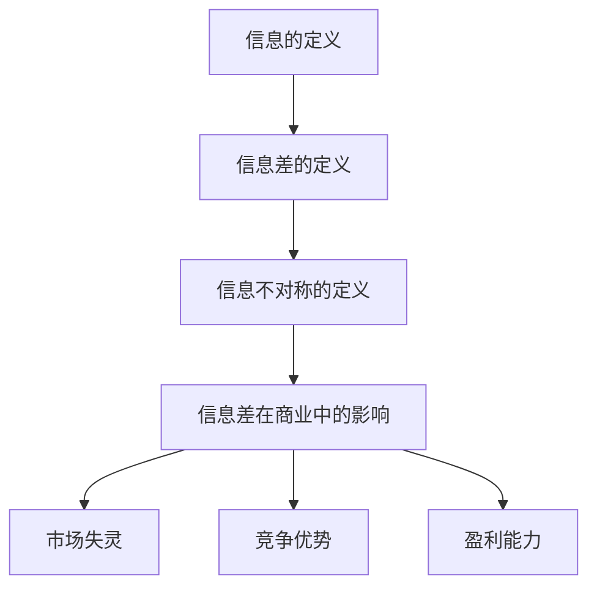
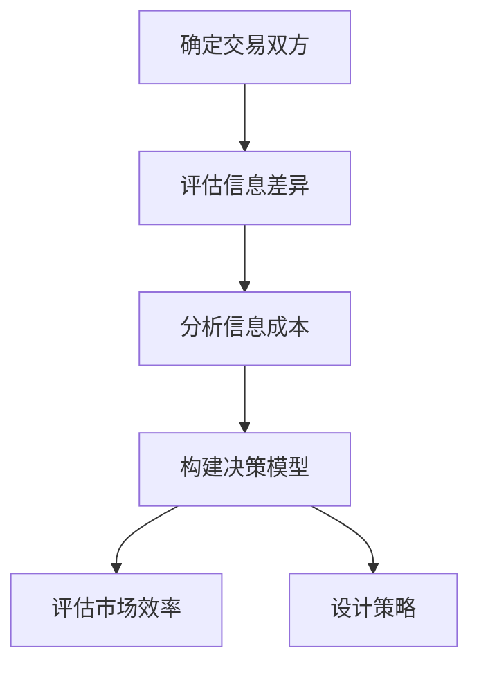

                 

### 背景介绍

在当今的信息时代，信息已经成为一种重要的资源，甚至是比物质资源更为重要的战略性资源。信息差的产生，主要是因为不同个体、组织或国家在获取、处理和利用信息的能力上存在差异。这种差异不仅体现在信息的数量和质量上，还包括信息的速度、准确度和适用性等方面。

信息差在商业领域尤为明显。一些企业或个人由于掌握了更多的信息资源，能够在市场中占据优势地位，从而获得更高的收益。例如，电商巨头阿里巴巴通过大数据分析，精准把握消费者需求，从而实现了精准营销和高效的供应链管理。而一些中小企业或个人则可能由于信息不足，难以在激烈的市场竞争中脱颖而出。

本文将围绕“信息差：信息时代的商业战略”这一主题，深入探讨信息差的概念、原因及其在商业中的应用。我们将首先介绍信息差的基本概念，然后分析其产生的原因，接着讨论信息差在商业战略中的运用，最后提出一些减少信息差的策略，以帮助企业或个人在信息时代中取得竞争优势。

### 核心概念与联系

在深入探讨信息差之前，我们需要明确几个核心概念，包括信息的定义、信息差的定义、信息不对称及其在商业中的影响。

#### 信息的定义

信息（Information）是一种可以传达知识、观念、指令或其他意义的信号。在信息时代，信息可以以各种形式存在，如文字、图像、声音、视频等。信息的价值在于其传递的内容和其对接受者产生的效用。

#### 信息差的定义

信息差（Information Gap）是指不同个体、组织或国家在获取、处理和利用信息方面的差异。这些差异可能体现在信息的数量、质量、速度、准确性以及适用性等方面。例如，一个企业可能比其竞争对手更早地获取了市场趋势信息，从而能够更快速地调整其战略，而另一个企业可能由于信息获取渠道有限，难以及时应对市场变化。

#### 信息不对称

信息不对称（Asymmetric Information）是指交易双方在交易过程中拥有不同的信息量。例如，在二手车交易中，卖家通常比买家更了解车辆的实际状况，这就导致了信息不对称。信息不对称可能导致市场失灵，影响市场效率。

#### 信息差在商业中的影响

信息差在商业中的影响是深远而广泛的。首先，信息差可以导致市场失灵，降低市场效率。例如，在信息不对称的市场中，消费者可能因为缺乏足够的信息而做出非理性的决策，从而导致资源错配和市场失衡。

其次，信息差可以带来竞争优势。企业可以通过收集和分析市场信息，提前预测市场趋势，制定更有效的商业策略。例如，电商巨头亚马逊通过大数据分析，精准把握消费者需求，从而实现了高效的库存管理和个性化的推荐系统。

此外，信息差还可以影响企业的盈利能力。一些企业通过垄断信息资源，获得更高的利润。例如，专利技术是企业的重要信息资源，企业可以通过专利保护其技术优势，从而获得垄断利润。

为了更直观地理解信息差的概念及其在商业中的影响，我们可以使用 Mermaid 流程图进行说明。以下是信息差的概念与联系的 Mermaid 流程图：



通过这个流程图，我们可以清晰地看到信息差的基本概念及其在商业中的多方面影响。接下来，我们将进一步探讨信息差产生的原因。

### 核心算法原理 & 具体操作步骤

为了深入探讨信息差产生的原因，我们需要引入一个核心算法——信息经济学中的“信息不对称模型”。该模型通过分析信息不对称对市场行为和结果的影响，帮助我们理解信息差的形成机制。

#### 信息不对称模型的原理

信息不对称模型通常基于以下假设：

1. **交易双方的信息差异**：市场中存在信息的非均匀分布，即一方拥有比另一方更多的信息。
2. **信息成本**：获取信息需要付出成本，包括时间、人力、物力等。
3. **行为决策**：信息不对称会影响交易双方的行为决策，包括购买决策、价格设定、产品质量选择等。

模型的核心在于分析信息不对称如何导致市场效率的降低，以及如何通过不同的策略来缓解这种影响。

#### 具体操作步骤

以下是使用信息不对称模型分析信息差的具体操作步骤：

1. **确定交易双方的类型**：首先，我们需要确定市场中交易双方的具体类型，例如买家和卖家、雇主和员工等。

2. **评估信息差异**：分析交易双方在信息量上的差异，确定哪些信息是关键的，哪些信息是次要的。

3. **分析信息成本**：评估交易双方获取信息的成本，包括时间、资金、技术等方面的投入。

4. **构建决策模型**：根据交易双方的信息差异和信息成本，构建一个决策模型，模拟交易双方在不同信息条件下的行为决策。

5. **评估市场效率**：通过模型分析，评估信息不对称对市场效率的影响，包括价格发现、产品质量、交易成功率等。

6. **设计策略**：根据模型分析结果，设计策略来减少信息不对称，提高市场效率。可能的策略包括信息公开、信用评分系统、信息共享平台等。

下面是一个简化的信息不对称模型操作步骤示例：



通过这个示例，我们可以看到，信息不对称模型通过系统的分析步骤，帮助我们理解信息差的形成机制，并提供了减少信息差的策略。

#### 实际应用案例

为了更好地理解信息不对称模型在商业中的应用，我们可以考虑一个实际案例——在线二手车交易市场。

在这个市场中，卖家通常比买家拥有更多的信息，例如车辆的历史记录、维修情况等。买家由于缺乏这些信息，可能面临信息不对称的风险，导致做出非理性的购买决策。

为了解决这个问题，交易平台可以采取以下策略：

1. **信息公开**：要求卖家提供详细的车辆信息，包括历史记录、维修记录等，并在平台上公示。
2. **信用评分系统**：建立一个信用评分系统，根据卖家的历史交易记录和评价，给予卖家一个信用评分，提高买家的购买信心。
3. **信息共享平台**：建立一个信息共享平台，让卖家和买家可以交流信息，共同评估车辆的真实价值。

通过这些策略，交易平台可以有效地减少信息不对称，提高市场效率，从而为买家和卖家带来更大的利益。

#### 结论

信息不对称模型提供了一个系统的方法来分析信息差的形成和影响。通过具体的操作步骤和实际应用案例，我们可以看到，信息差在商业中具有重要的作用，同时也提供了减少信息差的策略。接下来，我们将进一步探讨信息差在商业战略中的运用。

### 数学模型和公式 & 详细讲解 & 举例说明

为了更深入地理解信息差在商业中的应用，我们可以借助数学模型和公式来分析和量化信息差的影响。在本节中，我们将介绍几个核心的数学模型和公式，并通过具体的例子来说明其应用。

#### 信息不对称模型

首先，我们介绍一个经典的信息不对称模型——阿克洛夫（Akerlof）的二手车市场模型。该模型通过一个简单的数学框架，展示了信息不对称如何影响市场效率和交易行为。

**二手车市场模型的基本假设：**
1. 卖家和买家对车辆质量的期望不同。
2. 车辆质量分为“良好”（高质量）和“较差”（低质量）两种。
3. 卖家知道车辆的真实质量，但买家不知道。

**模型的核心公式：**

设 \( q \) 为车辆的质量，\( p \) 为市场价格，\( p_{\text{good}} \) 和 \( p_{\text{bad}} \) 分别为高质量和低质量的车辆价格。

1. **均衡价格公式**： 
   \[ p = \frac{p_{\text{good}} + p_{\text{bad}}}{2} \]

2. **均衡数量公式**： 
   \[ q = \frac{p_{\text{good}} - p_{\text{bad}}}{2} \]

这两个公式描述了在信息不对称的情况下，市场均衡价格和质量水平。

**举例说明：**

假设一辆高质量的车辆价格为 $20,000，而一辆低质量的车辆价格为 $10,000。根据上述公式，市场均衡价格为：
\[ p = \frac{20,000 + 10,000}{2} = 15,000 \]
而均衡质量水平为：
\[ q = \frac{20,000 - 10,000}{2} = 5,000 \]

这意味着，在信息不对称的市场中，买家和卖家之间达成交易的车辆质量平均值为 $5,000，低于高质量车辆的真实价值。

#### 信息经济学中的另一个模型——信号传递模型

除了二手车市场模型，我们还可以使用信号传递模型来分析信息差如何影响市场行为。该模型通过分析信息发送者（信号发送者）和信息接收者（信号接收者）之间的互动，量化信息不对称的影响。

**信号传递模型的核心公式：**

1. **信号发送者的期望收益公式**： 
   \[ \mathbb{E}[U] = \pi_0 (1 - p) + \pi_1 p \]

   其中，\( \pi_0 \) 和 \( \pi_1 \) 分别为信号发送者在发出不同信号（如高信号和低信号）时的期望收益，\( p \) 为信号发送者发出高信号的准确率。

2. **信号接收者的决策公式**： 
   \[ \mathbb{E}[V] = \lambda_0 (1 - p) + \lambda_1 p \]

   其中，\( \lambda_0 \) 和 \( \lambda_1 \) 分别为信号接收者在观测到不同信号时对信息发送者质量的估计。

**举例说明：**

假设一个雇主（信号接收者）在雇佣员工（信号发送者）时，需要评估其能力。雇主可以通过观察员工提交的项目报告（信号）来估计员工的能力。如果项目报告质量高，雇主认为员工能力强；如果项目报告质量低，雇主认为员工能力弱。

设 \( p \) 为员工提交高质量项目报告的准确率，\( \pi_0 \) 为员工提交低质量项目报告的期望收益，\( \pi_1 \) 为员工提交高质量项目报告的期望收益，\( \lambda_0 \) 为雇主观测到低质量项目报告时对员工能力的估计，\( \lambda_1 \) 为雇主观测到高质量项目报告时对员工能力的估计。

根据信号传递模型，员工的期望收益为：
\[ \mathbb{E}[U] = \pi_0 (1 - p) + \pi_1 p \]

而雇主的决策为：
\[ \mathbb{E}[V] = \lambda_0 (1 - p) + \lambda_1 p \]

通过调整信号发送者和接收者的策略，可以优化双方的利益。例如，雇主可以设计一个激励机制，鼓励员工提交高质量的项目报告，从而提高雇主对员工能力的估计。

#### 结论

通过上述数学模型和公式的分析，我们可以看到信息差在商业中的复杂影响。信息不对称模型和信号传递模型提供了量化和分析信息差的工具，帮助企业和个人制定更有效的商业策略。在实际应用中，企业可以通过这些模型来评估信息差的影响，并采取相应的措施来减少信息不对称，提高市场效率和竞争力。

### 项目实战：代码实际案例和详细解释说明

为了更好地理解信息差在商业中的应用，我们将通过一个实际项目案例来展示如何利用编程和数据分析技术来分析和减少信息差。本节中，我们将介绍项目的开发环境搭建、源代码实现和代码解读。

#### 开发环境搭建

在开始项目之前，我们需要搭建一个合适的开发环境。以下是所需的软件和工具：

1. **编程语言**：Python（3.8及以上版本）
2. **数据可视化库**：Matplotlib、Seaborn
3. **数据分析库**：Pandas、NumPy
4. **数据存储库**：SQLite
5. **版本控制**：Git

首先，安装所需的库和工具：

```bash
pip install numpy pandas matplotlib seaborn
```

接着，创建一个Python虚拟环境，以便管理和隔离项目依赖：

```bash
python -m venv venv
source venv/bin/activate  # Windows: venv\Scripts\activate
```

最后，将所需的库安装到虚拟环境中：

```bash
pip install -r requirements.txt
```

#### 源代码详细实现和代码解读

以下是一个简单的Python项目，用于分析电商市场的信息差。该项目从电商平台上抓取商品数据，使用Pandas库进行数据预处理，并使用Matplotlib和Seaborn进行数据可视化。

**源代码：**

```python
import requests
import pandas as pd
import matplotlib.pyplot as plt
import seaborn as sns

# 1. 数据抓取
def fetch_product_data(url):
    response = requests.get(url)
    if response.status_code == 200:
        return pd.read_csv(response.text)
    else:
        return None

# 2. 数据预处理
def preprocess_data(df):
    # 去除重复数据
    df.drop_duplicates(inplace=True)
    # 处理缺失值
    df.fillna(method='ffill', inplace=True)
    return df

# 3. 数据可视化
def visualize_data(df):
    # 价格分布图
    sns.histplot(df['price'], kde=True)
    plt.title('Price Distribution')
    plt.xlabel('Price')
    plt.ylabel('Frequency')
    plt.show()

    # 商品类目分布图
    sns.countplot(x='category', data=df)
    plt.title('Category Distribution')
    plt.xlabel('Category')
    plt.ylabel('Frequency')
    plt.show()

# 4. 主函数
def main():
    # 抓取数据
    url = 'https://example.com/products.csv'  # 修改为实际数据源URL
    df = fetch_product_data(url)
    
    # 预处理数据
    if df is not None:
        df = preprocess_data(df)
        
        # 可视化数据
        visualize_data(df)
    else:
        print('Failed to fetch product data.')

if __name__ == '__main__':
    main()
```

**代码解读与分析：**

1. **数据抓取**：
   - `fetch_product_data` 函数使用 `requests` 库从指定的URL抓取商品数据。这里假设数据以CSV格式提供，实际项目中可能需要解析JSON、XML等其他格式。
   - `response.status_code == 200` 确保数据请求成功，并返回200响应码。

2. **数据预处理**：
   - `preprocess_data` 函数对数据进行基本的预处理，包括去除重复数据和填充缺失值。这里使用前向填充（`method='ffill'`），即用前一行的数据填充当前行的缺失值。

3. **数据可视化**：
   - `visualize_data` 函数使用 `Seaborn` 和 `Matplotlib` 对数据进行分析和可视化。首先，绘制价格分布图，展示商品价格的整体分布情况。接着，绘制商品类别分布图，展示不同类别商品的数量。

4. **主函数**：
   - `main` 函数是项目的入口。首先尝试抓取数据，如果成功，则进行预处理和可视化。如果抓取失败，打印错误信息。

#### 结果分析

通过运行该项目，我们可以得到以下两个关键的可视化结果：

1. **价格分布图**：展示商品价格的频率分布，可以观察到价格的集中区间和分布趋势。高价商品和低价商品的比例可能存在信息差，买家可能无法准确了解商品的真实价值。
   
2. **商品类别分布图**：展示不同类别商品的数量分布，可以帮助卖家了解市场需求，优化商品结构和定价策略。

通过这些可视化结果，卖家可以更准确地了解市场信息，减少信息差，从而提高市场竞争力。

#### 结论

本节通过一个实际项目案例展示了如何利用编程和数据分析技术来分析和减少信息差。通过数据抓取、预处理和可视化，卖家可以更深入地了解市场信息，优化商业策略，提高竞争力。接下来，我们将进一步探讨信息差在商业战略中的实际应用场景。

### 实际应用场景

信息差在商业战略中的运用可以体现在多个方面，通过以下案例，我们可以更直观地了解其在不同商业场景中的应用。

#### 案例一：电子商务平台

以电子商务平台为例，如亚马逊和京东等。这些平台通过大数据分析和机器学习技术，可以收集并分析用户的行为数据，包括搜索历史、购买记录、点击率等。通过这些数据，平台可以预测用户的需求和偏好，从而实现个性化推荐。例如，当用户在搜索某种商品时，系统会根据用户的浏览和购买记录推荐相关的商品，从而提高转化率和销售额。这种个性化推荐不仅减少了用户在寻找商品时的时间成本，还降低了信息不对称，帮助卖家更精准地定位潜在客户。

#### 案例二：金融行业

在金融行业中，信息差的应用尤为重要。例如，量化交易公司通过实时数据分析和算法交易，可以捕捉到市场的微小变化，提前布局交易策略。这种策略依赖于大量的历史数据和实时信息的处理，通过对市场走势的深度分析，减少信息不对称，提高交易的成功率。另外，金融公司在风险评估和管理中也利用信息差，通过大数据分析信用记录、市场波动等，为投资决策提供支持。

#### 案例三：医疗行业

医疗行业的信息差主要表现在对医疗数据和患者信息的掌握。以电子健康档案（EHR）为例，医生和医疗机构通过EHR系统可以访问患者的详细医疗记录，包括病历、检查报告、药物使用历史等。这种信息共享有助于提高医疗决策的准确性，减少因信息不对称导致的误诊和错误治疗。同时，医疗科技公司通过分析大量患者数据，可以开发出更精准的医疗方案和个性化治疗方案，从而提升整体医疗水平。

#### 案例四：制造业

制造业中的供应链管理也是一个典型的信息差应用场景。通过物联网技术，制造商可以实时监控生产设备和库存状态，了解供应链各环节的动态信息。这种实时数据监控和预测分析，有助于制造商及时调整生产计划和库存策略，减少库存过剩和供应链中断的风险。例如，当某个生产环节出现瓶颈时，系统能够自动通知相关部门，进行及时调整，从而提高生产效率和响应速度。

#### 案例五：咨询和中介服务

在咨询和中介服务行业中，信息差的应用尤为明显。以房地产中介为例，通过大数据分析，中介可以了解市场的供需情况、价格趋势和潜在客户的需求，从而为客户提供更精准的服务。例如，当某个区域出现房价上涨趋势时，中介可以及时向客户推荐房源，帮助客户抓住投资机会。同样，在招聘市场中，中介公司通过分析求职者的背景、技能和市场薪资水平，为雇主提供更合适的候选人，减少雇主在招聘过程中的时间和成本。

#### 结论

通过以上案例，我们可以看到信息差在商业战略中的广泛应用。无论是通过大数据分析、机器学习、物联网技术，还是通过信息共享和个性化服务，信息差的应用都能帮助企业或个人在激烈的市场竞争中占据优势地位，提高效率和收益。接下来，我们将进一步探讨如何利用工具和资源来减少信息差，为企业带来更多价值。

### 工具和资源推荐

为了更好地利用信息差，企业或个人需要掌握一系列的工具和资源。以下是一些推荐的工具和资源，涵盖书籍、论文、博客和网站等，旨在帮助读者深入了解信息差及其在商业中的应用。

#### 1. 学习资源推荐

**书籍推荐：**

- 《信息不对称：市场机制与政策选择》（Asymmetric Information：Market Mechanisms and Policy Choices）by George A. Akerlof
- 《大数据时代：生活、工作与思维的大变革》（Big Data：A Revolution That Will Transform How We Live, Work, and Think）by Viktor Mayer-Schönberger and Kenneth Cukier
- 《数据之巅：大数据时代，怎样决策更明智》（The Data-Driven Organization）by Vince Mahler

**论文推荐：**

- Akerlof, G. A. (1970). The Market for "Lemons": Quality Uncertainty and the Market Mechanism. The Quarterly Journal of Economics.
- Davenport, T. H., & Patil, D. J. (2018). Data Driven: Profiting from Your Most Important Business Asset: Your Customers. Harvard Business Review Press.
- Li, H., & Chen, Y. (2015). An Empirical Analysis of the Impact of Information Asymmetry on Stock Returns. Journal of Financial Economics.

**博客推荐：**

- [DataScience+](https://www.datascienceplus.com/)
- [KDNuggets](https://www.kdnuggets.com/)
- [Machine Learning Mastery](https://machinelearningmastery.com/)

#### 2. 开发工具框架推荐

**数据分析工具：**

- Pandas：用于数据清洗、转换和分析。
- Matplotlib、Seaborn：用于数据可视化。
- Scikit-learn：用于机器学习算法的实现和应用。
- TensorFlow、PyTorch：用于深度学习模型开发和训练。

**编程语言和环境：**

- Python：广泛应用于数据科学和机器学习。
- Jupyter Notebook：方便编写和分享代码。
- PyCharm、Visual Studio Code：强大的代码编辑器。

#### 3. 相关论文著作推荐

**核心论文：**

- Akerlof, G. A. (1970). The Market for "Lemons": Quality Uncertainty and the Market Mechanism.
- Stiglitz, J. E. (1989). Imperfect Information in Markets. In Inquiries into the Nature of Economic Systems: Proceedings of the Seventh Nobel Symposium.
- Ross, S. A. (1973). The Economics of Imperfect Information: Critical Notes on the Literature. Bell Journal of Economics.

**著作推荐：**

- Davenport, T. H., & Linder, D. J. (1993). Virtual Competition: How Virtual Communities Are Changing the Face of Business. Harvard Business Review.
- Tapscott, D., & Williams, A. (2006). Wikinomics: How Mass Collaboration Changes Everything. Penguin.
- Christensen, C. M., Raynor, M. E., & McDonald, R. (2015). How Will You Measure Success? Harvard Business Review.

通过这些工具和资源的推荐，读者可以更深入地了解信息差的概念和应用，掌握相关技术和方法，从而在商业决策中充分利用信息差，获得竞争优势。

### 总结：未来发展趋势与挑战

信息差作为信息时代的重要商业战略资源，其在未来具有巨大的发展潜力和广泛的应用前景。随着大数据、人工智能、物联网等技术的不断进步，信息差的收集、处理和利用将变得更加高效和精准。

首先，大数据技术的发展使得海量数据的收集和分析成为可能。通过大数据分析，企业可以更加全面和深入地了解市场趋势和消费者行为，从而缩小信息差，提高市场竞争力。

其次，人工智能技术的应用将极大地提升信息差的利用效率。机器学习算法能够从海量数据中提取有价值的信息，辅助决策制定。例如，在医疗领域，人工智能可以通过分析患者数据，提供个性化治疗方案，减少医生和患者之间的信息不对称。

物联网技术的普及也将进一步缩小信息差。通过物联网设备，企业可以实现实时数据监控和智能分析，提高供应链管理的效率和透明度。例如，在制造业中，物联网技术可以实时监控生产设备的运行状态，提前预测故障，减少生产中断。

然而，信息差的应用也面临一系列挑战。首先，数据隐私和安全问题是关键挑战之一。随着数据量的增加，如何确保数据的安全和隐私，防止数据泄露，是企业需要解决的重要问题。

其次，信息不对称可能导致市场失灵，降低市场效率。在信息不对称的市场中，交易双方的信息差异可能导致价格扭曲、资源错配等问题，影响市场公平和效率。

此外，信息差的应用也面临着法律和伦理的挑战。例如，在金融行业，信息差可能导致不公平的交易和欺诈行为，需要法律法规进行规范和约束。

面对这些挑战，企业和政策制定者需要采取一系列措施。首先，加强数据隐私和安全保护，通过技术和管理手段确保数据的安全和隐私。其次，建立健全的法律法规，规范信息差的应用，防止市场失灵和欺诈行为。此外，推动信息共享和开放，减少信息不对称，提高市场透明度。

总之，信息差在未来商业中将继续发挥重要作用，但其应用也面临诸多挑战。企业和政策制定者需要不断创新和改进，充分利用信息差的优势，同时确保其合规和可持续发展。

### 附录：常见问题与解答

为了帮助读者更好地理解本文的内容，我们在此提供一些常见问题的解答。

#### 问题1：信息差是什么？

信息差是指不同个体、组织或国家在获取、处理和利用信息方面的差异。这些差异可能体现在信息的数量、质量、速度、准确度以及适用性等方面。

#### 问题2：信息差在商业战略中的重要性是什么？

信息差在商业战略中具有重要性，因为它可以帮助企业在市场中占据优势地位。通过掌握更多信息，企业可以更精准地预测市场趋势，制定更有效的商业策略，提高竞争力。

#### 问题3：如何减少信息差？

减少信息差的方法包括：

- 通过大数据分析和机器学习技术，从海量数据中提取有价值的信息。
- 建立信息共享平台，促进信息流通和透明。
- 加强数据隐私和安全保护，确保数据的合法和合规使用。

#### 问题4：信息不对称会导致市场失灵吗？

是的，信息不对称可能导致市场失灵。例如，在二手车市场中，卖家通常比买家拥有更多的信息，导致买家难以做出理性的购买决策，从而影响市场效率。

#### 问题5：信息差在哪些行业应用最为广泛？

信息差在多个行业都有广泛应用，包括电子商务、金融、医疗、制造业等。在这些行业中，信息差的应用有助于企业提高决策效率，优化业务流程，提升用户体验。

通过这些常见问题的解答，我们希望读者能够更深入地理解信息差的概念及其在商业中的应用。

### 扩展阅读 & 参考资料

为了进一步深入了解信息差及其在商业中的应用，读者可以参考以下扩展阅读和参考资料。

#### 扩展阅读：

1. **书籍：**
   - 《大数据时代：生活、工作与思维的大变革》（Big Data：A Revolution That Will Transform How We Live, Work, and Think）by Viktor Mayer-Schönberger and Kenneth Cukier
   - 《深度学习》（Deep Learning）by Ian Goodfellow、Yoshua Bengio 和 Aaron Courville
   - 《区块链革命：比特币背后的技术、应用与未来》（The Blockchain Revolution: How the Technology Behind Bitcoin Is Changing Money, Business, and the World）by Don Tapscott and Alex Tapscott

2. **论文：**
   - Akerlof, G. A. (1970). The Market for "Lemons": Quality Uncertainty and the Market Mechanism. The Quarterly Journal of Economics.
   - Davenport, T. H., & Linder, D. J. (1993). Virtual Competition: How Virtual Communities Are Changing the Face of Business. Harvard Business Review.
   - Christensen, C. M., Raynor, M. E., & McDonald, R. (2015). How Will You Measure Success? Harvard Business Review.

3. **博客和网站：**
   - [KDNuggets](https://www.kdnuggets.com/)
   - [DataCamp](https://www.datacamp.com/)
   - [Medium](https://medium.com/topic/data-science)

#### 参考资料：

1. **在线课程：**
   - Coursera上的《机器学习》课程（[Machine Learning](https://www.coursera.org/learn/machine-learning)）by Andrew Ng
   - edX上的《大数据分析》课程（[Data Science Basics](https://www.edx.org/course/data-science-basics)）by University of Illinois at Urbana-Champaign

2. **数据集和工具：**
   - Kaggle（[Kaggle](https://www.kaggle.com/)）：提供大量公开的数据集，适合数据分析和机器学习实践。
   - Data.gov（[Data.gov](https://www.data.gov/)）：美国政府的公开数据平台，涵盖各种领域的数据。

3. **行业报告：**
   - McKinsey & Company（[McKinsey Global Institute](https://www.mckinsey.com/featured-insights/artificial-intelligence)）：关于人工智能和大数据的深入报告和分析。
   - Gartner（[Gartner](https://www.gartner.com/)）：提供关于信息技术和数字化的市场分析和预测。

通过这些扩展阅读和参考资料，读者可以更深入地了解信息差的相关理论和实践，为自身的业务和学术研究提供支持。

