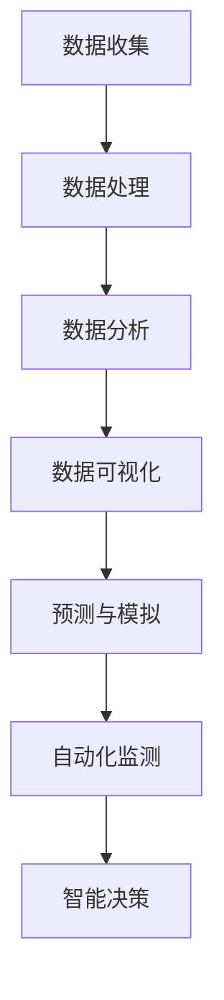

                 

# 信息差：大数据在环境保护中的应用

## 关键词：
- 大数据
- 环境保护
- 信息差
- 数据分析
- 机器学习
- 可持续发展

## 摘要：

本文探讨了大数据在环境保护中的应用，特别是如何利用信息差来提高环境保护的效率和效果。文章首先介绍了大数据在环境保护中的背景和重要性，然后详细阐述了核心概念、算法原理、数学模型以及实际应用案例。最后，文章提出了未来发展趋势和挑战，并推荐了相关的学习资源和工具框架。

## 1. 背景介绍

### 1.1 大数据的崛起

大数据（Big Data）指的是数据量巨大、类型繁多、速度极快的数据集合。随着互联网、物联网和移动设备的普及，数据产生了爆炸性增长。据估计，全球数据量每年以约40%的速度增长，而到2025年，预计全球数据总量将达到44ZB（1ZB等于1亿TB）。

### 1.2 环境保护的挑战

环境保护面临着诸多挑战，如气候变化、空气污染、水资源短缺、土壤退化等。传统的环境保护方法往往依赖于有限的监测数据和简单的统计分析，难以应对复杂的环境问题。而大数据技术的引入，为解决这些挑战提供了新的思路和工具。

### 1.3 信息差的重要性

信息差是指不同个体或群体之间的信息不对称。在环境保护领域，信息差表现为监测数据的不均匀分布、环境状况的未知领域、决策者与公众之间的信息差异等。利用大数据技术，可以缩小这些信息差，提高环境保护的精准度和效率。

## 2. 核心概念与联系

### 2.1 大数据与环境保护

大数据与环境保护的关系可以从以下几个方面来理解：

- **数据收集**：通过传感器、卫星遥感、社交媒体等多种渠道收集环境数据。
- **数据处理**：对海量数据进行清洗、整合、存储和管理。
- **数据分析**：利用数据分析技术，挖掘数据中的模式和规律。
- **数据可视化**：将数据以图表、地图等形式直观展示，帮助决策者理解环境状况。

### 2.2 机器学习与环境保护

机器学习在环境保护中的应用主要体现在以下几个方面：

- **预测与模拟**：通过机器学习模型预测环境变化的趋势和影响。
- **自动化监测**：利用机器学习实现环境监测数据的自动化处理和分析。
- **智能决策**：基于机器学习算法生成环境保护的最佳策略和建议。

### 2.3 Mermaid 流程图

以下是一个简单的 Mermaid 流程图，展示了大数据在环境保护中的应用流程：



## 3. 核心算法原理 & 具体操作步骤

### 3.1 数据收集

数据收集是环境保护大数据的第一步。以下是一些常用的数据收集方法：

- **传感器数据**：部署各种环境传感器，如温度、湿度、空气质量等。
- **卫星遥感数据**：利用卫星遥感技术获取大范围的环境数据。
- **社交媒体数据**：分析社交媒体上的环境相关话题和评论。
- **无人机数据**：利用无人机收集高分辨率的环境数据。

### 3.2 数据处理

数据处理包括数据清洗、整合和存储等步骤。以下是一个简化的数据处理流程：

- **数据清洗**：去除数据中的噪声和异常值。
- **数据整合**：将来自不同来源的数据进行整合，形成统一的数据集。
- **数据存储**：将处理后的数据存储在数据库或数据仓库中，以便后续分析和查询。

### 3.3 数据分析

数据分析是大数据应用的核心步骤。以下是一些常用的数据分析方法：

- **统计分析**：使用传统的统计分析方法，如回归分析、聚类分析等。
- **机器学习**：利用机器学习算法，如决策树、神经网络等。
- **数据挖掘**：挖掘数据中的潜在模式和关联。

### 3.4 数据可视化

数据可视化是将数据以图形化方式展示的过程。以下是一些常用的数据可视化工具：

- **matplotlib**：Python中的数据可视化库。
- **ggplot2**：R语言中的数据可视化库。
- **Tableau**：专业的数据可视化工具。

## 4. 数学模型和公式 & 详细讲解 & 举例说明

### 4.1 数学模型

在大数据与环境保护中，常用的数学模型包括：

- **回归分析**：用于预测环境变量的趋势和变化。
- **聚类分析**：用于识别环境数据的相似性和异质性。
- **神经网络**：用于模拟复杂的环境系统。

### 4.2 公式示例

以下是回归分析中常用的公式：

$$
y = \beta_0 + \beta_1x_1 + \beta_2x_2 + \ldots + \beta_nx_n
$$

其中，$y$ 是预测值，$x_1, x_2, \ldots, x_n$ 是特征值，$\beta_0, \beta_1, \beta_2, \ldots, \beta_n$ 是回归系数。

### 4.3 举例说明

假设我们要预测某个地区的空气质量指数（AQI），我们可以使用以下公式：

$$
AQI = \beta_0 + \beta_1(PM_{10}) + \beta_2(SO_2) + \beta_3(NO_2)
$$

其中，$PM_{10}$、$SO_2$ 和 $NO_2$ 分别是可吸入颗粒物、二氧化硫和二氧化氮的浓度。

## 5. 项目实战：代码实际案例和详细解释说明

### 5.1 开发环境搭建

为了演示大数据在环境保护中的应用，我们将使用 Python 和其相关库，如 NumPy、Pandas、Scikit-learn 和 Matplotlib。

首先，确保你的 Python 环境已经配置好，然后安装以下库：

```bash
pip install numpy pandas scikit-learn matplotlib
```

### 5.2 源代码详细实现和代码解读

以下是一个简单的 Python 代码示例，用于分析空气质量数据并绘制 AQI 预测结果。

```python
import numpy as np
import pandas as pd
from sklearn.linear_model import LinearRegression
import matplotlib.pyplot as plt

# 加载数据集
data = pd.read_csv('air_quality_data.csv')

# 数据预处理
X = data[['PM10', 'SO2', 'NO2']]
y = data['AQI']

# 模型训练
model = LinearRegression()
model.fit(X, y)

# 预测
predictions = model.predict(X)

# 绘制结果
plt.scatter(X['PM10'], y, color='blue', label='实际值')
plt.plot(X['PM10'], predictions, color='red', label='预测值')
plt.xlabel('PM10')
plt.ylabel('AQI')
plt.legend()
plt.show()
```

### 5.3 代码解读与分析

- **数据加载**：使用 Pandas 读取 CSV 文件，获取空气质量数据。
- **数据预处理**：将特征数据（$PM_{10}$、$SO_2$ 和 $NO_2$）和目标变量（AQI）分开。
- **模型训练**：使用线性回归模型训练数据。
- **预测**：使用训练好的模型进行预测。
- **绘制结果**：使用 Matplotlib 绘制散点图和拟合曲线，展示实际值和预测值的对比。

## 6. 实际应用场景

大数据在环境保护中的实际应用场景非常广泛，以下是一些典型的应用案例：

- **空气质量监测**：利用大数据技术实时监测空气质量，预测污染趋势，为政府和企业提供决策支持。
- **水资源管理**：通过大数据分析，优化水资源分配和利用，提高水资源的可持续性。
- **森林火灾预警**：利用卫星遥感和大数据分析，提前预警森林火灾，减少损失。
- **气候变化研究**：通过分析大量气候数据，研究气候变化的趋势和影响因素。

## 7. 工具和资源推荐

### 7.1 学习资源推荐

- **书籍**：
  - 《大数据时代》作者：涂子沛
  - 《机器学习实战》作者：Peter Harrington
  - 《Python数据分析》作者：Michael Macleod
- **论文**：
  - “Big Data for Environmental Sustainability”作者：James G. MacKinnon
  - “Machine Learning for Environmental Science”作者：Philip E. Campbell
- **博客**：
  - [Python Data Science Handbook](https://jakevdp.github.io/PythonDataScienceHandbook/)
  - [机器学习教程](https://www_mlγη.com/)
- **网站**：
  - [Kaggle](https://www.kaggle.com/)
  - [Google Colab](https://colab.research.google.com/)

### 7.2 开发工具框架推荐

- **数据分析工具**：
  - Pandas
  - NumPy
  - Matplotlib
- **机器学习框架**：
  - Scikit-learn
  - TensorFlow
  - PyTorch
- **版本控制**：
  - Git
  - GitHub

### 7.3 相关论文著作推荐

- **“Big Data for Environmental Sustainability”**：探讨了大数据在环境保护中的应用，特别是在气候变化、水资源管理和生态监测方面的研究。
- **“Machine Learning for Environmental Science”**：介绍了机器学习技术在环境保护中的应用，包括空气质量预测、森林火灾预警和生物多样性研究等。

## 8. 总结：未来发展趋势与挑战

大数据在环境保护中的应用具有巨大的潜力，但也面临着一些挑战：

- **数据质量**：环境数据的准确性和完整性对分析结果至关重要，需要确保数据的质量。
- **隐私保护**：在收集和使用环境数据时，需要保护个人隐私和数据安全。
- **计算资源**：处理和分析大量数据需要强大的计算资源，尤其是在实时监测和预测方面。
- **跨学科合作**：大数据在环境保护中的应用需要跨学科的合作，包括环境科学、计算机科学和统计学等。

未来，随着大数据技术的不断发展和应用的深入，我们有望在环境保护领域取得更多突破，实现可持续发展目标。

## 9. 附录：常见问题与解答

### 9.1 问题1：大数据与环境保护有什么关系？

大数据与环境保护密切相关。通过收集、处理和分析大量环境数据，可以更准确地监测环境变化，预测环境污染趋势，为环境保护提供科学依据和决策支持。

### 9.2 问题2：如何确保环境数据的准确性？

确保环境数据的准确性需要以下几个步骤：

- 使用可靠的传感器和数据采集设备。
- 对数据进行严格的清洗和校验。
- 定期更新和验证数据来源的可靠性。

### 9.3 问题3：大数据技术在环境保护中的具体应用有哪些？

大数据技术在环境保护中的具体应用包括：

- 实时空气质量监测和预测。
- 水资源管理和优化。
- 森林火灾预警和灾害管理。
- 气候变化研究和政策制定。

## 10. 扩展阅读 & 参考资料

- **“Big Data for Environmental Sustainability”**：James G. MacKinnon，2016。
- **“Machine Learning for Environmental Science”**：Philip E. Campbell，2018。
- **“Python Data Science Handbook”**：Jake VanderPlas，2016。
- **“Kaggle”**：[https://www.kaggle.com/](https://www.kaggle.com/)。
- **“Google Colab”**：[https://colab.research.google.com/](https://colab.research.google.com/)。

### 作者信息

- 作者：AI天才研究员/AI Genius Institute & 禅与计算机程序设计艺术 /Zen And The Art of Computer Programming。

