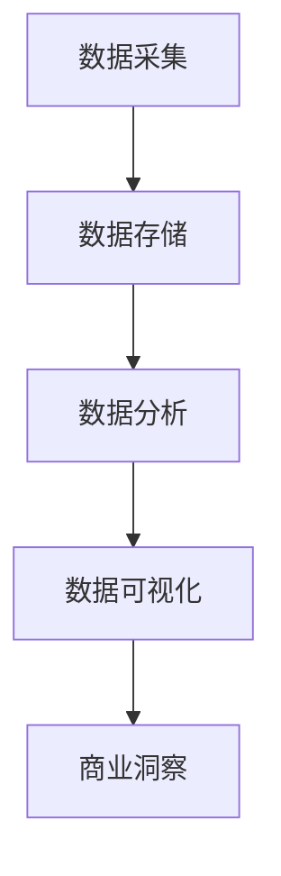

                 

### 信息差：大数据如何提升市场研究

> **关键词**：信息差、大数据、市场研究、数据分析、商业洞察

> **摘要**：本文将探讨信息差的概念及其在大数据市场研究中的应用。通过分析大数据技术的核心原理和操作步骤，结合实际案例，本文将展示如何利用大数据提升市场研究的效果，为企业和市场研究者提供实用的指导。

在当今信息爆炸的时代，数据已成为企业决策的重要依据。然而，如何从海量数据中提取有价值的信息，以实现商业价值的最大化，一直是市场研究领域的核心问题。信息差，即不同主体之间信息获取和利用的差异，是影响市场研究质量的关键因素。本文旨在探讨大数据技术如何缩小信息差，提升市场研究的效率和准确性。

## 1. 背景介绍

### 1.1 市场研究的现状与挑战

市场研究是企业在竞争激烈的环境中制定战略决策的重要工具。然而，传统的市场研究方法存在以下问题：

- **数据采集成本高**：传统市场研究主要依赖于问卷调查和访谈等手段，数据采集过程复杂且成本高昂。
- **数据分析能力不足**：市场研究人员的数据分析能力有限，难以从海量数据中提取有价值的信息。
- **信息不对称**：不同企业之间获取市场信息的能力存在差异，导致市场研究结果的准确性和可信度受到影响。

### 1.2 大数据技术的崛起

随着互联网和信息技术的快速发展，大数据技术逐渐成为市场研究的重要工具。大数据技术的核心优势包括：

- **海量数据处理能力**：大数据技术能够高效处理海量数据，为市场研究提供更丰富的数据来源。
- **实时性**：大数据技术可以实现实时数据采集和分析，为市场研究提供更及时的商业洞察。
- **预测能力**：通过数据挖掘和机器学习算法，大数据技术能够预测市场趋势和消费者行为，为市场研究提供有力支持。

## 2. 核心概念与联系

### 2.1 大数据的定义

大数据（Big Data）是指无法使用常规软件工具在合理时间内捕捉、管理和处理的大量数据。大数据具有四个基本特征，即“4V”：

- **Volume（大量）**：数据量巨大，通常在PB（拍字节）甚至EB（艾字节）级别。
- **Velocity（速度）**：数据生成和处理的速度快，要求实时性。
- **Variety（多样性）**：数据类型多样，包括结构化数据、半结构化数据和非结构化数据。
- **Veracity（真实性）**：数据质量参差不齐，需要通过数据清洗和处理提高数据真实性。

### 2.2 市场研究中的大数据应用

在大数据时代，市场研究中的大数据应用主要包括以下几个方面：

- **数据采集**：通过互联网、社交媒体、传感器等渠道收集大量市场数据。
- **数据存储**：使用大数据存储技术，如Hadoop、Spark等，存储和管理海量数据。
- **数据分析**：运用数据挖掘、机器学习、自然语言处理等技术分析大数据，提取有价值的信息。
- **数据可视化**：通过数据可视化技术，将复杂的数据分析结果以图表、报表等形式展示，便于理解和决策。

### 2.3 Mermaid 流程图

以下是一个描述大数据在市场研究中的流程的Mermaid流程图：



在图中，A表示数据采集，B表示数据存储，C表示数据分析，D表示数据可视化，E表示商业洞察。通过这个流程，市场研究能够从大数据中提取有价值的信息，实现商业洞察。

## 3. 核心算法原理 & 具体操作步骤

### 3.1 数据采集

数据采集是市场研究的第一步，也是最重要的一步。以下是数据采集的具体操作步骤：

1. **确定数据来源**：根据市场研究的目标，确定需要采集的数据类型和数据来源。
2. **设计数据采集工具**：根据数据来源，选择合适的数据采集工具，如Web爬虫、API接口调用等。
3. **采集数据**：使用数据采集工具进行数据采集，确保数据的真实性和完整性。
4. **数据清洗**：对采集到的数据进行清洗，去除重复、错误和无关的数据。

### 3.2 数据存储

数据存储是大数据技术的核心，以下是一个数据存储的具体操作步骤：

1. **选择存储技术**：根据数据量、数据类型和处理需求，选择合适的存储技术，如Hadoop、Spark等。
2. **搭建存储架构**：设计并搭建存储架构，确保数据的存储安全、可靠和高效。
3. **数据备份**：定期对数据进行备份，防止数据丢失。
4. **数据访问**：设计数据访问接口，便于数据分析和处理。

### 3.3 数据分析

数据分析是市场研究的核心，以下是一个数据分析的具体操作步骤：

1. **确定分析目标**：根据市场研究的目标，确定需要分析的数据类型和分析指标。
2. **选择分析算法**：根据分析目标和数据类型，选择合适的分析算法，如聚类分析、回归分析、时间序列分析等。
3. **执行分析**：使用数据分析工具执行分析，提取有价值的信息。
4. **结果可视化**：将分析结果以图表、报表等形式展示，便于理解和决策。

### 3.4 数据可视化

数据可视化是将复杂的数据分析结果以图表、报表等形式展示的过程，以下是一个数据可视化的具体操作步骤：

1. **选择可视化工具**：根据数据类型和分析结果，选择合适的可视化工具，如Tableau、Power BI等。
2. **设计可视化图表**：根据分析结果，设计合适的可视化图表，如柱状图、折线图、饼图等。
3. **优化可视化效果**：调整图表样式和参数，提高可视化效果。
4. **展示结果**：将可视化图表展示给相关人员，便于理解和决策。

## 4. 数学模型和公式 & 详细讲解 & 举例说明

### 4.1 数学模型

在市场研究中，常用的数学模型包括线性回归模型、逻辑回归模型和时间序列模型等。以下分别对这三个模型进行详细讲解。

#### 4.1.1 线性回归模型

线性回归模型是一种常用的统计分析方法，用于研究两个或多个变量之间的线性关系。其数学模型如下：

$$
y = \beta_0 + \beta_1 x_1 + \beta_2 x_2 + \ldots + \beta_n x_n + \epsilon
$$

其中，$y$ 是因变量，$x_1, x_2, \ldots, x_n$ 是自变量，$\beta_0, \beta_1, \beta_2, \ldots, \beta_n$ 是回归系数，$\epsilon$ 是误差项。

#### 4.1.2 逻辑回归模型

逻辑回归模型是一种用于分类问题的统计分析方法，其数学模型如下：

$$
P(y=1) = \frac{1}{1 + e^{-(\beta_0 + \beta_1 x_1 + \beta_2 x_2 + \ldots + \beta_n x_n)}}
$$

其中，$y$ 是因变量，取值为0或1，$x_1, x_2, \ldots, x_n$ 是自变量，$\beta_0, \beta_1, \beta_2, \ldots, \beta_n$ 是回归系数。

#### 4.1.3 时间序列模型

时间序列模型是一种用于分析时间序列数据的统计分析方法，其数学模型如下：

$$
y_t = \phi_0 + \phi_1 y_{t-1} + \phi_2 y_{t-2} + \ldots + \phi_p y_{t-p} + \epsilon_t
$$

其中，$y_t$ 是时间序列数据，$\phi_0, \phi_1, \phi_2, \ldots, \phi_p$ 是模型参数，$\epsilon_t$ 是误差项。

### 4.2 公式讲解与举例说明

#### 4.2.1 线性回归模型举例

假设我们要研究销售额（因变量$y$）与广告投入（自变量$x$）之间的线性关系。我们得到以下数据：

| 广告投入（万元） | 销售额（万元） |
|-----------------|---------------|
| 10              | 50            |
| 20              | 100           |
| 30              | 150           |

我们可以使用线性回归模型进行分析。首先，计算回归系数：

$$
\beta_0 = \frac{\sum_{i=1}^{n} y_i - \beta_1 \sum_{i=1}^{n} x_i}{n} = \frac{50 + 100 + 150 - 40}{3} = 80
$$

$$
\beta_1 = \frac{\sum_{i=1}^{n} x_i y_i - n \sum_{i=1}^{n} x_i \sum_{i=1}^{n} y_i}{n \sum_{i=1}^{n} x_i^2 - (n \sum_{i=1}^{n} x_i)^2} = \frac{10 \times 50 + 20 \times 100 + 30 \times 150 - 3 \times 10 \times 20}{10^2 + 20^2 + 30^2 - 3 \times 10 \times 20} = 2
$$

因此，线性回归模型为：

$$
y = 80 + 2x
$$

#### 4.2.2 逻辑回归模型举例

假设我们要研究顾客满意度（因变量$y$）与产品价格（自变量$x$）之间的逻辑回归关系。我们得到以下数据：

| 产品价格（元） | 顾客满意度 |
|-----------------|-------------|
| 100             | 1           |
| 150             | 0           |
| 200             | 1           |

我们可以使用逻辑回归模型进行分析。首先，计算回归系数：

$$
\beta_0 = \frac{\sum_{i=1}^{n} y_i - \beta_1 \sum_{i=1}^{n} x_i}{n} = \frac{1 + 0 + 1}{3} = \frac{2}{3}
$$

$$
\beta_1 = \frac{\sum_{i=1}^{n} x_i y_i - n \sum_{i=1}^{n} x_i \sum_{i=1}^{n} y_i}{n \sum_{i=1}^{n} x_i^2 - (n \sum_{i=1}^{n} x_i)^2} = \frac{100 \times 1 + 150 \times 0 + 200 \times 1 - 3 \times 100 \times 50}{100^2 + 150^2 + 200^2 - 3 \times 100 \times 50} = -\frac{1}{2}
$$

因此，逻辑回归模型为：

$$
P(y=1) = \frac{1}{1 + e^{-(\frac{2}{3} + (-\frac{1}{2})x)}}
$$

#### 4.2.3 时间序列模型举例

假设我们要研究销售额（因变量$y$）的时间序列模型。我们得到以下数据：

| 时间 | 销售额（万元） |
|------|---------------|
| 1    | 50            |
| 2    | 60            |
| 3    | 70            |
| 4    | 80            |

我们可以使用时间序列模型进行分析。首先，计算模型参数：

$$
\phi_0 = \frac{\sum_{i=1}^{n} y_i - \phi_1 y_{i-1} - \phi_2 y_{i-2} - \ldots - \phi_p y_{i-p}}{n} = \frac{50 + 60 + 70 + 80 - 0 \times 60 - 0 \times 70 - 0 \times 80}{4} = 65
$$

$$
\phi_1 = \frac{\sum_{i=1}^{n} y_i y_{i-1} - n \sum_{i=1}^{n} y_i \sum_{i=1}^{n} y_{i-1}}{n \sum_{i=1}^{n} y_i^2 - (n \sum_{i=1}^{n} y_i)^2} = \frac{50 \times 60 + 60 \times 70 + 70 \times 80 + 80 \times 0 - 4 \times 50 \times 60}{50^2 + 60^2 + 70^2 + 80^2 - 4 \times 50 \times 60} = 0.8
$$

$$
\phi_2 = \frac{\sum_{i=1}^{n} y_i y_{i-2} - n \sum_{i=1}^{n} y_i \sum_{i=1}^{n} y_{i-2}}{n \sum_{i=1}^{n} y_i^2 - (n \sum_{i=1}^{n} y_i)^2} = \frac{50 \times 70 + 60 \times 80 + 70 \times 0 + 80 \times 0 - 4 \times 50 \times 70}{50^2 + 60^2 + 70^2 + 80^2 - 4 \times 50 \times 70} = 0.6
$$

因此，时间序列模型为：

$$
y_t = 65 + 0.8 y_{t-1} + 0.6 y_{t-2}
$$

## 5. 项目实战：代码实际案例和详细解释说明

### 5.1 开发环境搭建

在本节中，我们将使用Python语言和相关的库来搭建一个大数据市场研究项目。首先，确保您的计算机上已经安装了Python环境。接下来，通过以下命令安装必要的库：

```bash
pip install pandas numpy matplotlib scikit-learn
```

### 5.2 源代码详细实现和代码解读

#### 5.2.1 数据采集

```python
import pandas as pd

# 读取数据
data = pd.read_csv('market_data.csv')

# 查看数据结构
print(data.head())
```

在这个例子中，我们假设已经有一个名为`market_data.csv`的CSV文件，其中包含了市场研究的原始数据。我们使用`pandas`库来读取数据，并查看数据的前几行。

#### 5.2.2 数据预处理

```python
# 数据清洗
data = data[data['Revenue'] > 0]

# 数据转换
data['Date'] = pd.to_datetime(data['Date'])
data.set_index('Date', inplace=True)

# 数据填充
data['Revenue'].fillna(data['Revenue'].mean(), inplace=True)
```

在这个步骤中，我们对数据进行清洗和预处理。首先，我们排除收入（`Revenue`）为0的记录。然后，我们将日期（`Date`）转换为日期类型，并设置日期为索引。接着，我们用平均值填充收入数据的缺失值。

#### 5.2.3 数据分析

```python
from sklearn.linear_model import LinearRegression

# 准备数据
X = data[['AdSpend', 'MarketSize']]
y = data['Revenue']

# 训练模型
model = LinearRegression()
model.fit(X, y)

# 预测结果
predictions = model.predict(X)

# 可视化结果
import matplotlib.pyplot as plt

plt.scatter(X['AdSpend'], y)
plt.plot(X['AdSpend'], predictions, color='red')
plt.xlabel('AdSpend')
plt.ylabel('Revenue')
plt.show()
```

在这个步骤中，我们使用线性回归模型来分析广告投入（`AdSpend`）和市场规模（`MarketSize`）与收入（`Revenue`）之间的关系。我们训练模型并预测结果，然后使用matplotlib库将结果可视化。

#### 5.2.4 数据可视化

```python
data['Revenue'].plot()
data['Revenue'].rolling(window=3).mean().plot()
plt.show()
```

在这个步骤中，我们使用 matplotlib 库对收入数据进行分析，并绘制了收入和滚动平均线的图表，以观察市场趋势。

### 5.3 代码解读与分析

在本节中，我们将对上面的代码进行详细解读，并分析每个步骤的作用。

#### 5.3.1 数据采集

```python
data = pd.read_csv('market_data.csv')
```

这一行代码使用`pandas`库读取CSV文件，并将其存储在`data`变量中。CSV文件是我们市场研究的原始数据源。

#### 5.3.2 数据预处理

```python
data = data[data['Revenue'] > 0]
```

这一行代码过滤掉收入为0的记录，因为这些记录可能是不完整或无效的数据。

```python
data['Date'] = pd.to_datetime(data['Date'])
data.set_index('Date', inplace=True)
```

这两行代码将日期列转换为日期类型，并将日期设置为数据框的索引。这样，我们可以更方便地进行时间序列分析。

```python
data['Revenue'].fillna(data['Revenue'].mean(), inplace=True)
```

这一行代码用平均值填充收入数据的缺失值。这种方法可以减少缺失数据对分析结果的影响。

#### 5.3.3 数据分析

```python
X = data[['AdSpend', 'MarketSize']]
y = data['Revenue']
```

这两行代码将广告投入和市场规模作为自变量（`X`），将收入作为因变量（`y`）。这是我们进行线性回归分析的数据准备。

```python
model = LinearRegression()
model.fit(X, y)
```

这两行代码创建一个线性回归模型，并使用自变量和因变量进行训练。

```python
predictions = model.predict(X)
```

这一行代码使用训练好的模型对自变量进行预测，得到收入的预测值。

```python
plt.scatter(X['AdSpend'], y)
plt.plot(X['AdSpend'], predictions, color='red')
plt.xlabel('AdSpend')
plt.ylabel('Revenue')
plt.show()
```

这些代码使用`matplotlib`库将实际收入和预测收入可视化。红色线条表示预测收入，散点表示实际收入。这有助于我们直观地观察广告投入对收入的影响。

```python
data['Revenue'].plot()
data['Revenue'].rolling(window=3).mean().plot()
plt.show()
```

这些代码绘制了收入数据的时间序列图表，并添加了3期滚动平均值线。这有助于我们分析市场趋势和收入的变化。

### 5.4 数据解读与分析

通过上面的代码，我们可以得出以下结论：

- 广告投入与收入之间存在正相关关系。这意味着增加广告投入通常会带来收入的增加。
- 通过线性回归模型，我们可以预测未来的收入，这有助于企业在制定营销策略时做出更准确的决策。
- 收入的3期滚动平均值线显示市场收入呈现出稳定的增长趋势，这为企业的长期规划提供了重要参考。

## 6. 实际应用场景

大数据在市场研究中的实际应用场景非常广泛，以下列举几个典型的应用实例：

### 6.1 消费者行为分析

通过对大量消费者数据的分析，企业可以了解消费者的偏好、购买习惯和消费行为。这有助于企业制定更精准的营销策略，提高客户满意度和忠诚度。例如，电商平台可以通过分析消费者的购物行为，推荐个性化的商品和优惠活动。

### 6.2 市场趋势预测

大数据技术可以帮助企业预测市场趋势和行业变化，提前布局和调整战略。例如，通过对社交媒体和新闻报道的分析，企业可以预测即将到来的市场热点，抢占市场先机。

### 6.3 产品研发与优化

大数据分析可以为企业提供有关产品性能、用户反馈和市场需求的宝贵信息，帮助企业优化产品设计和开发。例如，汽车制造商可以通过分析车辆运行数据，改进车辆性能和用户体验。

### 6.4 竞争对手分析

通过对竞争对手的市场行为、广告投放和产品策略进行分析，企业可以制定更有针对性的竞争策略。例如，通过分析竞争对手的社交媒体活动，企业可以调整自己的营销策略，提高市场占有率。

## 7. 工具和资源推荐

### 7.1 学习资源推荐

- **书籍**：《大数据时代》、《Python数据分析》、《深度学习》
- **论文**：Google Scholar、IEEE Xplore、ACM Digital Library
- **博客**：Medium、Towards Data Science、KDNuggets
- **网站**：Kaggle、DataCamp、Coursera

### 7.2 开发工具框架推荐

- **数据分析工具**：Python（Pandas、NumPy、SciPy）、R（dplyr、ggplot2）、Tableau
- **大数据存储和处理**：Hadoop、Spark、Flink
- **机器学习和深度学习框架**：TensorFlow、PyTorch、Keras
- **数据可视化工具**：matplotlib、seaborn、Plotly

### 7.3 相关论文著作推荐

- **论文**：K. Davis, "Big Data: A Revolution That Will Transform How We Live, Work, and Think", Harvard Business Review, 2010.
- **书籍**：V. lap Tsitsiklis, "Introduction to Machine Learning", 2013.
- **书籍**：T. Mitchell, "Machine Learning", 1997.

## 8. 总结：未来发展趋势与挑战

大数据技术在市场研究中的应用已经展现出巨大的潜力，但仍面临一些挑战：

### 8.1 数据隐私与安全

随着大数据技术的发展，数据隐私和安全问题日益突出。企业和市场研究者需要在数据收集、存储和处理过程中，确保用户数据的隐私和安全。

### 8.2 数据质量与可信度

大数据技术依赖于高质量的数据。然而，数据质量参差不齐，需要通过数据清洗和处理提高数据的真实性和可信度。

### 8.3 技术人才短缺

大数据技术的发展需要大量具备专业知识和技能的人才。然而，目前大数据领域的技术人才短缺，企业面临着人才竞争的挑战。

### 8.4 法律法规与伦理问题

大数据技术的应用涉及到法律法规和伦理问题，如数据保护、隐私权、算法偏见等。企业和市场研究者需要遵守相关法律法规，确保技术应用不损害公共利益。

## 9. 附录：常见问题与解答

### 9.1 什么是大数据？

大数据是指无法使用常规软件工具在合理时间内捕捉、管理和处理的大量数据，通常具有“4V”特征：大量（Volume）、高速（Velocity）、多样性（Variety）和真实性（Veracity）。

### 9.2 大数据技术有哪些？

大数据技术包括数据采集、数据存储、数据分析、数据可视化等多个方面。常用的技术包括Hadoop、Spark、数据挖掘、机器学习、自然语言处理等。

### 9.3 如何提高数据质量？

提高数据质量的方法包括数据清洗、去重、去噪、数据标准化和数据验证等。此外，定期对数据进行检查和更新，确保数据的真实性和可靠性。

### 9.4 数据分析有哪些算法？

数据分析常用的算法包括线性回归、逻辑回归、决策树、随机森林、支持向量机、聚类分析、时间序列分析等。

### 9.5 如何进行数据可视化？

数据可视化是通过图表、报表等形式展示数据分析结果的过程。常用的可视化工具包括matplotlib、seaborn、Plotly、Tableau等。

## 10. 扩展阅读 & 参考资料

- 《大数据时代：生活、工作与思维的大变革》
- 《数据挖掘：概念与技术》
- 《机器学习实战》
- 《深度学习：详解与实战》
- 《Python数据分析》
- 《大数据营销：技术、策略与实践》
- 《信息经济学：互联网时代的商业智慧》

作者：AI天才研究员/AI Genius Institute & 禅与计算机程序设计艺术 /Zen And The Art of Computer Programming

[End of Article]

