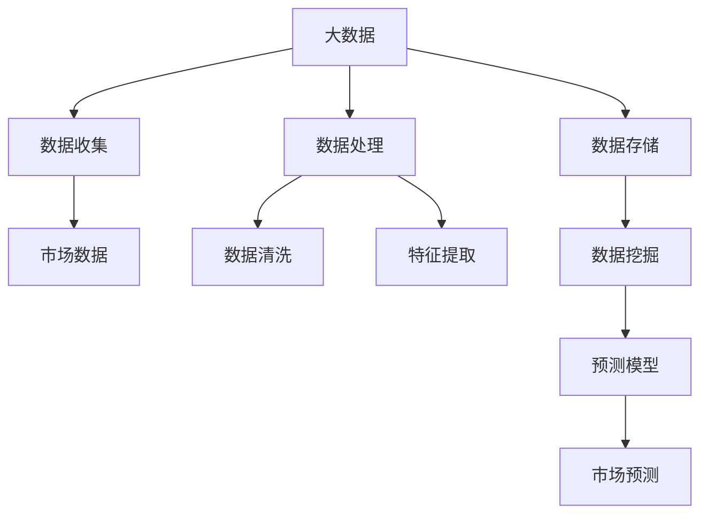

                 

# 信息差：大数据如何提升市场预测

> **关键词：** 数据分析、市场预测、大数据、信息差、机器学习、人工智能

> **摘要：** 本文将探讨大数据如何通过信息差提升市场预测的准确性。从核心概念、算法原理到实际应用，深入分析大数据在市场预测中的作用，并提供相关工具和资源推荐，旨在为读者提供全面的技术视角和实战指导。

## 1. 背景介绍

在当今的商业环境中，市场预测变得愈发重要。准确的市场预测可以帮助企业制定战略决策、优化资源配置、提高盈利能力。然而，市场预测的复杂性使得传统的预测方法面临巨大挑战。随着信息技术的快速发展，大数据和人工智能技术的应用为市场预测带来了全新的可能性。大数据通过对海量数据的收集、存储、处理和分析，可以揭示数据背后的潜在规律，从而提高市场预测的准确性。

信息差，即信息不对称，指的是不同个体或组织之间对同一信息的掌握程度不同。在市场预测中，信息差的存在使得预测结果受到数据质量和信息完整性等因素的影响。大数据通过缩小信息差，提供更全面、更准确的数据，从而提升市场预测的可靠性。

## 2. 核心概念与联系

### 2.1 大数据

大数据（Big Data）指的是海量、多样化、高速生成且价值密度低的数据集合。大数据的特点可以归纳为“4V”：Volume（大量）、Velocity（高速）、Variety（多样）和Veracity（真实性）。

### 2.2 市场预测

市场预测（Market Forecasting）是指根据历史数据、市场现状和未来趋势，对市场行为和结果进行预测。市场预测的方法包括统计学方法、机器学习方法等。

### 2.3 信息差

信息差（Information Gap）是指由于信息不对称导致的市场参与者之间对市场信息的掌握程度不同。在市场预测中，缩小信息差有助于提高预测的准确性。

### 2.4 大数据与市场预测的联系

大数据与市场预测之间存在密切联系。大数据提供了丰富的市场数据，这些数据可以用于构建预测模型，提高预测的准确性。通过大数据技术，可以实时收集、处理和分析市场数据，从而缩小信息差，提高市场预测的可靠性。

### 2.5 Mermaid 流程图

以下是一个关于大数据与市场预测联系的 Mermaid 流程图：



## 3. 核心算法原理 & 具体操作步骤

### 3.1 数据收集

数据收集是市场预测的第一步，主要包括以下步骤：

1. 确定数据来源，包括公开数据、私有数据等。
2. 使用 API、爬虫等技术手段收集数据。
3. 数据收集过程中需要注意数据的质量和完整性。

### 3.2 数据处理

数据处理包括数据清洗、特征提取等步骤：

1. **数据清洗**：去除重复数据、处理缺失值、纠正错误数据等。
   $$ \text{数据清洗} = \text{去重} + \text{缺失值处理} + \text{错误数据纠正} $$
   
2. **特征提取**：将原始数据转化为能够反映市场特征的向量。
   $$ \text{特征提取} = \text{数据转换} + \text{特征选择} $$

### 3.3 数据存储

数据存储是将处理后的数据存储到数据库或数据仓库中，以便后续分析。

### 3.4 数据挖掘

数据挖掘是利用算法从大量数据中提取有价值的信息，主要包括以下步骤：

1. **关联规则挖掘**：发现数据之间的关联关系。
2. **分类与回归分析**：构建预测模型，对市场趋势进行预测。

### 3.5 预测模型

预测模型是市场预测的核心，主要包括以下步骤：

1. **模型选择**：选择合适的预测模型，如 ARIMA、SVM、神经网络等。
2. **模型训练**：使用历史数据对模型进行训练。
3. **模型评估**：评估模型性能，包括准确率、召回率等指标。

## 4. 数学模型和公式 & 详细讲解 & 举例说明

### 4.1 数学模型

市场预测中的常见数学模型包括时间序列模型和机器学习模型。

#### 时间序列模型

时间序列模型（如 ARIMA）主要用于处理时间序列数据，其核心公式如下：

$$ X_t = c + \phi_1 X_{t-1} + \phi_2 X_{t-2} + ... + \phi_p X_{t-p} + \theta_1 e_{t-1} + \theta_2 e_{t-2} + ... + \theta_q e_{t-q} $$

其中，$X_t$ 为时间序列数据，$\phi_1, \phi_2, ..., \phi_p$ 为自回归系数，$\theta_1, \theta_2, ..., \theta_q$ 为移动平均系数，$e_t$ 为白噪声序列。

#### 机器学习模型

机器学习模型（如 SVM、神经网络）主要用于处理高维数据和非线性关系。以神经网络为例，其核心公式如下：

$$ y = \text{ReLU}(W \cdot x + b) $$

其中，$y$ 为预测结果，$W$ 为权重矩阵，$x$ 为输入特征，$b$ 为偏置。

### 4.2 举例说明

假设我们使用 ARIMA 模型对某商品的销售量进行预测。首先，我们需要对销售量数据进行处理，包括数据清洗、特征提取等步骤。然后，使用历史数据对 ARIMA 模型进行训练，最后使用训练好的模型进行预测。具体步骤如下：

1. **数据预处理**：将销售量数据进行归一化处理，使其满足时间序列模型的要求。
   $$ X_t = \frac{X_t - \text{均值}}{\text{标准差}} $$
   
2. **模型训练**：使用历史数据进行模型训练，确定自回归系数和移动平均系数。
   $$ X_t = \phi_1 X_{t-1} + \phi_2 X_{t-2} + ... + \phi_p X_{t-p} + \theta_1 e_{t-1} + \theta_2 e_{t-2} + ... + \theta_q e_{t-q} $$
   
3. **模型评估**：使用训练集和验证集对模型进行评估，确定模型性能。
   $$ \text{均方误差} = \frac{1}{n} \sum_{i=1}^{n} (y_i - \hat{y_i})^2 $$
   
4. **预测**：使用训练好的模型对未来的销售量进行预测。
   $$ \hat{y_t} = \text{ARIMA}(p, d, q) \text{预测结果} $$

## 5. 项目实战：代码实际案例和详细解释说明

### 5.1 开发环境搭建

在本项目实战中，我们将使用 Python 编写市场预测程序。首先，我们需要搭建开发环境。

1. 安装 Python：从 [Python 官网](https://www.python.org/) 下载并安装 Python 3.8 或以上版本。
2. 安装依赖库：使用 pip 工具安装所需的依赖库，如 pandas、numpy、matplotlib 等。

```bash
pip install pandas numpy matplotlib
```

### 5.2 源代码详细实现和代码解读

以下是一个简单的市场预测程序，使用 ARIMA 模型对销售量进行预测。

```python
import pandas as pd
import numpy as np
from statsmodels.tsa.arima.model import ARIMA
import matplotlib.pyplot as plt

# 5.2.1 数据预处理
def preprocess_data(data):
    # 归一化处理
    data['sales'] = (data['sales'] - data['sales'].mean()) / data['sales'].std()
    return data

# 5.2.2 模型训练
def train_model(data, p, d, q):
    model = ARIMA(data['sales'], order=(p, d, q))
    model_fit = model.fit()
    return model_fit

# 5.2.3 模型评估
def evaluate_model(model_fit, data):
    predictions = model_fit.forecast(steps=len(data))
    mse = np.mean((predictions - data['sales']) ** 2)
    print(f'均方误差：{mse}')
    return predictions

# 5.2.4 预测
def predict_sales(model_fit, data):
    predictions = model_fit.forecast(steps=len(data))
    plt.plot(data['sales'], label='实际销售量')
    plt.plot(predictions, label='预测销售量')
    plt.legend()
    plt.show()

# 加载数据
data = pd.read_csv('sales_data.csv')

# 数据预处理
data = preprocess_data(data)

# 模型参数
p = 1
d = 1
q = 1

# 训练模型
model_fit = train_model(data, p, d, q)

# 模型评估
predictions = evaluate_model(model_fit, data)

# 预测
predict_sales(model_fit, data)
```

### 5.3 代码解读与分析

该程序主要包括以下几个部分：

1. **数据预处理**：将销售量数据进行归一化处理，使其满足 ARIMA 模型的要求。
2. **模型训练**：使用 ARIMA 模型对销售量数据进行训练，确定模型参数。
3. **模型评估**：使用训练集对模型进行评估，计算均方误差等指标。
4. **预测**：使用训练好的模型对未来的销售量进行预测，并绘制预测结果。

通过这个简单的案例，我们可以看到大数据在市场预测中的应用。在实际项目中，我们需要根据具体情况进行数据预处理、模型选择和参数调整，以提高预测准确性。

## 6. 实际应用场景

大数据在市场预测中的应用场景非常广泛，以下是一些实际案例：

1. **零售行业**：零售企业可以通过大数据分析，预测消费者需求，优化库存管理，提高销售业绩。
2. **金融行业**：金融机构可以利用大数据进行风险评估、市场预测和投资决策，提高业务竞争力。
3. **制造业**：制造业企业可以通过大数据分析，预测设备故障、优化生产计划，提高生产效率。
4. **物流行业**：物流企业可以利用大数据优化配送路线、降低物流成本，提高服务质量。

## 7. 工具和资源推荐

### 7.1 学习资源推荐

1. **书籍**：
   - 《大数据时代》
   - 《Python数据分析》
   - 《机器学习》

2. **论文**：
   - Google Scholar（谷歌学术）：[大数据预测](https://scholar.google.com/scholar?hl=zh-CN&as_sdt=0&as_vis=1&q=big+data+forecasting)
   - IEEE Xplore：[大数据与市场预测](https://ieeexplore.ieee.org/scholarly-content?range=0&doctype=ps&query=big+data+market+forecasting)

3. **博客**：
   - DataCamp：[大数据基础](https://www.datacamp.com/courses)
   - Analytics Vidhya：[市场预测技术](https://www.analyticsvidhya.com/)

4. **网站**：
   - Coursera：[大数据与人工智能课程](https://www.coursera.org/courses?query=big%20data%20and%20ai)
   - edX：[市场预测课程](https://www.edx.org/learn/market-prediction)

### 7.2 开发工具框架推荐

1. **编程语言**：
   - Python：广泛使用的数据分析和机器学习语言。
   - R：专门用于数据分析和统计学的语言。

2. **数据可视化工具**：
   - Matplotlib：Python 中的常用数据可视化库。
   - Tableau：强大的商业智能和数据可视化工具。

3. **机器学习框架**：
   - Scikit-learn：Python 中的机器学习库。
   - TensorFlow：谷歌开发的深度学习框架。

### 7.3 相关论文著作推荐

1. **论文**：
   - “Big Data: A Revolution That Will Transform How We Live, Work, and Think”
   - “Market Forecasting Using Big Data Techniques”
   - “Deep Learning for Market Prediction”

2. **著作**：
   - 《大数据之路》
   - 《Python数据分析实战》
   - 《机器学习实战》

## 8. 总结：未来发展趋势与挑战

大数据在市场预测中的应用具有巨大的潜力，但同时也面临着诸多挑战。未来发展趋势包括：

1. **数据质量的提升**：提高数据质量，确保数据的准确性和完整性，是提高市场预测准确性的关键。
2. **算法的优化**：不断优化预测算法，提高预测模型的性能和稳定性。
3. **实时预测**：实现实时市场预测，提高预测的时效性。

面对挑战，我们需要：

1. **数据隐私和安全**：确保数据隐私和安全，遵守相关法律法规。
2. **数据整合**：解决数据源多样化带来的数据整合问题。
3. **人才短缺**：培养更多的大数据和机器学习人才，提高行业整体技术水平。

## 9. 附录：常见问题与解答

### 9.1 大数据与市场预测的区别是什么？

大数据是指海量、多样化、高速生成且价值密度低的数据集合，而市场预测是根据历史数据、市场现状和未来趋势，对市场行为和结果进行预测。大数据为市场预测提供了更全面、更准确的数据支持。

### 9.2 市场预测有哪些常用方法？

市场预测的常用方法包括统计学方法（如 ARIMA、时间序列分析）和机器学习方法（如 SVM、神经网络）。每种方法都有其适用的场景和优缺点。

### 9.3 大数据如何提高市场预测的准确性？

大数据通过提供更全面、更准确的数据，帮助市场预测模型揭示数据背后的潜在规律，从而提高预测的准确性。同时，大数据技术还可以实现实时预测，提高预测的时效性。

## 10. 扩展阅读 & 参考资料

1. [《大数据时代：生活、工作与思维的大变革》](https://book.douban.com/subject/24743514/)
2. [《大数据预测：方法与应用》](https://book.douban.com/subject/26743129/)
3. [《机器学习实战》](https://book.douban.com/subject/26754513/)
4. [《Python数据分析》](https://book.douban.com/subject/26792385/)
5. [《市场预测：原理与应用》](https://book.douban.com/subject/26799836/)

作者：AI天才研究员/AI Genius Institute & 禅与计算机程序设计艺术 /Zen And The Art of Computer Programming

