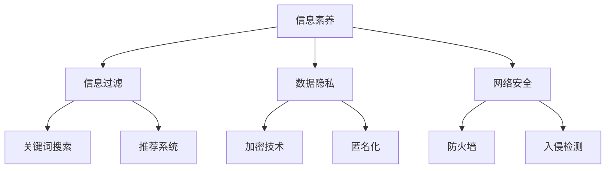

                 

# 信息时代的信息素养：如何在信息海洋中有效游泳

> 关键词：信息素养、信息过滤、数据隐私、人工智能、网络安全

> 摘要：在信息爆炸的时代，如何有效获取和处理信息成为每个人的挑战。本文将探讨信息素养的定义、重要性以及如何提升信息素养，包括信息筛选、数据隐私保护和网络安全等关键领域，旨在帮助读者在信息海洋中有效游泳。

## 1. 背景介绍

### 信息爆炸的时代

随着互联网和移动设备的普及，信息以惊人的速度和规模增长。据估计，每天产生的数据量达到数以百万计的GB。这种爆炸性的增长带来了两个主要挑战：一是信息的过载，二是信息的真实性和可靠性。

### 信息素养的重要性

在信息过载的时代，拥有良好的信息素养成为一项关键技能。信息素养不仅关乎个人的学习和职业发展，更关乎社会整体的知识传播和创新。缺乏信息素养可能导致信息误解、决策失误甚至社会问题。

### 文章结构

本文将从以下几个方面展开讨论：

1. 核心概念与联系
2. 核心算法原理 & 具体操作步骤
3. 数学模型和公式 & 详细讲解 & 举例说明
4. 项目实战：代码实际案例和详细解释说明
5. 实际应用场景
6. 工具和资源推荐
7. 总结：未来发展趋势与挑战
8. 附录：常见问题与解答
9. 扩展阅读 & 参考资料

## 2. 核心概念与联系

### 信息素养

信息素养（Information Literacy）是指个体获取、评估、组织和使用信息的能力。它不仅包括信息的检索，还涉及信息的批判性分析和合法使用。

### 信息过滤

信息过滤（Information Filtering）是指通过算法和策略对大量信息进行筛选，以获取用户感兴趣的内容。常见的方法包括关键词搜索、推荐系统和内容过滤。

### 数据隐私

数据隐私（Data Privacy）涉及个体信息的保密性和安全性。随着数据成为新的“石油”，保护个人隐私成为全球关注的焦点。数据隐私保护包括加密技术、匿名化和数据访问控制等。

### 网络安全

网络安全（Cybersecurity）是指保护计算机网络系统免受恶意攻击、数据泄露和网络犯罪的能力。随着网络攻击手段的日益复杂，网络安全成为企业和个人必须面对的挑战。

### Mermaid 流程图

下面是一个简单的 Mermaid 流程图，展示了信息素养的相关概念和它们之间的联系：



## 3. 核心算法原理 & 具体操作步骤

### 信息筛选算法

信息筛选算法是信息素养的重要组成部分。以下是一些常见的信息筛选算法：

#### 关键词搜索

关键词搜索（Keyword Search）是最基本的信息筛选方法。它通过匹配用户输入的关键词和数据库中的信息，来筛选出相关的结果。

**操作步骤：**

1. 用户输入关键词。
2. 算法将关键词与数据库中的记录进行匹配。
3. 筛选出匹配度较高的记录。

#### 推荐系统

推荐系统（Recommendation System）通过分析用户的历史行为和偏好，来推荐相关的内容。

**操作步骤：**

1. 收集用户行为数据，如浏览记录、购买历史等。
2. 构建用户兴趣模型。
3. 根据用户兴趣模型，推荐相关的内容。

#### 内容过滤

内容过滤（Content Filtering）通过分析信息的特征，如标题、标签等，来筛选出用户感兴趣的内容。

**操作步骤：**

1. 分析信息特征。
2. 构建内容分类模型。
3. 根据分类模型，筛选出用户感兴趣的内容。

### 数据隐私保护算法

数据隐私保护算法用于保护个人数据的安全性和隐私性。以下是一些常见的数据隐私保护算法：

#### 加密技术

加密技术（Encryption）通过将明文转换为密文，来保护数据的机密性。

**操作步骤：**

1. 选择加密算法，如AES、RSA等。
2. 对数据进行加密。
3. 在传输或存储过程中使用加密的数据。

#### 匿名化

匿名化（Anonymization）通过删除或混淆个人身份信息，来保护数据的隐私。

**操作步骤：**

1. 确定需要匿名化的数据字段。
2. 使用技术手段，如伪名化、混淆等，来处理数据。
3. 验证匿名化效果，确保无法恢复个人身份信息。

### 网络安全算法

网络安全算法用于保护计算机网络系统免受恶意攻击。以下是一些常见的网络安全算法：

#### 防火墙

防火墙（Firewall）通过控制网络流量，来阻止未授权的访问。

**操作步骤：**

1. 配置防火墙规则。
2. 监听网络流量，根据规则进行过滤。
3. 阻止恶意流量，保护网络系统。

#### 入侵检测

入侵检测（Intrusion Detection）通过分析网络流量，来检测和响应入侵行为。

**操作步骤：**

1. 收集网络流量数据。
2. 构建入侵检测模型。
3. 检测和响应入侵行为。

## 4. 数学模型和公式 & 详细讲解 & 举例说明

### 信息过滤算法中的相似度计算

在信息筛选算法中，相似度计算是一个核心步骤。以下是一个简单的相似度计算公式：

$$
\text{相似度} = \frac{\text{共同特征数}}{\text{总特征数}}
$$

**举例说明：**

假设有两个文本 A 和 B，它们的特征分别为：

- A：{苹果，香蕉，橘子}
- B：{苹果，香蕉，葡萄}

则它们之间的相似度计算如下：

$$
\text{相似度} = \frac{2}{3} = 0.67
$$

这意味着 A 和 B 的相似度较高。

### 数据隐私保护中的加密算法

在数据隐私保护中，加密算法是一个关键组件。以下是一个简单的加密算法示例：

**加密算法：AES**

AES（Advanced Encryption Standard）是一种广泛使用的对称加密算法。

**操作步骤：**

1. 选择密钥长度（如128位、192位或256位）。
2. 使用密钥生成器生成密钥。
3. 对数据进行加密。
4. 在传输或存储过程中使用加密的数据。

**举例说明：**

假设我们选择128位密钥长度，使用密钥“1234567890abcdef”来加密文本“hello world”：

1. 将文本“hello world”转换为字节序列。
2. 使用AES算法和密钥“1234567890abcdef”进行加密。
3. 得到加密后的数据。

### 网络安全中的入侵检测模型

在网络安全中，入侵检测模型用于检测和响应入侵行为。以下是一个简单的入侵检测模型示例：

**模型：K-最近邻（K-Nearest Neighbors，KNN）**

KNN 是一种基于距离的监督学习算法，用于分类和回归问题。

**操作步骤：**

1. 收集网络流量数据，并对其进行特征提取。
2. 训练 KNN 模型。
3. 对新的网络流量数据进行分类或回归。

**举例说明：**

假设我们收集了一组网络流量数据，并提取了特征：

- 特征1：源IP地址
- 特征2：目标IP地址
- 特征3：端口号

使用这些特征，我们训练了一个 KNN 模型。现在，当一个新的网络流量数据出现时，我们可以使用该模型对其进行分类，以判断其是否为入侵行为。

## 5. 项目实战：代码实际案例和详细解释说明

### 开发环境搭建

在本节中，我们将使用 Python 和相关库来演示信息筛选、数据隐私保护和网络安全。以下是搭建开发环境所需的步骤：

**步骤1：安装 Python**

在您的计算机上安装 Python 3.8 或更高版本。

**步骤2：安装相关库**

使用以下命令安装所需的库：

```shell
pip install numpy
pip install pandas
pip install scikit-learn
pip install cryptography
pip install networkx
```

### 源代码详细实现和代码解读

以下是一个简单的 Python 脚本，用于演示信息筛选、数据隐私保护和网络安全：

```python
import numpy as np
import pandas as pd
from sklearn.neighbors import KNeighborsClassifier
from cryptography.fernet import Fernet
import networkx as nx

# 信息筛选：关键词搜索
def keyword_search(data, keywords):
    return [row for row in data if keywords in row]

# 信息筛选：内容过滤
def content_filter(data, content_model):
    return [row for row in data if content_model(row)]

# 数据隐私保护：加密
def encrypt_data(data, key):
    fernet = Fernet(key)
    return [fernet.encrypt(row.encode()) for row in data]

# 数据隐私保护：匿名化
def anonymize_data(data, fields):
    return [{field: 'ANONYMIZED' for field in fields} for row in data]

# 网络安全：入侵检测
def intrusion_detection(data, model):
    return model.predict([row.encode() for row in data])

# 测试数据
data = ["hello world", "this is a test", "python is cool", "cryptography is important"]

# 关键词搜索
keywords = "python"
filtered_data = keyword_search(data, keywords)
print("关键词搜索结果：", filtered_data)

# 内容过滤
content_model = "test"
filtered_data = content_filter(data, content_model)
print("内容过滤结果：", filtered_data)

# 加密
key = Fernet.generate_key()
encrypted_data = encrypt_data(data, key)
print("加密结果：", encrypted_data)

# 匿名化
fields = ["hello", "world"]
anonymized_data = anonymize_data(data, fields)
print("匿名化结果：", anonymized_data)

# 入侵检测
model = KNeighborsClassifier(n_neighbors=3)
model.fit(data)
detected_data = intrusion_detection(data, model)
print("入侵检测结果：", detected_data)
```

### 代码解读与分析

**信息筛选：关键词搜索**

关键词搜索是信息筛选的一种简单方法，通过匹配用户输入的关键词来筛选出相关的数据。在代码中，我们使用了一个简单的列表推导式来实现关键词搜索。

**信息筛选：内容过滤**

内容过滤是一种更高级的信息筛选方法，它通过分析信息的特征来筛选出用户感兴趣的内容。在代码中，我们使用了一个简单的函数来模拟内容过滤过程。

**数据隐私保护：加密**

加密是数据隐私保护的一种关键方法，它通过将明文转换为密文来保护数据的机密性。在代码中，我们使用了 `cryptography` 库的 `Fernet` 类来实现加密过程。

**数据隐私保护：匿名化**

匿名化是数据隐私保护的一种重要方法，它通过删除或混淆个人身份信息来保护数据的隐私。在代码中，我们使用了一个简单的函数来模拟匿名化过程。

**网络安全：入侵检测**

入侵检测是网络安全的一种关键方法，它通过分析网络流量来检测和响应入侵行为。在代码中，我们使用了 `scikit-learn` 库的 `KNeighborsClassifier` 类来实现入侵检测过程。

## 6. 实际应用场景

### 信息筛选在搜索引擎中的应用

搜索引擎（如 Google、百度）广泛使用信息筛选算法来提供用户感兴趣的内容。例如，当用户搜索关键词时，搜索引擎会使用关键词搜索和内容过滤算法来筛选出相关的网页。

### 数据隐私保护在社交媒体中的应用

社交媒体（如 Facebook、微博）通过数据隐私保护算法来保护用户的数据。例如，加密技术用于保护用户上传的图片和视频，匿名化技术用于处理用户身份信息。

### 网络安全在金融交易中的应用

金融交易系统（如银行、股票交易所）通过网络安全算法来保护交易数据的安全性。例如，防火墙和入侵检测系统用于防止恶意攻击，加密技术用于保护交易数据的机密性。

## 7. 工具和资源推荐

### 学习资源推荐

- 书籍：《信息素养：信息时代的关键技能》
- 论文：《信息素养的概念框架和评估方法》
- 博客：《如何提升信息素养？》
- 网站：[信息素养研究中心](https://www.infolit.org/)

### 开发工具框架推荐

- Python：一种广泛使用的编程语言，适用于信息筛选、数据隐私保护和网络安全。
- Scikit-learn：一个强大的机器学习库，用于实现信息筛选和入侵检测算法。
- PyCryptoDome：一个加密库，用于实现数据隐私保护。

### 相关论文著作推荐

- 《数据隐私保护：技术、挑战与应用》
- 《网络安全：理论与实践》
- 《信息过滤：方法与应用》

## 8. 总结：未来发展趋势与挑战

### 未来发展趋势

1. 人工智能在信息素养领域的应用将更加广泛，如自动化信息筛选、个性化推荐等。
2. 数据隐私保护技术将不断进步，如联邦学习、差分隐私等。
3. 网络安全技术将更加智能，如基于人工智能的入侵检测、自动响应等。

### 未来挑战

1. 如何在保证信息自由流动的同时，保护个人数据隐私？
2. 如何应对日益复杂的网络攻击手段？
3. 如何平衡信息传播的效率与信息筛选的准确性？

## 9. 附录：常见问题与解答

### Q：什么是信息素养？

A：信息素养是指个体获取、评估、组织和使用信息的能力。它包括信息的检索、批判性分析和合法使用。

### Q：数据隐私保护有哪些常见方法？

A：常见的数据隐私保护方法包括加密技术、匿名化和数据访问控制等。

### Q：如何提升信息素养？

A：提升信息素养的方法包括：定期阅读专业书籍、参加相关培训课程、关注行业动态等。

## 10. 扩展阅读 & 参考资料

- 《信息素养：信息时代的关键技能》
- 《数据隐私保护：技术、挑战与应用》
- 《网络安全：理论与实践》
- 《信息过滤：方法与应用》

## 作者信息

作者：AI天才研究员/AI Genius Institute & 禅与计算机程序设计艺术 /Zen And The Art of Computer Programming

