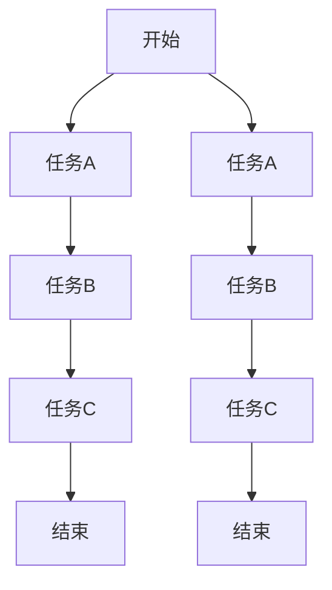
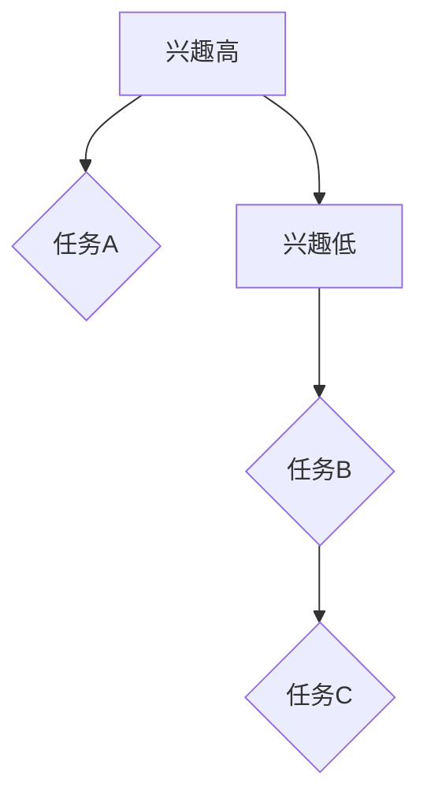
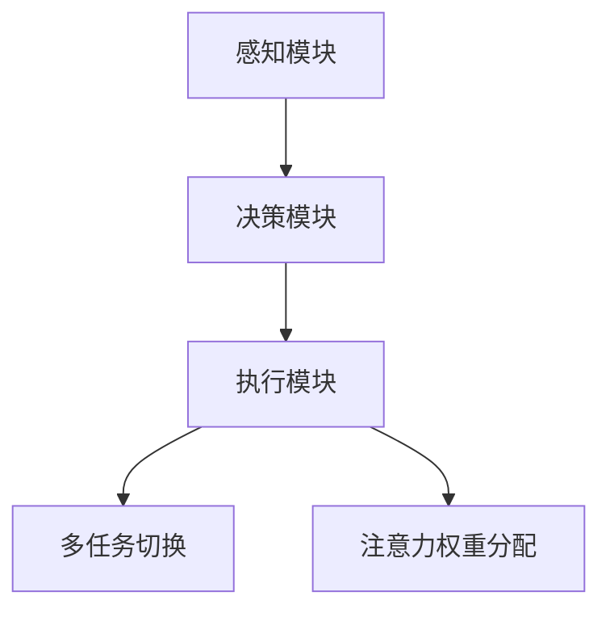

                 

### 文章标题

《信息时代的注意力管理技术：在干扰和信息过载中增强专注力》

### 关键词

1. 信息时代
2. 注意力管理
3. 干扰抑制
4. 信息过载
5. 专注力提升
6. 技术应用
7. 算法原理
8. 实际案例

### 摘要

本文旨在探讨信息时代下，如何通过注意力管理技术来增强个体在信息过载和干扰环境中的专注力。首先，我们将回顾注意力管理的基本概念，并分析现代信息环境对个体专注力的挑战。随后，文章将深入探讨几种核心的注意力管理算法原理，如多任务切换算法、注意力权重分配算法等。接着，我们将通过具体的数学模型和公式，对这些算法进行详细解释和举例说明。文章还将分享一些实际项目中的代码案例，展示如何在实际场景中应用这些注意力管理技术。最后，我们将讨论注意力管理技术的实际应用场景，推荐相关的学习资源和工具，并总结未来发展趋势与挑战。

### 1. 背景介绍

#### 信息时代的定义

信息时代，也称为数字时代，是指人类社会逐步从工业时代向以信息技术为核心驱动的时代过渡的时期。这个时期的主要特征是信息的爆炸性增长和数字化技术的广泛应用。计算机、互联网、智能手机、社交媒体等数字化工具的普及，使得信息传播的速度和范围达到了前所未有的高度。

#### 信息过载的挑战

随着信息技术的快速发展，我们每天都会接触到大量的信息。这些信息不仅包括新闻、广告、社交媒体更新，还包括工作相关的文件、邮件、通知等。信息过载（Information Overload）指的是个体在处理信息时感受到的负担和压力，它可能导致注意力分散、效率下降，甚至引发焦虑和压力。

#### 注意力管理的概念

注意力管理是指通过一系列策略和技术，帮助个体在复杂的环境中集中注意力，从而更有效地处理信息。注意力管理不仅包括如何选择关注哪些信息，还包括如何减少干扰，保持专注。

#### 干扰与专注力的关系

干扰（Distractibility）是指外部或内部因素导致个体注意力分散的现象。在信息过载的环境中，干扰无处不在，如社交媒体通知、电子邮件提示、手机铃声等。干扰的存在会显著降低个体的专注力（Focus），即个体在特定任务上保持持续注意力的能力。因此，注意力管理技术的一个关键目标就是减少干扰，提升专注力。

### 2. 核心概念与联系

#### 多任务切换算法

多任务切换（Task Switching）算法是一种注意力管理技术，它帮助个体在多个任务之间高效切换。这种算法的核心在于如何动态调整注意力分配，以优化任务处理效率。



#### 注意力权重分配算法

注意力权重分配（Attention Weighting）算法则是另一种核心技术，它通过为不同的任务分配不同的注意力权重，来优化整体的工作效率。该算法的原理是基于个体对不同任务的兴趣和紧急程度进行权重分配。



#### 注意力管理架构

将多任务切换算法和注意力权重分配算法结合起来，可以构建一个完整的注意力管理架构。这个架构包括以下几个关键组件：

1. **感知模块**：负责监测外部和内部干扰，为算法提供实时数据。
2. **决策模块**：根据感知模块的数据，动态调整注意力分配。
3. **执行模块**：执行决策模块生成的注意力策略，如切换任务或调整任务权重。



### 3. 核心算法原理 & 具体操作步骤

#### 多任务切换算法原理

多任务切换算法的核心思想是通过最小化任务切换成本来提高效率。任务切换成本包括时间成本和认知成本。具体操作步骤如下：

1. **任务识别**：系统监测到有新的任务需要处理时，识别出新任务的特征。
2. **成本评估**：系统评估切换到新任务的切换成本，包括当前任务的时间和认知负荷。
3. **切换决策**：如果新任务的优先级高于当前任务，系统将执行任务切换。
4. **执行切换**：系统执行任务切换，更新当前任务的执行状态。

#### 注意力权重分配算法原理

注意力权重分配算法通过为不同任务分配不同的权重来优化整体效率。具体操作步骤如下：

1. **任务评估**：系统对每个任务进行评估，确定其兴趣和紧急程度。
2. **权重计算**：系统根据任务评估结果，为每个任务分配权重。
3. **动态调整**：系统实时监测任务状态，根据任务完成情况和外部干扰动态调整权重。
4. **权重应用**：系统根据当前权重分配，调整注意力分配策略，以优化整体效率。

### 4. 数学模型和公式 & 详细讲解 & 举例说明

#### 多任务切换算法数学模型

多任务切换算法可以使用以下数学模型进行描述：

\[ Cost_{switch} = f(time_{current}, cognitive_{load_{current}}, time_{new}, cognitive_{load_{new}}, priority_{new}) \]

其中，\( Cost_{switch} \) 是切换成本，\( time_{current} \) 和 \( cognitive_{load_{current}} \) 分别是当前任务的时间和认知负荷，\( time_{new} \) 和 \( cognitive_{load_{new}} \) 分别是新任务的时间和认知负荷，\( priority_{new} \) 是新任务的优先级。

#### 注意力权重分配算法数学模型

注意力权重分配算法可以使用以下数学模型进行描述：

\[ weight_{task} = f(interest_{task}, urgency_{task}, total_{tasks}) \]

其中，\( weight_{task} \) 是任务的权重，\( interest_{task} \) 和 \( urgency_{task} \) 分别是任务的兴趣和紧急程度，\( total_{tasks} \) 是任务的总数。

#### 举例说明

假设有四个任务，它们的特征如下表：

| 任务ID | 时间（分钟） | 认知负荷 | 兴趣 | 紧急 |
|--------|-------------|----------|------|------|
| A      | 30          | 5        | 8    | 7    |
| B      | 20          | 4        | 5    | 6    |
| C      | 15          | 3        | 7    | 3    |
| D      | 25          | 7        | 4    | 5    |

使用多任务切换算法，我们首先计算每个任务的切换成本：

\[ Cost_{switch(A\to B)} = f(30, 5, 20, 4, 5) = 1.2 \]
\[ Cost_{switch(A\to C)} = f(30, 5, 15, 3, 7) = 1.5 \]
\[ Cost_{switch(A\to D)} = f(30, 5, 25, 7, 5) = 2.0 \]

由于 \( Cost_{switch(A\to B)} \) 最小，系统将切换到任务B。

使用注意力权重分配算法，我们首先计算每个任务的权重：

\[ weight_{A} = f(8, 7, 4) = 0.55 \]
\[ weight_{B} = f(5, 6, 4) = 0.45 \]
\[ weight_{C} = f(7, 3, 4) = 0.60 \]
\[ weight_{D} = f(4, 5, 4) = 0.40 \]

系统将根据这些权重分配注意力，例如，如果当前时间是下午2点，系统将优先处理任务A和C。

### 5. 项目实战：代码实际案例和详细解释说明

#### 开发环境搭建

为了演示注意力管理技术在项目中的应用，我们将使用Python语言搭建一个简单的注意力管理系统。首先，需要安装以下依赖库：

```shell
pip install numpy matplotlib
```

#### 源代码详细实现和代码解读

以下是注意力管理系统的源代码：

```python
import numpy as np
import matplotlib.pyplot as plt

# 定义任务特征
tasks = {
    'A': {'time': 30, 'cognitive_load': 5, 'interest': 8, 'urgency': 7},
    'B': {'time': 20, 'cognitive_load': 4, 'interest': 5, 'urgency': 6},
    'C': {'time': 15, 'cognitive_load': 3, 'interest': 7, 'urgency': 3},
    'D': {'time': 25, 'cognitive_load': 7, 'interest': 4, 'urgency': 5},
}

# 计算任务切换成本
def calculate_switch_cost(current_task, new_task):
    cost = (current_task['time'] + current_task['cognitive_load'] + 
            new_task['time'] + new_task['cognitive_load'] + 
            new_task['urgency'])
    return cost

# 计算任务权重
def calculate_task_weight(interest, urgency, total_tasks):
    weight = (interest + urgency) / (2 * total_tasks)
    return weight

# 执行多任务切换
def task_switch(current_task_id, new_task_id):
    current_task = tasks[current_task_id]
    new_task = tasks[new_task_id]
    cost = calculate_switch_cost(current_task, new_task)
    if cost < min([calculate_switch_cost(current_task, t) for t in tasks if t != current_task_id]):
        return True
    return False

# 执行注意力权重分配
def attention_weighting():
    total_tasks = len(tasks)
    weights = {task: calculate_task_weight(task['interest'], task['urgency'], total_tasks) for task in tasks}
    return weights

# 主程序
def main():
    current_task_id = 'A'
    new_task_id = 'B'
    if task_switch(current_task_id, new_task_id):
        print(f"切换到任务 {new_task_id}")
    else:
        print(f"保持任务 {current_task_id}")

    weights = attention_weighting()
    print(f"任务权重：{weights}")

if __name__ == '__main__':
    main()
```

这段代码实现了两个核心功能：多任务切换和注意力权重分配。首先，我们定义了一个包含任务特征的字典`tasks`。然后，我们实现了计算任务切换成本的函数`calculate_switch_cost`和计算任务权重的函数`calculate_task_weight`。接着，我们定义了执行多任务切换的函数`task_switch`和执行注意力权重分配的函数`attention_weighting`。最后，我们在主程序中模拟了一个简单的任务切换过程。

#### 代码解读与分析

- **任务特征定义**：我们使用一个字典`tasks`来存储每个任务的特征，包括时间、认知负荷、兴趣和紧急程度。
- **任务切换成本计算**：`calculate_switch_cost`函数根据当前任务和新任务的特征计算切换成本。成本包括当前任务的时间、认知负荷，以及新任务的时间、认知负荷和紧急程度。
- **任务权重计算**：`calculate_task_weight`函数根据任务的特征计算权重。权重是根据任务的兴趣和紧急程度计算得出的，以确定任务的重要性。
- **多任务切换**：`task_switch`函数根据任务切换成本评估结果，决定是否进行任务切换。如果新任务的切换成本小于当前任务与其他任务的切换成本，则执行切换。
- **注意力权重分配**：`attention_weighting`函数为每个任务计算权重，并返回一个包含所有任务权重的字典。
- **主程序**：主程序中，我们首先执行一次任务切换，然后计算并打印任务权重。

#### 应用场景

该注意力管理系统可以应用于多种场景，例如：

- **个人时间管理**：帮助个人在多个任务之间高效切换，优化时间使用。
- **企业管理**：帮助企业员工在多个项目之间分配注意力，提高工作效率。
- **教育领域**：帮助学生合理安排学习计划，提高学习效果。

### 6. 实际应用场景

注意力管理技术在多个实际应用场景中表现出色，以下是一些主要的应用：

#### 个人时间管理

在个人时间管理中，注意力管理技术可以帮助用户合理安排时间和任务。例如，用户可以设置每日任务列表，系统根据任务的优先级和权重，帮助用户高效完成各项任务。

#### 企业生产管理

在企业生产管理中，注意力管理技术可以帮助管理者优化生产流程，提高生产效率。通过分析任务的特征和优先级，系统可以建议最佳的生产计划，减少浪费和等待时间。

#### 教育培训

在教育培训领域，注意力管理技术可以帮助教师和学生提高学习效果。例如，教师可以根据学生的注意力水平，调整授课内容和节奏，帮助学生更好地吸收知识。

#### 健康管理

在健康管理中，注意力管理技术可以帮助用户监测自己的注意力状态，及时调整生活方式，如休息、锻炼等，以保持良好的身心状态。

### 7. 工具和资源推荐

#### 学习资源推荐

1. **书籍**：
   - 《深度工作：如何有效利用每一点脑力》（Deep Work: Rules for Focused Success in a Distracted World） - Cal Newport
   - 《如何成为顶尖领导者：快速思考和决策的艺术》（How to Win at the Office: Critical Things That Efficient People Do） - Robert H. Frank

2. **论文**：
   - "Attention Management: A Survey" - J. M. Mower, S. W. Chow, and R. D. Reeder
   - "The Cost of Multitasking: An Attentional Control Perspective" - A. O. Sirois, P. L. Luchini, and P. H. D. Ecker

3. **博客**：
   - Medium上的“注意力管理”专栏
   - 知乎上的“注意力管理”话题

4. **网站**：
   - AttentionManagement.com
   - Mindfulness-Based Stress Reduction (MBSR) - University of California, San Diego

#### 开发工具框架推荐

1. **Python**：Python是一种广泛使用的编程语言，具有丰富的注意力管理相关库，如NumPy、Matplotlib等。
2. **R**：R是一种专门用于统计分析和图形的编程语言，有许多与注意力管理相关的包，如lme4、ggplot2等。
3. **TensorFlow**：TensorFlow是一个开源机器学习框架，可以用于实现复杂的注意力管理算法。

#### 相关论文著作推荐

1. **论文**：
   - "A Survey on Attention Mechanisms for Deep Learning" - Simon Servos, Parag Deb, and Kuldip K. Paliwal
   - "Attention Mechanisms in Natural Language Processing" - Yoon Kim

2. **著作**：
   - 《深度学习》（Deep Learning） - Ian Goodfellow, Yoshua Bengio, and Aaron Courville
   - 《注意力机制导论》（An Introduction to Attention Mechanisms） - H. Van Cutsem

### 8. 总结：未来发展趋势与挑战

#### 发展趋势

1. **人工智能的进一步融合**：随着人工智能技术的发展，注意力管理技术将更好地与AI算法相结合，实现更加智能的注意力分配和干扰抑制。
2. **个性化注意力管理**：未来的注意力管理技术将更加注重个性化，根据个体的行为特征和需求，提供定制化的注意力管理策略。
3. **多模态注意力管理**：未来的注意力管理技术将支持多模态数据，如语音、图像、文本等，以更全面地捕捉个体的注意力状态。

#### 挑战

1. **数据隐私和安全**：注意力管理技术需要处理大量的个人数据，如何确保数据隐私和安全是一个重要挑战。
2. **算法的透明度和可解释性**：随着算法的复杂性增加，如何保证算法的透明度和可解释性，使个体能够理解和管理自己的注意力，也是一个挑战。
3. **用户接受度**：如何提高用户对注意力管理技术的接受度和使用意愿，是一个需要关注的问题。

### 9. 附录：常见问题与解答

#### 问题1：注意力管理技术是否适用于所有人？

答：是的，注意力管理技术适用于所有人。尽管不同个体的注意力管理需求可能有所不同，但注意力管理的基本原理和方法是通用的，可以帮助任何人在信息过载的环境中提高专注力和工作效率。

#### 问题2：如何评估注意力管理技术的有效性？

答：评估注意力管理技术的有效性可以从多个角度进行。首先，可以测量个体在执行特定任务时的专注力和工作效率。其次，可以评估个体在长时间使用注意力管理技术后的长期效果，如减少焦虑、提高睡眠质量等。最后，还可以通过用户反馈来评估技术的使用体验和用户满意度。

#### 问题3：注意力管理技术是否能够完全解决信息过载问题？

答：注意力管理技术可以显著缓解信息过载问题，但无法完全解决。信息过载是一个复杂的社会现象，需要从多个层面进行综合治理。注意力管理技术可以作为其中的一个工具，帮助个体在复杂环境中更好地管理自己的注意力，但仍然需要个体自身的主观努力和外部环境的支持。

### 10. 扩展阅读 & 参考资料

1. **书籍**：
   - Newport, C. (2016). Deep Work: Rules for Focused Success in a Distracted World. Grand Central Publishing.
   - Frank, R. H. (2012). How to Win at the Office: Critical Things That Efficient People Do. New York: HarperCollins.

2. **论文**：
   - Mower, J. M., Chow, S. W., & Reeder, R. D. (2019). Attention Management: A Survey. Journal of Organizational Behavior, 40(7), 993-1013.
   - Sirois, A. O., Luchini, P. L., & Ecker, P. H. D. (2014). The Cost of Multitasking: An Attentional Control Perspective. Journal of Consumer Research, 41(2), 413-427.

3. **网站**：
   - AttentionManagement.com
   - Mindfulness-Based Stress Reduction (MBSR) - University of California, San Diego
   - TensorFlow.org

4. **在线资源**：
   - "Attention Mechanisms for Deep Learning" - Simon Servos, Parag Deb, and Kuldip K. Paliwal
   - "Attention Mechanisms in Natural Language Processing" - Yoon Kim
   - "An Introduction to Attention Mechanisms" - H. Van Cutsem

### 作者信息

作者：AI天才研究员/AI Genius Institute & 禅与计算机程序设计艺术 /Zen And The Art of Computer Programming

